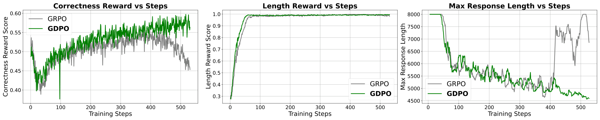
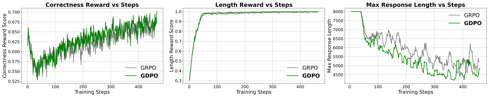
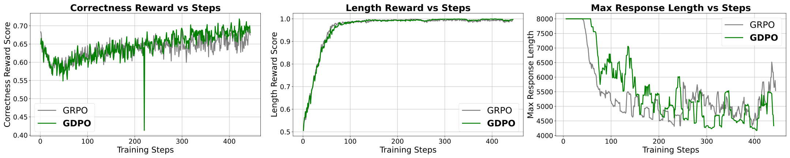

# GDPO：用“去耦归一化”解决多奖励 RL 训练信号塌缩

这篇论文聚焦一个经常被忽视的问题： **多奖励 RL 里直接套用 GRPO 可能会把训练信号“压扁”** 。作者提出 GDPO（Group reward-Decoupled Normalization Policy Optimization），通过“按奖励分开归一化 + 批量归一化”的方式，保留不同奖励组合的差异，从而显著提升训练稳定性和多任务表现。

下面按照“问题 → 方法 → 实验 → 结论”的逻辑，做一篇 **长篇精炼解读** 。

---

## 1. 背景：多奖励 RL 里，GRPO 真的合适吗？

随着 LLM 的应用越来越复杂，我们经常需要同时优化多个目标：  
    - 正确性  
    - 格式规范  
    - 输出长度  
    - Bug 率  
    - 安全性/对齐指标  

这些目标在实际系统中就是 **多奖励强化学习** （Multi-reward RL）。  
目前业界常见做法是： **把所有奖励加起来，然后用 GRPO 优化** 。

问题是： **加起来再归一化会丢信息** 。  
当多个奖励组合在一起时，GRPO 会把不同组合映射到相同的 Advantage 值，这相当于 **把细粒度偏好压成了粗粒度信号** ，导致训练不稳定甚至塌缩。

---

## 2. 关键问题：GRPO 在多奖励下的“信号塌缩”

论文给了一个非常直观的例子：

    - 两个二值奖励 $r_1, r_2 \in \{0,1\}$  
    - 每次 rollout 两个样本  
    - 可能的奖励组合包括 $(0,1)$、$(0,2)$、$(1,2)$ 等  

GRPO 的做法是先求和，然后组内归一化。结果是：

    - $(0,1)$ 和 $(0,2)$ 在 GRPO 里得到 **完全相同** 的优势  
    - 训练信号无法区分 “拿到一个奖励” 和 “两个奖励都拿到”

这会导致两类问题：  
    1. **优化信号分辨率变低** （advantage groups 太少）  
    2. **训练稳定性变差** （甚至出现 early collapse）  

---

## 3. 方法：GDPO 的核心改动

GDPO 的核心思想非常简单，但效果很好：

### ✅ 步骤 1：每个奖励单独做组内归一化

对每个 reward 单独计算：

$$
A_k^{(i,j)} =
\frac{r_k^{(i,j)} - \mathrm{mean}(r_k^{(i,1)},\ldots,r_k^{(i,G)})}
{\mathrm{std}(r_k^{(i,1)},\ldots,r_k^{(i,G)})}
$$

### ✅ 步骤 2：把归一化后的各奖励加起来

$$
A_{\text{sum}}^{(i,j)} = A_1^{(i,j)} + \cdots + A_n^{(i,j)}
$$

### ✅ 步骤 3：再做一次 **batch-wise** 归一化

$$
\hat{A}^{(i,j)}_{\text{sum}} =
\frac{A_{\text{sum}}^{(i,j)}-\mathrm{mean}(\text{batch})}
{\mathrm{std}(\text{batch})+\epsilon}
$$

这样可以保证：  
    - **奖励数量增加时，优势不会无限放大**  
    - 同时保留细粒度组合差异  
    - 训练更稳定  

---

## 4. 图解理解：GDPO vs GRPO

  
> 图解：这是两奖励两 rollouts 的例子，GRPO 只产生 2 个优势群，而 GDPO 能区分更多组合，训练信号更细。

  
> 图解：随着 reward 数量和 rollout 数量增加，GDPO 能保持更多 distinct advantage groups，而 GRPO 迅速塌缩。

---

## 5. 实验 1：Tool Calling

任务：同时优化 **格式奖励** 和 **正确性奖励**

  
> 图解：GDPO 在正确性和格式奖励上都稳定上升，而 GRPO w/o std 在格式奖励完全失败。

**结论** ：GDPO 更稳定，同时格式合规率显著提升。

---

## 6. 实验 2：数学推理（accuracy + length）

这一实验比较经典：  
目标是 **提高数学正确率** ，同时 **限制输出长度** 。

  
> 图解：GRPO 在训练后期出现正确率下降、最大输出长度暴涨的现象；GDPO 维持稳定上升。

  
> 图解：更大模型上趋势相同，GDPO 更稳定。

  
> 图解：Qwen3-4B 也呈现相同趋势，GDPO 长度控制更稳定。

---

## 7. 实验 3：Coding Reasoning（三奖励）

加入第三个目标： **Bug Reward**  
同时优化：  
    - Pass Rate  
    - Length Constraint  
    - Bug Ratio  

结论： **GDPO 在 2-obj 和 3-obj 场景下都优于 GRPO** ，且 bug ratio 明显下降。

---

## 8. Reward 优先级问题：权重 vs 条件奖励

论文还讨论了一个实用问题：

**当某个目标比另一个目标容易很多时，单纯调权重没用。**

他们提出：  
    - 使用 **条件奖励** （例如只有正确时才给 length reward）  
    - 可以更好地引导模型先优化难目标  

公式如下：

$$
\tilde{\mathcal{R}}_{\text{length}} =
\begin{cases}
1, & \text{if response length} \leq l \text{ and } \mathcal{R}_{\text{correct}} = 1 \\
0, & \text{otherwise}
\end{cases}
$$

结果显示：  
GDPO + 条件奖励可以更好地在 accuracy 和 length 之间做平衡。

---

## 9. 关键 takeaway

    - **GRPO 在多奖励场景下会“压缩信号”**  
    - **GDPO 用去耦归一化保留优势差异**  
    - **训练更稳定，效果更好，适配多任务**  
    - **奖励权重在难度差异大时无效，条件奖励更靠谱**  

---

## 10. 结论与展望

GDPO 并不是重构 RL 框架，而是对 GRPO 做了一个 **非常轻量但关键的改动** 。  
它解决了多奖励 RL 中长期存在但被忽略的问题：

    - 信号分辨率低  
    - 优势塌缩  
    - 训练不稳定  

在工具调用、数学推理、编程推理三大任务上，GDPO 都体现出明显优势。  
从实践角度看，它非常适合用作 **多奖励 LLM RLHF 或 RLAIF 的默认优化方式** 。

---

本文参考自 GDPO: Group reward-Decoupled Normalization Policy Optimization for Multi-reward RL Optimization  
https://arxiv.org/abs/2601.05242