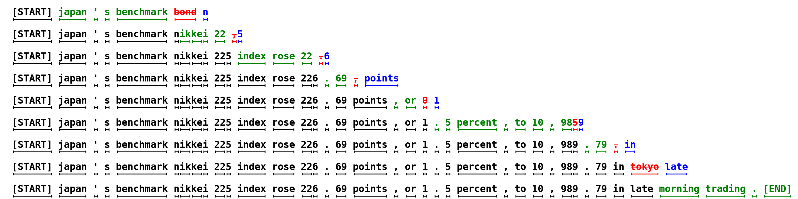
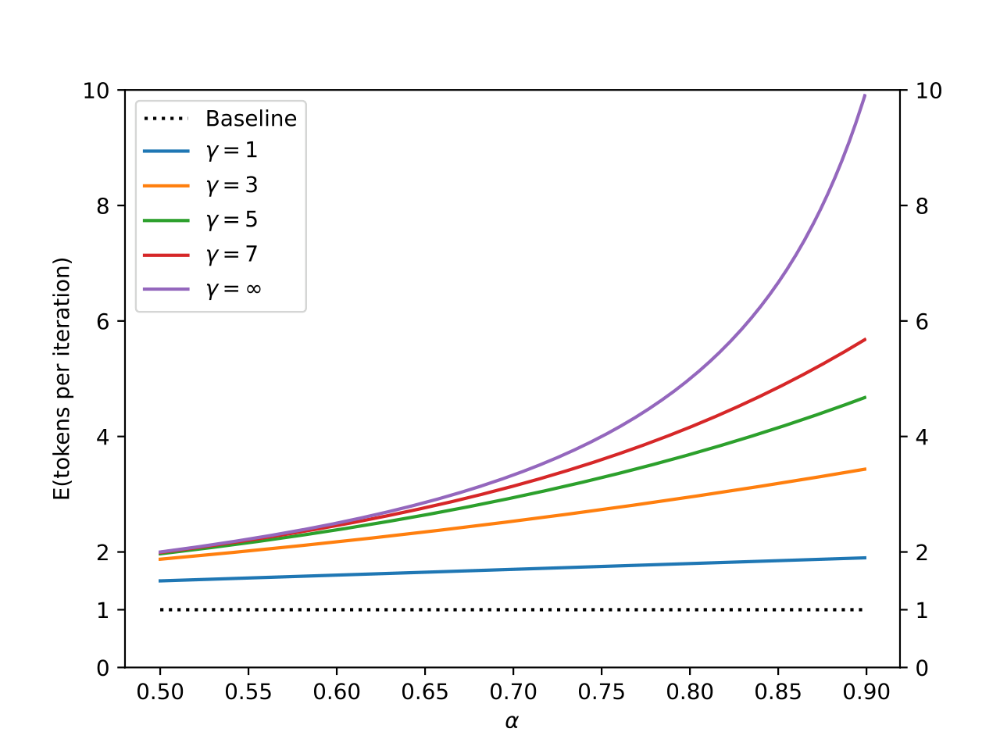
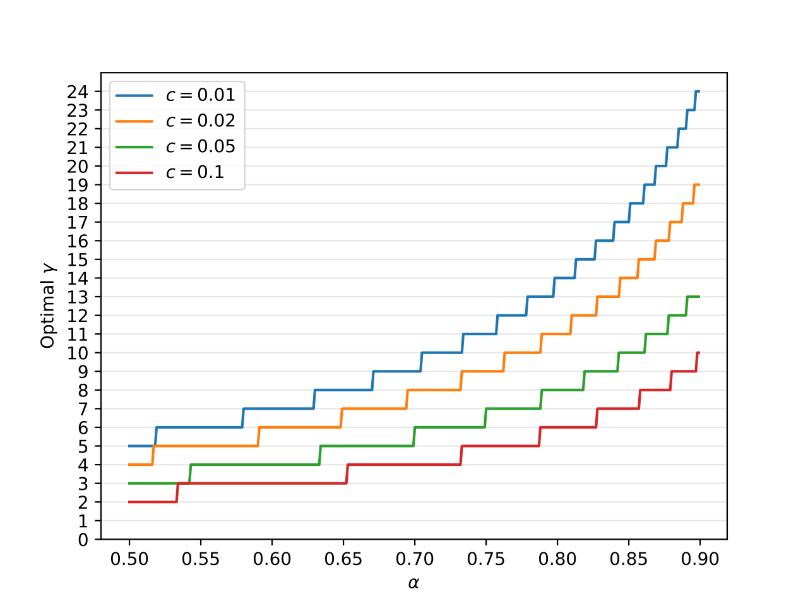
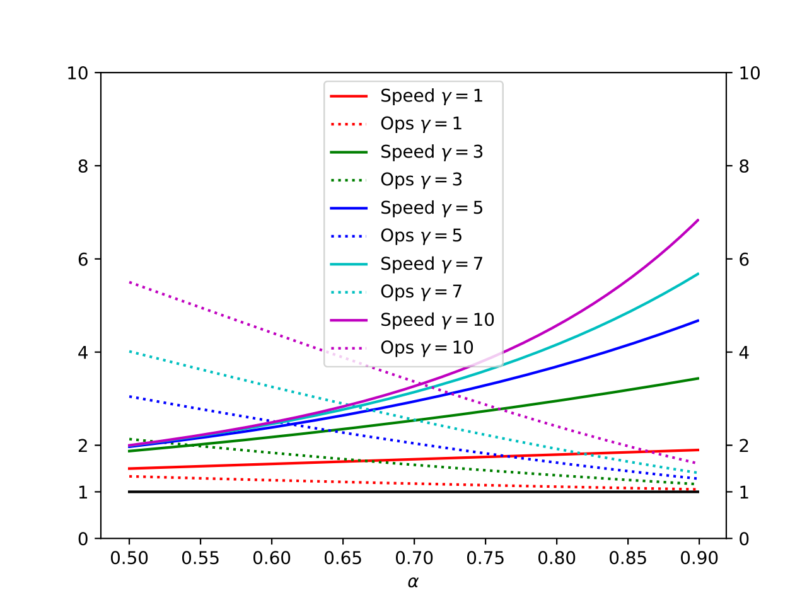
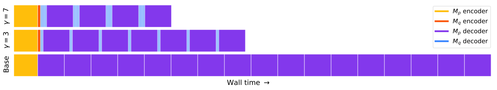

# Fast Inference from Transformers via Speculative Decoding：投机采样让大模型推理提速 3 倍

大模型推理有个让人头疼的问题：解码 K 个 token 就要串行跑 K 次模型，自回归的"一个字一个字往外蹦"把延迟死死锁住。Google Research 这篇 ICML 2023 的论文提出了 **Speculative Decoding（投机解码）**——用一个小的"草稿模型"先猜出多个 token，再让大模型 **并行** 验证，猜对就全部收下，猜错就从大模型的修正分布里补一个。最妙的是，这套方法有严格的数学证明保证 **输出分布与大模型单独采样完全一致**，不改架构、不重训练、不改输出。在 T5-XXL（11B）上的实测结果是：相对高度优化的 T5X 实现，推理加速 **2X–3X**（argmax 采样下最高 3.4X），输出逐 token 相同。

## 一、问题的提出：大模型推理慢在哪里

GPT-3、LaMDA、PaLM 这些大型自回归模型的能力毋庸置疑，但它们每一步解码都比小模型慢得多，而且这些步骤必须 **串行** 执行——这是延迟的根源。

已有的加速路线大致分两类：

- **普惠式压缩**：蒸馏、稀疏化、量化、架构改造（如 Multi-Query Attention），对所有输入一视同仁地降成本；
- **自适应计算（Adaptive Computation）**：观察到"有的步骤难、有的步骤容易"，对简单步骤少算一点，比如 Early Exit、自适应 Attention Span。

这两条路线都很有效，但共同的短板是：要改架构、要改训练流程、要重新训练，而且 **输出会变**。

本文的观察有两点：

1. 难的推理任务里往往藏着简单的子任务，小模型可以很好地近似；
2. 大模型推理的瓶颈常常不是算术运算量，而是 **内存带宽和通信**——也就是说，算力其实是闲置的。

既然算力闲置，那就别想着"少算"，反过来想"多并发"。这就是投机执行（Speculative Execution）的思路——处理器里经典的优化技术，典型例子是分支预测：不等验证结果出来，先猜着往下执行。本文把它推广到了 **随机采样** 的场景。

## 二、核心方法：Speculative Decoding

### 2.1 整体思路：小模型打草稿，大模型并行验收

先定义角色：

- $M_p$：目标模型（target model），就是我们要加速的那个又大又慢的模型，输出分布记为 $p(x)$；
- $M_q$：近似模型（approximation model），同任务上便宜得多的小模型，输出分布记为 $q(x)$。

每一轮迭代做三件事：

1. 用 $M_q$ 自回归地生成 $\gamma$ 个猜测 token；
2. 用 $M_p$ **并行** 验证这 $\gamma$ 个猜测——把所有前缀拼成一个 batch 一次算完；
3. 按一套精心设计的接受/拒绝规则决定收下多少个猜测，并从调整后的分布补采一个 token。

关键性质：每轮 **至少** 产出 1 个新 token（所以最坏情况也不会比标准自回归更差），最好情况一轮产出 $\gamma + 1$ 个。

> 图解：一个真实生成例子。绿色 token 是草稿模型（6M 参数）提出且被目标模型（97M 参数）接受的；红色是被拒绝的猜测；蓝色是拒绝后从修正分布采到的"补丁"token。整句话 38 个 token，目标模型只串行跑了 9 次。比如第一行，大模型只跑了一次就产出了 5 个 token。

### 2.2 采样方式的标准化

argmax、top-k、nucleus、temperature 这些采样方式看似五花八门，其实都可以归结为"对调整后的概率分布做标准采样"。比如 argmax 等价于把非最大元素清零再归一化。所以全文只需讨论标准采样，$p(x)$ 和 $q(x)$ 默认是已经按目标采样方式调整过的分布。

### 2.3 Speculative Sampling：保证分布不变的接受规则

这是全文的数学核心。想从 $p(x)$ 采样，先从 $q(x)$ 采一个 $x$：

- 若 $q(x) \le p(x)$：直接接受；
- 若 $q(x) > p(x)$：以 $1 - \frac{p(x)}{q(x)}$ 的概率拒绝，然后从修正分布重新采样：

$$
p'(x) = \text{norm}\left(\max(0, p(x) - q(x))\right)
$$

直觉上可以这样理解：小模型高估了某个 token 的概率（$q(x) > p(x)$），就按比例打回去；被拒绝后，从"$p$ 比 $q$ 多出来的那部分质量"里补采，把分布差额精确补齐。附录给出了严格证明（见第五节），对任意 $p$、$q$ 都有 $x \sim p(x)$。

**笔者认为这个设计的聪明之处在于**：它不像经典拒绝采样那样需要知道 $M = \max_x \frac{p(x)}{q(x)}$ 这个全局常数（论文附录证明，用经典拒绝采样的话接受率最多是 $\sum_x p(x)\min_{x'}\frac{q(x')}{p(x')}$，可能远低于本方法的 $\alpha$），而且拒绝后不是推倒重来，而是从残差分布补采——一次大模型调用都不浪费。

### 2.4 完整算法

把上面的单步推广到 $\gamma$ 个猜测，就是论文的 Algorithm 1（SpeculativeDecodingStep）：

1. **草稿阶段**：用 $M_q$ 自回归采样 $\gamma$ 个 token $x_1, \ldots, x_\gamma$，依次得到分布 $q_1(x), \ldots, q_\gamma(x)$；
2. **并行验证**：一次并行计算 $M_p(prefix), M_p(prefix + [x_1]), \ldots, M_p(prefix + [x_1, \ldots, x_\gamma])$，得到 $p_1(x), \ldots, p_{\gamma+1}(x)$；
3. **确定接受数 $n$**：抽 $\gamma$ 个均匀随机数 $r_i \sim U(0,1)$，找到第一个满足 $r_i > \frac{p_i(x_i)}{q_i(x_i)}$ 的位置，$n$ 就是它之前的接受个数（全对则 $n = \gamma$）；
4. **补一个 token**：若 $n = \gamma$（全接受），直接从 $p_{\gamma+1}(x)$ 采样；否则从 $\text{norm}(\max(0, p_{n+1}(x) - q_{n+1}(x)))$ 采样修正 token；
5. 返回 $prefix + [x_1, \ldots, x_n, t]$。

注意第 2 步里 $M_p$ 的 $\gamma + 1$ 次前向是并行完成的，这就是"用并发换延迟"的核心操作。

## 三、理论分析：能加速多少，代价是什么

方法讲清楚了，接下来的问题是定量回答：一轮平均能产出几个 token？整体能加速多少？什么时候值得用？论文给出了相当漂亮的一套分析。

### 3.1 接受率与期望产出 token 数

定义 **接受率** $\beta$：给定前缀时，$x_t \sim q(x_t|x_{<t})$ 被投机采样接受的概率。假设各步的 $\beta$ 独立同分布，记 $\alpha = E(\beta)$，那么单轮产出的 token 数是一个"截断几何分布"，期望为：

$$
E(\#\ \text{generated tokens}) = \frac{1 - \alpha^{\gamma + 1}}{1 - \alpha}
$$

> 图解：横轴是接受率 $\alpha$，纵轴是单轮期望产出的 token 数，不同曲线对应不同的 $\gamma$。可以看到 $\alpha$ 越高、$\gamma$ 越大，单轮产出越多；$\alpha = 0.8$ 且 $\gamma$ 较大时，一轮就能产出约 5 个 token。

### 3.2 $\alpha$ 怎么算：一个自然的散度

$\alpha$ 能否从 $p$、$q$ 直接算出来？论文定义了一个散度 $D_{LK}$：

$$
D_{LK}(p, q) = \sum_{x}\left|p(x) - M(x)\right|, \quad M(x) = \frac{p(x) + q(x)}{2}
$$

可以证明 $D_{LK}(p, q) = 1 - \sum_x \min(p(x), q(x))$，它是取值在 $[0, 1]$ 的对称散度：$p = q$ 时为 0，两者支撑集不相交时为 1。

进一步推导可得接受率的闭式表达：

$$
\beta = 1 - D_{LK}(p, q) = \sum_x \min(p(x), q(x))
$$

因此 $\alpha = 1 - E(D_{LK}(p, q)) = E(\sum_x \min(p, q))$。直觉很直白：**两个分布重合得越多，接受率越高**。这也解释了为什么草稿模型越大、越像目标模型，$\alpha$ 就越高（实验部分有验证）。

### 3.3 墙钟时间（Walltime）收益

定义 **成本系数** $c$：跑一次 $M_q$ 的时间除以跑一次 $M_p$ 的时间。实验中 $M_q$ 通常比 $M_p$ 小两个数量级，$c$ 一般小于 0.05。假设 $\gamma + 1$ 次 $M_p$ 并行不增加墙钟时间，则期望加速比为：

$$
\text{Walltime improvement} = \frac{1 - \alpha^{\gamma + 1}}{(1 - \alpha)(\gamma c + 1)}
$$

推导很简洁：一轮的成本是 $Tc\gamma + T$（$\gamma$ 次小模型加一次大模型），除以期望产出的 token 数，再与标准解码的单 token 成本 $T$ 相比即得。

一个重要的推论：**只要 $\alpha > c$，就存在某个 $\gamma$ 能带来加速**，且加速比至少为 $\frac{1 + \alpha}{1 + c}$（取 $\gamma = 1$ 即可看出）。也就是说，只要草稿模型的"相似度"高于它的"相对成本"，投机解码就稳赚不赔。

### 3.4 算术运算量的代价

天下没有免费的午餐：加速的代价是总运算量上升。设 $\hat{c}$ 为 $M_q$ 与 $M_p$ 单 token 运算量之比，总运算量增加的期望倍数为：

$$
\frac{(1 - \alpha)(\gamma \hat{c} + \gamma + 1)}{1 - \alpha^{\gamma + 1}}
$$

接受猜测时并发是"免费"的，拒绝时则浪费了算力。所以 $\alpha$ 越低，浪费越多。值得注意的是，对 Transformer decoder 来说，一轮投机解码的总运算量（不计 $M_q$）上界就是一次同尺寸 encoder 前向；而 **内存访问量反而下降**——大模型权重和 KV cache 每轮只读一次，读取次数缩减 $\frac{1 - \alpha^{\gamma+1}}{1-\alpha}$ 倍。在内存带宽受限的场景下，这恰恰是主要收益来源。

### 3.5 如何选择 $\gamma$

给定 $c$ 和 $\alpha$，最优 $\gamma$ 就是最大化墙钟收益公式的整数值，直接数值搜索即可。

> 图解：横轴为 $\alpha$，纵轴为最优 $\gamma$，不同曲线对应不同成本系数 $c$。$\alpha$ 越高、$c$ 越小，就越值得多猜几个；$c$ 接近 0 且 $\alpha$ 高时，最优 $\gamma$ 可以到 10 以上。

下表展示了 $c = \hat{c} = 0$ 的理想情形下，不同 $\alpha$、$\gamma$ 组合下"加速"与"运算量膨胀"的权衡：

| $\alpha$ | $\gamma$ | 运算量倍数 | 加速倍数 |
| --- | --- | --- | --- |
| 0.6 | 2 | 1.53X | 1.96X |
| 0.7 | 3 | 1.58X | 2.53X |
| 0.8 | 2 | 1.23X | 2.44X |
| 0.8 | 5 | 1.63X | 3.69X |
| 0.9 | 2 | 1.11X | 2.71X |
| 0.9 | 10 | 1.60X | 6.86X |

> 表格解读：接受率越高，可以激进地把 $\gamma$ 调大——$\alpha = 0.9$、$\gamma = 10$ 时加速可达 6.86 倍，而运算量只增加 60%。

> 图解：横轴为 $\alpha$，纵轴分别为加速倍数与运算量增长倍数，多条曲线对应不同 $\gamma$。可以直观看到两条曲线族的走向：$\alpha$ 越大，加速越高且运算量浪费越少。

> 图解：完整 encoder-decoder Transformer 的简化 trace 图。最上一行是 $\gamma = 7$ 的投机解码：每次紫色大块（$M_p$）调用前都有 7 次蓝色小块（$M_q$）调用，左侧黄色和橙色块分别是两个模型的 encoder。中间一行是 $\gamma = 3$，最底行是标准解码。一眼就能看出同样生成这么多 token，投机解码需要的串行大模型调用次数少得多。

还有一个诱人的改进方向：既然各位置的 $\beta$ 并不恒定，可以在运行中动态调整 $\gamma$。若有"$\gamma$ 预言机"，期望产出 token 数可达 $\frac{1}{1-\alpha}$，墙钟收益最多再提高约 60%。论文把这条路留给了未来工作。

### 3.6 草稿模型怎么选

理论上，投机采样对 **任意** $M_q$ 都保证输出分布不变，所以草稿模型的选择完全是工程自由度。论文实验发现：与 $M_p$ 同架构、小两个数量级的现成模型通常最优，平衡了 $\alpha$ 与 $c$。

更有意思的是几类 **零成本近似模型**（$c \approx 0$）：

- **n-gram 模型**：查表即可，成本忽略不计。令人意外的是，英德翻译任务上一个平凡的 bigram 模型也能拿到 $\alpha \approx 0.2$，配合 $\gamma = 3$ 就有 1.25X 的加速；
- **复制启发式**：摘要、对话等场景中长片段经常重复，发现匹配前缀就直接复制上下文 token，$\alpha$ 可能很高，且部署极简；
- **非自回归模型**：比如 Blockwise Parallel Decoding 训练的模型，一次调用代替自回归循环；
- **随机模型**：纯随机选 token 也能保证有一点点加速——理论上对所有 $M_p$ 都成立，当然增益极小。

## 四、实验验证

### 4.1 T5-XXL 实测墙钟加速

实验设置：标准 encoder-decoder T5 1.1 版本，两个任务——英德翻译（WMT EnDe 微调）和新闻摘要（CNN/DM 微调）。$M_p$ 用 T5-XXL（11B），$M_q$ 分别测试现成的 T5-large（800M）、T5-base（250M）、T5-small（77M），全部使用现成 checkpoint、不做任何额外训练。单张 TPU-v4、batch size 1，分别测试 argmax（temp=0）和标准采样（temp=1）。

| 任务 | $M_q$ | Temp | $\gamma$ | $\alpha$ | 加速 |
| --- | --- | --- | --- | --- | --- |
| EnDe | T5-small ★ | 0 | 7 | 0.75 | **3.4X** |
| EnDe | T5-base | 0 | 7 | 0.80 | 2.8X |
| EnDe | T5-large | 0 | 7 | 0.82 | 1.7X |
| EnDe | T5-small ★ | 1 | 7 | 0.62 | **2.6X** |
| EnDe | T5-base | 1 | 5 | 0.68 | 2.4X |
| EnDe | T5-large | 1 | 3 | 0.71 | 1.4X |
| CNNDM | T5-small ★ | 0 | 5 | 0.65 | **3.1X** |
| CNNDM | T5-base | 0 | 5 | 0.73 | 3.0X |
| CNNDM | T5-large | 0 | 3 | 0.74 | 2.2X |
| CNNDM | T5-small ★ | 1 | 5 | 0.53 | **2.3X** |
| CNNDM | T5-base | 1 | 3 | 0.55 | 2.2X |
| CNNDM | T5-large | 1 | 3 | 0.56 | 1.7X |

> 表格解读：几个值得注意的现象。（1）最小的 T5-small（77M）反而加速最高——它 $c$ 最低，$\alpha$ 虽然不如更大的草稿模型，但综合最优，这正是 $\alpha$ 与 $c$ 权衡理论的体现；（2）$\alpha$ 随草稿模型变大而升高，符合直觉；（3）argmax 采样（temp=0）的 $\alpha$ 和加速都更高，因为分布更尖锐、更容易猜中；（4）翻译任务加速 2.6X–3.4X，摘要任务 2.3X–3.1X。

### 4.2 各模型的经验 $\alpha$ 值

论文还在 10K 个生成 token 上测了更多组合的 $\alpha$：

| $M_p$ | $M_q$ | 采样 | $\alpha$ |
| --- | --- | --- | --- |
| GPT-like (97M) | Unigram | t=0 | 0.03 |
| GPT-like (97M) | Bigram | t=0 | 0.05 |
| GPT-like (97M) | GPT-like (6M) | t=0 | 0.88 |
| GPT-like (97M) | Unigram | t=1 | 0.03 |
| GPT-like (97M) | Bigram | t=1 | 0.05 |
| GPT-like (97M) | GPT-like (6M) | t=1 | 0.89 |
| T5-XXL (EnDe) | Unigram | t=0 | 0.08 |
| T5-XXL (EnDe) | Bigram | t=0 | 0.20 |
| T5-XXL (EnDe) | T5-small | t=0 | 0.75 |
| T5-XXL (EnDe) | T5-base | t=0 | 0.80 |
| T5-XXL (EnDe) | T5-large | t=0 | 0.82 |
| T5-XXL (EnDe) | Unigram | t=1 | 0.07 |
| T5-XXL (EnDe) | Bigram | t=1 | 0.19 |
| T5-XXL (EnDe) | T5-small | t=1 | 0.62 |
| T5-XXL (EnDe) | T5-base | t=1 | 0.68 |
| T5-XXL (EnDe) | T5-large | t=1 | 0.71 |
| T5-XXL (CNNDM) | Unigram | t=0 | 0.13 |
| T5-XXL (CNNDM) | Bigram | t=0 | 0.23 |
| T5-XXL (CNNDM) | T5-small | t=0 | 0.65 |
| T5-XXL (CNNDM) | T5-base | t=0 | 0.73 |
| T5-XXL (CNNDM) | T5-large | t=0 | 0.74 |
| T5-XXL (CNNDM) | Unigram | t=1 | 0.08 |
| T5-XXL (CNNDM) | Bigram | t=1 | 0.16 |
| T5-XXL (CNNDM) | T5-small | t=1 | 0.53 |
| T5-XXL (CNNDM) | T5-base | t=1 | 0.55 |
| T5-XXL (CNNDM) | T5-large | t=1 | 0.56 |
| LaMDA (137B) | LaMDA (100M) | t=0 | 0.61 |
| LaMDA (137B) | LaMDA (2B) | t=0 | 0.71 |
| LaMDA (137B) | LaMDA (8B) | t=0 | 0.75 |
| LaMDA (137B) | LaMDA (100M) | t=1 | 0.57 |
| LaMDA (137B) | LaMDA (2B) | t=1 | 0.71 |
| LaMDA (137B) | LaMDA (8B) | t=1 | 0.74 |

> 表格解读：三个规律非常清晰。（1）比目标模型小两个数量级左右的草稿模型，$\alpha$ 普遍落在 0.5–0.9 区间；（2）分布越尖锐（temp=0），$\alpha$ 越高；（3）连 unigram、bigram 这种平凡模型都有不可忽略的 $\alpha$，再次说明语言里"容易的部分"比想象中多。

### 4.3 理论预测与实测的对照

用 profiler trace 估计各模型的 $c$ 后代入墙钟收益公式，理论预测（Exp）与实测（Emp）的对比如下：

| 任务 | $M_q$ | Temp | $\gamma$ | $\alpha$ | $c$ | Exp | Emp |
| --- | --- | --- | --- | --- | --- | --- | --- |
| EnDe | T5-small | 0 | 7 | 0.75 | 0.02 | 3.2 | 3.4 |
| EnDe | T5-base | 0 | 7 | 0.80 | 0.04 | 3.3 | 2.8 |
| EnDe | T5-large | 0 | 7 | 0.82 | 0.11 | 2.5 | 1.7 |
| EnDe | T5-small | 1 | 7 | 0.62 | 0.02 | 2.3 | 2.6 |
| EnDe | T5-base | 1 | 5 | 0.68 | 0.04 | 2.4 | 2.4 |
| EnDe | T5-large | 1 | 3 | 0.71 | 0.11 | 2.0 | 1.4 |
| CNNDM | T5-small | 0 | 5 | 0.65 | 0.02 | 2.4 | 3.1 |
| CNNDM | T5-base | 0 | 5 | 0.73 | 0.04 | 2.6 | 3.0 |
| CNNDM | T5-large | 0 | 3 | 0.74 | 0.11 | 2.0 | 2.2 |
| CNNDM | T5-small | 1 | 5 | 0.53 | 0.02 | 1.9 | 2.3 |
| CNNDM | T5-base | 1 | 3 | 0.55 | 0.04 | 1.8 | 2.2 |
| CNNDM | T5-large | 1 | 3 | 0.56 | 0.11 | 1.6 | 1.7 |

> 表格解读：理论与实测整体吻合，偏差主要来自两处：本文实现与 T5X 基线在优化细节上的差异，以及"$\beta$ 独立同分布"这个简化假设只是近似。理论框架的可预测性对工程落地很有价值——部署前用 $c$ 和 $\alpha$ 就能估算收益。

## 五、附录精华：正确性证明与几个扩展

### 5.1 Speculative Sampling 的正确性证明

这是全文最重要的一页数学。要证：经投机采样得到的 token 分布与直接从 $p(x)$ 采样完全相同。

先注意修正分布的归一化常数恰好是 $1 - \beta$：

$$
p'(x) = \frac{p(x) - \min(q(x), p(x))}{1 - \beta}
$$

对任意 $x'$，把"采到 $x'$"拆成两种情形：

**情形一：猜测被接受，且恰好是 $x'$**：

$$
P(\text{accepted}, x = x') = q(x') \min\left(1, \frac{p(x')}{q(x')}\right) = \min(q(x'), p(x'))
$$

**情形二：猜测被拒绝，从修正分布采到 $x'$**：

$$
P(\text{rejected}, x = x') = (1 - \beta) p'(x') = p(x') - \min(q(x'), p(x'))
$$

两式相加：

$$
P(x = x') = \min(p(x'), q(x')) + p(x') - \min(p(x'), q(x')) = p(x')
$$

证毕。五行公式，干脆利落——接受的贡献加上拒绝后补采的贡献，恰好拼回 $p$ 本身。

### 5.2 Lenience：用一点点分布偏移换更多加速

如果愿意放松"分布严格不变"这条铁律，收益还能更大。引入宽松参数 $l \in [0, 1]$，比较时把 $q(x)$ 换成 $l \cdot q(x)$。此时仍有可证明的保证：**任何 token 的采样概率不会超过其真实概率的 $1/l$ 倍**。比如 $l = 0.1$ 时，任何 token 被采到的概率最多是真实值的 10 倍——极稀有 token 依然极稀有（但对概率下界没有保证，可能损失多样性）。

此时接受率变为 $\alpha = \sum_x \min\left(\frac{p(x)}{l}, q(x)\right)$。EnDe 任务上（$M_p$ = T5-XXL，$c = 0.015$），$l$ 取 1、0.5、0.3、0.1 时加速分别为 2.5X、3.1X、3.6X、5X。各草稿模型在不同 $l$ 下的 $\alpha$ 值：

| $M_q$ | $l=1$ | $l=0.5$ | $l=0.3$ | $l=0.1$ |
| --- | --- | --- | --- | --- |
| Unigram | 0.07 | 0.10 | 0.11 | 0.16 |
| Bigram | 0.19 | 0.23 | 0.25 | 0.32 |
| T5-small (77M) | 0.62 | 0.71 | 0.76 | 0.84 |
| T5-base (250M) | 0.68 | 0.80 | 0.83 | 0.90 |

> 表格解读：放宽标准后 $\alpha$ 普遍提升，T5-small 在 $l = 0.1$ 时 $\alpha$ 从 0.62 涨到 0.84。temp=0 时不能直接用这套方案，但可以改为"当 $p(x) \le l \cdot \max(p)$ 时接受"，实测 $l$ 取 1、0.5、0.3、0.1 对应加速 3.3X、3.3X、3.9X、4.9X。

### 5.3 应用到 Beam Search

方法也能以一定性能代价适配 beam search：用 $M_q$ 以更大的 beam 宽度 $u \ge w$ 跑 $\gamma$ 步，再用 $M_p$ 并行检查所有候选（预算为 $w + u\gamma$ 次 $M_p$ 调用）。只要每步满足 $top_w(M_p) \subseteq top_u(M_q)$ 就接受猜测，结果与 $M_p$ 单独做 beam search 完全一致。更细致的分析留给了未来工作。

### 5.4 与经典拒绝采样的对比

经典拒绝采样需要全局常数 $M = \max_x \frac{p(x)}{q(x)}$，其期望接受率为：

$$
\sum_{x} p(x) \min_{x'} \frac{q(x')}{p(x')} \le \sum_{x} \min(p(x), q(x)) = \alpha
$$

也就是说，经典方案的接受率（可能远）低于本文方法的 $\alpha$。Speculative Sampling 的本质改进是：**接受判定只依赖当前 token 的局部比值 $\frac{p(x)}{q(x)}$，且拒绝后从残差分布补采而非完全重采**。

## 六、相关工作与讨论

与本文最接近的两个先前工作都用了投机执行的思想，但都有关键限制：**Blockwise Parallel Decoding** 只支持 greedy decoding，且需要额外训练定制模型，只保证下游任务质量而非输出一致；**Shallow Aggressive Decoding（SAD）** 的"草稿"只能是复制输入，仅适用于输入输出高度相似的场景（如语法纠错），同样不支持随机采样。本文是首个把投机执行推广到一般随机采样、且给出严格分布一致性保证的方案。论文发表后，DeepMind 在 Chinchilla 70B 上的独立实现也验证了 2X–2.5X 的加速。

局限性也要说清楚：投机解码用 **并发换延迟**，代价是总算力消耗上升。如果部署环境算力本身紧张（没有空闲并发资源），这套方法帮不上忙。但在内存带宽是瓶颈、算力富余的常见场景（比如大 batch 之外的低延迟服务），它几乎是"免费"的加速：不改架构、不重训练、不改输出。

未来方向包括：与 beam search 的深度融合、定制草稿模型（专门优化 $\alpha$ 的训练目标、非自回归草稿）、层级化投机（草稿模型自己再被更小的模型投机加速）、运行时动态调整 $\gamma$、以及把随机投机执行的思想用到文本以外的领域——比如强化学习中"大模型出动作分布、环境模拟器推进"的场景也能用同样套路并行化。

## 七、总结

- **核心思想**：小模型先猜 $\gamma$ 个 token，大模型并行验证，用 Speculative Sampling 规则接受/拒绝，一次大模型调用最多产出 $\gamma + 1$ 个 token；
- **严格保证**：接受规则 $x \sim q$ 以 $\min(1, p(x)/q(x))$ 接受、拒绝后从 $\text{norm}(\max(0, p - q))$ 补采，输出分布与目标模型 **数学上严格一致**；
- **理论完备**：接受率 $\alpha = E(\sum_x \min(p, q))$，墙钟加速 $\frac{1 - \alpha^{\gamma+1}}{(1-\alpha)(\gamma c + 1)}$，只要 $\alpha > c$ 就必有收益；
- **实测硬核**：T5-XXL 上零训练成本获得 2X–3X 加速（argmax 下最高 3.4X），理论与实测吻合；
- **工程友好**：现成的小模型直接可用，甚至 bigram、复制启发式这类零成本草稿都能带来可观加速。

这篇文章开启了"用并发换延迟"的推理加速范式——后来几乎所有主流推理框架的投机采样实现，都能看到它的影子；而动态 $\gamma$、定制草稿模型、层级化投机这些论文留下的开放问题，至今仍是活跃的研究方向。

> 本文参考自 [Fast Inference from Transformers via Speculative Decoding](https://arxiv.org/abs/2211.17192)