# Retraining-Free Merging of Sparse MoE via Hierarchical Clustering（HC-SMoE）长文解读

## 一句话总结
这篇论文要解决的是 **SMoE 模型太大、专家冗余严重** 的问题，提出了一个 **不需要再训练** 的专家合并框架 HC-SMoE，用 **专家输出的相似度 + 层次聚类** 来决定合并，再用加权方式融合专家，最终在 Qwen、Mixtral 等大模型上实现 **大幅减参但性能基本不掉**。

## 背景与问题：为什么需要“合并专家”
SMoE 的核心优势是 **稀疏激活**：每个 token 只路由到少数专家，所以算力开销受控。但专家数目一多，模型 **显存占用和参数量巨大**，部署成本很高。  
已有工作大多做 **剪枝**，但硬剪专家会丢知识，且很多方法需要 **再训练或依赖任务数据**。论文关注的是 **task-agnostic + retraining-free** 的场景：不重训、无任务数据，也要压模型。

## SMoE 基础：路由与专家计算
SMoE 层的输出是专家输出的加权和：

$$
y=\sum_{i=1}^n P_i(x)\cdot E_i(x)
$$

单个专家一般是三层 FFN（以 LLaMA 系为例）：

$$
E(x)=(\sigma(xW_{gate}) \odot (xW_{up}))W_{down}
$$

路由采用 top-$k$ 选择：

$$
P(x)=\text{softmax}(\text{topK}(xW_R))
$$

这套机制让 **计算稀疏、参数密集**，因此 **参数压缩成为瓶颈**。

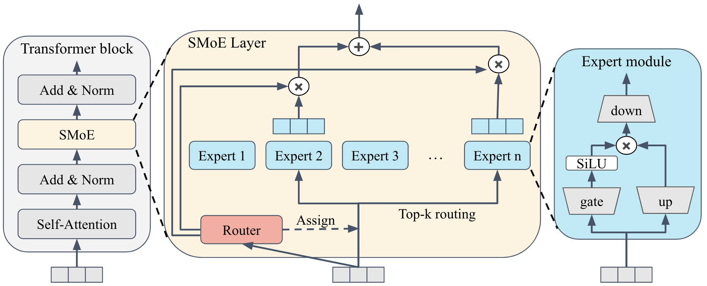
> 图解：Router 用 top-2 选择专家，计算依然稀疏，但专家本体依然是完整参数块。

## 相关工作：剪枝 vs 合并
- **剪枝类**：TSEP（需微调）、O-prune（组合爆炸）、S-prune / F-prune（基于 router logits 或频次）。
- **合并类**：M-SMoE 试图用路由频次分组再合并，但在 task-agnostic 下效果不稳定。

论文认为：  
- router logits 或频次 **依赖数据分布**，不稳定  
- 直接丢专家 = 丢知识  
- 合并更像是“保留知识 + 减冗余”

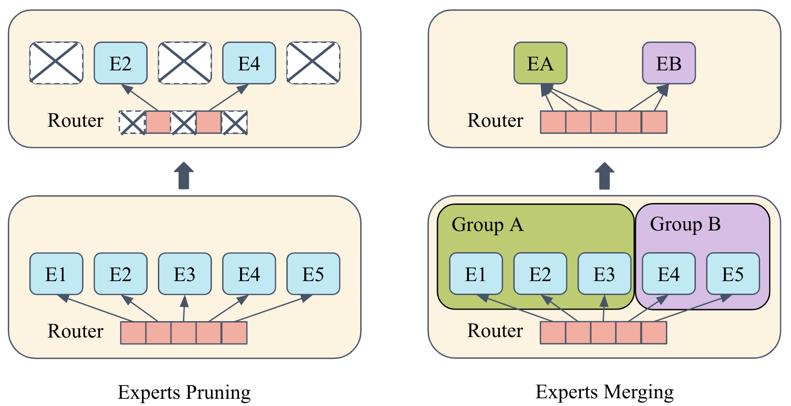
> 图解：剪枝是直接删专家，合并是把多个专家折成一个新专家，信息保留更多。

## 方法总览：HC-SMoE
核心思想是三步：
1. **用专家输出做相似度度量**  
2. **层次聚类（HC）分组专家**  
3. **在每个簇内合并专家权重**

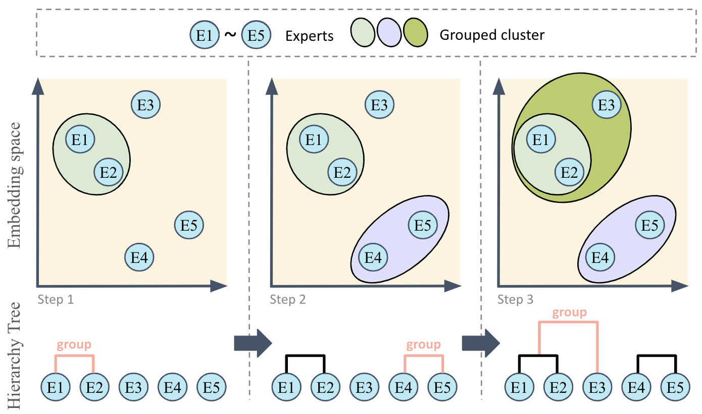
> 图解：每个点代表一个专家输出向量，层次聚类不断合并最近簇，得到最终专家分组。

### 1) 为什么用专家输出做相似度
用校准数据 $\mathcal{D}_{cal}$ 得到每个专家输出均值：

$$
o_j=\mathbb{E}_{x\sim \mathcal{D}_{cal}}[E_j(x)]
$$

优势：
- 更接近“功能相似度”
- 不依赖 routing 分布
- 计算成本低于拼接权重

### 2) 为什么用层次聚类（HC）
K-means 有随机初始化，结果不稳定。  
HC 是 **确定性** 的，自底向上合并，适合专家这种高维表示。

距离度量：

$$
d(e_i,e_j)=\|e_i-e_j\|_2
$$

平均链接的 cluster 距离：

$$
d(A,B)=\frac{1}{|A|\cdot|B|}\sum_{a\in A}\sum_{b\in B} d(a,b)
$$

### 3) 合并方式
合并后的专家：

$$
\hat{E}_i=\sum_{j=1}^{|C_i|}\alpha_j E_j,\quad \sum_j\alpha_j=1
$$

论文对比三种方式：
- Average
- Frequency-weighted
- Fix-Dom（基于 dominant expert 的加速版 ZipIt）

## 理论分析（附录重点）
聚类后专家输出：

$$
\bar{E}_j(x)=\frac{1}{|G_j|}\sum_{i\in G_j}E_i(x)
$$

HC-SMoE 输出：

$$
y_{HC}(x)=\sum_{i=1}^n P_i(x)\cdot \bar{E}_{g(i)}(x)
$$

误差上界：

$$
\|y_{orig}(x)-y_{HC}(x)\|^2 \le \sum_{i=1}^n P_i(x)\cdot \|E_i(x)-\bar{E}_{g(i)}(x)\|^2
$$

结论： **最小化簇内方差 = 最小化近似误差**。  
HC 的平均链接有理论保证：最坏情况 $\le 3\cdot OPT$。

## 实验设置
- 模型：Qwen1.5-MoE-A2.7B、Mixtral 8x7B  
- 压缩比例：25%、50%（更极端还有 62.5%、75%）  
- 评测：8 个 zero-shot 语言任务  
- 校准数据：C4，同时验证 MATH、CodeQA  

## 主要结果：HC-SMoE 保性能且压缩强
在 Qwen 和 Mixtral 上，HC-SMoE 在 25% / 50% 专家减少时，性能 **始终领先剪枝/合并 baselines**。

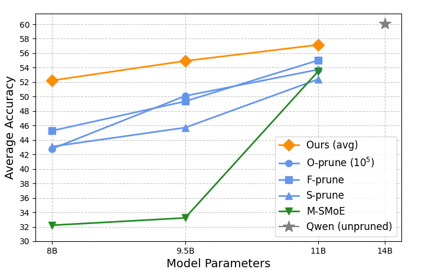
> 图解：横轴是专家减少比例，纵轴是平均准确率，HC-SMoE 曲线始终最靠近原始模型。

## 消融分析要点
1. **输出相似度 > router logits / 权重**  
2. **HC > K-means（稳定性 + 性能）**  
3. **平均链接通常优于单链接、完全链接**  
4. **合并策略影响较小，核心还是分组质量**

## 附录中的关键扩展实验

### 1) Fix-Dom 合并（ZipIt 加速版）
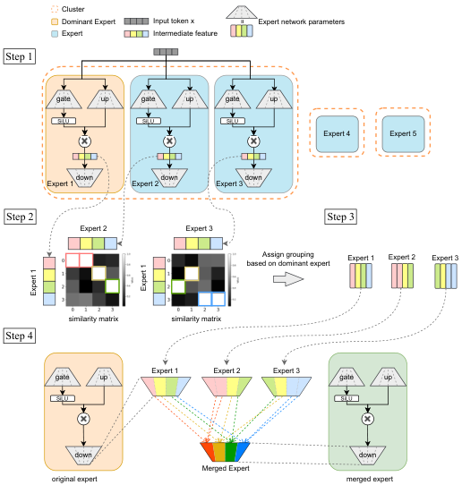
> 图解：固定 dominant expert 的特征顺序，其他专家特征对齐到最相似维度，加速合并流程。

结果：Fix-Dom 速度比 ZipIt **快百倍以上**，且性能更好。

### 2) 校准数据不敏感
使用 C4 / MATH / CodeQA 校准后，任务准确率差别很小，说明 **方法对校准数据选择不敏感**。

### 3) DeepSeek-MoE 与 MedMCQA
- 在 DeepSeek-MoE-16B 上，50% 减专家仍保持合理性能  
- 在 MedMCQA 医疗问答上，HC-SMoE 超过所有 baseline

### 4) Soft Clustering 失败
Fuzzy C-Means 会导致 router 权重难处理，性能显著掉，说明 **硬聚类更适合 retraining-free**。

### 5) 极端压缩（62.5% / 75%）
大多数基线低于随机猜测，但 HC-SMoE 仍保持明显优势。

### 6) 频次分析：频率不可靠
Mixtral 在不同任务上的专家频次分布差异巨大，说明不能用频次决定保留专家数。

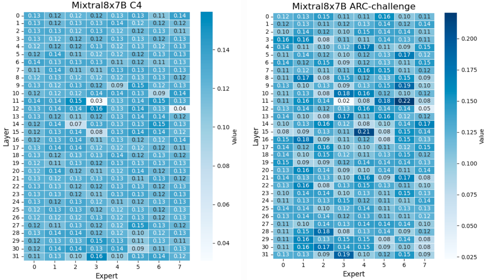
> 图解：同一模型在 ARC-c 和 C4 上专家激活频率分布差异明显。

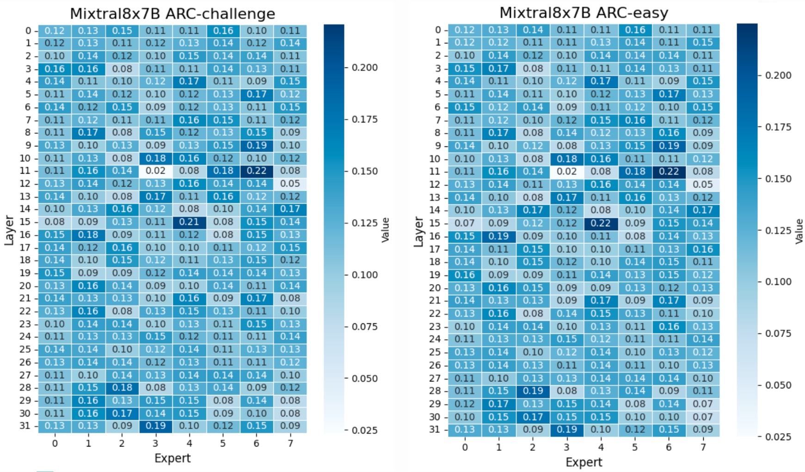
> 图解：同为 ARC 系列任务，专家频次分布依然不同。

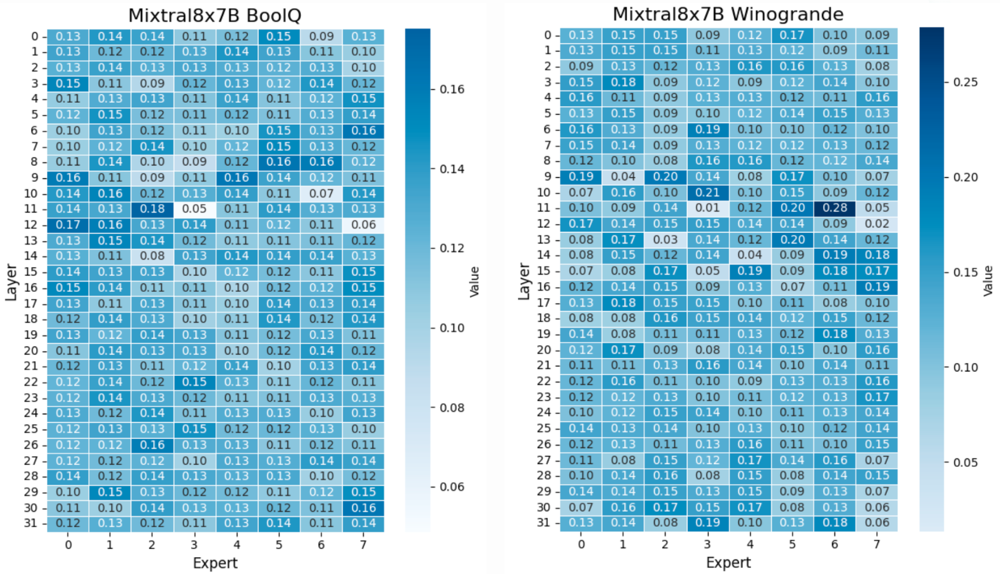
> 图解：不同任务下专家偏好不同，频次无法泛化。

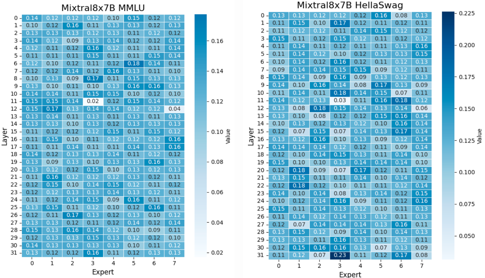
> 图解：频次分布差异说明“高频专家”并不稳定。

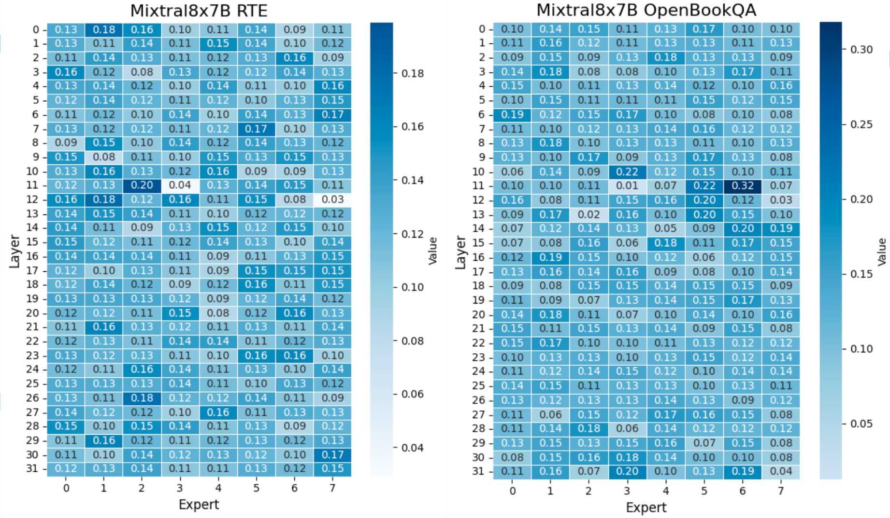
> 图解：频率会随任务变化，导致频次分组不可靠。

TinyLLaMa 结果更直接：某些专家几乎不被使用，说明 SMoE 内部存在明显冗余。

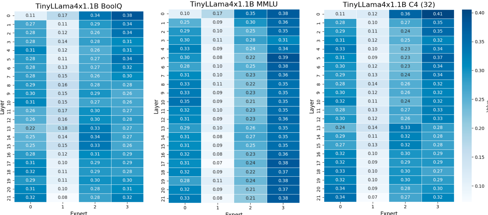
> 图解：有专家几乎始终低频，说明专家利用率不均衡。

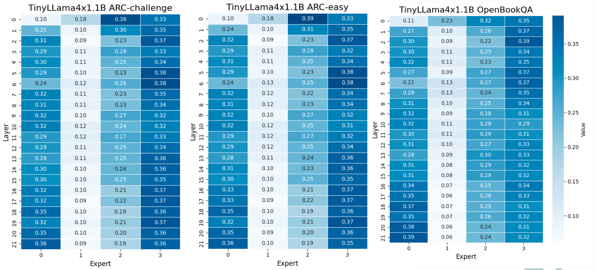
> 图解：不同任务下的频次排序变化明显。

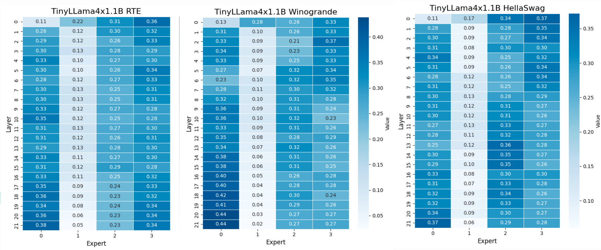
> 图解：专家偏好受任务强影响，频率难以稳定反映重要性。

## 个人解读：这篇论文的价值在哪里
- **把“专家合并”从启发式变成系统方法**  
- **输出相似度 + HC** 是一个更稳健、更通用的组合  
- **真正实现了 retraining-free 的可扩展压缩**  
- 实验覆盖了 **SOTA MoE 模型 + 医疗任务 + 极端压缩**，可信度高  

一句话总结：  
HC-SMoE 给了一个 **不依赖任务数据、还能稳定压缩 MoE 的实用方案**，而且理论与实验都站得住。

> 本文参考自 [2410.08589](https://arxiv.org/abs/2410.08589)