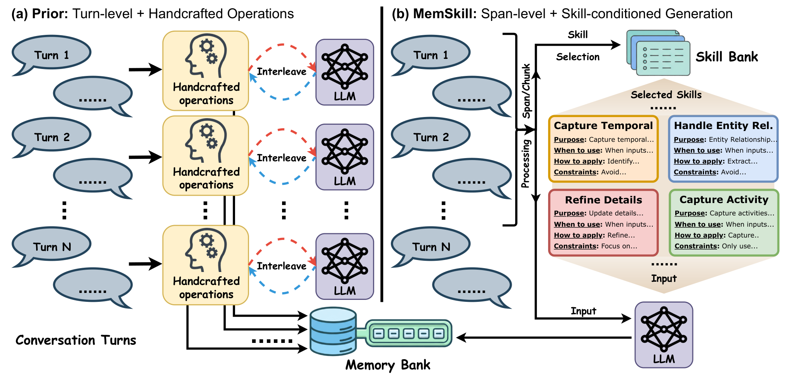
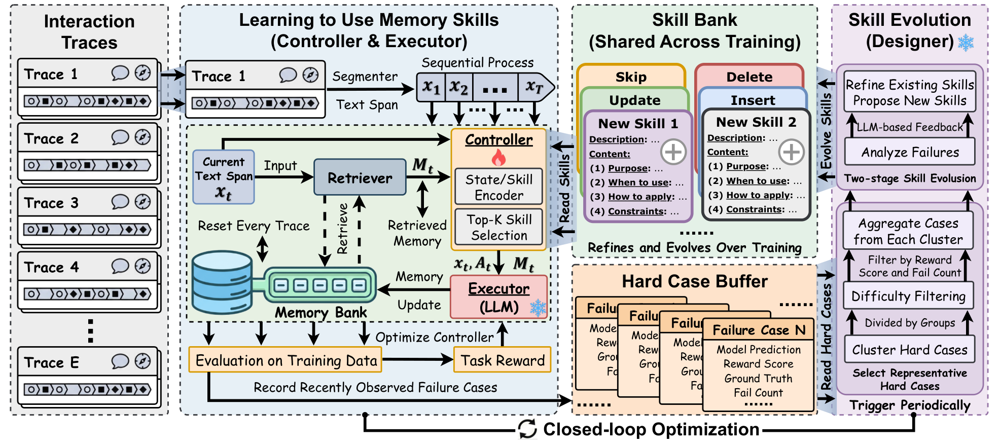
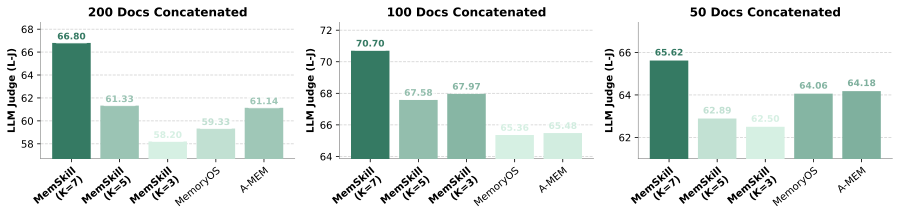
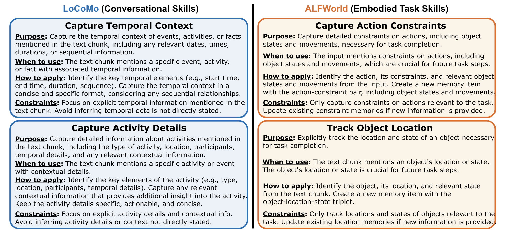

# MemSkill：让 Agent 的记忆策略“自己进化”，而不再靠手写规则

## 一句话看懂这篇论文
这篇工作提出了 **MemSkill** ：把传统记忆系统里的固定操作（如 Insert/Update/Delete）升级成可学习、可演化的 **memory skills** ，并通过「Controller + Executor + Designer」闭环，让 Agent 在训练中不断优化“该记什么、怎么记、何时改”。

> 图解：左侧是传统 turn-level 管线。每轮对话都按手写规则 + 多次 LLM 调用增量更新记忆；右侧是 MemSkill 的 span-level 方案。先从 skill bank 里选少量技能，再一次性生成记忆更新。核心收益是减少流程碎片化、提升长上下文可扩展性。

---

## 1. 研究背景：为什么“静态记忆操作”已经不够用了？
当前 LLM Agent 记忆系统虽然很多，但大多数仍有三个共性问题：

- 依赖人工先验：人先定义“哪些信息值得记”，规则迁移性差。
- 粒度固定：常见是 per-turn 更新，历史变长后成本高、误差累积重。
- 模块割裂：提取、合并、剪枝是硬拼流程，面对分布偏移时更脆弱。

作者的核心观点很直接：  
与其把记忆当作“固定流水线输出”，不如把它看成“可组合的技能执行结果”。

---

## 2. MemSkill 的核心框架
MemSkill 由三个关键组件组成：

- **Controller** ：根据当前文本片段和已检索记忆，选择 Top-$K$ 个技能。
- **Executor** ：把选中的技能 + 当前 span + 检索记忆一起喂给 LLM，一次生成记忆动作。
- **Designer** ：周期性分析 hardest cases，修订旧技能并新增技能。

系统维护两类“库”：

- **memory bank** ：样本私有，存具体记忆条目。
- **skill bank** ：全局共享，存可复用记忆技能。

> 图解：每个 span 经过 Controller 选技能，再由 Executor 执行并写入 memory bank；训练过程中把失败案例放入 hard-case buffer；Designer 定期聚类失败样本并进化 skill bank。它不只学习“选技能”，还持续改进“技能本身”。

---

## 3. 方法细节：它到底怎么学？

### 3.1 技能表示与打分
每个技能包含两部分：

- `description`：用于编码和检索（语义稳定）。
- `content`：用于执行时的指令化约束。

状态与技能表示：

$$
h_t = f_{\text{ctx}}(x_t, M_t), \quad
u_i = f_{\text{skill}}(\text{desc}(s_i))
$$

兼容动态技能库的关键打分：

$$
z_{t,i} = h_t^\top u_i, \quad
p_\theta(i \mid h_t) = \mathrm{softmax}(z_t)_i
$$

这让动作空间随 skill bank 大小变化而自然扩展，不需要固定 action head。

### 3.2 Top-$K$ 无放回动作概率（RL 关键）
Controller 一次不是选 1 个动作，而是选有序 Top-$K$ 技能集 $A_t = (a_{t,1}, \ldots, a_{t,K})$ 。其联合概率为：

$$
\pi_\theta(A_t \mid s_t) =
\prod_{j=1}^{K}
\frac{p_\theta(a_{t,j} \mid s_t)}
{1 - \sum_{\ell<j} p_\theta(a_{t,\ell} \mid s_t)}
$$

这一步非常关键：论文把该联合概率放进 PPO 的 importance ratio，保证训练目标与真实动作机制一致，而不是“伪装成单动作 RL”。

### 3.3 Designer：从难例里“造技能”
训练时维护 hard-case buffer，案例难度定义为：

$$
d(q) = (1 - r(q)) \cdot c(q)
$$

- $r(q)$：任务得分（越低越难）。
- $c(q)$：失败累计次数（越高越难）。

然后做两件事：

- 按语义聚类，避免只盯单一错误类型。
- 用 LLM 分析失败模式，执行“refine 旧技能 + add 新技能”。

另外还有两个工程上很实用的设计：

- 新技能探索激励：短期提高新技能概率质量下限。

$$
\sum_{i \in \mathcal{S}_{new}} p_\theta(i \mid s_t) \ge \tau_t
$$

- 退化回滚 + 早停：若新一轮演化后尾段稳定 reward 变差，则回滚到最佳快照。

---

## 4. 实验结果：不只提升，而且泛化强
论文在 LoCoMo、LongMemEval、ALFWorld、HotpotQA 上评估，结论较一致：MemSkill 在不同任务形态上都更稳。

### 4.1 主结果亮点（节选）
- LoCoMo（LLaMA）L-J：MemSkill 50.96，优于 MemoryOS 44.59、A-MEM 46.34。
- LongMemEval（LLaMA）L-J：MemSkill 59.41，显著高于多数基线。
- ALFWorld（Qwen transfer）SR 平均：MemSkill 62.09，明显领先其余方法。

一个很有价值的点是：技能在 LLaMA 上训练后，迁移到 Qwen 仍保持领先，说明它学到的是可复用的记忆行为模式，而非底座模型特例。

### 4.2 消融实验：两个模块缺一不可
- 去掉 Controller（随机选技能）：性能下降明显。
- 去掉 Designer（只用初始 4 原语）：下降更大。
- 只 refine 不新增技能：优于静态技能，但不如完整版本。

这基本验证了作者的主张：  
**学会选技能** 和 **让技能持续进化** 是互补关系，不是二选一。

---

## 5. 分布外迁移：从对话记忆到文档推理也能打
作者把 LoCoMo 学到的技能直接迁移到 HotpotQA（50/100/200 文档拼接）：

> 图解：横向是不同上下文长度设置（50/100/200），纵向是 LLM Judge 分数。MemSkill 在三档长度下都高于 MemoryOS 和 A-MEM，且上下文越长优势越明显。说明这些技能不是“对话格式专用规则”，而是更通用的记忆抽取/修订能力。

此外，$K$ 的敏感性结果显示：长上下文下较大的技能组合数（如 $K = 7$）通常更优，符合“噪声越多越需要多技能协同”的直觉。

---

## 6. 可解释性：它学出来的技能长什么样？
论文给了大量 case study，能看到不同任务域会“长出不同技能生态”：

> 图解：LoCoMo 侧重时间线、事件细节、实体关系（如 temporal context、activity details）；ALFWorld 侧重可执行状态（如 object location、action constraints）。这说明 Designer 并非随机扩展技能，而是在任务反馈驱动下形成领域专长。

初始只有 4 个原语技能（Insert/Update/Delete/Skip），演化后出现更细粒度技能，例如：

- LoCoMo：`capture_temporal_context`、`handle_entity_relationships`。
- ALFWorld：`track_object_location`、`capture_action_constraints`。

---

## 7. 我对这篇论文的评价（重点）
这篇工作的创新点，不是又造了一个 memory module，而是把“记忆管理逻辑”从手工规则提升为可训练对象，并加入自我进化闭环。它的价值主要体现在三点：

- 把记忆系统从静态工程规则推进到数据驱动策略学习。
- 在算法层面认真处理了 Top-$K$ 无放回动作的 RL 一致性。
- 在系统层面给出可落地的演化机制（难例挖掘、回滚、探索偏置、早停）。

当然，潜在挑战也很现实：

- 训练/评估链路较长，工程复杂度高于传统 memory pipeline。
- Designer 基于 LLM 反思，质量受外部模型稳定性影响。
- skill bank 持续增长后，如何做长期压缩与版本治理，仍是开放问题。

---

## 8. 总结
MemSkill 给出的不是“更复杂的记忆模板”，而是一套可持续学习的记忆操作范式：  
先用少量通用技能起步，再让系统通过难例反馈不断改写自己的记忆策略。对于需要长期交互、上下文不断增长的 Agent，这条路线比继续堆手工规则更有前景。

> 本文参考自 [MemSkill: Learning and Evolving Memory Skills for Self-Evolving Agents](https://arxiv.org/abs/2602.02474)