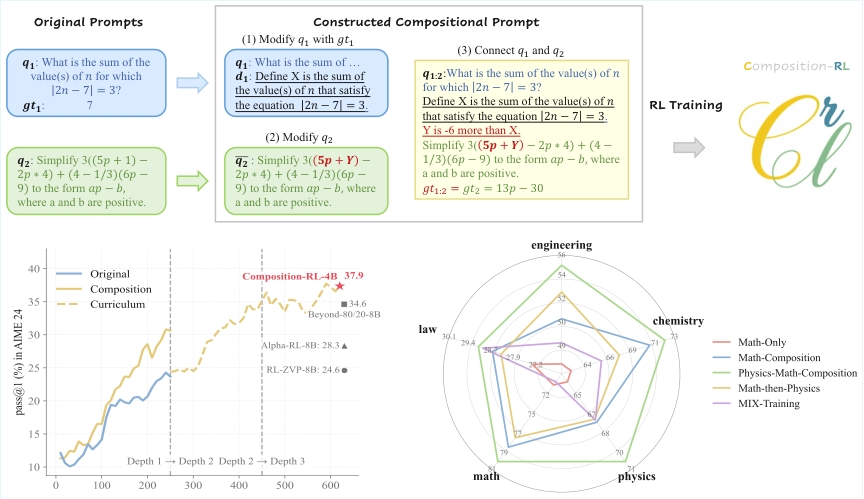
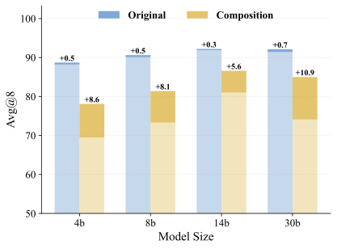
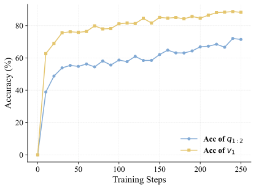
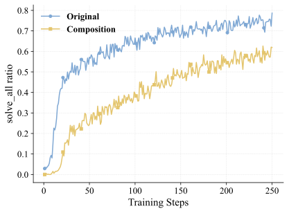
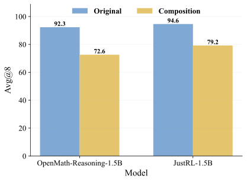

# Composition-RL：用可验证组合提示把 RLVR 训练“难度抬起来”

## 背景与问题动机
RLVR（Reinforcement Learning with Verifiable Rewards）依赖 **可验证** 的训练提示（prompt+答案）来产生奖励信号。但实际训练过程中会出现两个极端：

- **solve_none** ：模型全错，优势函数为 0，梯度消失
- **solve_all** ：模型全对，同样梯度消失

已有工作大多聚焦解决 **全错问题** ，而随着训练推进， **全对问题比例快速上升** ，导致有效训练样本越来越少。论文提出：既然“太容易”的题越来越多，那就 **把它们自动组合成更难的题** ，让 RL 继续有信号可学。

## 方法核心：Sequential Prompt Composition（SPC）
论文提出 **Composition-RL** （简称 **Composition-RL** ），核心是 **顺序组合提示** （SPC）。

### 组合流程（K=2）
给定两道题 $q_1, q_2$（答案分别是 $gt_1, gt_2$），通过三个步骤构造复合题：

1. **修改 $q_1$**
从答案 $gt_1$ 里抽出一个数值 $v_1$，并用自然语言定义它（生成 $d_1$），得到 $\bar{q}_1$。

2. **修改 $q_2$**
从 $q_2$ 中抽出一个数值，替换成变量 $v_2$，得到 $\bar{q}_2$。

3. **连接 $q_1$ 和 $q_2$**
写一句关系 $r$，表达 $v_1$ 与 $v_2$ 的约束，比如 $v_2 = v_1 - 6$。  
最终组合题是 $q_{1:2} = \bar{q}_1 \oplus r \oplus \bar{q}_2$，答案仍是 $gt_2$。

这保证了模型必须先解出 $q_1$ 的结果，才能正确解出 $q_2$，自然形成“隐式过程监督”。

> 图解：组合提示整体流程和实验结果概览，含训练曲线与跨主题分析  
  
> 图解：上半部分是组合提示示例流程；下半部分左图展示不同方法在 AIME24 上随训练步数变化的 pass@1 曲线；右图展示 MMLU-Pro 不同学科的跨主题提升趋势。

## 训练目标
训练目标仍然是标准 RLVR 的 GRPO 形式，只是将训练数据替换为组合数据集：

$$
\max_{\theta}\; \mathbb{E}_{q \sim \hat{\mathcal{D}}_{C_K}}\bigl[\mathcal{J}_{\text{RLVR}}(\theta)\bigr]
$$

其中 $\hat{\mathcal{D}}_{C_K}$ 是从原始数据集采样生成的组合提示集合。

## 为什么它有效？
论文从两个角度解释：

### 1. 组合泛化（Compositional Generalization）
组合题要求模型把多个技能叠加在同一题里，从而促进技能复用和迁移。  
在组合测试集上，训练于组合提示的模型明显更强。

> 图解：左图是不同模型规模在组合测试上的提升；右图是“中间变量 $v_1$ 是否解对”的比例随训练步数变化  
  
> 图解：左图显示组合数据带来的 compositional generalization；右图显示中间变量恢复能力逐步提升，体现隐式过程监督。

### 2. 隐式过程监督（Implicit Process Supervision）
组合题的结构迫使模型先解出 $v_1$，再解 $q_2$，即使只验证最终答案，也能在训练中形成“中间步骤约束”。

> 图解：右图展示模型逐步提升“中间变量正确率”，说明过程信号在隐式强化  
  
> 图解：横轴为训练步数，纵轴为 $v_1$ 的正确率与最终题正确率，展示过程监督信号的提升趋势。

## 实验结果（核心结论）
### 1. 组合提示显著提升 RLVR
在 Qwen3 系列 4B~30B 模型上，组合提示都优于原始 MATH12K 训练。

**整体趋势** ：
- 数学任务提升明显（最高 +14.3%）
- 跨领域任务也提升（最高 +2.9%）
- 模型越大，收益越明显

**示例：Qwen3-4B-Base**  
- Overall 28.1 → 31.4  
- AIME24 23.3 → 30.5

### 2. Curriculum 训练更强
逐步加深组合深度（Depth 1 → 2 → 3）可以持续带来增益：

- Depth 1 + 2：Overall 34.4  
- + Depth 3：Overall 36.4

这意味着 **组合深度越高，模型越能被“拉出更难的学习信号”** 。

### 3. 跨领域组合优于简单混合
将物理问题与数学问题组合，比直接混合训练更有效：

- MMLU-Pro：提升 +4.3%  
- AIME24：提升 +9.1%

这说明 **跨域组合不是“数据堆叠”，而是“能力组合”** 。

> 图解：左图是 solve_all 比例变化；右图是组合测试精度变化  
  
> 图解：左图显示 solve_all 比例在组合训练下显著下降，说明组合题降低了“过易样本”；右图显示组合测试集难度更高但模型能逐步适应。

> 图解：组合测试集与原始测试集的对比  
  
> 图解：组合测试集的 avg@8 明显更低，说明组合题难度提升；训练后差距缩小，说明模型能力提升。

## 实验设置要点
- 训练框架：VeRL
- 基础模型：Qwen3-4B/8B/14B/30B-A3B
- 数据集：MATH12K + MegaScience Physics
- 验证器：Math-Verify
- 采样策略：动态采样过滤 solve_all 和 solve_none

## 关键启发
- **easy prompt 不是垃圾** ，它们只是“需要被重新组合”
- 组合提示本质上在制造 **困难但可验证的新题**
- 组合方式能带来 **隐式过程监督** ，即使只验证最终答案

## 结论与展望
Composition-RL 提供了一种极简但有效的方式，把“有限的可验证数据”扩展成“更难、更有效的训练样本”，并在多个模型规模与跨领域场景中验证了有效性。

未来方向包括：
- 扩展到更难的数学数据（如 Polaris-53K）
- 扩展到更多学科领域
- 与 on-policy distillation 结合

> 本文参考自 [2602.12036](https://arxiv.org/abs/2602.12036)