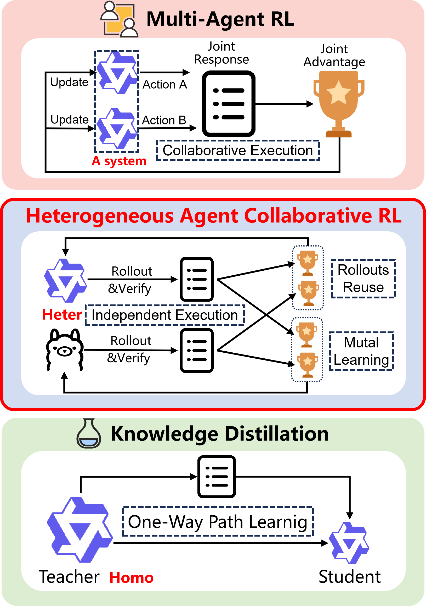
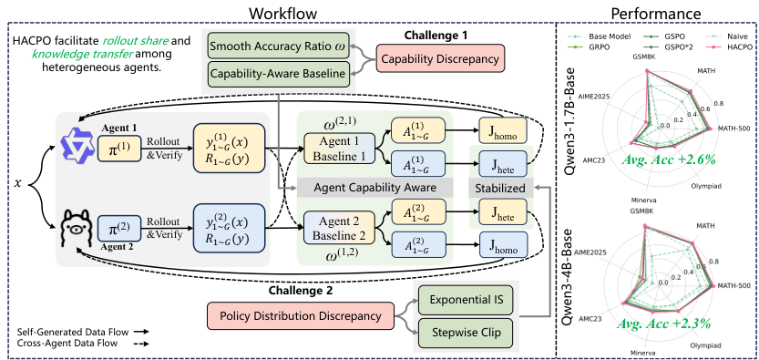
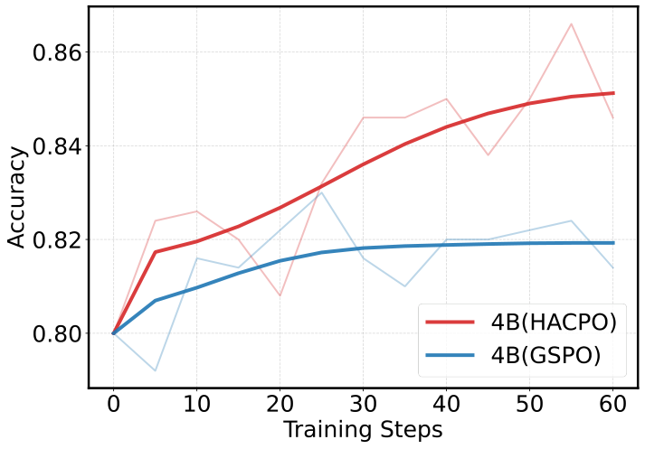
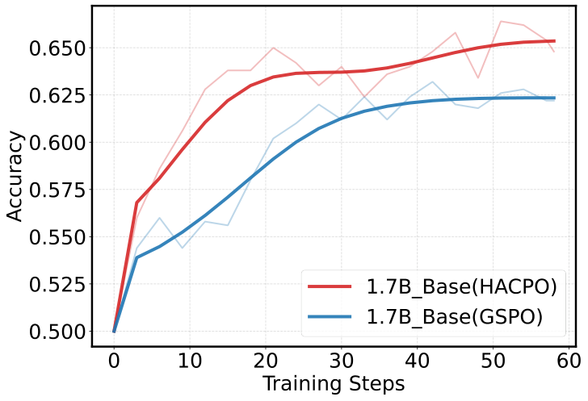
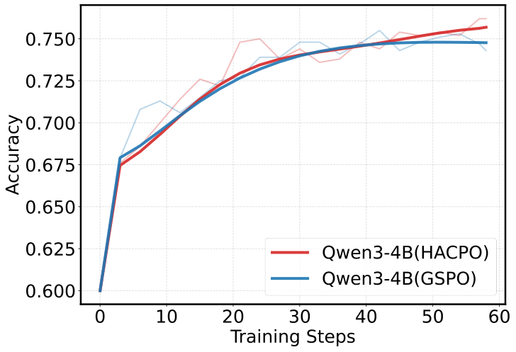
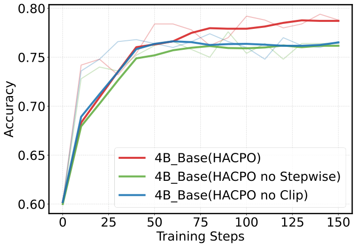
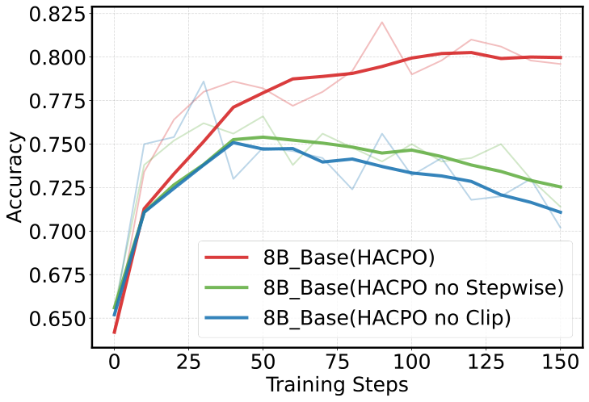

# HACRL / HACPO 深度解读：让异构大模型“各自执行、彼此学习”的协同强化学习新范式

## 1. 这篇论文到底在解决什么问题？

在 RLVR（Reinforcement Learning with Verifiable Rewards）里，一个很现实的痛点是： **采样贵、验证贵、而且重复劳动严重** 。  
多个模型明明在做同一类任务（比如数学推理），却各自采样、各自更新，彼此中间结果完全不共享。

这篇工作提出的核心问题可以概括为：

- 给定同一任务分布，是否能让多个 **异构** LLM agent 共享 rollout；
- 每个 agent 仍然保持 **独立推理部署** ；
- 但在训练阶段进行 **协同策略优化** ，提升样本利用率和最终性能。

作者把这个问题定义为 **HACRL** （Heterogeneous Agent Collaborative Reinforcement Learning），并给出算法 **HACPO** （Heterogeneous Agent Collaborative Policy Optimization）。

> 图解：这张图给出了三种范式差异。MARL 强调协同执行，KD 强调单向 teacher→student，而 HACRL 强调 **独立执行 + 协同优化** 。也就是训练时互相借力，部署时单兵作战。

---

## 2. HACRL 与 MARL / KD 的本质区别

### 2.1 与 MARL 的区别

- MARL：多 agent 在推理时通常要联动协作；
- HACRL：推理时不要求联动，仍可只部署单模型。

### 2.2 与蒸馏（KD）的区别

- KD：通常是单向知识迁移（teacher 到 student）；
- HACRL：双向甚至多向互学，强模型和弱模型都可能获益。

这一点很关键：论文不把“弱模型”视为纯噪声源，而是把其探索轨迹中的“非常规正确路径 + 典型错误样本”看作可迁移信号。

---

## 3. 问题形式化：为什么“异构”会难？

作者把异构分成三层：

- **Heterogeneous State** ：同架构同规模，不同参数状态；
- **Heterogeneous Size** ：同家族不同参数规模；
- **Heterogeneous Model** ：架构、tokenizer、参数空间都不同。

对每个 query $q$，每个 agent $k$ 采样 $G$ 条回答，目标是优化：

$$
J^{(k)}=
J_{\mathrm{homo}}^{(k)}\!\left(Y_k(q),\mathcal R_k(q)\right)
+
J_{\mathrm{hete}}^{(k)}\!\left(\{Y_j(q),\mathcal R_j(q)\}_{j\neq k}\right)
$$

其中前者来自自身 rollout，后者来自其他 agent rollout。  
难点有两个： **能力差异** 和 **策略分布差异** 。

---

## 4. HACPO 的四个关键设计（核心）

> 图解：图中展示 HACPO 在 vanilla RL 优化上叠加了四个模块。主线是“共享跨 agent rollout”，难点处理是“能力校准 + 分布校正 + 稳定性约束”。

### 4.1 Agent-Capability-Aware Advantage Estimation（能力感知优势估计）

单模型 GRPO 风格优势估计在异构场景会失真。  
HACPO 的思路是：基线不只看本模型样本，而是看全体样本，并按能力比重加权。

能力感知基线：

$$
\hat{\mu}_t^{(k)}
=
\frac{1}{nG}
\sum_{j=1}^n \sum_{i=1}^G
\omega_t^{(k,j)}R\!\left(y_{t,i}^{(j)}\right)
$$

其中能力比：

$$
\omega_t^{(k,j)}=\frac{\hat P_t^{(k)}}{\hat P_t^{(j)}}
$$

直觉上，强模型和弱模型在同一奖励空间里被“标尺对齐”，从而避免 naive 混合带来的 baseline 偏置。

### 4.2 Model Capabilities Discrepancy Coefficient（能力差异系数）

同一个 $\omega$ 还用于梯度调制。  
更新 agent $k$ 时，来自 agent $j$ 的样本优势会乘上能力相关权重，实现“向强者多学、向弱者谨慎学”。

这一步本质上是把跨 agent 信号转成“带置信度的学习率调制”。

### 4.3 Exponential Importance Sampling（指数重要性采样）

跨模型分布偏移比 on-policy 更大，直接 IS 会激进。  
作者引入 stop-gradient 的指数再加权：

$$
\tilde s_{t,i}^{(k,j)}
=
s_{t,i}^{(k,j)}
\cdot
\left(\mathrm{sg}[s_{t,i}^{(k,j)}]\right)^{\alpha}
\quad (k\neq j,\ s<1)
$$

$\alpha$ 越大，学习越保守、越稳。

### 4.4 Stepwise Clipping（阶梯裁剪）

对 cross-agent 比率不使用对称裁剪，而是用非对称边界：

$$
s_{t,i}^{(k,j)} \in [1-\delta,1.0],\quad k\neq j
$$

并且在同一训练 step 内，随着 mini-batch 更新次数增加，进一步收紧下界：

$$
\mathrm{clip}(s)=
\mathrm{clip}\!\left(
s,\ 1-\delta+k\cdot\delta_{\mathrm{step}},\ 1.0
\right)
$$

核心思想是：防止后期更新被跨 agent 样本“反客为主”。

---

## 5. 实验结果：是否真的“更省采样、更高性能”？

论文主结论：相较 GSPO，HACPO 在多个异构组合和 7 个数学基准上，平均提升约 **3.3%** ，且只用约 **一半 rollout 成本** 。

### 5.1 训练曲线观察

> 图解：横轴通常是训练 step，纵轴是评估性能。HACPO 曲线整体更快爬升、后期更高，说明 rollout 复用带来收敛效率提升。

> 图解：大小异构场景下，弱模型和强模型都有收益，体现了双向知识迁移，而非单向蒸馏。

> 图解：跨家族异构（tokenizer/架构差异更大）仍能提升，说明 HACPO 对强异构有鲁棒性。

### 5.2 主表关键数字（摘要）

以 “Qwen3-4B + Qwen3-4B-Instruct” 为例：

- 4B 平均分：GSPO `0.684` → HACPO `0.755`
- 4B-Instruct 平均分：GSPO `0.799` → HACPO `0.813`

以 “Qwen3-1.7B-Base + Qwen3-4B-Base” 为例：

- 1.7B-Base 平均分：GSPO `0.467` → HACPO `0.493`
- 4B-Base 平均分：GSPO `0.578` → HACPO `0.601`

---

## 6. 消融实验告诉了我们什么？

### 6.1 去掉能力感知优势估计会掉点

说明跨 agent 混合时，baseline 校准不是可选项，而是必要项。

### 6.2 去掉能力差异系数（梯度调制）会掉点

说明“谁更值得学”的动态调权对稳定增益有实际贡献。

### 6.3 $\alpha$ 不是越大越好

不同模型组合的最优 $\alpha$ 不同，体现稳定性与学习效率之间的 trade-off。

### 6.4 Stepwise Clipping 对稳定性很关键

> 图解：移除 clip 或移除 stepwise 机制，训练曲线更容易震荡或收敛更差，验证了“后期更新需要更严格跨 agent 限幅”的设计动机。

> 图解：在更大模型上，stepwise clipping 依然有效，说明该机制具有一定可迁移性，不是某个模型特例。

---

## 7. 理论部分如何理解（不展开繁琐证明）

论文给了两条核心理论结论：

- **无偏性** ：能力感知混合基线在期望上等价于 agent 自身期望奖励，不引入系统偏差；
- **方向一致性** ：异构项梯度与同构项梯度正对齐，即跨 agent 学习总体不会把优化方向带偏。

这两点分别回答了“能不能混着估优势”和“混了会不会学歪”这两个关键质疑。

---

## 8. 这篇工作的价值与边界

### 8.1 价值

- 从“单模型闭门训练”转向“异构群体协同训练”；
- 在不要求协同推理部署的前提下，拿到样本效率和性能双收益；
- 对真实工业环境（多家族模型并存）更有可操作性。

### 8.2 边界

- 仍依赖可验证奖励场景（RLVR）；
- 超参数（如 $\alpha,\delta,\delta_{\mathrm{step}}$）对不同组合需调优；
- 异构越强，分布对齐和 tokenization 处理复杂度越高。

---

## 9. 一句话总结

HACPO 的本质不是“把别人的样本拿来就用”，而是通过 **能力校准、分布重加权、分阶段裁剪** ，把“跨模型经验复用”变成一个可稳定优化的 RL 算法体系。

> 本文参考自 [Heterogeneous Agent Collaborative Reinforcement Learning (arXiv:2603.02604)](https://arxiv.org/abs/2603.02604)