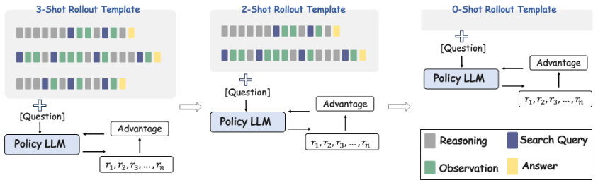
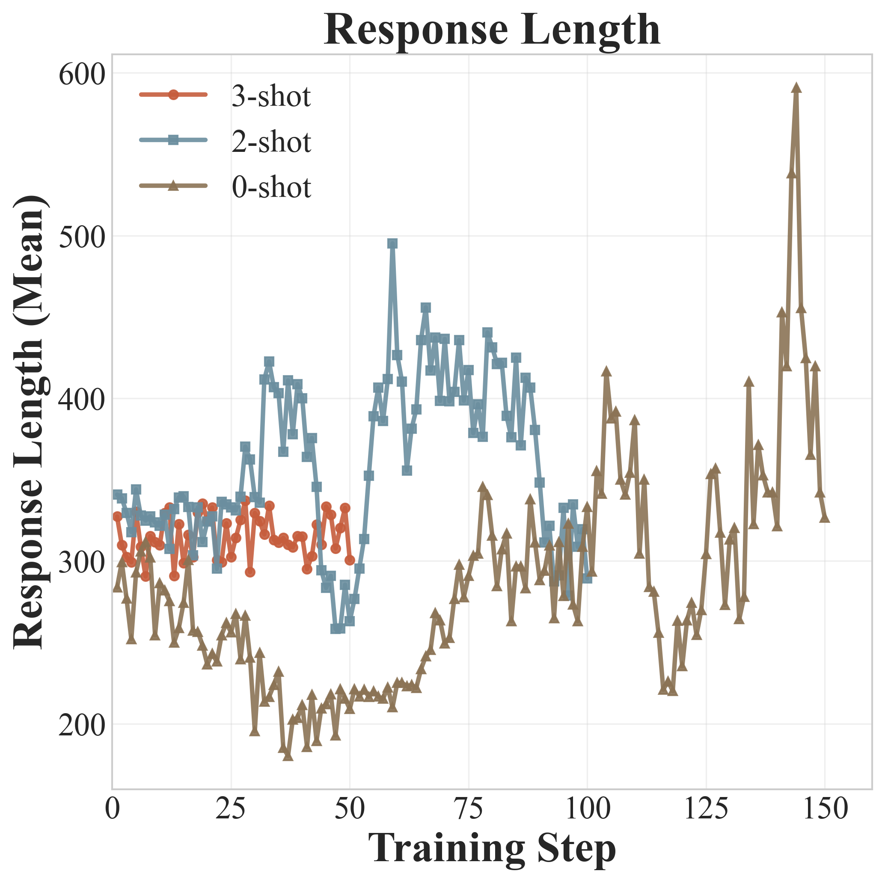
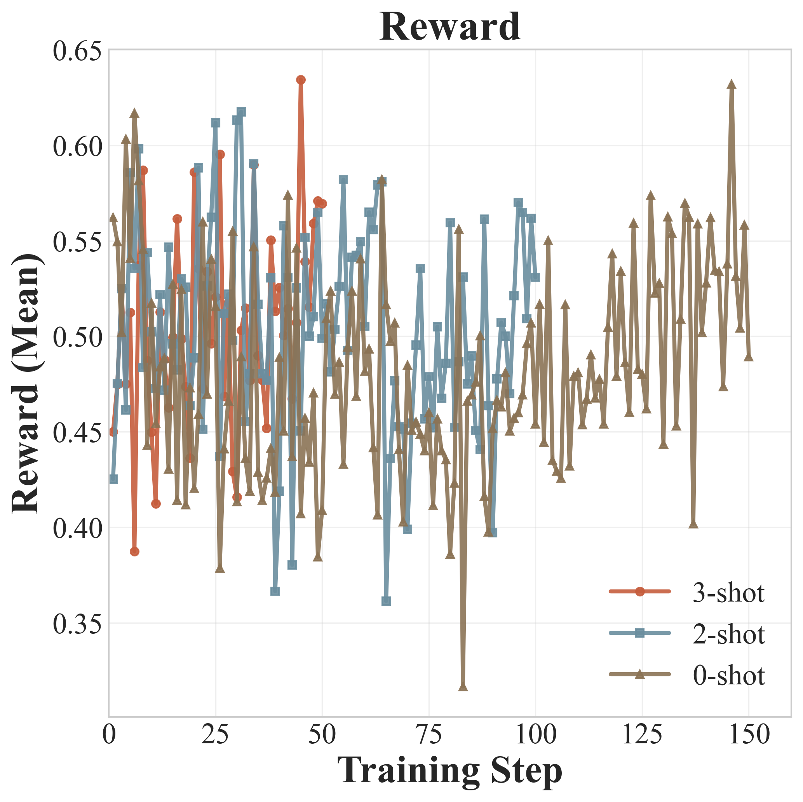
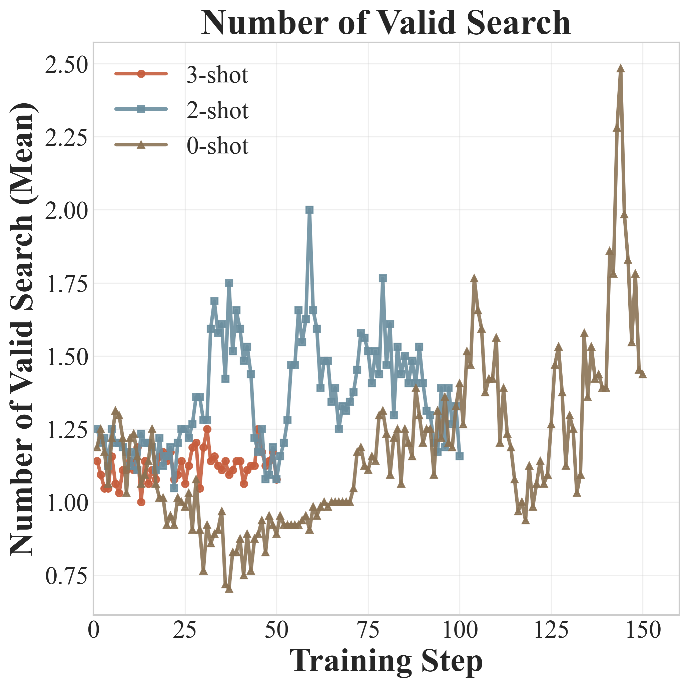

# ICRL：不用 SFT，也能把大模型“教会”调用工具 —— In-Context Reinforcement Learning 论文深度解读

## 一、这篇论文到底解决了什么问题？

这篇工作要解决一个非常现实的痛点： **大语言模型（LLM）会推理，但它的“脑内知识库”是静态的** 。一旦问题涉及最新事实、长链路检索，或者需要精确计算，模型就容易出错。

一个自然思路是让模型学会调用外部工具，例如：

- `Search`：查询事实、补充时效信息
- `Python`：执行计算与符号推导

问题在于：如何训练模型稳定地学会这件事？

现有主流路线通常是 `SFT + RL`：

1. 先用大量标注数据做监督微调（SFT），把工具调用格式和流程“灌进去”。
2. 再用 RL 提升策略质量。

难点也很明显： **SFT 数据昂贵** ，尤其是高质量工具调用轨迹，难以规模化生产。

这篇论文提出的 ICRL（In-Context Reinforcement Learning）核心贡献是： **直接去掉 SFT 阶段，仅用 RL 训练，并通过 few-shot in-context 示例实现“软启动”** 。随后再把示例逐步撤掉，让模型实现零样本自主工具使用。

---

## 二、核心思想：把 few-shot 提示“塞进” RL rollout

> 图解：这是 ICRL 的训练主流程。最左侧是带示例的 prompt（例如 3-shot），模型在 rollout 中按 `<think> / <search> / <information> / <answer>` 结构做多轮推理与检索；中间通过奖励函数（答案正确性 + 格式合规）进行策略更新；右侧逐阶段减少示例数量（3→2→0），最终在无示例条件下也能稳定调用工具。

论文的关键设计有两个：

- **阶段化课程学习（curriculum）** ：先 `3-shot`，再 `2-shot`，最后 `0-shot`。
- **在 RL 中直接学习工具调用行为** ：不依赖人工标注轨迹，仅靠奖励驱动。

这相当于让模型先“看着例子做”，再“半独立做”，最后“完全独立做”。

---

## 三、方法细节：ICRL 到底怎么训练？

### 3.1 工具增强生成的形式化

给定问题 $q$ 和工具 $\mathcal{T}$，模型生成序列 $y$ 的策略可写为：

$$
\pi_\theta(y \mid q, \mathcal{T})=\prod_{t=1}^{|y|}\pi_\theta(y_t \mid y_{<t}, q, \mathcal{H}_t)
$$

其中 $\mathcal{H}_t$ 是截至时刻 $t$ 的工具交互历史。也就是说，模型每一步不仅依赖历史 token，也依赖之前检索回来的信息。

---

### 3.2 RL 目标函数（带 KL 约束）

论文使用带参考策略约束的 RL 目标：

$$
\max_{\pi_\theta}\ \mathbb{E}_{q \sim \mathcal{D},\, y \sim \pi_\theta(\cdot \mid q,\mathcal{T})}[r_\phi(q,y)]
-\beta\,\mathbb{D}_{\mathrm{KL}}\!\left[\pi_\theta \,\|\, \pi_{\mathrm{ref}}\right]
$$

- 第一项：最大化任务奖励。
- 第二项：约束策略不要偏离参考模型过多，提升训练稳定性。

---

### 3.3 为什么要做 Loss Masking？

工具返回内容（如 `<information>` 中的检索文本） **不是模型生成的** 。如果这些 token 也参与梯度更新，会污染优化目标。

因此论文采用 **loss masking** ：

- 只对模型自产 token 求梯度。
- 检索返回文本全部 mask 掉。

这让 RL 真正聚焦在“模型行为”本身：是否会想、会搜、会答。

---

### 3.4 ICRL 的训练课程

训练时，策略从：

$$
\pi_\theta(y \mid \mathcal{P}_{N}, q, \mathcal{T})
$$

逐步过渡到：

$$
\pi_\theta(y \mid \mathcal{P}_{N-1}, q, \mathcal{T}) \rightarrow \cdots \rightarrow \pi_\theta(y \mid \mathcal{P}_{0}, q, \mathcal{T})
$$

其中 $\mathcal{P}_k$ 表示含 $k$ 个示例的 prompt。  
本质上，这是把 in-context learning 的“脚手架”逐步拆掉，让能力内化到参数中。

---

### 3.5 奖励设计（关键部分）

论文使用混合奖励：

$$
r_{\phi}(q,y)=\alpha \cdot \mathrm{reward}_{\mathrm{acc}}+(1-\alpha)\cdot \mathrm{reward}_{\mathrm{format}}
$$

其中：

- $\mathrm{reward}_{\mathrm{acc}}$：答案 Exact Match（EM）是否正确。
- $\mathrm{reward}_{\mathrm{format}}$：结构格式是否合规（如 `<think>`、`<search>`、`<answer>` 标签是否完整、是否为空内容等）。

格式奖励形式为：

$$
\mathrm{reward}_{\mathrm{format}}=1.0-\sum_{v\in\mathcal{V}}\mathrm{penalty}(v)
$$

这套设计背后的动机非常清晰：  
**先保证“会按规范调用工具”，再逼近“答对问题”** 。如果没有格式约束，模型很容易学会“偷懒直答”。

---

## 四、实验设置与对比对象

- Backbone：Qwen2.5-3B / 7B / 14B（另有 Qwen3-8B 数学任务）。
- 训练数据：Natural Questions（NQ）。
- 工具：Serper API（Google Search），每次取 top-3 文档。
- RL 超参（核心）：学习率 `1e-6`，每题采样 8 条轨迹，KL 系数 `0.001`。
- 评测集：TriviaQA、HotpotQA、2Wiki、Musique、Bamboogle。
- 对比方法覆盖：
  - 直接 prompting（Direct / CoT）
  - 检索增强（RAG / IRCoT / Search-o1）
  - 训练范式（SFT / R1 / Reject Sampling）
  - 搜索型 RL（Search-R1 / ZeroSearch / ParallelSearch / O²-Searcher）

---

## 五、主结果：不做 SFT，反而拿到 SOTA

### 5.1 Qwen2.5-3B / 7B 上的总体成绩

- **Qwen2.5-3B** ：ICRL 平均 EM = **40.16**  
  - 相比强基线 Search-R1（31.10）提升 **+8.94** 。
- **Qwen2.5-7B** ：ICRL 平均 EM = **49.12**  
  - 相比强基线 ParallelSearch（41.78）提升 **+7.34** 。

尤其在多跳任务（2Wiki / Musique / Bamboogle）上提升明显，说明 ICRL 对“多轮检索 + 组合推理”非常有效。

---

### 5.2 与 O²-Searcher 的直接对照（是否必须 SFT？）

论文专门比较了“先 SFT 再 RL”的 O²-Searcher 与 ICRL：

- O²-Searcher（有 SFT）：平均 37.26
- ICRL（无 SFT）：平均 **40.16**

结论非常明确： **ICRL 不依赖冷启动 SFT，也能学会复杂工具调用并取得更高精度** 。

---

### 5.3 扩展到 14B：方法可随模型规模继续提升

在 Qwen2.5-14B 上：

- Direct：24.80
- CoT：31.16
- ICRL： **51.84**

这说明 ICRL 不是小模型特例，具备明显的 scale-up 潜力。

---

## 六、过程分析与消融：为什么 3→2→0 比 3→2→1→0 更好？

论文做了课程消融：`3~2~0` vs `3~2~1~0`。  
结果显示，四阶段方案虽然更快结束检索轮次，但准确率明显下降，并出现“过早停止推理”的倾向。

这很有启发： **课程并非越细越好** 。  
增加一个 `1-shot` 中间态，可能让模型形成“少搜快答”的局部最优策略，反而损害多跳能力。

---

## 七、训练动态：模型能力是如何“内化”的？

> 图解：该图展示不同 shot 阶段下的响应长度变化。进入 0-shot 后长度先降后升，说明移除示例初期模型会“失去脚手架”，随后逐步重建自主推理链条。

> 图解：奖励曲线整体较平稳，说明在稀疏监督（EM + 格式）下训练没有明显震荡，策略优化较稳定。

> 图解：有效检索次数在后期上升，表明模型并非只学会模板输出，而是在逐步学会“何时需要搜、搜什么、搜几轮”。

---

## 八、泛化能力：从 Web 搜索迁移到代码工具

论文还将 ICRL 用到数学题代码执行场景（Qwen3-8B），并对比 ReTool（SFT + RL）：

- AIME2024：ICRL 64.1 vs ReTool 67.0（-2.9）
- AIME2025：ICRL 51.7 vs ReTool 49.3（+2.4）

这说明 ICRL 在“非搜索工具”场景也成立，且在更难、更新的数据分布上具备竞争力。

---

## 九、方法价值与边界

**优点：**

- 去掉昂贵的 SFT 前置流程，显著提升数据效率。
- 通过 in-context curriculum 缓解 RL 冷启动探索失败。
- 在多个模型规模与多个任务域上验证有效。

**潜在边界：**

- 奖励仍偏稀疏，复杂任务可能仍需更强过程奖励。
- 格式奖励依赖固定标签协议，迁移到其他工具协议需重新设计。
- 外部检索质量（API 与召回文档）会直接影响性能上限。

---

## 十、总结

ICRL 的核心贡献可以浓缩为一句话：  
**用“可退场的 few-shot 提示”替代“昂贵的 SFT 标注”，让模型在 RL 中学会工具调用并最终自主化。**

对于希望训练 Tool-Use Agent 的研究者与工程实践者，这篇论文给出了一个非常实用的范式：  
先给脚手架，再撤脚手架；把能力从 prompt 迁移到参数。

> 本文参考自 [In-Context Reinforcement Learning for Tool Use in Large Language Models](https://arxiv.org/abs/2603.08068)