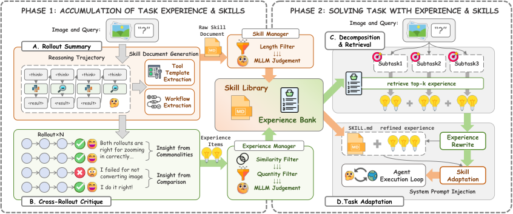
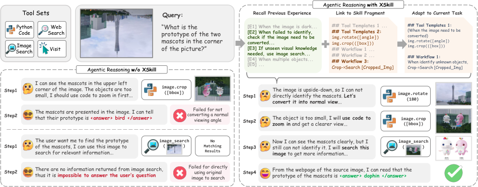
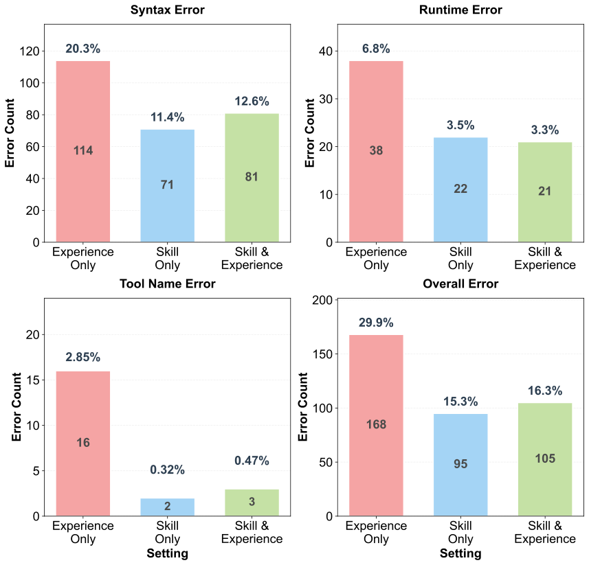
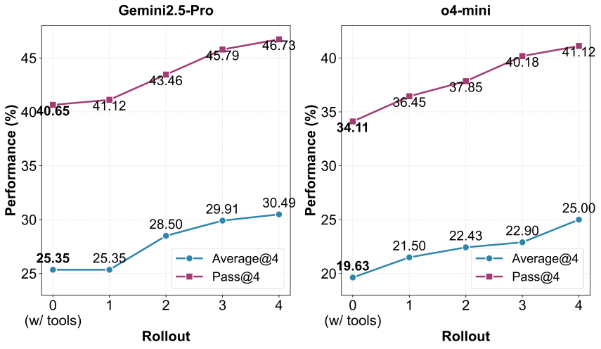
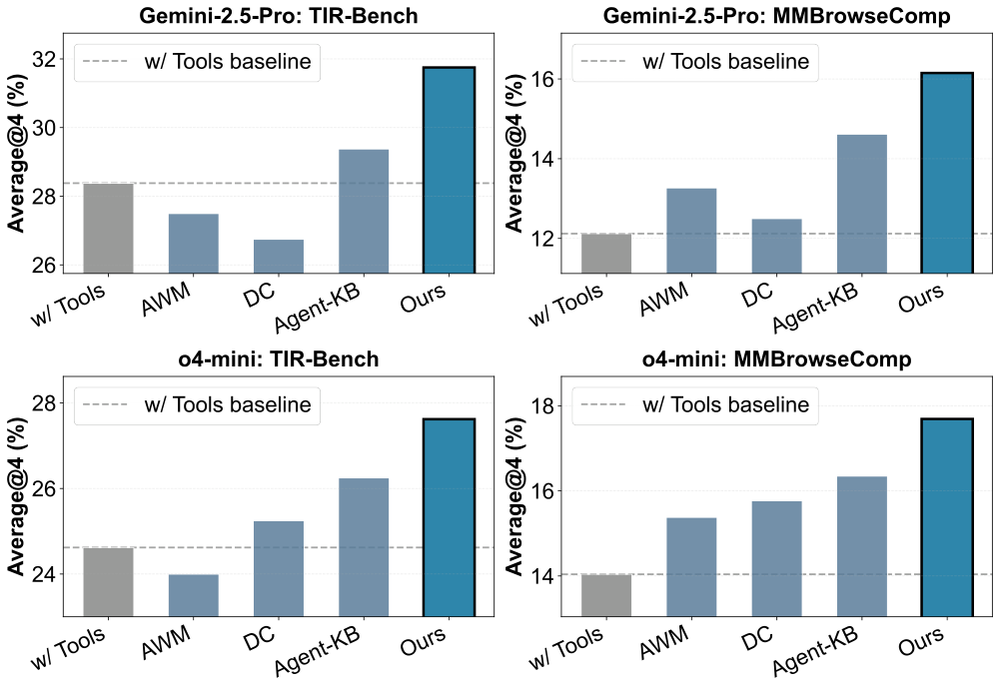

# XSkill：让多模态 Agent 在不训练参数的前提下持续进化

## 先说结论：这篇论文到底解决了什么问题？

多模态 Agent（能看图、能调用工具、能搜索网页）已经很强，但在真实开放环境里仍有两个顽疾：

1. **工具用得不高效** ：简单任务也会绕远路，复杂任务又常常探索不够深。  
2. **工具编排不灵活** ：遇到新任务时，工具组合容易僵化，泛化能力差。

这篇论文提出的 **XSkill** ，核心是让 Agent 像人一样，把“过往经历”沉淀成两类可复用知识，并形成闭环：

- **Skills（技能）** ：任务级、结构化流程知识（怎么规划、怎么串工具）。
- **Experiences（经验）** ：动作级、上下文敏感的战术提示（某种场景下优先做什么）。

重点在于：它不是微调模型参数，而是做 **外部知识持续积累 + 视觉语境检索与改写** 。这使得它可以跨模型迁移，甚至能把一个强模型积累的知识转移给另一个模型使用。

---

## 研究动机：为什么“经验 + 技能”要分开建模？

论文的洞见很清晰：

- 仅靠高层流程（skill）不够，因为执行时常有很多局部坑（如图片反转、OCR 误读、工具参数错误）。
- 仅靠局部经验（experience）也不够，因为没有全局任务结构，容易“头痛医头”。

所以 XSkill 把两者拆开并协同：

- **Skill** 负责“框架正确性”（少走错路、少犯结构性错误）；
- **Experience** 负责“策略灵活性”（在具体视觉上下文里动态选工具、修正策略）。

---

## 方法总览：双流知识 + 双阶段循环

> 图解：这是 XSkill 的总流程图。左侧是 **Phase I（知识积累）** ，从多条 rollout 轨迹里做总结、对比批判、层级合并；右侧是 **Phase II（任务求解）** ，先任务分解再检索经验，随后做视觉上下文改写，最后把适配后的技能注入执行模型。横向看是“学”，纵向看是“用”，闭环看是“持续进化”。

> 图解：这张对比图展示了“有无 XSkill”在同一多模态任务上的轨迹差异。横向通常是两条推理链；纵向是步骤推进。没有 XSkill 的轨迹出现视觉语义错位（如未做旋转/裁剪），而有 XSkill 的轨迹会先调用相关经验和技能片段，再生成更贴地的执行计划。

---

## 数学建模：把“会做题”拆成可管理知识对象

论文把任务建模成 POMDP，并定义两个知识对象。

### 1）Skill 定义（任务级）

Skill 记为 $k \in \mathcal{K}$，形式化为三元组：

- 元数据 $\mathcal{M}$（名称、描述、版本）
- 工作流 $\mathcal{W}$
- 可复用模板 $\mathcal{P}$（代码/查询模板）

### 2）Experience 定义（动作级）

Experience 记为 $e \in \mathcal{E}$，形式化为：

- 触发条件 $c$
- 建议动作 $a$
- 检索向量 $\mathbf{v}_e \in \mathbb{R}^d$

并约束长度 $|c| + |a| \leq L_{\max}^e$，避免经验冗长失焦。

### 3）总体目标

给定任务 $\mathcal{T}=(q,\mathcal{I})$（文本查询 + 图像集），构建外部知识库 $\mathcal{KB}=(\mathcal{K},\mathcal{E})$，最大化正确率：

$$
\max_{\mathcal{KB}} \mathbb{P}[\hat{y}=y^* \mid \mathcal{T}, \mathcal{KB}]
$$

---

## Phase I：知识积累（从 rollout 到可复用知识）

### A. Rollout Summary（视觉扎根总结）

对每个训练任务做 $N$ 次 rollout，交给知识模型总结：

$$
\mathcal{S}_{\mathcal{R}_i}, \Delta \mathcal{K}_i
= \text{MLLM}_{\text{kb}}(\mathcal{R}_i,\mathcal{I}_i,q_i,y_i^*,\mathcal{K}_{\text{adapted}})
$$

关键不是“复述轨迹”，而是把 **视觉证据与动作决策绑定** ：  
例如“因为检测到图像倒置，所以触发旋转；因为对比度低，所以触发增强”。

### B. Cross-Rollout Critique（跨轨迹对比批判）

利用成功/失败轨迹对比，提炼经验更新操作：

$$
\Delta \mathcal{E}_i=\text{MLLM}_{\text{kb}}(\mathcal{S}_{\mathcal{R}_i},y_i^*,\mathcal{E}_{\text{ret}})
$$

操作类型包括 `add` 和 `modify`，本质是在做“经验库自演化”。

### C. Knowledge Consolidation（层级合并与压缩）

- 经验层：基于余弦相似度阈值 $\theta_{\text{sim}}$ 做合并去重；
- 技能层：对技能文档做段落级更新/合并/删除；
- 超长时触发质量驱动精炼（保泛化、去特例）。

这一块决定了系统能否长期运行不崩：否则知识越积越乱，后续检索会被噪音拖垮。

---

## Phase II：任务求解（先拆再找，再按图改写）

### A. 任务分解检索（不是直接拿原 query 去搜）

先把任务拆成子需求 $\mathcal{G}=\{g_1,\dots,g_{n_g}\}$，每个子任务独立检索：

$$
\mathcal{E}_{\text{ret}}
=
\bigcup_{g \in \mathcal{G}}
\operatorname{Top\text{-}k}
\left(
\{e \in \mathcal{E} \mid \cos(\mathbf{v}_g,\mathbf{v}_e)>\tau_{\text{min}}\}
\right)
$$

这样能覆盖“同一任务中的多技术面向”（如图像修复 + 逻辑校验 + 错误恢复）。

### B. Experience Rewrite（经验改写）

把通用经验改写为当前图像语境下可执行建议：

$$
\mathcal{E}_{\text{rewritten}}=\text{MLLM}_{\text{kb}}(\mathcal{E}_{\text{ret}},q,\mathcal{I})
$$

### C. Skill Adaptation（技能裁剪与融合）

把全局技能文档裁剪成任务可用版本：

$$
\mathcal{K}_{\text{adapted}}
=
\text{MLLM}_{\text{kb}}(\mathcal{K},\mathcal{E}_{\text{rewritten}},q,\mathcal{I})
$$

然后注入执行模型提示词。注意这里是“参考式注入”，不是强制脚本，给模型保留 improvisation 空间。

---

## 实验设置：覆盖 3 大域、5 个基准、4 个闭源骨干模型

### 数据与任务域

- **视觉工具推理** ：VisualToolBench、TIR-Bench  
- **多模态搜索** ：MMSearch-Plus、MMBrowseComp  
- **综合高难任务** ：AgentVista

### 工具配置

> 图解：该图的横轴是不同错误类型（如语法错误、运行时错误、工具名错误），纵轴是错误比例/次数。它直接说明 Skill 会显著压低结构性执行错误，尤其是 syntax/tool-name 这类“低级但致命”错误。

### 评价指标

- **Average@4** ：4 次 rollout 的平均成功率（稳定性）
- **Pass@4** ：4 次 rollout 至少一次成功（上限能力）

---

## 主结果：XSkill 在几乎所有设置中都明显领先

论文报告的核心趋势非常稳定：

- 相比仅工具基线，XSkill 在不同模型上 **Average@4 提升 2.58～6.71** 点。
- 在高难 TIR-Bench（Gemini-3-Flash）上，XSkill 达到 **47.75%** ，比最强基线 Agent-KB 高 **11.13** 点。
- 在知识迁移场景（GPT-5-mini、o4-mini 使用 Gemini-3-Flash 累积知识）中仍有明显收益，说明外部知识结构具有跨模型可迁移性。

---

## 消融与行为分析：为什么双流设计有效？

### 消融结论（VisualToolBench, Gemini-2.5-Pro）

- 去掉 Experience：Average@4 从 30.49 降到 27.45（-3.04）
- 去掉 Skill：降到 26.64（-3.85）
- 说明两者都重要，且 Skill 在该数据集上贡献更大。

### 行为层解释

- **Skill 主要抑制执行错误** ：总错误率从 29.9% 降到 15.3%，语法错误和工具名错误显著减少。
- **Experience 主要提升编排灵活性** ：  
  在 VisualToolBench 中 Code Interpreter 使用占比从 66.63% 提升至 76.97%；  
  在 MMSearch-Plus 中 image search 占比明显提升，说明策略更“按任务选工具”。

> 图解：横轴是 rollout 数量 $N$，纵轴是 Average@4 / Pass@4。随着 $N$ 增加，两项指标持续上升，且 Pass@4 上升更陡。这说明多路径 rollout 提供了更丰富的对比样本，帮助知识提炼更稳。

> 图解：这是跨任务零样本迁移结果。横轴是目标基准（如 TIR-Bench、MMBrowseComp），纵轴是 Average@4。XSkill 曲线/柱形整体高于基线，并高于灰色工具基线参考线，说明其泛化不是“记住题目”，而是学到可迁移方法。

---

## 附录中的关键信息：复现与扩展价值很高

### 1）开源模型迁移结果（Qwen3-VL）

迁移到 Qwen3-VL-235B/32B 时出现“均值不总是涨、Pass@4 常上涨”的现象。  
这说明较弱的基础模型在吸收外部知识时可能受到干扰，但探索次数增加会提升“至少一次成功”的概率。

### 2）关键超参数（复现重点）

- Rollout 数 $N=4$
- 检索 top-$k=3$
- 经验合并阈值 $\theta_{\text{sim}}=0.70$
- 经验库上限 120 条
- 技能文档精炼阈值 1000 词
- 执行温度 0.6，分解/改写温度 0.3

### 3）工具定义很工程化

Web Search / Image Search / Visit / Code Interpreter 四工具都给了参数规范与调用约束，适合直接落地到 agent framework。

---

## 论文的价值与局限

### 价值

- 给出了多模态 Agent 的 **非参数持续学习** 实用路径；
- 双流知识设计把“高层流程”与“低层战术”解耦，解释性更强；
- 跨模型转移能力证明外部知识库具备平台化潜力。

### 局限与风险

- 知识库可能传播偏差（尤其在跨模型迁移时）；
- 需要知识审计机制，否则“错误经验”会进入闭环；
- 当前实验主要是单轮“积累后测试”，虽架构支持长期迭代，但真实长期漂移问题仍待更多实证。

---

## 对实战系统的启发（博主版落地建议）

1. 先把你现有 Agent 的历史轨迹结构化成两层：`skills.md` + `experiences.json`。  
2. 不要只按 query 检索，先做 task decomposition 再多路检索。  
3. 强制增加一层“经验改写器”，防止把通用建议硬塞给当前任务。  
4. 给知识库加去重与质量门槛，否则 2～3 周后就会知识膨胀失效。  
5. 对跨模型迁移设置白名单与审计，避免把偏差一起迁移过去。

---

> 本文参考自 [XSkill: Continual Learning from Experience and Skills in Multimodal Agents](https://arxiv.org/abs/2603.12056)