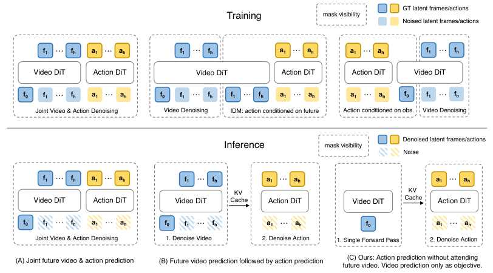
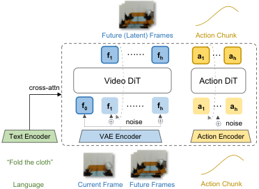
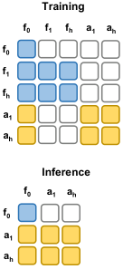
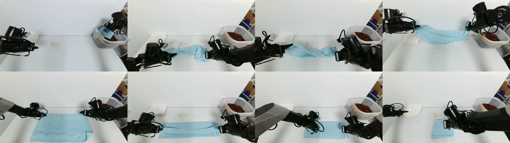
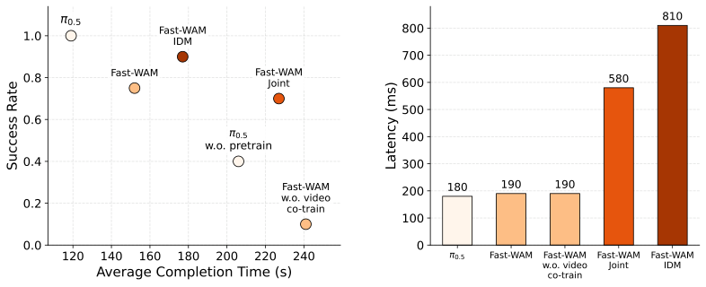

# Fast-WAM：世界动作模型真的需要在推理时"想象未来"吗？

> 论文：Fast-WAM: Do World Action Models Need Test-time Future Imagination?
> 作者：Tianyuan Yuan, Zibin Dong, Yicheng Liu, Hang Zhao（清华大学 IIIS & Galaxea AI）
> 项目主页：https://yuantianyuan01.github.io/FastWAM/

这篇文章提出了一个非常朴素但直击要害的问题：当前火热的 **世界动作模型（World Action Model, WAM）**，它们的性能提升究竟来自哪里？是 **训练时** 的视频预测目标塑造了更好的世界表征，还是 **推理时** 显式地"想象"未来画面带来了额外的预见能力？作者通过精巧的解耦实验给出了答案：WAM 的主要收益来自训练时的视频协同训练，而非测试时的未来想象。基于这个发现，他们设计了 **Fast-WAM** ——训练时保留视频建模目标，推理时完全跳过未来帧生成，用单次前向编码直接输出动作，延迟仅 **190 ms**，比现有 imagine-then-execute 类 WAM 快 **4 倍以上**，且不需要任何具身预训练（embodied pretraining）就能达到 SOTA 级别的性能。

## 一、背景：从 VLA 到 WAM

要构建通用具身智能体，策略不仅要能把视觉观测映射为动作，还要能推理"物理世界在动作作用下会如何演化"。

目前主流的 **Vision-Language-Action (VLA)** 模型（如 OpenVLA、$\pi_0$、$\pi_{0.5}$ 等）直接把视觉观测和语言指令映射到机器人动作。它们继承了大规模预训练的语义先验，泛化能力很强，但有一个本质缺陷：VLA 的预训练大多基于 **静态图文数据**，并没有显式建模"世界在动作作用下如何演化"。

于是 **WAM** 应运而生：通过预测未来视觉状态（world modeling）来辅助动作预测。但绝大多数现有 WAM 都采用 **imagine-then-execute（先想象后执行）** 范式——先迭代去噪生成未来视频帧，再基于"想象出的未来"预测动作。这带来两个问题：

  1. **推理延迟巨大**：视频去噪需要多步迭代，测试时延迟非常高，难以满足实时控制需求；
  2. **因果归因不清**：WAM 的收益可能来自两个纠缠在一起的来源——(i) 训练时的视频预测目标让模型学到物理上有意义的表征；(ii) 推理时显式生成未来提供了额外预见。现有系统把两者绑在一起，无法判断到底是谁在起作用。

这篇文章的核心思路就是：**解耦这两个因素**。如果世界建模的主要价值在于训练时塑造更好的隐表征，那么一个 WAM 应该可以在不承担测试时视频合成代价的前提下，保住这份收益。

> 图解：三种代表性的 WAM 范式。(A) **联合建模型 WAM**：未来视频 token 和动作 token 在同一个模型里一起联合去噪；(B) **因果型 WAM**：先生成未来观测，再以生成的未来表征为条件预测动作；(C) **Fast-WAM（本文）**：训练时保留视频协同训练，推理时彻底移除显式未来生成，从隐式世界表征单次前向直接预测动作。可以看到 Fast-WAM 的推理路径里没有"未来视频"这一支路。

## 二、方法：Fast-WAM 的设计

### 2.1 问题形式化

考虑从视觉观测和语言指令学习具身策略。记当前观测为 $o$，任务指令为 $l$，动作块（action chunk）为 $a_{1:H}$，其中 $H$ 是预测时域（horizon）。标准的视觉运动策略直接建模条件分布：

$$
p(a_{1:H} \mid o, l)
$$

即把当前感知上下文直接映射为动作序列。WAM 在此基础上引入未来视觉观测 $v_{1:T}$ 作为中间变量，多数现有 WAM 遵循 imagine-then-execute 分解：

$$
p(a_{1:H} \mid o, l) = \int p(v_{1:T} \mid o, l)\, p(a_{1:H} \mid o, l, v_{1:T})\, dv_{1:T}
$$

即先预测未来观测，再以"想象出的未来"为条件生成动作。实践中通常有两种实现：要么在共享模型里联合去噪未来视频和动作，要么先生成未来视频再喂给逆动力学/动作预测模块。

Fast-WAM 的关键观察是：WAM 的有效性可能来自两个不同的因素——训练时的视频预测目标，以及推理时的显式未来生成。现有形式把二者耦合在一起。Fast-WAM 在 **训练时** 保留世界建模作为协同训练信号，但在 **推理时** 不显式生成未来观测，而是直接从当前观测和指令预测动作：

$$
p_\theta(a_{1:H} \mid o, l) = p_\theta(a_{1:H} \mid z(o, l))
$$

其中 $z(o, l)$ 是视频骨干网络在当前上下文条件下产生的隐式世界表征。与 imagine-then-execute WAM 的关键区别在于：$z(o, l)$ 通过 **单次前向编码** 得到，而不是在推理时显式采样或去噪未来观测 $v_{1:T}$。这样一来，Fast-WAM 在测试时的接口与普通 VLA 直接策略完全一致，但其表征学习仍然由 WAM 式的视频建模所支撑。

### 2.2 模型架构

Fast-WAM 构建在 **Wan2.2-5B** 的视频 Diffusion Transformer (DiT) 之上，后者充当世界建模骨干。同时复用其预训练文本编码器和视频 VAE：任务语言由内置的 T5 编码器编码，通过 cross-attention 提供给所有 token；视觉观测则由预训练 VAE 映射为隐空间视频 token。在此之上，引入一个 **动作专家 DiT（action expert）** 负责动作块生成。整个模型组织成 **Mixture-of-Transformer (MoT)** 架构，视频分支与动作分支之间共享 attention。

输入 token 被组织成三组：

  1. **第一帧观测的干净隐 token**：作为共享的视觉锚点（visual anchor）；
  2. **未来视频帧的带噪隐 token**：仅在训练时用于视频建模；
  3. **动作 token**：由动作专家处理，用于动作生成。

所有 token 组都通过 cross-attention 访问语言嵌入。一个 **结构化 attention mask** 控制各组之间的信息流：训练时，未来的带噪视频 token 在视频分支内部双向 attend，并可以访问干净的第一帧 token；动作 token 在动作分支内部双向 attend，同样可以访问干净的第一帧 token。**关键设计** 是：动作 token **不能** attend 未来视频 token，干净的第一帧 token 也不 attend 任何其他 token。这保证了视频建模和动作预测锚定在同一视觉上下文上，同时防止未来信息泄漏进动作分支。

> 图解：Fast-WAM 的整体架构。左侧视频 DiT 处理观测帧的隐 token 与语言条件，右侧动作专家 DiT 负责动作块去噪，两分支通过共享 attention 组成 MoT 结构。训练时未来视频 token 参与联合学习，推理时该支路被整体移除，只保留第一帧干净 token 单次前向。

> 图解：结构化注意力掩码。左为训练 mask：视频分支内部、动作分支内部各自双向可见，二者都能看到第一帧干净 token，但动作 token 看不到未来视频 token；右为推理 mask：未来视频支路被完全移除，只剩干净观测 token 与动作 token。这个 mask 正是"解耦视频协同训练与动作生成"的机械实现。

**推理时的变化**：Fast-WAM 把整个未来视频分支完全移除——只保留第一帧干净隐 token，通过视频骨干单次前向得到隐式世界特征供动作专家使用。由于不实例化任何带噪未来视频 token、也不做显式未来视频去噪，推理成本远低于标准的 imagine-then-execute WAM。

### 2.3 训练目标

Fast-WAM 在动作 token 和未来视频隐变量上使用联合的 **flow matching（流匹配）** 目标。给定目标变量 $y$（动作块 $a_{1:H}$ 或未来视频隐变量 $z_{1:T}$），采样高斯噪声 $\epsilon \sim \mathcal{N}(0, I)$ 和时间步 $t \in (0,1)$，构造插值样本：

$$
y_t = (1-t)\, y + t\, \epsilon
$$

模型学习预测对应的速度场（velocity field），使用标准 flow matching 目标：

$$
\mathcal{L}_{\mathrm{FM}}(y) = \mathbb{E}_{y,\,\epsilon,\,t} \left[ \left\| f_\theta(y_t,\, t,\, o,\, l) - (\epsilon - y) \right\|_2^2 \right]
$$

该目标分别实例化到动作生成与视频协同训练上。动作预测取 $y = a_{1:H}$：

$$
\mathcal{L}_{\mathrm{act}} = \mathcal{L}_{\mathrm{FM}}(a_{1:H})
$$

视频协同训练取 $y = z_{1:T}$，其中 $z_{1:T}$ 是预训练 VAE 产生的未来视频帧隐 token：

$$
\mathcal{L}_{\mathrm{vid}} = \mathcal{L}_{\mathrm{FM}}(z_{1:T})
$$

总训练目标为：

$$
\mathcal{L} = \mathcal{L}_{\mathrm{act}} + \lambda\, \mathcal{L}_{\mathrm{vid}}
$$

其中 $\lambda$ 平衡动作学习与视频协同训练。

### 2.4 受控变体：回答核心问题

为了回答"WAM 的收益到底来自训练时的视频协同训练，还是推理时的显式未来想象"，作者在共享实现框架下设计了一组受控变体，骨干网络、tokenization 和训练配方尽量对齐，从而把测试时未来生成的贡献与视频协同训练目标本身的贡献隔离开来：

  - **Fast-WAM-Joint**：对应联合生成范式，未来视频 token 与动作 token 在共享模型中一起去噪，动作生成全程与未来视频建模耦合（对应 WAM、Unified World Models、Motus 等路线）；
  - **Fast-WAM-IDM**：对应 video-then-action 范式，先从当前观测和语言上下文生成未来视频 token，再以生成的未来表征为条件做动作预测（对应 LingBot-VA、Vidar 等路线），并按 LingBot-VA 的做法以概率 $p=0.5$ 对真值视频 token 加噪；
  - **Fast-WAM w.o. video co-train**：架构和推理流程完全不变，仅移除训练时的视频建模目标——这是对"视频协同训练本身作用"的直接对照组。

这组变体把以往 WAM 中纠缠的两个因素干净地分离开来，是整篇文章方法论上最漂亮的部分。

## 三、实验设置与实现细节

**模型规模**：以预训练 Wan2.2-5B 为骨干（视频 DiT + 文本编码器 + 视频 VAE）。动作专家与视频分支架构相同，但隐层维度缩减为 $d_a = 1024$，形成 1B 参数的动作专家，模型总参数量 6B。动作时域设为 $h = 32$。视频帧在时间上 4 倍下采样，每个 chunk 对应 9 帧；多相机图像先拼接成单图再送入 VAE。

**训练与推理配置**：视频与动作分支使用相同的 flow matching 形式，噪声调度采用 logit-normal 分布；推理时使用 10 步去噪，classifier-free guidance (CFG) scale 为 1.0。优化器为 AdamW，学习率 $1 \times 10^{-4}$，weight decay 0.01，cosine annealing 调度，混合精度训练，梯度裁剪阈值 1.0。所有延迟数据在单张 NVIDIA RTX 5090D V2 32GB GPU 上测得。

**评测基准**：

  - **LIBERO**：四个标准套件（Spatial / Object / Goal / Long），每个套件 500 条演示、10 个任务，训练 20k 步，在 40 个任务上共 2000 次试验报告成功率；
  - **RoboTwin 2.0**：50 多个双臂协同操作任务，采用多任务训练设置——2500 条干净场景演示 + 25000 条重度场景随机化演示，训练 30k 步，每任务 100 次试验，分别报告 clean 与 randomized 设置下的平均成功率；
  - **真机评测**：在 Galaxea R1 Lite 平台上做 **长时程叠毛巾任务**，采集 60 小时遥操作演示，训练 30k 步，同时报告平均成功率和平均完成时间——前者衡量"最终能不能叠好"，后者衡量策略是否学到了高效的执行策略而非反复试错纠正。

> 图解：Galaxea R1 Lite 平台上的真机叠毛巾任务序列。折叠可变形物体需要长时程规划与精确的闭环操作，是同时考察任务成功率与执行效率的高难度基准。

## 四、实验结果

### 4.1 仿真基准上的总体对比

**RoboTwin 结果**（成功率 %，Embodied PT. 表示是否使用具身预训练）：

| 方法 | 具身预训练 | Clean | Rand. | 平均 |
| --- | --- | --- | --- | --- |
| $\pi_0$ | 是 | 65.92 | 58.40 | 62.2 |
| $\pi_{0.5}$ | 是 | 82.74 | 76.76 | 79.8 |
| Motus | 是 | 88.66 | 87.02 | 87.8 |
| Motus from WAN2.2 | 否 | 77.56 | 77.00 | 77.3 |
| LingBot-VA | 是 | 92.90 | 91.50 | **92.2** |
| LingBot-VA from WAN2.2 | 否 | 80.60 | -- | 80.6 |
| **Fast-WAM（本文）** | 否 | 91.88 | 91.78 | **91.8** |
| Fast-WAM-Joint | 否 | 90.84 | 90.32 | 90.6 |
| Fast-WAM-IDM | 否 | 91.16 | 91.34 | 91.3 |
| Fast-WAM w.o. video co-train | 否 | 82.76 | 84.80 | 83.8 |

**LIBERO 结果**（成功率 %）：

| 方法 | 具身预训练 | Spatial | Object | Goal | Long | 平均 |
| --- | --- | --- | --- | --- | --- | --- |
| OpenVLA | 是 | 84.7 | 88.4 | 79.2 | 53.7 | 76.5 |
| $\pi_0$ | 是 | 96.8 | 98.8 | 95.8 | 85.2 | 94.1 |
| $\pi_{0.5}$ | 是 | 98.8 | 98.2 | 98.0 | 92.4 | 96.9 |
| LingBot-VA | 是 | 98.5 | 99.6 | 97.2 | 98.5 | **98.5** |
| Motus | 是 | 96.8 | 99.8 | 96.6 | 97.6 | 97.7 |
| **Fast-WAM（本文）** | 否 | 98.2 | **100.0** | 97.0 | 95.2 | 97.6 |
| Fast-WAM-Joint | 否 | 99.6 | 99.4 | 98.2 | 96.8 | **98.5** |
| Fast-WAM-IDM | 否 | 98.8 | 97.8 | 97.8 | 97.6 | 98.0 |
| Fast-WAM w.o. video co-train | 否 | 89.2 | 99.2 | 95.4 | 90.0 | 93.5 |

几点值得注意：

  - 在 RoboTwin 上，Fast-WAM 取得 **91.8%** 成功率，超过所有 **不使用具身预训练** 的基线，并与最强的预训练 WAM（LingBot-VA 92.2%）几乎打平；大幅领先无预训练的 Motus（77.3%）和 LingBot-VA from WAN2.2（80.6%）。
  - 在 LIBERO 上，Fast-WAM 平均成功率 **97.6%**，强于 VLA 基线 $\pi_{0.5}$（96.9%），并与预训练 WAM 基线 LingBot-VA（98.5%）、Motus（97.7%）接近。
  - 这些结果说明：Fast-WAM 在没有以往 WAM/VLA 普遍依赖的具身预训练的情况下，就能恢复先前 WAM 流水线的大部分收益，数据效率非常高。

### 4.2 受控对比：解耦两个因素

这是全文最关键的实验。两个仿真基准上的结论高度一致：

  - **Fast-WAM 与两个 imagine-then-execute 变体基本打平**。RoboTwin 上：91.8% vs. Joint 90.6% vs. IDM 91.3%；LIBERO 上：97.6% vs. 98.5% vs. 98.0%。三者差距在 1 个百分点上下。
  - **移除视频协同训练的代价则大得多**。RoboTwin 上掉到 83.8%（差 8 个百分点），LIBERO 上掉到 93.5%（差 4 个百分点以上），且在 Spatial 和 Long 子集上退化尤其明显。

也就是说：**训练时保留视频建模目标，远比测试时显式生成未来观测重要**。WAM 式训练的主要收益，不在于测试时"是否想象、如何想象"未来，而在于视频预测目标在训练时塑造了以世界为依据的表征。

### 4.3 真机性能与效率

> 图解：长时程叠毛巾任务的真机结果。左图横轴为平均完成时间、纵轴为成功率，越靠左上越好；右图对比各方法的推理延迟。可以看到：Fast-WAM 家族（带视频协同训练）整体聚在左上区域且延迟很低；移除视频协同训练的变体成功率暴跌、完成时间最长；imagine-then-execute 变体（尤其 Fast-WAM-IDM）延迟显著更高。

主要结论：

  - 预训练的 $\pi_{0.5}$ 仍是该任务上最强的方法（成功率最高、完成时间最短），这是它唯一领先的地方；
  - Fast-WAM 家族内部整体表现接近：Fast-WAM-IDM 成功率最高，而 **Fast-WAM 完成时间更优**；所有带视频协同训练的 Fast-WAM 变体都大幅超过无预训练的 $\pi_{0.5}$，说明 WAM 式视频协同训练即使没有具身预训练也能带来很强的数据效率；
  - **移除视频协同训练带来戏剧性退化**：成功率跌至仅 **10%**，且完成时间为所有方法中最长。这个差距远大于 Fast-WAM 各变体之间的差异，再次印证视频协同训练是真机高性能的主导因素，而测试时未来想象的作用相对有限；
  - **延迟方面**：Fast-WAM 保持 **190 ms** 的低推理延迟，而 imagine-then-execute 变体明显更慢，Fast-WAM-IDM 高达 **810 ms**。这使 Fast-WAM 成为更适合真机部署的设计点：任务性能强，推理成本低。

### 4.4 附录：RoboTwin 逐任务结果

论文附录给出了 RoboTwin 上 50 个任务在 clean 与 randomized 两种评测设置下的逐任务成功率。总体格局与平均分一致：Fast-WAM 在多数任务上达到或接近 100%，与 LingBot-VA 互有胜负；无视频协同训练的变体在 Handover Block、Hanging Mug、Blocks Ranking Size 等需要更强世界理解的任务上退化尤为严重；个别任务（如 Open Microwave、Turn Switch）上各方法差异较大，Motus 与 LingBot-VA 在少数任务上仍占优。逐任务数据进一步支持了主结论：带视频协同训练的四个变体（Fast-WAM、Joint、IDM 及预训练基线）之间差距很小，而与无协同训练变体之间的鸿沟显著。

## 五、相关工作定位

**VLA 策略**：以 OpenVLA、$\pi_0$、GR00T、RT 系列为代表，直接映射观测与指令到动作，继承 web 规模预训练的语义先验，但预训练基于静态图文数据，不显式建模世界随动作的演化。Fast-WAM 与之互补：测试时保持与 VLA 一样的直接策略接口，但学习过程叠加了基于未来视觉预测的世界建模目标。

**WAM 与基于视频的机器人策略**：一条平行路线通过未来视觉预测做机器人控制，近期方法进一步把未来视频与动作统一建模（即 WAM）。多数 WAM 要么遵循 imagine-then-execute（先生成未来视觉轨迹再做动作预测），要么在共享生成过程中联合建模未来视频与动作。Fast-WAM 与这条线最接近，但关注点不同：不再提出又一个 imagine-then-execute WAM，而是研究 WAM 的收益究竟来自训练时的视频协同训练还是推理时的显式未来想象。

**绕开测试时视频合成的工作**：VPP 用视频扩散模型提取的预测性视觉表征作为策略条件；UVA 联合建模视频与动作、测试时跳过视频解码以加速推理。与这些工作相比，Fast-WAM 的侧重点在于在共享框架下通过受控变体 **解耦** 训练时视频协同训练与测试时未来想象的相对作用。

## 六、总结与展望

这篇文章重新审视了 WAM 的一个基本问题：收益主要来自测试时的显式未来想象，还是训练时的视频建模？答案是后者。Fast-WAM 在训练时保留视频协同训练、推理时跳过未来预测，从世界表征隐变量中直接生成动作；在仿真与真机基准上无需具身预训练即可实时运行并达到强性能，190 ms 延迟比现有 imagine-then-execute WAM 快 4 倍以上。受控对比显示：Fast-WAM 与 imagine-then-execute 变体性能相当，而移除视频协同训练会导致大得多的性能退化。

对从业者的启示很直接：**如果你在用 WAM，真正值钱的可能不是推理时那段昂贵的未来视频生成，而是训练时的视频预测目标本身**。这为实时具身控制指明了一个更经济的设计方向——把世界建模当作表征学习的"教练"，而不是推理时的"水晶球"。未来工作的一个重要方向是研究更大规模预训练数据与模型扩展对这一设计的影响。

> 本文参考自 [Fast-WAM: Do World Action Models Need Test-time Future Imagination?](https://arxiv.org/abs/2603.16666)