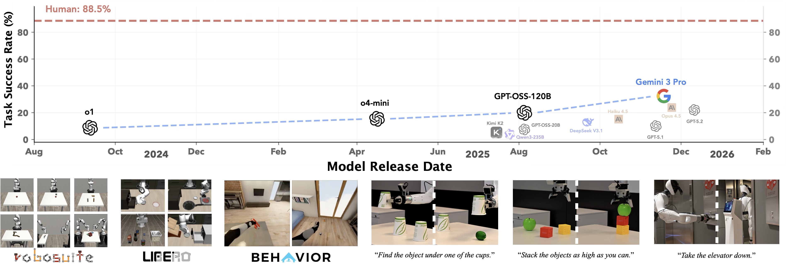
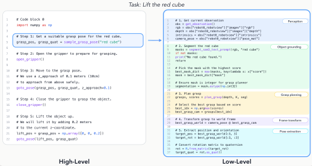
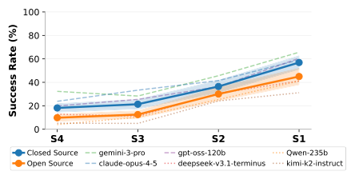
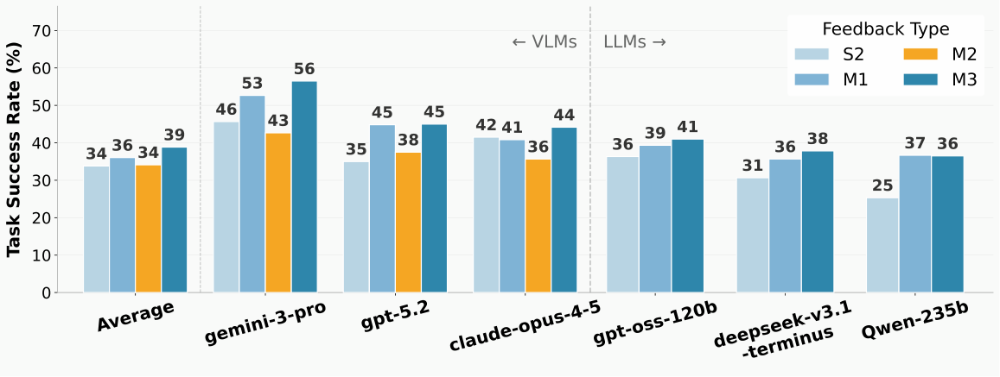
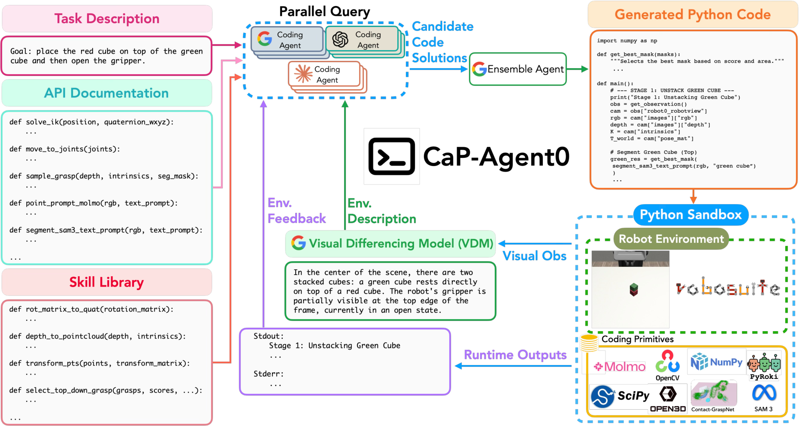
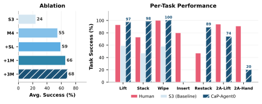
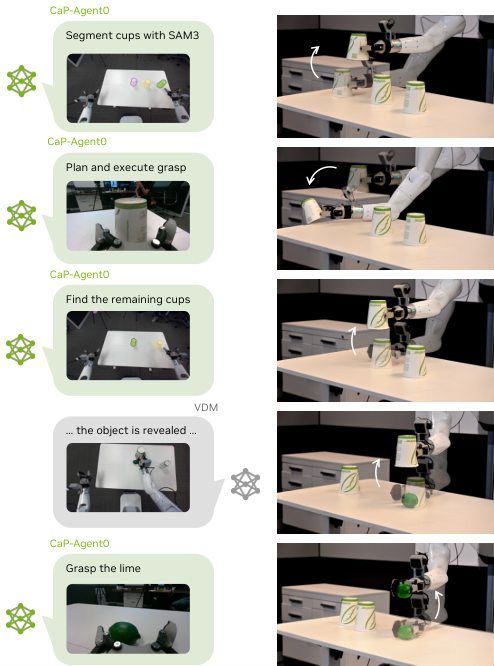

# CaP-X 深度解读：当 Coding Agent 走进机器人操控——来自 NVIDIA、Berkeley、Stanford 的系统性评测与改进框架

让大模型写代码来控制机器人（Code-as-Policy，简称 CaP）早已不是新鲜事，但一个根本问题一直没被认真回答： **机器人任务的成功率，到底多少来自模型本身的能力，多少来自人类工程师精心封装的高级 API？** 这篇来自 NVIDIA、UC Berkeley、Stanford 和 CMU 的 CaP-X 第一次把这个问题系统性地拆解开来：他们搭建了一个统一框架，让 coding agent 在不同抽象层级、不同交互模式、不同感知条件下接受"压力测试"。核心发现颇具冲击力——12 个前沿模型在人工封装的高级原语上表现尚可，但一旦撤掉这些"脚手架"，成功率就大幅滑坡；而通过多轮交互、视觉差异文本化、自动技能库和集成推理等 test-time compute 手段，免训练的 CaP-Agent0 在 7 个任务中的 4 个上达到甚至超过了人类专家手写代码的水平。更惊艳的是 CaP-RL：一个 7B 的开源模型 Qwen2.5-Coder 经过 GRPO 强化学习后，在仿真中 Cube Stack 成功率从 4% 飙到 44%，并零样本迁移到真实 Franka 机械臂上达到 76%。

## 为什么需要 CaP-X：机器人控制的"第三条路"

机器人控制长期有两条主流路线。

**经典路线** （STRIPS、TAMP 等）靠人类工程师手写程序，把高层目标分解成子任务，组合感知与控制模块。可解释、精确，但费时费力，且高度任务特化——换个场景就得重写。

**VLA 路线** （Vision-Language-Action 模型，如 RT-2、OpenVLA、$\pi_0$）用大规模视觉-运动数据端到端训练，在叠衣服、全身移动操控等接触丰富的任务上表现惊艳。但 VLA 继承了训练数据的局限：不可解释，遇到环境变化、新本体、长程任务就得重新采数据、重新训练。

**第三条路** 是让 coding agent 取代人类工程师：LLM 直接生成可执行的机器人控制程序。CaP 的先驱工作（如 Code as Policies、ProgPrompt）已经做过探索，但它们用的是人工调优的高级原语，比如 `stack_objs_in_order()` 这种一个函数顶一个子任务的"宏"。这就带来一个尴尬：我们分不清性能是模型的功劳还是 API 设计的功劳。

CaP-X 正是为回答这个问题而生。它包含四个组件：

- **CaP-Gym** ：基于标准 Gymnasium 接口的交互式环境，agent 通过生成并执行 Python 程序来控制机器人；
- **CaP-Bench** ：沿抽象层级、交互模式、感知 grounding 三个轴系统评测前沿模型的 benchmark；
- **CaP-Agent0** ：基于 benchmark 洞察设计的免训练 agentic 框架；
- **CaP-RL** ：直接在 coding agent 上做可验证奖励强化学习（RLVR）的训练方案。

> 图解：上图横轴是模型发布日期，纵轴是 CaP-Bench 任务成功率。可以看到，尽管（视觉）语言模型在 SWE-bench、GPQA、MMLU 等领域已逼近人类，但在"写代码控制机器人"这件事上仍然落后于人类专家手写的程序（虚线）。下图展示了 CaP-Gym 整合的三大仿真器（Robosuite、LIBERO-PRO、BEHAVIOR）以及 CaP-Agent0 在真实机器人上的零样本部署。

## CaP-Gym：把机器人仿真器包装成 REPL 环境

CaP-Gym 的设计哲学很直接： **保留底层仿真器的原生动力学，但用 coding agent 熟悉的 Read-Eval-Print Loop（REPL）范式暴露出来** 。

一个"回合"（turn）对应 agent 与某个机器人任务实例的一次完整交互：agent 收到观测，生成一段 Python 程序，环境把它执行到底。这段程序可以调用多个感知与控制原语，每个原语内部又可以驱动仿真器或机器人控制器跑很多步。

感知侧，原语把原始传感器数据抽象成结构化语义对象：SAM3 做语言条件分割，Molmo 2 做开放词汇指点，另有 OpenCV、Open3D 等标准视觉库。控制侧，agent 不直接发关节空间指令，而是调用运动规划或逆运动学求解器（如 PyRoki），由控制器处理碰撞检查、可达性约束——agent 在任务导向的笛卡尔空间里思考，执行可行性交给底层。所有计算密集的原语都实现为无状态服务，支持高吞吐并行评测。

这个设计还有一个深意：感知与控制接口在仿真和真实机器人之间是 **共享** 的，这为后面的 sim-to-real 埋下了伏笔。

## CaP-Bench：三轴拆解的"压力测试"

CaP-Bench 从 CaP-Gym 的 187 个任务（7 个 Robosuite + 130 个 LIBERO-PRO + 50 个 BEHAVIOR）中精选 7 个核心任务——Cube Lift、Cube Stack、Spill Wipe、Peg Insertion、Cube Re-stack、Two-Arm Lift、Two-Arm Handover——覆盖单臂到双臂协调。评测协议是 **Zero-Shot Pass@1** ，每任务每 tier 跑 100 次 trial，并引入人类专家基线：7 位有 2 年以上机器人编程经验的论文作者，用与模型完全相同的原语写单脚本，反复调试直到平均成功率 88.5%，作为"准上界"。

benchmark 沿三个轴变化，组成 4 个单轮 tier（S1–S4）和 4 个多轮 tier（M1–M4）：

| Tier | 轮次 | 抽象层级 | 感知 | 反馈方式 |
| --- | --- | --- | --- | --- |
| S1 | 单轮 | 高级原语 | 特权状态（真值） | 无 |
| S2 | 单轮 | 高级原语 | 真实 RGB-D 感知 | 无 |
| S3 | 单轮 | 低级原语（含用法示例） | 真实感知 | 无 |
| S4 | 单轮 | 低级原语（无示例） | 真实感知 | 无 |
| M1 | 多轮 | 高级原语 | 真实感知 | stdout/stderr 文本 |
| M2 | 多轮 | 高级原语 | 真实感知 | M1 + 原始 RGB 图像 |
| M3 | 多轮 | 高级原语 | 真实感知 | M1 + VDM 视觉差异文本 |
| M4 | 多轮 | 低级原语（含示例） | 真实感知 | M1 + VDM |

其中 S1 的设计很聪明：用真值掩码和物体位姿替代感知，把"高层规划能力"和"感知噪声"解耦，得到一个推理上界，从而能区分失败到底是"想错了"还是"看错了"。

> 图解：左边是 Gemini-3-Pro 用高级原语完成"举起红色方块"的代码——寥寥几行；右边是用低级原语实现同一个高级原语功能的代码——要自己调分割、算点云、规划抓取、解 IK。这就是"脚手架"的含金量。

参评的 12 个模型包括闭源的 Gemini-3-Pro、GPT o1/o4-mini/5.1/5.2、Claude Haiku 4.5/Opus 4.5，以及开源的 GPT-OSS-20B/120B、Qwen3-235B、Qwen2.5-Coder-7B、Kimi K2、DeepSeek-V3.1。

### 三大发现

**发现一：单轮设定下，前沿模型与人类专家差距明显。**

闭源模型稳定强于开源模型，新架构强于旧架构，但在 S4（低级原语、无示例、单轮零样本）这个最"裸"的设定下，没有任何模型能追上人类手写程序。

**发现二：高级抽象提升性能，但牺牲表达力。**

> 图解：横轴从 S4（最低抽象）到 S1（最高抽象），纵轴是平均任务成功率。随着原语抽象层级升高，成功率单调上升——这解释了为什么以往依赖高级原语的 CaP 工作能报告亮眼的零样本性能。

但代价是表达力天花板：抽象越高，agent 的动作空间越被人类先验束缚，低级推理的失败被掩盖。反过来，S3/S4 的性能滑坡反映的是代码合成的真实难度，同时也展现出固定高级原语无法表达的行为——比如层次化的感知 fallback 策略。博主认为，这是全文最有价值的洞见： **评估通用 embodied coding agent，应该以原语级性能为准，否则你测的只是 API 工程师的归纳偏置。**

**发现三：多轮闭环与视觉 grounding 能补回差距，但方式有讲究。**

> 图解：对比单轮 S2 与多轮 M1–M3。纯文本执行反馈（M1）对几乎所有模型都有提升；反直觉的是，直接塞原始 RGB 图像（M2）反而掉点；把视觉差异转成结构化文本的 VDM（M3）则在开源和闭源模型上都稳定提升。

M2 退化的原因，作者假设是 **跨模态对齐鸿沟** ：基础模型很少被训练去同时推理"写代码"和"物理执行画面"这两件事，原始像素在代码合成中难以消化。而 VDM（Visual Differencing Module）用一个 VLM 把观测转成结构化自然语言——首轮生成场景描述，后续轮次显式描述前后图像的差异以及任务是否完成——恰好弥合了这个鸿沟。

更进一步的证据来自 M4：低级原语 + 多轮反馈 + VDM，不仅超过单轮高级原语（S2），还能追平多轮高级原语（M3）。这支持了一个 **test-time compute scaling** 假说： **鲁棒性可以在运行时"合成"出来** ——只要给 agent 足够的推理、验证和自我纠错机会，哪怕操作的是原子级原语。

## CaP-Agent0：把 benchmark 洞察变成免训练系统

> 图解：CaP-Agent0 的三大组件——（1）自动合成的技能库，来自 CaP-Bench 中成功 rollout 的沉淀；（2）VDM 视觉差异模块，把每轮场景变化转成文本；（3）并行推理系统，多个 coding agent 针对同一 prompt 生成候选代码，由集成 agent 合成为最终代码，在 Python 沙箱（仿真器或真实机器人）中执行。

benchmark 暴露了三个缺口，CaP-Agent0 就针对性地给出三味药：

**1. 多轮视觉差异（VDM）** 。直接采纳发现三，把观测 grounding 到结构化文本而非原始像素，规避 M2 暴露的跨模态对齐失败。

**2. 自动合成、跨任务持久的技能库** 。作者发现，强模型在 S3/S4 里会反复手写类似的辅助函数（坐标变换、深度转点云、top-down 抓取筛选等）。于是他们把 12 个模型在 7 个 Robosuite 任务上所有成功的 S3 rollout 收集起来，用正则提取函数定义，再让 Gemini-3-Pro 归纳出高频、任务无关的逻辑，得到 9 个经验证的通用原语（如 `rotation_matrix_to_quaternion`、`depth_to_point_cloud`、`select_top_down_grasp`）。

这个设计的聪明之处在于：这些技能不是人设计的，而是 **agent 自己从成功执行中"发现"的** ——既保留了低级接口的表达力，又通过复用提升鲁棒性。这正是对发现二的正面回应：抽象不必来自人类脚手架，agent 可以自己从低级原语中恢复结构。

**3. 并行推理（集成代码生成）** 。每轮同时采样多个候选：单模型配置下用 9 个不同温度（0.1–0.9）查 Gemini-3-Pro；多模型配置下 GPT-5.2、Claude Opus 4.5、Gemini-3-Pro 各查 3 次。然后由一个中央 coding agent 把候选合成为最终代码。多轮续写的决策（REGENERATE 还是 FINISH）也用同样的投票机制。

定性分析显示，集成生成的代码会 **预防性地** 写 fallback 分支（比如抓取规划失败时退回质心抓取），而单模型生成的代码往往只在"撞过墙"之后才补 bug——前者平均轮数更低、代码更健壮。

> 图解：左图是消融实验——从单轮低级 API 出发，依次叠加 VDM（M4）、技能库（+SL）、单模型并行（+1M）、多模型并行（+3M），成功率阶梯式上升。右图：在 7 个 CaP-Bench 任务中的 4 个上，CaP-Agent0 达到或超过人类专家代码的单轮成功率。

### CaP-Bench++：与 VLA 和人类专家正面对比

在更大的任务分布上，CaP-Agent0 与三个 SOTA VLA（OpenVLA、$\pi_0$、$\pi_{0.5}$）在 LIBERO-PRO 的 30 个任务上对比（每任务 50 次 trial），考察两类扰动：初始位置扰动（Pos）和指令扰动（Task）：

| 方法 | libero-object Pos | libero-object Task | libero-goal Pos | libero-goal Task | libero-spatial Pos | libero-spatial Task |
| --- | --- | --- | --- | --- | --- | --- |
| OpenVLA | 0.00 | 0.00 | 0.00 | 0.00 | 0.00 | 0.00 |
| $\pi_0$ | 0.00 | 0.00 | 0.00 | 0.00 | 0.00 | 0.00 |
| $\pi_{0.5}$ | 0.17 | 0.01 | **0.38** | 0.00 | **0.20** | 0.01 |
| CaP-Agent0 | **0.22** | **0.18** | 0.26 | **0.17** | 0.12 | **0.14** |

> 解读：VLA 在指令扰动下几乎全军覆没（Task 列趋近 0），因为它们的训练指令分布是固定的；CaP-Agent0 基于语言理解，天然对指令变化鲁棒，并在 object/goal/spatial 三个子集的 Task 扰动上全面领先，在 object 子集的 Pos 扰动上也反超 $\pi_{0.5}$。注意这是免训练方法对阵后训练 VLA。

在 BEHAVIOR 的两个长程移动操控任务上（R1Pro 轮式人形机器人捡收音机、捡汽水罐，各 25 次 trial）：

| 任务 | Human 导航 | S3 导航 | CaP-Agent0 导航 | Human 任务 | S3 任务 | CaP-Agent0 任务 |
| --- | --- | --- | --- | --- | --- | --- |
| 捡收音机 | **88%** | 72% | 80% | 36% | 24% | **56%** |
| 捡汽水罐 | 80% | 52% | **84%** | **72%** | 32% | **72%** |

> 解读：CaP-Agent0 在任务成功率上全面大幅领先单轮 S3，并在汽水罐任务上追平人类专家。关键差异在于它会"主动调整位姿获得更好视野"、"罐子被撞倒后重新采样抓取姿态"——多轮闭环带来的恢复能力。

成本方面，CaP-Agent0 在 Robosuite 任务上单次 trial 约 2 分钟（LLM 代码生成 6.8–23.8 秒/轮）。与 VLA 比延迟并不公平：VLA 每步几十到一百多毫秒输出一个动作，而 CaP-Agent0 每次生成产出的是 **整段操控序列** ，合理的比较轴是"每次任务尝试的成本"。

## 真实世界：零样本的具身推理

CaP-Gym 的环境循环刻意设计成可直接对接真实机器人的感知控制接口。CaP-Agent0 在 Franka Panda 和 AgiBot G1 上零样本完成了一系列未见过的任务，全部是现成的 Gemini-3-Pro、Claude Opus 4.5，无任何后训练：

- **大海捞针** ：在杂乱场景中找到并抓取一个不常见物品（自动铅笔芯盒）——这类稀有物体对端到端 VLA 很难，但 VLM 定位 + 代码执行轻松搞定；
- **机械搜索** ：青柠藏在三个倒扣杯子之一下面，机器人逐个掀开检查，全程视觉闭环；
- **多模态符号推理** ：看懂木块摆出的算式 "59 + 8"，选出正确的数字块放到正确位置，一次成功；
- **具身物理推理** ："把这些东西堆得越高越好"——VDM 先描述"方块表面平整适合堆叠，网球是球体得放最上面"，agent 据此推导出唯一稳定的堆叠顺序；
- **从人类反馈学习** ：第一次抓苹果抓高了，用户说一句"抓太高了"，第二轮代码即修正成功；
- **工具泛化** ："坐电梯下楼"——机器人与墙面成角度，agent 调用 SciPy 的 RANSAC 对分割出的墙面点云拟合平面、计算法向量，确定按钮该往哪个方向按。

> 图解：左列是 agent 的规划过程，右列是真实机器人的执行画面。机械搜索要求系统性探索——这正是程序化控制相比一次性动作预测的天然优势：搜索逻辑可以直接写成循环和条件分支。

系统还配了一个聊天式 Web UI（含 Viser 3D 可视化），用户可以选任务、看每一步工具调用的中间结果（SAM3 掩码、Molmo 2 标点、腕部相机画面），并在回合之间插话给反馈。

## CaP-RL：直接强化学习 coding agent 本身

前面都是免训练的打法。CaP-RL 回答另一个问题：能不能直接在 coding agent 上做 RL？

方法是用 GRPO（Group Relative Policy Optimization）对 Qwen2.5-Coder-7B-Instruct 做 on-policy 后训练，奖励来自物理仿真结果（可验证奖励）。三个训练任务：Cube Lift、Cube Stack、Spill Wipe。有两个关键设计决策：

- **在特权层级 S1 上训练** ：用真值状态 API 去掉感知噪声，避免"正确的程序因感知误差执行失败"造成的信用分配模糊；
- **跨越 sim-to-real 边界的是"代码即动作空间"** ：agent 学的是如何组合一套在仿真和现实中固定的感知控制工具，而不是把原始视觉特征映射到电机指令——这正是它能零样本迁移的原因。

结果相当硬核：

| 方法 | 仿真 Cube Lift | 仿真 Cube Stack | 仿真 Spill Wipe | 真实 Cube Lift | 真实 Cube Stack |
| --- | --- | --- | --- | --- | --- |
| Human Expert | 93% | 73% | 100% | 92% | 84% |
| Qwen2.5-Coder-7B（基座） | 25% | 4% | 30% | 24% | 12% |
| Qwen + CaP-RL | **80%** | **44%** | **93%** | **84%** | **76%** |

> 解读：50 轮 GRPO 迭代让 7B 小模型在三项任务上成功率翻了 3–10 倍，真实 Franka 上 Cube Lift 84%、Cube Stack 76%，逼近人类专家（92%/84%）。值得注意的是真机数字甚至高于仿真——仿真里 S2 感知噪声反而更难。

定性变化更有说服力。训练前，模型常犯"跳步"错误：算出放置位置后直接把夹爪移过去张开，幻觉自己已经抓着方块了——压根没执行抓取。训练后，模型学会完整的因果链：识别 → 抓取 → 搬运 → 释放，并且不再硬编码偏移量，而是用 `return_bbox_extent=True` 动态计算堆叠高度（红色方块半高 + 绿色方块半高）——从死记硬背转向扎根的几何推理。尽管只在 S1 特权状态上训练，策略仍零样本迁移到非特权的 S2 和真实世界，并泛化到任务变体（"把网球放到绿方块上"、随机换颜色等）。

## 相关工作定位与局限

CaP-X 处在一个三不管地带的交叉点：机器人操控 benchmark（Robosuite、LIBERO、RLBench 等）评的是固定策略接口，不评可执行程序合成；代码 benchmark（HumanEval、SWE-bench）没有具身感知；具身 agent benchmark（EmbodiedBench、ALFRED 等）不要求跨抽象层级写机器人控制代码。与 Eureka 等"LLM 当静态代码生成器写奖励函数"的工作不同，CaP-RL 是直接微调语言模型本身。

局限也很坦诚：程序化控制在长程、重推理任务上很强，但对需要紧密视觉伺服和连续反馈的接触丰富任务（插孔、倾倒）仍然脆弱——Peg Insertion 任务上所有配置成功率都是 0，连人类专家也要花 2–3 周才能调好。未来方向包括：混合 CaP-VLA 架构（coding agent 管高层逻辑和恢复，VLA 管低级执行）、更强的具身规划与 test-time 搜索、优化类控制原语（让 agent 指定任务级约束而非裸 IK）、以及扩展到主动感知等经典机器人问题。

## 总结

- **问题拆解** ：CaP-X 首次系统回答了"CaP 性能有多少来自模型、多少来自人工脚手架"——把抽象层级、交互模式、感知 grounding 三个轴拆开独立评测；
- **核心发现** ：成功率随人工抽象单调上升，12 个前沿模型单轮零样本全部打不过人类专家（88.5%）；但 test-time compute（多轮 + VDM + 集成）能在低级原语上把鲁棒性"合成"出来；
- **反直觉一点** ：直接给 agent 看原始图像（M2）反而降性能，把视觉差异转成结构化文本（VDM）才是王道；
- **免训练系统** ：CaP-Agent0 组合 VDM、自动合成技能库、并行推理，4/7 任务追平或超过人类专家，LIBERO-PRO 指令扰动下全面碾压后训练 VLA，真机零样本完成机械搜索、物理推理等开放任务；
- **可训练路线** ：CaP-RL 用 GRPO 把 7B 开源模型在 Cube Stack 上从 4% 练到 44%，并凭"代码即动作空间"零样本 sim-to-real 到真机 76%。

展望来看，这篇工作真正的野心是把机器人控制重新定义为一个 **机器智能问题** ——agent 设计、推理时计算、感知与控制被放进同一个可评测、可训练的闭环里共同研究。当"写控制程序"这件事本身成为 RL 的优化对象，人类工程师在机器人控制回路中的角色，或许真要开始退位了。

> 本文参考自 [CaP-X: A Framework for Benchmarking and Improving Coding Agents for Robot Manipulation](https://arxiv.org/abs/2603.22435v1)