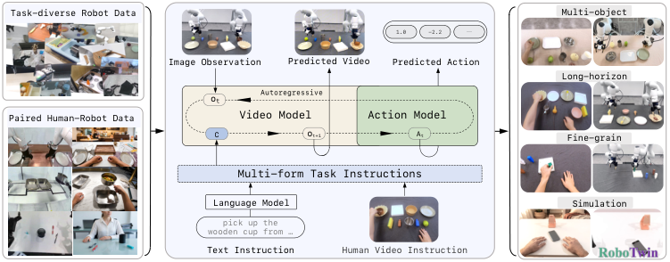
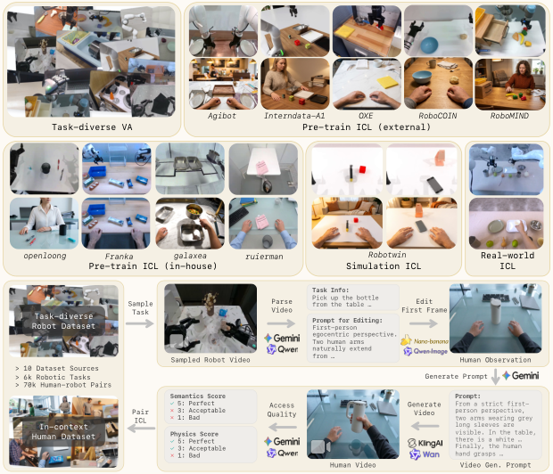
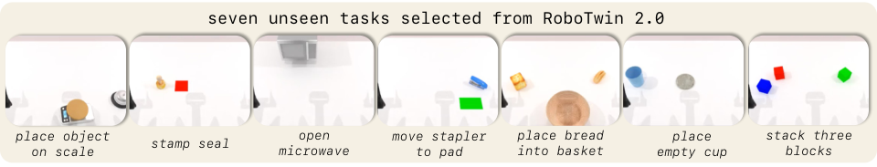
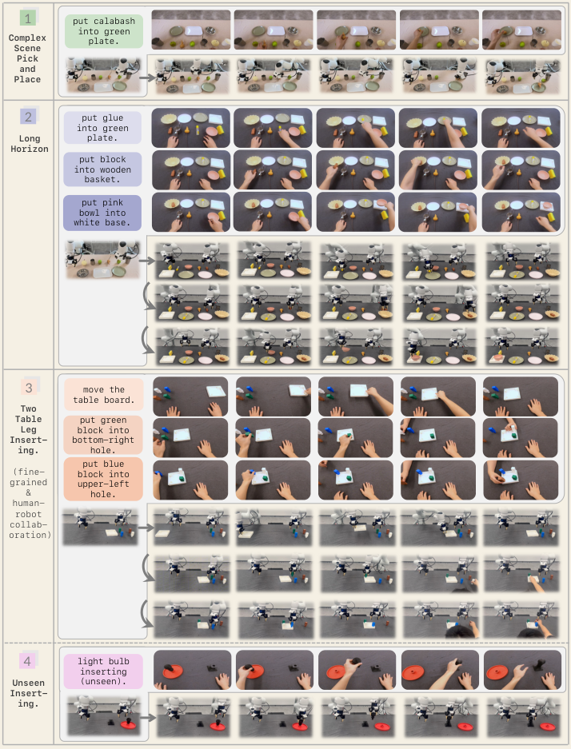
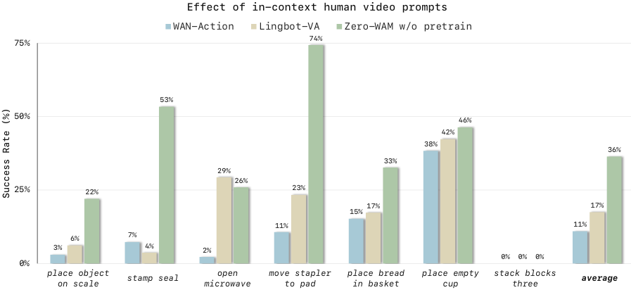
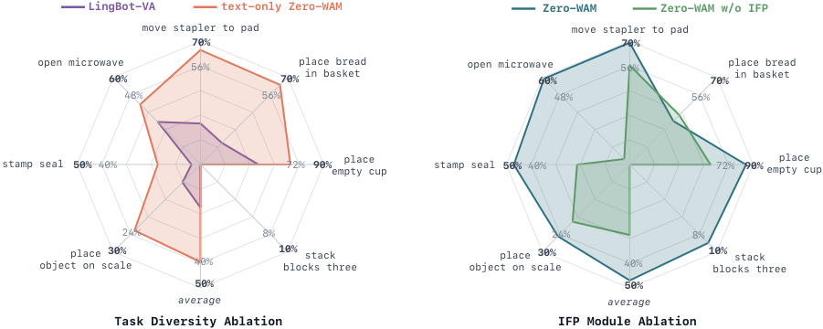

# Zero-WAM：让机器人"看一眼人类视频"就能零样本执行新任务

> 本文参考自 [Zero-WAM: In-Context World-Action Modeling from Human Videos for Open-Ended Task Generalization](https://arxiv.org/abs/2608.26103)

大语言模型最迷人的能力之一是 In-Context Learning（ICL，上下文学习）：不用更新任何参数，只要把任务描述写进 prompt，模型就能完成一个新任务。那么问题来了——机器人能不能也这样？今天解读的这篇来自 Robbyant、港科大（广州）和港科大的工作 **Zero-WAM**，给出了一个相当漂亮的答案：**把"人类演示视频"当作机器人的 prompt**，让机器人在零样本条件下执行训练中从未见过的操作任务。

在 RoboTwin 2.0 仿真的 7 个未见任务上，Zero-WAM 拿到 **47.0%** 的平均成功率，比最强的 video-action 基线 LingBot-VA 高出 **29.5 个百分点**；在真实双臂 Franka 机器人上，它也能跟随人类视频完成多物体场景、长程操作和精细插装等未见任务配置。

## 一、要解决什么问题：跨任务泛化之困

### 1.1 语言不是好的任务接口

当前主流的机器人策略主要有两条路线：

- **VLA（Vision-Language-Action）模型**：如 OpenVLA、$\pi_0$、GR00T 等，把视觉-语言表示直接映射到动作；
- **Video-Action 模型（WAM，World Action Model）**：如 LingBot-VA 系列，先预测未来机器人视频，再从视频中解码动作。

但这两条路线有一个共同短板：**都主要依赖语言作为任务接口**。而语言在描述操作任务时天然是"欠约束"的——空间约束、中间状态、时序结构这些东西用嘴说不清楚。比如"把两根桌腿分别插进桌面底座上指定的孔里，红色的插左边第二个，蓝色的插右边第一个"，这样的指令写起来冗长，模型理解起来也容易出错。

相比之下，**人类演示视频是一种天然的任务规范（task specification）**：它直接展示了期望的视觉状态变化及其时间演化，给出了场景应该如何演变的具体视觉证据。虽然人类视频不包含机器人可执行的动作，但它给策略提供了一个视觉参照，让机器人结合自身的本体结构和动力学去"复现"这个任务。

### 1.2 用人类视频做 ICL 的两大拦路虎

想法很美好，但要规模化地利用人类视频，有两个核心挑战：

1. **数据稀缺**：训练"跟随人类视频"的策略，需要语义对应的人-机器人配对数据（人类视频 + 带可执行动作的机器人轨迹）。这类数据靠人工采集又贵又慢，现有数据集（如 RH20T、EgoMimic）要么任务数少得可怜，要么完全依赖手工采集。
2. **捷径学习（shortcut learning）**：在训练集上，下一步机器人视频往往仅凭机器人历史观测和文本指令就能猜出来，模型完全可以"偷懒"不看人类视频也能降低训练损失。结果就是：在训练任务上表现很好，到了测试时面对真正需要人类视频来指定的未见任务，模型却习惯性忽略这个关键信号。

Zero-WAM 的贡献正是对着这两个痛点来的：用 **自动生成管线** 解决数据问题，用 **IFP 训练目标** 解决捷径问题。

## 二、Zero-WAM 整体框架

> 图解：Zero-WAM 的整体框架。模型接收两种任务指定方式——人类演示视频（in-context prompt）或语言指令——然后自回归地预测未来的机器人视频 chunk 和对应的可执行动作 chunk。人类视频指令是通过自动化管线从任务级采样的机器人轨迹大规模生成的，配合任务均衡的机器人 video-action 预训练语料一起训练。右侧展示了模型在仿真未见任务和真实复杂任务上的验证效果。

Zero-WAM 是一个 **因果视频-动作模型（causal video-action model）**，核心设计可以概括为：

- **统一的双模态任务接口**：同一个策略同时支持语言指令和人类演示视频作为任务规范；
- **预测范式**：自回归地预测"未来机器人视频 + 时间对齐的动作"，即先"想象"未来画面，再从画面中解码动作；
- **预训练数据**：大规模人-机器人 ICL 配对数据（*HumanGen*）+ 任务均衡的机器人视频-动作数据（*Task-diverse VA*）。

这种"先预测视频再解码动作"的范式有一个理论优势：它把"未见任务泛化"这个难题从 **动作空间泛化** 转移到了 **视频生成泛化**，而先前工作已经证明，只要未来视频预测得准，从中解码出正确的机器人动作是相对容易的。

## 三、数据构建：怎么"凭空"造出 7.4 万对人-机器人配对数据

> 图解：上半部分是数据构成——*Task-diverse VA* 提供任务均衡的机器人视频-动作预训练数据，*HumanGen* 则包含四个子集的 ICL 配对数据（外部预训练、内部预训练、仿真、真实世界）。下半部分是 in-context 人类视频生成管线：从任务级采样的机器人视频出发，经过 VLM 任务分析 → 图像编辑 → 视频生成 → VLM 质检，自动产出语义匹配的人类演示视频。

### 3.1 Task-diverse VA：任务均衡的机器人预训练数据

作者从 5 个公开机器人数据集中取材：AgiBot、InternData-A1、Open-X-Embodiment、RoboCOIN 和 RoboMIND（与 LingBot-VA 使用的源数据一致）。

问题在于：这些原始数据集里大量轨迹是 **同一个任务的重复遥操作**——直接用原始分布训练，模型会被少数高频任务的冗余轨迹"带偏"，浪费掉数据里本来就存在的任务多样性。

解决办法是 **任务级重采样**：

- 把每个数据集按"操作动作 + 操作物体"的组合重新划分成任务（任务标签优先取元数据，不够就从轨迹中解析）；
- 每个任务有界采样一定数量轨迹，采样上界根据各源数据集的任务内多样性调整；
- 最终覆盖 **6,000+ 任务**，每个训练 epoch 约 **40 万条** 机器人轨迹。

这套任务均衡语料，既是把通用视频生成模型改造成自回归机器人视频-动作模型的基础，也为后面的人类视频生成管线提供了任务丰富的源轨迹。

### 3.2 人类视频生成管线：机器人轨迹 → 人类演示视频

这是本文工程上最亮眼的创新。人工采集人-机器人配对数据成本极高，作者干脆 **用生成模型来造**。管线分四步：

1. **VLM 任务分析**：用 Gemini 3.1 Pro 或 Qwen3.6-Plus 分析机器人视频，提取任务名称、物体初始状态、状态变化和最终状态，并生成一个"图像编辑 prompt"，用于把机器人视频首帧变换成人类操作场景的初始观测；
2. **图像编辑**：用 Nano Banana 2 或 Qwen-Image-2.0，根据首帧 + 编辑 prompt 生成人类场景的初始图像。这一步会注入背景、视角、环境风格、物体实例、物体摆放等 **视觉对齐变化**（保持任务语义不变）；
3. **视频生成**：VLM 再结合编辑后的人类观测和物体状态信息，生成描述"人类双手如何操作物体完成任务"的视频生成 prompt，交给 Wan 2.7 或 Kling AI 3.0 合成人类操作视频；
4. **VLM 质检**：最后由 VLM 评估生成视频的任务语义保持度和物理合理性，合格的才与原始机器人轨迹配成 ICL 样本。

这个设计妙在：生成的 **人类视频与机器人轨迹天然语义对齐**，且机器人轨迹保留了可执行动作标注——人类视频负责"任务指定"，机器人轨迹负责"动作监督"，各取所长。

### 3.3 HumanGen 数据集：四个子集

*HumanGen* 共包含 **74.2K 人-机器人 ICL 对，覆盖 8.6K 任务**，按来源分为四个子集：

| 子集 | 任务数 | ICL 对数 | 说明 |
| --- | --- | --- | --- |
| Pre-train ICL (External) | 5,062 | 41,188 | 来自 5 个公开数据集，覆盖 45+ 机器人本体；刻意多样化场景、物体、摆放、视角（第一/第三人称均衡），强迫模型学习任务级对应关系 |
| Pre-train ICL (In-house) | 3,522 | 30,247 | 来自内部数据集（双臂 Franka、Galaxea R1 Pro 等）；降低视觉变化频率，产出更视觉对齐的样本 |
| Simulation ICL | 50 | 2,500 | 50 个 RoboTwin 任务各 50 条；43 个任务用于后训练，7 个留作未见任务评测 |
| Real-world ICL | -- | 252 | 真实双臂 Franka 上的配对数据，覆盖三个真实评测任务族，用于后训练适配真机运动学 |

与现有数据集对比，*HumanGen* 的优势相当明显：

| 数据集 | 多来源 | 本体数 | 人类视角 | 获取方式 | 对齐多样性 | 样本数 | 任务数 |
| --- | --- | --- | --- | --- | --- | --- | --- |
| MIME | ✗ | 1 | 第三人称 | 人工采集 | ✗ | 8.3K | 20 |
| EgoMimic | ✗ | 1 | 第一人称 | 人工采集 | ✗ | 2.1K | 3 |
| BC-Z | ✗ | 1 | 第一人称 | 人工采集 | ✓ | 18.7K | 100 |
| EgoHumanoid | ✗ | 1 | 第一人称 | 人工采集 | ✗ | 1.2K | 4 |
| RH20T | ✗ | 4 | 第一&第三人称 | 人工采集 | ✗ | 110K | 147 |
| EgoScale | ✗ | 1 | 第一人称 | 人工采集 | ✗ | 10.3K | 344 |
| **HumanGen（本文）** | ✓ | >45 | 第一&第三人称 | **自动生成** | ✓ | **74.2K** | **8.6K** |

最关键的一列是任务数：**8.6K vs. 此前最多的 344**——任务覆盖度是零样本跨任务泛化的命脉，而这正是自动管线带来的规模红利。

## 四、方法：In-Context World Action Modeling

### 4.1 预备知识：Flow Matching 与因果视频-动作建模

**Flow Matching（流匹配）**。视频生成采用 flow matching：给定干净视频 $\mathbf{x}_0$、高斯噪声 $\boldsymbol{\epsilon} \sim \mathcal{N}(\mathbf{0}, \mathbf{I})$ 和流时间 $t \in [0,1]$，加噪视频和目标速度定义为：

$$
\mathbf{x}_t = (1-t)\mathbf{x}_0 + t\boldsymbol{\epsilon}, \qquad \mathbf{v}^{\star}_t = \boldsymbol{\epsilon} - \mathbf{x}_0
$$

在条件 $c$ 下，flow matching 的损失为：

$$
\mathcal{L}_{\mathrm{fm}} = \mathbb{E}_{\mathbf{x}_0, \boldsymbol{\epsilon}, t} \left[ \left\| \mathbf{v}_{\theta}(\mathbf{x}_t, t, c) - \mathbf{v}^{\star}_t \right\|_2^2 \right]
$$

推理时从纯噪声出发，沿学到的速度场积分回 $t=0$ 即得到生成的视频。

**因果视频-动作建模**。沿用了 LingBot-VA 系列的框架：每条机器人轨迹被切成 chunk 序列 $\tau = \{(\mathbf{x}^{i}, \mathbf{a}^{i})\}_{i=1}^{N}$，其中 $\mathbf{x}^{i}$ 是视频 chunk，$\mathbf{a}^{i}$ 是时间对齐的动作 chunk。在 chunk 索引 $i$ 处，模型做因果预测：

$$
p_\theta\left( \mathbf{x}^{i+1}, \mathbf{a}^{i+1} \mid \mathbf{x}^{\le i}, \mathbf{a}^{\le i}, c \right)
$$

这个联合预测被分解为"先视频、后动作"两步：

$$
p_\theta\left( \mathbf{x}^{i+1}, \mathbf{a}^{i+1} \mid \mathbf{x}^{\le i}, \mathbf{a}^{\le i}, c \right) = p_\theta^{\mathrm{vid}}\left( \mathbf{x}^{i+1} \mid \mathbf{x}^{\le i}, \mathbf{a}^{\le i}, c \right) \cdot p_\theta^{\mathrm{act}}\left( \mathbf{a}^{i+1} \mid \mathbf{x}^{\le i}, \mathbf{a}^{\le i}, \mathbf{x}^{i+1}, c \right)
$$

其中 $p_\theta^{\mathrm{act}}$ 本质上是一个 **逆动力学模型**：从预测出的未来视频 chunk 中解码可执行动作。条件 $c$ 有两种形态：*Task-diverse VA* 样本上 $c = \ell$（仅语言指令）；*HumanGen* 样本上 $c = \{\mathbf{h}, \ell\}$（人类视频 + 语言指令）。

**Mixture-of-Transformers（MoT）设计**。视频分支和动作分支各有独立参数（QKV 投影、FFN、输出头），但两模态的表示放在 **同一条序列** 里，只通过共享注意力层交互。动作 chunk 的表示被放在未来视频表示之后，保证动作解码时能 attend 到预测出的未来视频——正好对应上面的分解式。

**模型实例化**。以 *Wan-2.2-TI2V-5B*（双向文/图生视频模型）为底座，改造成上述因果视频-动作策略。

### 4.2 人类视频作为任务规范

训练时，人类视频 $\mathbf{h}$ 被拼在机器人轨迹之前，作为前缀记忆（prefix memory）。视频 Transformer 的预测条件为：

$$
\mathcal{C}^{\mathrm{vid}, i} = [\,\mathbf{h}, \mathbf{x}^{\le i}, \mathbf{a}^{\le i}, \ell\,], \qquad p_\theta^{\mathrm{vid}}(\mathbf{x}^{i+1} \mid \mathcal{C}^{\mathrm{vid}, i})
$$

一个值得注意的设计：**动作 Transformer 不直接 attend 人类视频**。理由是任务语义已经被"吸收"进预测出的下一个机器人视频 chunk 里，动作解码就退化为标准的逆动力学问题：

$$
p_\theta^{\mathrm{act}}(\mathbf{a}^{i+1} \mid \mathbf{x}^{\le i}, \mathbf{a}^{\le i}, \mathbf{x}^{i+1}, \ell)
$$

另外，由于人类视频和机器人视频共用同一个 VAE 编码器（同一视觉隐空间），需要用位置编码把两者区分开。作者采用 **RoPE 高度轴偏移**：机器人视频 latent 保持原坐标，人类视频 latent 在高度轴上整体平移 $\Delta_H$（设 $\Delta_H > H_{\mathrm{mv}}$，即超出多视角机器人视频的坐标范围）：

$$
\mathrm{pos}_{\mathrm{robot}}(q, y, x) = (q, y, x), \qquad \mathrm{pos}_{\mathrm{human}}(q, y, x) = (q, y + \Delta_H, x)
$$

这样人类视频 latent 落在机器人视频坐标范围之外，避免了同一序列中两类视觉表示互相混淆。

### 4.3 IFP：堵住"不看视频也能蒙对"的捷径

这是本文在训练目标上的核心创新。问题的根源在于：teacher-forcing 训练时，**紧邻的下一个机器人视频 chunk 往往靠外推最近的机器人历史就能预测**，模型不需要看人类视频也能降低 loss。这个捷径在见过任务上无伤大雅，但在未见任务上是致命的——恰恰此时人类视频是唯一指定任务的信息源。

作者借鉴 Next Forcing 的多 chunk 预测思想，提出 **In-context Future chunk Prediction（IFP）**：一个仅训练期使用的辅助目标，要求模型从当前机器人视频表示出发，预测多个带时间步长的未来视频 chunk。

设时间步长 $s \ge 1$，预测 $K$ 个未来 chunk，第 $k$ 个目标索引为：

$$
j_k = (i+1) + 1 + (k-1)s, \qquad k = 1, \ldots, K
$$

具体实现上，作者添加 $K$ 个 IFP 模块 $\{G_k\}_{k=1}^{K}$，每个模块结构与视频分支的单层 Transformer 相同，并从视频分支最后一层初始化。工作流程：

1. 从主视频 Transformer 的 $M$ 个中间层收集当前 chunk $\mathbf{x}^{i+1}$ 的隐表示 $\{\mathbf{r}^{i+1}_m\}_{m=1}^{M}$，拼接后用一个轻量 MLP $P_{\mathrm{fuse}}$ 投影回单层维度：

$$
\boldsymbol{\phi}^{i+1} = P_{\mathrm{fuse}}\left( \mathrm{Concat}\left(\{\mathbf{r}^{i+1}_m\}_{m=1}^{M}\right) \right)
$$

2. 每个 IFP 模块 $G_k$ 基于这个融合表示、干净的机器人历史和语言指令，去噪预测对应的未来 chunk：

$$
p_{\theta,k}^{\mathrm{ifp}}\left( \mathbf{x}^{j_k} \mid \boldsymbol{\phi}^{i+1}, \mathbf{x}^{\le i}, \mathbf{a}^{\le i}, \ell \right)
$$

3. IFP 损失对各未来目标应用 flow matching 目标并加权求和：

$$
\mathcal{L}_{\mathrm{ifp}} = \sum_{k=1}^{K} w_k \, \mathcal{L}_{\mathrm{fm}}\left( \mathbf{x}^{j_k}; \boldsymbol{\phi}^{i+1}, \mathbf{x}^{\le i}, \mathbf{a}^{\le i}, \ell \right)
$$

这里有一个非常关键的设计细节：**IFP 模块不直接条件于人类视频 $\mathbf{h}$**，它获取任务信息的唯一通道是 $\boldsymbol{\phi}^{i+1}$——而这个表示是主视频 Transformer 与人类视频交互之后产生的。为什么？因为 IFP 模块在推理时要被移除，如果允许它们直接看人类视频，辅助分支完全可以自己学一套"看视频预测未来"的能力，主分支依旧偷懒，部署时什么都捞不着。把 IFP 条件在 $\boldsymbol{\phi}^{i+1}$ 上，就 **逼着主分支把人类视频中的长期任务演化信息编码进当前表示**，否则未来预测损失降不下去。预测越远的未来 chunk 越难靠局部历史外推，捷径自然被堵死。

### 4.4 训练与推理

**训练目标**。视频和动作预测都用 flow matching。*Task-diverse VA* 样本的损失：

$$
\mathcal{L}_{\mathrm{VA}} = \mathbb{E}\left[ \mathcal{L}_{\mathrm{fm}}^{i+1}(\ell) + \lambda_a \mathcal{L}_{a}^{i+1}(\ell) \right]
$$

*HumanGen* 样本额外加上 IFP 损失（注意动作损失仍只条件于 $\ell$，因为动作分支不看人类视频）：

$$
\mathcal{L}_{\mathrm{ICL}} = \mathbb{E}\left[ \mathcal{L}_{\mathrm{fm}}^{i+1}(c) + \lambda_a \mathcal{L}_{a}^{i+1}(\ell) + \lambda_{\mathrm{ifp}} \mathcal{L}_{\mathrm{ifp}} \right]
$$

**实现细节**。视频 Transformer 沿用 Wan-2.2 骨干（隐维度 $d_v = 3072$，30 层）；动作 Transformer 隐维度 $d_a = 3072$，参数从视频分支初始化，经 MoT 连接；RoPE 偏移 $\Delta_H = 32$；语言指令用 T5 编码。IFP 预测 $K = 4$ 个未来 chunk、步长 $s = 2$，损失权重 $(w_1, \dots, w_4) = (0.5, 0.25, 0.15, 0.15)$。

**训练配置**。AdamW 优化器，峰值学习率 $1 \times 10^{-4}$，权重衰减 0.01。预训练时 *Task-diverse VA* 与 *HumanGen* 按 **1:5** 采样。为了降低对语言的依赖：非 ICL 样本以 0.1 概率丢弃语言指令；ICL 样本以 0.1 概率丢弃人类视频 latent，并把语言指令 dropout 从 Wan-2.2 默认的 0.1 提高到 **0.4**。预训练机器人视频 chunk 大小随机取自 1~4，总耗时 **15,360 GPU 小时**。沿用了 LingBot-VA 的序列打包技巧，单 GPU 最大 token 长度控制在 160K 以内。

**推理**。IFP 模块被移除，支持两种模式：

- **Language-only 模式**：仅条件于文本指令，视频 CFG scale 为 5；
- **ICL 模式**：人类视频编码一次后缓存为前缀记忆，语言指令可省略，ICL classifier-free guidance scale 为 5。

两种模式下推理 chunk 大小固定为 2，动作 CFG scale 为 1.0。

## 五、实验结果

### 5.1 仿真：RoboTwin 2.0 零样本跨任务评测

> 图解：RoboTwin 2.0 评测中保留的 7 个未见任务示例，涵盖未见物体的抓取放置（如 place empty cup）、铰接物体操作（open microwave）、双臂操作和长程操作（stack blocks three）等多种类型，对跨任务泛化能力构成全面考验。

**设置**：RoboTwin 2.0 包含 50 个双臂操作任务，每个任务 50 条轨迹，全部通过生成管线配上人类视频指令。按任务级划分：43 个任务用于后训练，7 个任务严格留作未见任务评测——这些任务在训练中不以机器人演示形式出现。后训练阶段从预训练 checkpoint 出发，64 张 GPU 训 4,000 步，*Task-diverse VA*、*HumanGen*、RoboTwin 数据按 $2:10:3$ 混合采样。

**基线**：

- **WAN-Action**：同样从 Wan-2.2-TI2V-5B 初始化、同样的 MoT 因果框架，但只在 43 个见过任务上训练，用来衡量"裸 Wan 视频先验"的水平；
- **LingBot-VA**：领先的 video-action 模型，用其官方预训练 checkpoint 在相同时见任务上后训练，代表"有机器人 video-action 预训练"的水平。

三个随机种子，每种子里每个未见任务跑 100 次闭环 rollout：

| 未见任务 | WAN-Action | LingBot-VA | **Zero-WAM** |
| --- | --- | --- | --- |
| Place object on scale | $3.00 \pm 2.16$ | $6.17 \pm 4.87$ | $\mathbf{24.67} \pm 2.05$ |
| Stamp seal | $7.33 \pm 1.25$ | $3.67 \pm 2.49$ | $\mathbf{47.00} \pm 4.55$ |
| Open microwave | $2.26 \pm 1.60$ | $29.33 \pm 10.66$ | $\mathbf{59.00} \pm 2.83$ |
| Move stapler to pad | $10.67 \pm 1.70$ | $23.33 \pm 8.22$ | $\mathbf{69.14} \pm 2.93$ |
| Place bread in basket | $15.26 \pm 2.55$ | $17.33 \pm 6.18$ | $\mathbf{35.00} \pm 3.74$ |
| Place empty cup | $38.33 \pm 2.05$ | $42.33 \pm 7.85$ | $\mathbf{84.87} \pm 0.18$ |
| Stack blocks three | $0.00 \pm 0.00$ | $0.00 \pm 0.00$ | $\mathbf{9.00} \pm 2.16$ |
| **平均** | $10.98 \pm 1.07$ | $17.45 \pm 1.40$ | $\mathbf{46.95} \pm 0.72$ |

几个值得注意的观察：

- **全面提升而非单点爆发**：Zero-WAM 在全部 7 个任务上都超过两个基线，平均领先 LingBot-VA 29.5 个百分点、领先 WAN-Action 约 36 个百分点；
- **铰接/罕见物体任务涨幅最大**：open microwave（$29.33 \to 59.00$）和 stamp seal（$3.67 \to 47.00$）这类需要从任务指定中推断未见动力学的任务，恰恰是人类视频优势最大的地方；
- **打破零成功屏障**：stack blocks three 是最难的长程任务，两个基线成功率为 0，Zero-WAM 做到 9.00%——虽然不高，但证明了能力边界的突破；
- 三个方法的对比也构成一条清晰的"能力阶梯"：通用视频先验（WAN-Action）< 机器人 VA 预训练（LingBot-VA）< 任务均衡预训练 + 人-机器人 ICL 对（Zero-WAM）。

### 5.2 真机实验：双臂 Franka

> 图解：Zero-WAM 在真实双臂 Franka 机器人上的定性结果。给定人类视频指令（无需语言），机器人能够跟随视频演示在多物体场景中完成未见配置的操作任务，包括物体入容器、三物体顺序操作以及精细的桌腿插装。

真机评测覆盖三个任务族，每个族只采集少量见过任务的机器人演示用于适配真机运动学，评测配置则全部留出。测试时 Zero-WAM 只看人类视频（不给语言指令），而基线 LingBot-VA 反而拿着详细的文字任务描述——这个对比设置对 Zero-WAM 其实是偏严苛的。每个任务 30 次真机试验：

| 任务族 | 训练组合数 | 训练演示数 | LingBot-VA（语言） | **Zero-WAM（人类视频）** |
| --- | --- | --- | --- | --- |
| 物体入容器放置 | 30 | 120 | 43.3 | **53.3** |
| 三物体顺序操作 | 16 | 96 | 10.0 | **33.3** |
| 双桌腿插装 | -- | 36 | 0.0 | **16.7** |

- **物体入容器**：每个测试配置至少包含一个训练中没见过的物体或容器，Zero-WAM 领先 10 个百分点；
- **三物体顺序操作**：考验的是跟随人类视频指定的 **长程操作顺序**——测试时视频以任意顺序操作三个物体（含未见物体和容器），Zero-WAM 成功率是基线的 3 倍多（33.3% vs. 10.0%），说明视频在传达时序结构上确实远胜于文字；
- **双桌腿插装**：考验 **细粒度任务指定**——视频指定哪根颜色的桌腿插哪个孔。这类精确插装本身物理难度就高，LingBot-VA 完全失败（0%），Zero-WAM 在未见配置上取得 16.7% 成功率，还能迁移到未见颜色和类型的桌腿/底座。这直接证明：细粒度意图通过视频传达比语言更可靠。

### 5.3 消融实验：三个关键因子逐一拆解

所有消融在 RoboTwin 相同的 43 见 / 7 未见划分下进行，隔离三个因子：ICL 人类视频、IFP、任务均衡预训练。

> 图解：ICL 人类视频提示对未见任务成功率的影响（柱状图，所有变体仅在 43 个见过任务上训练）。对比 WAN-Action（纯语言，10.98%）和 Zero-WAM w/o pretrain（加人类视频指令，36.36%），同样的初始化、同样的训练数据，仅加入人类视频指令就把平均成功率提升了 25 个百分点以上；且该变体还大幅超过拥有机器人预训练的 LingBot-VA（17.45%），凸显人类视频接口本身的价值。

> 图解：左侧雷达图为任务均衡预训练消融——纯文本版 Zero-WAM 变体（ICL 样本保留但遮住人类视频）达到 39.44% 平均成功率，比 LingBot-VA 高 21.99 个百分点，说明任务级重划分和均衡采样本身就能显著改善跨任务迁移；右侧为 IFP 消融——加入 IFP 后七任务平均从 28.55% 升至 46.95%，在 open microwave、stamp seal 上提升尤其明显，并在长程任务 stack blocks three 上打破零成功（0% → 9%）。

消融得出的三条结论：

1. **人类视频 ICL 接口价值巨大**：控制变量下，仅把语言指令换成人类视频指令，平均成功率从 10.98% 跳到 36.36%。但小规模 ICL 数据搞不定长程任务（stack blocks three 仍然全挂），说明大规模、任务多样的 ICL 预训练不可或缺；
2. **IFP 是激活"看视频"能力的关键**：没有 IFP 时模型确实会偷懒（28.55%），加上 IFP 后提升 18.4 个百分点，且在最需要视频指定信息的任务上收益最大；
3. **任务均衡采样本身就有泛化红利**：即使完全不用人类视频，光靠任务级重采样的预训练数据也能把 LingBot-VA 甩开 22 个百分点——数据组织方式比单纯堆量更重要。

## 六、相关工作定位

与三条现有路线相比，Zero-WAM 的位置很清晰：

- **对比 VLA / AGNOSTOS 类方法**：AGNOSTOS 的缓解方案需要在测试时提供一条未见任务的 **机器人轨迹** 作为参考，测试成本高昂；Zero-WAM 只需要一段人类视频；
- **对比 WAM-TTT / RoboTTT 等测试时训练方法**：这些方法靠部署时的记忆更新或 fast-weight 更新来适配新任务；Zero-WAM 把一切做到预训练/后训练里，测试时 **零参数更新**，直接跟随 in-context 视频；
- **对比 video-as-prompt 系统（BC-Z、Vid2Robot 等）**：这是最接近的一条线，但现有系统要么任务覆盖有限，要么随任务增长需要持续人工采集人类视频。Zero-WAM 的自动管线让人类视频指令可以 **随任务多样性一起规模化**，补上了"任务多样性 + 人-机器人语义对齐 + 可执行动作监督"三者兼得的数据机制。

## 七、总结与思考

Zero-WAM 的核心洞见可以浓缩为一句话：**机器人跨任务泛化的瓶颈不在于模型容量，而在于任务接口和数据机制**。它把 LLM 的 ICL 范式搬到机器人操作领域，并给出了让该范式落地的完整配方：

- 用 **自动生成管线** 把机器人轨迹批量转成语义匹配的人类视频，造出 74.2K 对、8.6K 任务的 *HumanGen* 数据集，解决配对数据稀缺；
- 用 **任务级均衡采样** 整理机器人预训练语料（每 epoch 约 40 万条、6,000+ 任务），避免数据被少数高频任务主导；
- 用 **IFP 辅助目标** 逼迫模型把人类视频中的任务演化编码进主分支表示，根治捷径学习；
- 最终在仿真和真机上都实现了"看一段人类视频、零样本执行新任务"。

作者也坦诚地指出了局限：实验主要集中在静态桌面操作，未来需要扩展到移动操作、动态非结构化环境和更长程任务。另一个值得关注的方向是 **第一人称人类视频**——它的采集规模可以远超机器人演示，但存在本体、观测和动作上的鸿沟。本文提出的"任务语义级对齐"（而非运动级对齐）数据范式，或许正是连接海量人类视频与稀缺机器人轨迹的那座桥：策略从人类经验中习得广泛的任务知识，而只需少量机器人数据提供可执行动作监督。

> 本文参考自 [Zero-WAM: In-Context World-Action Modeling from Human Videos for Open-Ended Task Generalization](https://arxiv.org/abs/2608.26103)