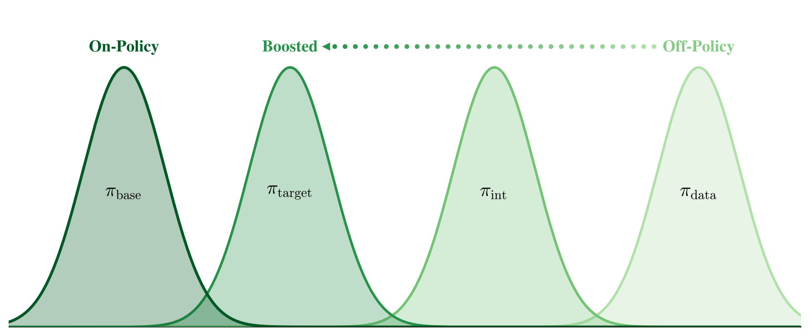
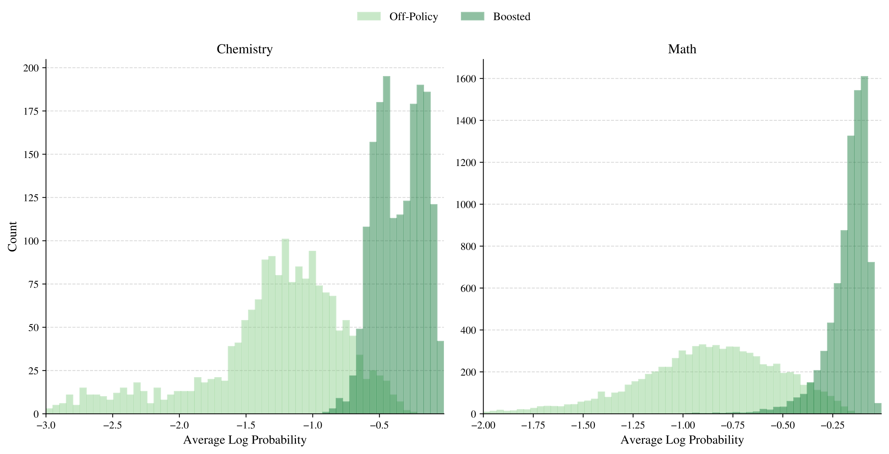
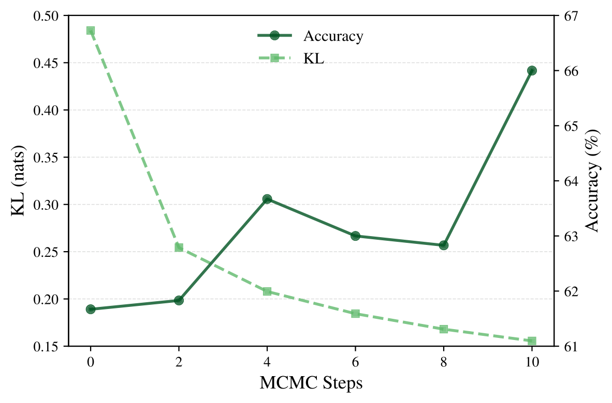
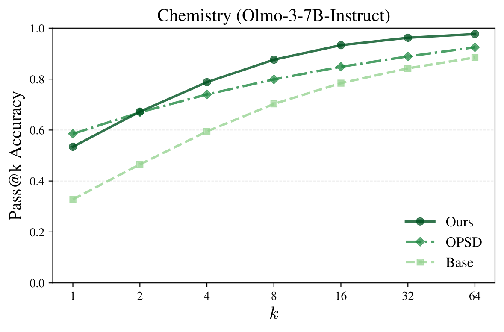

# 换个数据就能赢：哈佛团队用 MCMC 采样"改造"专家数据，让 SFT 反超 RL

这篇来自哈佛大学的工作直击后训练（Post-training）领域最核心的一对矛盾： **RL 泛化好、不忘旧知识，但只能从模型自己采到的轨迹里学；SFT 能吃下专家数据里的特权信息，却容易泛化差、灾难性遗忘**。作者的思路非常反直觉——不改学习算法，而是改数据：他们提出一种基于 MCMC 的 **Projection Sampling（投影采样）** 算法，把 off-policy 的专家轨迹一步步"推移"到贴近基座模型分布的位置，再用普通 SFT 去训练。结果相当硬核：在化学、数学、医学三个任务上，"采样 + SFT"的新任务泛化和旧能力保持双双超过 OPSD、GRPO、UFT 等 on-policy 基线，数学任务上 MATH500 甚至比最强的 RL 基线高出 **+26.9%**。

## 背景：SFT 和 RL 各自的死穴

后训练的目标，本质上是在 **不牺牲已有能力** 的前提下，给模型注入 **全新的能力**。围绕这个目标，社区逐渐形成了一个"常识"：

- **RL 的优势在于 on-policy**：模型的学习信号来自自己采样的轨迹，更新天然被约束在离基座模型不远的分布附近，因此泛化好、遗忘少。
- **SFT 的死穴在于 off-policy**：直接模仿专家数据，梯度更新可能又猛又偏，导致过拟合训练分布，并引发 **灾难性遗忘（Catastrophic Forgetting）**。已有工作甚至发现遗忘程度与微调后模型和基座模型之间的 KL 散度直接相关。

但 on-policy 也有它的死穴：RL 完全依赖模型自己"撞出"正确轨迹。如果一道题基座模型怎么采样都答不对，reward 就没有方差，也就没有学习信号——这类"硬样本"在 RL 训练中实际上被白白丢弃了。而恰恰是这类模型还不会的硬题，最需要专家数据中的 **特权信息（Privileged Information）** 来教。

于是问题变成了：有没有办法 **两头都要** ——既吃到专家数据的信息，又享受 on-policy 学习的好处？

## 核心思路：不改算法，改数据

以往的工作都在修改学习目标来"适应" off-policy 数据：加重要性采样权重、加 KL 惩罚项、在 RL rollout 里塞专家数据等等。这篇文章把问题翻转了过来：

> **能不能算法化地把 off-policy 的专家轨迹，转化成"信息等价、但更像基座模型自己会写出来的" on-policy 轨迹？**

这就是全文的核心命题。学习方式保持最朴素的 SFT 不动，所有功夫都花在训练前的 **数据改造** 上。

> 图解：左图在化学推理任务上对比了三种方案——原始数据上的 SFT、本文的"采样 + SFT"、以及利用专家数据的 on-policy 自蒸馏方法 OPSD，并追踪它们在预训练旧能力（MMLU、AMC）上的表现。右图把"新任务准确率（化学）"和"旧能力保持率"画成两个坐标轴： **采样 + SFT 在两个维度上都做到最好**，而普通 SFT 虽然学会了化学，却明显丢了旧能力。

## 方法：把"信息投影"变成可采样的目标

### 信息投影：理论上的最优目标

先建立一点符号。一个 LLM 定义了 token 序列上的联合分布：

$$
p(x_{0:T}) = \prod_{t=0}^T p(x_t \mid x_{<t})
$$

SFT 就是在专家数据集 $\mathcal{D} = \{(\mathbf{q}_i, \mathbf{x}_i)\}$ 上最小化交叉熵：

$$
\mathcal{L}_{\text{SFT}} = \mathbb{E}_{(\mathbf{q}, \mathbf{x}) \sim \mathcal{D}}\left[-\log p(\mathbf{x} \mid \mathbf{q})\right]
$$

关键概念是 **语义等价类 $\mathcal{C}$**：对于某条专家轨迹 $\mathbf{x}_i$，$\mathcal{C}$ 是所有"与它携带相同信息"的轨迹集合——对数学/化学来说就是"用了同样的推理信息且最终答案正确"的所有解法，对事实类知识来说就是"包含相同事实内容"的回答。

如果要求数据分布只输出 $\mathcal{C}$ 里的轨迹（即信息不丢），同时又尽可能贴近基座模型 $p$，那么理论上的最优解就是 **信息投影（Information Projection）**：

$$
p_{\mathcal{C}} = \arg\min_{\pi \in \mathcal{P}_{\mathcal{C}}} \mathrm{KL}(\pi \| p)
$$

作者证明了这个最优解有非常干净的形式——它就是 **基座模型分布在等价类上的归一化截断**：

$$
p_{\mathcal{C}}(\mathbf{x}) = \frac{p(\mathbf{x}) \cdot \mathbf{1}(\mathbf{x} \in \mathcal{C})}{\sum_{\mathbf{x}'} p(\mathbf{x}') \cdot \mathbf{1}(\mathbf{x}' \in \mathcal{C})}
$$

直觉很简单：在所有"内容正确"的轨迹里，挑那些 **基座模型本来就最有可能写出来** 的。如果基座模型自己能可靠地生成正确轨迹，直接从 $p_{\mathcal{C}}$ 拒绝采样就行了——那其实就是最原始的 on-policy RL。但我们关心的正是拒绝采样不可行的硬场景，所以需要更通用的采样工具。

### Metropolis-Hastings：一步步把数据"推近"基座模型

作者用经典的 **Metropolis-Hastings（MH）** 采样器来逼近 $p_{\mathcal{C}}$：从专家轨迹出发初始化马尔可夫链，每一步用一个 **保信息的提议分布（Information-Preserving Proposal）$\kappa_{\mathcal{C}}$** 生成候选轨迹，再以如下概率接受：

$$
A(\mathbf{x}, \mathbf{x}^i) = \min\left\{1,\ \frac{p(\mathbf{x}) \cdot \kappa_{\mathcal{C}}(\mathbf{x}^i \mid \mathbf{x})}{p(\mathbf{x}^i) \cdot \kappa_{\mathcal{C}}(\mathbf{x} \mid \mathbf{x}^i)}\right\}
$$

这里有个漂亮的理论化简：由于提议分布保证候选永远在 $\mathcal{C}$ 内，目标分布 $p_{\mathcal{C}}$ 里的指示函数项可以消掉，接受率直接写成关于 **原始基座分布 $p$** 的形式——也就是说，"以 $p_{\mathcal{C}}$ 为目标的 MH" 等价于 "用保信息提议、以 $p$ 为目标的 MH"。

更重要的是一个单调性保证：设 $\pi_k$ 为经过 $k$ 步 MCMC 后候选轨迹的分布，那么由数据处理不等式可得

$$
\mathrm{KL}(\pi_{k+1} \| p) \leq \mathrm{KL}(\pi_k \| p)
$$

即 **每多做一步采样，数据分布就离基座模型更近一点**。这不仅保证了收敛，还把"采样步数"变成了一个可扩展的计算轴——后面会看到实验完美验证了这一点。

### 落地实现：分块采样 + Prompt 提议

直接在整条序列上跑 MH 对 LLM 不可行：每次都要重采样完整序列，且高维样本空间导致 **混合极慢（Slow Mixing）**。作者借鉴了 Power Sampling 的实现技巧：

- **分块递进**：把序列按块大小 $B$ 分段，在第 $k$ 阶段只对长度为 $(k+1)B$ 的前缀分布做 MCMC，采好的前缀固定下来，作为下一阶段的热启动；
- **提议分布用 Prompt 实现**：随机截断当前轨迹得到一个前缀，把"问题 + 专家解答 + 这个前缀"一起塞进 prompt，让基座模型自己续写。这利用的是预训练模型强大的 in-context 指令遵循能力——续写出来的内容既"像模型自己写的"，又在专家信息约束下保持正确。

这个设计是整个算法中唯一与专家轨迹交互的部分，相当轻巧。提议 prompt 的核心意思是："阅读专家解答，从这个部分回答开始，用你自己的话继续，保证逻辑一致且最终答案正确。"

成本方面，采样是一次性的预处理开销。估计平均 token 消耗为

$$
\mathbb{E}_{\text{cost}} \approx |\mathcal{D}| \cdot \frac{N_{\text{MCMC}} T^2}{4B}
$$

块越小分辨率越高、近似误差越小，成本也越大；作者在所有实验中用 $B = 32$、$N_{\text{MCMC}} = 10$、最大长度 $T = 1856$。

> 图解：方法示意。原始数据策略 $\pi_{\text{data}}$ 离基座模型分布 $\pi_{\text{base}}$ 很远（直接 SFT 会剧烈偏移模型）；投影采样把它逐步推移到目标策略 $\pi_{\text{target}}$——既保留了专家信息，又落在基座模型的高概率区域附近，SFT 学起来自然又稳又好。

## 实验：三个任务全面开花

### 设置

作者选了三个覆盖不同能力类型的任务，基座模型都是 **在该领域本来就薄弱** 的模型：

- **化学（科学技能习得）**：SciKnowEval 的 Chemistry L-3 子集（反应预测、摩尔质量计算、方程式配平），1800 训练 / 600 测试，专家轨迹由 GPT-5 生成。基座为 Qwen2.5-7B-Instruct（基线 34.3%）和 Olmo-3-7B-Instruct（32.8%）。
- **数学（硬推理）**：MATH 数据集的 Level 3/4/5 难题，8230 训练 / 1024 测试。基座为 Qwen2.5-3B（31.5%）。
- **医学（开放式专长）**：HuatuoGPT-o1 SFT 数据集，19704 条临床推理问答，用 GPT-5-mini 做自动评分。基座为 Qwen2.5-7B-Instruct（35.3%）。

基线包括：原始 SFT、Rewrite SFT（只用提议 prompt 重写一遍数据，相当于"0 阶 MCMC"）、on-policy 自蒸馏 OPSD，以及数学任务上的 GRPO 和更强的 UFT。

### 主结果：泛化更强，遗忘更少

化学任务（Qwen2.5-7B）上，采样 + SFT 把化学准确率从 34.3% 提升到 **66.0%**（+31.7%），超过 OPSD 的 61.8%；同时旧能力平均只掉 **1.1%**，是所有方法中遗忘最少的——MMLU 甚至完全没有损失。

数学任务（Qwen2.5-3B）最能体现泛化能力的"外溢"：

- MATH(3,4,5) 难题上 **+18.0%**，超过 GRPO 和 UFT；
- 分布外的 AMC **+14.4%**、GSM8K **+20.3%**，与 RL 基线打平；
- MATH500 上 **+33.7%**，比最强的 RL 基线还高出 **+26.9%**；
- 而用采样 + SFT 的 checkpoint 去初始化 GRPO（Sampling SFT + RL），MATH500 再涨到 **+40.7%**，3B 模型摸到了 7B-Instruct 的水平。

医学任务上，采样 + SFT 把普通 SFT 造成的 **16.3%** 旧能力平均损失几乎全部挽回，遗忘程度再次是所有基线中最小的。

两个细节值得注意：一是 Rewrite SFT（只做一次重写）明显弱于完整 MCMC，说明 **逐步逼近的采样过程本身** 才是关键，不是简单"换个说法"；二是把给 Olmo 准备的数据拿去训 Qwen，化学准确率掉到 57.3%（还不如原始 SFT），证明这种数据改造是 **模型定制（Model-Specific）** 的——数据必须贴近"将被训练的那个模型"的分布，这一对照实验非常有力地支撑了论文的核心假设。

### 分析：数据真的变"on-policy"了吗？

> 图解：化学和数学任务上，原始专家轨迹与改造后轨迹在基座模型下的序列对数似然（按长度平均）直方图。可以看到改造后的分布整体大幅右移——轨迹在基座模型眼中变得"自然"得多，同时正确性保持在 94%~96% 的水平。

> 图解：横轴是 MCMC 步数 $k$（$k=0$ 即简单重写），左纵轴是数据分布与基座模型的 KL 散度，右纵轴是微调后的化学准确率。随着采样算力增加，KL 单调下降、准确率单调上升——理论命题在实验中被完美复现， **采样步数成为一条新的 Scaling 轴**。

### 超越"锐化"：模型真的学会了新能力

一个尖锐的质疑是：数据被推向基座分布，那模型学到的是不是只是"强化已有能力"（Sharpening）而非真正的新能力？作者用 pass@$k$ 曲线回答：

> 图解：Olmo-3-7B 在化学任务上的 pass@$k$ 曲线（$k$ 次采样中至少一次正确的比例）。如果只是锐化，曲线在大 $k$ 处应收敛回基座模型；但实际上采样 + SFT 的曲线 **在所有 $k$ 上都严格高于基座和 OPSD**。更有说服力的是逐题分析：有些题基座模型 pass@$k$ 恒为 0，微调后直接涨到 **67.2%** 或 **53.1%**——这是货真价实的新能力。

## 点评与展望

这篇文章的聪明之处在于 **把"算法问题"转化成了"数据问题"**。与其费劲地给 SFT 打各种正则化补丁，不如承认 SFT 就是个"挑食的学习器"，然后把食材处理成它好消化的样子。理论上信息投影给出了最优目标，MH 给出了单调逼近的保证，工程上 prompt 提议分布又极其轻巧——整条链路理论优雅、实现简单、效果扎实。

更宏观地看，作者把采样定位为一种 **模型原生的数据整形算子（Model-Native Operator）**，可以在后训练流水线的多处复用：给自蒸馏构造离学生更近的教师分布、给 RL 在硬题上模拟 on-policy rollout 等等。用采样时的计算换取更 on-policy 的训练数据，是一条简单、稳健且可扩展的能力扩展路径。

回顾要点：

- **问题**：RL 泛化好但吃不到专家信息，SFT 能吃专家数据但泛化差、易遗忘；
- **思路**：不改学习算法，用 MCMC 把 off-policy 专家数据改造成信息等价、贴近基座分布的 on-policy 数据；
- **理论**：信息投影 = 基座分布在语义等价类上的归一化截断，MH 采样保证 KL 单调下降；
- **结果**：化学、数学、医学三任务上，采样 + SFT 在泛化和保持两个维度全面匹敌或超越 OPSD、GRPO、UFT；
- **扩展性**：采样步数是新的 Scaling 轴，且采样 + SFT 是 RL 的极佳初始化。

局限方面，方法依赖"语义等价"的可判定性（数学化学好办，开放域要靠 LLM 评分），且采样成本随序列长度平方增长；如何把这套数据整形思想推广到更大规模、更弱验证的场景，是值得关注的下一步。

> 本文参考自 [Finetuning with Sampling: SFT Learns Better Than You Think](http://arxiv.org/abs/2610.02140v1)