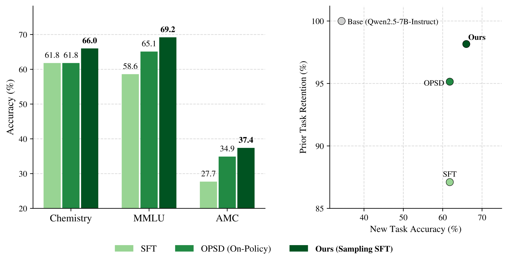

# 换个数据就能赢：MCMC"改造"专家数据，让 SFT 反超 RL

后训练领域有一对核心矛盾：RL 泛化好、不忘旧知识，但只能学模型自己采到的轨迹；SFT 能吃下专家数据里的特权信息，却泛化差、易灾难性遗忘。哈佛团队的解法反直觉——不改学习算法，而是改数据：用 MCMC 采样把 off-policy 专家轨迹"推移"到贴近基座模型分布的位置，再做普通 SFT。结果：化学、数学、医学三任务上，"采样 + SFT"的新任务泛化和旧能力保持双双超过 OPSD、GRPO、UFT 等 on-policy 基线，MATH500 上比最强 RL 基线高出 **+26.9%**。

## 背景：两头都要

- **SFT 的死穴在 off-policy**：直接模仿专家数据，更新又猛又偏，导致过拟合与灾难性遗忘（遗忘程度与微调后模型和基座间的 KL 散度直接相关）。
- **RL 的死穴在 on-policy**：基座模型怎么采样都答不对的硬题没有 reward 方差，学习信号为零——而恰恰是这类题最需要专家数据中的特权信息。
- 本文的翻转：不改学习目标，而是**把 off-policy 专家轨迹算法化地转化为"信息等价、但更像基座模型自己写的" on-policy 轨迹**。

## 方法：信息投影 + Metropolis-Hastings

- **理论目标——信息投影**：对所有与专家轨迹携带相同信息的"语义等价类" $\mathcal{C}$，最优数据分布是 $p_{\mathcal{C}} = \arg\min \mathrm{KL}(\pi \| p)$。作者证明其闭式解就是**基座分布在等价类上的归一化截断**——在所有内容正确的轨迹里，挑基座模型最可能自己写出的那些。
- **采样实现——MH 算法**：从专家轨迹出发初始化马尔可夫链，用保信息提议分布生成候选并按标准接受率采样。由数据处理不等式，每多做一步采样，数据分布与基座的 KL 散度单调下降——"采样步数"成为一条可扩展的计算轴。
- **工程落地**：序列按块（$B=32$）分段递进采样；提议分布直接用 prompt 实现——把"问题 + 专家解答 + 截断前缀"喂给基座模型让它续写，利用其 in-context 能力产出既自然又保信息正确的轨迹。全部实验用 10 步 MCMC，采样是一次性预处理开销。

## 实验：三个任务全面开花

基座模型均选在该领域薄弱的模型（如 Qwen2.5-7B、Qwen2.5-3B、Olmo-3-7B），对比 SFT、Rewrite SFT、OPSD、GRPO、UFT：

- **化学**（Qwen2.5-7B）：准确率 34.3% → **66.0%**（超 OPSD 的 61.8%），旧能力平均仅掉 **1.1%**，MMLU 零损失。
- **数学**（Qwen2.5-3B）：MATH 难题 +18.0%，AMC +14.4%，GSM8K +20.3%；MATH500 **+33.7%**（比最强 RL 基线高 +26.9%）；再用其 checkpoint 初始化 GRPO，MATH500 达 **+40.7%**，3B 摸到 7B-Instruct 水平。
- **医学**：普通 SFT 造成的 16.3% 旧能力损失几乎全部挽回，遗忘仍为所有基线中最小。

两个关键对照：

- Rewrite SFT（只做一次重写）明显弱于完整 MCMC——**逐步逼近的采样过程本身才是关键**；
- 把给 Olmo 准备的数据拿去训 Qwen，化学准确率掉到 57.3%——数据改造是**模型定制**的，必须贴近"将被训练的那个模型"。

分析进一步验证：改造后轨迹在基座模型下的对数似然大幅右移（正确性保持 94%~96%）；KL 随采样步数单调下降、准确率单调上升，理论命题完美复现；pass@k 曲线在所有 $k$ 上严格高于基座，部分基座 pass@k 恒为 0 的题微调后涨到 67.2%——模型学到的是**货真价实的新能力**，而非锐化已有能力。

## 点评

本文的聪明之处在于把"算法问题"转化成"数据问题"：与其给 SFT 打正则化补丁，不如承认它是挑食的学习器，把食材处理成它好消化的样子。采样被定位为一种**模型原生的数据整形算子**，可复用于自蒸馏教师分布构造、RL 硬题 rollout 模拟等场景——用采样时计算换取更 on-policy 的训练数据，是一条简单、稳健、可扩展的能力扩展路径。局限在于依赖"语义等价"的可判定性（开放域要靠 LLM 评分），且采样成本随序列长度平方增长。

> 本文参考自 [Finetuning with Sampling: SFT Learns Better Than You Think](http://arxiv.org/abs/2610.02140v1)