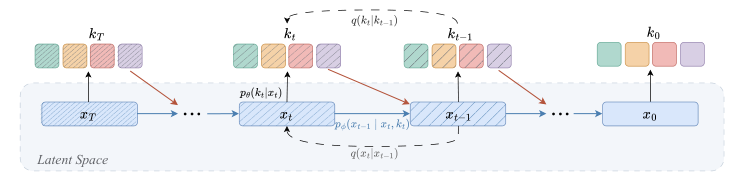
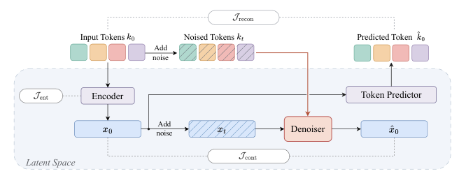
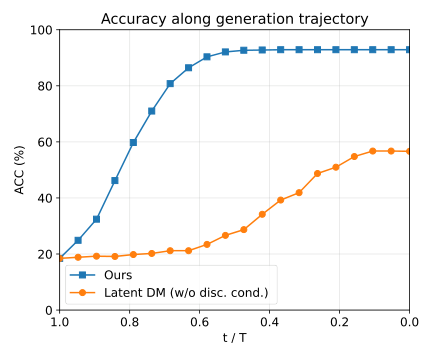

# HC-DLM：让离散 Token 与连续潜变量互相"搀扶"的层级扩散语言模型

并行解码的扩散语言模型一直有个结构性软肋：同一步里被同时揭开（unmask）的多个 Token 是各自从边缘分布里独立采样的，它们之间的统计依赖被切断了——而数独、算术规划这类任务恰恰要求 Token 之间紧密耦合。连续扩散模型反过来：它去噪一个所有 Token 共享的连续状态，天然保留了跨 Token 依赖，但整条去噪轨迹里没有任何一项把状态"拴"在合法的 Token 序列上，直到最后一步才解码，容易跑偏。这篇来自 UIUC 和 Amazon 的工作提出 **HC-DLM**（Hierarchical Continuous Diffusion Language Models），核心思路一句话：让连续潜变量成为唯一贯穿生成过程的持久状态，Token 每一步都从这个潜变量里"读出来"、加噪后再"喂回去"作为下一步去噪的条件。效果上，6M 参数的 HC-DLM 在数独 Hard 集上拿到 72.41% 的准确率（超过同规模混合扩散基线 CCDD 的 70.73% 和 42M 自回归模型的 32.57%），在 LM1B 语言建模上以 75.5 的生成困惑度刷新扩散模型的最好成绩。

## 背景：两条扩散路线，各缺一条腿

在正式介绍方法之前，先把两条已有路线的短板说清楚，因为 HC-DLM 的设计完全是冲着这两个互补的缺陷去的。

### 离散扩散：并行但独立

离散扩散语言模型（如 D3PM、SEDD、MDLM、LLaDA）定义一条前向加噪链，把干净序列 $k_0$ 逐步腐蚀。以噪声调度 $\alpha_t$ 从 1 衰减到 0，每一步的边缘分布在干净 Token 和稳态分布 $\pi$ 之间插值：

$$
q(k_t^i \mid k_0^i) = \alpha_t\,\delta(k_t^i - k_0^i) + (1 - \alpha_t)\,\pi(k_t^i)
$$

其中 $\pi$ 取 **absorbing（吸收态）** 时对应把 Token 替换成特殊符号 [mask]，取 **uniform（均匀态）** 时对应随机替换成词表里任意 Token。反向过程由一个双向 Transformer $p_\theta(k_0 \mid k_t)$ 学习，用 Token 级交叉熵训练。

问题出在推理时的因式分解形式 $p_\theta(k_0 \mid k_t) = \prod_i p_\theta(k_0^i \mid k_t)$：共享上下文 $k_t$ 虽然提供了一些全局信息，但同一步解码的多个 Token 的联合分布被建模成了边缘分布的乘积。打个比方：这就像让一群人各自独立填写数独的不同格子，每人只能看到题目却看不到别人正在填什么——语法、逻辑约束强耦合的地方必然出错。

### 连续扩散：共享状态但"落地太晚"

连续扩散模型（如 Diffusion-LM、Plaid、LangFlow）改为去噪一个连续状态——要么是逐 Token 的 embedding，要么是编码器压缩出的潜变量。所有并行解码的 Token 都依赖同一个 latent，跨 Token 依赖保住了。但它的 denoiser 只看连续状态，目标函数里没有任何一项涉及中间轨迹上的 Token。虽然有 rounding、self-conditioning 这类把模型自己的 Token 估计反馈回去的技巧，但那个估计既不是模型的变量、也不是目标函数的一项，约束仍然只在最后解码时才生效。

一句话总结：**离散路线缺一个共享状态，连续路线缺一个 Token 锚点，而两者的药方恰好互为彼此的短板。**

## 核心思路：层级耦合（Hierarchical Coupling）

HC-DLM 的反向过程是一条两级链。直觉上可以这样理解：连续潜变量 $x_t$ 是"草稿纸"，从头到尾持续被修改；Token 状态 $k_t$ 是每一步从草稿纸上"誊写"出来的当前答案，誊写结果被重新加噪后，又作为下一步修改草稿时的参照。

> 图解：前向方向（forward）独立地腐蚀两条轨迹——连续潜变量 $x_0 \to x_T$ 走高斯加噪 $q(x_t \mid x_{t-1})$，离散 Token $k_0 \to k_T$ 走离散核 $q(k_t \mid k_{t-1})$。反向方向（reverse）把两条通道耦合起来：$p_\phi(x_{t-1} \mid x_t, k_t)$ 以当前 Token 状态为条件推进连续状态，$p_\theta(k_t \mid x_t)$ 从潜变量读出 Token 分布，如此交替直到抵达干净状态 $(x_0, k_0)$。

这里有一个关键的结构区分，也是本文区别于 CADD、CCDD 等混合扩散模型的核心：在 HC-DLM 里，**Token 状态没有自己的转移核**。生成模型中 $k_t$ 只通过 $x_t$ 依赖历史，所有跨步信息都经由连续轨迹传递，每个位置的 Token 每一步都重新读出——这意味着 Token 始终保持"可修改"的状态。相比之下，此前的混合模型（VMD、CADD、CCDD）都让 Token 保留自己的转移链，在连续通道旁边自成一体，本文称 HC-DLM 的组织方式为"层级"（hierarchy）而非"兄弟"（siblings），原因正在于此。

博主点评：这个设计的聪明之处在于把"谁持有状态"这件事彻底理清了。潜变量负责记忆与连贯，Token 负责提供离散的、可验证的约束脚手架（scaffold）。置信度高的 Token 估计会约束 $x_t$ 的移动方向，不确定的位置则留给连续状态自由探索——这是一种很自然的"软硬结合"。

## 方法详解

### 生成模型与前向过程

模型为长度为 $L$ 的 Token 序列 $k_0 \in \mathcal{V}^L$ 引入一个连续潜变量 $x_0 \in \mathbb{R}^{M \times d}$（$M$ 为潜序列长度，$d$ 为逐位置维度）。前向的变分分布为：

$$
q_\psi(x_{0:T},\, k_{1:T} \mid k_0) = q_\psi(x_0 \mid k_0) \prod_{t=1}^T q(x_t \mid x_{t-1})\; q(k_t \mid k_{t-1})
$$

其中唯一可学习的部分是 **编码器** $q_\psi(x_0 \mid k_0)$，把干净 Token 序列映射为连续潜变量；两条加噪链相互独立，保证前向边缘分布都可解析处理。反向生成模型则刻意打破这种独立性：

$$
p_{\theta,\phi}(k_{0:T},\, x_{0:T}) = p(x_T)\; p_\theta(k_0 \mid x_0) \prod_{t=1}^T p_\theta(k_t \mid x_t)\; p_\phi(x_{t-1} \mid x_t, k_t)
$$

两个可学习分布驱动反向过程：

- **Token 预测器** $p_\theta(k_t \mid x_t)$：把带噪连续状态映射为 Token 分布。$t=0$ 时产出最终离散输出，中间步则充当"软读出"。
- **连续去噪器** $p_\phi(x_{t-1} \mid x_t, k_t)$：以当前 Token 状态为条件推进潜变量。正是对 $k_t$ 的条件依赖，使 HC-DLM 不只是两个并行的扩散过程。

### 变分下界：一个 ELBO 统摄两级轨迹

层级耦合能否支撑严格的变分学习？答案是肯定的——正因为前向两条链独立，作者推导出了如下 ELBO，$\log p(k_0) \geq \mathcal{L}(k_0)$，且各项含义清晰：

$$
\begin{aligned}
\mathcal{L}(k_0) &= \underbrace{\mathbb{E}_{q_\psi(x_0 \mid k_0)}\bigl[\log p_\theta(k_0 \mid x_0)\bigr]}_{\text{(i) 重建}}
- \underbrace{\mathbb{E}_{q_\psi(x_0 \mid k_0)}\bigl[\mathrm{KL}\bigl(q(x_T \mid x_0) \,\|\, p(x_T)\bigr)\bigr]}_{\text{(ii) 先验匹配}} \\
&\quad + \underbrace{\mathbb{E}\bigl[\log p_\phi(x_0 \mid x_1, k_1)\bigr]}_{\text{(iii.a) 边界连续去噪}}
+ \underbrace{H\bigl(q_\psi(x_0 \mid k_0)\bigr)}_{\text{(iii.b) 编码器熵}}
- \underbrace{\mathbb{E}\bigl[\mathrm{KL}\bigl(q(k_1 \mid k_0) \,\|\, p_\theta(k_1 \mid x_1)\bigr)\bigr]}_{\text{(iii.c) 边界 Token 预测}} \\
&\quad - \underbrace{\sum_{t=2}^T \mathbb{E}\bigl[\mathrm{KL}\bigl(q(x_{t-1} \mid x_t, x_0) q(k_t \mid k_{t-1}) \,\|\, p_\phi(x_{t-1} \mid x_t, k_t) p_\theta(k_t \mid x_t)\bigr)\bigr]}_{\text{(iv) 去噪步}}
\end{aligned}
$$

逐项解读：

- **(i) 重建项**：要求干净潜变量 $x_0$ 能解码回 $k_0$；
- **(ii) 先验匹配**：终端分布对齐标准高斯，无可训练参数；
- **(iii.a) 边界连续去噪**、**(iii.b) 编码器熵**（鼓励编码器保持随机性、不退化成确定性映射）、**(iii.c) 边界 Token 预测**；
- **(iv) 去噪步**：每步同时预测 Token 状态与连续状态，是最重要的一项。

利用 KL 散度的链式法则，并注意到前向连续核 $q(x_{t-1} \mid x_t, x_0)$ 不依赖 $k_t$，第 (iv) 项可精确拆成两个互补的学习信号：

$$
\begin{aligned}
&\mathrm{KL}\Bigl(q(x_{t-1} \mid x_t, x_0)\,q(k_t \mid k_{t-1}) \,\Big\|\, p_\phi(x_{t-1} \mid x_t, k_t)\,p_\theta(k_t \mid x_t)\Bigr) \\
&= \underbrace{\mathrm{KL}\bigl(q(k_t \mid k_{t-1}) \,\|\, p_\theta(k_t \mid x_t)\bigr)}_{\text{离散 Token 预测}}
+ \underbrace{\mathbb{E}_{q(k_t \mid k_{t-1})}\bigl[\mathrm{KL}\bigl(q(x_{t-1} \mid x_t, x_0) \,\|\, p_\phi(x_{t-1} \mid x_t, k_t)\bigr)\bigr]}_{\text{连续去噪}}
\end{aligned}
$$

值得注意的是，离散子项在函数形式上与标准离散扩散的 Token 预测 KL 完全一致（$x_t$ 扮演了带噪条件状态的角色）——也就是说，**HC-DLM 完整保留了离散扩散的监督信号，同时叠加了连续去噪信号**，而不是顾此失彼。

### 从 ELBO 到实用目标：三个损失

把 ELBO 落成可训练的目标时，作者做了两步关键处理。其一，连续去噪项在标准高斯参数化下退化为加权 MSE（等价于噪声预测），实现时改用 Conditional Flow Matching（CFM）：采用线性插值

$$
x_t = (1-s)\,x_0 + s\,\epsilon, \quad \epsilon \sim \mathcal{N}(0,I), \quad s = t/T
$$

让去噪器直接回归干净潜变量 $x_0$（即 $x$-prediction 参数化）。其二，离散部分避免为每个噪声水平 $t$ 单独训练一个预测头：复用同一个时间无关的干净 Token 预测器 $p_\theta(k_0 \mid \cdot)$，再与已知的离散前向核复合得到带噪 Token 分布 $p_\theta(k_t \mid x_t) = \sum_{\tilde{k}_0} q(k_t \mid \tilde{k}_0)\, p_\theta(\tilde{k}_0 \mid \hat{x}_0(x_t))$。直接优化带噪 Token 的 KL 会遭遇"梯度涂抹"问题（absorbing 核下大量候选干净 Token 被映射到同一个 [mask]，逐位置学习信号被平均掉），作者用 **数据处理不等式**（data-processing inequality）证明干净 Token 交叉熵是该 KL 的上界，从而用尖锐的逐位置交叉熵替代它。最终实用目标为三项加权和：

$$
\begin{aligned}
\mathcal{J} &= \lambda_{\mathrm{recon}} \underbrace{\mathbb{E}_{q_\psi(x_0 \mid k_0)}\bigl[-\log p_\theta(k_0 \mid x_0)\bigr]}_{\mathcal{J}_{\mathrm{recon}}:\ \text{重建}}
+ \lambda_{\mathrm{ent}} \underbrace{\mathbb{E}_{q_\psi(x_0 \mid k_0)}\bigl[\log q_\psi(x_0 \mid k_0)\bigr]}_{\mathcal{J}_{\mathrm{ent}}:\ \text{编码器熵}} \\
&\quad + \lambda_{\mathrm{cont}} \underbrace{\sum_{t=1}^{T} \mathbb{E}_{q_\psi(x_0, x_t, k_t \mid k_0)}\Bigl[\omega_t \bigl\|d_\phi(x_t, k_t, t/T) - d_t(x_t, x_0)\bigr\|^2\Bigr]}_{\mathcal{J}_{\mathrm{cont}}:\ \text{连续去噪}}
\end{aligned}
$$

> 图解：训练时，编码器 $q_\psi(x_0 \mid k_0)$ 把干净 Token 映射为连续潜变量 $x_0$，两条独立前向核产出带噪对 $(x_t, k_t)$。以 Token 为条件的去噪器 $d_\phi(x_t, k_t, t/T)$ 输出干净潜变量估计 $\hat{x}_0$（损失 $\mathcal{J}_{\mathrm{cont}}$），Token 预测器 $p_\theta(k_0 \mid x_0)$ 把 $x_0$ 解码为 $\hat{k}_0$（损失 $\mathcal{J}_{\mathrm{recon}}$），编码器由熵正则 $\mathcal{J}_{\mathrm{ent}}$ 约束。

训练内层循环很朴素：每个样本采一个时间步 $t \sim \mathrm{Uniform}(1, T)$，编码、双通道加噪、算损失、更新 $\theta, \phi, \psi$，做单样本 Monte Carlo 估计。

### 推理：交替采样

推理实例化上述耦合反向链：从 $x_T \sim \mathcal{N}(0, I)$、$k_T \sim \pi$ 出发，每一步做三件事——

1. 用去噪器算出脚手架条件下的干净潜变量估计 $\hat{x}_0 \gets d_\phi(x_t, k_t, t/T)$，并用 Euler 步推进连续状态 $x_{t-1} \gets x_t - \frac{1}{t}(x_t - \hat{x}_0)$；
2. 从 $\hat{x}_0$ 读出干净 Token $\hat{k}_0 \gets \arg\max_{k_0} p_\theta(k_0 \mid \hat{x}_0)$；
3. 把 $\hat{k}_0$ 经已知前向核重新加噪到 $t-1$ 水平，得到 $k_{t-1}$。

最后返回 $p_\theta(k_0 \mid x_0)$ 的 argmax。在 absorbing 核下，第 3 步的随机重掩码还可以换成基于置信度的自适应重掩码。

### 架构与条件生成

三个模块都是标准 DiT 风格的 Transformer：编码器是双向 Transformer，输出逐位置高斯均值与对数方差（重参数化采样，熵正则因此有闭式解）；去噪器把 $x_t \in \mathbb{R}^{M \times d}$ 与 $k_t$ 的 Token embedding 沿序列维拼接成长度 $M+L$ 的联合序列做 self-attention，时间步经 adaLN 注入；Token 预测器是轻量 Transformer，只消费干净潜变量估计，不与编码器、去噪器共享参数。条件生成（如数独的已知线索 $c$）只需把 $c$ 作为额外 embedding 注入三个模块，ELBO 结构完全不变。

## 实验：三个互补战场

作者在结构化推理（数独）、数学规划（Countdown）、语言建模（LM1B）三个任务上验证，参数量均与基线对齐。

### 数独：全局约束满足

数独被序列化为 81 个 Token（空格为 0），只有 81 格全部命中唯一解才算对。标准集（Easy）的题可用七种固定逻辑策略解出，Hard 集则必须用到训练分布之外的策略——考验的是真正的泛化。

| 方法 | 参数量 | Easy | Hard |
| --- | --- | --- | --- |
| ARM（无顺序启发） | 42M | 9.73 | -- |
| ARM（带顺序启发） | 42M | 87.18 | 32.57 |
| MDM（vanilla） | 6M | 6.88 | 3.62 |
| MDM（top-prob.） | 6M | 18.51 | 9.44 |
| MDM（top-prob. margin） | 6M | 89.49 | 49.88 |
| CCDD（混合扩散，复现） | 6M | **94.65** | 70.73 |
| **HC-DLM（本文）** | 6M | 94.21 | **72.41** |

HC-DLM 在 Easy 集上超过最好的掩码扩散变体和大 7 倍的自回归模型；在分布外的 Hard 集上以 72.41% 反超 CCDD 的 70.73%——优势恰好在需要训练策略之外推理的地方最明显，这与"层级耦合帮助全局约束满足"的假设吻合。

### Countdown：数学规划

Countdown 是 Game of 24 的推广：给定若干数字和目标值，要输出一条恰好抵达目标的算术链，且每步运算合法、每个数字最多用一次。CD4 / CD5 分别用 4 / 5 个输入数字，CD5 搜索空间大得多。

| 方法 | 参数量 | CD4 | CD5 |
| --- | --- | --- | --- |
| GPT-2 Scratch | 6M / 85M / 303M | 31.9 / 45.8 / 41.3 | 4.3 / 5.1 / 4.5 |
| Stream-of-Search | 250M | 54.2 | -- |
| LLaMA | 7B / 13B | 41.1 / 51.1 | 6.7 / 7.4 |
| VDM / D3PM / RDM | 85M | 73.4 / 83.1 / **87.0** | 16.3 / 27.6 / **45.8** |
| MDM（top-prob. margin） | 6M | 50.8 | 21.3 |
| CCDD | 6M | 81.18 | 25.35 |
| **HC-DLM（本文）** | 6M | **84.41** | **37.52** |

扩散模型整体大幅优于大得多的自回归模型（这印证了任意顺序解码适合子目标不均衡的规划任务），而在同量级的 6M 扩散模型之间，HC-DLM 优势清晰：比 CCDD 在 CD4 上高 3 个多点，在更长链条的 CD5 上差距拉大到 37.52 对 25.35。85M 的 RDM 仍是全场最佳，但 HC-DLM 只用其 7% 的参数。

### LM1B：通用语言建模

在 One Billion Word 基准上做序列长度 128 的无条件生成，以 GPT-2-Large 评估生成困惑度（Gen. PPL，越低越好），采样用 128 步加 Token 通道的 classifier-free guidance（$w = 2.75$）。

| 方法 | 参数量 | Gen. PPL ↓ |
| --- | --- | --- |
| Transformer（自回归） | 108M | 66.7 |
| MDM | 116M | 103.9 |
| SEDD | 116M | 115.9 |
| Duo | 116M | 97.6 |
| Plaid | 109M | 77.3 |
| LangFlow | 117M | 92.2 |
| **HC-DLM（本文）** | 118M | **75.5** |
| Ground truth | -- | 40.4 |

HC-DLM 在所有扩散模型中取得最优生成困惑度，击败了全部离散扩散基线和两个"只在最后解码一次"的连续模型。顺带一提效率：训练只用单卡 RTX PRO 6000 约 48 小时（LangFlow 及其复现基线约 292 小时，Plaid 约 375 小时），且批量采样时 wall-clock 时间从 batch size 16 起就低于 LangFlow。

### 消融：两条腿缺一不可

> 图解（上）：沿反向轨迹把每步的中间估计 $\hat{x}_0$ 解码为 Token 并测准确率。$t/T = 1.0$ 时潜变量接近纯高斯噪声、准确率接近随机；HC-DLM 的准确率上升得明显更早、平台更高——Token 脚手架让连续去噪器更早"锁定"结构约束。（下）：Hard 数独上最终准确率随去噪步数变化，HC-DLM 在步数减少时保持稳健，纯离散的 MDM 退化更剧烈。

组件消融最能说明问题（数独，准确率 %）：

| 方法 | 连续潜变量 | 离散条件 | Easy | Hard |
| --- | --- | --- | --- | --- |
| MDM（top-prob. margin） | ✗ | ✗ | 89.49 | 49.88 |
| Latent DM（去掉 Token 条件） | ✓ | ✗ | 50.46 | 24.74 |
| **HC-DLM（完整）** | ✓ | ✓ | **94.21** | **72.41** |

去掉 Token 级的 Latent DM 暴跌到 24.74%（Hard）——没有离散脚手架的连续潜变量会"过度平滑"掉精确的 Token 级约束；去掉潜变量级的 MDM 同样明显落后。两条腿，缺一不可。

离散前向核的选择也很有意思：

| 噪声类型 | 解码顺序 | Easy | Hard |
| --- | --- | --- | --- |
| Absorbing | Random | 69.60 | 43.74 |
| Absorbing | Top-prob. | 74.72 | 47.50 |
| Absorbing | Top-prob. margin | 75.59 | 48.25 |
| **Uniform** | 并行更新 | **94.21** | **72.41** |

自适应解码顺序对 absorbing 核只有温和提升，而 uniform 核一骑绝尘。作者给出两点解释：其一，离散状态在 HC-DLM 里是"条件脚手架"而非"承诺账本"，uniform 腐蚀得到的是嘈杂但完整的假设（每个位置都有具体 Token），而 [mask] 是信息空洞，会直接掏空脚手架；其二，Token 每步重新读出意味着所有位置始终可修改，而 absorbing 核的自适应 unmask 会逐个冻结承诺，在约束密集任务里一个早期错误就毁掉整个解。

其他发现还包括：潜序列长度 $M$ 在数独上 $M=4$ 最优（93.75 / 71.11），再增大反而退化；HC-DLM 在 100 步时单 batch 约 2.3 秒，快于同设置 MDM 的约 3.3 秒；LM1B 上 NFE 从 128 降到 32 时 Gen. PPL 仅从 75.5 升到 93.0，而熵几乎不变。

## 与混合扩散模型的结构性对比

论文附录把 HC-DLM 与三种代表性混合模型逐一对齐比较，差异一目了然：

| 方法 | 连续变量 | 连续变量的更新 | Token 预测器输入 | 解码出的 Token 之后可改 |
| --- | --- | --- | --- | --- |
| MDM | 无 | --- | $k_t$ | 否 |
| VMD | 全局 latent | 不更新（只采一次） | $k_t, z$ | 否 |
| CADD | 加噪 Token embedding | 无学习更新 | $k_t, x_t$ | 否 |
| CCDD | 冻结的 Token embedding | 学习去噪器 | $k_t, x_t$ | 否 |
| **HC-DLM** | 全局 latent | 学习去噪器 | 仅 $\hat{x}_0$ | **是** |

三个要点：VMD 的 latent 只采样一次，是静态全局上下文；CADD 的连续 hint 没有自己的去噪器，存的只是模型自己此前的预测，不含新信息；CCDD 的两条链对称平行、只靠共享网络输入交互。HC-DLM 则是唯一"Token 只从 latent 读出、且每步重新读出"的设计，因此天然适配 uniform 核。

## 总结

- **问题定位准**：离散扩散的并行解码缺跨 Token 依赖，连续扩散的去噪轨迹缺 Token 锚点，两者缺陷互补。
- **结构创新**：HC-DLM 让连续潜变量成为唯一持久状态，Token 每步从 latent 读出、加噪后反馈为下一步去噪的条件脚手架——Token 没有自己的转移链，始终可修改。
- **理论扎实**：单一变分下界统摄两级轨迹，ELBO 经 KL 链式法则精确拆成离散 Token 预测与连续去噪两个互补信号，并经数据处理不等式得到尖锐的实用交叉熵。
- **实验全面**：数独 Hard 集 72.41%、Countdown CD5 37.52%（同规模最优）、LM1B Gen. PPL 75.5（扩散模型最优），消融证明两个层级缺一不可。
- **效率友好**：编码器仅训练期使用，推理不增加延迟；LM1B 训练约 48 小时单卡完成。

展望：目前的验证还集中在中等规模的可验证任务上，扩展到更大的预训练 backbone 主要是算力问题而非架构障碍，这也是作者眼中最有前景的方向。此外，对 $k_t$ 的拼接式条件注入虽然简单有效，更结构化的融合机制或许还能进一步提升样本效率。

> 本文参考自 [Hierarchical Continuous Diffusion Language Models](https://arxiv.org/abs/2610.02193)