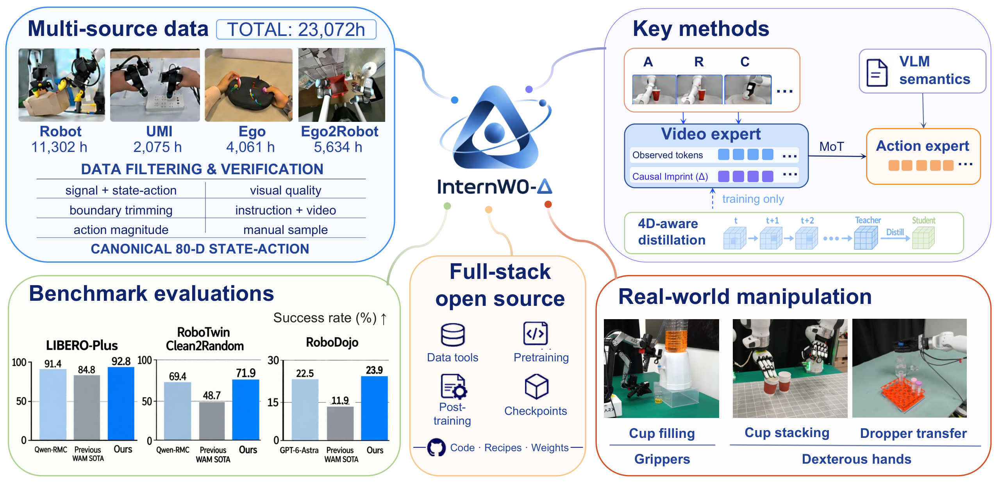
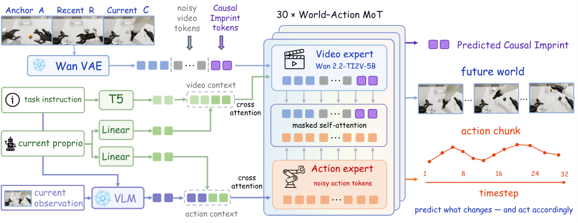
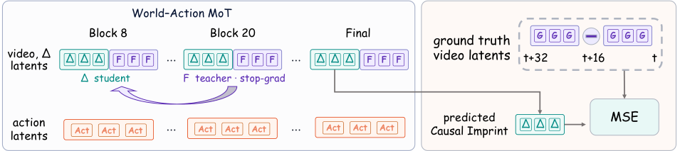
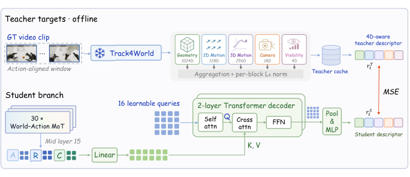
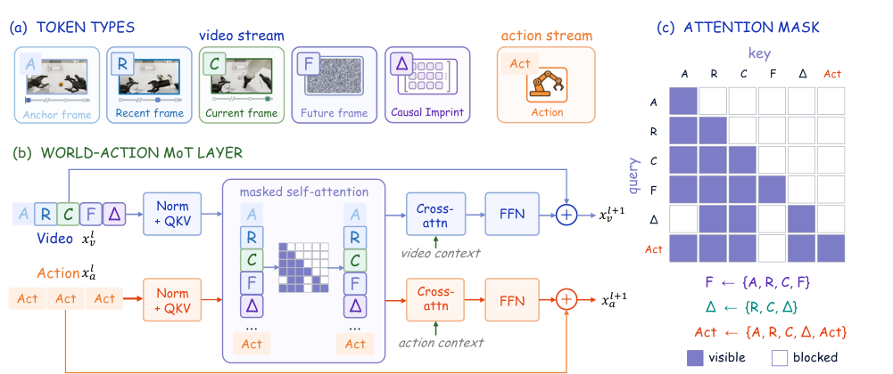
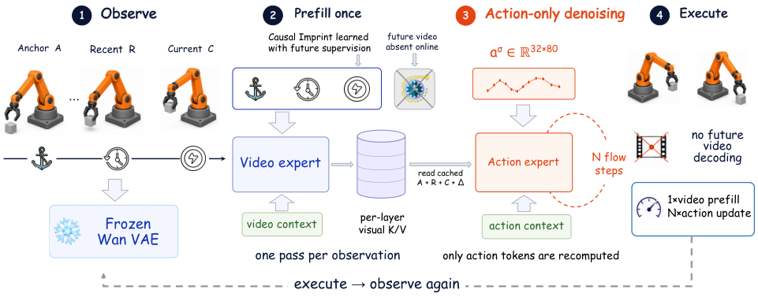
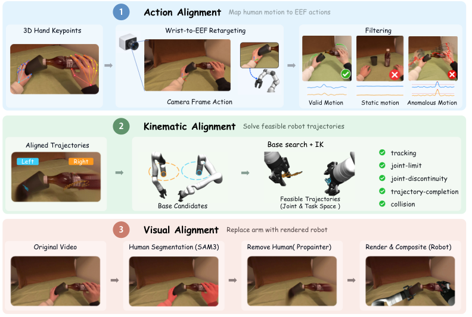
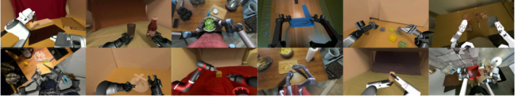
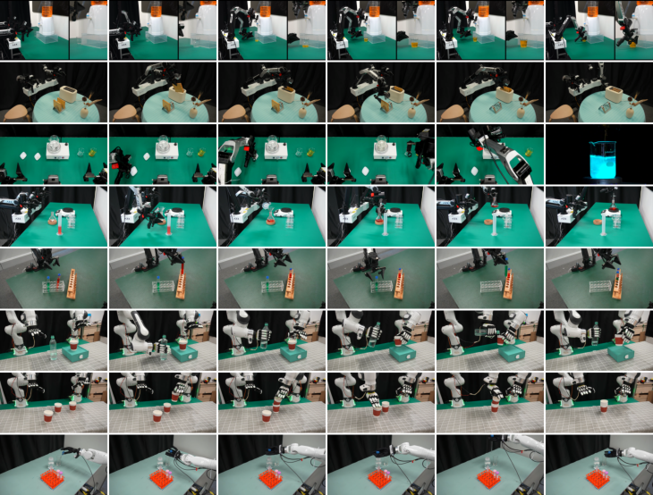

# InternW0-Δ：2 万小时数据炼出“会干活”的世界模型

这篇文章解决的是一个具身智能里的核心矛盾：大规模视频预训练让模型“知道世界怎么演化”，但“能预测未来”并不等于“会控制机器人”——动作生成还需要识别与任务相关的变化、理解物体几何与运动，并把这些线索落到当前指令和场景上。上海 AI Lab 的 Physical Intelligence 团队提出 **InternW0-Δ**，核心思路一句话概括：用一个 **有向 Mixture-of-Transformers** 把预训练视频专家和动作专家耦合起来，未来信息只在训练时当监督信号、推理时完全不生成未来视频。最硬的数字是：在 LIBERO-Plus 分布外鲁棒性基准上拿到 **92.8%** 成功率，在 RoboTwin 2.0 随机化环境（Clean2Random）上拿到 **71.9%**，并且整套模型建立在 **20K+ 小时** 的开放数据之上，真机推理在单张 RTX 5090 上做到 **152.8 ms** 往返延迟。

> 图解：InternW0-Δ 总览。模型将预训练视频动态、场景语义、4D 几何运动先验与动作生成统一在一个 MoT 框架中；数据侧整合机器人示教、UMI、第一视角人类视频和 Ego2Robot 合成数据，总计超过 2 万小时；下游覆盖仿真基准与四种真机平台。

## 一、问题：世界模型的“预测能力”如何变成“动作能力”？

World Action Model（WAM）是最近通用机器人操作的热门范式：联合建模视觉动态和动作生成，借助大规模视频预训练获得关于场景演化的强先验。但这里有个被反复验证的坑—— **预测未来观测的能力，并不会自动转化为有效的机器人控制**。

打个比方：一个看过海量驾驶视频的人，对“接下来画面会发生什么”很有直觉，但这和“此刻方向盘该打多少”之间还隔着好几层——要知道哪个变化跟任务有关、物体的几何和运动状态如何、当前指令指向哪个物体。

前人有两条路线，各有代价：

- **在线生成未来视频**：动作推理时先“想象”未来画面，再据此行动。效果好但推理开销巨大，难以实时部署；
- **完全放弃视频监督**：退化为普通 VLA，丢掉视频预训练带来的动态先验。

InternW0-Δ 走的是第三条路：**未来信息只作为训练监督存在，推理时一个未来帧都不生成**。这个“既要又要”的设计贯穿了整篇文章。

## 二、模型设计：有向 MoT + 两个“只在训练时存在”的监督

### 2.1 总体架构

> 图解：InternW0-Δ 架构总览。冻结的 Wan VAE 将稀疏视觉记忆（Anchor / Recent / Current 三帧）编码为视频 latent；预训练的 Wan2.2-TI2V-5B 视频专家与随机初始化的 ActionDiT 动作专家通过 30 层有向 MoT 块耦合；T5 指令嵌入条件化视频专家，冻结 VLM（RynnBrain1.1-2B）为动作专家提供场景语义；Causal Imprint token 从近期和当前观测中编码“变化导向”的预测特征，直接喂给动作专家。

整个模型由四个关键部件组成，我们逐个拆解。

### 2.2 多模态上下文编码：T5 管“语言”，VLM 管“场景”

每个时刻，模型接收最多 $K$ 个相机视角。为了兼容不同机器人的相机配置，所有有效视角先被拼到一张统一的“视觉画布”上：

$$
x_\tau = \Pi\left(\{o_\tau^{(k)}\}_{k=1}^{K}, \{m_\tau^{(k)}\}_{k=1}^{K}\right), \qquad z_\tau = E_{\mathrm{VAE}}(x_\tau)
$$

其中 $m_\tau^{(k)}$ 是视角可用掩码，$\Pi$ 是与机器人形态相关的拼接算子，$z_\tau$ 是视频 VAE 编码后的 latent。

语言侧设计了一个 **双通路**，这是笔者认为很务实的一个设计：

- **T5 通路**：继承自 Wan2.2 视频预训练的语言接口，保留视频专家的预训练先验。但 T5 只看到文字、看不到场景，无法判断“指令里说的那个物体”到底在画面哪里；
- **VLM 通路**：冻结的 RynnBrain1.1-2B 联合处理当前所有视角和指令，把“场景里有什么、物体在哪、任务进展到哪一步”这些语义直接提供给动作专家。

这个设计的聪明之处在于分工明确：T5 保住预训练接口不动，VLM 补上观测基础，互不干扰。而且 VLM 接口天然为未来的 Agent 能力（子任务描述、执行反馈、持久记忆）留了口子。

本体感知状态 $s_t$（关节位置、EEF 位姿、夹爪/灵巧手状态）则用两个独立线性层分别投影到视频专家和动作专家的嵌入空间。

### 2.3 稀疏记忆：只用三帧，兼顾“全局”和“刚刚”

直觉很简单：近期历史对短期运动连续性最重要，远期历史只需要一个粗粒度的全局参考。于是模型维护一个轻量的三元组稀疏记忆：

$$
\mathcal{X}_t = \{x_a,\ x_{t-H_c},\ x_t\}
$$

- $x_a$：episode 开头的 **锚点观测**，提供任务级全局上下文；
- $x_{t-H_c}$：上一个动作块执行前的 **近期观测**，提供短期执行历史；
- $x_t$：**当前观测**。

不用 dense 历史，只存三帧，就把“我在做什么任务”和“我刚刚做了什么”都覆盖了——消融实验也证实了这个设计的性价比（成功率 +3.88 个点）。

### 2.4 Causal Imprint：让“未来”在训练时留下印记

这是全文最核心的创新。名字灵感来自《星际穿越》——信息可以在时间上留下痕迹。想法是：**未来的结果虽然不能给动作路径看，但可以作为监督信号，在训练时“印”到从当前观测学到的表示里**。

具体做法：在视频专家的自注意力层里加入一组可学习的 Causal Imprint token，它们聚合近期和当前视觉特征，空间布局与当前视频 latent 对齐。训练时用干净的未来视频 latent 构造“相邻差分”监督目标：

$$
\Delta z_{t,i} = z_{t+i\rho_v} - z_{t+(i-1)\rho_v}, \qquad i = 1, \ldots, T_v
$$

即沿着未来轨迹逐段计算 latent 变化，堆叠成监督目标 $\Delta Z_t$，鼓励 Causal Imprint 编码“场景接下来会怎么变”。

> 图解：Causal Imprint 的两个互补监督目标。左侧：未来特征对齐——第 8 层的 Causal Imprint 特征与第 20 层未来终帧切片的空间对应特征做 cosine 对齐（stop-gradient，不回传梯度）；右侧：直接监督——最终层 Causal Imprint 特征用平方误差回归干净未来 latent 的相邻差分。

为什么是两个目标？消融给出了答案：$\mathcal{L}_{\Delta}$ 直接描述未来轨迹上的低层视觉变化（+1.72 个点），$\mathcal{L}_{\mathrm{align}}$ 则把视频专家中间层学到的更丰富语义、时序表示迁移过来（再 +5.65 个点）。两者合起来，Causal Imprint 学到的不只是“画面哪里会变”，还有“场景接下来如何演化”的高层信息。

### 2.5 4D 感知蒸馏：给视频专家注入几何与运动先验

> 图解：4D 感知表示蒸馏。冻结的 Track4World 教师模型离线处理真值视频窗口，产出聚合了几何、2D/3D 运动、相机运动与可见性统计的 1430 维 clip 级描述子；学生分支用 16 个可学习 query 通过两层 Transformer decoder 聚合视频专家第 15 层的干净 A/R/C 特征，经 mean-pool 和投影后与教师描述子做 MSE 对齐。教师与学生分支在推理时全部丢弃，零额外推理成本。

设计上有个值得注意的细节：蒸馏目标只挂在视频专家上、不注入动作专家（实验发现注入反而掉 0.6 个点），这样学生分支推理时可以整个删掉。教师特征全部离线预计算缓存，训练时也不跑教师模型。

### 2.6 有向 MoT：用注意力掩码管住信息流向

> 图解：(a) 视频流包含 Anchor（A）、Recent（R）、Current（C）、Future（F）和 Causal Imprint（$\Delta$）token，动作 token（Act）独立成流；(b) 两个专家各自计算 Q/K/V，拼接后做一次联合掩码自注意力，再各自走 cross-attention、FFN 和残差路径——参数不共享，注意力是唯一的通信接口；(c) 注意力掩码矩阵，行是 query、列是 key，控制谁能看谁。

整个架构的“灵魂”在这张掩码表上：

- **未来帧 token** 可以看观测上下文（用于学习未来预测）；
- **Causal Imprint 和动作 token 被禁止直接访问已实现的未来**；
- Causal Imprint 只能看 A/R/C 观测，动作专家只能看观测上下文 + Causal Imprint + VLM 语义。

这就从结构上保证了：未来观测只提供训练信号，推理时不存在任何从“已实现的未来”到“动作预测”的前向激活路径。相比“先想象未来再行动”的 WAM，这是用 **架构约束** 替代 **推理时生成**，思路干净利落。

### 2.7 训练目标与高效推理

视频生成和动作预测都采用 flow matching。对目标变量 $y$，采样噪声 $\epsilon \sim \mathcal{N}(0, I)$ 和流时间 $\sigma \in (0,1)$，构造 $y^{\sigma} = (1-\sigma)y + \sigma\epsilon$，训练目标为：

$$
\mathcal{L}_{\mathrm{FM}}(y) = \mathbb{E}_{\epsilon,\sigma}\left[\left\|f_\theta(y^\sigma, \sigma) - (\epsilon - y)\right\|_2^2\right]
$$

总目标是五项加权和：视频生成、动作生成、Causal Imprint 直接监督、未来特征对齐、4D 蒸馏：

$$
\mathcal{L} = \lambda_v\mathcal{L}_{\mathrm{video}} + \lambda_a\mathcal{L}_{\mathrm{action}} + \lambda_{\Delta}\mathcal{L}_{\Delta} + \lambda_{\mathrm{align}}\mathcal{L}_{\mathrm{align}} + \lambda_{\mathrm{4D}}\mathcal{L}_{\mathrm{4D}}
$$

> 图解：推理流程四步走。(1) A/R/C 观测经冻结 VAE 编码；(2) 视频专家对观测 token 和 Causal Imprint token 做一次 prefill，缓存每层 MoT 的 K/V，**完全不实例化未来视频 token**；(3) 从高斯噪声出发，动作专家经过 $N$ 步 flow 去噪生成动作块，全程复用缓存的视觉 K/V，只有动作流被重复计算；(4) 执行动作，获得新观测后更新缓存进入下一循环。每个“观测→动作”周期 = 1 次视频专家 prefill + $N$ 次动作专家更新，无未来视频采样、无 VAE 解码。

## 三、数据：20K+ 小时是怎么炼成的

模型之外，这篇文章的另一大块贡献是数据工程。数据源横跨机器人示教、UMI（手持夹爪采集）、第一视角人类视频和 Ego2Robot 合成数据，形态、控制空间、相机配置、时间约定全都不同。

### 3.1 统一表示：80 维规范动作空间

直接混合原始表示会让同一个维度在不同数据集里物理含义不一致，跨形态学习无从谈起。团队把所有轨迹映射到 **80 维规范动作空间**，每个槽位绑定固定的物理量：

| 组件 | 槽位范围 | 维度 |
| --- | --- | --- |
| 手臂关节 | $[0,7)$, $[40,47)$ | $2 \times 7$ |
| 末端执行器（EEF） | $[7,16)$, $[47,56)$ | $2 \times 9$ |
| 夹爪 | $[16,17)$, $[56,57)$ | $2 \times 1$ |
| 灵巧手 | $[17,29)$, $[57,69)$ | $2 \times 12$ |
| 躯干关节 | $[29,34)$ | 5 |
| 独立升降 | $[39,40)$ | 1 |
| 头部 | $[74,77)$ | 3 |
| 移动底盘 | $[77,80)$ | 3 |
| 保留槽位 | $[34,39)$, $[69,74)$ | $2 \times 5$ |

状态用绝对量（关节位置、9D EEF 绝对位姿：3D 位置 + 连续 6D 旋转表示），动作用相对量（EEF 动作为 3D 平移增量 + 3D 局部旋转向量）。不适用的维度用掩码从训练目标中屏蔽。

### 3.2 机器人数据：15 个数据集 + 六道过滤工序

机器人数据整合了 AgiBotWorld、InternData-A1、RoboMIND 1.0/2.0、ABC-130K、Dexora、RH20T、RDT-1B 等 **15 个数据集**，覆盖单臂、双臂、灵巧手、移动操作和人形交互。过滤流水线按固定顺序执行：

1. **信号异常与一致性过滤**：突变检测 + 状态-动作方向一致性检查（交叉相关对齐后阈值 0.65）；
2. **静态边界裁剪**：基于每段 episode 运动分布的自适应阈值，去掉首尾长时间静止段，但保留中间停顿以维持任务时序结构；
3. **视觉质量过滤**：黑帧、模糊（边缘区域的 Laplacian 响应）、$8\times8$ 块效应压缩伪影、异常帧间跳变；
4. **动作幅值护栏**：单步 EEF 平移超过 0.2 m 或旋转超过 0.5 rad 的样本直接丢弃——这类大幅复位动作往往“平滑且自洽”，能逃过前面的过滤器；
5. **指令正确性与视频-指令一致性**：LLM 先筛掉空、乱码、缺动作/物体/目标的指令；再用夹爪开合事件把 episode 切成动作片段，VLM 逐段理解后结合全局帧判断行为是否匹配指令、任务是否完成；
6. **人工抽检**：对每个“数据集-形态”组合回放 URDF 关节轨迹，核对坐标系、夹爪开合定义等语义约定。

最终机器人数据从 13,867.71 小时（137 万 episode）过滤到 **11,302.20 小时**（124.8 万 episode，11 亿帧）。

### 3.3 第一视角与 Ego2Robot 数据

> 图解：第一视角数据处理流水线。Ego2Robot 数据走全部阶段，纯 egocentric 数据只走动作对齐和动作速度对齐。动作对齐把手部运动映射为 EEF 目标和夹爪指令；运动学对齐将基座搜索与轨迹 IK 耦合，得到基座位姿和关节轨迹；视觉对齐用深度感知合成把渲染机器人贴回“人去楼空”的场景。

几个关键设计：

- **动作对齐**：把每只手的腕部位姿当作 EEF 位姿，用相机外参变换到瞬时相机系；夹爪开合度从人手几何估计——拇指尖到食指与中指尖中点的距离，5 cm 映射为全闭、7 cm 映射为全开；
- **运动学对齐**：外层搜索基座候选，内层固定基座做轨迹 IK，采用粗到细的两阶段验证，能检测 IK 解分支间的跳变和跟踪失败（比 Ego2Robot 原文的代表性关键帧检查更严格）；
- **视觉对齐**：SAM3 分割人、ProPainter 抹除，再从原相机视角渲染目标机器人，用度量手部关键点校准深度、物体掩码约束遮挡关系，时序迟滞减少可见性抖动；
- **动作速度对齐**：人类动作比机器人快约一倍，统一放慢 2 倍，空间路径不变。

> 图解：Ego2Robot 定性结果。经过动作对齐和运动学对齐后，机器人从原始第一视角渲染，并通过深度感知遮挡合成到移除人物后的场景中，效果自然。

EgoDex + EgoVerse 合计过滤后保留 4,061.35 小时；经 Ego2Robot 流水线，1,101.55 小时唯一源视频成功合成，由于一个源 episode 可对应多个机器人形态、切出多个训练段，最终产出 **5,633.77 机器人小时**、373 万训练 episode。

### 3.4 UMI 数据与总量

Hy-UMI-10K 提供约 2,162 小时手持夹爪双臂数据，经四元数有效性、双手静止、轨迹异常和速度过滤后保留 2,075.42 小时。加上机器人（11,302 小时）、第一视角（4,061 小时）和 Ego2Robot 合成（5,634 机器人小时），总盘子超过 **20K 小时**——据作者所知是同类中最大的开放语料。

## 四、训练：两阶段，245K 步，256 张 A800

### 4.1 预训练

- **数据配比**：真实机器人示教 80%、Ego2Robot 10%、UMI 8%、Ego 2%；按有效起始帧数加权，轨迹级平衡防止长片段主导；
- **样本构造**：33 帧视频 + 32 步动作块，视频-动作采样频率比 4:1，近期帧落后当前帧 32 个动作步，图像打包进 $384\times256$ 画布；
- **初始化**：视频专家 = Wan2.2-TI2V-5B，动作专家 = 随机初始化 ActionDiT，VLM = 冻结 RynnBrain1.1-2B；
- **规模**：256 张 A800，bf16，全局 batch 4,096，AdamW（lr $5\times10^{-5}$），先训 235K 步无蒸馏，再加 4D 蒸馏目标续训 10K 步，共 245K 步约 14 天；
- **分源动作损失权重**：机器人 1.0、UMI 0.5、Ego2Robot/Ego 0.1——人类数据的动作监督天然带噪，降权是合理的保守选择。

### 4.2 后训练：同一个预训练 checkpoint 适配一切

无论仿真基准（LIBERO、RoboTwin 2.0、EBench、RoboDojo）还是四个真机平台，都从 **同一个预训练 checkpoint** 出发，用各自的数据适配器映射到 80 维规范空间，mask 掉不适用维度，统一 lr $5\times10^{-5}$、10-15 epoch（真机灵巧手任务最多 100 epoch）。

真机后训练还有一个关键设计—— **RTC（Real-Time Chunking）训练时前缀条件**：每个训练样本随机采样前缀长度 $d \sim \mathcal{U}\{0,\dots,16\}$，前 $d$ 个真值动作保持干净（flow 时间步置零），只对后缀加噪并计算损失。这样策略学会“在已知前 $d$ 步动作的条件下续写动作”，正好匹配部署时异步推理的需求。

## 五、基础设施：训练提速 3 倍，推理提速 5 倍

这部分常被忽略，但对想复现的人极其实用。

### 5.1 训练侧：特征缓存 + 逐层编译

模型迭代期两大开销：跨 epoch 重复提取冻结编码器（VAE/VLM）特征，以及 MoT 骨干的计算与激活显存。对应的解法：

- **特征缓存**：Cache Manager 以 $\mathrm{key} = \mathrm{hash}(D, e, k, v, P, M)$（数据集版本、episode、时间块、相机视角、预处理版本、模型版本）标识每个特征工件，支持在线（边训边填，异步落盘）和离线（批量预生成 + manifest 校验）两种模式，防止跨配置错误复用；
- **逐层 MoT 编译**：30 个 MoT 块各自编译为独立 Inductor 图，由 eager 编排器调用，混合注意力用 FlexAttention（64-token 块），VLM 上下文补齐到 640 token 稳定编译形状；吞吐模式用 `reduce-overhead` + CUDA Graph，显存紧张时每 3 层包进一个外部非重入 checkpoint 区域。

组合效果：LIBERO 上端到端吞吐 **3.02×**、RoboTwin 上 **2.11×**；即使输入随机无法缓存，单独的逐层编译也能带来 20-30% 提升。

### 5.2 部署侧：30 Hz 控制、533 ms 预算内的 5.11× 提速

部署在单张 RTX 5090（32 GiB）上，30 Hz 控制率。控制器保持 32 步预测时域，每执行 16 步发一次后台推理请求——也就是说推理必须在剩余 16 步耗尽前返回，**30 Hz 下这个窗口只有 533 ms**，要的是往返延迟达标而非名义吞吐。

优化逐项累积（灵巧手部署，50 次请求平均）：

| 配置 | 往返延迟 (ms) | 加速比 | LIBERO-Plus 成功率 (%) |
| --- | --- | --- | --- |
| 标准运行时 | 780.5 | 1.00× | 92.78 |
| + 进程隔离（剥离 rclpy/GIL 干扰） | 374.1 | 2.09× | 92.67 |
| + 特征缓存与编译 | 249.8 | 3.12× | 92.46 |
| + 上下文缓存（K/V 跨 diffusion 步复用） | 217.3 | 3.59× | 92.41 |
| + 分组动作执行 | 186.2 | 4.19× | 92.33 |
| + CUDA Graph 回放 | **152.8** | **5.11×** | 92.23 |

注意最右一列：所有优化几乎不损失成功率（92.78 → 92.23），因为它们不改变模型输入、diffusion 调度、注意力语义和 RTC 前缀约定，纯粹是执行层优化。

## 六、实验：四个仿真基准 + 四个真机平台

### 6.1 LIBERO-Plus：零样本鲁棒性 92.8%

只在标准 LIBERO 训练集上后训练，直接在 LIBERO-Plus 的七类扰动（相机、机器人初始化、语言、光照、背景、噪声、布局）上零样本评估：

| 方法 | 相机 | 机器人 | 语言 | 噪声 | 布局 | 总分 |
| --- | --- | --- | --- | --- | --- | --- |
| $\pi_{0.5}$ | 78.4 | 73.6 | 80.8 | 89.0 | 84.5 | 84.4 |
| Qwen-RobotManip-Context | 89.9 | 83.9 | 86.5 | 97.9 | 87.5 | 91.4 |
| Being-H0.7（最强先前 WAM） | 82.0 | 59.0 | 82.8 | 93.5 | 88.5 | 84.8 |
| **InternW0-Δ** | **90.6** | **91.1** | **92.9** | 94.0 | 88.4 | **92.8** |

比最强 VLA 高 1.4 个点，比最强先前 WAM 高 8.0 个点。最大优势在机器人扰动维度（91.1% vs 先前最佳 87.4%）——这恰好是预测性表示最该发挥作用的地方。

### 6.2 RoboTwin 2.0：随机化环境提升 23 个点

只用干净环境数据训练，评估干净 + 随机化环境：

| 方法 | Clean2Clean | Clean2Random | 总分 |
| --- | --- | --- | --- |
| $\pi_{0.5}$ | 73.1 | 47.9 | 60.5 |
| Qwen-RobotManip-Context | 84.7 | 69.4 | 77.1 |
| OpenWAM-$\alpha$（最强先前 WAM） | 89.4 | 48.7 | 69.0 |
| **InternW0-Δ** | **90.0** | **71.9** | **81.0** |

对 WAM 对手的对比最说明问题：Clean2Random 从 48.7% 拉到 71.9%，同时 Clean2Clean 不降反升——鲁棒性的提升不是拿分布内性能换的。

### 6.3 EBench 与 RoboDojo

- **EBench**（移动双臂）：总分 66.0 全场最高，Long Horizon 任务成功率 49.4%、得分 76.5 均为第一，说明模型能在长程交互中维持任务进度和执行一致性；
- **RoboDojo**（记忆、精度、长程等高难维度）：平均成功率 23.91%，几乎是最强先前 WAM（OpenWAM-$\alpha$ 11.92%）的两倍，也超过了 GPT-6 Astra（22.48%）；Gen-Std（33.78%）和 Precision（23.25%）单项领先。

### 6.4 真机：预训练把成功率从 0-20% 拉到 95%

四个平台、11 个任务：AC-One 和 Arx5（夹爪），Franka+XHand 和 TianJi Marvin+Wuji Hand（灵巧手），任务包括接水、烤面包、鲁米诺化学发光反应、MOF 实验、倒水、叠杯子、用滴管、做三明治等。

> 图解：八个真机任务的执行序列，每行按时间从左到右排列，自上而下依次是接水、烤面包、鲁米诺反应、MOF 实验、放试管、倒水、叠杯子、用滴管。鲁米诺序列最后一帧是反应结果的特写（标志性的蓝色荧光）。

最有说服力的对照是 **预训练消融**（AC-One，各 20 次试验）：

| 任务 | 无预训练 | 有预训练 |
| --- | --- | --- |
| 烤面包 | 4/20 (20%) | 19/20 (95%) |
| 鲁米诺反应 | 0/20 (0%) | 19/20 (95%) |

另外还有两个亮点：接水任务在 137 条后训练示教里只有 **一个** 目标水位，部署时却能泛化到不同标记水位；RTC 连续性对比中，训练时前缀条件的边界动作突变比（1.12）远优于 VJP（8.94）和硬前缀（7.13），异步执行几乎无顿挫。

### 6.5 消融：每个组件都在干活

LIBERO-Plus 上的累积消融（每行独立从头训练）：

| 配置 | 成功率 (%) |
| --- | --- |
| Baseline | 49.59 |
| + 稀疏记忆 SMC | 53.47 |
| + Qwen3.5-2B | 60.37 |
| + RynnBrain1.1-2B | 69.08 |
| + Causal Imprint（$\mathcal{L}_{\Delta}$） | 70.80 |
| + 未来特征对齐 $\mathcal{L}_{\mathrm{align}}$ | 76.45 |
| + 4D 蒸馏 $\mathcal{L}_{\mathrm{4D}}$ | **78.37** |

几点观察：VLM 的选择影响巨大（换 RynnBrain 再涨 8.71 个点）；$\mathcal{L}_{\mathrm{align}}$ 是 Causal Imprint 两个目标里贡献更大的那个；4D 蒸馏教师中 Track4World（78.37%）优于 CoWTracker（76.15%）和 Pi3X（73.63%）。

**数据源消融** 的结论很直白：机器人示教数据收益最强最稳（RoboTwin Clean2Random 从 4.38% → 32.34%）；原始第一视角视频收益有限；但经过 Ego2Robot 对齐后收益明显变大，UMI 更大。一句话总结：**人类数据越对齐机器人的观测和动作空间，越有用**。作者也诚实地指出，当前评测以夹爪任务为主，Ego 数据对灵巧操作的价值可能被低估了。

### 6.6 探索：GPT-6 Astra 当“场外指导”

在 5 个 InternW0-Δ 独立表现较差的 RoboDojo 任务上，引入 GPT-6 Astra 做执行时纠偏（观测交互过程并给出 EEF 修正），平均成功率从 10.80% 飙到 **47.20%**——“classify objects”从 14% 到 80%，两个零成功任务也变得部分可解。这提示高层语义推理和底层世界动作模型是互补的，且 GPT 的推理档位（xhigh vs medium）对语义类任务的纠偏质量影响明显。

## 七、总结

- **核心架构**：有向 Mixture-of-Transformers 耦合预训练视频专家（Wan2.2-TI2V-5B）与动作专家（ActionDiT），注意力掩码从结构上隔绝未来信息进入动作路径；
- **Causal Imprint**：未来只当训练监督不当输入，用 latent 差分 + 未来特征对齐两个目标，让动作专家免费用上预测性表示，推理零未来视频生成；
- **训练时免费午餐**：4D 蒸馏（Track4World 教师）和 VLM 场景语义都在训练侧注入先验，推理侧不留任何额外开销；
- **数据工程**：80 维规范状态-动作空间 + 六道过滤工序 + Ego2Robot 合成，把 15 个机器人数据集、UMI 和第一视角视频统一成 20K+ 小时开放语料；
- **结果**：LIBERO-Plus 92.8%、RoboTwin 2.0 总分 81.0%、RoboDojo 近乎翻倍于先前最强 WAM，真机预训练消融 0-20% → 95%，推理 5.11× 提速且成功率几乎无损。

局限与展望：第一视角人类数据的不同来源、转换策略、配比对下游性能的系统性影响尚未充分研究；Agent 辅助控制（调用策略、长程规划、层级决策）也只做了初步探索。代码、权重、训练配方、数据处理工具和部署工具链都将开源，对想做 WAM 复现或数据工程的人来说，这套“从数据到部署”的完整配方可能比模型本身更有长期价值。

> 本文参考自 [InternW0-$\Delta$: A World Action Model Bridging Predictive Dynamics and Actions with 20K+ Hours of Open Data](http://arxiv.org/abs/2609.31394v1)