# SpecInfer：树状投机推理加速 LLM 服务

大模型推理有一个老毛病：生成每个 Token 都要完整跑一遍大模型，GPU 算力大量闲置，延迟却降不下来。这篇发表于 ASPLOS 2024 的论文提出 **SpecInfer** ，把投机推理（Speculative Decoding）从“猜一条序列”升级为“猜一棵树”：用一个或多个小模型（SSM）生成一棵候选 Token 树，再让大模型 **一次性并行验证** 整棵树，从而每个解码步产出多个 Token，且数学上严格保证输出分布与原模型完全一致。最终效果是：分布式推理比 vLLM、HuggingFace TGI、FasterTransformer 等现有系统快 **1.5-2.8 倍** ，Offloading 推理比 FlexGen 快 **2.6-3.5 倍** ，而生成结果一个 Token 都不差。

## 一、问题：自回归解码为什么慢

LLM 生成文本是自回归的：给定 Prompt，逐个解码后续 Token，每个新 Token 依赖之前所有 Token 的 Key/Value。现有系统普遍采用 **增量解码** （Incremental Decoding）：先把 Prompt 一次性算完，之后每轮迭代只解码 **一个** Token，并用 KV Cache 缓存历史 Token 的键值避免重算。

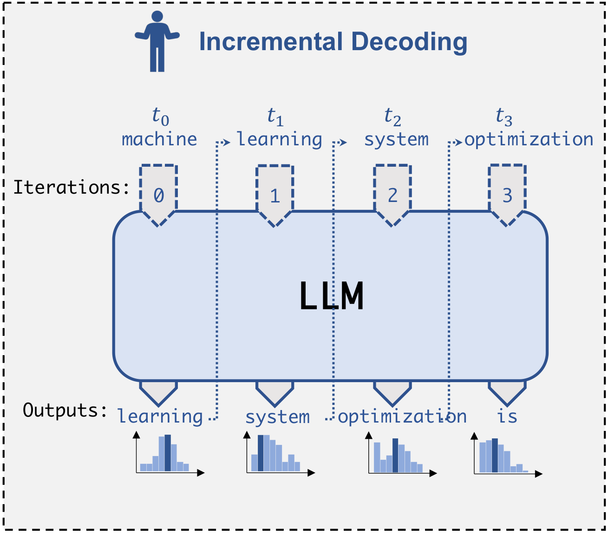

> 图解：现有 LLM 服务系统的增量解码流程。每生成一个 Token，都要把大模型的全部参数从显存读一遍并执行一次前向计算，Token 之间存在严格的串行依赖。

这个方案有两个绕不开的死结：

- **访存瓶颈** ：解码一个 Token 就要访问 LLM 的全部参数，推理性能被 GPU 显存带宽（而不是算力）卡住，GPU 计算单元大量闲置。
- **串行依赖** ：每个 Token 的计算依赖前面所有 Token 的 KV Cache，单个请求内部几乎没有并行度。

针对访存瓶颈，还有一条来自处理器“投机执行”思想的路线—— **序列级投机推理** （Sequence-based Speculative Inference）：用一个参数小几个数量级的 **小投机模型** （SSM, Small Speculative Model）先猜出一串 Token，再让大模型一次性并行验证这串 Token。猜对的部分相当于“白赚”。

但序列级方案有个硬伤：单条猜测序列与大模型对齐的成功率随猜测长度 **指数衰减** ，而且每一步只提供一个候选 Token。小模型和大模型之间的能力差距（Capacity Gap）天然存在，猜得越长越容易错。

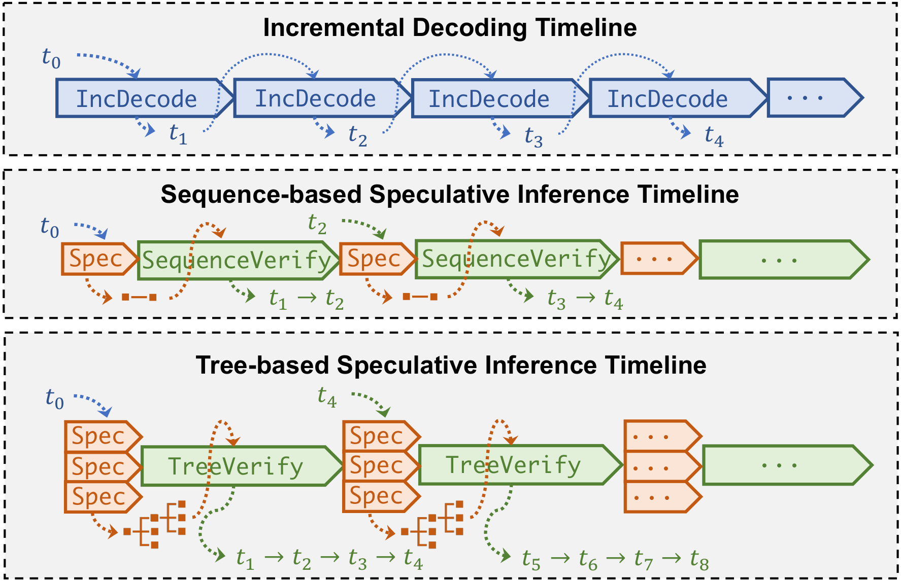

> 图解：增量解码、序列级投机推理与树状投机推理的时间线对比。树状方案在每个验证步里同时考察多条候选序列，单步能确认的 Token 数显著更多。

## 二、SpecInfer 总览：LLM 从“解码器”变成“验证器”

SpecInfer 的核心洞察是：与其只猜一条序列，不如 **同时考虑多样化的候选** ，把它们组织成一棵 **Token 树** （Token Tree），树的每个节点代表一条候选 Token 序列；然后用大模型对这棵树做 **一次** 前向计算，并行验证所有候选序列。

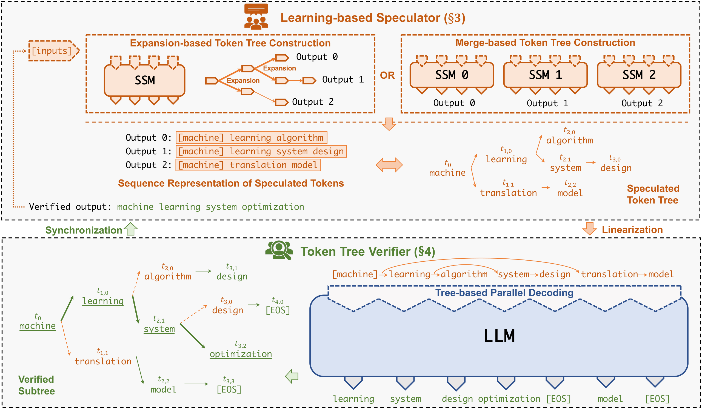

> 图解：SpecInfer 的树状投机推理与验证机制。上方是 Learning-based Speculator：一个或多个 SSM 生成候选 Token，经扩展（Expansion）或合并（Merge）组织成 Token 树；下方 LLM 作为 Token Tree Verifier，通过树并行解码一次性算出树上每个节点的输出 Token，再逐节点验证。

每一轮迭代的流程可以概括为三步（对应论文 Algorithm 2）：

1. **Speculate** ：投机器根据当前已生成的序列 $\mathcal{S}$，产出投机 Token 树 $\mathcal{N}$；
2. **TreeParallelDecode** ：LLM 对整棵树做一次解码，为每个节点 $u \in \mathcal{N}$ 生成输出 Token $\mathcal{O}(u)$；
3. **Verify** ：用贪心（VerifyGreedy）或随机采样（VerifyStochastic）方式把树 $\mathcal{N}$ 与 LLM 输出 $\mathcal{O}$ 比对，得到一串验证通过的 Token $\mathcal{V}$，追加到 $\mathcal{S}$。

和增量解码（Algorithm 1，每步 `Decode` 只产出一个 Token）相比，SpecInfer 只要树与 LLM 的真实输出有重叠，就能 **一步确认多个 Token** ，从而带来两个直接收益：

- **减少对 LLM 参数的访存次数** ：一次参数读取验证多个 Token。访问 GPU HBM 的能耗比浮点运算高 2-3 个数量级，这也直接降低了能耗。
- **降低端到端延迟** ：Token 之间实现并行化，LLM 解码步数大幅减少。

笔者认为这个视角转换非常聪明：它不试图“让大模型更快”，而是“让大模型每次被调用时产出更多”，把节省访存次数这个最硬的约束直接转化为延迟收益。

## 三、Token 树：怎么猜得更准

猜得准的前提是候选覆盖率高。先给出形式化定义：

**定义（Token Tree）** ：Token 树 $\mathcal{N}$ 中每个节点 $u$ 标记一个 Token $t_u$，$p_u$ 是 $u$ 的父节点。对任意节点 $u$，$S_u$ 表示把 $S_{p_u}$ 与 $\{t_u\}$ 拼接得到的 Token 序列（根节点 $r$ 的 $S_r = \{t_r\}$）。也就是说，树上每个节点唯一标识一条从根到它的候选序列。

SpecInfer 提供两种建树方法。

### 3.1 扩展式建树：挖掘单个 SSM 内部的多样性

一个关键观察是：当 SSM 与 LLM 不一致（两者 top-1 Token 不同）时，LLM 选中的 Token 通常就藏在 SSM 输出的 **top-$k$** 里，而且 $k$ 很小。

下表是用 LLaMA-68M 的 top-$k$ Token 去“命中” LLaMA-7B 所选 Token 的成功率：

| 解码方式 | 数据集 | $k=1$ | $k=2$ | $k=3$ | $k=4$ | $k=5$ |
| --- | --- | --- | --- | --- | --- | --- |
| Greedy | Alpaca | 68% | 77% | 81% | 84% | 85% |
| Greedy | CP | 69% | 79% | 83% | 86% | 87% |
| Greedy | WebQA | 62% | 72% | 77% | 80% | 82% |
| Greedy | CIP | 70% | 81% | 85% | 88% | 89% |
| Greedy | PIQA | 63% | 75% | 79% | 83% | 85% |
| Stochastic | Alpaca | 54% | 81% | 91% | 95% | 97% |
| Stochastic | CP | 56% | 82% | 92% | 95% | 97% |
| Stochastic | WebQA | 52% | 80% | 90% | 94% | 96% |
| Stochastic | CIP | 57% | 84% | 92% | 95% | 97% |
| Stochastic | PIQA | 55% | 82% | 91% | 95% | 97% |

只取 top-1 时随机采样的命中率只有 52-57%，取 top-5 直接飙到 96-97%。这就是“树”相对“序列”的价值来源。

但每步都展开 top-$k$ 会让候选序列数量指数爆炸。SpecInfer 采用 **静态扩展配置** ：一个整数向量 $\langle k_1, k_2, ..., k_m \rangle$，$m$ 是最大投机步数，$k_i$ 是第 $i$ 步每个节点展开的 Token 数。比如配置 $\langle 2, 2, 1 \rangle$ 会产出 4 条候选序列。实验表明，即使这种简单静态策略也能生成高质量的投机结果；动态扩展策略则留作未来工作。

### 3.2 合并式建树：多个 SSM 集思广益

另一条路是用 **多个** SSM 联合预测。SpecInfer 借鉴自适应提升（Adaptive Boosting）的思想，提出 **Collective Boost-Tuning**（集体提升微调），全程无监督：

1. 把通用语料（如 OpenWebText）切成 Prompt 样本，让 LLM 对每个 Prompt 生成参考 Token 序列；
2. 先把第一个 SSM 微调到位，标记所有“SSM 与 LLM 生成一致后续 Token”的样本；
3. 把这些已对齐的样本 **过滤掉** ，用剩余样本微调下一个 SSM；
4. 重复直到池子里所有 SSM 都被微调。

这样得到的 SSM 集合各有所长，聚合输出与 LLM 高度重叠。由于各 SSM 延迟相同、可以放在不同 GPU 上并行跑，多 SSM 不会增加投机延迟；SSM 又比 LLM 小 100-1000 倍，显存开销可以忽略。

多个 SSM 的输出各自是一棵（退化为链的）Token 树，需要合并：

**定义（Token Tree Merge）** ：$\mathcal{M}$ 是 $m$ 棵 Token 树 $\{\mathcal{N}_i\}$ 的合并，当且仅当每棵原树中的每条序列都在 $\mathcal{M}$ 中有对应节点，反之亦然。直观地说，合并后的树包含所有原树的序列，相同前缀只存一份。

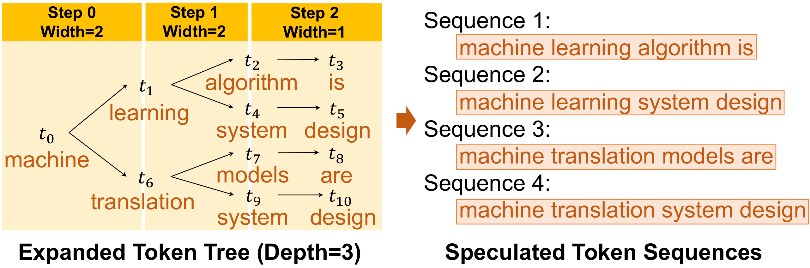

> 图解：Token 树的扩展与合并示意。多条候选序列共享的前缀被压缩成公共枝干，每条序列对应树上从根到某个节点的一条路径，相同前缀的存储和计算只需做一次。

## 四、Tree Attention：一次前向验证整棵树

猜出树之后，下一个问题是：如何用 LLM 高效地验证它？朴素做法是把树拆回多条序列逐条跑，但共享前缀会被重复计算，KV Cache 也会冲突。SpecInfer 的答案是 Tree Attention 加树并行解码。

### 4.1 从序列 Attention 到 Tree Attention

先回顾标准的多头自注意力。对输入张量 $X$，第 $i$ 个注意力头（共 $h$ 个）计算：

$$
Q_i = X W_i^Q, \quad K_i = X W_i^K, \quad V_i = X W_i^V
$$

$$
A_i = \frac{Q_i K_i^{T}}{\sqrt{d}}, \quad H_i = \text{softmax}(\text{mask}(A_i)) V_i, \quad O = (H_1, ..., H_h) W^O
$$

其中因果掩码保证生成时后面的 Token 不影响前面的 Token：

$$
\text{mask}(A)_{jk} = \begin{cases} A_{jk} & j \geq k \\ -\infty & j < k \end{cases}
$$

Tree Attention 的定义非常自然——把序列 Attention 推广到树上：

$$
\text{TreeAttention}(u) = \text{Attention}(S_u), \quad \forall u \in \mathcal{N}
$$

即节点 $u$ 的 Tree Attention 等于在它所代表的序列 $S_u$ 上做普通 Attention。由于合并树覆盖了所有候选序列，对树做一次 Tree Attention 就等价于拿到所有序列的 Attention 输出。注意这和 Nguyen 等人的 Tree-structured Attention 不是一回事：后者是用句法解析树表示单条输入序列，而 SpecInfer 的树是 **多条候选序列的前缀压缩** ，输出仍是 Token 序列而非树。

### 4.2 树并行解码：DFS 更新缓存 + 拓扑感知因果掩码

要把整棵树的 Attention 融进一次 kernel 计算，有两个障碍，SpecInfer 各用一招化解。

**障碍一：KV Cache 冲突。** 树里不同分支在分叉点后有不同的 Key/Value，比如序列 $(t_2, t_3, t_4, t_5)$ 和 $(t_2, t_3, t_8, t_9)$ 在第三、四个位置上缓存不同。给每条序列各开一份缓存既浪费又有冗余计算。

**解法：深度优先搜索（DFS）更新共享 KV Cache。** 按 DFS 序遍历树，所有序列复用同一份缓存，遍历时保持“当前节点的所有祖先的 KV 都已就绪”这一不变式。

**障碍二：无法批处理。** 逐个节点算 Attention 会产生大量 kernel 启动开销，但不同节点需要不同的 KV 视图，看似无法放进一个 kernel。

**解法：拓扑感知因果掩码（Topology-aware Causal Mask）。** 把整棵树的所有节点（已验证 Token + 全部投机 Token）按树的拓扑一次性存入缓存、放进同一个 kernel 计算 $QK^T$，然后 **根据树的拓扑修改因果掩码** ：对“不在同一根到叶路径上”的 Token 对，把 Attention 分数置为 $-\infty$。这样算出的结果与逐序列增量解码 **完全等价** ，但 kernel 启动次数大幅减少。

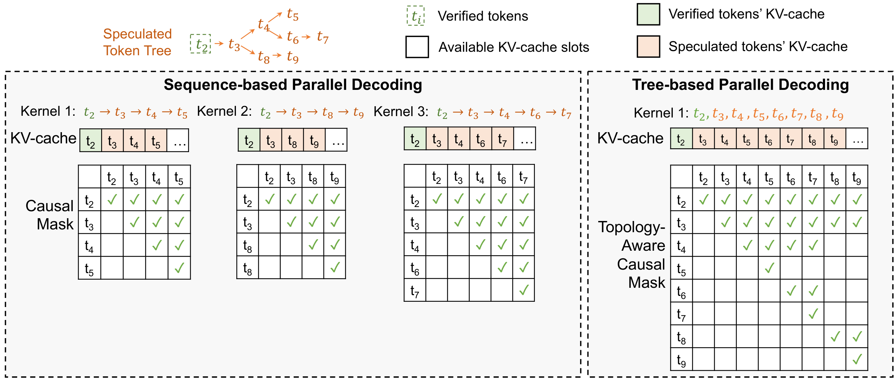

> 图解：左侧是序列级解码——树被拆成多条序列，每条独占一份 KV Cache，公共前缀（如 $t_2, t_3$）被重复计算；右侧是 SpecInfer 的树并行解码——DFS 序遍历整棵树、共享一份 KV Cache，配合拓扑感知因果掩码在一个 kernel 内完成全部节点的 Attention 计算。

## 五、验证算法：保证输出一个 Token 都不差

树并行解码产出张量 $\mathcal{O}$（每个节点对应 LLM 的一个输出 Token）后，验证器开始逐节点比对。SpecInfer 同时支持贪心解码和随机采样。

### 5.1 贪心验证

从树根出发：若当前节点 $u$ 存在子节点 $v$ 使得 $t_v = \mathcal{O}(u)$（SSM 猜中了 LLM 的选择），则收下 $t_v$ 并移动到 $v$ 继续验证；否则把 $\mathcal{O}(u)$ 本身作为验证结果收尾，结束本轮。显然这与增量解码的贪心输出完全一致。

### 5.2 多步投机采样（MSS）：随机采样下的等价性

随机采样要保证的是 **分布等价** ：SpecInfer 采出 $u_i$ 的概率必须与 LLM 直接采样严格相同。此前工作（Leviathan 等）的单步投机采样只支持单个 SSM、单条序列，一旦失配就失败。SpecInfer 的 **多步投机采样**（Multi-step Speculative Sampling, MSS）把这一过程推广到树的多个分支：

对每个节点 $u$，逐个随机抽取其子节点 $x_s$，以概率

$$
\min\left(1, \frac{P(x_s \mid u, \Theta_{\text{LLM}})}{P(x_s \mid u, \Theta_{\text{SSM}_s})}\right)
$$

接受；若拒绝，则从 LLM 分布中减去该 SSM 的贡献并归一化残差分布，再对剩余子节点继续尝试；全部拒绝后直接残差分布采样一个 Token 收尾。

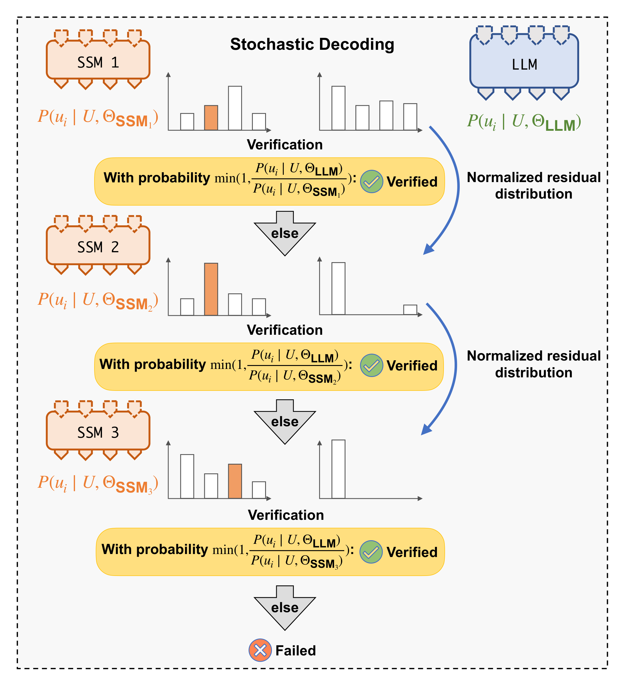

> 图解：随机采样下的多步验证流程。每个节点依次尝试各分支的候选 Token，被拒绝的分支通过残差分布归一化“消耗”掉对应的概率质量，保证最终采样分布与 LLM 完全一致。

论文给出了两条定理（证明见附录）：

**定理 1（分布等价）** ：对任意上文 $U$、Token $u_i$、LLM 参数 $\Theta_{\text{LLM}}$ 与任意 SSM 集合，有

$$
P(u_i \mid U; \Theta_{\text{LLM}}) = P_{\text{SpecInfer}}(u_i \mid U; \Theta_{\text{LLM}}, \{\Theta_{\text{SSM}_j}\})
$$

证明的核心是反向归纳：定义第 $j$ 轮的拒绝概率 $r_j = \sum_i \max(0, P(u_i \mid U, \Theta_{\text{SSM}_j}) - P(u_i \mid U, \Theta_{\text{LLM}}))$，递推 $T_j = (T_{j-1} - P(u \mid U, \Theta_{\text{SSM}_j})) / r_j$，可以证明 MSS 采出 $u_i$ 的概率 $A_0$ 满足 $A_j = \max(0, T_j)$，最终 $A_0 = \max(0, T_0) = P(u_i \mid U; \Theta_{\text{LLM}})$。整体拒绝概率为 $\prod_j r_j$，随 SSM 数量增加而下降。

**定理 2（优于朴素采样）** ：相比“直接从 LLM 采样再看树里有没有”的朴素采样（Naive Sampling, NS），MSS 的拒绝概率一致更低：

$$
P(\text{reject} \mid \text{MSS}) \leq P(\text{reject} \mid \text{NS})
$$

直观原因是 NS 只用一次匹配机会，而 MSS 对树的每个分支都有一次接受机会，且残差归一化让每次拒绝都在“逼近”正确答案。此前序列级方法的随机验证算法，正是 MSS 在树退化为单链时的特例。

## 六、系统实现与开销分析

### 6.1 运行时架构

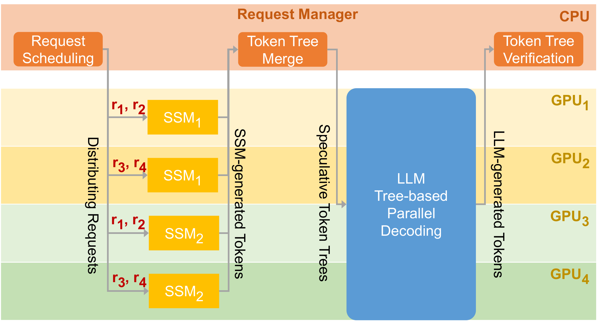

> 图解：一轮投机-验证迭代的系统工作流。Request Manager 采用 Orca 风格的迭代级调度与 Continuous Batching；SSM 体积小，用数据并行分布到各 GPU；LLM 用 Megatron-LM 式混合并行（节点内张量并行 + 跨节点流水线并行）；GPU 之间只传 Token 本身，不传隐向量，通信开销可忽略。

SpecInfer 基于 FlexFlow 分布式运行时实现，兼容 HuggingFace 模型定义，可无缝导入开源 LLM。Attention 计算使用基于 FasterTransformer 定制的 CUDA kernel：每个线程块负责一个请求的一个头，Query 载入共享内存，并通过拓扑感知因果掩码支持整树并行计算，避免 cuBLAS/cuDNN 逐序列启动 kernel 的高昂开销。

### 6.2 开销有多小

- **显存开销** ：SSM 比 LLM 小 100-1000 倍，每个 SSM 增加的显存不到 1%；Token 树的额外 KV 缓存相对长序列本身的 KV Cache 可忽略。
- **计算开销** ：多 SSM 在不同 GPU 上并行，不增加投机延迟；验证整棵树确实要算一些“用不上”的 Token，但增量解码本身就让 GPU 算力严重闲置，树验证恰好 **吃掉这些闲置算力** ，几乎不增加单步延迟。

这套机制天然适配两类场景： **分布式推理** （减少解码步数、增大通信粒度）和 **Offloading 推理** （减少 CPU DRAM 与 GPU HBM 之间的权重搬运次数）。

## 七、实验验证

**实验设置** ：LLM 选用 LLaMA-7B、OPT-13B、OPT-30B、LLaMA-65B，SSM 选用 LLaMA-68M 和 OPT-125M；数据集为 CIP、CP、WebQA、Alpaca、PIQA 五个 Prompt 集；硬件为两台 AWS g5.12xlarge（各 4 张 NVIDIA A10 24GB）。默认使用扩展式建树，配置为 $\langle 1, 1, 3, 1, 1, 1, 1, 1 \rangle$。

### 7.1 分布式推理端到端延迟

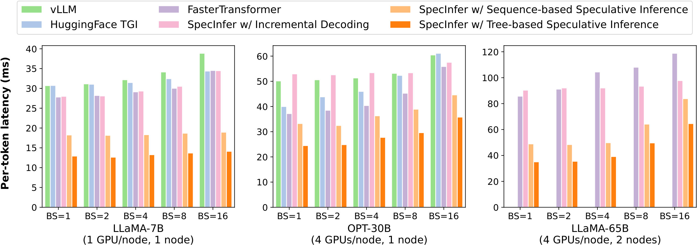

> 图解：SpecInfer 与 vLLM、HuggingFace TGI、FasterTransformer 的每 Token 平均延迟对比，括号内为所用 GPU/节点数。“SpecInfer (Incremental)” 是关闭投机后的自实现基线，与现有系统性能持平，排除了实现差异的干扰。

结论很清晰：

- 单机多卡场景比增量解码系统快 **1.5-2.5 倍** ，多机场景快 **2.4-2.8 倍** ，且所有 Prompt 的生成结果与增量解码 **逐 Token 相同** ；
- 相比序列级投机推理，树状方案再降延迟 **1.2-1.5 倍** ；
- Batch Size 越大，加速比越小——因为空闲算力变少，这也说明 SpecInfer 最适合 **低延迟** 场景。

### 7.2 Offloading 推理

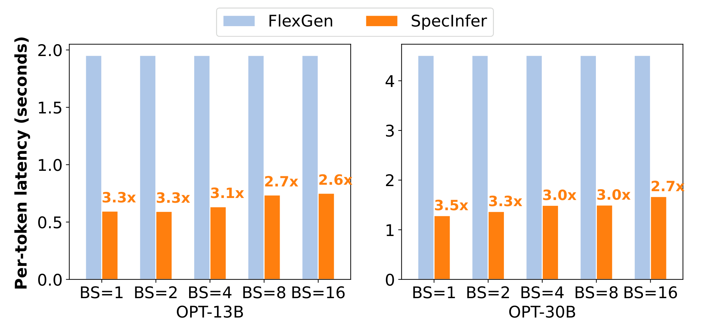

> 图解：在单张 24GB A10 上用 Offloading 方式服务 OPT-13B 和 OPT-30B，SpecInfer 与 FlexGen 的每 Token 延迟对比。Offloading 的瓶颈在 CPU-GPU 权重搬运，验证多个 Token 直接减少了解码步数和搬运次数。

相比 FlexGen，SpecInfer 把每 Token 延迟降低了 **2.6-3.5 倍** 。

### 7.3 Token 树宽度的影响

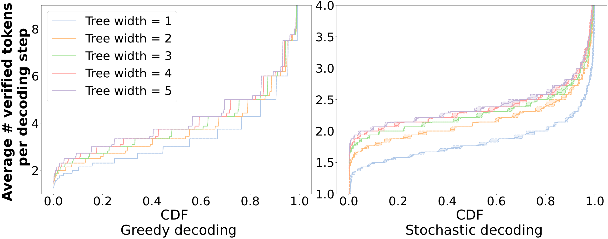

> 图解：Alpaca 数据集上“每解码步平均验证通过的 Token 数”的累积分布（CDF）。横轴为平均验证 Token 数，纵轴为累积比例，曲线越靠右越好。树宽从 1（退化为序列）增加到 5 时，曲线整体右移。

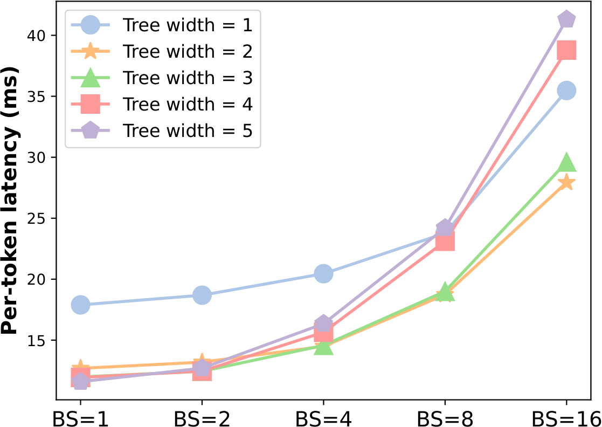

> 图解：LLaMA-7B + LLaMA-68M 下不同树宽的每 Token 延迟。小 Batch（1-2）时大树宽持续降延迟；Batch ≥ 4 时空闲算力不足，树宽 2-3 达到最佳平衡。

数值上看（LLaMA-7B + LLaMA-68M，投机深度 8），树宽为 5 时平均每步验证 Token 数从序列级的 2.18-2.95 提升到 3.07-3.91（贪心）/ 2.21-2.38（随机），相当于解码步数减少 1.2-1.5 倍（贪心）和 1.3-1.4 倍（随机）。

| 数据集 | 树宽=1 | 树宽=2 | 树宽=3 | 树宽=4 | 树宽=5 |
| --- | --- | --- | --- | --- | --- |
| Greedy / Alpaca | 2.95 | 3.07 | 3.21 | 3.33 | **3.43** |
| Greedy / CP | 2.58 | 3.24 | 3.46 | 3.59 | **3.69** |
| Greedy / WebQA | 2.27 | 2.69 | 2.86 | 2.98 | **3.07** |
| Greedy / CIP | 2.73 | 3.40 | 3.62 | 3.79 | **3.91** |
| Greedy / PIQA | 2.18 | 2.80 | 2.97 | 3.10 | **3.21** |
| Stochastic / Alpaca | 1.79 | 2.11 | 2.26 | 2.32 | **2.38** |
| Stochastic / CP | 1.69 | 1.99 | 2.15 | 2.23 | **2.28** |
| Stochastic / WebQA | 1.64 | 1.93 | 2.08 | 2.15 | **2.21** |
| Stochastic / CIP | 1.72 | 2.05 | 2.19 | 2.28 | **2.29** |
| Stochastic / PIQA | 1.67 | 1.93 | 2.08 | 2.15 | **2.21** |

### 7.4 树并行解码与 MSS 的消融

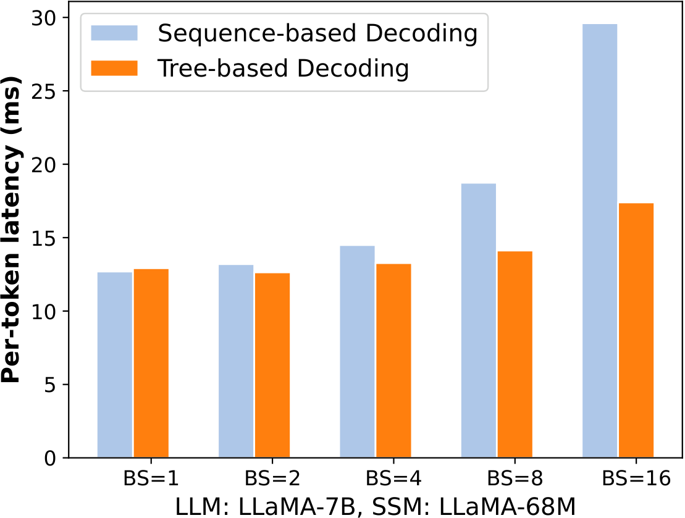

> 图解：树并行解码与“拆成多条序列分别解码”的性能对比。小 Batch 时两者持平，大 Batch 时树并行解码最高快 1.8 倍——收益来自消除共享前缀的重复计算和单 kernel 融合。

MSS 相对朴素采样的提升（LLaMA-7B + LLaMA-68M，树宽 5、深度 8）：

| 数据集 | Naive Sampling | Multi-Step Spec. Sampling | 提升 |
| --- | --- | --- | --- |
| Alpaca | 1.87 | 2.38 | 1.27× |
| CP | 1.80 | 2.28 | 1.26× |
| WebQA | 1.73 | 2.21 | 1.28× |
| CIP | 1.79 | 2.29 | 1.28× |
| PIQA | 1.73 | 2.21 | 1.28× |

### 7.5 建树方法与 Boost-Tuning 对比

附录还对比了扩展式与合并式建树：预算为 1 时两者等价；预算增大后各有胜负（Alpaca 上合并式略优，其余四个数据集上扩展式优势明显，最多多验证约 0.48 个 Token）。Collective Boost-Tuning 方面，用 OPT-13B + 五个由 OPT-125M 提升微调的 SSM（投机长度 16），平均每步验证 Token 数从单 SSM 的 2.91 提升到 5 个 SSM 的 3.68。

## 八、与相关工作的关系

- **无损加速路线** ：序列级投机解码（Leviathan 等）只猜单条序列、只用单个 SSM；SpecInfer 用树结构覆盖多候选，并用扩展/合并两种方式提升投机质量，MSS 是其验证算法的多分支推广。
- **有损加速路线** ：量化、剪枝、BiLD 等以牺牲输出质量换速度；SpecInfer 不减少计算量本身，而是把计算重组得更可并行，输出分布严格不变。
- **互补技术** ：TVM/Ansor 的 kernel 生成、TASO/PET 的图优化、Beam Search/Top-k/Top-p 采样策略都与 SpecInfer 正交，可叠加使用。

## 九、总结

- **问题** ：自回归增量解码被访存带宽和串行依赖卡死，单请求内并行度极低。
- **思路** ：把 LLM 从“逐 Token 解码器”改造成“Token 树验证器”，一次前向确认多个 Token。
- **建树** ：扩展式（单 SSM 的 top-$k$ 分叉，命中率从 52-57% 提到 96-97%）与合并式（Collective Boost-Tuning 多个 SSM）双管齐下。
- **验证** ：Tree Attention + DFS 共享 KV Cache + 拓扑感知因果掩码实现整树并行解码；MSS 算法证明保证随机采样分布严格等价，且拒绝率低于朴素采样。
- **结果** ：分布式推理快 1.5-2.8 倍，Offloading 快 2.6-3.5 倍，输出逐 Token 一致；代码已开源在 FlexFlow 仓库。

展望：Token 树的扩展目前还是静态配置，如何根据上下文难度 **动态** 调整树的深度与宽度，以及用投票、堆叠等更多集成方式组合 SSM，是这篇工作留给后续研究的开放空间——今天 vLLM 等主流框架中的 Multi-token / Tree-based Speculative Decoding，正是沿着这条路走下来的。

> 本文参考自 [SpecInfer: Accelerating Large Language Model Serving with Tree-based Speculative Inference and Verification](https://arxiv.org/abs/2305.09781)