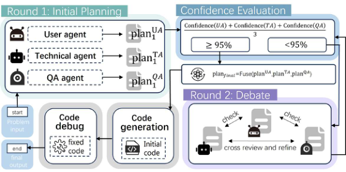
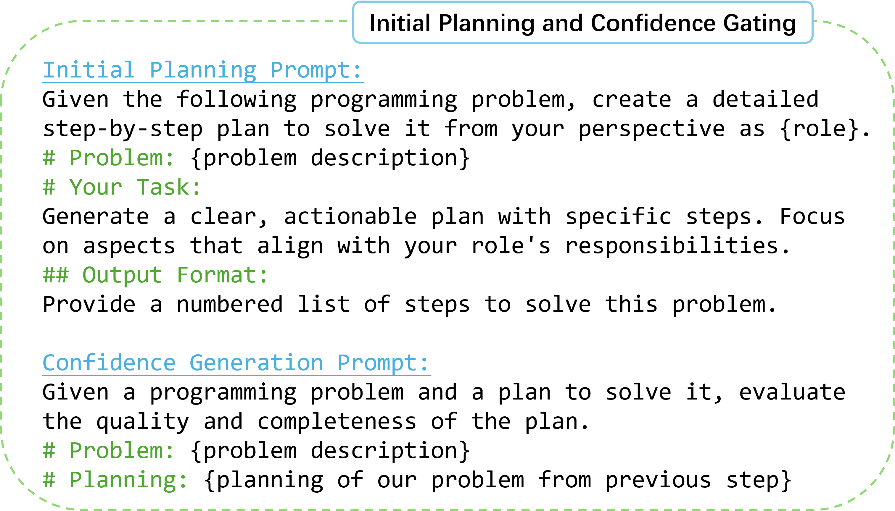
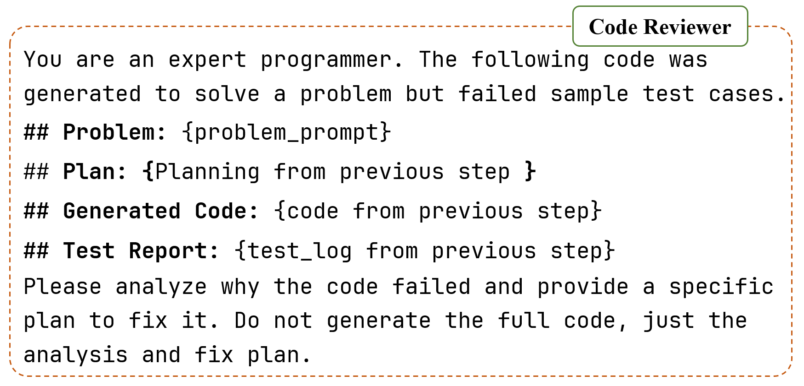
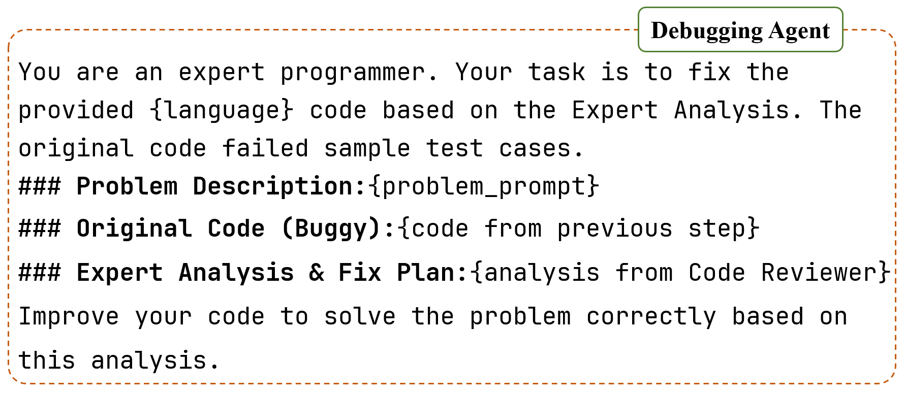

# DebateCoder 深度解读：用 Adaptive Confidence Gating 让小模型也能打出高质量代码生成

## 一句话先看结论
这篇工作要解决的核心痛点是：小参数模型（SLM）在代码任务里容易“想不深、改不对、反复错”。作者提出 **DebateCoder**，通过多智能体分工辩论 + 置信度门控 + Reviewer 引导调试，让 `Pangu-1B` 在 HumanEval 上做到 **70.12% Pass@1**，并将 API 调用次数相比 MapCoder 降低约 **35%**。

## 1. 问题背景：为什么 SLM 做代码生成这么难
LLM 在代码生成上已经很强，但成本高、部署重。很多真实场景（私有化、边缘侧、预算敏感）更需要 SLM。问题在于 SLM 常见两类失效：

- **Reasoning bottleneck**：多轮逻辑推理时上下文一致性差，复杂约束容易遗漏。
- **Failure loop**：调试阶段只看到 pass/fail 或长错误栈时，容易“盲改代码”，越改越错。

所以这篇论文的目标不是堆大模型，而是提升协作协议：在不增加模型参数的情况下，尽量释放 SLM 的推理潜力。

## 2. 核心思路：把“人类软件团队”流程结构化给模型
作者把代码生成拆成 3 个角色 + 4 个阶段：

- `A_UA`（User Agent）：关注需求完整性与可用性。
- `A_TA`（Technical Agent）：关注算法正确性与时空效率。
- `A_QA`（QA Agent）：关注鲁棒性、边界条件与异常处理。

然后采用四阶段流水线：

1. 并行初始规划与置信度评估
2. 多轮交叉辩论
3. 共识融合并生成代码
4. Reviewer 引导的分析式调试

> 图解：这是 DebateCoder 总流程图。横向看是“先并行出方案，再辩论收敛，再融合生成，再调试修复”；纵向看是三个角色各自从不同评价维度约束同一任务。其本质是把单模型的一条 Chain-of-Thought，扩展为可互相纠错的多视角推理图。

## 3. Adaptive Confidence Gating：这篇文章最关键的效率设计

### 3.1 初始轮的形式化定义
每个 agent 在第一轮独立输出“计划 + 置信度”：

$$
(L_{i,1}, c_{i,1}) = \text{LLM}(P, \text{Persona}_i)
$$

其中 $c_{i,1}\in[0,100]$ 表示该角色对当前任务可解性与清晰度的主观评分。

系统计算群体置信度均值：

$$
\Gamma = \frac{1}{|\mathcal{A}|}\sum c_{i,1}
$$

当 $\Gamma \ge \tau$（文中 $\tau=95\%$）时，直接跳过辩论，进入融合阶段；否则进入多轮辩论。

### 3.2 为什么这个门控有效
- 对简单题：三方初稿已接近一致，继续辩论只会增加 token 和调用延迟。
- 对难题：低置信度意味着方案分歧或漏洞明显，需要额外对抗式推理。
- 这相当于“按题目难度动态分配推理预算”，而不是所有样本都走最贵流程。

> 图解：该 Prompt 同时要求输出计划与置信度。横向目标是让每个角色显式暴露“自己认为什么地方不确定”；纵向目标是给系统一个可计算的早停信号，从而减少不必要的多轮推理。

## 4. 多轮辩论与共识融合：从“多意见”到“可执行主计划”

### 4.1 交叉辩论更新
若 $\Gamma<\tau$，进入最多 $R$ 轮（文中常用 $R=3$）：

$$
L_{i,r} = \text{LLM}(P, \mathcal{L}_{r-1}, \text{Persona}_i)
$$

每个角色会读到其他角色上轮计划，再修正自己的方案。  
例如 TA 可能因 QA 提醒的边界条件而调整数据结构；UA 则确保优化不偏离用户功能目标。

### 4.2 融合器生成 Master Plan
终轮后交给 Synthesis Agent 做逻辑融合：

$$
P^* = \text{LLM}(\text{Synthesize}(\mathcal{L}_R))
$$

注意这里不是文本拼接，而是冲突消解：在“功能完整、技术高效、鲁棒可靠”三目标间做平衡，再驱动最终代码生成。

## 5. Reviewer-Guided Debugging：避免 SLM 盲改的关键补丁
MapCoder 风格的调试更依赖错误日志直修；但对 SLM 来说，这经常触发 failure loop。  
DebateCoder 增加了一个 **Code Reviewer** 中间层：

- 输入：题目 + 当前代码 + 测试日志
- 输出：错误根因分析 + 修复计划
- Debugging Agent 再按计划改代码，而非直接“猜修复”

> 图解：Reviewer Prompt 的核心是“先解释为什么错，再给修复步骤”，把调试从 token 级补丁变成结构化诊断流程。

> 图解：Debugging Agent 不再独立决策，而是执行 Reviewer 提供的修复路线，减少无目标改动引入的新错误。

## 6. 实验设置与主结果

### 6.1 设置
- 基座模型：`Pangu-1B`
- 数据集：HumanEval、HumanEval ET、MBPP、MBPP ET
- 对比方法：Direct（零样本直接生成）、MapCoder

### 6.2 主结果（Pass@1）
| 模型 | 方法 | HumanEval | HumanEval ET | MBPP | MBPP ET | AVG |
|---|---:|---:|---:|---:|---:|---:|
| Pangu-1B | Direct | 59.15% | 53.04% | 28.46% | 17.38% | 39.51% |
| Pangu-1B | MapCoder | 61.59% | 53.66% | 65.49% | 43.07% | 55.95% |
| Pangu-1B | DebateCoder | **70.12%** | **60.98%** | 63.22% | 41.31% | **58.91%** |

关键信号：

- HumanEval：DebateCoder 比 MapCoder 高 **8.53 个百分点**。
- 综合平均：DebateCoder 最优（58.91%）。
- MBPP 系列略低于 MapCoder，但仍显著高于 Direct，说明其优势更偏向复杂逻辑任务。

## 7. 效率分析：为什么说它“更省调用”
| 模型 | 方法 | HumanEval API Calls | HumanEval Prompt(k) | HumanEval Completion(k) | MBPP API Calls | MBPP Prompt(k) | MBPP Completion(k) |
|---|---:|---:|---:|---:|---:|---:|---:|
| Pangu-1B | Direct | 1.00 | 0.14 | 1.9 | 1.00 | 0.07 | 0.89 |
| Pangu-1B | MapCoder | 12.45 | 9.4 | 11.2 | 12.13 | 8.89 | 10.4 |
| Pangu-1B | DebateCoder | **8.12** | 29.7 | 12.4 | **9.37** | 26.3 | 11.4 |

解读：

- DebateCoder 显著减少 API 调用（HumanEval 约降 35%），推理交互延迟更低。
- Completion token 与 MapCoder 同量级，没有明显“啰嗦生成”。
- Prompt token 增加明显，这是以更多上下文换更少调用与更高准确率的 trade-off。

## 8. 消融实验：每个模块到底贡献了什么
在 HumanEval 上：

- 仅加 Plan（MultiAgentDebate）：59.15% → 64.02%（+4.87）
- 仅加 Debugging Agent：59.15% → 61.59%
- Reviewer + Debugging：59.15% → 67.07%
- 全模块 DebateCoder：**70.12%**（最优）

这说明预生成辩论与后生成调试是 **正交互补** 的：一个提升“初始方案质量”，一个降低“修复偏航风险”。

## 9. 方法价值与局限

### 9.1 价值
- 给 SLM 一条现实路径：不靠加参数，靠协作协议获得可观提升。
- 把“是否值得多轮推理”变成可计算决策（Confidence Gating）。
- 在调试阶段引入“分析先行”，显著缓解 failure loop。

### 9.2 局限
- 置信度分数来自模型自评，存在校准误差风险。
- Prompt token 成本较高，对超长上下文窗口有依赖。
- 在 MBPP 这类任务上并非全面领先，说明策略仍有任务分布偏置。

## 10. 复现与落地时可优先关注的超参数
- 门控阈值 $\tau$（文中 95%）：控制“质量优先 vs 成本优先”的平衡点。
- 最大辩论轮数 $R$（文中常用 3）：过低可能收敛不足，过高可能收益递减。
- Reviewer 输出格式：建议强约束为“根因 -> 修复步骤 -> 风险点”，避免泛化建议。

## 11. 总结
**DebateCoder** 的核心不是“多 agent 越多越好”，而是“让多 agent 在正确时机以正确协议协作”。  
通过 **Adaptive Confidence Gating** 做动态早停，通过跨角色辩论做方案收敛，通过 Reviewer-Driven Debugging 做定向修复，这篇工作证明了小模型也能在代码生成中打出高质量结果，尤其适合资源受限但仍追求工程可用性的部署场景。

> 本文参考自 [Adaptive Confidence Gating in Multi-Agent Collaboration for Efficient and Optimized Code Generation](https://arxiv.org/abs/2601.21469)