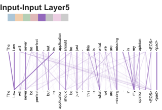

# Attention Is All You Need：纯 Attention 的 Transformer 如何改写机器翻译

这篇论文的核心很直接：把 RNN 和 CNN 全部拿掉，只用 self-attention 来做序列到序列（seq2seq）建模。结果不仅 BLEU 上刷出 SOTA，训练还更快、更好并行。

下面按“问题 -> 方法 -> 实验 -> 结论”的逻辑做一篇中等长度解读，并配 3-5 张关键图。

## 背景：为什么要摆脱 RNN/CNN？
传统 seq2seq 主要靠 RNN 或 CNN：
- RNN 有强顺序依赖，训练并行性差，长句子更难学。
- CNN 依赖堆叠才能扩大感受野，计算量上去，但长距离依赖仍不舒服。

Transformer 的关键动机是： **用 self-attention 在 O(1) 的顺序步骤内让任意位置直接交互** ，同时保持强并行能力。

## 方法：Transformer 架构与核心模块

### 1. Encoder-Decoder 结构（保留经典骨架）
Transformer 仍是 encoder-decoder，但每层只有：
- Multi-Head Self-Attention
- Position-wise Feed-Forward

并且每个子层都有残差连接 + LayerNorm。

> 图解：左边是 Encoder 堆叠，右边是 Decoder 堆叠。每层都由 Self-Attention 和 FFN 组成，Decoder 额外多了 encoder-decoder attention。核心变化是：不再有 RNN 或 CNN，全部靠 attention 完成信息交互。

### 2. Scaled Dot-Product Attention
核心公式是：

$$
\mathrm{Attention}(Q, K, V) = \mathrm{softmax}\left(\frac{QK^T}{\sqrt{d_k}}\right)V
$$

缩放因子 $\frac{1}{\sqrt{d_k}}$ 的意义是：避免 dot-product 值过大导致 softmax 梯度消失。

> 图解：左图展示了 Query-Key 的相似度计算，再通过 softmax 得到权重，对 Value 加权求和。缩放因子保证不同维度下的稳定训练。

### 3. Multi-Head Attention：多视角并行关注
单头容易“平均化”，多头能在不同子空间捕捉不同关系：

$$
\mathrm{MultiHead}(Q, K, V) = \mathrm{Concat}(\mathrm{head}_1,...,\mathrm{head}_h)W^O
$$

> 图解：多头相当于让模型在多个子空间并行做注意力，每个头关注不同关系，最后拼接再线性变换。

### 4. Position-wise Feed-Forward
每个位置独立应用两层全连接：

$$
\mathrm{FFN}(x)=\max(0, xW_1 + b_1) W_2 + b_2
$$

作用是增强非线性表达能力，和 attention 形成互补。

### 5. Positional Encoding
没有 RNN 就没有顺序信息，于是引入正弦位置编码：

$$
PE_{(pos,2i)} = \sin(pos / 10000^{2i/d_{model}})
$$

$$
PE_{(pos,2i+1)} = \cos(pos / 10000^{2i/d_{model}})
$$

## 实验：翻译与解析任务的关键结果

### 机器翻译：WMT14 EN-DE / EN-FR
Transformer big 模型达到：
- EN-DE：28.4 BLEU（比当时最强模型高 2.0+）
- EN-FR：41.8 BLEU（单模型 SOTA）
- 训练成本大幅降低（FLOPs 明显少）

关键对比结论：
- base 模型就超越大多数传统/ensemble 模型
- big 模型在质量和效率上都压制竞品

### 架构消融：哪些超参最重要？
论文做了大量结构变体实验（头数、d_k、层数、dropout 等）：
- 头数过少或过多都会掉分
- d_k 过小显著损害性能
- dropout 对避免过拟合非常关键

### 任务泛化：英文成分句法解析
Transformer 在 WSJ parsing 上也很强：
- 4-layer Transformer 已接近经典方法
- 半监督训练后甚至接近当时最强结果

## 附加洞察：Self-Attention 的解释性
论文给了 attention visualization，显示不同 head 学到了不同结构信息，比如长距离依赖和指代消解。

> 图解：注意力头能捕捉到“making ... more difficult”这样的长距离依赖，说明模型在语义结构上有一定可解释性。

> 图解：注意力头能够将代词（如 “its”）指向正确的名词，表现出类似指代消解的能力。

## 总结：Transformer 为什么改变了世界？
-  **性能** ：在翻译任务上达到当时 SOTA
-  **效率** ：训练更快，完全并行
-  **通用性** ：可迁移到解析等任务
-  **影响力** ：成为后续 BERT、GPT、T5 等模型的基础

本文参考自 [Attention Is All You Need](https://arxiv.org/abs/1706.03762)

如果你想进一步扩展：
1. 需要我补充完整的训练细节与超参表吗？
2. 想要我用 Transformer 的思想对比 RNN/CNN 的复杂度表做可视化总结吗？
3. 是否希望追加一节“Transformer 对后续模型的影响与演化路径”？