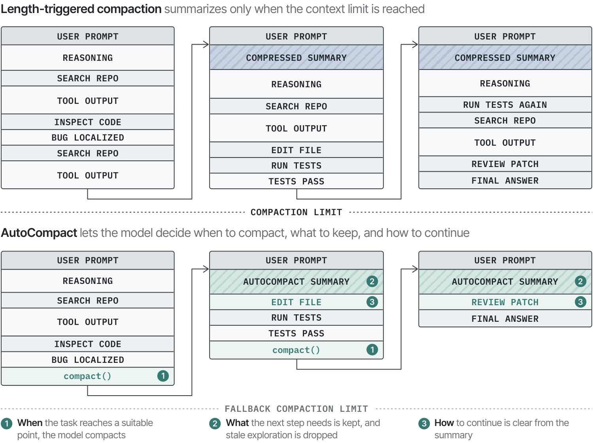
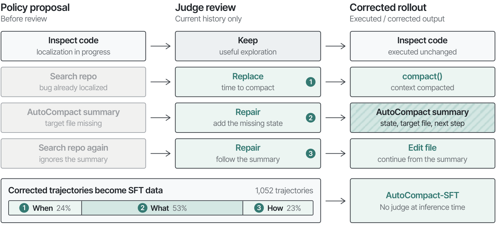
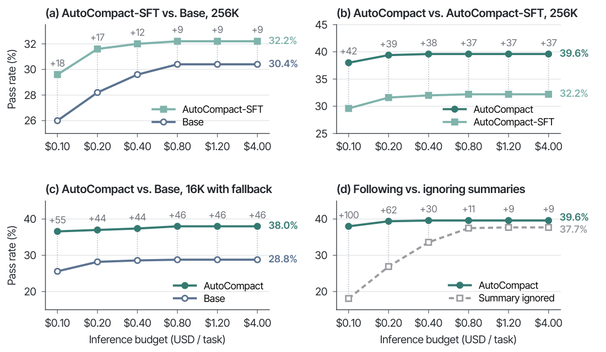
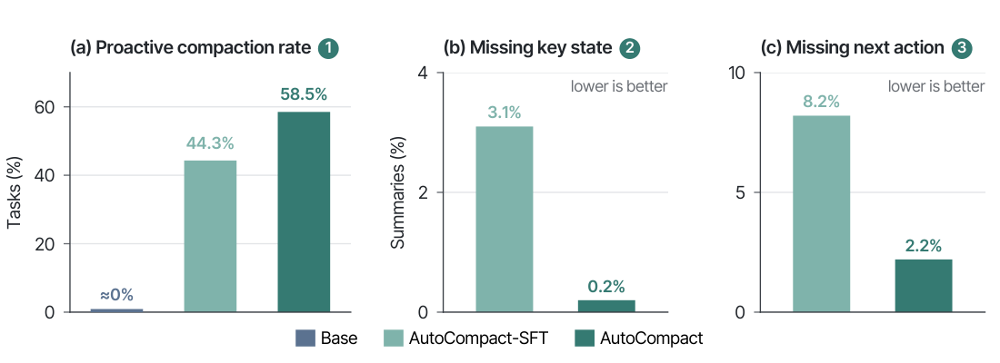
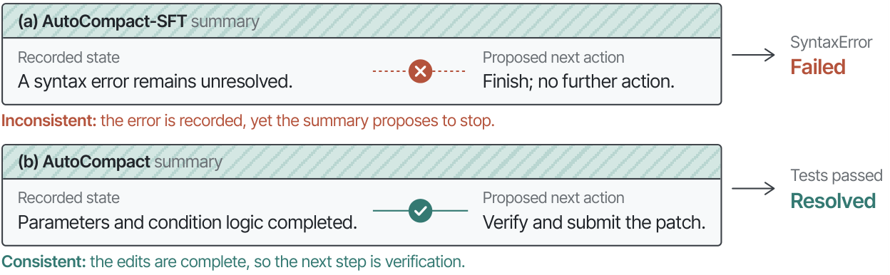

# AutoCompact：让 Coding Agent 自己学会"何时压缩上下文"

长程 Coding Agent 在解决仓库级软件工程任务时，会产生动辄上百轮的轨迹，上下文里塞满了过时的探索假设、失败的尝试和冗长的工具输出——问题不只是"上下文会爆"，而是模型需要在任务推进过程中主动决定 **何时压缩** 、 **保留什么** 、 **压缩后如何继续** 。AutoCompact 把这三个决策直接训练进 Agent 的策略里：用一个 Judge 在数据收集阶段在线纠正 Agent 的压缩时机、摘要内容和后续动作，再用纯任务成功率的 RL 联合优化编码与压缩行为。最终在 SWE-bench Verified 上 pass rate 达到 **39.6%** （比基线绝对提升 **9.2%** ），在 SWE-PolyBench Verified 上达到 **24.5%** （提升 **5.0%** ），且在从 \$0.10 到 \$4.00 的所有推理预算档位上全面领先。

## 背景：上下文管理不是"防溢出"那么简单

随着 Claude Code、OpenHands 这类 Coding Agent 的普及，大家逐渐发现一个现象：Agent 排查一个复杂 bug 时，会反复搜索、读文件、试错，轨迹越滚越长。早期的探索结论（比如"排除了某个假设"）、失败尝试的细节、大段的 grep 输出，在进入下一个阶段后就已经 **过时（stale）** 了。

把这些全都留在上下文里有两个坏处：

- 直接撑爆上下文窗口，被迫截断或压缩；
- 即使窗口够大，过时的细节也会 **干扰** 模型对当前工作状态（working state）的判断。

所以真正有效的上下文管理需要回答三个问题： **何时** 压缩、压缩时 **保留什么** 、压缩后 **如何继续** 。这很像人类工程师写交接文档——不是等桌子堆满了才收拾，而是在一个阶段告一段落时主动整理。

### 现有方法的短板

目前的方法大致分两派，各自都只解决了问题的一部分：

- **长度触发型** （如 CompactionRL、Codex/Claude Code 的自动压缩）：剩余上下文低于某个阈值才压缩。这把压缩时机绑定在"长度"而非"任务进度"上——过时信息会一直堆积到阈值，而且压缩可能恰好发生在一个未完成的阶段中间，把还需要的证据丢掉。
- **主动型** ：让模型自己决定何时压缩。又分两种：推理时用 rubric 引导（SelfCompact），或者在已完成的轨迹里离线插入压缩调用再做 SFT（SWE-Compressor）。但前者没有训练信号，后者插入压缩后 **保留了原来的后续动作** ，模型学不到"压缩之后该怎么行动"。

更关键的是，就算时机选对了，摘要可能漏掉或曲解关键信息；就算摘要写对了，Agent 也可能不照着做——重新跑一遍摘要里已有结论的搜索，或者无视计划好的下一步。这两类失败，现有方法都没有监督到。

## AutoCompact 的核心思路

> 图解：长度触发压缩 vs AutoCompact 的对比。左/上侧展示传统方式——Agent 在定位 bug 后仍不断积累上下文（比如重复的搜索和长输出），直到撞上下文上限才被迫总结；右/下侧展示 AutoCompact——模型自主决策三件事：(1) 何时压缩；(2) 保留什么，把有用发现改写成工作状态摘要、丢弃过时探索；(3) 如何从摘要继续执行。

AutoCompact 的做法概括起来就是一句话： **把压缩变成模型的一个可学习动作，并在训练数据里直接纠正"压缩时机、摘要内容、后续动作"这三类错误** 。

整个方法分两块：

1. 给 Agent 增加一个 `compact()` 动作，可以在执行中主动调用；
2. 两阶段训练：先用 Judge 在线纠正的轨迹做 SFT，再用结果导向的 RL（GRPO）联合优化编码与压缩。

### 机制设计：`compact()` 动作

Agent 平时正常工作：看文件、改代码、跑测试。当它判断当前阶段已经充分解决、积累的历史可以总结时，可以在到达上下文上限 **之前** 主动调用 `compact()`。典型场景是：定位完 bug 成因、准备进入实现阶段之前先压缩一次。

压缩会把之前的交互历史替换为一段模型生成的、以 `# Auto Context Summary` 开头的工作状态摘要，原始任务描述保持不变。摘要应保留已有结论、相关代码与工作区状态、剩余动作，丢掉探索细节。然后 Agent 从这个新上下文继续执行。

> 博主点评：这个设计的聪明之处在于把压缩从"系统兜底机制"变成了"模型决策"。但代价也很明显——模型必须学会一种反直觉的行为：在没有外部压力时主动打断自己一条本来还不错的轨迹。这正是为什么光靠 prompt 教不会，必须靠训练。

### 第一阶段：Judge 引导的在线数据收集 + SFT

作者先做了一个预实验：只在 Agent prompt 里写明压缩规则，基座模型几乎从不主动调用 `compact()`。这印证了上面的判断——主动压缩是基座策略里非常罕见的行为，纯 prompting 诱导不出来。

于是他们设计了一个 **在线纠正的数据收集流程** ：让基座模型在 SWE 任务上 rollout，每一步由 Judge（GPT-5.5-Codex）审查模型刚提出的动作。Judge 只看当前步骤之前的历史，依据预定义的标注协议判断输出是否合格。

> 图解：Judge 引导的在线数据收集流程。每一步 Judge 基于当前执行历史审查策略的提议，有用的探索直接放行，纠正则针对三类问题：(1) 时机纠正——例如 bug 已定位、模型还想再搜索时，替换为 `compact()`；(2) 内容纠正——修复漏掉目标文件的摘要；(3) 续接纠正——把"重复搜索"重定向为摘要里计划好的编辑动作。环境执行的是纠正后的输出，这些轨迹用于 SFT；训练好的 Agent 推理时不需要 Judge。

三类纠正恰好对应压缩的三大失败模式：

- **Trigger correction（时机纠正）** ：当前是否适合压缩？阶段已充分解决就该压缩，证据还不充分就继续探索；
- **Working-state correction（内容纠正）** ：生成的 `# Auto Context Summary` 是否准确保留了后续执行所需的信息；
- **Continuation correction（续接纠正）** ：压缩后的前几个动作是否遵循摘要，而不是重跑已完成的探索、无视计划的下一步。

最关键的一点是： **纠正在执行之前应用** 。Judge 发现输出不合格时会写出纠正版，环境执行纠正后的输出，策略再从纠正后的历史继续生成。这和事后标注（post-hoc annotation）有本质区别——纠正会真实影响轨迹的后续走向，所以模型能从数据里学到"压缩之后正确行动长什么样"。

之后在 379 个 SWE-rebench 任务上收集了 **1,052 条** 纠正后的轨迹（过滤掉格式错误、摘要死循环、跑偏的续接后），其中 24% 监督压缩时机、53% 监督工作状态构建、23% 监督压缩后续接。用标准 next-token 预测目标微调两个 epoch（学习率 $5\times10^{-7}$，batch size 8），得到 AutoCompact-SFT。

但 SFT 只优化了"局部被纠正的决策"，没有直接对齐任务最终的成败。于是进入第二阶段。

### 第二阶段：结果导向 RL，编码与压缩联合优化

从 SFT checkpoint 出发，作者在 SWE-Gym 上用 GRPO 做端到端多轮 RL（全异步系统）。奖励设计极其简单：每条 rollout 按最终 patch 是否通过任务测试给 **二值奖励** ，组内转成相对优势（advantage），作为轨迹中所有模型 token 的共享学习信号——包括普通编码动作、调用 `compact()` 的决策、生成的摘要、以及压缩后的续接。

也就是说，压缩 **不需要** 单独的辅助目标或专门的 reward shaping，任务成功这一个信号就够了。

这里有个工程细节值得一提：压缩会重写上下文前缀，所以一条含压缩的轨迹不再是"每轮都在上一轮上下文上追加"的单序列。作者的处理是把轨迹在每次上下文重写处切成若干 **segment** ，每个 segment 内部前缀只增不减；同一轨迹的所有 segment 共享同一个 advantage，于是压缩决策、摘要、续接虽然落在不同 segment 里，却收到同一个结果信号。策略损失在 batch 内按 token 级平均，不加 KL 惩罚也不加熵奖励——二值结果奖励是唯一训练信号。

RL 超参：学习率 $1\times10^{-6}$，batch size 64，每任务采样 8 条轨迹，rollout 上限 50 步 / 32K token。

## 实验结果

### 主结果：全面领先

所有方法共用同一个基座（Qwen3-Coder-30B-A3B-Instruct）和同一个终端 REPL scaffold，结果取三次运行平均：

| 方法 | 触发方式 | 优化方式 | 上下文 | SWE-bench Verified (%) | SWE-PolyBench Verified (%) |
|---|---|---|---|---|---|
| Base（全历史） | — | — | 256K | 30.4 | 19.5 |
| Fixed Compaction | 长度 | — | 16K† | 28.8 | 18.6 |
| CompactionRL | 长度 | RL | 16K† | 32.7 | 19.8 |
| SelfCompact | Rubric | — | 256K | 31.7 | 20.6 |
| SWE-Compressor | 学习 | SFT | 256K | 31.0 | 20.1 |
| AutoCompact-SFT | 学习 | SFT | 256K | 32.2 | 21.7 |
| **AutoCompact** | 学习 | SFT → RL | 256K | **39.6** | **24.5** |

† 表示设置了 16K 的强制压缩阈值。

几个值得注意的点：

- **长度触发压缩收益有限甚至有代价** ：Fixed Compaction 反而比 Base 低 1.6% / 0.9%；CompactionRL 用 RL 追回 3.9% / 1.2%，但离 AutoCompact 差距仍然很大。
- **主动压缩即使窗口够用也有收益** ：256K 下所有主动方法都超过 Base，说明"保留全历史"本身就不是最优——过时信息会分散模型注意力。
- **在线 Judge 纠正优于离线插入** ：AutoCompact-SFT 比 SWE-Compressor 高 1.2% / 1.6%。两者基座、scaffold、训练数据规模都可比，差别只在数据构造方式——前者的纠正动作被真实执行，后者把压缩调用插进已完成轨迹、保留原有后续动作。
- **RL 带来最大的一跳** ：在 SFT 之上再提升 7.4% / 2.8%。

### 跨预算分析：压缩在低预算时尤其值钱

作者进一步在 SWE-bench Verified 上做了 6 档推理预算（\$0.10 到 \$4.00，按阿里云百炼官方定价折算 token 成本，缓存 token 按标准输入价的 20% 计），rollout 花费到预算即终止。

> 图解：SWE-bench Verified 上 pass rate 随推理预算变化的四条曲线。(a) 256K 设置下 AutoCompact-SFT vs Base——所有预算档位都更高，说明在上下文远未溢出时主动压缩就有帮助；(b) AutoCompact vs AutoCompact-SFT——RL 在所有预算上进一步提升，低预算处提升最大，说明 RL 让 Agent 更"省钱"而非靠更长轨迹；(c) 16K 设置下 AutoCompact vs Base（两者共享同一个长度触发兜底）——主动压缩与兜底机制互补，依然全面领先；(d) 同一个 checkpoint 正常执行 vs 忽略摘要——执行压缩本身贡献了收益。横轴预算等距分布，纵轴标注的增益为每 500 个任务多解决的任务数。

其中 (d) 的消融最有说服力：把同一个训练好的 checkpoint 的 `compact()` 调用全部跳过（不生成摘要、沿用原历史），pass rate 明显下滑——在 \$0.10 预算下差距高达 **19.9%** ，到 \$4.00 仍有 **1.9%** 。这说明收益不能只归因于"训练让模型变强了"， **真正执行压缩动作本身** 贡献了相当大的一部分，且在预算紧张时贡献最大。

### RL 如何改变压缩行为

> 图解：RL 前后的压缩行为对比，(1)(2)(3) 分别对应"何时压缩、保留什么、如何继续"。(a) 主动调用 `compact()` 的任务占比：Base 几乎不用，SFT 后 44.3%，RL 后升至 58.5%；(b) 摘要遗漏关键任务/工作区状态的比例（越低越好）：从 3.1% 降到 0.2%；(c) 摘要缺少具体下一步动作的比例（越低越好）：从 8.2% 降到 2.2%。统计基于 500 个 SWE-bench Verified 任务的关键词筛查加人工抽查。

这组数据揭示了一个互补趋势：RL 之后，压缩用得 **更多** ，但摘要的质量缺陷反而 **更少** 。仅凭任务成功这一个奖励信号，模型就学会了"要保住继续任务所需的信息"——因为漏掉了就会导致后续动作失败、拿不到奖励。

### 案例研究：摘要的"自洽性"

信息覆盖全、有下一步动作，摘要就一定可用吗？不一定。

> 图解：同一个任务（SWE-bench Verified 的 django-13809）上 AutoCompact-SFT 与 AutoCompact 的摘要对比（释义版本）。每条摘要记录当前状态并提出下一步动作，中间标记指示动作与状态是否一致。SFT 版摘要记录了一个未解决的语法错误，却仍然提议"收尾提交"——错误被记住了，却没有约束后续行动；RL 版摘要说明参数与条件逻辑的修改已完成，提议先做验证再提交——下一步与记录的状态自洽。最终 SFT 版运行因 SyntaxError 失败，RL 版通过测试。

作者把这种现象称为 **summary self-consistency（摘要自洽性）** ：记录的状态必须真正约束提议的下一步。这很可能源于训练目标的差异——SFT 只是模仿示范摘要，不保证状态约束动作；而 RL 只通过"后续动作是否成功"来奖励一条摘要，不自洽的摘要自然会被淘汰。

> 博主点评：这个案例是全文最有洞察的部分之一。它说明评估摘要质量不能只看"信息有没有漏"，还要看"信息和行动是否一致"——这是纯 SFT 范式很难教会的能力。

## 相关工作与定位

- **Coding Agent** ：一类工作靠 harness 设计（SWE-agent、OpenHands），一类靠模型训练（SWE-Gym、SWE-Smith）。AutoCompact 是两者的 **model-harness co-design** ：harness 暴露 `compact()` 动作，模型学习与任务执行联合使用它，而不是外挂一个独立压缩模块。
- **记忆与上下文管理** ：MemGPT 的记忆层级、各类摘要/压缩方法主要设计"保留的上下文如何表示"。AutoCompact 用最简单的表示（一份工作状态摘要 + 原始任务 + 最近轮次），把重心放在 **何时压缩与如何继续** 。
- **上下文管理策略学习** ：rubric 方法不训练模型自身行为；SFT 方法（SWE-Compressor、SWE-MeM）离线构造轨迹；RL 方法（CompactionRL 等）不直接监督压缩后的动作。AutoCompact 的差异点正是在数据收集时纠正模型自己的压缩决策、摘要和后续动作，并执行纠正结果，再纯用结果奖励做 RL。

## 总结与展望

- **问题重定义** ：上下文管理不只是防溢出，而是何时压缩、保留什么、如何继续三个决策；
- **方法核心** ：`compact()` 作为可学习动作 + Judge 在线纠正三类失败（时机/内容/续接）的 SFT + 纯结果奖励的 GRPO 联合 RL；
- **硬数字** ：SWE-bench Verified 39.6%（+9.2%）、SWE-PolyBench Verified 24.5%（+5.0%），\$0.10–\$4.00 全预算档位领先；
- **关键消融** ：忽略同一 checkpoint 的压缩调用，低预算下 pass rate 掉 19.9%——压缩动作本身真的在赚钱；
- **行为证据** ：RL 后压缩使用率升至 58.5%，摘要缺陷率大幅下降，且摘要展现出 SFT 学不到的"自洽性"。

局限与方向：RL 训练受资源限制只用 32K token 序列（评测是 256K 窗口），且只在单一 scaffold 上验证；作者指出 Codex、Claude Code 等主流 harness 目前仍是长度触发式压缩，把学到的主动压缩与这类兜底机制结合是一个直接可做的改进方向。对做 Agent 产品的人来说，这篇论文最大的启示或许是： **别只在上下文快爆的时候才想起压缩——让模型在任务阶段转换处主动整理工作状态，收益比想象中大得多。**

> 本文参考自 [AutoCompact: Learning When to Compact Context in Long-Horizon Coding Agents](http://arxiv.org/abs/2610.02163v1)