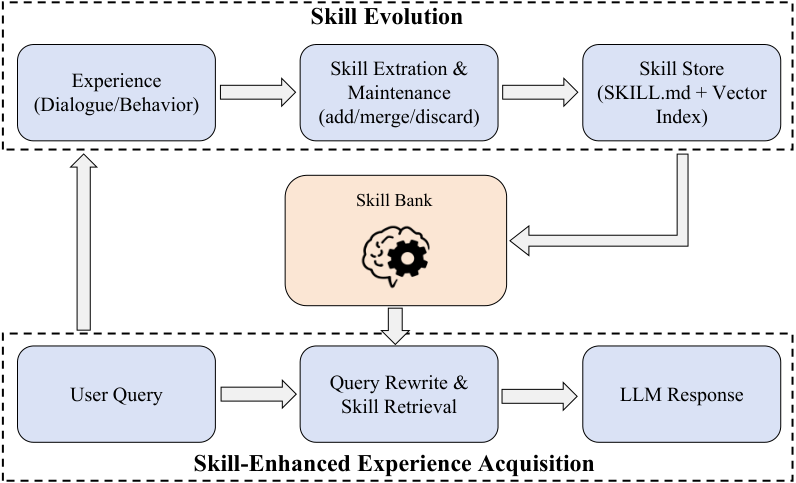

# AutoSkill：把聊天经验沉淀成可复用能力的终身学习框架

## 一、这篇论文到底在解决什么问题？

在真实的 LLM 应用里，用户会反复提出一些稳定偏好：比如“少幻觉”“按机构写作规范来”“别太术语化”“固定工作流输出”。  
问题在于，传统对话系统往往把这些偏好当成 **临时上下文** ，而不是 **可持续能力** 。结果就是：每开一个新会话，模型都要重新“教一遍”。

这篇论文提出的 AutoSkill，核心目标很直接：  
把反复出现的交互经验，从“对话记录”升级为“可管理、可检索、可版本迭代”的技能资产（`SKILL.md`），并在后续请求中自动注入使用，且 **不需要微调模型参数** 。

---

## 二、核心思想：从“记忆文本”到“行为技能”

很多 Memory/RAG 方法做的是“把过去内容找回来”，但 AutoSkill 更进一步：  
它关注的不是“你说过什么”，而是“你希望系统以后怎么做”。

论文里把技能抽象为结构化对象：

$$
s = (n, d, p, \tau, \gamma, \xi, v)
$$

其中：
- $n$：技能名（name）
- $d$：技能描述（description）
- $p$：可执行提示（prompt）
- $\tau$：触发词集合（triggers）
- $\gamma$：标签集合（tags）
- $\xi$：示例集合（examples）
- $v$：版本号（version）

这一步非常关键：一旦技能从“隐式 prompt 片段”变成“显式 artifact”，就可以做审查、编辑、合并、去重、版本管理和跨场景迁移。

---

## 三、方法总览：一个双循环系统

> 图解：上半环是 **技能进化（skill evolution）** ，把交互经验抽取并维护为技能；下半环是 **技能增强生成（skill-enhanced generation）** ，在当前请求中检索并注入技能。横向看，这是“服务当前任务”；纵向看，这是“积累未来能力”。

AutoSkill 由两个紧耦合循环组成：

1. **在线响应循环** ：重写查询 → 检索技能 → 注入上下文 → 生成回答
2. **后台进化循环** ：从用户查询抽取技能候选 → 与现有技能比对 → add / merge / discard → 版本更新

---

## 四、方法细节（重点）

### 4.1 问题定义与训练无关（Training-Free）设定

用户 $u$ 在时刻 $t$ 的历史为：

$$
\mathcal{X}_u = \{x_1, x_2, \dots, x_T\}, \quad x_t=(q_t,r_t)
$$

对应技能库为 $\mathcal{B}_u^t$。  
论文强调：整个过程 **不更新模型参数** ，只靠 Prompt 驱动模块 + 外部技能库实现持续改进。

---

### 4.2 查询重写 + 混合检索（Dense + BM25）

先把当前查询改写成更适合检索的形式 $\tilde{q}_t$，避免“这次/上面那个”之类指代造成召回失败。

然后对每个技能计算两类相关性：
- 语义相似度（dense）
- 词法匹配（BM25）

融合分数：

$$
\mathrm{Rel}(q_t,s)=\lambda \hat{d}(q_t,s)+(1-\lambda)\hat{b}(q_t,s)
$$

再做 Top-$K$ + 阈值 $\eta$ 过滤：

$$
\mathcal{H}_t=\{s \in \mathrm{TopK}(\mathcal{B}_u^t)\mid \mathrm{Rel}(q_t,s)\ge \eta\}
$$

最后把命中的技能渲染成上下文 $C_t$ 注入对话模型。  
这个设计比纯向量检索更稳：dense 负责语义泛化，BM25 兜住关键词精确匹配。

---

### 4.3 为什么“只用用户查询”抽取技能？

论文一个很有意思的决策是：技能抽取主要依据用户侧信号 $\{q_1,\dots,q_t\}$，不把模型回复作为抽取证据核心。  
原因是要捕获“稳定用户需求”，而不是把模型偶发输出误当成偏好。

候选技能表示为：

$$
z_t=(n,d,p,\tau,\gamma,\xi,c)
$$

其中，$c$ 是置信度。抽取器会过滤“一次性请求、泛化过强、不可迁移”的噪声。

---

### 4.4 维护决策：add / merge / discard

候选技能不会直接入库。系统先从技能库里找最相近邻居，再交给判断模块决定动作：

- `add`：新能力，新增技能
- `merge`：同一能力族，合并迭代
- `discard`：低价值或不可复用，丢弃

管理检索同样使用混合分数：

$$
\mathrm{Rel}_m(z_t,s)=\alpha \hat{d}(z_t,s)+(1-\alpha)\hat{b}(z_t,s)
$$

这是可扩展性的关键：不必每次把全库都交给 Judge，全程局部比对即可。

---

### 4.5 版本化合并（Versioned Merge）

如果动作是 `merge`，系统并非简单拼接文本，而是“保留技能身份 + 合并新增约束 + 去重去冲突 + 版本递增”。

技能库更新规则为：

$$
\mathcal{B}_u^{t+1}=
\begin{cases}
\mathcal{B}_u^t \cup \{z_t\}, & a_t=\texttt{add} \\
(\mathcal{B}_u^t\setminus \{s_t^\ast\})\cup \{s'_t\}, & a_t=\texttt{merge} \\
\mathcal{B}_u^t, & a_t=\texttt{discard}
\end{cases}
$$

这就避免了“同类 prompt 越积越乱”，把系统从“堆记忆”变成“长能力”。

---

## 五、系统实现：为什么它容易落地？

论文把 AutoSkill 设计成模型无关插件层，提供三种接入形态：
- Python SDK（`ingest/search/render_context`）
- Web UI
- OpenAI 兼容反向代理（`/v1/chat/completions` 等）

默认存储布局清晰：
- `SkillBank/Users/<user_id>/...`：用户私有技能
- `SkillBank/Common/...`：共享技能
- `SkillBank/vectors/...`：向量缓存与索引文件

这意味着它可以在不改现有业务调用方式的情况下，作为“前置增强层”接入生产链路。

---

## 六、实验与观察：SkillBank 真的在“成长”

论文在 WildChat-1M 上构建了四个子集（中/英 × GPT-3.5/4），仅保留 8 turn 以上多轮对话用于抽取。

核心统计（节选）：
- English GPT-3.5：10243 会话，267681 消息，631 技能
- Chinese GPT-4：1145 会话，36834 消息，224 技能

高频标签集中在 `python`、`javascript`、`excel`、`c++`、`pandas`，但 `creative writing`、`translation`、`roleplay` 也占比可观。  
这说明技能库既覆盖技术任务，也覆盖内容与交互风格任务。

更有说服力的是版本差异：
- `professional_text_rewrite` 达到 `0.1.34`（多轮迭代）
- 某些长尾技能仍在 `0.1.0`

这恰好验证了论文主张：技能不是静态快照，而是按复用频率发生不同速率进化。

---

## 七、案例解读：从“软偏好”到“硬流程”都能抽象

论文展示了两类典型技能：
1. 中文“顶级心理咨询师”：强调语气、同理心、边界与禁忌（软行为规范）
2. 英文 `professional_text_rewrite`：强调保义改写、禁止解释、固定输出（硬执行约束）

这两个案例说明，同一套技能结构既能承载“对话人格风格”，也能承载“可执行流程模板”。  
也说明了 AutoSkill 的跨语言一致性：同一机制能处理中英文用户习惯沉淀。

---

## 八、创新点与边界

相对已有工作的主要创新：
- 把长期学习单元从“记忆片段”升级为“显式技能 artifact”
- 建立完整生命周期：抽取、判定、合并、版本化、检索复用
- 全流程 Training-Free，部署成本低，治理可见性高

潜在挑战也很现实：
- 抽取质量仍依赖 LLM 对稳定性与可迁移性的判断
- 错误合并会导致技能污染，需要更强评估与回滚机制
- 多技能冲突时的优先级策略仍可继续系统化

---

## 九、总结

AutoSkill 的价值不在“再做一个 Memory 模块”，而在于提出了一个更工程化、可治理的能力沉淀范式：  
把一次次对话经验，变成可复用、可版本演进、可跨会话调用的技能资产。

如果你关心“个性化 Agent 如何真正越用越懂你”，这篇工作给出的路径非常实用：  
**不动模型参数，也能持续进化；不靠隐式记忆，也能形成显式能力。**

> 本文参考自 [AutoSkill: Experience-Driven Lifelong Learning via Skill Self-Evolution](https://arxiv.org/abs/2603.01145)