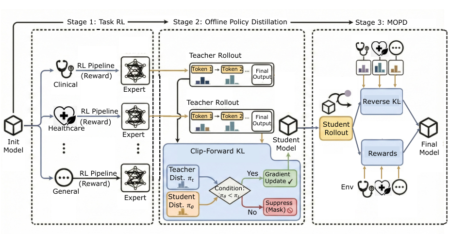
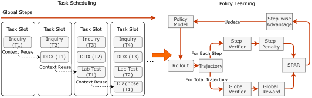
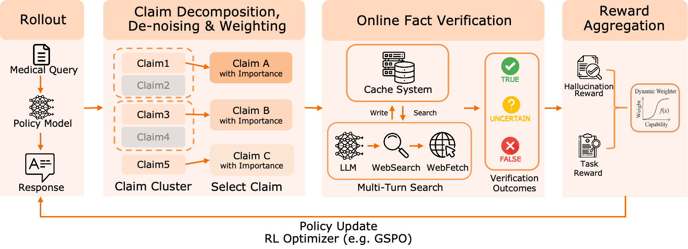
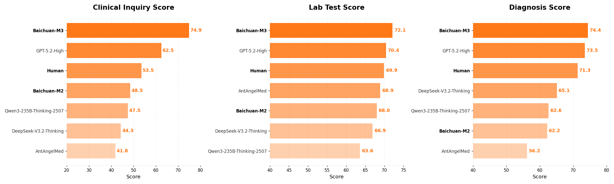
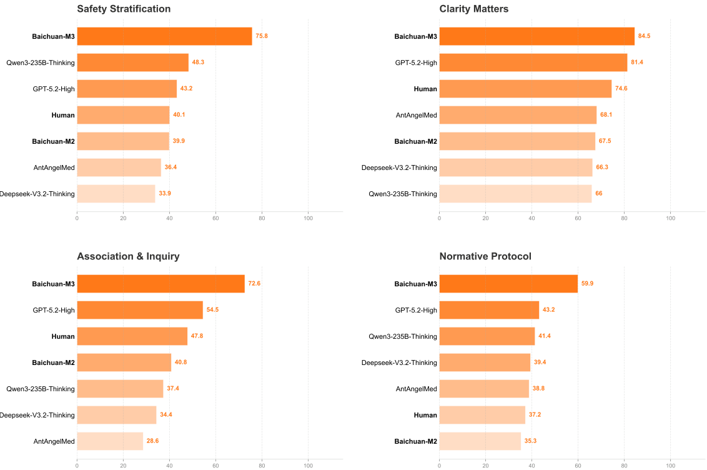
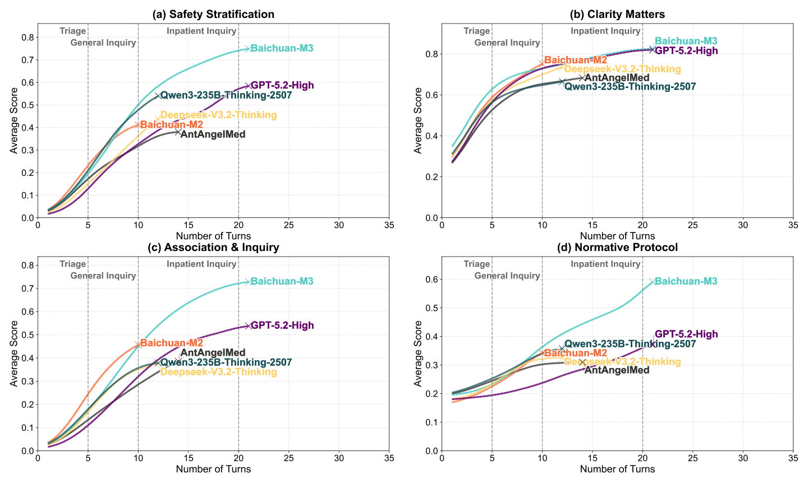
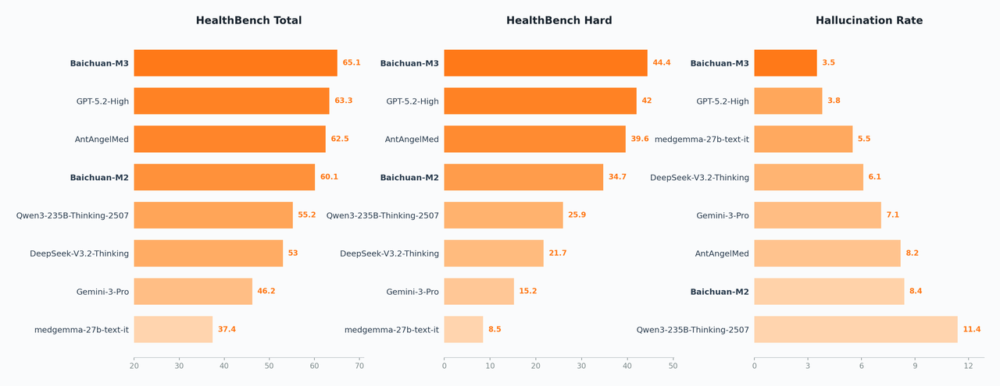
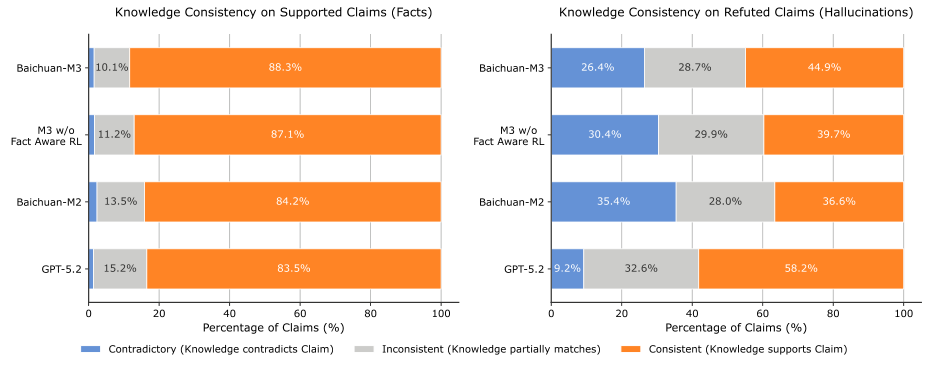
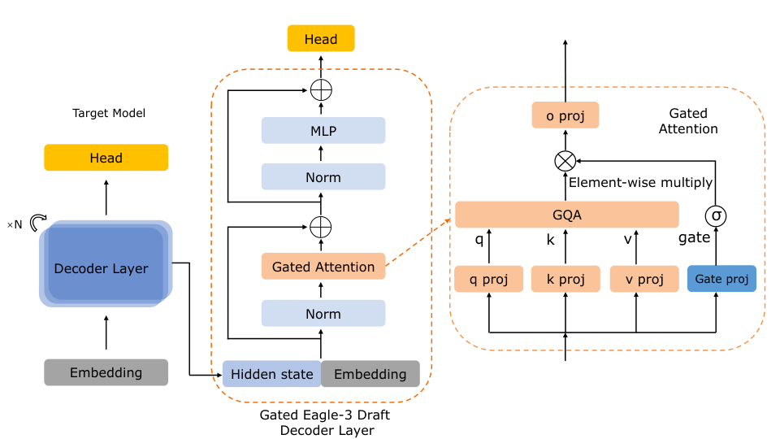

# Baichuan-M3：把临床问诊“做全”，把医疗决策“做稳”

## 一句话摘要
这篇论文的核心是：把“问诊获取信息”和“诊断推理”打通成一个完整闭环，用分阶段训练 + 事实校验强化学习，减少医疗 LLM 在开放式对话中的“凭空假设”和幻觉。

## 1. 这篇论文要解决什么问题
医疗场景不只是“答题”，而是一个完整流程：  
 **问诊 → 检查 → 诊断** 。  
现有模型通常只擅长其中一部分，要么问诊流畅但诊断浅，要么知识丰富却缺少“主动问关键问题”的能力。结果就是：缺信息、靠猜测、容易幻觉。

作者希望让模型具备三件事：  
-  **主动获取缺失信息**  
-  **构建可追踪的推理链**  
-  **抑制幻觉（尤其是“因假设而产生的幻觉”）**  

## 2. Baichuan-M3 的整体方案
论文给出的答案是一个“三阶段训练框架”，先把能力拆开，再融合：

1. **Task RL（任务级强化学习）**  
   每个关键能力单独训练出“专家教师”。

2. **Offline Policy Distillation（离线蒸馏）**  
   把多个专家的行为压缩到一个学生模型里，用改进的  **Clip-Forward-KL**  避免单样本过拟合。

3. **MOPD（多教师在线蒸馏）**  
   在线环境中用反向 KL 让学生模型“选择最优模式”，从模仿走向决策。

> 图解：三阶段训练框架如何把“多专家能力”融合成一个统一策略  

## 3. 临床问诊能力：从“对话”到“可追踪流程”
论文把问诊拆成 4 个阶段：  
`询问 → 鉴别诊断 → 检查选择 → 最终诊断`

关键是  **Segmented Pipeline RL** ：每一阶段都有独立奖励信号，避免只靠“最终诊断正确”来训练，减少“长链路奖励稀释”。

核心公式是分段奖励的目标函数：

$$
\mathcal{J}(\theta) = \frac{1}{|\mathcal{B}_t|} \sum_{x_{k}^{(i)} \in \mathcal{B}_t} \mathcal{L}_{\text{RL}} \left( y_{k}^{(i)}, \mathcal{G}_{k}^{(i)} \right)
$$

> 图解：左侧是分段式训练流程，右侧是具体的策略学习算法  

### SPAR：对“每一步”都能追责的强化学习
SPAR 的核心是“逐步惩罚”，而不是只看最终结果。

步级优势函数：

$$
\hat{A}_{j} = \frac{\gamma_{j} R_{\text{global}} - \mu_{\text{raw}}}{\sigma_{\text{raw}} + \epsilon}
$$

这样可以让模型知道  **哪个问法导致扣分** ，避免“好坏一起罚”。

## 4. 事实可信度：幻觉不是靠“压低输出长度”解决
论文指出：直接罚幻觉会引发两种副作用  
-  **冗余稀释** （输出一堆无用正确话稀释错误比例）  
-  **过度保守** （模型开始不敢说）  

解决方案是  **Fact-Aware RL** ，关键有两点：

1. **语义聚类 + 权重去噪**  
   让“核心事实错误”被更重处罚。

2. **动态门控系数**  
   只有当模型已具备足够能力时，才加强事实惩罚。

核心奖励公式：

$$
R = R_{task} + \lambda(R_{task}) \cdot R_{fact}
$$

> 图解：Fact-Aware RL 如何把“事实校验”嵌入强化学习目标  

## 5. 实验结果：全面跑赢 GPT-5.2
论文在两个核心基准上做了实验：

### 5.1 ScanBench（模拟真实问诊流程）
- Inquiry：  **74.9**  
- Lab Testing：  **72.1**  
- Diagnosis：  **74.4**  

相比 GPT-5.2-High 和人类医生基线都有明显领先。

> 图解：ScanBench 三站式流程总成绩对比  

> 图解：问诊能力细分对比（安全性、关联提问、规范性等）  

> 图解：随着对话轮次增长，模型能力的变化趋势  

### 5.2 HealthBench（医学推理 + 幻觉评估）
- HealthBench 总分：  **65.1**  
- HealthBench-Hard：  **44.4**  
- 幻觉率最低：  **3.5%**  

> 图解：HealthBench 主榜对比  

> 图解：M2 vs M3 的细粒度能力雷达  

### 5.3 幻觉抑制的真实效果
加入 Fact-Aware RL 后：  
- 保持能力几乎不降  
- Refuted/Uncertain 下降约 50%  

> 图解：幻觉抑制与能力的平衡  

> 图解：知识边界对齐分析  

## 6. 推理加速：Gated Eagle-3 与量化
论文还做了部署优化：

-  **Gated Eagle-3** ：提升 speculative decoding 速度  
-  **INT4 量化 + 专家覆盖校准** ：减少 MoE 模型失真  

> 图解：Gated Eagle-3 结构示意  

## 7. 关键贡献总结
-  **把问诊和诊断融合为一个训练闭环**  
-  **用分段 RL 解决长链路信用分配问题**  
-  **用 Fact-Aware RL 抑制幻觉而不牺牲能力**  
-  **在 ScanBench / HealthBench 上全面领先**  

## 8. 局限性
论文也承认目前仍局限于：  
- 纯文本问诊  
- 短期交互  
- 缺少多模态与长期病程管理能力  
未来方向是更长程、更真实的临床环境。

> 本文参考自 [Baichuan-M3: Modeling Clinical Inquiry for Reliable Medical Decision-Making](https://arxiv.org/abs/2602.06570)