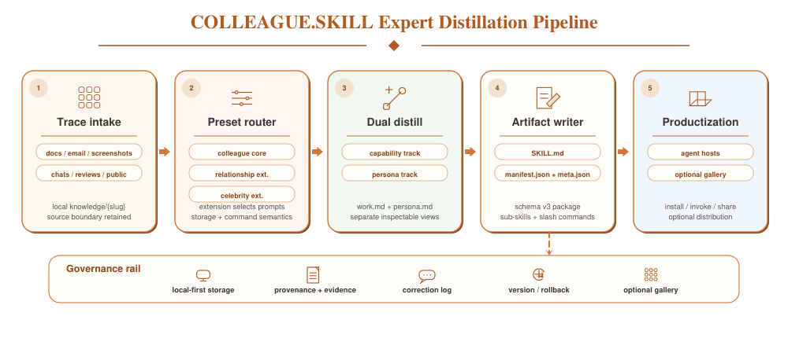
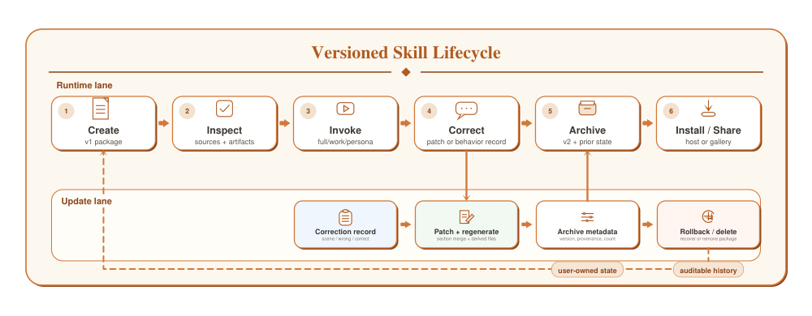
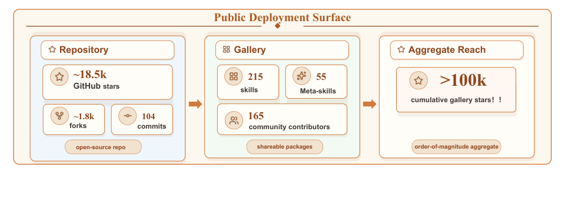

• # COLLEAGUE.SKILL：把同事"带走"的知识，变成 AI 能用的技能包

  > 当一位核心同事离职时，他多年积累的代码审查标准、事故处理直觉和沟通默契，往往也随之消失。上海人工智能实验室提出的 **COLLEAGUE.SKILL** 系统，正是要把这些散落在聊天记录、文档和邮件中的"隐性经验"，蒸馏成可检查、可修正、可跨平台安装的 AI 技能包。截至论文撰写时，这个开源项目已在 GitHub 获得约 **18.5k stars**，其公共 Gallery 汇聚了 **215** 个来自 **165** 位贡献者的技能，累计 star 数超过 **10万**。

  ---

  ## 从"执行指令"到"承载经验"：LLM Agent 的范式转变

  过去几年，LLM Agent 的发展轨迹非常清晰：从单轮问答（如早期 ChatGPT），到能调用工具的 ReAct、Toolformer，再到支持多 Agent 协作的 AutoGen，Agent 的能力边界一直在向外扩展。但一个更深层的需求正在浮现：用户希望 Agent 不仅能"做事"，还能"像某个人一样做事"——保留特定专家的判断力、沟通风格，甚至是拒绝不合理请求的方式。

  这个需求在职场场景中尤为尖锐。一位资深工程师的代码审查标准，可能分散在 GitHub Comments、飞书聊天记录、事故复盘文档和邮件里；一位产品经理的决策框架，可能埋藏在无数个 PRD 和会议纪要中。当这个人离开团队时，这些 **隐性知识（Tacit Knowledge）** 很难通过交接文档完整传递。

  现有的解决方案存在明显短板：
  - **记忆系统（Memory）** 只捕获片段化信息，缺乏结构化提炼；
  - **角色扮演（Role-play）** 容易滑向无边界的身份模拟，带来安全与伦理风险；
  - **Skill 框架** 提供了可移植的封装格式（如 Agent Skills 标准中的 `SKILL.md`），但缺少从原始痕迹到标准化技能包的 **端到端工作流**。

  COLLEAGUE.SKILL 的核心命题因此非常明确：**把异构的人类痕迹（traces）蒸馏成可检查的、有边界的、可版本管理的技能制品（artifact），而非制造一个不受限制的"数字分身"。**

  ---

  ## 问题定义：什么是"以人为中心的技能生成"？

  论文将这个问题严格定义为一个 **制品工程（Artifact Engineering）** 问题。给定一个轻量级的人物画像 $p$、数据源范围 $c$，以及一组源材料 $D = \{d_1, \ldots, d_n\}$，系统输出一个技能包：

  $$
  S = (A, M, L)
  $$

  其中：
  - $A$ 是生成的文件集合（如 Markdown 说明、元数据）；
  - $M$ 是机器可读的安装与配置信息；
  - $L$ 是生命周期状态，包括版本号、更新时间、修正次数和回滚历史。

  这里的关键在于对目标的 **刻意收窄**。COLLEAGUE.SKILL 不追求"复现一个真实的人在所有场景下的反应"，而是生成一个 **有边界的、可编辑的技术制品**，它只编码被选中实践和交互规范，并明确标注其能力边界和使用限制。

  一个合格的技能包必须满足五个操作性属性：

  1. **可移植（Portable）**：兼容 Agent Skills 标准的宿主（如 Claude Code、OpenClaw、Codex）能直接加载；
  2. **可检查（Inspectable）**：用户能在使用前阅读提取的规则、示例和限制；
  3. **可组合（Composable）**：能力轨和行为轨可以独立调用；
  4. **可修正（Correctable）**：新证据或用户反馈能更新包内容，同时保留历史版本；
  5. **可治理（Governable）**：元数据和来源边界支持删除、分享决策和安全审查。

  ---

  ## 系统架构：双轨蒸馏流水线

  

  > **图解**：COLLEAGUE.SKILL 的完整架构。共享的蒸馏核心负责将异构痕迹转化为标准化的技能制品；不同领域的预设（Preset）在此基础上叠加各自的来源要求、证据审查、同意假设和生命周期元数据。

  如图 1 所示，整个流水线从 **痕迹收集** 开始，经过解析、分析、构建，最终由 Writer 输出标准化的技能包。系统目前定义了三种预设场景：

  | 预设 | 数据源特征 | 核心关注点 |
  |------|-----------|-----------|
  | `colleague` | 设计文档、代码评审、聊天记录、事故笔记 | 工作实践、审查标准、决策启发式 |
  | `celebrity` | 公开访谈、演讲、长文、公开决策记录 | 第一人称证据、心智模型、来源边界 |
  | `relationship` | 私人交互记录 | 本地控制、删除权、同意与隐私 |

  这三种预设不是三个独立系统，而是同一套制品工作流在不同 **证据范围** 和 **治理假设** 下的配置变体。

  ### 双轨表示：能力与行为必须分离

  COLLEAGUE.SKILL 最值得关注的设计决策之一，是采用了 **双轨表示（Dual Representation）**：

  - **能力轨（Capability Track）**：对应 `work.md`，存储职责、工作流、技术标准、审查标准、决策启发式和过往经验总结。
  - **行为轨（Behavior Track）**：对应 `persona.md`，存储沟通风格、交互姿态、边界约束和修正记录。

  为什么要刻意拆分？因为许多 Persona 系统的失败，根源在于把 **事实知识**、**程序判断** 和 **表面语气** 混为一谈。将能力与行为分离后，用户可以选择只加载"能力轨"来复用专家的判断框架，而不必触发可能不恰当的"行为模拟"。

  最终生成的文件结构如下：

  | 文件 | 消费者 | 内容说明 |
  |------|--------|----------|
  | `SKILL.md` | Agent 运行时、用户 | 完整的可调用技能，包含 frontmatter、能力轨、行为轨和运行规则 |
  | `work.md` | 用户、更新器 | 可编辑的能力文档：流程、标准、启发式和任务模式 |
  | `persona.md` | 用户、更新器 | 可编辑的行为文档：风格、姿态、边界和修正日志 |
  | `work_skill.md` | Agent 运行时 | 仅能力轨的入口文件 |
  | `persona_skill.md` | Agent 运行时 | 仅行为轨的入口文件 |
  | `manifest.json` | 安装器、Gallery | 入口点、制品列表、兼容运行时和工具链元数据 |
  | `meta.json` | 生命周期工具 | Schema、来源、版本、修正次数和兼容字段 |

  这种设计与 Agent Skills 标准（以 `SKILL.md` 为必选入口，支持渐进式加载）以及 Claude Skills 的实现理念保持一致。

  ---

  ## 生成与演化：从"一次性构建"到"持续迭代"

  ### 创建工作流

  创建流程始于 **共享的以人为中心的蒸馏路径**。用户提供目标人物或角色的别名、可选画像字段，以及源材料。系统目前支持的收集器覆盖了飞书、钉钉、Slack、微信 SQLite 导出、邮件归档、PDF、截图、Markdown 和直接粘贴文本。

  不同预设会在生成阶段特化：
  - **同事预设** 强调工作实践和审查判断的提取；
  - **名人预设** 会增加一轮"研究 pass"，优先处理第一人称作品、长篇访谈和公开决策记录，并配备质量检查器；
  - **关系预设** 则调整提示词焦点和同意假设，但不改变制品契约本身。

  分析器从痕迹中提取两类证据：持久的工作方法/专家启发式（能力轨），以及表达和交互模式（行为轨）。构建器将其渲染为结构化 Markdown，Writer 最终打包成上述契约文件。

  ### 修正与版本管理：让技能包"越用越准"

  生成的制品不可能一次完美。COLLEAGUE.SKILL 的修正处理器支持自然语言反馈，例如 **"他不会这么说"** 或 **"她在这里会 push back"**。

  如果修正涉及专业工作内容，系统生成 Markdown Patch，匹配二级标题则替换对应章节，未匹配的则追加。如果修正涉及表达或交互行为，则生成标准化的修正记录：

  $$
  \{\texttt{scene}, \texttt{wrong}, \texttt{correct}\}
  $$

  Writer 会归档当前版本、应用补丁、递增生命周期版本号，并重新生成所有派生制品。版本管理器支持列出历史归档、备份当前制品、回滚到任意旧版本，以及清理过期归档。

  

  > **图解**：生成技能的生命周期闭环。用户的自然语言修正会触发版本更新，同时保留完整的回滚点，确保每一次修改都可追溯、可撤销。

  这种设计把"持续学习"从模型权重的黑盒，转移到了 **显式的文件版本管理** 上。你可以像审阅代码一样审阅技能的演化历史。

  ---

  ## 部署与社区生态：从本地工具到公共 Gallery

  COLLEAGUE.SKILL 不仅是研究原型，更是一个已经开源并运行的产品化系统。

  

  > **图解**：截至 2026-05-28 观察到的公开部署数据。这些数字反映的是系统的 **分发面积** （distribution surface），而非任务性能或行为保真度指标。

  截至论文统计时点：
  - 公共 Gallery 收录 **215** 个技能、**55** 个元技能（meta-skills）；
  - **165** 位贡献者参与共建；
  - 各技能卡片累计获得超过 **10万** GitHub stars。

  更重要的是其部署形态的变化：它从一个"单提示构建方法"演进为一套 **制品流水线**。生成的技能可以留在本地、安装到支持的 Agent 宿主中，或在用户拥有发布权的前提下提交到 Gallery 共享。这意味着知识不仅可以跨团队流动，还可以跨工具流动——你今天在 Claude Code 里安装的技能，明天可以无缝迁移到 OpenClaw 或 Codex。

  ---

  ## 深入讨论：为什么"制品思维"比"模拟思维"更重要

  ### 基于痕迹，而非身份替代

  COLLEAGUE.SKILL 的核心洞察在于：**一个人的部分知识、判断和交互风格可以被蒸馏成可检查的 AI 技能，而无需声称复现这个人本身。** 它的有用目标是一个 **有边界的、以人为中心的制品** ——这个人如何权衡证据、识别风险、解释 trade-off、拒绝不合理请求、根据上下文调整沟通方式，或遵循文档化的交互规则。

  在职场场景中，这可能是审查清单和事故启发式；在名人场景中，这是带有引证的心智模型和推理模式；在关系场景中，这是在本地控制下的私人交互约束。表面风格可以让技能更易用，但主要贡献是将选中的人类痕迹转化为可被检查、修正、版本化、安装和限制的文件。

  ### 工作流即研究对象

  单条 Prompt 可以模仿表面行为，但它很少能让提取的以人为中心的知识可被问责。COLLEAGUE.SKILL 将痕迹到技能的蒸馏视为一套 **文件级别的工作流**：创建、检查、调用、修正、回滚、删除、宿主安装和可选分发。这些操作不是辅助工程细节，而是让生成的技能能够被审计、修复、保留或共享的前提条件。

  这也使得研究对象更加清晰：
  - 提取质量可以在 `work.md` 和 `persona.md` 的文件级别被检查；
  - 安装和共享可以通过 manifest 而非临时指令完成；
  - 治理可以作用于显式元数据，而非隐藏提示状态。

  同事、名人、关系和 Gallery 四个场景，因此应被理解为同一套"以人为中心的技能"论题的不同实例：
  - **同事技能** 测试实用专家知识转移；
  - **名人技能** 测试公开心智模型证据能否在标注来源边界的前提下被封装，而非沦为通用模仿；
  - **关系技能** 测试同一套制品控制能否保护敏感的私人痕迹；
  - **Gallery** 测试生成技能能否成为受治理的分发层，而非私有的提示集合。

  ### 产品化作为一种研究约束

  论文坦诚地指出，COLLEAGUE.SKILL 目前的主张是 **制品级别** 的：它定义了包格式、实现了生成和更新工作流、暴露了修正和回滚状态、支持多宿主安装，并证明同一机制可覆盖同事、名人、关系和 Gallery 分发场景。它 **并不声称** 生成的技能能忠实复现一个人，或提升下游工作表现。

  这些更深层的问题需要未来的任务导向和人类主观研究来回答：同事技能能否像源专家一样抓住同样的审查问题？纯能力变体能否在保留实用性的同时消除人格模拟风险？关系技能是否会助长情感依赖？修正操作能否改善行为而不引入回归？名人扩展是会引证证据，还是捏造动机？

  一个关键的评估方向是：在相同源证据下，比较 **完整技能**、**仅能力技能** 和 **仅行为技能** 的表现，因为每种变体都暴露了不同的风险-效用权衡。

  ---

  ## 局限与负责任部署

  COLLEAGUE.SKILL 将技能视为可编辑的制品，而非忠实的模拟、身份替代品或同意代理。论文记录了制品格式、工作流、实现和公开部署面，但将源匹配质量、任务性能、情感安全和用户信任校准留作开放问题。

  实际部署将取决于源质量、提取质量、模型行为和人工审查。修正可以随时间改进制品，但也可能编码编辑者的偏见，或让有争议的痕迹显得比实际更"确定"。

  负责任的部署因此需要明确的参与机制、限定范围的数据收集、访问控制、留存限制和非强制性使用。Gallery 发布应保持 **opt-in（自愿加入）**，并配备提交者声明、审查、下架机制、来源边界标签，以及对名人/关系扩展的显著免责声明。

  ---

  ## 总结

  COLLEAGUE.SKILL 的核心贡献不是让 Agent 去"复刻"一个人，而是证明：**选中的人类痕迹可以被蒸馏成可移植、可检查的技能包，这些包编码了能力、心智模型、行为约束和修正历史。** 同事场景是最具体的起点，而名人、关系和 Gallery 组件展示了同一套制品模型如何扩展到更广泛的以人为中心的蒸馏场景。

  它的实践启示在于：数字蒸馏应该产生用户能够 **阅读、修订、安装、保留和删除** 的制品，而非仅仅听起来像目标人物的不透明提示。这种"制品化"的路径让研究野心保持脚踏实地——系统没有解决行为保真度问题，但它让以人为中心的蒸馏变得足够可见，从而可以被治理、改进和评估。

  更进一步，COLLEAGUE.SKILL 指向了一条 **产品导向的数字分身研究路径**：有边界的包，附带明确的证据、权利、修正语义和分发选择。这也澄清了未来 Benchmark 应该测试什么：不是无边界的模仿能力，而是一个有边界的包能否在保留有用判断的同时，让来源、同意和失败模式对用户可见。

  > 本文参考自 [COLLEAGUE.SKILL: Automated AI Skill Generation via Expert Knowledge Distillation](https://arxiv.org/abs/2605.31264)