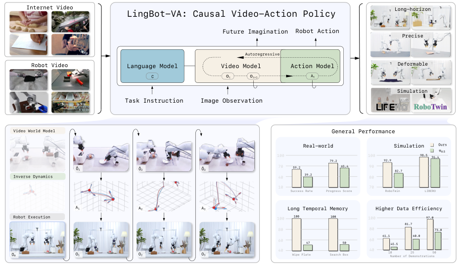
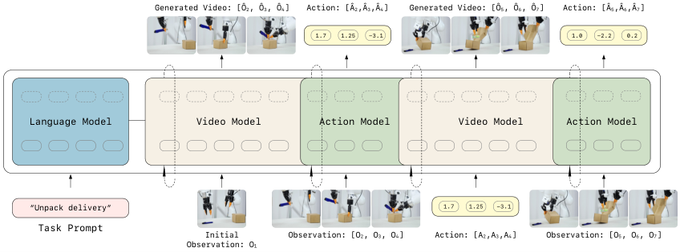
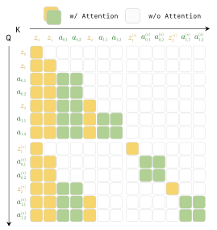
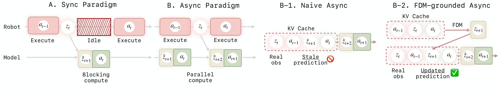
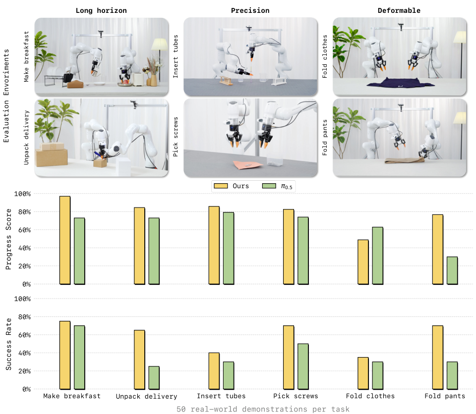
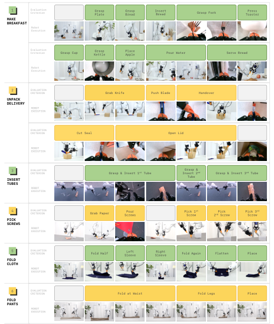
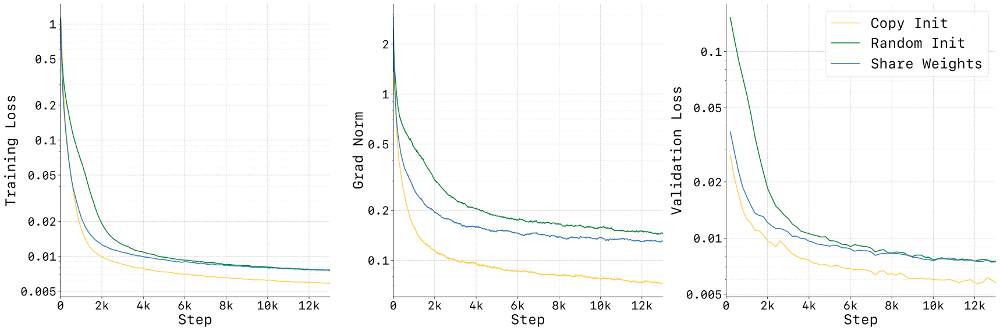
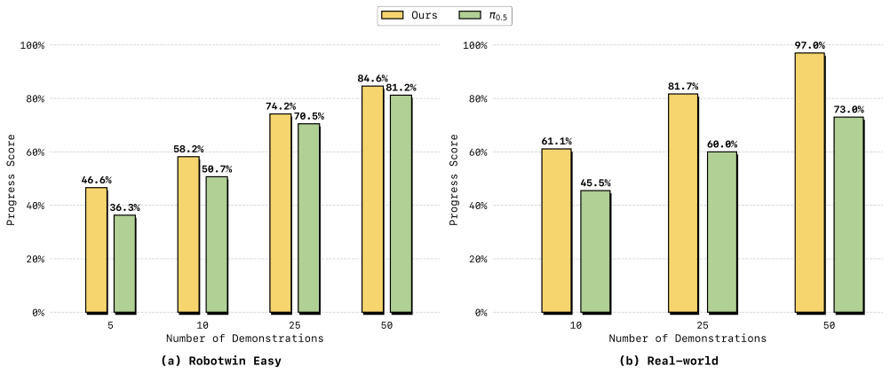
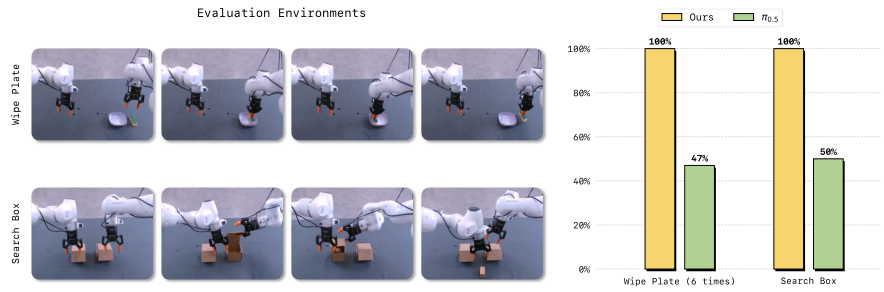
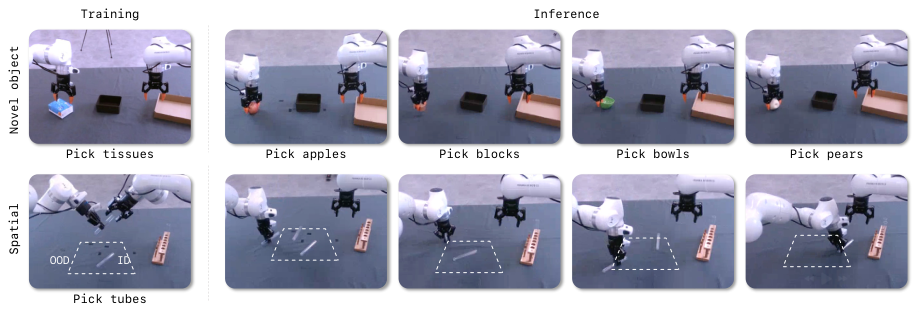

# LingBot-VA：用"因果世界模型"重新定义机器人控制——先想象未来，再决定动作

今天解读的这篇论文来自蚂蚁集团旗下 Robbyant 团队（由 Mingyu 等人主导），提出了 **LingBot-VA** ——一个把"视频预测"和"动作推理"统一进同一个自回归框架的机器人操作模型。它的核心思想很直觉：**让机器人像人一样，先在脑子里"想象"接下来会发生什么，再决定该做什么动作**。

结果相当亮眼：RoboTwin 2.0 仿真基准 92.0%，LIBERO 基准 98.5%，真机上仅凭 50 条示教数据就在多个高难度任务上超过 $\pi_{0.5}$ 20% 以上，并且代码、模型全部开源。

> 图解：LingBot-VA 的整体定位。(1) 预训练阶段：在海量真实视频与机器人动作数据上预训练，获得跨场景、跨物体的泛化能力；(2) 全面评测：覆盖长程任务、可变形物体、精密操作等真机任务与仿真基准，显著超越 $\pi_{0.5}$ 等 SOTA 方法；(3) 多功能性：除了策略学习，模型还支持视觉动力学预测与逆动力学推理；(4) 涌现特性：具备长程时序记忆与强大的少样本适应能力。

## 一、要解决什么问题：VLA 的"表征纠缠"困境

近年来 Vision-Language-Action（VLA）模型（如 $\pi_0$、GR00T-N1）在机器人操作上大放异彩，但作者指出了一个被忽视的结构性问题—— **表征纠缠（Representation Entanglement）**。

绝大多数 VLA 采用前馈式反应式策略，直接从当前观测映射到动作：

$$
a_t \sim \pi_\theta(\cdot \mid o_t)
$$

这意味着一个神经网络要同时学会三件事：视觉场景理解、物理动力学、运动控制，而监督信号却只有"观测-动作"配对这一条。模型被迫把从高维视觉语义到低维电机指令的异构知识压缩进同一个表征空间，结果是：

- **样本效率低**：学新任务需要大量示教；
- **泛化差**：模型靠模式匹配而非对物理规律的理解；
- **缺乏显式动力学建模**：模型不知道环境"会如何演化"。

那引入世界模型（World Model）行不行？已有尝试大致分三类：交互式神经模拟器（UniSim）、chunk-based 视频-动作扩散模型（UVA、UWM）、离线视频生成子目标（Gen2Act）。但它们对闭环控制有三个硬伤：

1. **反应缺口（Reactivity Gap）**：开环/分块生成一次滚出一大段轨迹，中途不接收实时反馈，遇到扰动无法纠错；
2. **长期记忆缺失**：每个 chunk 独立生成，看不到完整历史，长程任务中会出现时序不一致和漂移；
3. **违反因果性**：块内双向注意力让"未来 token 影响过去预测"，这与物理世界的因果本质相悖——现实里现在的状态只由过去决定。

这三点正是 LingBot-VA 要正面解决的问题。

## 二、核心思路：把"看视频"和"做动作"解耦成两步

LingBot-VA 不再学习 $\pi(a_t \mid o_t)$ 这种直接映射，而是把策略拆成两个可解释的阶段：

$$
\begin{aligned}
&\text{Stage 1（视觉动力学预测）:} \quad o_{t+1} \sim p_\theta(\cdot \mid o_{\le t}) \\
&\text{Stage 2（逆动力学）:} \quad a_t \sim g_\psi(\cdot \mid o_t, o_{t+1})
\end{aligned}
$$

- **Stage 1** 预测"画面下一步会变成什么样"——这部分可以利用海量视频数据学习物理先验；
- **Stage 2** 通过逆动力学模型（Inverse Dynamics Model, IDM），根据"想要的画面变化"反推出可执行的动作——这部分只需要少量机器人示教数据来落地。

这个分解的妙处在于：视觉预测和动作推理 **概念上分离**，可以各自吃各自最适合的数据；同时作者又通过一个精巧的架构设计把它们 **在结构上统一** 起来。下图是整体框架：

> 图解：LingBot-VA 框架总览。模型采用双流 Mixture-of-Transformers（MoT）架构，把视频 token 和动作 token 交错排进同一条序列。每个自回归步中：视频流（由 Wan2.2-5B 初始化）先通过 Flow Matching 预测未来的潜在视觉状态；随后动作流基于预测出的视觉变化，通过逆动力学解码出对应动作。整个过程严格因果，支持 KV cache 与实时观测接入。

## 三、预备知识：Flow Matching 一分钟速览

模型的生成引擎是 Flow Matching（流匹配），一种连续时间生成建模框架。给定数据样本 $x_1$ 和高斯噪声 $\epsilon \sim \mathcal{N}(0, I)$，它在两者间定义一条插值路径 $x^{(s)} = (1-s)\epsilon + s x_1$，并学习一个速度场 $v_s$ 来描述样本从噪声流向数据的瞬时速度：

$$
\frac{dx^{(s)}}{ds} = v_s(x^{(s)}), \quad x^{(0)} = \epsilon \sim \mathcal{N}(0, I)
$$

训练目标就是让模型预测的速度场逼近真实速度 $\dot{x}^{(s)} = x_1 - \epsilon$：

$$
\mathcal{L}_{\text{FM}} = \mathbb{E}_{s, \epsilon, x_1} \left[ \| v_\theta(x^{(s)}, s) - \dot{x}^{(s)} \|^2 \right]
$$

推理时从 $s=0$ 积分到 $s=1$ 即可得到样本：

$$
x_1 = \epsilon + \int_0^1 v_\theta(x^{(s)}, s) \, ds
$$

Sora、Wan 等视频生成模型都在用这个框架，区别只是它们在预训练视频自编码器的潜在空间（latent space）里工作。LingBot-VA 站在 Wan2.2-5B 的肩膀上，把这套生成能力改造成了机器人的"想象力"。

## 四、方法详解：自回归视频-动作世界模型

### 4.1 为什么必须是"自回归"的

物理世界天然是因果且自回归的：现在的状态只依赖过去，没人能在未来发生之前看到它。相比 chunk-based 扩散方法，自回归建模带来三个关键优势：

- **持久记忆（Persistent Memory）**：通过因果注意力 + KV cache 显式地以完整历史为条件，避免 chunk 方法的"失忆症"；
- **因果一致性（Causal Consistency）**：单向依赖结构天然契合闭环执行，新观测到达时可以无缝接入；
- **效率（Efficiency）**：chunk 内并行生成、chunk 间自回归，兼顾计算效率与闭环纠错能力。

形式化地说，每一步世界模型用条件流匹配预测接下来 $K$ 帧视频：

$$
o_{t+1:t+K} \sim p_\theta(\cdot \mid o_{\leq t})
$$

chunk 内部 token 用双向注意力并行生成，chunk 之间保持因果结构——这就是"chunk 级自回归"的平衡设计。

### 4.2 状态编码：把视频和动作装进同一种 token

直接在像素级视频上算太贵。作者用 Wan2.2 的因果视频 VAE 把观测压缩为紧凑的潜在 token：

$$
z_t = E(o_t \mid o_{<t}) \in \mathbb{R}^{N \times C}
$$

其中 $N$ 是空间 token 数，$C$ 是通道数。因果 VAE 在编码时以历史 latent 为条件，保证时序连贯，天然对齐自回归框架。动作向量则通过一个轻量 MLP $\phi(\cdot)$ 投影成与视频 token 同维度的嵌入，从而可以把两种模态交错排进一条序列。

### 4.3 以动作历史为条件的视觉预测

标准视频生成只看画面历史，但机器人操作还必须考虑 **本体（embodiment）的物理状态**。由于动作通常编码绝对位姿（如末端执行器在世界坐标系中的位姿），动作历史 $a_{<t}$ 实际上刻画了机器人构型的完整轨迹。因此自回归公式扩展为：

$$
z_{t+1:t+K} \sim p_\theta(\cdot \mid z_{\leq t}, a_{<t})
$$

这样世界模型的预测就"接地"在机器人的物理交互之上——预测出的画面反映的是"这个机器人动过之后"的场景演化。

### 4.4 逆动力学：从"想要的画面"反推动作

预测出未来视觉状态后，动作不是从当前观测直接回归的，而是由逆动力学模型推断——让策略回答"**什么动作能带来想要的视觉结果**"。

但只看 $(z_t, z_{t+1})$ 两个状态还不够：动作历史决定了哪些动作在物理上可行，观测历史则提供多步交互的上下文（比如"这个物体之前是不是已经被抓起来了"）。所以完整的逆动力学公式是：

$$
a_{t:t+K-1} \sim g_\psi(\cdot \mid \hat{z}_{t+1:t+K}, z_{\leq t}, a_{<t})
$$

其中 $\hat{z}_{t+1:t+K}$ 是上一步世界模型预测的视觉状态块。

## 五、LingBot-VA 架构与训练：三个"小心思"很关键

### 5.1 双流 MoT 架构：不对称设计

模型由两个并行的 Transformer 骨干组成：

- **视频流**：从 Wan2.2-5B 初始化，隐藏维度 $d_v$ 很大；
- **动作流**：层数相同但宽度小得多（$d_a \ll d_v$）。

为什么不对称？因为 **动作分布本质上比视觉数据简单**，不需要那么多参数；而视觉动力学需要大容量来保持表达能力。每层中两流各自计算 QKV，保持模态专属的特征空间；跨模态融合时，动作 token 先被线性投影到视频维度参与联合自注意力，再通过残差连接投影回原维度。这样既让两种模态互相影响，又防止特征表征互相污染。

### 5.2 视频稀疏化与高频动作

机器人场景画面变化慢，但动作频率高。作者对视频做 $\tau = 4$ 倍的时间下采样，然后给每帧视频配上 $\tau$ 个连续动作，形成交错序列：

$$
[z_t,\ a_{t,1},\ a_{t,2},\ \ldots,\ a_{t,\tau},\ z_{t+1},\ \ldots]
$$

预测 $K$ 帧视频就意味着生成 $\tau K$ 个动作，实现了"低频生成视频、高频输出控制"。

### 5.3 动作网络初始化：一个被低估的坑

实验证明，动作网络如果随机初始化，训练极不稳定——因为动作 token 的输出分布一开始与视频分布差异巨大，会扰乱联合注意力机制。解决办法是：按动作维度对预训练视频权重做 **插值初始化**，再乘上缩放因子保持输出方差：

$$
\alpha = \sqrt{d_v / d_a}
$$

这个小技巧让动作 token 从第一步起就有与视频 token 可比的输出分布，训练曲线显著平滑（后文消融有图有真相）。

### 5.4 Teacher Forcing：像训练语言模型一样训练世界模型

由于视觉预测和逆动力学都被写成了"以历史为条件"的自回归形式，整条交错的视频-动作序列可以用标准的 **下一个 token 预测** 来训练——和训练 GPT 一模一样。训练时用真实数据作为上下文（teacher forcing），因果性通过注意力掩码强制：

> 图解：统一预训练的因果注意力掩码。每个 token 只能"看到"时序上排在自己前面的 token——视频 token 看得到历史画面和历史动作，动作 token 看得到历史画面、历史动作和它对应的预测画面，但谁都看不到未来。

值得一提的是，teacher forcing 在纯生成任务里会导致训练-测试分布不匹配，但在机器人场景反而是完美匹配的—— **因为机器人部署时本来就会不断拿到真实观测**。

### 5.5 Noisy History Augmentation：推理加速的秘密武器

推理时最贵的部分是视频 token 生成——token 多、还要走多步去噪。作者的洞察是：**动作预测根本不需要完全去噪后的高清画面**，逆动力学模型可以从"半成品"的带噪 latent 里提取动作相关信息。

训练时以 50% 概率给历史视频加噪：

$$
\tilde{z}_{\leq t} = \begin{cases}
(1 - s_{\text{aug}}) \epsilon + s_{\text{aug}} z_{\leq t}, & \text{概率 } 0.5,\quad s_{\text{aug}} \in [0.5, 1] \\
z_{\leq t}, & \text{概率 } 0.5
\end{cases}
$$

推理时视频只需从 $s=0$ 去噪到 $s=0.5$ 就能拿去解码动作，**去噪步数直接减半**。

### 5.6 训练目标

动力学损失（监督视频预测，条件是可能带噪的历史与语言指令 $c$）：

$$
\mathcal{L}_{\mathrm{dyn}} = \mathbb{E}_{t, s, z_{t+1}, \epsilon} \left[ \| v_\theta(z_{t+1}^{(s)}, s, \tilde{z}_{\leq t}, a_{<t} \mid c) - \dot{z}_{t+1}^{(s)} \|^2 \right]
$$

逆动力学损失（监督动作，条件是当前与下一步观测）：

$$
\mathcal{L}_{\mathrm{inv}} = \mathbb{E}_{t, s, a_t, \epsilon} \left[ \| v_\psi(a_t^{(s)}, s, \tilde{z}_{\leq t+1}, a_{<t} \mid c) - \dot{a}_t^{(s)} \|^2 \right]
$$

总目标为 $\mathcal{L} = \mathcal{L}_{\mathrm{dyn}} + \lambda \mathcal{L}_{\mathrm{inv}}$。此外还采用 **可变 chunk size 训练**（$K \in [1, 8]$），推理时可自由权衡计算效率与规划视野，部署时取 $K=4$。

## 六、实时部署：异步推理 + FDM 接地

### 6.1 KV Cache 加速

自回归形式天然支持 KV cache：历史 token 的 key-value 缓存复用，每步只有新 token（当前观测与预测动作）需要完整注意力计算。

### 6.2 异步流水线与"开环退化"陷阱

即使有 KV cache 和部分去噪，视频生成的延迟仍然不可忽视。解决方案是 **异步推理**：机器人执行当前动作块 $a_t$ 的同时，模型并行预测下一块 $a_{t+1}$。

但天真的异步实现有个隐蔽的坑（下图 B-1）：预测基于的是 **过期的视觉预测** $\hat{z}_t$ 而非真实观测。由于视频生成模型天然偏好时序平滑性，它会倾向于"继续编"自己幻想出来的视频，忽略真实观测 $z_{t-1}$ 提供的物理反馈——久而久之模型失去对环境的反应能力，轨迹漂移、开环退化。

作者的解法是引入一个 **FDM（Forward Dynamics Model）接地步骤**（下图 B-2）：在预测 $z_{t+1}$ 之前，先用最新的真实反馈 $z_{t-1}$ 和正在执行的动作 $a_t$ 做一次前向动力学推演，"想象"出 $a_t$ 执行后的视觉状态 $z_t$，并用这个 **以真实反馈为锚** 的预测替换掉过期幻想。这迫使模型在每一步预测前都重新对齐环境反馈，让异步系统真正成为鲁棒的闭环系统。后训练阶段还额外加入 FDM 损失：

$$
\mathcal{L}_{\mathrm{fdm}} = \mathbb{E}_{t, s, \hat{z}_{t+1}, \epsilon} \left[ \| v_\psi(\tilde{z}_{t+1}, s, z_t, a_t, \tilde{z}_{<t}, \hat{a}_{<t} \mid c) - \dot{z}_{t+1}^{(s)} \|^2 \right]
$$

> 图解：同步 vs 异步推理对比。(A) 传统同步流水线：计算阻塞执行，产生延迟；(B) 异步流水线：计算与执行并行。(B-1) 天真异步：依赖过期的视觉预测，容易漂移；(B-2) 本文方案：加入 FDM 前向动力学接地步骤，用最新真实观测刷新预测，保持闭环鲁棒性。

## 七、实验：数据、基准与真机全开花

### 7.1 训练数据与配置

- **数据规模**：聚合 Agibot、RoboMind、InternData-A1、OXE（OpenVLA 子集）、UMI、RoboCOIN 六大来源，加上内部采集数据，总计约 **16,000 小时** 机器人操作数据；
- **统一动作空间**：双臂各含 EEF 位姿（XYZ + 四元数共 7 维）+ 关节角（最多 7 维，不足补零）+ 夹爪 1 维，合计 $(7+7+1)\times 2 = 30$ 维；
- **模型规模**：视频流 Wan2.2-5B（$d_v = 3072$，30 层），动作流 $d_a = 768$（约 350M 参数），总参数 5.3B；
- **预训练**：1.4T token，AdamW，峰值学习率 $1\times10^{-4}$，bfloat16；
- **后训练**：新任务仅需 **50 条示教**，学习率 $1\times10^{-5}$ 训 3K 步即可。

### 7.2 仿真基准：RoboTwin 2.0

RoboTwin 2.0 是高难度双臂操作基准（50 个任务），Easy 为固定初始位姿，Hard 为随机化物体位姿与场景布局。所有模型在 2,500 条干净场景 + 25,000 条随机场景示教上多任务训练：

| 方法 | Easy（均值） | Hard（均值） |
| --- | --- | --- |
| $\pi_0$ | 65.9 | 58.4 |
| $\pi_{0.5}$ | 82.7 | 76.8 |
| X-VLA | 72.9 | 72.8 |
| Motus | 88.7 | 87.0 |
| **LingBot-VA** | **92.9** | **91.6** |

更有说服力的趋势是：**任务越长程，优势越大**。在 Horizon = 3 的任务上，LingBot-VA 相比第二名分别领先 +8.2%（Easy）和 +9.1%（Hard）——自回归机制的长程记忆能力在长任务上兑现了。

### 7.3 仿真基准：LIBERO

在 LIBERO 的四个套件（Spatial / Object / Goal / Long）上，每个套件用 3 个随机种子 × 500 次试验评测：

| 方法 | Spatial | Object | Goal | Long | 平均 |
| --- | --- | --- | --- | --- | --- |
| OpenVLA | 84.7 | 88.4 | 79.2 | 53.7 | 76.5 |
| $\pi_0$ | 96.8 | 98.8 | 95.8 | 85.2 | 94.1 |
| OpenVLA-OFT | 97.6 | 98.4 | 97.9 | 94.5 | 97.1 |
| X-VLA | 98.2 | 98.6 | 97.8 | 97.6 | 98.1 |
| **LingBot-VA** | **98.5** | **99.6** | 97.2 | **98.5** | **98.5** |

平均 98.5%，创下基础 VLA 模型的新 SOTA；尤其 LIBERO-Long（长程套件）达到 98.5%，再次印证长程记忆优势。

### 7.4 真机部署：六任务全面超越 $\pi_{0.5}$

真机评测覆盖三大类六个任务，**每类只用 50 条真机示教微调**：长程任务（Make Breakfast 做早餐、Unpack Delivery 拆快递）、精密任务（Insert Tubes 插管、Pick Screws 拧螺丝）、可变形物体（Fold Clothes 叠衣服、Fold Pants 叠裤子）。每个任务各跑 20 次试验，与 $\pi_{0.5}$ 交替评测保证公平。

> 图解：六个真机任务的成功率（SR）与进度得分（PS）对比。LingBot-VA 在全部六个任务、两项指标上均达到 SOTA，大幅领先 $\pi_{0.5}$。典型差距：Unpack Delivery 成功率 65% vs 25%；Fold Pants 成功率 70% vs 30%；Insert Tubes 成功率 40% vs 30%——在最难的任务上提升超过 20 个百分点。

> 图解：六个真机任务的详细执行过程与关键步骤。以 Make Breakfast（10 步）为例：抓盘子→抓面包→抓叉子→放面包→按烤面包机→抓杯子→抓水壶→倒水→抓苹果→装盘上菜。LingBot-VA 平均进度得分 9.70/10（PS 97.0%），而 $\pi_{0.5}$ 仅 7.30/10（PS 73.0%），后者常在"按烤面包机""倒水"等中后段步骤失败——长程任务中后期的上下文保持正是世界模型的主场。

三点观察值得记住：

1. **长程任务优势** 验证了视频-动作联合建模带来的时序记忆能力；
2. **精密任务优势** 说明统一潜在空间让视觉感知与运动控制耦合更紧；
3. **可变形物体上的稳健表现** 说明生成的视频未来为动作模型提供了关于物体动态的隐式引导。

### 7.5 消融实验

| 消融项 | 设置 | Easy 总平均 | H=1 | H=2 | H=3 |
| --- | --- | --- | --- | --- | --- |
| 基线 | LingBot-VA（完整） | 92.9 | 94.2 | 90.4 | 93.2 |
| 部署方式 | FDM 接地异步 | 90.4 | 92.5 | 87.7 | 85.6 |
| 部署方式 | 天真异步 | 74.3 | 83.3 | 70.3 | 32.9 |
| 预训练 | 仅用 WAN 初始化 | 80.6 | 84.9 | 76.3 | 67.6 |

两个关键结论：

- **FDM 接地是异步方案的命门**：天真异步在 Horizon = 3 任务上暴跌到 32.9%，而 FDM 接地只比同步基线低 2.5 个百分点，却换来 **2 倍** 的任务完成速度；
- **联合视频-动作预训练不可替代**：同样微调流程下，直接从 Wan2.2-5B 出发只有 80.6%，比完整预训练模型低了 12 个百分点——预训练注入的视觉-运动先验是快速适应复杂双臂任务的关键。

> 图解：不同动作网络初始化策略的训练动态对比（横轴为训练步数，纵轴为损失/梯度范数）。随机初始化（红线）梯度范数剧烈波动、收敛缓慢；直接复用视频权重（无缩放）虽然稳定但性能次优；本文的"插值 + $\alpha = \sqrt{d_v/d_a}$ 缩放"初始化收敛最快、损失最低。

### 7.6 样本效率：10 条示教也够用

> 图解：Make Breakfast（真机）与 RoboTwin 2.0 Easy（仿真）上不同示教数量下的进度得分对比，横轴为示教条数（10/20/30/50），纵轴为进度得分。在 10 条示教的极低数据 regime 下，LingBot-VA 比 $\pi_{0.5}$ 分别高出 15.6%（真机）和 10.3%（仿真）。

为什么数据效率这么高？因为联合预训练的视频骨干自带关于物理动态与物体交互的丰富视觉先验，后训练时相当于一种隐式正则化；而 $\pi_{0.5}$ 这类反应式 VLA 没有显式的动力学建模，只能从零学任务特定行为。

### 7.7 时序记忆：KV Cache 的"涌现"红利

作者设计了两个专门考记忆的任务：

- **Wipe Plate**：必须恰好擦盘子 6 次——需要"计数并记住"已重复的动作；
- **Search Box**：左右两个盒子只有一个藏有积木，机器人从右往左依次开盒。测试时积木总在左边——没有记忆的模型开完右盒发现是空的后，有 50% 概率回头重开右盒；有记忆的模型会直接去开左盒。

> 图解：左图为两个记忆任务的成功率对比，LingBot-VA 显著超越 $\pi_{0.5}$；右图为评测环境可视化。这一优势直接来自自回归结构：训练时 teacher forcing 以完整历史为条件，推理时 KV cache 天然保留全部历史信息。

### 7.8 泛化能力

从两个维度考察泛化：**新物体泛化**（训练用单一物体做抓取放置，测试换不同形状/纹理的物体）与 **空间泛化**（训练时物体位置固定在局部区域，测试时随机摆放至分布外 OOD 区域）。

> 图解：新物体与空间泛化评测。LingBot-VA 对不同形状、纹理的未见物体以及 OOD 位置均能成功操作。原因在于世界模型通过视频预测学到的是 **物体无关的物理先验**，天然可迁移到新场景。

### 7.9 真机评测协议（附录细节）

为保证可复现性，附录给出了严格的评分协议：每步执行一次成功记 1 分，重试后成功记 0.5 分，失败记 0 分；只有所有步骤满分才算整次试验成功。进度得分（PS）为平均进度除以最大步数，成功率（SR）为完全成功次数占比。六个任务的逐次试验数据完整公开，例如 Pick Screws 任务中 LingBot-VA 的 PS 为 82.5%、SR 为 70%，而 $\pi_{0.5}$ 仅 74.0% / 50%。

## 八、总结与展望

LingBot-VA 的贡献可以浓缩为三句话：

1. **范式层面**：提出自回归扩散框架，把视觉动力学预测与动作推理在架构上统一、在概念上解耦，用 KV cache 提供持久记忆、用因果掩码保证因果一致性；
2. **工程层面**：双流不对称 MoT 架构 + 部分去噪 + FDM 接地的异步推理，让 5.3B 参数的世界模型能实时闭环控制；
3. **效果层面**：仿真（RoboTwin 2.0 92.9% / 91.6%，LIBERO 98.5%）与真机全面 SOTA，50 条示教即可适配新任务，越长的任务优势越大。

局限与未来方向：视频生成的计算开销仍是瓶颈，需要更高效的视频压缩方案；目前只用了视觉单模态，未来计划接入触觉、力觉、音频等多模态传感，以应对更复杂的接触动力学任务。

从更大的视角看，这篇工作传递了一个重要信号：**视频世界模型可以成为与视觉-语言预训练并列的、独立的机器人学习基石**。当 VLA 卷到头的时候，"先想象、再行动"也许是下一条路。

> 本文参考自 [Causal World Modeling for Robot Control](https://arxiv.org/abs/2601.21998)