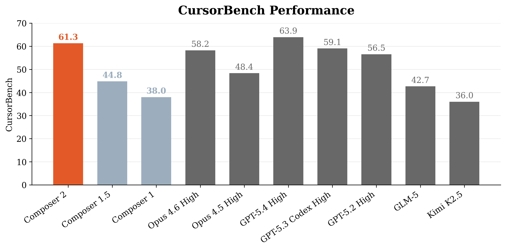
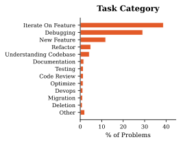
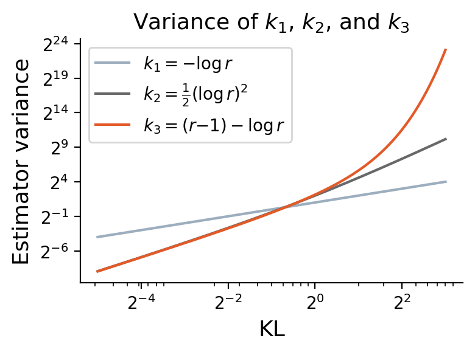
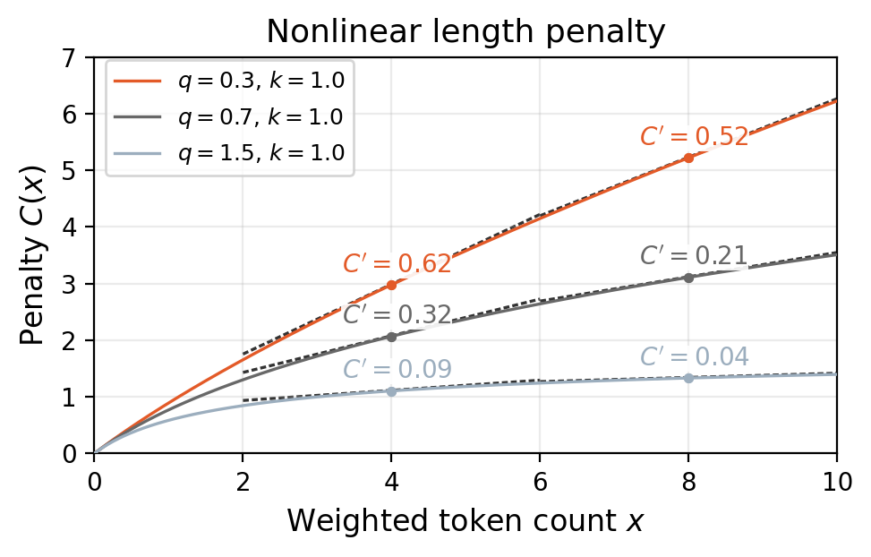
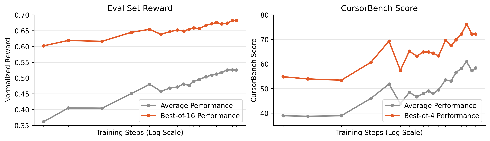
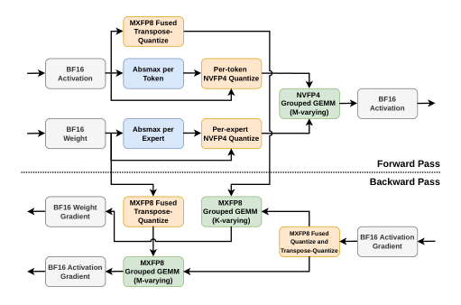

# Composer 2 技术报告深度解读：把通用大模型“炼”成顶级 Coding Agent

## 这篇工作到底解决了什么问题？

一句话概括：作者团队想证明一件事—— **不必从零训练一个全新模型** ，也可以通过“持续预训练 + 大规模异步强化学习（RL）”把通用大模型定向打磨成真实开发场景可用的高水平软件工程 Agent。

他们盯住的不是刷榜式编程题，而是更接近真实工程的任务形态：  
- 需求描述短、含糊  
- 需要跨文件、跨模块改动  
- 需要读日志、跑命令、写测试、迭代修复  
- 既要正确，也要兼顾成本和交互体验

这也是 Composer 2 和很多“仅看 pass@1”研究的核心差异。

> 图解：这张柱状图展示了 Composer 2 相比 Composer 1/1.5 的明显跃升，并且与当时前沿模型处在同一竞争区间。横轴可理解为模型版本，纵轴是综合任务表现（准确率、通过率类指标）；它传达的重点是 **专项训练路线可显著提升真实软件工程能力** ，而不仅是通用对话能力。  

---

## 训练总路线：两阶段，目标非常明确

### 1) 阶段一：Continued Pretraining（持续预训练）

作者先选了一个强基座（Kimi K2.5，MoE 1.04T 参数、32B 激活参数），再进行代码域强化预训练，分三步：

1. 大量计算预算集中在 32k 上下文长度。  
2. 短阶段扩展到 256k 长上下文。  
3. 再做面向编码任务的短 SFT 收敛。

核心观察：训练中代码库上的 loss 持续下降，且 **交叉熵、困惑度与后续 RL 效果有可预测关系** 。

此外，他们额外训练了 MTP（Multi-Token Prediction）层，用于 speculative decoding，加速线上推理，并通过自蒸馏提升收敛速度和稳定性。

---

### 2) 阶段二：Asynchronous RL（大规模异步强化学习）

这一阶段是全文最关键的技术主体。它不是“单轮问答 RL”，而是把模型放进尽量真实的 Cursor 式环境中，跑多步 rollout，再按结果质量回传梯度。

> 图解：任务分布图说明 RL 数据并非单一 bug-fix，而是覆盖了真实工程中的多种任务类型。横轴是任务类别，纵轴是采样占比（或频次）；后期还会根据回合数、thinking token 等难度信号上采样更难样本，推动模型学到长程规划能力。  

---

## 强化学习算法细节：他们到底改了什么？

论文有几个很“工程但关键”的点：

### 1) 降低策略梯度偏置，避免“看似收敛、实则歪掉”
- 使用多样本 policy gradient（固定 group size）。  
- single-epoch（同一 prompt 不重复训练）。  
- 不做会引入长度偏置的 length standardization。  
- 不用 group 内标准差归一化，避免“全都答对但细微差异被过度放大”的退化情况。  

### 2) 处理异步训练中的 off-policy 偏差
- 快速权重同步 + rollout 过程中权重更新。  
- 用 router replay 缩小训练端与推理端 MoE 路由不一致造成的噪声。  

### 3) KL 正则估计器选择（很实用）
很多实现喜欢用低方差但在大偏离时易爆方差的估计器；他们改用更稳的形式：

$$
\mathrm{KL}(q \,\|\, p)=\mathbb{E}_{x\sim q}\left[-\log r(x)\right],\quad r(x)=\frac{p(x)}{q(x)}
$$

即直接采用 $k_1=-\log r$，而不是在分布差异较大时方差可能剧烈上升的替代估计器。

> 图解：该图比较不同 KL 估计器在两分布均值逐渐拉开的情况下的方差表现。横轴可理解为分布差异（KL 变大），纵轴为估计方差；核心结论是某些常用估计器在大 KL 区域会不稳定，直接影响 RL 训练可靠性。  

---

## 长程任务能力的关键：Self-Summarization

Composer 2 延续了 Composer 1.5 的自总结机制：一条长 rollout 可由多段生成通过 summary 串联，而不是硬塞进一次上下文。奖励回传到整个链条，结果是：

- 好总结被强化（保留关键上下文）。  
- 坏总结被抑制（丢信息会拖累最终奖励）。  
- 在有限窗口内处理更长任务。  
- 减少 token 消耗并复用 KV cache。  

这其实是在学一种“模型内工作记忆管理策略”。

---

## 体验优化：不仅要会做题，还要“像个好同事”

作者非常重视开发者体验，专门加了行为侧奖励与惩罚：

- 代码风格与沟通质量奖励。  
- 工具误用惩罚（例如创建 TODO 但不收尾）。  
- 动态监测新出现坏习惯（如只会狂用 terminal）。  

尤其是长度惩罚函数设计得很巧：希望模型在简单任务上快，在复杂任务上肯花时间。

$$
C_{\text{length}\{k,q\}}(x)=\frac{(1+kx)^{1-q}-1}{k(1-q)}
$$

其中 $x$ 综合了 thinking tokens、tool tokens、tool output、回合数、工具调用次数等。函数是“递增但边际变化受控”的非线性形状，驱动模型在不同难度下自适应分配推理预算。

> 图解：该图展示线性与非线性长度惩罚的差别。横轴是“投入量”（token、调用、回合），纵轴是惩罚值；非线性曲线更容易形成“简单任务快收敛，困难任务允许深思考”的行为模式。  

---

## 结果怎么看：不只是平均分，而是“真实可用性”

> 图解：训练过程中平均表现和 best-of-K 同时上升。横轴是 RL 训练进度（steps），纵轴是奖励或准确率类指标；这说明模型不仅在“挑已有好轨迹”变强，也可能在“扩展可达正确解空间”上真正进步。  

报告给出的关键结果（同一评测框架下）：

| Model | CursorBench | SWE-bench Multi. | Terminal-Bench |
|---|---:|---:|---:|
| Composer 2 | 61.3 | 73.7 | 61.7 |
| Composer 1.5 | 44.2 | 65.9 | 47.9 |
| Composer 1 | 38.0 | 56.9 | 40.0 |

可以看到两点：  
- 相比前代，提升幅度很大（尤其是 CursorBench）。  
- 相比基座模型 Kimi K2.5（文中给到 CursorBench 36.0），专项训练收益显著。  

---

## 为什么他们要自己做 CursorBench？

作者明确批评了公开 benchmark 的几个常见问题：  
- 任务分布与真实开发场景错位。  
- prompt 过度指定。  
- 污染、过拟合风险。  
- 过度关注功能正确，忽略成本、交互、代码质量。  

CursorBench 的设计更“脏、更难、更真实”：  
- 中位代码改动约 181 行（公开 SWE-bench 常见 7–10 行级别）。  
- 描述更短更模糊（中位约 390 字符）。  
- 常要求跨日志、跨文件、跨工具链定位根因。  

这类评测更能测出真实工程中的“理解—探索—执行—收敛”闭环能力。

---

## 基础设施：这篇论文的“隐形主角”

> 图解：该图给出 MoE 层一次 grouped GEMM 训练流的内核级执行序列。横向是执行阶段，块状元素可理解为 kernel launch；它强调的是 **训练效率来自系统级流水线与量化内核协同** ，而不是单个算法点优化。  

报告在系统层面的含金量很高，核心包括：

- 并行策略：CP（Context Parallelism）作为长上下文主轴，EP 与 TP 解耦。  
- 精度与内核：MXFP8 + NVFP4 混合，前向、反向分工不同以兼顾推理与稳定性。  
- 异步 RL 平台：训练、环境、推理、评测四服务解耦，跨区域容灾。  
- 环境仿真：尽量与生产 Cursor harness 对齐，降低 train-test mismatch。  
- 权重同步：增量压缩 + 分片上传下载，减少异步时延和阻塞。  

简单说：他们把“算法是否有效”建立在“系统可大规模稳定跑起来”的前提上，这也是很多研究难以落地的分水岭。

---

## 附录里值得关注的细节（复现视角）

1. **基座模型筛选维度** ：不仅看 coding QA，还看 state tracking 与私有代码库 perplexity。  
2. **不迷信公开 agent benchmark 做基座选择** ：因为 RL 后期会重塑长程 agent 能力。  
3. **长任务训练的 checkpoint 机制** ：不仅存 step-level 权重，也做 rollout、group 级恢复，避免长轨迹故障重放成本过高。  
4. **训练—推理数值一致性** ：MoE 路由重放与路由 plausibility 过滤，减少 policy gradient 噪声。  

---

## 总结：这篇报告给行业的真正启发

Composer 2 的价值不只是“分数提高了”，而是验证了一条可工业化复制的路线：

- 用持续预训练补足领域知识底座。  
- 用贴近生产的异步 RL 学会多步工程执行。  
- 用行为奖励和长度策略打磨交互体验。  
- 用系统工程保证规模、稳定性和真实对齐。  

这条路线说明， **面向特定高价值场景（如软件工程）的专用模型** ，完全可能在成本—效果上优于通用大模型直接硬上。

> 本文参考自 [Composer 2 Technical Report](https://arxiv.org/abs/2603.24477)