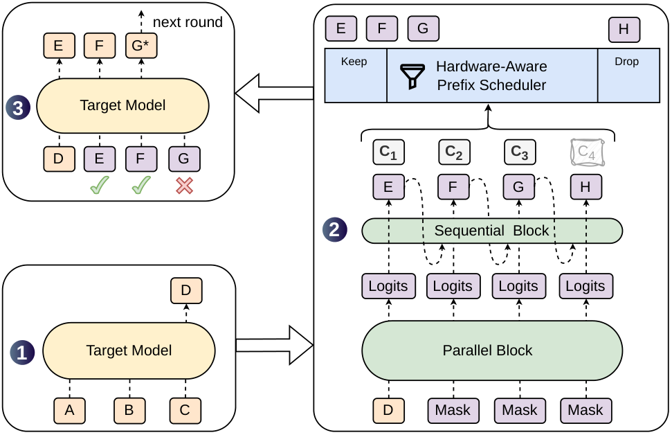
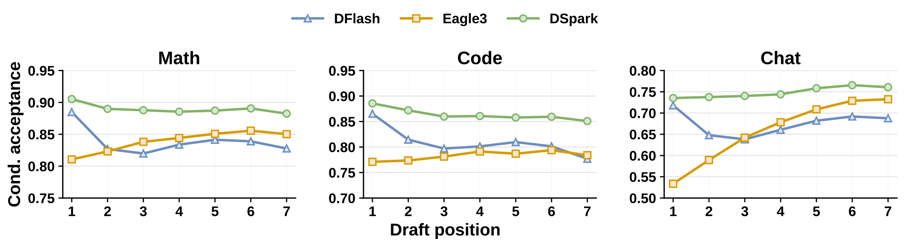
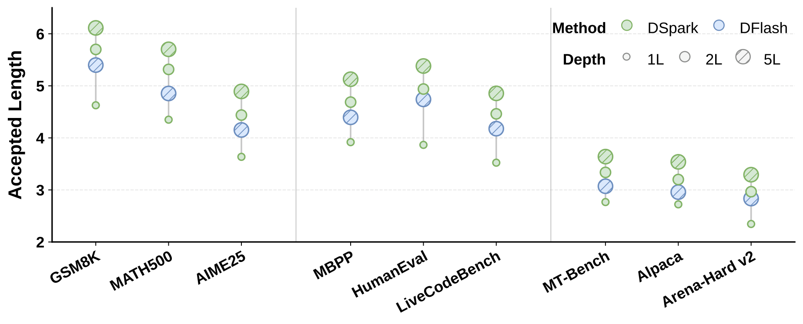
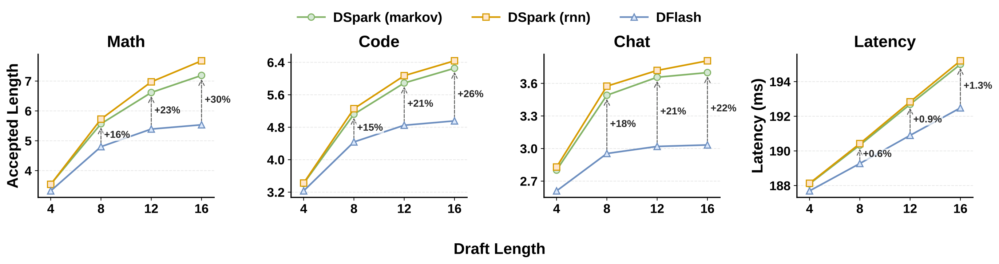
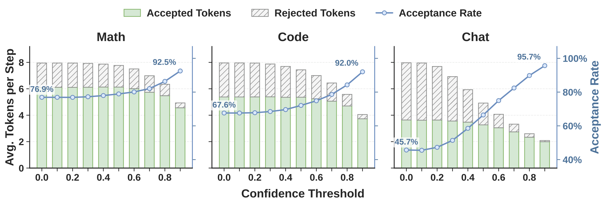
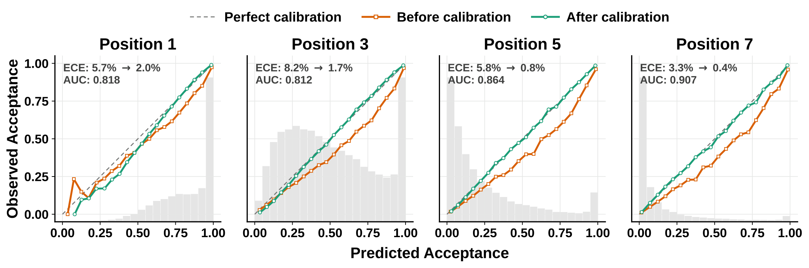
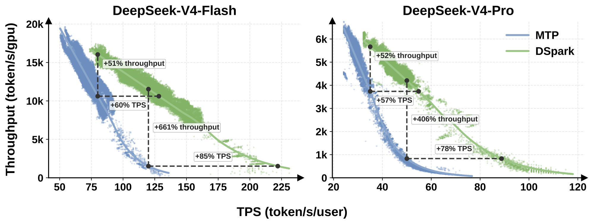
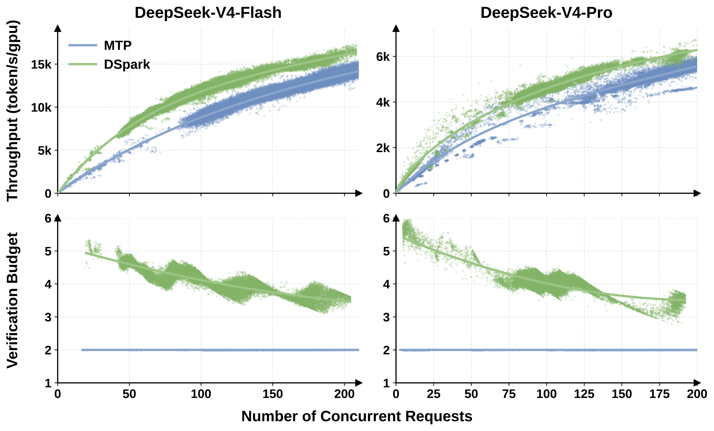

# DSpark：DeepSeek 投机解码新框架——半自回归生成 + 置信度调度验证，生产环境提速 60%–85%

在大模型推理加速的众多技术路线中，Speculative Decoding（投机解码）是少数能做到 **完全无损** 的方案：用一个轻量的 Draft Model 一次性提出多个候选 token，再由 Target Model 一次前向并行验证，接受最长的一致前缀。整个过程不改变输出分布，只是把“逐 token 串行生成”变成了“批量猜测 + 并行验收”。

但要把投机解码真正部署到高并发的生产环境，还有两个拦路虎：

- **草稿质量瓶颈**：并行式 Drafter（如 DFlash）虽然能一次前向产出长草稿块，但块内各位置彼此独立预测，缺乏 token 间依赖，越靠后的位置接受率衰减越严重（suffix decay）。
- **系统效率瓶颈**：草稿块越长，验证开销越大。在高并发场景下，不加区分地验证所有草稿 token，会白白占用宝贵的 batch 容量，反而拖垮整体吞吐。

这篇来自 DeepSeek-AI 与北大的论文提出了 **DSpark**，用两个互补的设计同时解决这两个问题：**半自回归生成**（Semi-Autoregressive Generation）提升草稿质量，**置信度调度验证**（Confidence-Scheduled Verification）让验证算力花在刀刃上。在 DeepSeek-V4 的真实线上流量中，DSpark 相比原生产基线 MTP-1，在同等吞吐下将单用户生成速度提升了 **60%–85%**，并且把服务系统的 Pareto 前沿整体向外推。

## 背景：投机解码的三个优化杠杆

先回顾一下投机解码的基本框架。每个解码循环中，Draft Model 提出 $\gamma$ 个候选 token $x_1, \ldots, x_{\gamma}$，Target Model 一次前向计算出自己在每个位置的分布 $p_k^t$，并以概率 $\min(1,\, p_k^t(x_k) / p_k^d(x_k))$ 接受草稿 token。验证从左到右进行，一旦某个位置被拒绝，其后所有 token 全部作废。

设每轮接受的 token 数为 $\tau$，草稿与验证的耗时分别为 $T_{\text{draft}}$ 和 $T_{\text{verify}}$，则平均每个 token 的生成延迟为：

$$
L = \frac{T_{\text{draft}} + T_{\text{verify}}}{\tau}
$$

这个公式给出了三个明确的优化方向：**draft faster**（降低 $T_{\text{draft}}$）、**draft better**（提高 $\tau$）、**verify smarter**（降低有效的 $T_{\text{verify}}$）。现有工作在三个杠杆上各有短板：

- **自回归 Drafter**（Eagle、MTP 等）：逐 token 串行生成，依赖建模充分，$\tau$ 高，但 $T_{\text{draft}} \propto \gamma$，被迫采用短草稿块 + 浅层网络。
- **并行 Drafter**（Medusa、DFlash 等）：一次前向产出全部 $\gamma$ 个位置，$T_{\text{draft}}$ 几乎与块长无关，可以用更深的网络，但块内独立性导致 suffix decay，$\tau$ 被拖累。
- **固定长度验证**：无论草稿质量如何都全量验证，在开放域对话等高拒绝率场景下，大量验证算力被浪费在注定被拒的尾部 token 上。

DSpark 的思路很清晰：**用半自回归架构同时吃到并行和自回归的红利，再用置信度调度把验证从“固定长度”变成“按需分配”**。

## DSpark 整体架构

> 图解：DSpark 的一个完整解码循环。左下（①）：Target Model 处理 prompt token ABC，生成下一个 token D，D 作为本轮草稿的 **anchor**（锚点）。右侧（②）：DSpark 以 D 加若干个 Mask token 作为输入，先经过计算密集的 **Parallel Block**（并行主干）一次前向产出所有位置的 Logits，再经过轻量的 **Sequential Block**（顺序模块）从左到右串行修正，生成草稿 token EFGH，同时 Confidence Head 输出每个位置的置信度 $c_1$–$c_4$。**Hardware-Aware Prefix Scheduler** 根据置信度和系统负载决定保留前缀 EFG、丢弃低置信的 H。左上（③）：Target Model 并行验证 EFG，其中 E、F 被接受，G 被拒绝并修正为 G*，本轮结束，G* 成为下一轮的 anchor。

### 半自回归生成：并行主干 + 轻量顺序头

并行 Drafter 的根本问题是：当上下文存在多种合理续写时（比如 "of course" 和 "no problem" 都通顺），独立预测的各位置可能拼出 "of problem" 这种跨模式冲突（multi-modal collision）的怪胎。

DSpark 的对策是把草稿生成拆成两个阶段：

#### 并行阶段

并行主干（基于 DFlash 改造）对整个块做一次前向，产出隐藏状态 $h_1, \ldots, h_{\gamma}$ 和基础 Logits $U_1, \ldots, U_{\gamma}$。相比原始 DFlash 有一个小改动：把 anchor token 本身也作为第一个预测位置，这样 $\gamma$ 个输入 token（anchor + $\gamma{-}1$ 个 mask）就能产出 $\gamma$ 个草稿 Logits，省掉了一格计算。

DFlash 主干的一个关键设计是 **KV 注入**：从 Target Model 的若干中间层抽取隐藏状态，拼接投影成上下文特征 $H_{\text{ctx}}$，再拼接到 Draft 每一层注意力的 Key/Value 序列前，让草稿模型直接“看到”大模型的内部表示。

#### 顺序阶段

顺序阶段为每个位置补充一个依赖前缀的转移偏置 $B_k$，使每个草稿位置都能条件于块内已采样的 token。整体构成一个自回归分解的块分布：

$$
P(X \mid x_0) = \prod_{k=1}^{\gamma} p_k(x_k \mid x_0, x_{<k}), \qquad p_k(v \mid x_0, x_{<k}) = \frac{\exp\!\left(U_k(v) + B_k(x_0, x_{<k}, v)\right)}{\sum_{u \in \mathcal{V}} \exp\!\left(U_k(u) + B_k(x_0, x_{<k}, u)\right)}
$$

这里的关键在于：$B_k$ 是 **局部修正** 而非全局归一化的能量模型（不像 CRF-NAT 那样有配分函数），因此每个 token 的概率仍然是精确的 softmax 值，可以无损地用于拒绝采样。论文给出了两种实例化：

- **Markov Head（默认方案）**：$B_k$ 只依赖前一个 token，退化为一个一阶转移矩阵 $B(x_{k-1}, x_k)$。完整的 $V \times V$ 矩阵太大，用低秩分解 $B = W_1 W_2$（$W_1 \in \mathbb{R}^{V \times r}$，$W_2 \in \mathbb{R}^{r \times V}$，默认 $r{=}256$）近似：

$$
  B(x_{k-1},\, \cdot\,) = W_1[x_{k-1}] \, W_2 \;\in\; \mathbb{R}^{V}
$$

  直觉上，$W_1$ 是一个 embedding 查找表，$W_2$ 是 Logits 投影。回到前面的例子：一旦位置 1 采样出 "of"，Markov Head 就会在位置 2 提升 "course"、压制 "problem"，消除跨模式冲突。

- **RNN Head**：Markov Head 只有一步记忆，RNN Head 通过循环状态 $s_k$ 累积块内全部前缀历史。每步将 $[s_{k-1};\, W_1[x_{k-1}];\, h_k]$ 拼接后做一次门控更新：

$$
  s_k = \sigma(W_g\, z_k) \odot s_{k-1} + \bigl(1 - \sigma(W_g\, z_k)\bigr) \odot \tanh(W_c\, z_k), \qquad B_k(x_{<k},\, \cdot\,) = W_2^\top\, \tanh(W_o\, z_k)
$$

  实验显示 RNN Head 只在长草稿块上有微弱增益，考虑到实现复杂度和部署友好性，默认采用 Markov Head。

### 置信度调度验证：验证要“聪明”，不是“更长”

草稿块再长，也不能闭着眼睛全验证。原因有两层：

- **数据侧**：不同领域的接受率天差地别——代码、数学这类结构化文本接受率天然高，开放式闲聊则显著偏低。
- **系统侧**：多验证一个 token 的真实代价取决于引擎负载。低负载时几乎免费；高并发时，每个无效验证都挤占了本可以服务其他请求的 batch 容量。

DSpark 的方案是 **Confidence Head + Hardware-Aware Prefix Scheduler** 的组合。

#### Confidence Head：预测前缀存活概率

Confidence Head 结构极简：对 backbone 隐藏状态和上一 token 的 Markov Embedding 做一次线性投影加 sigmoid：

$$
c_k = \sigma\bigl(w^\top [h_k;\, W_1[x_{k-1}]]\bigr)
$$

$c_k$ 建模的是 **条件概率**——在前 $k{-}1$ 个草稿 token 都被接受的前提下，第 $k$ 个 token 通过验证的概率。训练标签有解析解：每步的接受率等于 $1$ 减去草稿分布与目标分布的总变差距离的一半：

$$
c_k^* = 1 - \tfrac{1}{2}\|p_k^d - p_k^t\|_1
$$

#### STS 校准：从“排序正确”到“数值可信”

以往的置信度方法只需要分数能正确 **排序**（用来设阈值砍尾部），而 DSpark 的调度器需要置信度的 **绝对数值** 来精确计算期望接受长度——原始神经网络的置信度往往系统性偏高（overconfident），直接用会扭曲吞吐估计。

为此论文提出 **Sequential Temperature Scaling (STS)**：由链式法则，前缀 $k$ 的存活概率是连乘积 $\prod_{i \le k} c_i$。STS 在留出验证集上从左到右逐位置做一维网格搜索，为每个位置找一个温度标量，最小化连乘积的 ECE（Expected Calibration Error），同时保持前面已校准位置不变。温度缩放是保序变换，只修正数值、不扰乱排序。

#### Hardware-Aware Prefix Scheduler：全局吞吐最大化

这是本文系统侧的核心贡献：**把验证长度选择形式化为一个全局吞吐最大化问题**。

设当前有 $R$ 个活跃请求，请求 $r$ 在第 $j$ 个位置的前缀存活概率为 $a_{r,j} = \prod_{i \le j} c_{r,i}$。若各请求的验证长度为 $\ell_1, \ldots, \ell_R$，则验证 batch 总 token 数为 $B = \sum_r (1 + \ell_r)$，期望接受 token 数为 $\tau = \sum_r \bigl(1 + \sum_{j=1}^{\ell_r} a_{r,j}\bigr)$。设引擎在 batch size 为 $B$ 时的步速为 $\mathrm{SPS}(B)$（steps per second，引擎初始化时离线 profile 一次，存成轻量查找表），调度目标是最大化系统级期望吞吐：

$$
\Theta = \tau \cdot \mathrm{SPS}(B)
$$

表面看这是个组合优化，但目标函数的结构允许贪心求解：由于 $a_{r,j}$ 对 $j$ 单调不增，把所有候选位置 $(r, j)$ 按存活概率全局降序排序，天然满足块内前缀依赖。调度器沿这个排序逐步“录取” token，每步更新 $\Theta$，**一旦 $\Theta$ 不再上升就立即 break**。

这个 early-stopping 不只是效率技巧，更是无损性的关键。投机解码的无损性要求 **non-anticipating 性质**：第 $k$ 个草稿 token 的准入决策，只能依赖该 token 被采样 **之前** 可见的信息。但 Confidence Head 用到了上一 token 的 Markov 特征——$c_{k+1}$ 的计算依赖 $x_k$ 的具体取值。如果调度器允许“回溯式”全局搜索（看到 $\Theta$ 下降还继续往后评估），就会把 $x_k$ 的取值泄漏进 $x_k$ 自己的准入决策里，引入选择偏差。论文附录给出了一个具体的反例：词表 $\{A, B\}$，目标分布 $(0.7, 0.3)$，回溯式调度会让输出分布偏移成 $(0.85, 0.15)$——**不再无损**。early-stopping 保证截断决策只依赖当前步之前的信息，从而严格保持目标分布。

### 训练目标

训练时 Target Model 全程冻结，Draft Model 共享其 embedding 和 LM head（也冻结），只更新并行主干、顺序模块和 Confidence Head。损失由三项组成，全部按位置加权 $w_k = \exp(-(k{-}1)/\gamma)$（越靠前的位置对期望接受长度贡献越大）：

$$
\mathcal{L} = \alpha_{\text{ce}}\,\mathcal{L}_{\text{ce}} + \alpha_{\text{tv}}\,\mathcal{L}_{\text{tv}} + \alpha_{\text{conf}}\,\mathcal{L}_{\text{conf}}
$$

- **交叉熵损失** $\mathcal{L}_{\text{ce}} = -\sum_k w_k \log p^d_k(x_k^*)$：让 Drafter 预测正确的下一个 token。
- **分布匹配损失** $\mathcal{L}_{\text{tv}} = \sum_k w_k \|p_k^d - p_k^t\|_1$：总变差距离是接受率的直接代理，最小化它就是在直接最大化期望接受率。
- **置信度损失** $\mathcal{L}_{\text{conf}}$：以解析接受率 $c_k^*$ 为软标签的二元交叉熵。

默认权重 $\alpha_{\text{ce}} = 0.1$，$\alpha_{\text{tv}} = 0.9$，$\alpha_{\text{conf}} = 1.0$。

## 离线实验：草稿质量全面领先

### 实验设置

- **Target Model**：Qwen3-4B / 8B / 14B 与 Gemma4-12B，跨规模、跨模型家族。
- **对比 Drafter**：自回归代表 Eagle3（基于 Training-Time Test），并行代表 DFlash（SOTA 并行 Drafter）。为公平起见，所有 Drafter 在同一训练框架、同一数据上重训，并对齐特征层与块长设置（Eagle3 为 1 层，DSpark/DFlash 为 5 层）。
- **训练数据**：Open-PerfectBlend（130 万条，数学 39.4%、代码 38.9%、对话 17.6%、指令遵循 4.1%），仅用 prompt，response 由各 Target Model 自己重新生成，训练 10 个 epoch。
- **评测**：数学（GSM8K、MATH500、AIME25）、代码（MBPP、HumanEval、LiveCodeBench）、闲聊（MT-Bench、Alpaca、Arena-Hard）三大领域，温度 1.0，指标为每轮 **接受长度 $\tau$**（含 bonus token）。离线评测关闭置信度调度，所有 Drafter 固定出全长草稿，隔离纯草稿质量。

### 主结果

| Target | Drafter | GSM8K | MATH | AIME25 | MBPP | HumanEval | LCB | MT-Bench | Alpaca | Arena-Hard |
|---|---|---|---|---|---|---|---|---|---|---|
| Qwen3-4B | Eagle3 | 5.14 | 4.62 | 3.92 | 3.69 | 4.16 | 3.77 | 2.39 | 2.26 | 2.55 |
| Qwen3-4B | DFlash | 5.40 | 4.85 | 4.15 | 4.40 | 4.74 | 4.18 | 3.07 | 2.96 | 2.83 |
| Qwen3-4B | **DSpark** | **6.11** | **5.70** | **4.89** | **5.13** | **5.38** | **4.86** | **3.64** | **3.54** | **3.29** |
| Qwen3-8B | Eagle3 | 5.30 | 4.77 | 3.91 | 3.96 | 4.33 | 4.17 | 2.66 | 2.54 | 2.54 |
| Qwen3-8B | DFlash | 5.33 | 4.91 | 4.07 | 4.36 | 4.64 | 4.39 | 3.11 | 2.98 | 2.81 |
| Qwen3-8B | **DSpark** | **6.17** | **5.78** | **5.01** | **5.16** | **5.52** | **5.17** | **3.72** | **3.58** | **3.21** |
| Qwen3-14B | Eagle3 | 5.24 | 4.60 | 3.71 | 3.81 | 4.14 | 4.01 | 2.62 | 2.47 | 2.48 |
| Qwen3-14B | DFlash | 5.41 | 4.84 | 3.98 | 4.44 | 4.59 | 4.33 | 3.10 | 2.94 | 2.72 |
| Qwen3-14B | **DSpark** | **6.21** | **5.74** | **4.94** | **5.26** | **5.43** | **5.02** | **3.70** | **3.58** | **3.13** |
| Gemma4-12B | Eagle3 | 5.87 | 5.46 | 4.83 | 4.72 | 5.37 | 4.16 | 3.19 | 3.06 | 2.72 |
| Gemma4-12B | DFlash | 5.45 | 5.04 | 4.22 | 4.39 | 4.95 | 3.70 | 2.98 | 2.84 | 2.59 |
| Gemma4-12B | **DSpark** | **6.05** | **5.78** | **5.12** | **5.11** | **5.64** | **4.51** | **3.49** | **3.35** | **2.92** |

> 表解：三个模型规模、九个基准上，DSpark 的接受长度全部第一。Qwen3-4B/8B/14B 上，DSpark 相比 Eagle3 的宏平均提升分别为 **30.9% / 26.7% / 30.0%**，相比 DFlash 提升 **16.3% / 18.4% / 18.3%**，并泛化到 Gemma4-12B。另一个重要观察是 **领域效应**：结构化任务（数学、代码）接受长度天然高于开放式闲聊（如 Qwen3-4B 上 5.57 / 5.12 vs 3.49）——这正是置信度调度的动机：对高拒绝率的尾部 token 做固定长度验证纯属浪费。

### 分析一：为什么并行生成反而能赢过自回归？

> 图解：Qwen3-4B 上按草稿位置统计的 **条件接受率**（分母只统计前 $k{-}1$ 个 token 全被接受的样本，排除前缀失败的连坐影响）。横轴为草稿位置 1–7，纵轴为接受率。可以看到：自回归的 Eagle3 起点低但全程平稳甚至上扬；并行的 DFlash 起点高但尾部快速衰减（suffix decay）；DSpark 则兼得两者——高起点 + 全程平稳。

这个结果初看反直觉：按传统认知，逐步自回归应该比独立并行预测质量更高。论文用位置级条件接受率拆解了原因：

- **位置 1 的容量优势**：第一个位置只依赖 target context，拼的是纯架构容量。自回归 Drafter 受 $O(\gamma)$ 延迟约束只能用浅层网络，而 $O(1)$ 的并行 Drafter 用得起深层网络——位置 1 上 DFlash 明显领先 Eagle3（数学 0.88 vs 0.81，闲聊 0.72 vs 0.53）。而投机解码是严格的前缀存活过程，**第一个 token 杠杆最大**，一旦被拒整块作废，这个初始优势被放大到最终指标上。
- **尾部位置的独立性局限**：随着前面的 token 锁定语义路径，后面的 token 本应越来越好猜。Eagle3 能利用这种条件确定性（闲聊上从 0.53 升到 0.74），而 DFlash 各位置对“所有可能的前缀”取边缘化，频繁产出自相矛盾的后缀组合（multi-modal collision），接受率一路下滑。
- **DSpark 的解法**：深层并行主干保住位置 1 的高起点，轻量顺序头修复尾部依赖。图中 DSpark 在数学上以 0.93 起步，且整条曲线高位平稳。

### 分析二：架构设计空间——深度与块长

> 图解：固定块长为 7，DSpark 层数从 1 加到 5 的接受长度变化（数学/代码/闲聊三个领域）。性能随深度单调提升，1→2 层的边际收益最大。最值得注意的是：**2 层 DSpark 就全面超过 5 层 DFlash**——轻量顺序头注入的局部自回归，比单纯堆并行层数的参数效率高得多。

> 图解：左三幅为块长 $\gamma \in \{4, 8, 12, 16\}$（含 anchor）下的接受长度对比。DSpark 在所有块长上领先 DFlash，且 **块越长差距越大**：$\gamma{=}7$ 时提升 15%–18%，$\gamma{=}15$ 时扩大到 22%–30%——因为纯并行生成的尾部衰减在长块上更致命。RNN Head 仅在长块上有微弱额外增益。最右一幅是 batch size 128 下的单轮引擎延迟：顺序模块的开销几乎可以忽略，块长从 4 扩到 16 只增加 0.2%–1.3% 的整轮延迟，换来最高 30% 的接受长度提升。

### 分析三：置信度头到底灵不灵？

> 图解：Qwen3-4B 上的离线阈值扫描。横轴为置信度阈值（0 等价于固定长度全量验证），柱状为每步平均 token 数（实心 = 被接受，斜线纹 = 被拒绝），折线为整体接受率。阈值升高时，被拒绝的 token（斜线部分）被大量剪掉，接受率持续攀升。剪枝效果在闲聊域最显著：接受率从 **45.7% 飙到 95.7%**；数学和代码则保留更多草稿（76.9%→92.5%，67.6%→92.0%）——说明置信度头天然把剪刀对准了算力浪费最严重的地方。

> 图解：校准前后的可靠性对比。横轴为预测置信度分桶，纵轴为经验接受率，背景直方图为各桶的样本数分布。原始置信度头判别力已经很强（ROC-AUC 0.81–0.90），但系统性过自信（ECE 3%–8%）；经过 STS 校准后平均 ECE 降到约 **1%**，连乘得到的前缀存活概率与真实接受率高度对齐——这正是吞吐估计精确性的前提。

## 生产部署：在 DeepSeek-V4 真实流量中落地

离线指标只是故事的一半。把 DSpark 部署进 DeepSeek-V4-Flash / V4-Pro（preview）的服务系统，还要跨过很多工程坎。

### 可扩展训练

训练 Drafter 需要 Target Model 的输出分布做监督，两个模型跑全量上下文会带来巨大的显存和通信开销。论文在内部训练框架 HAI-LLM 上做了两个系统优化：

- **隐藏状态通信**：不跨 worker 传全词表 Logits（$V \approx 10^5$，带宽杀手），而是只缓存并传输 LM head 之前的隐藏状态，LM head 投影在 Drafter 侧本地只对采样位置计算。每 token 通信复杂度降到 $O(d)$（$d$ 为隐藏维度）。
- **Anchor 界定的序列打包**：从训练序列中采样固定数量的草稿 anchor，把孤立的预测块打包成稠密 batch，并用 token 级注意力索引（而非 2D mask）维持跨序列、跨 anchor 的精确因果掩码，把 Drafter 的训练成本与 Target 的上下文长度解耦。

### 调度器的实战改造

理论版调度器（贪心 + early-stopping）上线会撞上两个现实矛盾：

- **硬件容量曲线是锯齿状的**：真实 $\mathrm{SPS}(B)$ 呈阶梯式退化，不是光滑单峰曲线，early-stopping 容易掉进局部最优。
- **与 CUDA Graph / ZOS（Zero-Overhead Scheduling）冲突**：ZOS 要求当前步还没跑完就知道下一步的 batch size，同步调度会卡住 GPU 流水线。

解法是 **异步化调度**：用 **两步之前** 的置信度头输出来估计即将到来的验证容量 $K$，当前步的候选 token 仍然按最新的真实累积置信度严格排序——历史预测只决定动态截断长度，本质是一个动态 top-$K$ 选择，**保序性不受影响**。

更妙的是，这个异步设计顺带解决了无损性问题：去掉 early-stopping 做无约束全局搜索本会导致未来信息泄漏（附录的反例），但由于搜索用的全是两步之前的历史预测，准入决策天然与当前 token $x_{r,k}$ 的取值隔离——**异步管线本身构成了一道因果屏障**，既能跨越硬件容量曲线的悬崖追求最大物理吞吐，又严格保持目标分布。

### 高吞吐低延迟的内核支持

动态调度意味着同 batch 内各请求的验证长度不同，而标准 decode kernel 高度依赖定长 query。论文的解法是把 **物理执行与逻辑序列跟踪解耦**：计算内核里所有 token 跨请求拉平、作为独立元素统一处理；序列内依赖通过一个 marker tensor 传入稀疏注意力实现。在 DeepSeek-V4 架构上，只有 index-attention 和 compress 两个 kernel 需要改动。

另外值得一提的是部署环境的特殊性：由于单请求 KV-cache 配额、RL 长尾流量等限制，有效 batch size 长期低于 GPU 算力饱和点。在这种 regime 下，“单 GPU 总吞吐”和“单用户生成速度”不再是此消彼长，而是高度相关——调度器可以放心地把闲置算力导向最有希望的草稿 token。

### 线上效果：Pareto 前沿整体外移

> 图解：真实用户流量下，系统聚合吞吐（纵轴）与单用户生成速度 tok/s/user（横轴）的关系。散点是线上遥测原始数据，实线是拟合的性能前沿。DSpark（最大草稿长度 $\gamma{=}5$）相对原生产基线 MTP-1（每次只投机 1 个 token）把整条前沿向外推。

具体数字（SLA 指系统必须保证的单用户最低生成速度）：

- **V4-Flash**：在 80 tok/s/user 的中等 SLA 下，聚合吞吐提升 **51%**；在 120 tok/s/user 的严格 SLA 下，MTP-1 已逼近运行边界、只能维持极小并发，DSpark 名义吞吐高出 661%——这个数字更应解读为 **DSpark 把可行的交互性前沿延伸到了基线根本到不了的区域**。在同等实际吞吐下，单用户速度提升 **60%–85%**。
- **V4-Pro**：35 tok/s/user SLA 下吞吐提升 **52%**；50 tok/s/user SLA 下名义优势 406%（同样是基线低并发 regime 所致）；同等容量下单用户速度快 **57%–78%**。

这里有个背景值得注意：生产环境此前一直守着单 token 的 MTP-1，不是因为不想用更长的草稿，而是 **静态多 token Drafter（如 MTP-3/5）在高并发下会因验证开销过大而严格劣化总吞吐**。DSpark 的价值恰恰在于：它让长草稿块在动态服务环境中第一次变得“安全”。

> 图解：上排（a, b）为不同并发水平下的聚合输出吞吐；下排（c, d）为每请求平均验证预算。在中等并发（Flash < 200、Pro < 150 并发请求）时，调度器利用空闲算力把验证预算从 MTP-1 的静态 2 token 扩到约 4–6 token，直接贡献吞吐增益；并发继续升高、target 容量趋于饱和时，验证预算随负载平滑收缩，低置信草稿在占用关键 batch 容量之前就被剪掉。轻载时吃满闲置算力，重载时保住关键容量——这就是负载感知的意义。

### 局限性

DSpark 仍有一笔固定的草稿侧成本：并行主干生成初始 $\gamma$ token 块的开销无法回收。对于接受率天然很低的复杂 query，这笔先期投入是沉没成本。未来可以引入难度感知的 early exit，让这类请求跳过整块生成。

## 总结

DSpark 的贡献可以浓缩为一句话：**draft better + verify smarter**。

- 算法层面，半自回归生成范式用“重并行主干 + 轻顺序头”的组合，以可忽略的延迟代价（0.2%–1.3%）修复了并行 Drafter 的 suffix decay，接受长度相对 Eagle3 提升约 27%–31%、相对 DFlash 提升约 16%–18%。
- 系统层面，把验证长度选择形式化为全局吞吐最大化问题，配合 STS 校准的置信度头与异步硬件感知调度器，在严格无损的前提下把验证预算变成了随负载动态伸缩的资源。
- 工程层面，从隐藏状态通信、序列打包训练，到变长 kernel、ZOS 兼容的异步调度，论文给出了一份完整的生产落地清单，并在 DeepSeek-V4 真实流量上验证了 60%–85% 的单用户提速。

此外，作者开源了 V4-Flash / V4-Pro 的 DSpark checkpoints，以及包含 Eagle3、DFlash、DSpark 全部实现的投机解码训练仓库 DeepSpec，对做推理加速的同学是很好的上手资源。

> 本文参考自 [DSpark: Confidence-Scheduled Speculative Decoding with Semi-Autoregressive Generation](https://arxiv.org/pdf/2607.05147)