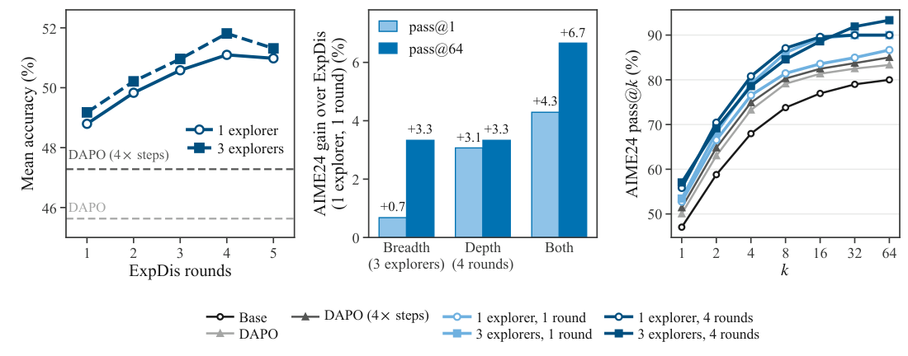
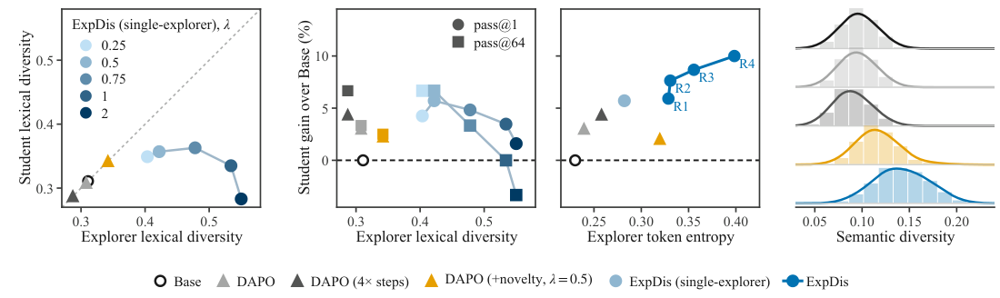
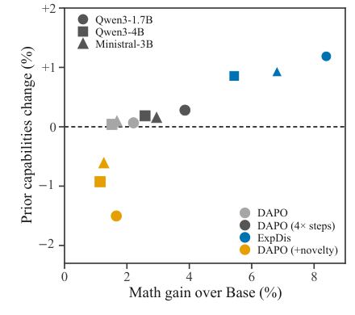
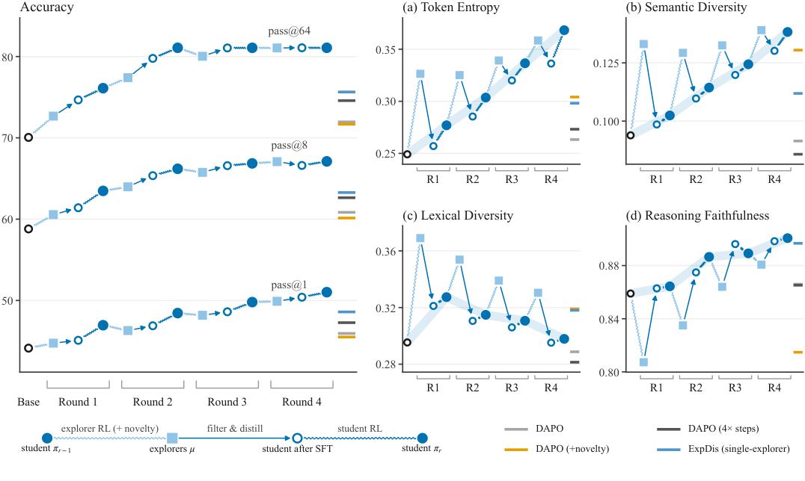
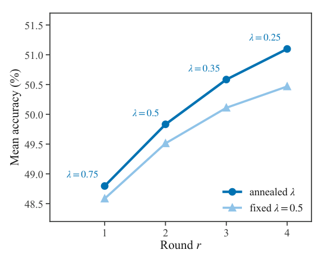
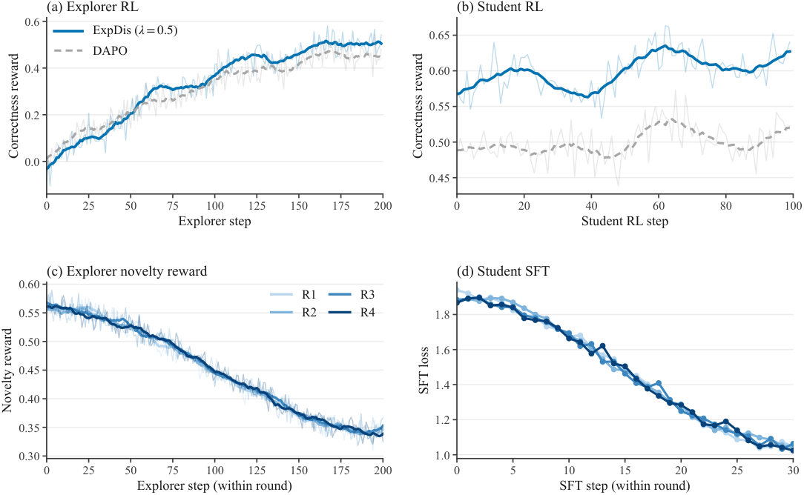
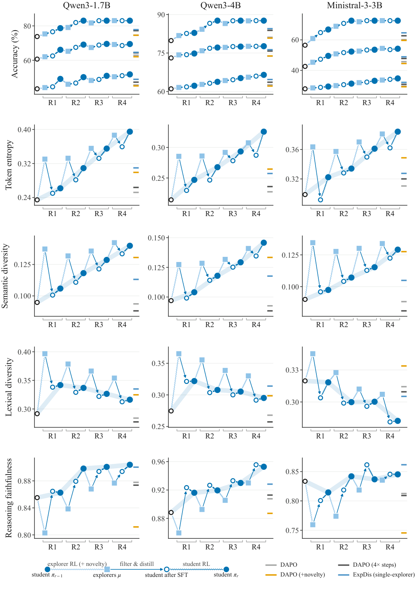

# ExpDis：把“探索”和“优化”拆成两个模型，RLVR 终于敢放心试错了

给 RLVR 直接加“新颖性奖励”为什么总是得不偿失？因为可验证奖励只监督模型能力的一小片切片，探索造成的“暗伤”奖励看不见、也修不好。哥伦比亚大学的这篇工作给出的答案很干脆： **把探索和优化拆给两个不同的模型** —— 一个 explorer（探索者）带着新颖性奖励放胆试错，一个 student（学生）只通过过滤后的正确轨迹吸收成果，自己永远不碰新颖性奖励。这套名为 Exploration-Distillation（ExpDis）的框架，在 7 个数学推理 benchmark、两个模型家族上，于 **相同 wall-clock 预算** 下全面超过最强基线 DAPO：Qwen3-1.7B 上平均 pass@1 从 45.63 提升到 **51.81**，甚至超过了训练 4 倍步数的 DAPO（47.28），pass@64 更是从 74.64 拉到 **83.04**。

## 提出问题：新颖性奖励为什么“有毒”

RLVR（Reinforcement Learning with Verifiable Rewards，可验证奖励强化学习）是当前提升大模型推理能力的主流配方：采样解答、用程序化的 verifier 打分、把概率推向答对的样本。理论上，这个循环可以“发现”训练数据里不存在的新解法；但实践中，模型只能强化它采得到的东西， **发现新解法的前提是探索** 。

最直接的加强探索的办法，是沿用经典 RL 中内在动机（intrinsic motivation）的路线，往奖励里加新颖性 bonus。但这篇文章指出了一个经常被忽视的结构性问题：

- 初始 policy 是一个预训练 LLM，脑子里装着“几乎整个维基百科”；
- 而可验证奖励只监督其中极窄的一片（比如数学推理）；
- 所以模型哪怕“忘掉大半维基百科”，奖励照样可以很高 —— **奖励既检测不到探索造成的切片外损伤，更谈不上修复** 。

探索出的新策略大多会失败，模型暂时变成一个“主要生成失败解答”的模型，而这种退化发生在奖励看不见的地方。作者的论断很关键： **问题不在新颖性这个信号本身，而在于把这个信号施加在了哪里** —— 施加在那个最终要部署的模型身上，就是错的位置。

## 核心思路：让探索者和学生“分家”

既然痛点是“探索的压力压坏了要部署的模型”，解法自然是把两个角色拆给两个模型实例：它们从同一个 base checkpoint 出发，但各司其职， **只通过过滤后的轨迹通信，不共享参数** 。这就是 ExpDis 的单轮流程：

1. **训练 explorer policy $\mu$** ：从 base policy $\pi_0$ 初始化，用 DAPO 训练，奖励里加入新颖性项；
2. **拒绝采样（rejection sampling）** ：把 explorer 的轨迹按正确性和质量过滤；
3. **蒸馏 + 标准 RLVR 训练 student $\pi_1$** ：先在过滤轨迹上做 SFT，再用纯正确性奖励跑 DAPO。

学生从不直接承受新颖性压力，因此探索可以放心地放开手脚。下面逐块拆开看。

### Explorer：只对“答对的新颖解法”发奖金

Explorer 的奖励函数为：

$$
r_{\text{explorer}}(\tau) = r_{\text{correct}}(\tau) + \lambda \cdot r_{\text{novelty}}(\tau) \cdot \mathbf{1}\!\left[r_{\text{correct}}(\tau) = +1\right] + r_{\text{overlong}}(\tau)
$$

其中 $r_{\text{correct}} \in \{-1, +1\}$ 是 verifier 给的正确性奖励，$\lambda \geq 0$ 控制新颖性奖励的权重，$r_{\text{overlong}} \in [-1, 0]$ 是 DAPO 原有的超长软惩罚。

这个设计有一个很聪明的地方： **新颖性 bonus 只对答对的轨迹发放** 。作者发现如果对错误轨迹也给新颖性奖励，模型会发现“生成新颖的垃圾”也能涨奖励，训练直接失稳。而现在的形式保证了无论 $\lambda$ 多大，任何正确 rollout 的奖励都高于任何错误 rollout —— 新颖性只能在“正确”的赛道里竞争。

### 过滤：正确只是底线，质量才是关键

收集 explorer 轨迹时，朴素做法是把所有正确轨迹（或其随机子集）直接丢给学生，但作者发现 **质量过滤带来明显提升** 。一条轨迹必须同时满足三个条件才能过关：

1. 最终的 `\boxed{}` 答案正确；
2. 在固定 token 预算内正常结束；
3. 不含重复循环（repetition loops）。

过滤之后， **每道题只保留最短的一条轨迹** ，并且每轮最多封顶 500 条。这样那些 explorer 能轻松解很多次的问题不会淹没学生的训练数据。笔者认为，“只留最短正确解”这一步实质上是在做一种隐式的难度配平：难题贡献稀缺的珍贵轨迹，简单题不刷存在感。

### Student：SFT 冷启动 + 无新颖性的标准 RLVR

蒸馏本身非常朴素：对过滤后的轨迹做标准的交叉熵 SFT。之后再用 DAPO 和纯正确性奖励继续训练，得到 student policy $\pi_1$。

学生因此吃到了双重收益：蒸馏带来的 **off-policy 探索成果**，加上自身 DAPO 阶段的 **on-policy 优化** —— 而且完全不继承 explorer 被新颖性压力压出来的退化。

### 两个扩展轴：横向多探索者，纵向多轮迭代

拆开了探索和优化之后，探索本身可以沿两个正交方向扩展：

- **广度（breadth）** ：一轮内并行训练 $K$ 个独立 explorer，把轨迹池化后再过滤、蒸馏。更多 explorer 意味着轨迹多样性更高、覆盖的解法空间更大。实验发现给所有 explorer 设相同的 $\lambda$ 即可，变化 $\lambda$ 收益甚微。
- **深度（depth）** ：把上述流程重复 $R$ 轮。第 $t$ 轮的 student $\pi_t$ 由“从 $\pi_{t-1}$ 训练的 explorer 产出的轨迹”蒸馏而来，随后每轮的 student 同时作为下一轮 explorer 和 student 的初始化， **每一轮都站在更强的起点上** 。

多轮还有一个细节：训练 prompt 被切成 $R$ 个互不重叠的 shard，第 $r$ 轮只用 $\mathcal{D}_r$，保证每轮都是“更强的初始化 + 没见过的题目”。同时新颖性权重 $\lambda$ 按固定 schedule 从 0.75 退火到 0.25（四轮）—— 早期正确轨迹尚未被发现，需要强探索压力；后期则降低压力、巩固已发现的成果。这与经典 RL 中“随训练推进降低探索”的惯例一致。

### 新颖性信号：RND

ExpDis 理论上兼容任何新颖性 bonus，主实验选用的是 **RND（Random Network Distillation，随机网络蒸馏）** 。做法：对每一层训练一个小型预测 MLP $f_{\theta,\ell}$，去拟合一个冻结的随机目标 MLP $f^{\star}_{\ell}$，特征取自语言模型自身的隐状态，预测误差就是新颖性信号：

$$
r_{\text{novelty}}(\tau) = \frac{1}{|\mathcal{L}|}\sum_{\ell \in \mathcal{L}} \frac{1}{\sqrt{d}}\,\bigl\lVert f^{\star}_{\ell}\!\bigl(h_{\ell}(\tau)\bigr) - f_{\theta,\ell}\!\bigl(h_{\ell}(\tau)\bigr) \bigr\rVert_2
$$

其中 $h_{\ell}(\tau)$ 是轨迹 $\tau$ 在第 $\ell$ 层、对 completion token 做 mean-pooling 后的特征（编码时不含 prompt），$d$ 是预测/目标网络的输出维度。预测网络持续在驱动 bonus 的同一批特征上更新，目标网络全程冻结。直觉上：见过的轨迹预测误差小、不新颖；没见过的模式预测误差大、给高分。作者还发现取多个中间层的特征比只用最后一层信号更干净。

## 实验设置

- **Base 模型** ：Qwen3-1.7B、Qwen3-4B、Ministral-3-3B-Instruct-2512，覆盖两个模型家族。
- **训练数据** ：DAPO-Math-17K（1.7 万道数学推理题），无放回随机采样；附录补充了 DeepScaleR 数据集的实验。
- **评测** ：7 个数学推理 benchmark —— AIME24/25/26、MATH500、AMC23、Minerva-Math、GSM8K。每题采样 64 条（AMC23 为 32，GSM8K 为 8），报告无偏 pass@$k$ 估计。GSM8K 和 AMC23 接近饱和，主结果聚焦其余 5 个 benchmark 的均值。
- **通用能力退化评测** ：MMLU-Pro、MMLU-Redux、GPQA-Diamond（知识）、ZebraLogic（逻辑推理）、IFEval（指令遵循），用于探测奖励监督不到的能力是否受损。
- **Baseline** ：GRPO、Dr. GRPO、DAPO（实证最强），外加两个 DAPO 变体 —— 直接加新颖性奖励（$\lambda=0.5$）的 DAPO (+novelty)，以及训练 4 倍步数的 DAPO。

**算力对齐** 是本文实验设计的良心之处：所有方法共用 300 步 RL 更新（每步 4 个 prompt、group size 16、最大生成长度 32,768）。ExpDis 把这 300 步拆成 explorer 200 步 + student 100 步；扩展多 explorer 或多轮时，各自均分份额，wall-clock 不变（explorer 并行跑）。pass@$k$ 采用无偏估计量：

$$
\mathrm{pass}@k = \frac{1}{N}\sum_{i=1}^{N}\left[1 - \frac{\binom{n - c_i}{k}}{\binom{n}{k}}\right], \qquad k \leq n
$$

其中 $n$ 为每题采样数，$c_i$ 为第 $i$ 题答对的样本数。

## 实验结果

### 主结果：同预算全面压制 DAPO

三个模型上，ExpDis 在平均准确率和 pass@$k$ 上全面领先。完整数字如下（五个主 benchmark 的均值）：

| Model | Method | @1 | @2 | @4 | @8 | @16 | @32 | @64 |
|---|---|---|---|---|---|---|---|---|
| Qwen3-1.7B | Base | 43.42 | 52.18 | 58.26 | 63.02 | 66.95 | 70.63 | 73.82 |
| Qwen3-1.7B | DAPO | 45.63 | 54.31 | 60.67 | 65.54 | 69.16 | 72.14 | 74.64 |
| Qwen3-1.7B | DAPO (4× steps) | 47.28 | 56.44 | 62.83 | 67.41 | 70.80 | 73.62 | 76.24 |
| Qwen3-1.7B | DAPO (+novelty) | 45.08 | 53.78 | 60.07 | 64.91 | 68.61 | 71.77 | 74.43 |
| Qwen3-1.7B | ExpDis (single-round) | 48.93 | 58.55 | 64.98 | 69.27 | 72.43 | 75.10 | 77.83 |
| Qwen3-1.7B | ExpDis | **51.81** | **61.40** | **68.03** | **72.94** | **76.97** | **80.29** | **83.04** |
| Qwen3-4B | Base | 61.06 | 68.90 | 72.83 | 75.43 | 77.41 | 78.90 | 79.86 |
| Qwen3-4B | DAPO | 62.58 | 69.97 | 73.84 | 76.46 | 78.41 | 79.88 | 81.14 |
| Qwen3-4B | DAPO (4× steps) | 63.64 | 71.15 | 75.05 | 77.65 | 79.62 | 81.20 | 82.82 |
| Qwen3-4B | DAPO (+novelty) | 62.20 | 69.70 | 73.59 | 76.20 | 78.16 | 79.64 | 80.82 |
| Qwen3-4B | ExpDis (single-round) | 64.69 | 72.32 | 76.24 | 78.83 | 80.82 | 82.51 | 84.50 |
| Qwen3-4B | ExpDis | **66.50** | **74.80** | **79.13** | **81.82** | **83.82** | **85.53** | **87.63** |
| Ministral-3-3B | Base | 27.95 | 34.54 | 40.52 | 45.34 | 49.36 | 53.00 | 56.50 |
| Ministral-3-3B | DAPO | 29.63 | 36.63 | 43.21 | 48.79 | 53.45 | 57.19 | 60.12 |
| Ministral-3-3B | DAPO (4× steps) | 30.90 | 38.19 | 45.05 | 50.86 | 55.74 | 59.63 | 62.36 |
| Ministral-3-3B | DAPO (+novelty) | 29.21 | 36.11 | 42.54 | 47.93 | 52.43 | 56.15 | 59.22 |
| Ministral-3-3B | ExpDis (single-round) | 32.16 | 39.74 | 46.87 | 52.93 | 58.01 | 62.05 | 64.59 |
| Ministral-3-3B | ExpDis | **34.76** | **43.22** | **51.31** | **58.35** | **64.37** | **69.24** | **72.56** |

几个值得划重点的观察：

- **单轮 ExpDis 就已经超过 4 倍步数的 DAPO** ，多轮版本进一步拉开差距；
- DAPO (+novelty) 一致地 **略差于** 纯 DAPO，直接验证了“新颖性奖励施加在部署模型上有害”的论点；
- ExpDis 的 pass@64 提升远大于 pass@1（如 Qwen3-1.7B 上 +8.4 vs +6.2），说明它产出的模型确实能生成 **更多样化的正确解** ，而不只是把已有解法磨得更尖。

### 扩展性：深度和广度怎么分配预算

固定 300 步 RL 预算，在 Qwen3-1.7B 上扫描 explorer 数量（广度）和轮数（深度）：

> 图解：横轴是不同的广度/深度配置（如 $1\times1$ 单轮单 explorer、$4\times3$ 四轮每轮三 explorer），纵轴为 pass@1 与 pass@64。单独加轮数对 pass@1 的提升大于单独加 explorer； **两者结合（MR-ME）在 pass@1 和 pass@64 上都取得最大收益** 。在当前预算下，3 个 explorer、4 轮之后收益趋于饱和并出现回退迹象。

作者给出的解读是：两个轴扮演不同角色 —— 每一轮加深的是“在更强学生身上强化”，而每个新 explorer 拓宽的是“有正确轨迹的问题集合和解法多样性”。值得注意的是，由于 explorer 并行运行， **加 explorer 不增加 wall-clock 时间** ；算力充裕的从业者可以几乎零时间成本地横向扩展。

### 多样性分析：探索者可以更“野”，学生不受拖累

RLVR 训练中熵坍缩（entropy collapse）是已知问题：policy 熵在训练早期骤降，采样分布越练越尖。在单个模型内对抗坍缩需要走钢丝 —— 同一个模型既要探索多样策略，又要为正确性负责。DAPO + novelty 就是这个 trade-off 的活标本：词汇多样性和答案多样性都上升了，但数学推理性能反而略降。

> 图解：左侧面板展示 explorer 的多样性指标（词汇多样性 InterDistinct-4、token 熵）随 $\lambda$ 变化时，下游 student 的表现 —— 由于蒸馏前做了正确性和质量过滤，explorer 被推到远超 DAPO (+novelty) 的多样性水平，学生的推理性能却不受损。右侧显示 ExpDis 的生成包含 **语义上更多样的数学推理策略** （基于专门训练的“解法是否同路”分类器聚类度量）。

这里有一个值得品味的区分： **多样性和性能并不总是同向的** 。模型完全可以通过“换一种措辞复述同一个解法”来刷高词汇多样性，却对 pass@$k$ 毫无帮助。而 ExpDis 提升的是语义层面的策略多样性，这才是有意义的探索。

### 新颖性奖励的“暗伤”：通用能力退化

这是全文论证闭环的关键一环。可验证奖励只监督模型能力的窄切片，直接往 DAPO 里加 RND 新颖性奖励后：数学变好了，但通用能力 benchmark 上 **退化到 base 模型之下** ：

> 图解：对比 base、DAPO、DAPO (+novelty) 与 ExpDis 在通用能力 benchmark 套件（知识、逻辑推理、指令遵循）上的表现。DAPO (+novelty) 在数学提升的同时跌破 base 水平；ExpDis 则拿到了探索的好处而无退化。

虽然在当前规模下退化幅度尚属温和，但作者推测：更大规模的 RLVR 若长期在部署模型上直接施加探索 bonus，退化会持续累积；而解耦式设计天然规避了这一风险。

### 策略演化：学生“取其精华，弃其糟粕”

跨多轮追踪 explorer 与 student 的演化轨迹，画面非常清晰：

> 图解：四个子图分别追踪 token 熵、语义多样性、词汇多样性、推理忠实度（reasoning faithfulness，衡量推理过程是否真的支撑最终答案）随轮次的变化。(a) explorer 的熵常以牺牲准确率为代价飙升，而学生的熵与准确率 **同步上升** ；(b) 各轮 explorer 语义多样性大致持平，但到第四轮学生几乎追平了这个差距 —— 因为每轮 explorer 从更强学生出发、能解更多题，蒸馏集覆盖面更广；(c) 学生并不保留 explorer 的词汇多样性，且词汇多样性随轮次下降而准确率照升 —— 佐证了“词汇多样性不是有价值的探索目标”；(d) 新颖性 bonus 通常会拉低忠实度，但到最后一轮影响已很轻微。结果为三个模型的平均。

一言以蔽之： **explorer 反复扩张学生可用的推理策略空间，学生把扩张的成果留下、把代价（pass@$k$ 下降、忠实度受损）关在门外。**

## 消融与细节分析

解决了主结果的疑问后，下一个问题自然是：ExpDis 的收益究竟来自哪一步？会不会就是“蒸馏 + RL”的普通组合拳？

### 阶段消融：过滤和 RL 缺一不可

在 Qwen3-1.7B 上拆掉 ExpDis 的各个环节（AIME24 准确率）：

| 配置 | AIME24 |
|---|---|
| DAPO | 50.05 |
| 未过滤 SFT + RL | 49.79 |
| 过滤 SFT，不做 RL | 49.84 |
| 过滤 SFT + RL（完整 ExpDis） | **52.76** |

两个“残缺版”都 **不如 DAPO** ，只有“质量过滤 + 后续 RL”的完整流程才超过基线。也就是说，ExpDis 既不能退化成“随便蒸馏一下再 RL”，也不能只蒸馏不 RL —— off-policy 的探索成果与 on-policy 的优化必须接力。此外，质量过滤本身也有实益：3 explorer 池化后保留全部正确轨迹只得到 48.95%（与单 explorer 持平），加上质量过滤后升至 49.47%。

### 换个新颖性信号行不行

把 RND 换成另外两种 novelty 度量（均基于轨迹最后一层 mean-pooled、L2 归一化的隐状态特征）：

- **kNN novelty** ：与最近 4096 条正确 completion 的 replay buffer 中 $k=16$ 个近邻的平均余弦距离；
- **Elliptical novelty** ：改编自既有工作的 elliptical bonus，$\sqrt{\phi^{\top}\Sigma^{-1}\phi}$，其中 $\Sigma$ 为历史正确 completion 特征的岭正则化运行协方差。

| Method | $r_{\text{novelty}}$ | AIME24 | AIME25 | AIME26 | MATH500 | Minerva | Mean |
|---|---|---|---|---|---|---|---|
| DAPO | -- | 50.05 | 36.93 | 37.66 | 74.24 | 29.27 | 45.63 |
| DAPO (4× steps) | -- | 51.41 | 38.05 | 41.96 | 75.02 | 29.98 | 47.28 |
| ExpDis (ours) | RND | **52.76** | **39.17** | **46.25** | **75.80** | **30.69** | **48.93** |
| ExpDis | kNN | 50.83 | 37.50 | 43.75 | 75.00 | 29.75 | 47.37 |
| ExpDis | Elliptical | 51.56 | 38.23 | 44.79 | 75.30 | 30.40 | 48.06 |

平均准确率最多掉 1.6 个点，但所有变体仍跑赢 DAPO —— 说明收益来自 **解耦框架本身** ，而不是 RND 的某种玄学。这呼应了作者的定位：ExpDis 是一个可以即插即用任意探索机制的框架。

### 超参细节

$\lambda$ 的扫描显示：即使 explorer 被 $\lambda=2$ 压到 pass@$k$ 回退，下游学生仍优于 base；学生性能大致在 $\lambda=0.5$ 处达到峰值，主实验均采用该值。多轮场景下退火 schedule 优于固定值：

> 图解：Qwen3-1.7B 单 explorer、四轮设置下，退火 schedule（$\lambda = 0.75, 0.5, 0.35, 0.25$）相比全程固定 $\lambda=0.5$ 的表现对比，退火方案一致更优。

主要训练超参数如下（所有方法共享）：

| 类别 | 设置 |
|---|---|
| RL 目标 | DAPO clipped objective，$\varepsilon_{\text{low}}=0.2$，$\varepsilon_{\text{high}}=0.28$，KL $\beta=0$ |
| Prompt / group | $B=4$，$G=16$ |
| 步数 | explorer 200，student 100，baseline 300，DAPO (4×) 共 1200 |
| 最大生成长度 | 32,768（尾部 6,554 token 线性软惩罚） |
| 学习率 | explorer / DAPO 基线 $5\times10^{-6}$；student $1\times10^{-6}$（AdamW，常数） |
| SFT | completion-only 掩码交叉熵，2 epochs，每轮至多 500 条 |
| RND | 取 $\{L/4, L/2, 3L/4\}$ 层；3 层 MLP、宽度 512；预测网络学习率 $10^{-4}$，每个 explorer、每轮重新初始化 |

各扩展配置下的预算分配（explorer 并行，各行 wall-clock 相同；唯一例外是 4× DAPO）：

| 配置 | $R \times K$ | Explorer 更新数 | 每轮 student 更新数 |
|---|---|---|---|
| Single-Explorer | $1 \times 1$ | 200 | 100 |
| Breadth $K=3$ | $1 \times 3$ | 各 67/67/66 | 100 |
| Depth $R=4$ | $4 \times 1$ | 每轮 50 | 25 |
| MR-ME $R=4$, $K=3$ | $4 \times 3$ | 每轮各 17/17/16 | 25 |
| MR-ME $R=4$, $K=5$ | $4 \times 5$ | 每轮各 10 | 25 |

训练在 TPU v5litepod-64（16 host）上进行：4 host 以 FSDP 训练 policy，12 host 用 vLLM 以 bf16 提供 rollout，全程 on-policy（每步后 vLLM 重载权重）。评估采样温度为 0.6（训练 rollout 为 1.0），top-$p$ 0.95、top-$k$ 20。

Qwen3-1.7B 的完整训练动态如下：

> 图解：ExpDis（$\lambda=0.5$）在 Qwen3-1.7B 上的训练过程曲线，涵盖奖励、熵、生成长度等指标在 explorer 与 student 各阶段的演化，可看到 explorer 阶段熵被显著推高，而 student 阶段回归平稳优化。

分模型的策略演化细分（三个模型各自的曲线）：

> 图解：将正文图 6 的汇总结果按 Qwen3-1.7B、Qwen3-4B、Ministral-3-3B 分别展开，可以看到“学生多样性逐轮向 explorer 收敛、词汇多样性被丢弃”的趋势在三个模型上一致成立。

### 训练数据与多样性度量的补充实验

数据选择上，固定 prompt 预算（约 1,200 条）下，DAPO-Math-17K 与 17K 子集的 DeepScaleR 表现相近；从完整 40K DeepScaleR 池采样则在每个 benchmark 上都更好。主实验统一使用 DAPO-Math-17K：

| Method | Dataset | AIME24 | AIME25 | AIME26 | MATH500 | AMC23 | Minerva | GSM8K |
|---|---|---|---|---|---|---|---|---|
| GRPO | DAPO-Math-17K | 47.81 | 35.36 | 35.68 | 72.84 | 83.75 | 28.02 | 89.89 |
| Dr. GRPO | DAPO-Math-17K | 48.49 | 35.99 | 36.46 | 73.34 | 84.38 | 28.45 | 90.04 |
| DAPO | DAPO-Math-17K | 50.05 | 36.93 | 37.66 | 74.24 | 85.16 | 29.27 | 90.25 |
| ExpDis $\lambda=0.5$ | DAPO-Math-17K | 52.76 | 39.17 | 46.25 | 75.80 | 86.17 | 30.69 | 90.68 |
| ExpDis $\lambda=0.5$ | DeepScaleR-17K | 51.77 | 38.33 | 44.84 | 75.16 | 86.48 | 30.44 | 90.59 |
| ExpDis $\lambda=0.5$ | DeepScaleR-full | **52.89** | **39.24** | **47.66** | **76.08** | **86.84** | **31.37** | **90.78** |

多样性指标方面，文中定义了四种度量：InterDistinct-4（同一问题所有生成中 distinct 4-gram 占比）、AnswerDistinct@$n$（不同最终答案数）、token 熵（AIME24 上 8 rollout 的平均 per-token 熵）、语义多样性（用微调过的 Qwen3-Embedding-4B 判断两条轨迹是否同一解法，聚类后归一化簇数）。Qwen3-1.7B 在 AIME24 上的数值：

| Model | Entropy | Semantic | Ans. entropy | Distinct ans. | InterDistinct-4 |
|---|---|---|---|---|---|
| Base | 0.237 | 0.100 | 1.42 | 8.94 | 0.311 |
| DAPO | 0.251 | 0.096 | 1.37 | 8.50 | 0.308 |
| DAPO (4× steps) | 0.265 | 0.091 | 1.35 | 8.46 | 0.302 |
| ExpDis (single-explorer) | 0.306 | 0.120 | 1.41 | 9.93 | 0.357 |
| ExpDis | **0.391** | **0.143** | 1.30 | 9.44 | 0.339 |

注意一个反差：DAPO 训练越久，语义多样性反而越降（0.096 → 0.091），而 ExpDis 的熵和语义多样性显著抬升。$\lambda$ 扫描进一步显示，explorer 的多样性随 $\lambda$ 单调上涨（$\lambda=2$ 时 AnswerDistinct 冲到 23.61），但学生在 $\lambda=0.5 \sim 0.75$ 区间取得最佳平衡，过大的 $\lambda$（2.0）终究会拖累学生 —— 过滤能挡住错误，却挡不住“过于另类的正确”。

## 总结与展望

- **问题定位精准** ：新颖性奖励伤模型，伤在施加位置而非信号本身 —— 可验证奖励只监督能力切片的一小部分，看不见切片外的退化；
- **方法极简** ：explorer 带新颖性奖励放胆探索 → 正确性 + 质量过滤 → 蒸馏进 student → student 跑无新颖性的标准 RLVR，两模型只通过轨迹通信；
- **双轴扩展** ：并行 explorer（广度）与多轮迭代（深度）在固定 wall-clock 预算下互补，组合收益最大；
- **结果扎实** ：同预算全面超过 DAPO，单轮即胜 4× 步数的 DAPO；Qwen3-1.7B pass@64 从 74.64 提升至 83.04，且通用能力零退化；
- **框架属性** ：对 RND、kNN、elliptical 三种 novelty 信号一致有效，过滤 + 后续 RL 缺一不可。

这项工作最启发人的地方在于它把“模型也需要一个允许失败的空间”从比喻变成了工程方案：explorer 永不部署，因此可以用任何激进到足以摧毁常规 RLVR 的探索机制。随着 RL 规模扩大、值得训练的题目越来越集中于“正确解罕见”的硬骨头，解耦式探索 —— 以及它解锁的更激进的探索机制 —— 很可能成为 RLVR 扩展路线图上的标配组件。

> 本文参考自 [Decoupling Exploration from Optimization in RLVR](http://arxiv.org/abs/2610.10536v1)