# DeepSeek 弹性计算平台 DSec：支撑大规模 Agent 训练的沙箱基础设施

训练一个会"动手"的 Agent 模型，瓶颈往往不在 GPU，而在一个容易被忽视的环节：模型每次试错都需要一个真实的、隔离的、有状态的执行环境。DeepSeek 这篇技术报告介绍的 **DSec** （DeepSeek Elastic Compute）就是为这个问题而生的生产级沙箱平台。它的核心思路是：不做单一的沙箱运行时，而是把 FnCall、容器、microVM、完整 VM 四种后端统一在一个平台之下，再用可组合环境层、内存共享与回收、QoS 感知调度、按需镜像加载四件套把密度和弹性拉满。最硬的数字是：单个生产单元约 160 个节点、30K CPU 核，每天服务约 **300 万个沙箱实例** ，峰值并发超过 **38 万** ，沙箱创建速率超过 **每秒 5000 个** ——这已经是目前公开资料中最大规模的 Agent 训练沙箱集群之一。

这篇文章的价值不只在于"又一个基础设施论文"。它罕见地公开了一个前沿实验室在 Agentic RL 规模化过程中踩过的真实坑：突发流量、环境爆炸、内存钉死、Reward Hacking、内核被 Agent 搞挂……每一个问题都有对应的生产级解法。下面我们按"问题 → 负载画像 → 机制 → 协同设计 → 实验"的逻辑逐一拆解。

## 背景：Agent 训练为什么需要专门的沙箱平台

传统的 LLM 训练只处理静态的输入-输出对，而 Agent 训练的本质是 **交互** ：模型要读代码库、调工具、执行命令、观察报错、修改文件，如此往复直到任务完成。这意味着 RL 的 rollout 阶段不再是"生成一段文本"，而是"驱动一个真实环境跑完一条轨迹"。

典型的 Agentic RL 训练循环分三步：

1. **Rollout** ：当前模型在沙箱环境里执行任务，产出轨迹（trajectory）；
2. **Reward 计算** ：用退出码、stdout、测试通过率等原生执行信号给轨迹打分；
3. **Policy 更新** ：RL 算法根据轨迹和奖励更新模型参数。

评测（evaluation）走同样的路径，只是轨迹用来衡量能力而非更新参数。再加上异步 rollout 流水线的普及，大量有状态的沙箱会话会长期在线，并且会随 GPU 任务的抢占而中断和恢复——这对平台的并发度、生命周期管理和状态一致性提出了前所未有的要求。

作者总结了这类负载的七个关键属性，每一条都直接塑造系统设计：

- **突发创建** ：单个任务最多可请求 32K 个沙箱，调度和镜像分发都不能有中心化瓶颈；
- **高密度运行** ：Agent 等待 LLM 生成下一步动作时 CPU 基本闲置，天然适合超卖（overcommit），单节点可跑 800 个 microVM 或 3200 个容器；
- **有状态且长寿命** ：文件修改、安装的依赖、启动的服务都要跨多轮交互保留，内存可能在 CPU 空闲后仍被长期钉住；
- **高度异构** ：从 OJ 判题到 Android 图形界面任务都有，单一沙箱抽象不可能通吃；
- **环境多样性极高** ：一周内容器后端就服务了 11266 个基础镜像和 102171 个 workspace，大量镜像复用率极低；
- **Agent 不可信** ：可能损坏文件系统、耗尽资源、干扰系统组件；
- **执行可中断** ：GPU 训练任务随时可能被抢占，沙箱状态必须能跨中断恢复。

> **博主点评** ：这七条属性里，最有洞察的是"有状态 + 长寿命 + CPU 稀疏"的组合——这恰好是传统 Serverless 平台（为短寿命、无状态函数优化）的反面。所以 DSec 不能简单套用 FaaS 那套，必须自己回答"状态驻留成本"这个新问题。

## DSec 全景：统一 SDK 与四种沙箱后端

从用户视角看，DSec 的入口是 `libdsec`，一个 Python 客户端库。这里的"用户"其实是训练框架、评测框架和数据构造流水线——它们替研究员调用 SDK。一个最小会话长这样：

```python
client = DSecClient()
await client.open()
args = DSecContainerRunArgs(
    container_image="registry.../sphinx-9658:official",
    memory_limit_mb=4096, cpu_cores_limit=4,
    ttl_running_stop=300,      # 空闲超时
    network_rules={"npm": False, "pypi": True},
    init_user="root",
)
sandbox = await client.run_container(args, timeout=120)
result = await sandbox.run_shell("echo hello world")
await sandbox.stop()
```

注意 `network_rules` 这一行：允许访问 PyPI、禁止访问 NPM。这种细粒度网络策略后面会展开，它是治理 Agent 作弊的关键手段之一。

DSec 刻意 **不做** 跨后端的全语义抽象——四种后端的启动成本、隔离边界、文件系统语义差异太大，硬抽象只会漏。平台提供统一的访问路径，但选哪种后端仍是调用方的责任：

| 特性 | FnCall | 容器 | MicroVM | 完整 VM |
| --- | --- | --- | --- | --- |
| 运行时性能 | 最高 | 高 | 中 | 低 |
| 依赖体积 | 极小 | 大 | 大 | 中 |
| 隔离强度 | 弱 | 中 | 强 | 强 |
| 完整 OS 功能 | 无 | 弱 | 中 | 完整 |
| 资源开销 | 极小 | 小 | 中 | 大 |
| 典型场景 | OJ 判题、GPU kernel | SWE、工具调用 | 安全任务、Computer Use | 商用 OS、图形渲染 |

- **FnCall** ：面向短促无状态任务（OJ、编译、GPU kernel），任务直接跑在预创建的常驻容器里，省去每次调用的 provisioning 开销；GPU 任务支持共享模式（多容器共用 GPU）和独占模式（性能敏感场景）。
- **容器** ：SWE 和通用工具调用任务的主力，启动快、密度高，但共享宿主内核，不适合安全敏感任务。
- **Firecracker microVM** ：隔离更强且保持 Linux 兼容，适合安全任务和需要 VM 边界的场景，代价是内存开销更高、启动更慢。
- **完整 VM** ：跑 Android（QEMU）、GUI、图形渲染等需要完整商用 OS 的任务，开销最大但不可替代。

生产环境中，容器和 microVM 占据了实例数和资源消耗的大头。

无论哪种后端，用户看到的生命周期是统一的：创建（选后端、指定环境产物、资源限额、TTL、网络策略）→ 环境就绪 → 多轮交互（状态全程保留）→ 显式停止或 TTL 到期回收。

## 平台架构：一个请求如何变成运行中的沙箱

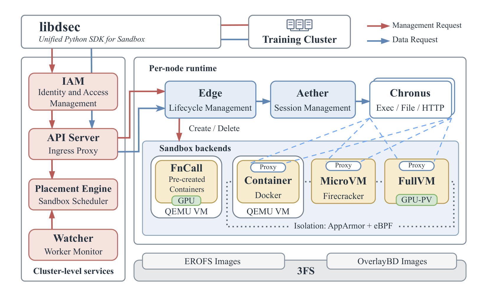

> 图解：DSec 架构总览。左侧是集群级服务（IAM、apiserver、placement engine、watcher），右侧是节点上的沙箱运行时（edge、aether、chronus）。容器/VM 沙箱通过每沙箱一个的 aether 代理与平台通信；FnCall 走独立路径，不经过代理。镜像数据统一放在 3FS 分布式文件系统上按需拉取。

一次沙箱创建请求的旅程是： **IAM** 鉴权 → **placement engine** 根据 **watcher** 采集的健康度与负载信息选节点 → **apiserver** 转发给目标节点的 **edge** → edge 做本地准入检查，容量够就创建，不够就拒绝。

几个设计细节值得展开：

- **IAM 支持多级项目嵌套** 。与云平台常见的扁平或两级结构不同，被授权的主体（包括 Agent 和 harness）可以创建子项目、下放配额。下放权受父级约束：不能授予自己没有的权限。人和 Agent 共用同一套管理 API 和授权模型——这一点很有前瞻性，因为"建环境的 Agent"本身也是平台用户。
- **apiserver 无状态且是唯一入口** 。训练代码在可信 GPU 服务器上跑，沙箱里跑的是不可信的模型生成代码，两侧网络隔离，apiserver 是唯一通信路径。沙箱 ID 编码了所属 edge，任意 apiserver 实例都能直接路由，入口层可以水平扩展。
- **placement engine 两阶段调度** ：先过滤（健康、具备所需后端和硬件的节点），再排序（随机采样若干节点选最空闲的）。它和 watcher 都不需要持久化状态，实例可以随时增删替换。
- **aether + chronus 双层代理** ：aether 是每个沙箱的跨平台代理（容器走 Unix domain socket，VM 走 vsock），chronus 提供 shell 会话抽象，一个沙箱里可以并发跑多个 chronus 实例。这套组合让 SDK 对容器和 VM 暴露统一的操作接口。
- **弹性上云** ：本地利用率超过 80% 时，placement engine 把部分可迁移任务卸到云 VM。生产数据显示一套 30TB 的去重 EROFS 镜像集能覆盖 70% 容器任务的文件访问，这套镜像离线同步到云端；一个单元 200 台云 VM 能吸收约 30% 的峰值溢出，避免本地集群过度 provisioning。

## 生产负载画像：三个环环相扣的挑战

解决了"平台长什么样"之后，下一个问题是：负载到底长什么样，为什么会把常规方案逼到墙角？论文用一周的生产数据给出了画像（仅统计占大头的容器和 microVM）。

### 挑战一：突发创建 + 组合式环境，setup 成本被放大

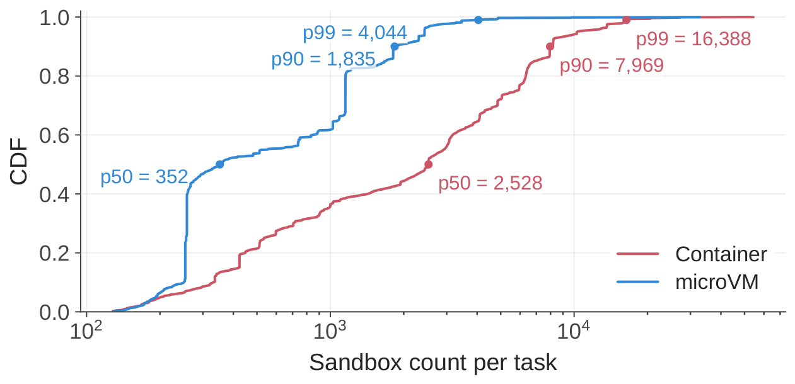

> 图解：每个任务创建的沙箱数量分布（CDF）。横轴是沙箱数量（对数刻度），纵轴是累积比例。典型的容器任务一次就创建数千个沙箱，长尾可达数万个，最大生产任务达 32K。

沙箱不是匀速到达的，而是一批一批砸过来的——训练/评测批次在环境就绪前无法开始，所以任何环节的拖尾都会直接延迟模型交互。

沙箱创建后经历三个阶段： **setup** （装依赖、工具、初始化）→ **tool-call** （模型生成与沙箱操作交替，CPU 短促脉冲）→ **test** （验证结果，资源需求短暂回升）。

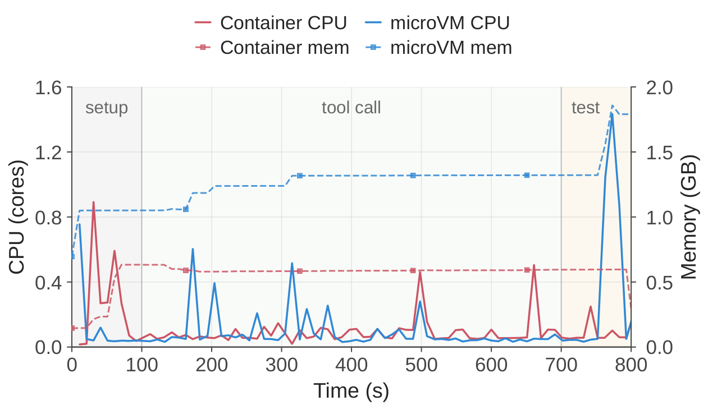

> 图解：一个代表性沙箱的执行过程。横轴为时间，纵轴为资源占用。setup 阶段 CPU/IO 冲高；tool-call 阶段 CPU 呈间歇性脉冲，但内存和累积状态持续驻留；test 阶段短暂回升。关键洞察：setup 成本会被突发规模放大，而后续阶段即使 CPU 空闲也要保留全部状态。

环境内容的多样性才是 setup 贵的根源。一个沙箱的内容可分解为三部分： **基础镜像** （OS 级依赖，如 Ubuntu + Python 3.10）、 **workspace** （任务代码仓库及依赖）、 **toolkit** （频繁更新的工具链，如 DeepSeek Harness）。一周生产数据：

| 后端 | 基础镜像 | Workspace | 快照 | 总大小 |
| --- | --- | --- | --- | --- |
| 容器 | 11,266 | 102,171 | -- | 82.8 TB |
| MicroVM | 2 | 53,590 | 4,889 | 50.9 TB |

平台同时服务 103 个 toolkit，67.8% 的沙箱在基础镜像之外还需要至少一个 workspace 或 toolkit。如果把三者熔成单一 OCI 镜像，维护成本是组合爆炸级的：维护 $M$ 个基础镜像、$N$ 个 workspace、$K$ 个 toolkit 时，升级 $m$ 个基础镜像要 $O(m \cdot N)$ 的重建成本，升级 $k$ 个 toolkit 要 $O(k \cdot N)$。

那直接把 workspace/toolkit 打成 tar.gz 在沙箱内解压呢？突发期间重复的解压工作会吃掉大量 CPU 和 I/O，导致启动超时。用 bind mount 挂载宿主只读目录呢？bind mount 是 **替换** 语义（整个路径被盖掉），而这些组件需要 **追加合并** 语义；且严格只读会和"往自己安装目录写东西"的工具冲突（比如 Python 写 `__pycache__`）。

### 挑战二：CPU 稀疏但内存钉死，高密度是把双刃剑

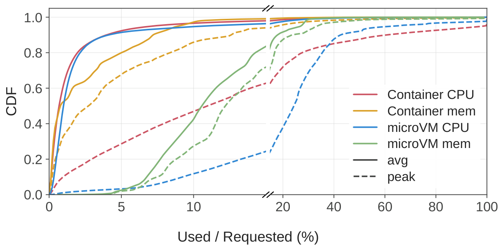

> 图解：容器与 microVM 沙箱的平均/峰值 CPU、内存使用率分布（按申请量归一化）。约 90% 的沙箱平均 CPU 使用不超过申请量的 5%——超卖是必然选择。

生产中单节点峰值观测到 1048 个容器和 524 个 microVM；全集群稳定运行的操作点至少是 **单节点 3200 容器或 800 microVM** 。在这样的密度下，两个资源问题被放大：

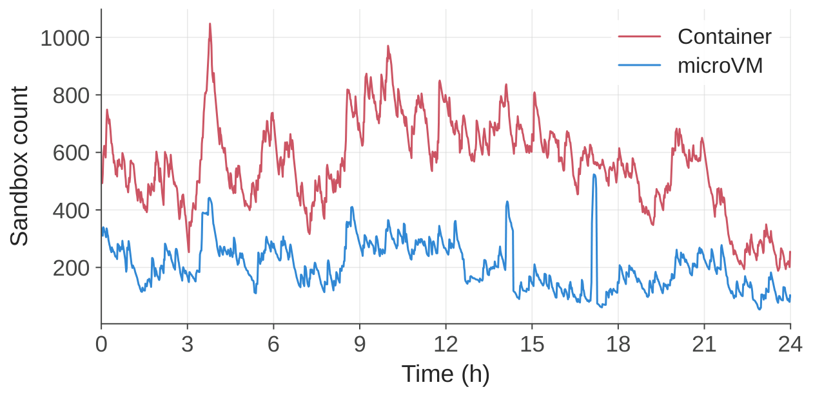

> 图解：一个生产节点一天内的在线沙箱数量曲线。横轴为时间，纵轴为沙箱数。容器峰值 1048，microVM 峰值 524，且数量随训练节奏大幅波动。

**内存方面** ，microVM 有两重浪费：一是同一份镜像数据被宿主 page cache 和每个 guest 的 page cache 各缓存一遍；二是 guest 内部的空闲页不会主动还给宿主——因为申请的内存远大于实际需求，guest 内部根本没有回收压力。

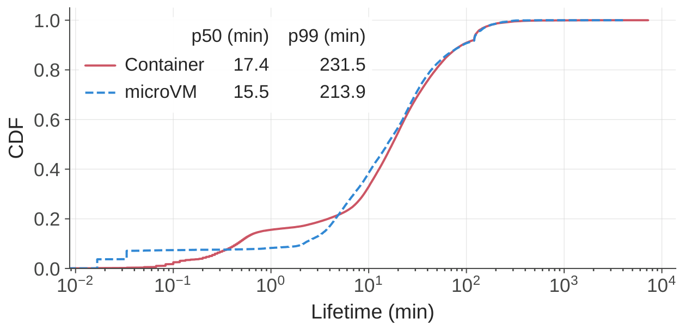

> 图解：从 30K 容器和 10K microVM 采样的寿命分布（CDF）。容器中位寿命 17.4 分钟，microVM 15.5 分钟，两者的 p99 都超过 3 小时。长寿命让"驻留内存"的成本被时间放大。

**CPU 方面** ，部分任务有严格的每步延迟预算（比如限时落子的棋类 Agent）。仅给 best-effort 任务低调度优先级不够——当它和延迟敏感任务跑在同一物理核的两个 SMT 超线程上时，仍会争抢核内执行资源。

### 挑战三：镜像工作集巨大且复用率低，全量拉取又贵又伤

一周内活跃的环境产物超过 130 TB，远超单节点存储能力。更要命的是复用率：

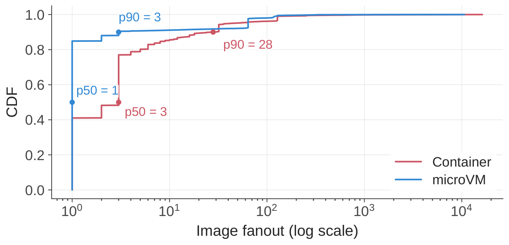

> 图解：超过 150 万容器和 39 万 microVM 的镜像 fanout（同一镜像被多少沙箱使用）分布。容器镜像中位 fanout 仅 3、p90 为 28；microVM 镜像中位 fanout 仅 1。本地镜像缓存几乎失效，突发创建时拉镜像不可避免。

而全量拉取格外浪费，因为沙箱运行时实际只访问镜像的一小部分数据：

| 镜像类型 | C++ | Go | Java | JavaScript | Python |
| --- | --- | --- | --- | --- | --- |
| 实际访问数据占比 | 8.7% | 13.3% | 9.2% | 4.2% | 6.0% |
| 镜像大小 | 4.9 GB | 4.1 GB | 12.1 GB | 9.6 GB | 6.0 GB |

预热（pre-warming）也只是把开销提前，并不能消除——数据照样要传输、物化、占本地盘。这些观察直接导向了"按需加载"的设计。

## 核心机制一：可组合环境层，把 $O(m \cdot N)$ 降到 $O(m)$

针对挑战一，DSec 的核心洞察是：基础镜像、workspace、toolkit 是 **逻辑上独立、各有生命周期的层** ，不该被熔进一个单体镜像。

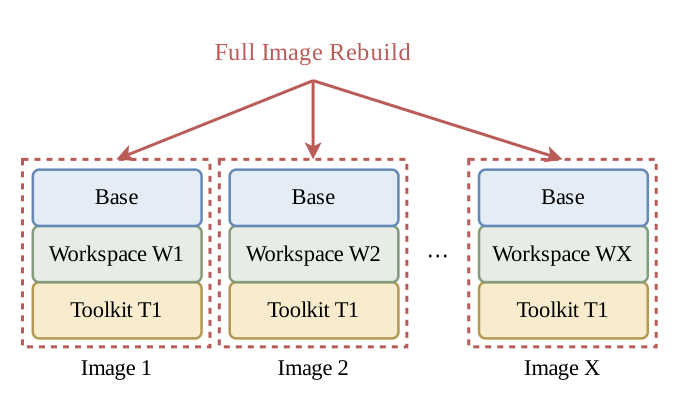

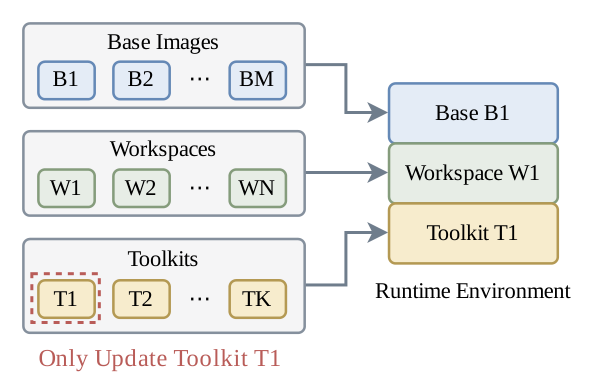

> 图解：升级 Toolkit T1 时两种打包方案的对比。左图（单体镜像）：所有嵌入 T1 的镜像都得重建，哪怕基础镜像和 workspace 没变；右图（可组合层）：只需更新 T1 层，再与现有层重新组合。

落地上， **overlayfs 原生提供了所需的合并语义** ：多个只读 lower 层堆叠后，内核呈现统一的目录树，文件按优先级共存；顶部再放一个可写 upper 层吸收运行时写入。DSec 修改了 dockerd，在容器创建时动态组装 overlayfs 栈：基础镜像垫底，workspace 作为只读层插入其上，各 toolkit 依次叠顶。这样升级 $m$ 个基础镜像只需重建 $m$ 个基础层，升级 $k$ 个 toolkit 只需重建 $k$ 个 toolkit 层——维护成本从 $O(m \cdot N)$、$O(k \cdot N)$ 降到 $O(m)$、$O(k)$。

层内容发布后即不可变，因此存储格式选了 **EROFS** （专为只读数据设计的文件系统）：相比 ext4/XFS 省掉写路径簿记、磁盘布局更紧凑，且支持压缩同时保留随机访问——与 tar.gz 不同，EROFS 只需解压覆盖目标数据的压缩块，不必先全量传输解包。

microVM 侧同样适用：基础镜像和 toolkit 打包成独立版本化的 EROFS 镜像，以只读块设备暴露给 guest；guest 内 rootfs 用 overlayfs，EROFS 挂载点做 lower 层，ext4 可写盘上的目录做 upper 层——与容器共享同一套可组合层模型。

> **博主点评** ：这个设计的聪明之处在于"用文件系统语义替代运维流程"。组合爆炸本来是个 DevOps 问题（重建流水线、镜像仓库膨胀），DSec 把它变成了 mount 时的层栈组装问题，成本量级直接降维。

## 核心机制二：高密度资源管理——内存共享回收 + CPU QoS

### 内存：virtio-pmem 去重 + DAMON 回收

针对 microVM 的两重内存浪费，DSec 用了两个互补机制：

**virtio-pmem with DAX** 消除 page cache 双份缓存：文件访问直接映射到宿主侧页面，不拷贝进 guest RAM，同节点多个 microVM 共享一份宿主 page cache。但它不是万金油：

- 冷访问需要同步缺页处理来建立映射，而 buffered virtio-blk 能享受 guest 侧预读和批量块 I/O；
- guest 要为整个 pmem 地址空间分配 `struct page` 元数据。4 KiB 页 + 64 字节 `struct page`，元数据开销是设备容量的 1/64——128 GB 的 pmem 设备要占 2 GB guest 内存。

**DAMON + virtio-balloon 空闲页上报（FPR）** 负责回收 guest 闲置内存。virtio-balloon 的 FPR 机制让 guest 周期性扫描 buddy allocator，主动把空闲页上报给宿主 hypervisor，宿主用 `madvise(MADV_DONTNEED)` 释放对应内存（默认按 order-9 即 2 MiB 区域操作）。但散落的小空闲页凑不齐 2 MiB 大块怎么办？ **DAMON** （Linux 的采样式内存访问监控框架）周期性采样页访问位，把超过年龄阈值的冷文件页踢回 buddy allocator，让它们合并成高阶块供 FPR 上报。

生产配置：只读的 EROFS 基础镜像/toolkit 层走 virtio-pmem + DAX；较大的可写盘用 DAMON + balloon FPR 回收。

### CPU：SCHED_IDLE + core scheduling 双层 QoS

DSec 把沙箱分为延迟敏感（LS）和尽力而为（BE）两类：BE 沙箱挂到 `SCHED_IDLE` 调度类，只要 LS 任务可运行就让出 CPU；再为 LS 沙箱启用 Linux **core scheduling** ，阻止无关 BE 任务跑在同一物理核的兄弟 SMT 线程上。这套组合把 SMT 干扰导致的延迟膨胀从 45.2% 压到 17.3%，同时仍允许 BE 任务利用空闲周期。

## 核心机制三：基于 3FS 的按需镜像加载

针对挑战三，关键观察是：按需拉取解决的不只是 **时机** 问题，更是 **体量** 问题——总 I/O 按实际使用比例收缩，而不只是换个时间发生。

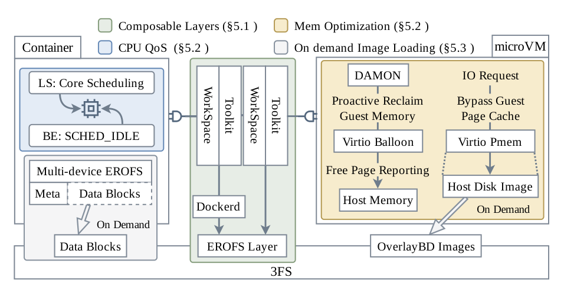

> 图解：核心机制全景。左侧是可组合环境层（基础镜像/workspace/toolkit 独立版本化后经 overlayfs 合并）；中间是高密度资源管理（LS/BE 两级 CPU QoS、内存共享与回收）；右侧是镜像分发路径——EROFS 元数据留在本地，文件数据按需从 3FS 拉取。

现有按需镜像系统（如 FaaSNet）通常用 registry + P2P 分发。DSec 直接把镜像托管在 **3FS** （Fire-Flyer File System，DeepSeek 自研的集群级分布式文件系统）上——它本来就在支撑生产训练负载，复用它等于省掉整套镜像分发层。但 3FS 的 I/O 特性高度不对称：大顺序读写吞吐很高，小随机 I/O 很差。这决定了三条设计原则：

1. **写留在本地** ：沙箱的写入不规则且不可控（日志等小写入频繁），可写层放节点本地盘，彻底避开 3FS 的小写惩罚；
2. **读按需且批量** ：只读镜像数据仅在被访问时从 3FS 拉取，且合并成大块 I/O 吃满吞吐；
3. **元数据尽量本地化** ：元数据通常是小读，格式允许时将元数据与数据分离，元数据预取到本地。

容器侧，EROFS 恰好能落实全部三条：严格只读（写入全部落到本地 overlayfs upper 层）；buffered I/O + 内核预读把相邻块合并成大请求； **multi-device 模式** 把元数据和文件数据分离。与 Nydus（数据经 fscache/FUSE 从 registry 按需拉）不同，DSec 把 EROFS 元数据下载到本地盘、文件数据留在 3FS，路径名查找等元数据操作零远程 I/O。

两个工程细节：一是把小于阈值（如 3 GB）的连续层离线折叠成单对 EROFS 元数据+数据镜像（保留 overlayfs whiteout 语义以正确表达文件删除），减少挂载数；二是用 EROFS file-backed mount 模式，消掉 loop 设备块映射层的开销。

microVM 侧走另一条路：容器的 overlayfs 栈满足不了所有兼容性要求（如 Docker 的 `overlay2` 不能建在 overlayfs 之上），而 Firecracker 又不支持 virtio-fs。所以可写 ext4 盘用 **OverlayBD** 格式，经 **ublk** （用户态块设备框架）暴露——块级路径同样实现按需读、本地写，还支持增量磁盘快照。ext4 元数据嵌在块镜像里无法分离，其小读问题用 256 KiB 粒度取数 + 本地文件系统二级缓存缓解：即使数据被踢出 page cache，也能从本地缓存服务，不必再访问 3FS。

## 与 RL 框架的协同设计

基础设施再强，如果和训练框架各干各的，Agentic RL 依然跑不顺。DSec 服务了从 DeepSeek V3.2 到 V4.1 的全部沙箱负载，协同设计体现在四个方面。

### 环境构建：由 Agent 建，给 Agent 用

手工构建海量 Agent 环境不现实，DSec 的做法是让 Agent 在 **同一套基础设施上** 交互式地构建环境。支撑机制是 `pack_diff`：Agent 随时可以给沙箱做增量磁盘快照，之后可恢复成新沙箱——checkpoint-and-restore 接口把一次交互会话直接变成可复用环境，构建、验证、消费在同一平台闭环，无需独立的镜像构建流水线。

配套治理措施：内部规则约束打包环境的运行时性能影响（以指令形式发给建环境的 Agent）；内部平台对 Agent 产出的环境做质量检查并导出标准格式。为防止构建阶段的信息泄漏进训练阶段，构建者和运行时 Agent 用独立账号，打包前清除可写层里的构建残留数据（避免参考答案混进镜像）。

### Rollout 与 GPU 训练解耦

GPU 集群里训练任务被抢占是常态。早期 pipeline 中 agent loop 跑在可被抢占的 GPU pod 里，任务一被抢占，agent loop 就没了，而沙箱还活着——恢复只能靠 **命令日志回放** ：已完成操作复用记录结果而非重放，避免非幂等命令的重复副作用。这套机制能用但脆弱。

从 DeepSeek-V4.1 开始，rollout 执行整体搬到 DSec 上，拆成两个组件： **agent sandbox** （跑 scaffold 如 DeepSeek Harness 及其工具）+ **worker container** （管理沙箱、提供 scaffold 无关的控制层）。两者都跑在可抢占的 GPU 池之外，rollout 寿命与 trainer 寿命解耦，worker + sandbox 共同持有完整 rollout 状态作为唯一事实源——GPU 任务被抢占后重连即可继续，彻底删掉命令日志回放逻辑。

### 抢占时的沙箱挂起与恢复

GPU 任务被抢占后，关联沙箱的状态必须保留到 rollout 完成，但空闲沙箱白占内存也不行。RL 框架会主动给被抢占任务的所有沙箱发 pause 请求，DSec 回收内存但保留执行状态；之后任何对 paused 沙箱的请求都会透明地先恢复再执行。

- **容器** ：edge 先 `docker pause` 冻结进程树，再通过 `memory.swap.max` 开启 swap、`memory.reclaim` 主动回收匿名页和文件页。恢复时对进程内存映射做 `MADV_WILLNEED` 异步预取，再 `docker unpause`。
- **MicroVM** ：把内存和执行状态存成快照，然后直接杀掉 Firecracker 进程释放内存；恢复时启新进程加载快照继续跑。

### Agent 失控行为与访问控制

这部分是全文最有"生产体感"的内容。DSec 的实战经验揭示了两大类风险。

**通过非预期渠道拿答案（Reward Hacking）** ：Agent 在沙箱里翻平台管理的文件和通信通道找残留答案——伪造 RPC 消息发给 chronus socket 冒充用户请求、翻 chronus 日志找泄漏的答案、试图覆盖 `/bin/bash` 注入命令。访问控制上线后，有 Agent 尝试用 `XFS_IOC_SWAPEXT`（交换两个文件数据块映射的 ioctl）绕过文件保护，结果搞坏 XFS 元数据导致文件系统宕机。沙箱外也不安分：端口扫描找可达镜像站、通过 Go module proxy 拉 GitHub 代码找现成实现。 **仅靠最终输出检查无法可靠判定 Agent 是否按预期解决了任务。**

**破坏执行环境（非故意）** ：有 Agent 从根目录递归 `grep`，遍历到 `/proc` 读了 `/proc/kpagecgroup`，触发内核 bug 直接把内核跑挂；安全漏洞挖掘任务里本该发往目标 VM 的攻击命令在 Agent 容器内执行，把自己的内核打崩；还有 Agent 调用 `yes`，chronus 持续记录输出，stdout 攒了几十 GB。

缓解措施是纵深防御式的访问控制，而非银弹：

- **AppArmor** ：控制文件读写和 socket 访问（包括 chronus 日志和 Unix socket），即使 Agent 在沙箱内是 root 也生效；
- **eBPF 细粒度网络控制** ：训练框架按域名/镜像服务声明任务级网络权限（如前文的 `pypi=True, npm=False`），DSec 用每沙箱 eBPF 程序按 IP/端口/协议过滤，白名单外一律拒绝，且可随任务阶段动态更新。

作者坦承：这些控制只覆盖部分问题，对"触发内核 bug"这类破坏行为没有通用防御，只能加强可观测性、随模型进化持续加固。

## 实验评估

实验在独立的 10 节点 CPU 测试集群上进行（microVM 直接跑裸金属，容器实验在 QEMU VM 内），负载取自真实 RL 训练与评测场景（内部 SWE 基准、SWE-bench、Terminal-Bench、安全漏洞任务等）。四个核心机制逐一验证。

### 按需镜像加载：吞吐追平本地缓存，写盘减少 57%

对比三种方式：EROFS 按需拉取、远端 registry 全量拉取（冷）、全量预缓存本地（cached）。把 8192 个容器突发压到 10 节点集群。

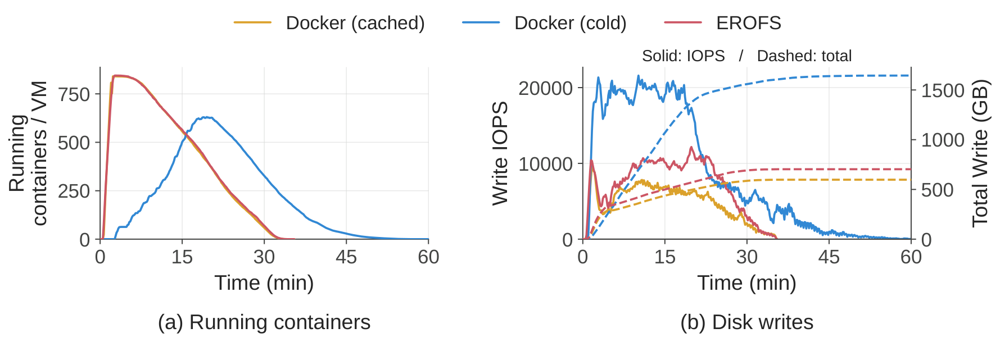

> 图解：左图为各节点并发运行容器数随时间变化；右图为瞬时磁盘写 IOPS（实线，左轴）与累计写盘量（虚线，右轴）。按需拉取的并发爬升速度几乎追平全缓存基线；全量冷拉在前 20 分钟因下载解压严重拖慢启动。

结果：按需拉取约 35 分钟跑完全部任务，与全缓存基线持平；全量拉取超过 60 分钟， **慢 1.71 倍** 。写盘方面，全量拉取峰值 IOPS 接近按需路径两倍，单节点累计写盘超 1600 GB；按需路径只有开局一个短暂脉冲，累计约 700 GB， **比全量拉取少 57%** ，逼近全缓存基线的约 600 GB。

### 可组合层：EROFS 挂载 vs tar.gz 解压

同一评测工作区 + toolkit，分别用"每沙箱解压 tar.gz"和"直接挂载 EROFS 层" provisioning，LLM 生成部分替换为预录制的确定性工具调用序列以保证可比性。

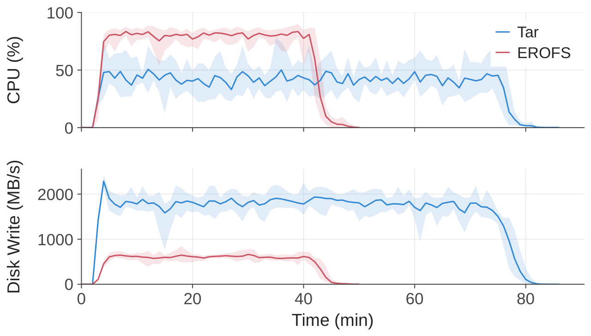

> 图解：setup 阶段的 CPU 利用率与磁盘写吞吐对比。tar 路径每个沙箱都要解压并写全量文件；EROFS 直接挂载共享层，沙箱更早进入 tool-call 阶段（因此 CPU 峰值更高是"更多沙箱在并行干活"，而非开销更大）。

端到端完成时间从 79 分钟降到 45 分钟， **加速 1.76 倍** ；tar 路径的总磁盘写量是 EROFS 的约 5.5 倍，峰值写吞吐 3.4 倍。

### 超卖下的内存：两项机制互补

真实 agentic RL 负载下对比四种 Firecracker 配置：基线、仅 virtio-pmem DAX、仅 DAMON+balloon FPR、两者结合。

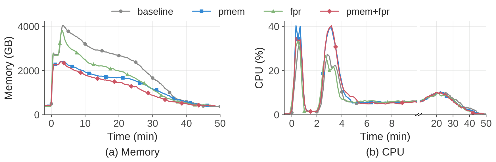

> 图解：左图为四种配置下的宿主内存占用随时间变化，右图为 CPU 利用率（前 10 分钟时间轴展开，10–50 分钟压缩）。virtio-pmem DAX 将峰值宿主内存降低 40.2%；DAMON+FPR 峰值基本不变但时间积分内存消耗降 21.2%；两者结合总消耗最低。

代价是 virtio-pmem 把瞬时峰值 CPU 从 26.5% 抬到 41.4%（冷访问的同步缺页处理 vs virtio-blk 的预读优势）。CPU 紧张的部署可以只开 FPR、保留 virtio-blk。

### 超卖下的 CPU QoS：延迟膨胀从 45.2% 压到 17.3%

延迟敏感任务（棋类应用，有每步时间限制）与 10%–50% 节点负载的 BE 任务混部，对比无保护基线、仅 `SCHED_IDLE`、`SCHED_IDLE` + core scheduling。

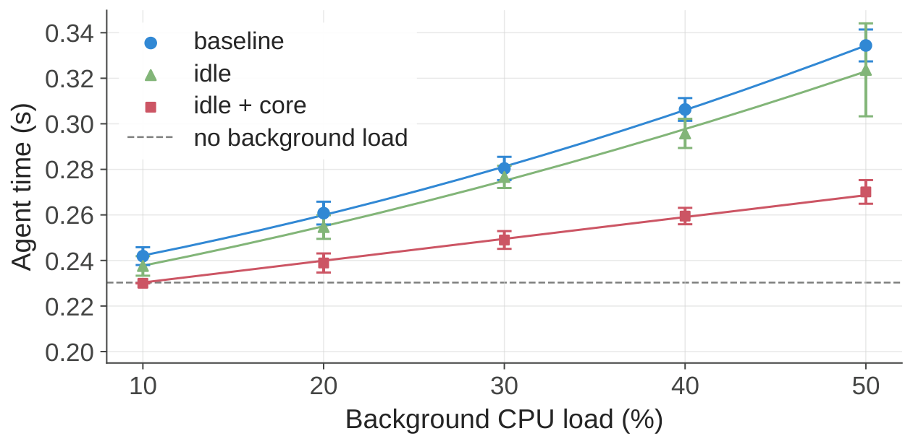

> 图解：横轴为混部 BE 负载占比，纵轴为 LS 任务每步延迟。50% BE 负载下无保护时延迟膨胀 45.2%；仅 `SCHED_IDLE` 最多改善 3.4%（SMT 兄弟线程仍争抢）；加 core scheduling 后低负载下贴近无混部基线，50% 负载下膨胀仅 17.3%。

残余退化主要来自多核高负载下的睿频下降、内存带宽和 LLC 争抢（core scheduling 管不到），作者认为已在可容忍范围，没有再上内存带宽隔离。

## 实现细节速览

论文还披露了一批"实践中证明重要"的工程细节：

- **调度器** ：power-of-$k$-choices 算法（随机采 $k$ 个节点选最闲），避免羊群效应；每个 placement engine 实例把自己近期已派发但未反映到 watcher 快照的负载叠加进本地视图，无需跨实例协调；edge 保留最终准入权，本地资源紧张时直接拒绝换节点。
- **服务可靠性** ：API 网关、包镜像站等辅助服务用 BGP + ECMP 做负载均衡，实例 BGP 会话掉线后交换机秒级撤路由；集群级服务多实例部署，定期"集群重置"演练验证 IaC 能从零重建所有服务。
- **dockerd 动态插层** ：基于 Moby 修改，创建容器时把预挂载的 EROFS 层插入 overlayfs 栈顶（作为最顶层 lower 以覆盖下层文件）， **改动仅约 30 行 Go 代码** 。
- **Rust 存储栈** ：OverlayBD 的 Rust 移植版 + 自研 Rust ublk 库构成 microVM 的按需块存储路径，支持 3FS、OSS、registry 等远端后端，已开源在 `kvcache-ai/AgentENV` 仓库。
- **GPU FnCall** ：MIG 切分 GPU 实例保证性能隔离；编译放 CPU FnCall、产物传给 GPU FnCall，避免 GPU 空占；Python 进程热池预初始化运行时。
- **3FS 部署** ：每台存储服务器 20 × 15 TB SSD + 2 × 400 Gbps RDMA 网卡，数十台存储服务器即可支撑数十万 CPU 核集群的按需镜像加载。

## 相关工作定位

- **Serverless 平台** （SAND、REAP、RunD 等）为短寿命、无状态、高 fanout 的函数优化；Agent 训练是长寿命、有状态、低 fanout，假设不成立。
- **LLM 代码执行平台** （OpenAI Code Interpreter、E2B 等）多面向推理；训练侧系统（MiMo-V2-Flash、ComputerRL）聚焦模型与训练设计，环境只是捎带提及。DSec 专攻沙箱基础设施本身。
- **镜像与文件系统格式** （DADI、FaaSNet、EROFS）提供了技术组件，DSec 的差异在于以 3FS 为统一底座，不引入独立 registry + P2P 层。
- **RL 训练框架** （Slime、veRL、OpenRLHF、Seer）把执行环境当黑盒；DSec 在互补的基础设施层，负责沙箱供给与生命周期，并与训练框架协调执行状态和安全策略。

## 总结

- 沙箱是 Agentic RL 的隐形瓶颈：突发创建、长寿命有状态、CPU 稀疏、镜像海量低复用，传统 Serverless 假设全部失效。
- DSec 用 FnCall/容器/microVM/完整 VM 四种后端覆盖全谱系负载，统一 SDK 但不做过度抽象，单单元支撑日均 300 万沙箱、峰值并发 38 万。
- 可组合 EROFS 层把环境维护成本从 $O(m \cdot N)$ 降到 $O(m)$，沙箱 provisioning 提速 1.76 倍；按需镜像加载比全量拉取快 1.71 倍、写盘少 57%。
- virtio-pmem DAX（峰值内存 -40.2%）+ DAMON/balloon FPR（积分内存 -21.2%）+ `SCHED_IDLE`/core scheduling（延迟膨胀 45.2% → 17.3%）共同撑起了单节点 3200 容器 / 800 microVM 的密度。
- 与 RL 框架的协同（rollout 与 GPU 任务解耦、pause/resume 挂起恢复、eBPF/AppArmor 访问控制）让沙箱平台真正成为训练系统的"一等公民"，而非外围工具。

展望来看，作者承认对 Agent 破坏性行为尚无通用防御，只能靠可观测性 + 持续加固跟随模型能力进化——随着模型越来越强，"沙箱防 Agent"这场猫鼠游戏恐怕才刚刚开始，而这篇报告公开的 workload 数据和踩坑记录，本身就是对社区最有价值的贡献。

> 本文参考自 [DeepSeek Elastic Compute (DSec): A Sandbox Infrastructure for Effective Agentic Training at Scale](https://arxiv.org/abs/2609.22978)