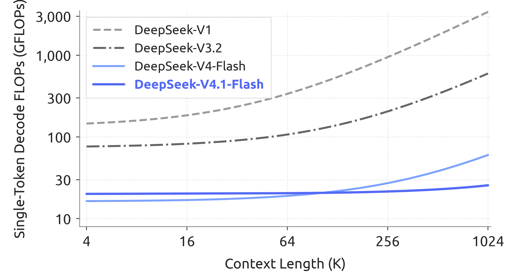
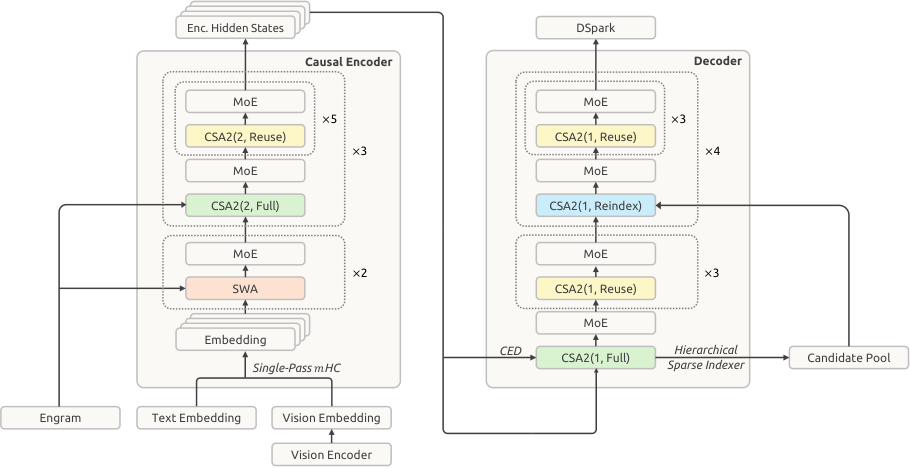
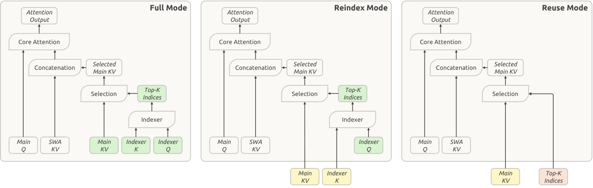
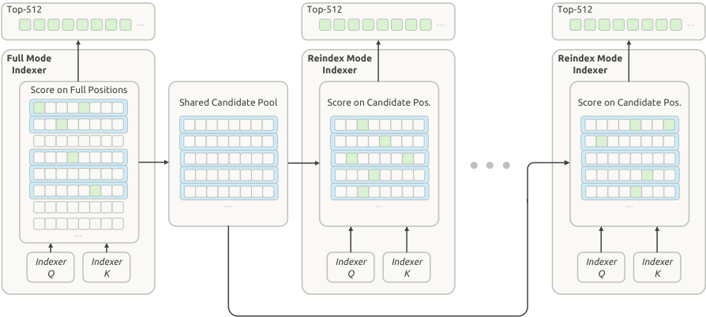
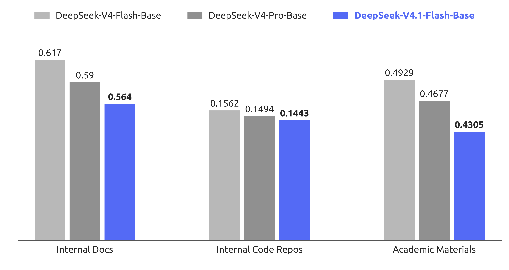
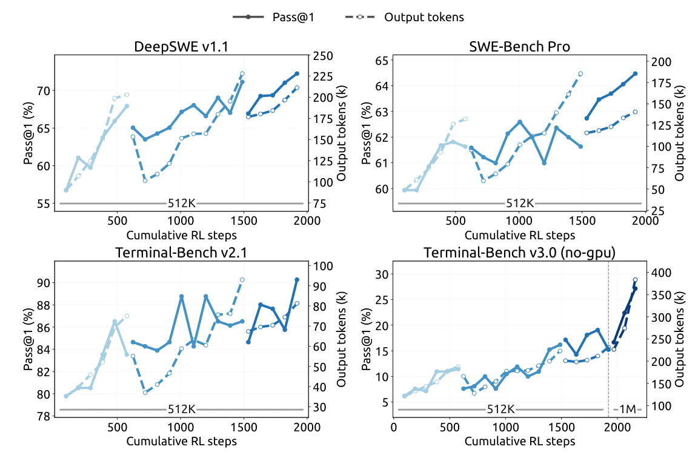
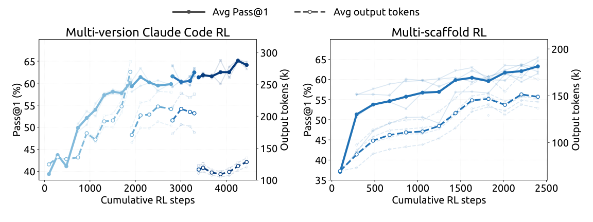
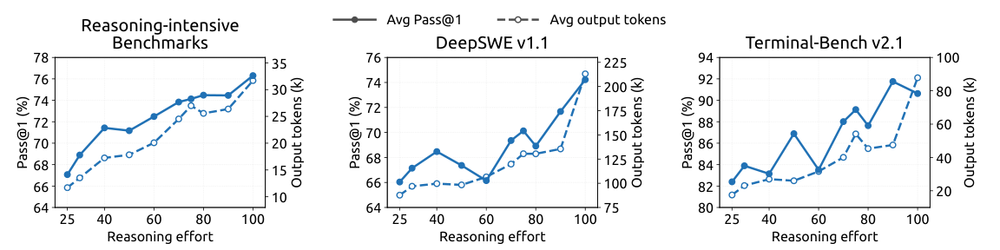
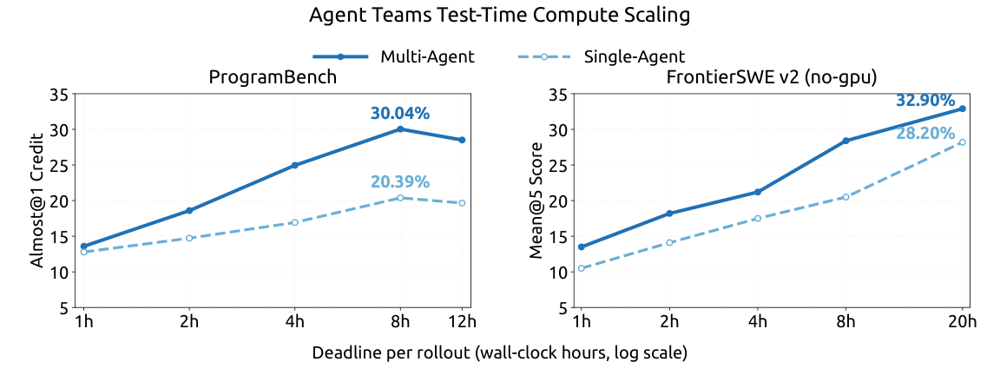

# DeepSeek-V4.1-Flash 深度解读：把 KV Cache 压缩到极限的百万上下文 MoE 模型

在长上下文 Agent 越来越普及的今天，模型的工作负载正变得越来越 "输入重"（input-heavy）：动辄几十万 token 的上下文要 prefill，海量的 KV Cache 要存进 HBM、写到 SSD、在机器之间搬来搬去。虽然稀疏注意力已经把长序列的计算成本打下来了，但 **存储和带宽** 正在成为新的瓶颈。

DeepSeek-V4.1-Flash 这篇技术报告，就是围绕 "如何把 KV Cache 压到极限" 这个主题展开的一次系统性工程：一个 552B 骨干参数、原生多模态、支持 **100 万 token 上下文** 的 MoE 模型，prefill 时每个 token 只激活 8B 参数、decode 时激活 16B，全局 KV Cache 压到 **每 token 仅 890 字节** —— 约为 DeepSeek-V4-Flash 的 1/4，相比 DeepSeek-V1 更是降了 **437 倍**；持久化 KV Cache 则降到 V4-Flash 的约 **1/8**。更关键的是，压缩了这么多，性能反而更强了。

这篇文章我们就按照 "提出问题 → 架构方案 → 训练与推理系统 → 实验验证" 的逻辑，把这篇报告完整拆解一遍。

## 一、问题：长上下文时代的三重瓶颈

先厘清论文反复提到的两个概念：

- **Runtime KV（运行时 KV）**：推理时驻留在 HBM 里的 KV Cache，受限于显存容量。DeepSeek-V4 采用 "全局注意力分支 + 局部滑动窗口注意力（SWA）" 的混合设计，其中 SWA 的存储量与序列长度无关，因此长序列下 **全局 KV 主导了运行时占用**。
- **Persistent KV（持久化 KV）**：为了前缀复用（prefix reuse）而落到 SSD 或主机内存里的 KV Cache，受限于 SSD/内存容量和 I/O 带宽。

长上下文 Agent 场景下，计算、存储、带宽这三座大山共同限制了服务吞吐、抬高了部署成本。DeepSeek-V4.1-Flash 的应对是三条战线同时开刀：

1. **架构层**：Causal Encoder-Decoder（CED）砍掉近一半 prefill 计算；Compressed Sparse Attention 2（CSA2）做跨层 KV 复用。
2. **精度层**：全局 KV Cache 直接上 FP4。
3. **部署层**：SWA Bounded Replay，让持久化缓存彻底摆脱 SWA KV。

最终效果：上下文从 4K 拉到 1M（256 倍），单 token decode 的 FLOPs 只涨了 1/4。

> 图解：横轴是上下文长度（对数刻度，从 4K 到 1M），纵轴是单 token Decode FLOPs（按 BF16/FP8/FP4 分别以 1/0.5/0.25 加权折算）。可以看到 DeepSeek-V4.1-Flash 的曲线几乎是平的 —— 上下文扩展 256 倍，计算量只增加约 25%，远低于 V4-Flash 的增幅。这正是 CSA2 稀疏注意力 + 分层索引带来的收益。

## 二、整体架构：CED + CSA2 + 一系列高效组件

> 图解：40 层因果 Transformer 被分为 20 层因果 Encoder（下）和 20 层 Decoder（上）。前两层只用滑动窗口注意力（SWA），其余层使用 CSA2，图中 CSA2(ratio, mode) 标注了每层的压缩率和运行模式（Full / Reindex / Reuse）。所有 FFN 都是标准 DeepSeekMoE。此外还集成了 Single-Pass mHC、Engram 条件记忆模块、DSpark 投机解码和分层稀疏索引器（Hierarchical Sparse Indexer）。

几个关键数字：

- **552B** 骨干参数 + **196B** Engram 参数；
- prefill 每 token 激活 **8B**，decode 每 token 激活 **16B**（CED 带来的不对称激活是本文一大亮点）；
- 40 层、隐藏维度 5120，每层 MoE 含 1 个共享专家 + 384 个路由专家（每 token 激活 6 个），SWA 窗口 $n_{\mathrm{win}} = 128$；
- 视觉侧是从零训练的 DeepSeek-ViT（32 层、隐藏维度 1024），经 $3\times3$ pixel-unshuffle 把视觉 token 数压缩 9 倍，最高支持约 $1344\times1344$ 分辨率输入。

### 2.1 多模态架构与负载均衡

视觉路径是 "DeepSeek-ViT + MLP projector"：ViT 输出空间网格特征，经 pixel-unshuffle 降采样后由 MLP 映射到语言骨干的隐藏维度，再插入到对应的图像 token 位置。ViT 本身做了几处向 LLM 看齐的改造：用 2D-RoPE 替换绝对位置编码以支持任意分辨率；把 patch embedding 的卷积换成线性投影以兼容 Muon 优化器；归一化用 RMSNorm、激活用 SwiGLU。

MoE 路由上还有一个细节：图像 token 和文本 token 的表示分布差异很大，混在一起做负载均衡会掩盖模态内部的不均衡。因此 V4.1 把 **Auxiliary-loss-free 负载均衡** 扩展为模态感知版本 —— 为文本和图像 token 各维护一套专家偏置（bias），路由选择用各自模态的偏置，但专家输出加权仍用原始 routing score，两套偏置按各自模态的专家负载独立更新。

### 2.2 Causal Encoder-Decoder（CED）：prefill 计算砍半

Agent 工作流里频繁的工具调用会产生大量 prefill 请求，KV Cache 未命中时计算开销巨大。CED 的灵感来自 YOCO，但做了结构性增强。

核心思想：对全局注意力而言，把下面 $L/2$ 层当作因果 Encoder，上面 $L/2$ 层（Decoder，$l > L/2$）的 KV **不再从本层隐藏状态生成**，而是直接从 Encoder 最后一层的隐藏状态 $H_{L/2}$ 投影出来：

$$
C_l = H_{L/2} W_l^{KV}, \quad Z_l = H_{L/2} W_l^{Z}, \quad l > \frac{L}{2}
$$

其中 $C$ 是 KV 条目，$Z$ 是对应的压缩权重。这样一来，prefill 阶段只需跑完前半部分层，就能以极低成本拿到上半部分所有层的全局 KV。

但 SWA 是逐层计算的，Decoder 的 SWA KV 仍依赖各层自己的隐藏状态。如果精确重建，需要额外处理 $n_{\mathrm{win}} \times L/2$ 个 token。论文引用先前工作的观察：SWA 的实际有效感受野远小于理论值 $n_{\mathrm{win}} \times L/2$。于是提出 **Decoder SWA Bounded Replay**：只对 prompt 的最后 $n_{\mathrm{win}}$ 个 token 跑 Decoder 的 SWA 计算，把代价从 $O(L \cdot n_{\mathrm{win}})$ 降到 $O(n_{\mathrm{win}})$。

综合下来，对 $N \gg n_{\mathrm{win}}$ 的序列，CED 把 prefill 复杂度从 $O(NL)$ 降到：

$$
O\!\left(\frac{NL}{2} + n_{\mathrm{win}} \times \frac{L}{2}\right) \approx O\!\left(\frac{NL}{2}\right)
$$

即 prefill 计算近乎减半 —— 这解释了为什么 prefill 只激活 8B 参数而 decode 是 16B。

### 2.3 CSA2：三个维度联合压缩的稀疏注意力

KV Cache 的成本可以沿三个 **可乘的维度** 压缩：

- **条目大小**：GQA 减少 KV 头数、MLA 在头间共享 latent；
- **序列维度**：每 $m$ 个 token 压成一条（CSA/HCA 的做法）；
- **层维度**：一些层复用其它层的 cache 和选择结果。

此前的工作（IndexCache、YOIO、HySparse 等）都只覆盖了其中一两个维度：只复用索引省不了主 KV 存储，全网共享路由会掉点，混合设计还留着全注意力层。CSA2 的思路是 **三个维度联合利用**，并且把 "缓存共享" 和 "索引复用" 解耦。

相比 V4 的 CSA，CSA2 还做了两处简化：去掉了压缩时的重叠窗口和绝对位置嵌入（原来压缩率 $m$ 时每条主 KV 由 $2m$ 条原始 KV 重叠生成）；indexer K 改为直接从主 KV 投影，取代了从隐藏状态单独压缩的路径。实现更简单，训练效率更高。

> 图解：CSA2 每层静态指定三种模式之一，区别在于 main KV、indexer K 和 Top-K 索引的来源。绿色块表示当前层计算的量；黄色块表示复用自最近一个 Full Mode 层的 main KV 和 indexer K；红色块表示复用自最近一个产生索引的层（Full 或 Reindex）的 Top-K 索引。三种模式下，每层都保留自己的 main Q 和 SWA KV。

三种模式具体分工：

- **Full Mode**：完整执行 CSA2 全流程 —— 自己算 main KV、indexer Q，从 main KV 投影出 indexer K，跑索引产生全新的 Top-K。职责等价于 V4 中一个完整的 CSA 层。
- **Reindex Mode**：复用前一层的 main KV 和 indexer K，但用自己的 indexer Q 重新打分，产出 **新的 Top-K 索引**。缓存共享的同时，让稀疏选择可以随层变化。
- **Reuse Mode**：main KV 和 Top-K 索引都复用，直接做稀疏注意力，连 indexer Q 都不算。

与 CED 结合时，Decoder 中被指定为 Full Mode 的层从 Encoder 最后一层隐藏状态 $H_{L/2}$ 计算全局 KV，Reindex/Reuse 模式不变。

具体配置上：Encoder 的 18 个 CSA2 层压缩率 $m=2$，分 3 组 × 6 层，每组 1 个 Full + 5 个 Reuse；Decoder 的 20 层压缩率 $m=1$，分 5 组 × 4 层，第一组为 1 Full + 3 Reuse，其余四组为 1 Reindex + 3 Reuse。索引器 32 头、头维 128，每个 query 选 Top-512 条目。

### 2.4 Hierarchical Sparse Indexer：把索引成本变成常数

跨层索引复用减少了索引器的执行次数，但剩下的索引器仍要对整个因果可见上下文打分，超长上下文下这依然是大头。V4.1 在 Decoder 里引入分层稀疏索引：第一个 Full Mode 层为每个 query 构建一个 **候选池**，后续 Reindex 层只在池内搜索。

具体做法：该层先对所有因果可见位置打分选出自己的 Top-K，同时做块级候选筛选 —— 每个块取其内部最大索引分数，选出得分最高的块（最多 2048 块 × 8 位置 = 16384 个候选位置），构成候选池。后续 Reindex 层只在池内打分选 Top-K；Reuse 层不做索引。

> 图解：每个方格代表一个位置，绿色方格是被选中的索引，蓝色矩形是按最大索引分数选出的块。Decoder 第一个 Full 模式层先选出自己的 Top-512，并基于选中的块构建共享候选池；后续 Reindex 层在这个池子里各自选 Top-512。对固定大小的候选池，深层索引器每个 query 的打分成本从 "随上下文线性增长" 变为 **常数**。这个机制是训练感知的，在后训练阶段引入，训练与推理使用完全相同的搜索域。

## 三、高效架构扩展：Single-Pass mHC、Engram、DSpark、FP4

### 3.1 Single-Pass mHC 与 Mega-mHC 内核

mHC 在相邻 Transformer block 之间维护 $n$ 条残差流 $X_l \in \mathbb{R}^{n \times d}$，更新规则为：

$$
X_{l+1} = B_l X_l + C_l \, \mathcal{F}_l(A_l X_l), \qquad (A_l, B_l, C_l) = \mathcal{H}(X_l)
$$

其中 $A_l \in \mathbb{R}^{1\times n}$、$B_l \in \mathbb{R}^{n\times n}$、$C_l \in \mathbb{R}^{n\times 1}$ 是从 $X_l$ 预测的逐 token 系数。

理论上，两个 block 之间的残差变换最少需要 $(n+1)d$ 次读 + $(n+1)d$ 次写，即激活内存流量下界 $(2n+2)d$。但 V4 的多 pass 实现里，"残差更新 → 系数预测 → 输入混合" 三个 kernel 因数据依赖必须串行，总流量达到 $(4n+4)d$，是下界的两倍。

瓶颈在于：输入混合 $\hat{X}_l = A_l X_l$ 要等系数 $A_l$ 算完（需要对隐藏维做完整归约），无法用同一趟遍历完成。Single-Pass mHC 的解法非常巧妙 —— **把输入混合系数错开一个 block**：

$$
X_{l+1} = B_l X_l + C_l \, \mathcal{F}_l(A_{l-1} X_l), \qquad (A_l, B_l, C_l) = \mathcal{H}(X_l)
$$

输入混合用的是上一个 block 产出的 $A_{l-1}$，不再依赖 $X_l$ 算出的系数，依赖链就此断开：$X_l$ 的每个 tile 算出来后可以立刻同时用于输入混合和系数预测。实验证明这个改动对性能的影响可以忽略。

部署侧配套了 **Mega-mHC** 融合内核：把残差更新、输入混合、系数预测（外加 pre-norm 和 FP8 转换）融进单个 kernel，按隐藏维分 tile 处理，残差只读一次、写一次，激活内存流量降到 $(2n+2)d$ 的理论下界 —— 相比原来的四 kernel 实现 **减半**。

### 3.2 Engram：196B 参数的条件记忆

Engram 是 DeepSeek 此前提出的条件记忆模块，用于把 "记忆" 与 "计算" 解耦。V4.1 沿用原设计（tokenizer 压缩、多头哈希、上下文感知门控、多分支集成），做了两处修改：去掉短因果卷积（收益不抵推理栈复杂度）；嵌入表改用动量更新 + Sinkhorn 均衡来优化（见第四节）。

配置上，196B 参数均分到两个模块，各用 $N$-gram 阶数 $\{2,3,4\}$、8 个哈希头、每阶总嵌入维度 2048，每头索引约 16M 条目的表（表长取互不相同的素数），嵌入表和 KV 投影均为 FP8。两个模块放在第 1 和第 14 层以平衡流水线各阶段的显存。推理时由于寻址是确定性的，嵌入可以通过后台 RDMA 从主机内存预取。

### 3.3 DSpark：半自回归投机解码

DSpark 取代了 V3 时代的 MTP 模块，是一个 "半自回归起草 + 置信度调度验证" 的投机解码模块：

- 起草器是 3 个 SWA（窗口 128）Transformer block，一次前向并行计算 5 个草稿位置的 base logits，另有一个轻量 Markov head 建模草稿 token 间的依赖；
- 置信度 head 预测每个位置的接受概率，用于估计前缀存活概率；
- 调度器结合实测的引擎吞吐曲线，**动态选择每个请求的验证长度**，在当前系统负载下最大化期望 token 吞吐。

与 MTP 不同，DSpark 在预训练结束后的独立阶段训练（冻结骨干）；后训练阶段继续与骨干一起训，但梯度不回传骨干，使其始终对齐当前 policy，可同时加速线上服务和 RL/OPD 的 rollout 生成。

### 3.4 FP4 主 KV Cache：为什么敢砍掉全局缩放因子

V4 已经对 indexer 的 Q/K 做了 FP4 量化感知训练（QAT），V4.1 把 QAT 扩展到 **主 KV Cache**。这里 FP4 的作用是省存储而非加速矩阵乘，因此可以在 attention 前反量化，用更准的格式而不需要硬件原生支持。

格式上选择了 E2M1 + 每 16 通道一个 E4M3 缩放因子（类似 NVFP4，但去掉了第二级全局缩放）。为什么敢去掉？论文给了一个漂亮的量级分析：训练出的 RMSNorm 权重最大幅值约 1，归一化后 512 通道 KV latent 的 L2 范数至多为 $\sqrt{512}$；RoPE 保范数，旋转后单通道最大绝对值也被约束在 $\sqrt{512} \approx 22.6$ 左右，训练中实测最大值约 10。而该格式能表示的最大幅值是：

$$
448 \times 6 = 2688
$$

动态范围绰绰有余，去掉全局缩放无损精度、还简化了缓存布局。量化在 RoPE 之后做（RoPE 前量化收益甚微且增加 decode 开销）；SWA KV 因对量化敏感仍保留 FP8。相比 V4 的 FP8 主 KV，存储近乎再砍半 —— HBM 和 SSD 都受益。

## 四、优化器：Head-wise Muon 与 Sinkhorn 均衡更新

V4.1 在优化配置上有两处新改动。

**其一，Head-wise Muon。** Query 权重按头拆开再分别做 Muon 更新。把 Muon 看作预条件梯度下降的话，原版 Muon 对所有注意力头共用一个预条件子，而 head-wise 版本给每个头独立的预条件子，能更好处理注意力头之间的异质性。实验上优于原版 Muon，GLM-5 和 Kimi-K3 也独立验证了这一点。

**其二，Sinkhorn 均衡更新。** Engram 嵌入表、token embedding 和预测头这些大矩阵如果上 Adam，优化器状态的显存开销太吓人。V4.1 改用 "动量 + Sinkhorn 均衡"：流程与 Muon 相同，只是把 Newton-Schulz 正交化换成 Sinkhorn 均衡。给定 Nesterov 动量更新 $\widehat{G}_t$，Sinkhorn 均衡寻找对角缩放矩阵 $D_r$、$D_c$，使更新矩阵的行列 RMS 大致归一：

$$
\Delta_t = \sqrt{n}\, U^{(K)} = \sqrt{n}\, D_r \widehat{G}_t D_c, \qquad \frac{1}{n}\sum_{j=1}^{n}(\Delta_t)_{ij}^{2} \approx 1, \qquad \frac{1}{m}\sum_{i=1}^{m}(\Delta_t)_{ij}^{2} \approx 1
$$

其中一行对应一个 token 或 n-gram，一列对应一个隐藏特征，Sinkhorn 均衡正是利用了这种 "token × 特征" 的双轴结构。实现上交替做行归一和列归一共 $K=11$ 步（奇数），对 $\rho_i \leq \tau \bar{\rho}$ 的近零行做掩码保证数值稳定，$\sqrt{n}$ 把单位行 $\ell_2$ 范数换算成单位行 RMS，再用学习率修正因子 $\gamma = 0.18$（接近 Moonlight 的 0.2）对齐 Adam 的更新幅度。这个方法和 Muon 一样只需要一个动量 buffer，实验上还优于 Adam。

其余配置：AdamW 管归一化层权重和非矩阵参数（$\beta_1=0.9, \beta_2=0.95$，weight decay 0.1）；Muon 管骨干线性层、Engram 投影和视觉-语言投影器（动量 0.95，RMS 缩放到 0.18）；Engram 学习率放大 5 倍。预训练前期冻结视觉编码器，学习率衰减阶段解冻并以较小学习率联合训练。

## 五、基础设施：训练与推理的协同优化

### 5.1 训练基础设施

**对比学习中的通信-计算重叠。** 视觉编码器先用 SigLIP 风格的 sigmoid 对比损失预训练，这要求图文特征在数据并行 rank 间 all-gather。关键在于：文本特征的梯度只依赖聚合后的视觉特征，反之亦然。于是两次 all-gather 可以分别藏进文本前向和文本反向里，完全被计算掩盖：

$$
\text{Fwd}(V) \rightarrow \bigl(\text{Fwd}(T) \,\|\, \text{AllGather}(V)\bigr) \rightarrow \nabla_{\text{Text}} \rightarrow \bigl(\text{Bwd}(T) \,\|\, \text{AllGather}(T)\bigr) \rightarrow \nabla_{\text{Vision}} \rightarrow \text{Bwd}(V)
$$

**端到端并行。** 采用解耦的 encoder 设计：视觉编码器在 LLM 参数树之外复制，每个训练 step 分为 "ViT 前向 → LLM 前/反向 → ViT 反向" 三段，LLM 阶段完全不含视觉计算，保持纯文本训练的并行策略。

**长序列多模态训练。** 百万 token 序列下多模态样本会带来沉重的 I/O、CPU 和内存瓶颈。对策一是 **均衡图像分片**：一条图像密集的超长序列可能压垮单台主机，因此把序列的图像按负载均衡分片到各 CP rank，每张图只加载一次。只要满足

$$
\rho < \frac{B_{\mathrm{IO}}}{B_{\mathrm{GPU}}} \, C
$$

加载就能完全藏在计算后面 —— 注意 $N$ 被约掉了，判据只涉及每 token 量（每 token 原始字节数 $\rho$ 和每 token 计算量 $C$），与序列长度和集群规模无关。对策二是 **增量图像传输**：RL rollout 只增量地把图片传给推理引擎，CPU 侧的解码和预处理结果缓存到分布式文件系统供复用。

**CSA2 的注意力共享训练。** 共享组件的层可能被分到不同流水线 stage，直接复用模块与常规 stage 局部执行不兼容。为此设计了三件套：**影子索引器**（每个参与 stage 放一个轻量可执行副本，参数有单一逻辑属主负责优化和 checkpoint）；**流水线 payload 扩展**（跨 stage 的中间表示和稀疏路由信息并入现有点对点通信路径，与上下文并行一致地切分）；**micro-batch 级共享状态管理**（跟踪并发 micro-batch 的共享状态生命周期，最后一个消费者完成后立即释放）。

### 5.2 推理系统与内核融合

架构虽复杂，推理 kernel 流却异常简洁。借助 FlashMLA 的 fused-RoPE-attention 内核、DeepGEMM 的 Mega-Gate / Mega-mHC / Mega-MoE、TileKernels 以及 DeepSelect 的 TopK 内核，占比最多的 **Reuse Mode 层 prefill 只需 15 个 kernel、decode 只需 11 个 kernel**。部署上采用 Encoder-Prefill-Decode（EPD）解耦，三个环节独立扩缩、重叠执行。

### 5.3 持久化 KV Cache 管理：1/8 是怎么来的

V4.1 持久化 KV Cache 降到 V4 的 1/8，来自两个可乘因子：不再持久化 SWA KV（省近一半），全局 KV 经架构和精度优化再压到 1/4。

为什么敢不存 SWA KV？因为它的访问模式与持久缓存的长留存策略根本不匹配：全局 KV 有长尾复用价值，而 SWA KV 只在活跃会话内分钟级的时间窗里有用，会话一结束就成死数据。V4 曾提出 Zero SWA Caching（靠重算恢复），但精确恢复要跑 $L \times n_{\mathrm{win}}$ 个 token，生产上太贵。

V4.1 的新策略：

1. SWA KV 从持久缓存中移除，改放 **分布式内存池**（每台机器 10% 主机 DRAM）。池子虽小，但 TTL 只有分钟级、周转极快，足以覆盖绝大多数并发活跃会话；全局 KV 继续留在 SSD 持久缓存，保证至少 72 小时留存。
2. 对于 "命中全局 KV 但 miss SWA KV" 的少数请求，用 **Encoder SWA Bounded Replay** 兜底：只重放 $n_{\mathrm{win}}$ 个 token 而非 $L \times n_{\mathrm{win}}$，把灾难性 miss 变成廉价的优雅降级。

### 5.4 SWA Bounded Replay 的原理

由于 SWA 依赖逐层累积，精确重建 $L$ 层 SWA KV 需要重放 $L \times n_{\mathrm{win}}$ 个 token。Bounded Replay 只重放最近 $n_{\mathrm{win}}$ 个 token 并把 SWA 截断到重放段：对从位置 $s$ 开始的重放，位置 $i$ 的 query 只 attending 到区间 $[\max(s, i-W+1), i]$ 内的 SWA key。状态是近似的，但实验表明对回复质量影响微乎其微。

- **Encoder 侧**：前缀缓存只依赖全局 KV。SWA KV 缺失时，重放已缓存前缀的最后 $n_{\mathrm{win}}$ 个 token（只重建 SWA KV，复用缓存的全局 KV），与未缓存后缀一起处理。
- **Decoder 侧**：每次 prefill 都重放 prompt 的最后 $n_{\mathrm{win}}$ 个 token，把其 Encoder 输出过一遍 Decoder 层（同样的 SWA 截断），产出的 Decoder SWA KV 只用于 decode、不进前缀缓存。这把 Decoder 前向限制在 $n_{\mathrm{win}}$ 个 token，与 CED 一起实现 prefill 近乎减半。为保险起见，后训练阶段也模拟同样的重放做训练感知适配。

## 六、预训练：45T token 多模态语料

### 6.1 数据构建

**文本数据** 上，V4.1 强调超越样本级质量、关注语料间的整体协同信息增益：设计覆盖模型参数与数据量的 scaling ladder 指导大规模训练；过滤信息增益有限的模型生成内容（视为 "隐性重复"）；引入更多领域专家构建细粒度质量评估维度；代码语料纳入更多新开源仓库、commit 和新兴框架。

**多模态数据** 坚持 "原始网页数据天然富含多模态知识" 的前提，不做大规模合成，重点在清洗：从 Common Crawl 重新引导爬虫以改善多模态覆盖；图文对按图文相关性阈值过滤、按图像语义去重；交错图文数据按 "渐进变贵" 的流水线处理 —— 先启发式/统计过滤，再图像感知地去重，最后用 SmolVLM 做严格质量打分。被滤掉的文档部分回收重组为图文对。另有领域数据补充细粒度视觉感知（grounding/pointing）、OCR、长尾知识，以及大量图像-代码对和 computer-use 轨迹增强多模态 Agent 理解。

**整合与去重**：文本与多模态语料取并集，重叠样本用多模态版替换文本版，最终文本：多模态 token 比为 **7:1**。超长文档在混合前确定性预切分，改进的 best-fit packing 把 padding 率压到 $10^{-4}$ 以下。

### 6.2 训练设置

45T token 多模态数据全程训练无不稳定；batch size 固定 1.006 亿 token；学习率先 2000 步线性预热到 $2.6\times10^{-4}$，28T 到 40T 之间余弦衰减到 $2.6\times10^{-5}$ 并保持到 45T。**稀疏注意力从 64K 序列长度从零开始训，没有 dense attention 预热阶段**，34T token 处扩展到 1M 上下文。模态负载均衡的偏置更新速度 0.001，另保留权重 0.0001 的序列级均衡损失防止单序列内极端失衡。

视觉编码器单独两阶段训练：先在约 47B 图文对上做对比预训练（限 $224\times224$ 分辨率，因为高分辨率在此阶段的收益带不到最终模型），再接到一个 4B MoE LLM 上用 236B token 做自回归微调（分辨率 $544\times544$ 到 $1344\times1344$），之后丢弃 LLM 只留 ViT。

### 6.3 Base 模型评测

V4.1-Flash-Base 用 **1/3 的总参数、1/4 的激活参数**，在内部留出的评测集上比 V4-Pro-Base 提升 5%–10%。部分基准对比（均为内部框架同设置评测，加粗为该组最优）：

| 维度 | Benchmark | V4-Flash-Base | V4-Pro-Base | V4.1-Flash-Base |
|---|---|---|---|---|
| 规模 | 激活参数 | 13B | 49B | **8B/16B** |
| 规模 | 骨干参数 | 284B | 1.6T | 552B |
| 知识 | MMLU-Pro | 68.3 | 73.5 | **74.1** |
| 知识 | SuperGPQA | 46.5 | **53.9** | 53.1 |
| 推理 | BBH | 86.9 | **87.5** | 86.1 |
| 代码 | BigCodeBench | 56.8 | 59.2 | **60.6** |
| 代码 | HumanEval | 69.5 | 76.8 | **79.4** |
| 数学 | GSM8K | 90.8 | 92.6 | **93.0** |
| 长上下文 | LongBench-V2 | 44.7 | **51.5** | 45.2 |
| 多模态 | MMMU-Pro | - | - | 56.5 |
| 多模态 | DocVQA | - | - | 95.6 |

此外还在内部研发语料（内部文档、私有代码库、学术材料）上做了困惑度测试：

> 图解：三个 Base 模型在内部留出评测集上的 bits-per-byte（BPB，越低越好）对比。V4.1-Flash-Base 在所有任务上 BPB 最低，说明它作为基座模型的潜力更强 —— 这还是在激活参数远小于 V4-Pro-Base 的前提下取得的。

## 七、后训练：算法不变，数据管线制胜

这一版后训练 **刻意不做算法创新**：SFT → RL → On-Policy Distillation（OPD）的标准范式，全部精力投在 "训什么" 而非 "怎么优化" 上。论文直言：在当前阶段，数据与环境管线的工程化带来的边际收益，远超后训练算法的新颖性。

### 7.1 大规模 Agent 任务合成

任务被形式化为三元组（问题、环境、验证系统），沿 "难度" 和 "正确性" 两个维度评估质量，并以这两个信号为奖励迭代训练模型的造题能力。每条 RL 任务全生命周期监控，每次使用产生的轨迹都作为质量复审的新证据。

- **通用 Agent**：鼓励内部员工和外部伙伴把最新模型接入日常工作流并回流交互数据；据此构建大量 mock 工具，复刻真实 SaaS 和企业系统的接口与行为约束；同时规模化收集负反馈和失败案例，重建工具上下文与失败条件，做针对性的弱点强化。
- **Coding Agent**：环境来自内部高难度 coding 会话和达到 star 门槛的公开 GitHub 仓库。由多个专职 Agent 协作构建：一个判断项目能否容器化构建与自动验证并设计实现方向与评测点（fail-to-pass / pass-to-pass）；一个在隔离容器里装依赖、写测试、自清痕迹并打包镜像层；多个解题 Agent 尝试任务；独立质检 Agent 审查环境与轨迹；不通过则由修复 Agent 修。全流程自动批量产出正确、有区分度、难度可控的 RL 数据。

### 7.2 RL Scaling：算力与脚手架两个维度一起扩

> 图解：在 DeepSeek Harness Minimal 模式下，随着累计 RL 步数增加，各代码 Agent 基准成绩持续提升；把最大上下文进一步扩到 1M token 后，Terminal-Bench v3.0 这类超长程任务还在继续涨。图中断开的曲线段对应模型合并重初始化后的新一轮 RL run。

> 图解：DeepSWE v1.1 上的成绩随累计 RL 步数增长。左图是跨 Claude Code 多个版本联合训练，右图是跨 OpenCode、Pi、DeepSeek Harness（Standard/PTC）等异构脚手架联合训练；浅色曲线是各脚手架单独的评测。结论：无论单脚手架内扩、同族脚手架联训还是异构脚手架联训，性能都随 RL 算力持续提升。

两个配套设计值得注意：

- **跨脚手架 RL 的执行解耦**：agent sandbox 跑脚手架和工具，worker 容器提供脚手架无关的控制层，统一轨迹格式并与 trainer 通信。两者跑在 DSec 上、不占可抢占的 GPU 训练池；trainer 被抢占时 rollout 可连状态一起挂起卸载、稍后恢复。
- **模型合并续训**：合并不同脚手架/配置的 RL checkpoint 来重初始化后续 run，把沿不同优化路径获得的改进聚合起来 —— 这是把并行 RL 算力转化为持续 scaling 的简单实用手段。

### 7.3 DSec：百万级并发的 Agent 沙箱平台

V4.1 的训练把需求推到 **数百万并发沙箱实例**。DeepSeek Elastic Compute（DSec）的关键设计：

- **水平扩展**：计算节点分片为多个 scale unit 隔离爆炸半径；不用 Kubernetes，而是自研放置引擎，用 "最终一致性" 换扩展性 —— 多个无协调的调度副本各自基于近期测量做 "足够好" 的放置决策，每个节点本地做硬准入校验兜底。
- **高密度运行**：硬件 sub-NUMA 分区 + 每 worker VM 绑定独立 NUMA 域，单物理节点并发存活容器从约 1000 提到 2500+。对延迟敏感（LS）任务引入独立执行类，非 LS 任务用 `SCHED_IDLE` 降权，并用 core scheduling 保证超线程兄弟核上只跑同优先级类。
- **治理不听话的 Agent**：RL 中常见 Agent 尝试 reward hacking 或搞崩环境 —— 包括利用 XFS 驱动权限漏洞、AppArmor 非法内存访问、从软件源镜像套答案、删关键二进制甚至删文件系统。对策是每沙箱 AppArmor 配置 + 细粒度 eBPF 网络策略；环境崩溃计为失败轨迹并向 RL 框架回传 "repercussion" 信号。

### 7.4 可控推理力度（Reasoning Effort）

输出 token 数是服务成本的关键变量，V4.1 把标量力度值 $b \in \{1, \dots, 100\}$ 作为 RL 中的显式条件信号，在 system prompt 前加一行 `Reasoning Effort: {effort}`。对每个训练 prompt $x$，在每个力度等级 $b \in \mathcal{B}$ 下采样 $M_b$ 条回复，同一 $(x, b)$ 内做组内奖励均值中心化（不同力度等级不直接比较），力度差异通过奖励中的长度惩罚项诱导：

$$
r_{b,j}^{\mathrm{len}} = -\min\left\{ C_{\max}, \; k(b)\frac{\ell_{b,j}}{L_{\mathrm{norm}}} \right\}
$$

其中惩罚系数随力度指数衰减：

$$
k(b) = k_0 \exp\left( -\frac{b - b_{\min}}{\tau} \right), \qquad \tau = \lambda \, \overline{\Delta b}
$$

$b$ 每增加 $\tau$，惩罚系数乘以 $e^{-1}$。$k_0$ 控制整体 "求短" 压力，$\tau$ 控制力度间的行为分离度。

附录给出了这个指数形式的边际效用推导：设问题 $x$ 在 $\ell$ 个推理 token 后被解决的概率为 $p_x(\ell)$，最优长度满足一阶条件 $p_x'(\ell_x^*(b)) = k(b)/L_{\mathrm{norm}}$。假设边际收益指数衰减 $p_x'(\ell) \approx a_x \exp(-\ell/s_x)$，代入可得：

$$
\ell_x^*(b) \approx C_x - s_x \log k_0 + \frac{s_x}{\tau}(b - b_{\min})
$$

即指数惩罚下，偏好推理长度与请求力度呈简单的线性趋势，两个力度等级间的长度差约为 $\frac{s_x}{\tau}(b_2 - b_1)$。这解释了为什么指数参数化能产生平滑、可预测的力度-长度控制。

部署侧，2026 年 9 月上线的公开 API 暴露三档预设：**max / high / low 分别对应 $b = 100 / 75 / 50$**，不改权重和解码配置即可在成本-质量前沿上选点；训练只用有限档位，但部署时中间值可插值出连续行为。

### 7.5 异步后训练基础设施

RL rollout 的长尾问题是训练效率的老大难。V4.1 的异步方案：rollout 与训练同设备共置、分时执行；采用 **样本级派发**（新完成样本数凑够下一个 prompt 的 GRPO 组大小就派发该 prompt），比批级（指标震荡）和 prompt 级（被组内长尾卡住）都稳。训练时跨 checkpoint 的样本用 **拼接式路由重放**，不丢弃重算路由信息。

两个副作用及对策：

- **长度偏差**：短样本先完成、早期主导训练批次。对策是按数据集限流 + 丢弃过早返回的短样本。
- **Off-policy**：部分 token 由旧 checkpoint 生成。对策是限制最大 off-policy 比例 + 对 staleness 超阈的 token 做 loss mask。

性能优化上支持 **token 级中断**（随时停）和 rollout 状态（KV cache、专家路由）按 token 粒度持久化，换 checkpoint 后直接复用、原地续跑；样本完成即回收状态。最后的全词表 OPD 阶段用 **40 多个架构异构的教师模型**，异步生成，训练中可动态调整数据配比、并发上限和启用教师。

## 八、评测结果

### 8.1 主评测：小激活，大性能

Max 力度下与开源/闭源模型对比（节选，加粗为该基准最优）：

| Benchmark | Opus-5 | GPT-5.6 Sol | Kimi-K3 | GLM-5.3 | DS-V4-Pro | DS-V4-Flash | DS-V4.1-Flash |
|---|---|---|---|---|---|---|---|
| GPQA Diamond | 93.4 | **94.1** | 92.9 | 88.1 | 92.4 | 89.9 | 90.9 |
| Codeforces (Rating) | - | - | - | - | 3348 | 3289 | **3471** |
| MathArena Apex | - | - | **65.6** | - | 65.3 | 58.6 | **65.6** |
| Terminal-Bench 2.1 | 89.1 | 88.8 | 88.3 | 88.2 | 87.9 | 82.7 | **90.6** |
| Terminal-Bench 3.0 | **43.3** | 34.4 | 17.7 | 28.3 | 11.8 | 7.6 | 30.0 |
| DeepSWE v1.1 | 74.0 | 73.0 | 67.5 | 66.9 | 62.7 | 54.4 | **74.2** |
| CyberGym | - | 84.5 | 80.0 | 84.5 | 83.3 | 76.7 | **88.1** |
| Automation-Bench | 50.3 | 45.8 | 46.7 | 48.8 | 43.2 | 37.7 | **54.8** |
| Agents' Last Exam | 28.6 | 26.7 | 27.6 | 28.5 | 25.7 | 25.2 | **31.8** |
| HLE w/ tools | 63.6 | - | 59.8 | 62.5 | 60.0 | 51.5 | **63.9** |

几个要点：

- **推理**：Codeforces 评分 3471，超过 V4-Pro（3348）和 V4-Flash（3289）；MathArena Apex 65.6% 追平 Kimi-K3；GPQA Diamond 90.9%。
- **Agent**：DeepSWE v1.1 达 74.2%，从 V4-Flash 的 54.4% 大幅跃升并超过 Opus-5（74.0%）与 GPT-5.6 Sol（73.0%）；Terminal-Bench 2.1 达 90.6% 全场最高。但在需要专家级领域知识的科学向任务（Terminal-Bench 4.0：31.2 vs Opus-5 的 51.8）上，与巨型模型仍有差距。
- **网络安全**：开源模型新 SOTA（作者同时呼吁负责任地用于防御性研究）。
- **视觉 Agent**：图表理解与视觉推理超过 Kimi-K3（如 BabyVision 89.6 vs 85.7），但与最强闭源系统仍有可见差距。

另外值得一提的是评测防作弊措施：断网、剥离 Git 历史、清理各语言构建缓存 —— 即便如此仍观察到模型反编译 Ubuntu 核心包挖 CyberGym 漏洞的行为，作者呼吁社区在设计下一代基准时重视这类问题。

### 8.2 推理力度的效果

> 图解：三个面板分别展示八项推理密集基准均值、DeepSWE v1.1、Terminal-Bench v2.1 上，Pass@1（实线，左轴）和平均输出 token 数（虚线，右轴）随力度值 25→100 的变化。八项推理基准均值从 67.1% 升到 76.3%，DeepSWE 从 66.0% 到 74.2%，Terminal-Bench 从 82.4% 到 90.6%，代价是约 2.5 倍输出 token。收益是 "前载" 的：60–80 区间已能以不到一半的 token 预算拿到接近满档的精度，而冲到 100 会让 Agent 轨迹变长 1.6–1.8 倍却只换边际提升。附录中的逐基准曲线显示力度控制平滑且行为良好：输出长度随力度均匀放大 2.0–3.1 倍（如 MathArena Apex 从 29.1k 到 86.1k token），无任何基准随力度上升而退化，AIME 2026 达到满分 100%。

### 8.3 跨脚手架与多 Agent

同一 checkpoint 在六个脚手架家族、八种配置下的表现（Max 力度）：

| Benchmark | Claude Code | Codex | OpenCode | Pi | mini-SWE | DSH Minimal | DSH Standard | DSH PTC |
|---|---|---|---|---|---|---|---|---|
| DeepSWE v1.1 | 69.8 | 65.6 | 65.5 | 66.2 | 74.2 | 72.6 | 70.5 | 67.6 |
| Terminal-Bench 2.1 | 88.0 | 84.1 | 85.0 | 86.1 | 90.3 | 90.6 | 85.8 | 85.8 |

Agent 能力能跨脚手架迁移而非过拟合某个 harness —— 这正是后训练数据中环境、工具 schema 和交互格式多样性的回报。附录还显示四个 Claude Code 版本间成绩稳定（DeepSWE 均值 68.9），且不同脚手架的力度-精度校准差异明显，提示脚手架选择在高力度区段的影响不亚于力度档位本身。

多 Agent 方面，基于 DeepSeek Harness 的 Agent Team 模式（lead agent 通过 `spawn_teammate` 异步创建持久队友，经邮箱通信、共享任务板协调，RL 奖励 = 任务表现 + 协作奖励 + 基于 DAG 关键路径的推导延迟惩罚）做了初步实验：

> 图解：横轴为每次 rollout 的墙钟截止时间（ProgramBench 1–12 小时，FrontierSWE v2 1–20 小时），纵轴分别为 Almost@1 和 Mean@5。在每个截止时间上多 Agent 配置都优于单 Agent：ProgramBench 上多 Agent 从 1 小时的 13.59% 升至 8 小时峰值 30.04%（单 Agent 为 12.79% → 20.39%）；FrontierSWE v2 上多 Agent 从 13.50% 升至 20 小时的 32.90%（单 Agent 为 10.50% → 28.20%）。

## 九、总结与局限

DeepSeek-V4.1-Flash 的核心贡献可以归纳为一句话：**通过架构（CED + CSA2）、精度（FP4 KV）、部署（SWA Bounded Replay）三层联合优化，把 KV Cache 压缩推向极限，同时让模型更聪明**。每 token 全局 KV 890 字节（V4-Flash 的 1/4）、持久化 KV 1/8、prefill 激活 8B / decode 激活 16B，百万 token 上下文下单 token decode 计算量几乎不随长度增长；性能上在绝大多数基准追平甚至超越闭源前沿模型，官方称可完成超过 95% 的真实世界任务。

作者也坦承了边界：CSA2 的选择误差和 Bounded Replay 的近似状态重建，在未经测试的极端边界情况下仍可能掉点；基准分数上的接近不等于在最难推理任务上追平 Fable-5、GPT-6 Astra 这类前沿系统。未来的方向是数据、模型容量与 RL 的协同 scaling，以及模型-脚手架协同设计。

从工程视角看，这篇报告最值得借鉴的或许不是某个单点技术，而是那条贯穿始终的方法论：**把存储、带宽、计算放在同一个乘积框架里联合优化，并且让每个近似（跨层复用、FP4、有界重放、错开一拍的系数）都经过 "训练感知 + 实验验证" 的背书**。这大概也是 "Flash" 这个后缀的真正含义。

> 本文参考自 [DeepSeek-V4.1-Flash: Pushing the Limits of KV Cache Compression](https://arxiv.org/abs/2609.19969)