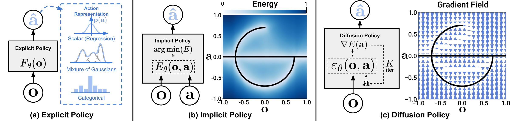

# Diffusion Policy：用扩散模型生成机器人动作，平均性能提升 46.9% 的视觉运动策略新范式

机器人从人类演示中学习动作（行为克隆），一直被三个老大难问题困扰：演示数据天然的多模态分布、动作之间的时序相关性、以及对高精度的要求。这篇来自哥伦比亚大学、TRI、MIT 和 Stanford 的工作给出了一个漂亮的答案： **把视觉运动策略本身建模为一个条件去噪扩散过程** ——策略不再直接"回归"动作，而是像扩散模型生成图片一样，从纯噪声出发，迭代"去噪"出一段动作序列。作者在 4 个 benchmark、15 个任务（含仿真与真机）上系统评测，Diffusion Policy 平均成功率比已有 SOTA 方法提升 **46.9%**；在真机 Push-T 任务上更是达到 **95% 成功率、IoU 0.80**（人类为 100% / 0.84），而最好的基线只有 20%。

## 一、背景：从演示中学动作，到底难在哪？

行为克隆（Behavior Cloning）表面上是个简单的监督学习问题：输入观测，回归动作。但机器人动作预测有三个普通回归问题没有的特性：

- **多模态分布（Multimodality）**：同一个局面下，人类可能向左绕也可能向右绕，两种做法都对。直接回归会把两种模式"平均"成一种错误动作。
- **时序相关性**：动作不是孤立的，前后帧必须连贯，否则机器人会抖动。
- **高精度要求**：毫米级的偏差就可能导致抓取失败。

已有的应对思路大致分两类，论文用一张图做了很好的总结：

> 图解：a) **显式策略（Explicit Policy）** 直接回归动作，或者把回归改造成分类（离散化动作空间）、混合高斯（GMM）来逼近多模态；b) **隐式策略（Implicit Policy）** 学一个以动作和观测为条件的能量函数 $E(\mathbf{o}, \mathbf{a})$，推理时优化出能量最低的动作；c) **Diffusion Policy** 则学习动作分布的梯度场（score function），从噪声出发沿梯度场迭代精炼出动作。相比前两者，它训练稳定、能精确表达多模态分布、还能轻松处理高维动作序列。

显式策略推理快但表达不了多模态；隐式策略（如 IBC）理论上能表达任意分布，但训练时需要用负采样估计一个不可解的归一化常数，导致训练极不稳定。Diffusion Policy 的聪明之处就在于： **它保留了隐式策略的表达能力，却绕开了让它不稳定的东西** ——具体怎么绕，下文会讲。

## 二、核心方法：把 DDPM 改造成机器人策略

### 2.1 从图像生成到动作生成

DDPM（Denoising Diffusion Probabilistic Model）大家已经不陌生：从高斯噪声 $\mathbf{x}^K$ 出发，经过 $K$ 步去噪迭代，逐步得到清晰样本 $\mathbf{x}^0$。每一步迭代为：

$$
\mathbf{x}^{k-1} = \alpha \left( \mathbf{x}^k - \gamma \epsilon_\theta(\mathbf{x}^k, k) + \mathcal{N}(0, \sigma^2 I) \right)
$$

其中 $\epsilon_\theta$ 是要学习的噪声预测网络，$\alpha, \gamma, \sigma$ 是关于迭代步 $k$ 的噪声调度函数。

这里有一个非常漂亮的视角：上式其实可以看作一步 **带噪声的梯度下降**：

$$
\mathbf{x}' = \mathbf{x} - \gamma \nabla E(\mathbf{x})
$$

也就是说，噪声预测网络 $\epsilon_\theta$ 实际上学的是能量函数的梯度场 $\nabla E(\mathbf{x})$，$\gamma$ 相当于学习率，噪声调度相当于学习率调度。生成过程就是在学好的梯度场上做随机 Langevin 动力学采样。

训练目标则是标准的噪声预测 MSE：从数据集取真实样本 $\mathbf{x}^0$，随机选一个扩散步 $k$ 并加上对应强度的噪声 $\boldsymbol{\epsilon}^k$，让网络把噪声预测出来：

$$
\mathcal{L} = MSE\left( \boldsymbol{\epsilon}^k,\ \epsilon_\theta(\mathbf{x}^0 + \boldsymbol{\epsilon}^k, k) \right)
$$

### 2.2 两个关键改造

把 DDPM 从"生成图片"改造成"生成动作"，作者做了两件事：

**改造一：生成目标从图像换成动作序列。** 注意是动作 **序列** 而不是单步动作——这是后文一系列优势的来源。

**改造二：去噪过程以视觉观测为条件。** 之前的工作 Diffuser 把扩散模型用于规划，建模的是观测和动作的联合分布 $p(\mathbf{A}_t, \mathbf{O}_t)$，代价是每次去噪迭代都要跑一遍视觉编解码，推理慢到无法做实时控制。Diffusion Policy 只建模条件分布 $p(\mathbf{A}_t | \mathbf{O}_t)$，迭代公式变为：

$$
\mathbf{A}_t^{k-1} = \alpha \left( \mathbf{A}_t^k - \gamma \epsilon_\theta(\mathbf{O}_t, \mathbf{A}_t^k, k) + \mathcal{N}(0, \sigma^2 I) \right)
$$

对应的训练损失为：

$$
\mathcal{L} = MSE\left( \boldsymbol{\epsilon}^k,\ \epsilon_\theta(\mathbf{O}_t, \mathbf{A}_t^0 + \boldsymbol{\epsilon}^k, k) \right)
$$

这样设计有两个直接好处：视觉编码器在每次推理中 **只需跑一次**（与去噪步数无关），大幅降低了实时控制的延迟；同时观测特征不参与去噪，也让视觉编码器可以和扩散网络 **End-to-End** 联合训练。这个"条件而非联合"的取舍，是整套系统能上真机的关键。

### 2.3 闭环动作序列预测：Receding Horizon Control

动作序列预测带来时序一致性，但一次预测太多步又会牺牲对突发观测的反应速度。作者的方案是经典控制里的 **滚动时域控制（Receding Horizon Control）** 思想：

- 时刻 $t$，策略读入最近 $T_o$ 步观测 $\mathbf{O}_t$（观测时域）；
- 一次预测未来 $T_p$ 步动作（预测时域）；
- 只执行其中前 $T_a$ 步（执行时域），然后重新规划。

消融实验显示 $T_a = 8$ 步（约 0.8 秒）是大多数任务的最优折中。更妙的是，下一次推理可以用上一次的动作序列预测做 warm-start，进一步保证动作平滑。

### 2.4 两种网络骨干：CNN 与 Time-Series Diffusion Transformer

噪声预测网络 $\epsilon_\theta$ 作者给了两种实现：

**CNN 版本**：基于 1D 时序卷积（U-Net 风格），观测特征通过 FiLM（Feature-wise Linear Modulation）逐通道注入每一层卷积，去噪步 $k$ 也以同样方式条件化。它开箱即用、几乎不需要调参，但时序卷积天然偏好低频信号，遇到需要快速、剧烈变化的动作（如速度控制指令）会"过度平滑"。

**Transformer 版本（Time-Series Diffusion Transformer）**：带噪动作序列作为输入 token 送入 transformer decoder（minGPT 风格），扩散步 $k$ 的正弦嵌入作为第一个 token，观测嵌入通过 cross-attention 注入；动作 token 之间用因果注意力掩码，每个动作只能 attend 到自己和之前的动作。它克服了 CNN 的过度平滑问题，在高频动作变化任务上明显更强，代价是对超参数更敏感。

作者给出的实用建议很直接： **新任务先上 CNN 版；如果因为动作变化快、任务复杂而性能不够，再换 Transformer 版并投入调参。**

### 2.5 视觉编码器与推理加速

视觉编码器是标准 ResNet-18（不预训练），做了两处改造：

1. 把全局平均池化换成 **spatial softmax pooling**，保留空间信息；
2. 把 BatchNorm 换成 **GroupNorm** ——DDPM 常用 EMA（指数滑动平均）权重，与 BatchNorm 一起用会不稳定。

推理加速方面，真机实验使用 **DDIM** 采样，训练 100 步去噪、推理只需 10–16 步，在一张 Nvidia 3080 上推理延迟约 0.1 秒，满足 10Hz 闭环控制。

## 三、为什么扩散形式天然适合机器人策略？

讲清楚"怎么做"之后，这一节回答更重要的问题： **为什么这么做是对的**。作者总结了四个特性，每一个都有实验或理论支撑。

### 3.1 精确表达多模态动作分布

Diffusion Policy 的多模态来自两个随机源：每次采样的初始噪声 $\mathbf{A}_t^K$ 决定了落入哪个"收敛盆地"，迭代过程中的随机扰动又允许样本在不同模态间迁移。理论上，Langevin 动力学采样可以表达任意可归一化的分布。

在 Push-T 任务的可视化对比中，这个优势一目了然：面对左右对称的局面（该局面甚至没出现在训练数据里），Diffusion Policy 以均等概率从左侧或右侧绕行推块，且 **每次 rollout 内部坚定地只走一边**；LSTM-GMM 和 IBC 严重偏向一侧，BET 则在两种模式间来回摇摆、动作抖动——因为它逐帧独立采样，缺乏时序一致性。

### 3.2 与位置控制（Position Control）的协同

一个反直觉的发现：绝大多数行为克隆工作都用速度控制，而 Diffusion Policy 用 **位置控制** 反而显著更好。作者分析了两个原因：

- 位置控制的动作分布多模态更强（动作在整个工作空间近似均匀分布，而不像速度指令那样在零附近聚成团）。对依赖 GMM 或 k-means 的方法这是灾难，对扩散模型却正中下怀；
- 位置控制不受累积误差影响，天然适合动作序列预测，且对系统延迟更鲁棒——消融显示 Diffusion Policy 在多达 4 步延迟下仍能保持峰值性能。

换句话说，Diffusion Policy 既规避了位置控制的主要缺点，又吃到了它的精度红利。

### 3.3 动作序列预测的红利

扩散模型在高维输出空间（整张图片）上的成功，意味着它生成高维动作序列毫无压力——而这恰是 IBC（高维空间中采样困难）和 LSTM-GMM/BET（难以指定模态数量）的软肋。序列预测直接解决两个痛点：

- **时序一致性**：整段序列作为一个样本生成，不会出现逐帧采样时在两个模态间反复横跳的抖动；
- **对"发呆动作"（idle actions）鲁棒**：遥操作演示中常有停顿（倒酱时必须静止等酱装满），单步策略极易过拟合这种停顿而"卡死"，序列预测则能理解停顿只是长序列中的一段。

### 3.4 训练稳定性：绕开负采样的理论解释

这是全文理论含量最高的一段。隐式策略用能量模型定义动作分布：

$$
p_\theta(\mathbf{a}|\mathbf{o}) = \frac{e^{-E_\theta(\mathbf{o}, \mathbf{a})}}{Z(\mathbf{o}, \theta)}
$$

其中归一化常数 $Z(\mathbf{o}, \theta)$ 关于 $\mathbf{a}$ 不可解。IBC 用 InfoNCE 损失训练，靠负采样估计这个常数——负采样的不准确正是 EBM 训练不稳定的根源，论文图 7 显示 IBC 训练中成功率剧烈震荡，选 checkpoint 如同抽奖。

Diffusion Policy 则直接建模同一分布的 **score function**：

$$
\nabla_{\mathbf{a}} \log p(\mathbf{a}|\mathbf{o}) = -\nabla_{\mathbf{a}} E_\theta(\mathbf{a}, \mathbf{o}) - \underbrace{\nabla_{\mathbf{a}} \log Z(\mathbf{o}, \theta)}_{=0} \approx -\epsilon_\theta(\mathbf{a}, \mathbf{o})
$$

对 $\mathbf{a}$ 求梯度时归一化常数项 **恒等于零** ——训练和推理全程都不需要估计 $Z$。这就是"保留隐式策略表达能力、同时获得显式策略般稳定训练"的数学根源。

作为 sanity check，作者还证明了与控制理论的联系：对于线性系统加线性反馈策略（如 LQR），Diffusion Policy 的最优去噪器在推理时会精确收敛到 $\mathbf{a} = -\mathbf{K}\mathbf{s}$；而当预测时域 $T_p > 1$ 时，策略必须隐式地学习一个任务相关的动力学模型才能完美预测未来动作。

## 四、实验验证：15 个任务，全面碾压

### 4.1 仿真 benchmark

评测覆盖 RoboMimic（5 任务 × PH/MH 数据集）、Push-T（状态与图像两个变体）、BlockPush 和 Franka Kitchen。所有结果取最后 10 个 checkpoint 均值 × 3 个训练种子 × 50 个环境初始条件（共约 1500 次 rollout），并同时报告最佳 checkpoint 成绩。

状态观测下的部分结果（格式：最佳 checkpoint / 最后 10 个 checkpoint 均值）：

| 方法 | Lift (ph) | Can (ph) | Square (ph) | Transport (ph) | ToolHang (ph) | Push-T |
|---|---|---|---|---|---|---|
| LSTM-GMM | 1.00/0.96 | 1.00/0.91 | 0.95/0.73 | 0.76/0.47 | 0.67/0.31 | 0.67/0.61 |
| IBC | 0.79/0.41 | 0.00/0.00 | 0.00/0.00 | 0.00/0.00 | 0.00/0.00 | 0.90/0.84 |
| BET | 1.00/0.96 | 1.00/0.89 | 0.76/0.52 | 0.38/0.14 | 0.58/0.20 | 0.79/0.70 |
| DiffusionPolicy-C | 1.00/0.98 | 1.00/0.96 | **1.00/0.93** | 0.94/0.82 | 0.50/0.30 | 0.95/ **0.91** |
| DiffusionPolicy-T | 1.00/ **1.00** | 1.00/ **1.00** | 1.00/0.89 | **1.00/0.84** | **1.00/0.87** | **1.00** /0.79 |

多阶段任务上优势更明显——这些任务专门考验长时域多模态：

| 方法 | BlockPush p1 | BlockPush p2 | Kitchen p1 | Kitchen p2 | Kitchen p3 | Kitchen p4 |
|---|---|---|---|---|---|---|
| LSTM-GMM | 0.03 | 0.01 | 1.00 | 0.90 | 0.74 | 0.34 |
| IBC | 0.01 | 0.00 | 0.99 | 0.87 | 0.61 | 0.24 |
| BET | 0.96 | 0.71 | 0.99 | 0.93 | 0.71 | 0.44 |
| DiffusionPolicy-T | **0.99** | **0.94** | **1.00** | **0.99** | **0.99** | **0.96** |

BlockPush 的 p2 指标 0.94 对 0.71（提升 32%），Kitchen 的 p4 指标相对提升高达 213%。注意 CNN 版在这两个任务上明显弱于 Transformer 版——因为演示数据是高频的速度控制信号，正好撞上 CNN 过度平滑的短板，这也反过来印证了 2.4 节的架构分析。

关键结论汇总：

- **短时域多模态**（同一目标的多种做法）：Diffusion Policy 左右绕行等概率且单次坚定，基线或偏科或摇摆；
- **长时域多模态**（子目标顺序随机）：大幅领先 BET；
- **动作时域折中**：$T_a = 8$ 最优，太短抖动、太长反应迟钝；
- **数据效率**：在所有训练数据规模下都优于 LSTM-GMM；
- **观测时域**：状态策略不敏感，视觉策略取 $T_o = 2$ 即可。

### 4.2 真机 Push-T：接近人类水平

真机版 Push-T 比仿真版难得多：任务变为两阶段（推块到位 + 末端走到指定 end-zone 避免遮挡评测相机）、策略要自己判断"够好了"并决定何时结束、IoU 取最后一步而非历史最大。作者还刻意 **没有删除** 演示中的发呆动作，进一步加难。

| 方法 | IoU | 成功率 | 平均时长（秒） |
|---|---|---|---|
| 人类演示 | 0.84 | 1.00 | 20.3 |
| IBC（最佳变体） | 0.19 | 0.00 | 41.6 |
| LSTM-GMM（最佳变体） | 0.25 | 0.20 | 47.3 |
| Diffusion Policy（R3M 预训练） | 0.66 | 0.80 | 31.7 |
| Diffusion Policy（End-to-End） | **0.80** | **0.95** | **22.9** |

基线的失败模式很有代表性：LSTM-GMM 在 20 次评测中 8 次卡在推块微调阶段（过拟合发呆动作），IBC 有 6 次没推好就提前"放弃"跑向 end-zone——阶段切换处的多模态和模糊决策边界正是它们的死穴。

值得一提的是 Diffusion Policy 的实际执行频率只有 1.67Hz（$T_a=6$ × 10Hz），远低于常规做法，却依然性能领先。鲁棒性测试也很亮眼：镜头前挥手遮挡 3 秒，动作略抖但不偏航；推块过程中人为移动 T 块，策略立刻换方向重推；甚至在策略已前往 end-zone 途中把 T 块挪出目标区，它会 **主动折返** 把块推回去再继续——而训练数据里从未演示过"折返"这个行为，说明策略具备了一定的行为合成能力。

### 4.3 更多真机任务

**6DoF 翻杯子**：把任意摆放的杯子抓起、杯口朝下、杯柄朝左。演示高度多模态（正手/反手抓、抓 vs 推、多次重抓），Diffusion Policy 20 次试验成功 **90%**，还能在掉杯时自发重抓；LSTM-GMM 对照组 20 次全部失败。

**倒酱与抹酱**（Franka 双臂平台，非刚性流体、6DoF、周期性动作）：倒酱 IoU 0.74（人类 0.79）、成功率 79%；抹酱覆盖率 0.77（人类 0.79）、成功率 100%。LSTM-GMM 在 20 次倒酱中 15 次舀完酱抬不起勺子，抹酱 20 次全部失败——它的隐状态记不住足够长的历史来区分"舀酱"和"抬勺"阶段。两个任务直接复用 Push-T 的超参数，一次训练即成功。

**双臂任务**（VR 或力反馈遥操作采集演示，策略零调参直接迁移）：

| 任务 | 演示数量 | 成功率（20 次试验） |
|---|---|---|
| 双臂打蛋器 | 210 | 55% |
| 双臂展开垫子 | 162 | 75% |
| 双臂叠衬衫 | 284 | 75% |

> 图解：双臂打蛋器任务的初始与最终状态可视化（绿色框为成功 rollout，红色框为失败）。机器人需要右臂拿起打蛋器放入碗中，左臂扶正碗，再抓住摇柄转动至少 3 圈。这个任务还揭示了一个有趣的细节：没有力反馈时，专家 10 次遥操作演示全部失败（拉脱摇柄、脱手、触发扭矩限制），有力反馈后 10 次全部成功——数据采集方式本身也是双臂操作的关键变量。

> 图解：双臂叠衬衫任务流程，共 9 个离散步骤：双臂抓住一侧袖子→折叠→拉平衬衫→换另一侧→再沿衣领对折→抚平后离开。这是三个双臂任务中最长程的一个，最后几步两只夹爪距离极近，由中层控制器负责碰撞规避。

### 4.4 消融：视觉编码器怎么选？

在 RoboMimic Square (ph) 任务上对比 3 种架构 × 3 种训练策略（CNN 版 Diffusion Policy，500 epoch）：

| 架构（预训练） | 从零训练 | 冻结预训练 | 小学习率微调 |
|---|---|---|---|
| ResNet-18（ImageNet-21k） | 0.94 | 0.58 | 0.92 |
| ResNet-34（ImageNet-21k） | 0.92 | 0.40 | 0.94 |
| ViT-B/16（CLIP） | 0.22 | 0.70 | **0.98** |

结论很清晰： **冻结预训练编码器效果差**（说明扩散策略需要的视觉表征与主流预训练目标不一致）；从零 End-to-End 训练是可靠基线；而以 10 倍小的学习率 **微调** 预训练编码器效果最好——CLIP 版 ViT 仅训 50 epoch 就到 98% 成功率。

### 4.5 工程实现要点（附录精华）

对想复现的读者，附录里有几条经验非常值钱：

- **动作归一化**：每个动作维度独立 min-max 归一化到 $[-1, 1]$。不要用零均值单位方差——DDPM 每步会把预测裁剪到 $[-1,1]$，方差归一化会让部分动作空间不可达。方差过小的维度只做零均值平移；四元数等旋转向量保持原样；
- **旋转表示**：位置控制统一用 6D 连续旋转表示，速度控制用轴角（速度指令接近零，奇异性无碍）；
- **图像增广**：训练用 random crop，推理用同尺寸 center crop；
- **噪声调度**：iDDPM 的 Square Cosine Schedule 效果最好；
- **调参体验**：CNN 版超参数跨任务高度一致，且加大模型总是涨点（瓶颈只在算力）；Transformer 版的 attention dropout 和 weight decay 则因任务而异，加大层数有时反而掉点。

## 五、总结与展望

这篇工作的核心要点，用五条回顾：

- **新策略范式**：把视觉运动策略建模为动作空间上的条件去噪扩散过程，学动作分布的 score 梯度场，推理即 Langevin 采样；
- **三大工程支柱**：滚动时域的闭环动作序列预测、观测作为条件（而非联合分布）的视觉条件化、克服 CNN 过度平滑的 Time-Series Diffusion Transformer；
- **性能证据扎实**：4 个 benchmark、15 个任务平均提升 46.9%，真机 Push-T 达 95% 成功率接近人类，多阶段任务上相对提升最高达 213%；
- **理论根基清晰**：score function 对归一化常数求导为零，从数学上解释了为何它比 EBM 系方法（IBC）训练稳定得多；
- **实用建议完备**：新任务先用 CNN 版 + 位置控制 + $T_a=8$ + $T_o=2$，动作高频变化再换 Transformer 版，视觉编码器优先 End-to-End 或小学习率微调。

局限与方向：它继承了行为克隆对演示质量的依赖（未来可与 Offline RL 结合利用次优数据）；多步去噪带来的推理延迟虽然被 DDIM 和动作序列预测部分缓解，但对超高频控制任务仍吃紧——一致性模型等扩散加速技术是值得期待的下一步。从更长的视角看，这篇论文最有力的论断是： **行为克隆的性能瓶颈很大程度上在策略结构本身，而不只是数据** ——这个结论在随后几年被整个机器人学习领域反复验证。

> 本文参考自 [Diffusion Policy: Visuomotor Policy Learning via Action Diffusion](https://arxiv.org/abs/2303.04137)