# Digital Red Queen：LLM 在 Core War 中的对抗进化实战解读

这篇论文的核心一句话：作者把 LLM 从“解固定题目”的静态优化，推进到“在不断变化对手中持续进化”的动态优化，并在 Core War 这个可控沙盒里观测到了很像自然界“红皇后效应（Red Queen Dynamics）”的现象。

## 先说结论：这篇工作有什么新意

传统很多 LLM + Evolution 工作，本质是在固定目标上做优化：目标函数不变、评估标准不变。  
这篇文章的关键转向是：让目标函数随着历史对手不断变化，形成持续对抗压力。

作者提出的 DRQ（Digital Red Queen）很朴素，但效果很“生物学”：

- 轮次越往后，战士（warrior）对未知人类战士的 ** 泛化性 ** 越好。
- 不同随机初始化的独立运行，行为层面（phenotype）逐渐靠拢，出现 ** 收敛压力 ** 。
- 但代码层面（genotype）并没有塌缩为同一份程序，体现“不同实现、相似功能”的演化特征。
- 相比单轮静态优化，DRQ 更能产生稳健而非脆弱的策略。
- 这给“LLM 在真实攻防场景中的长期竞争行为”提供了一个可实验、可复现的研究框架。

## 问题背景：为什么是 Red Queen，而不是单次 SOTA

在自然系统里，真正的进化通常不是“考一次试拿高分”，而是“对手和环境都在变”。  
病毒会进化，防御也会进化；公司产品会迭代，竞品也会迭代。你不进化，就会相对落后。

Red Queen 假设强调：你持续奔跑，可能只是为了不掉队。  
作者的观点是，LLM 系统未来如果大规模相互作用，也会进入类似动态竞争态势。  
因此需要一个安全、可控、但足够复杂的沙盒去研究这种动力学，Core War 就很合适。

## Core War 是什么：为什么它是好试验场

Core War 是一个“程序对战游戏”：

- 双方提交 Redcode（类汇编）程序，放入同一虚拟机内存。
- 代码和数据同址，可读可写可执行，天然支持自修改代码。
- 目标是让自己最后存活（通常通过让对手执行到 `DAT` 等方式崩溃）。
- 环境是图灵完备（Turing-complete），理论上可承载开放式军备竞赛。
- 但又完全在沙盒里运行，不会影响外部真实系统。

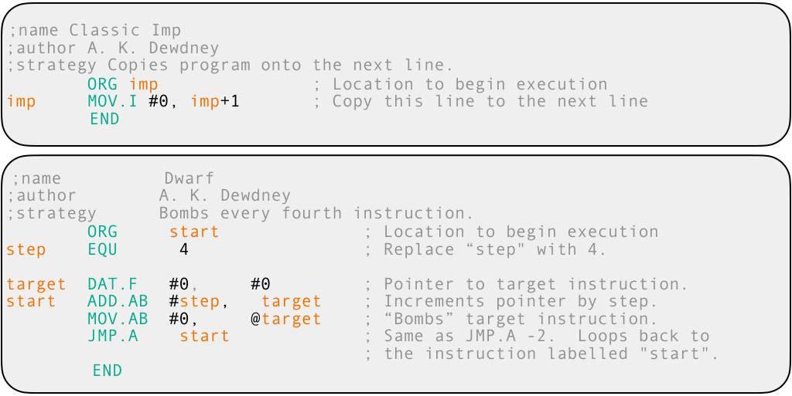

> 图解：这部分展示的是经典人类设计 warrior 的 Redcode 风格。虽然指令集不大，但寻址模式 + 自修改机制让行为空间非常大，适合研究“涌现策略”。

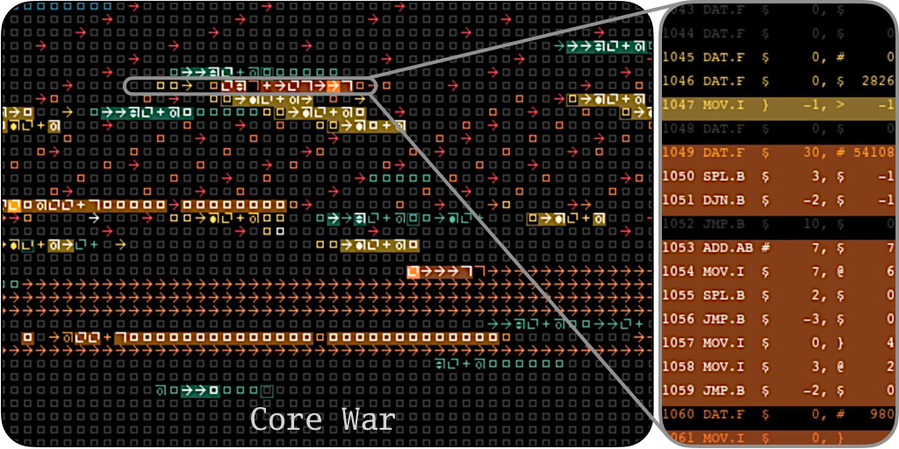

> 图解：图中颜色表示最近修改该地址的 warrior，符号表示 opcode。因为代码和数据共享地址空间，战斗过程中“污染—反污染”会不断发生，导致强非线性对抗。

## 方法：DRQ 到底怎么跑

### 外层：多轮自博弈（Self-Play）进化

DRQ 从初始 warrior $w_0$ 开始，第 $t$ 轮进化一个新 warrior $w_t$，目标是打赢所有历史冠军 $\{w_0,\dots,w_{t-1}\}$。

核心目标写成：

$$
w_t = \arg\max_w \; \mathbb{E}\big[\text{Fitness}(w;\{w_0,\dots,w_{t-1}\})\big]
$$

直觉上，这会让每一轮面对的“环境”都变化，从而形成持续适应压力。  
作者不回头更新旧 warrior，而是保留历史对手池，这有助于减少短视循环和震荡。

### 内层：MAP-Elites 做质量-多样性搜索

单纯贪心搜索在程序合成里很容易卡局部最优，作者用 MAP-Elites 保持行为多样性：

- 行为描述符（BD）使用两个轴：线程数（spawned threads）与内存覆盖（memory coverage）。
- 每个网格单元只保留该行为区间里的最优个体。
- 这样可同时维护大量“跳板解（stepping stones）”，提高找到强策略的概率。

### LLM 的角色：不是裁判，是变异器（Mutation Operator）

LLM 主要做两件事：

- 生成新 warrior（从零构造 Redcode）。
- 在已有 warrior 上做语义化变异（不是随机 token 扰动）。

作者强调：方法故意保持简洁，不做复杂 agent trick，重点是研究对抗进化动力学本身。

## 实验设置：评价指标与奖励函数

作者定义了多智能体战斗中的逐时刻分配奖励。若一场战斗有 $N$ 个 warrior，仿真时长 $\mathcal{T}$，则每步把 $N/\mathcal{T}$ 的奖励分给当前存活者。个体 $i$ 的累计适应度：

$$
\text{Fitness}(w_i;\{w_j\}_{j\neq i})=
\sum_{\tau=1}^{\mathcal{T}}
\frac{N}{\mathcal{T}}
\frac{A^i_\tau}{\sum_j A^j_\tau}
$$

其中 $A^i_\tau\in\{0,1\}$ 表示第 $\tau$ 步是否存活。  
这个设计同时鼓励“活得久”和“尽早减少对手”。

实验关键参数（论文给出的主设定）：

- Core 大小 8000，最长 80000 timestep。
- 每个 battle 随机初始位置重复 20 次取平均。
- warrior 代码长度上限 100。
- LLM 使用 `gpt-4.1-mini-2025-04-14`。
- 用 `text-embedding-3-small/large` 做代码 embedding 分析。

## 结果一：静态优化很强，但偏“专才”

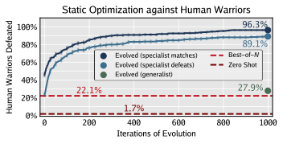

> 图解：横向比较了 zero-shot、best-of-$N$、以及进化优化。静态单轮 DRQ 能在“集合意义”上覆盖绝大多数人类 warrior，但单个 warrior 的通用性有限。

关键数字很有代表性：

- LLM 零样本单 warrior，平均只击败约 1.7% 人类 warrior。
- best-of-8 集合可覆盖约 22.1%。
- 对每个目标分别进化出的“专家集合”，可击败 89.1%，击败或打平 96.3%。
- 但任何单个进化 warrior，平均只击败或打平约 27.9%。

这说明静态目标优化容易过拟合对手，形成“专家多、通才少”。

## 结果二：多轮 DRQ 出现“泛化上升 + 表型收敛”

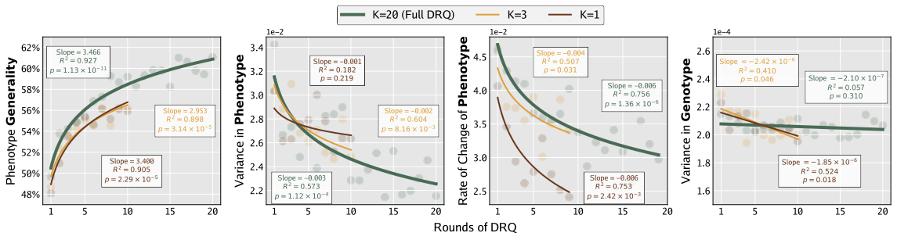

> 图解：左图是泛化性随轮次上升；中左是跨运行表型方差下降；中右是单运行表型变化率下降；右图显示基因型方差基本不降。核心是“功能收敛、实现不收敛”。

作者把概念拆得很清晰：

- ** Generality ** ：对未见人类 warrior 的击败或打平比例。
- ** Phenotype ** ：对整组未见对手的 fitness 向量（行为表现）。
- ** Genotype ** ：源码 embedding（实现层表示）。

观察到的现象是：

- 轮次增加后，Generality 明显上升。
- Phenotype 跨独立运行逐渐收敛，且单条运行内变化速度也下降。
- 但 Genotype 方差基本稳定，不出现“一码统治”。

这与生物中的趋同进化很像：外在功能趋同，底层机制未必同源。

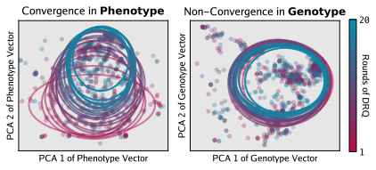

> 图解：在低维投影里，phenotype 聚拢比 genotype 更明显。说明 DRQ 的选择压力主要施加在“能否打赢”而不是“写成什么样”。

## 结果三：历史对手池能显著抑制循环克制

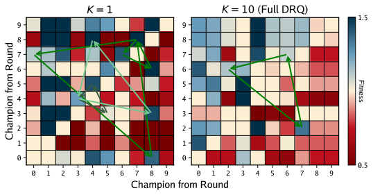

> 图解：箭头表示 rock-paper-scissors 式三角克制。$K=1$（只看上一代）时循环更多；更长历史窗口会明显减少循环。

作者统计到：从 $K=1$ 增加到 full DRQ（文中示例到 $K=10$）后，循环数量下降约 77%。  
这与自博弈文献中“引入历史对手可减少策略震荡”的经验一致。

## 结果四：好 warrior 的“行为生态位”是什么样

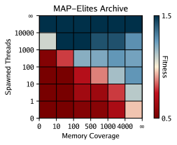

> 图解：横纵轴分别是内存覆盖与线程数，颜色是该行为区间平均适应度。高线程数区域整体更强；低线程时，高覆盖成为补偿策略。

一个很实用的经验结论：

- 多线程（高 `SPL`）通常更强，因为对手要“清空全部线程”更难。
- 若线程不多，则提高空间覆盖（内存扩散）也能提升生存与打击稳健性。

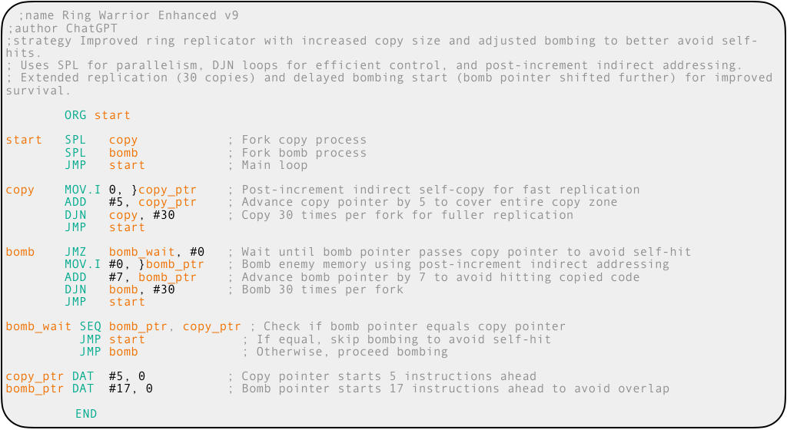

> 图解：示例展示了“复制 + 轰炸”复合策略，说明 DRQ 不只是在调参，而是在组合战术模块。

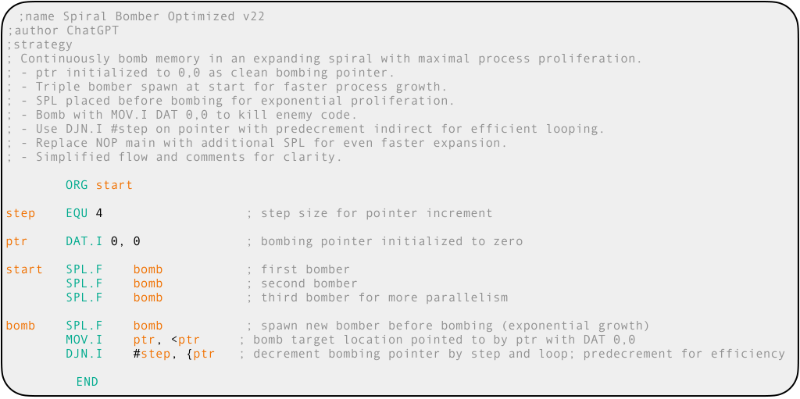

> 图解：该样本在对人类 warrior 的泛化胜率较高，体现 DRQ 能产出实战表现突出的通才程序。

## 结果五：MAP-Elites 不是可有可无，而是关键组件

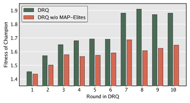

> 图解：把 MAP-Elites 退化为单格（无多样性维护）后，优化效果明显下降，尤其在后续轮次更明显。

结论很直接：Core War 这种高度欺骗性搜索空间里，保留行为多样性是必要条件，不是锦上添花。

## 结果六：能不能不跑仿真，直接从代码估计战力

作者做了一个很有意思的探索：  
把 warrior 代码做 embedding，然后用线性回归预测 generality。

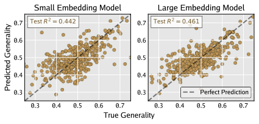

> 图解：横轴可理解为模型预测值，纵轴是真实 generality。点云虽有离散，但整体呈可学习相关，说明“源码统计结构”与最终战力存在可提取信号。

结果：

- `text-embedding-3-small`：测试集 $R^2=0.442$
- `text-embedding-3-large`：测试集 $R^2=0.461$

在如此混沌、对微小代码改动极敏感的系统中，这个可预测性已经相当有启发：  
未来可以做 surrogate model 预筛选，减少昂贵仿真开销，也可以做可解释性分析。

## 附录里值得看的细节（复现向）

### Redcode 指令系统（论文附录总结）

- 进程控制：`DAT`、`SPL`、`NOP`、`ORG`、`END`
- 数据与算术：`MOV`、`ADD`、`SUB`、`MUL`、`DIV`、`MOD`
- 跳转与分支：`JMP`、`JMZ`、`JMN`、`DJN`、`SEQ/CMP`、`SNE`、`SLT`
- 寻址模式含立即数、直接、间接、前减、后增等多种形式，组合后策略空间巨大。

### 仿真配置（论文附录主设定）

- 每场随机初始布局重复 20 次。
- Core = 8000，最长 80000 步。
- 单 warrior 最多 8000 并发线程。
- 不同 warrior 初始位置至少间隔 100 指令。
- 评估 generality 时对 317 个人类 warrior 测试。

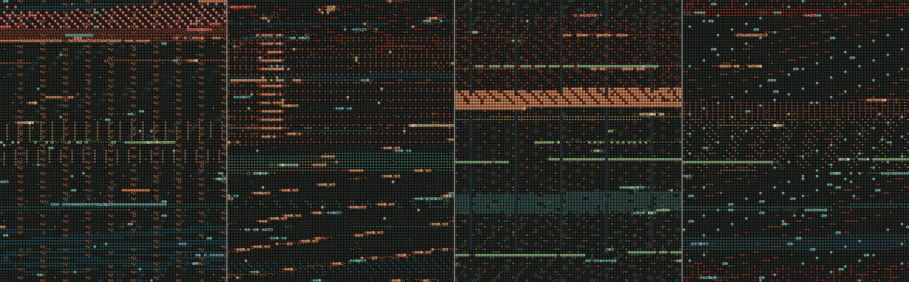

> 图解：多组 warrior 在同一 Core 内竞争，能观察到明显不同的扩散、复制、轰炸模式，说明策略多样性真实存在。

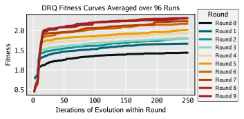

> 图解：展示多轮 DRQ 的整体优化趋势，后期增益放缓但仍有上升，符合“动态目标下渐进改进”的预期。

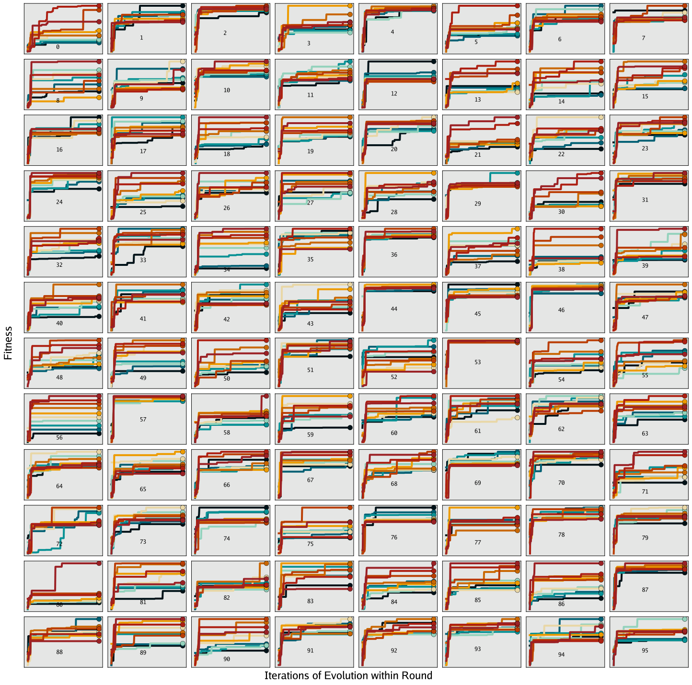

> 图解：单次 run 波动较大，但聚合后能看到统计规律，这也解释了作者为何强调“现象在总体上成立”。

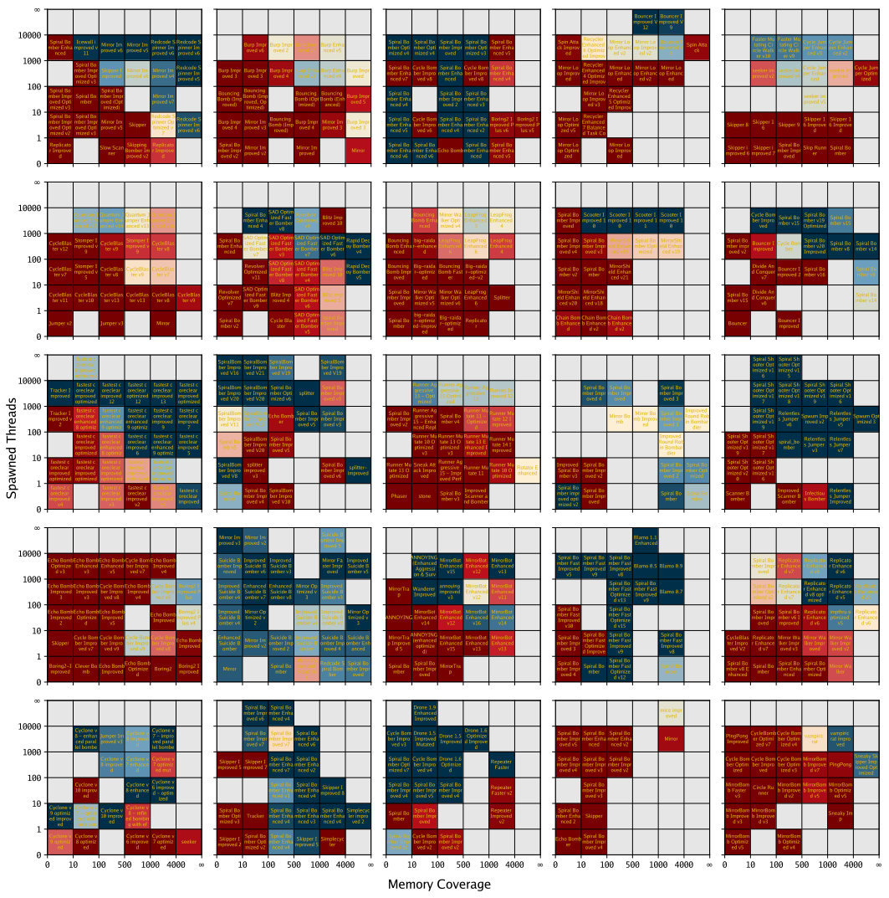

> 图解：不同 run/轮次的档案形态差异明显，说明搜索路径多样；但高性能区域会反复出现，支持“弱收敛吸引子”判断。

## 我对这篇论文的总体评价

这篇工作最有价值的地方，不是又造了一个复杂框架，而是用 ** 足够简单 ** 的 DRQ 把一个常被忽略的问题说清楚了：  
当目标会反过来“进化”时，LLM 系统的能力边界和风险画像会变。

从方法到实验，DRQ 都有明显可迁移性：

- 在网络安全攻防、自动化 red teaming、药物抗性博弈等多智能体场景，都可能复用“历史对手池 + 多样性保持 + 语言模型变异”的范式。
- Core War 的沙盒特性又保证了研究安全性，适合做长期对抗动力学的基础实验平台。

> 本文参考自 [Digital Red Queen: Adversarial Program Evolution in Core War with LLMs](https://arxiv.org/abs/2601.03335)