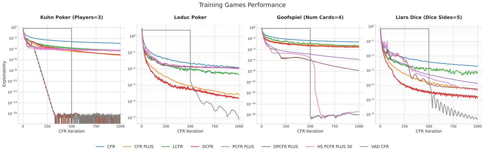
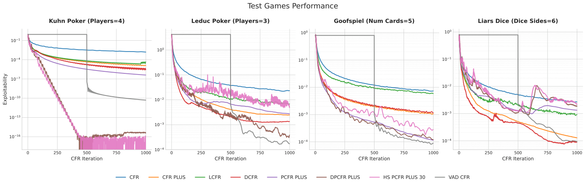
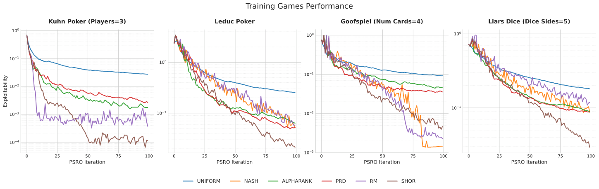
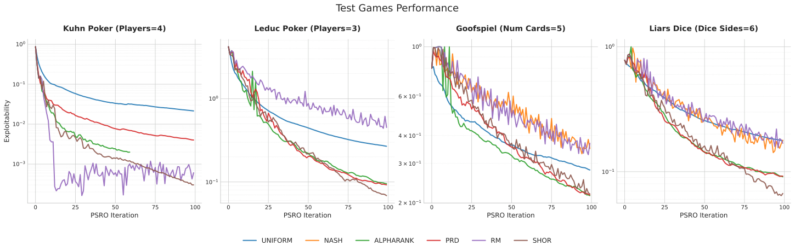
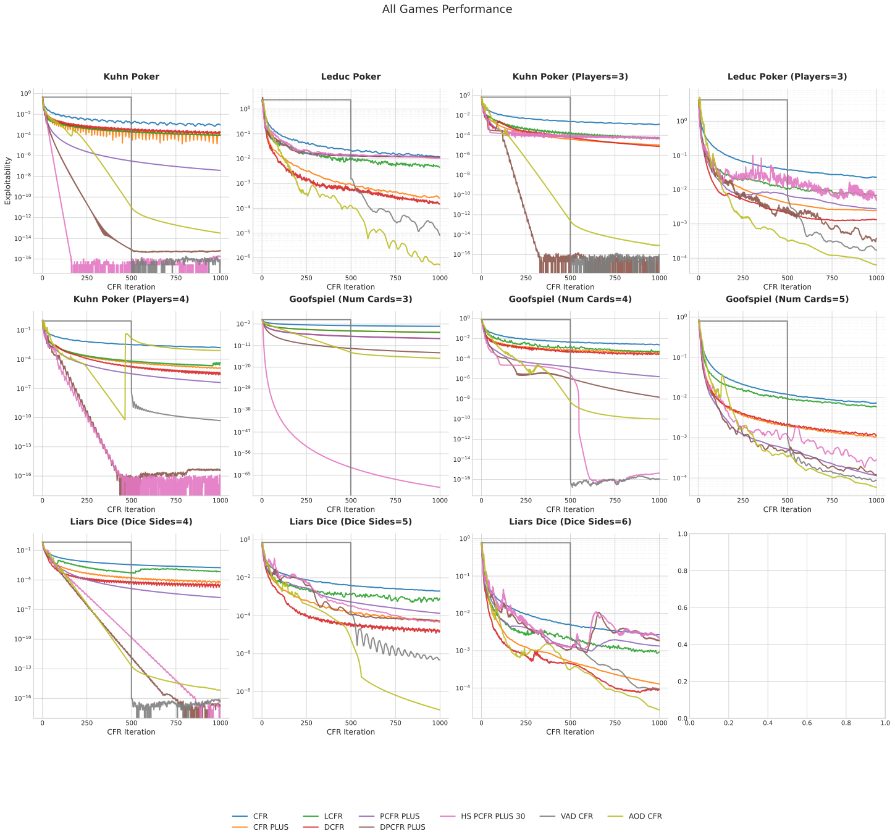
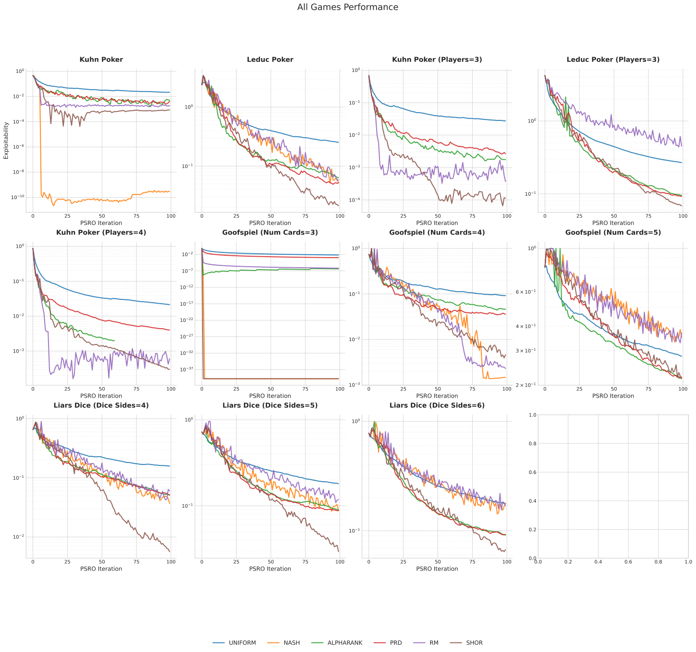

# 用 AlphaEvolve 自动发明多智能体学习算法：VAD-CFR 与 SHOR-PSRO 全解读

这篇论文的核心一句话是：把“人手调启发式规则”这件事，升级成“让 LLM 直接改算法源码，再用进化搜索自动筛选”。作者在两个经典范式上验证了这条路线：

- 基于遗憾最小化的 CFR 家族。
- 基于种群训练的 PSRO 家族。

最终，系统自动发现了两个新算法： **VAD-CFR** 和 **SHOR-PSRO** ，并在多个不完全信息博弈上取得了更快、更稳的收敛表现。

---

## 问题背景：MARL 里最难调的，往往不是理论而是“更新细节”

在多智能体博弈（尤其是扑克、Liar’s Dice 这类不完全信息游戏）中，CFR 和 PSRO 是常见方法。它们的理论框架已经较成熟，但真正决定效果的，通常是一系列“结构性小决策”：

- 遗憾如何累计（线性、折扣，是否正负对称）。
- 平均策略从第几轮开始累计。
- PSRO 里训练与评估阶段的 meta-solver 如何切换探索与利用。

过去，这些选择通常依赖人工经验和 trial-and-error。论文认为，这一搜索空间巨大，人工难以系统遍历，更适合交给自动化发现。

---

## 方法总览：AlphaEvolve 如何“进化”算法代码

作者使用 AlphaEvolve（LLM + evolutionary search）：

1. 初始化一个算法种群 $\mathcal{P}$（例如标准 CFR、Uniform-PSRO）。
2. 从种群中选择父代程序 $A$。
3. 用 LLM 对源码进行“语义级变异”，生成候选 $A'$。
4. 在一组代理游戏上运行 $A'$，以负 exploitability 作为 fitness。
5. 将有效候选加入种群，循环迭代。

优化目标可在多目标之间切换，最终按平均得分选择算法。核心目标函数为：

$$
- \frac{1}{|\mathcal{G}|} \sum_{g \in \mathcal{G}} \text{Exploitability}(A(g)_K)
$$

其中，$A(g)_K$ 表示算法 $A$ 在游戏 $g$ 上迭代 $K$ 步后的策略。

---

## 理论底座（精炼版）：EFG、Exploitability、CFR、PSRO

### EFG 与可利用度

可利用度定义为：平均来看，若偏离当前策略并采用 best response，能够多获得多少收益。

$$
\text{Exploitability}(\sigma) = \frac{1}{N}\sum_{i \in \mathcal{N}} \left( \max_{\sigma_i'} u_i(\sigma_i', \sigma_{-i}) - u_i(\sigma) \right)
$$

该值越小，策略越接近 Nash equilibrium。

### CFR 核心更新

瞬时反事实遗憾：

$$
r^t(I, a) = v_i(\sigma^t, I, a) - \sum_{a' \in \mathcal{A}(I)} \sigma^t(I, a') v_i(\sigma^t, I, a')
$$

累计遗憾（标准 CFR）：

$$
R^T(I, a) = \sum_{t=1}^T r^t(I, a)
$$

由遗憾匹配得到当前策略：

$$
\sigma^{t+1}(I, a) = \frac{\max(R^t(I, a), 0)}{\sum_{a'} \max(R^t(I, a'), 0)}
$$

### PSRO 循环

- 训练阶段，meta-strategy solver 决定“与谁对战”以训练 best response。
- 扩展策略池。
- 评估阶段，solver 决定当前种群质量（exploitability）。

论文特别强调：训练 solver 与评估 solver 的目标不同，应允许不对称设计。

---

## 搜索空间设计：不是调超参，而是直接暴露“可进化函数”

作者并未只让 LLM 调整标量超参，而是开放了关键 Python 组件：

- CFR：`RegretAccumulator`、`PolicyFromRegretAccumulator`、`PolicyAccumulator`
- PSRO：`TrainMetaStrategySolver`、`EvalMetaStrategySolver`

因此，搜索空间覆盖了“符号级更新规则”，已知经典变体都可视为其中的特例。

---

## 自动发现一：VAD-CFR 为什么有效

**VAD-CFR** 的三个关键机制看似“反直觉”，但实验效果显著。

### 1) Volatility-Adaptive Discounting

该机制用瞬时遗憾幅度的 EWMA 估计波动性，并动态调整折扣指数。波动大时更快遗忘历史，波动小时保留更多历史用于精修。

直觉上，早期策略震荡剧烈、历史噪声多；后期才更值得长期记忆。

### 2) Asymmetric Instantaneous Boosting

对正瞬时遗憾额外乘以 $1.1$，对负值不放大，即“对潜在好动作更激进”。

直觉上，这能减少“先累计再生效”的滞后，更快跟进局部优势方向。

### 3) Hard Warm-Start + Regret-Magnitude Weighting

前 500 轮不累计平均策略，之后再按时间权重与遗憾幅度权重进行累计。

直觉上，这相当于把早期噪声从最终平均策略中硬切除，让后期高信息密度样本占据更大权重。

---

## 自动发现二：SHOR-PSRO 如何平衡探索与利用

**SHOR-PSRO** 的核心是混合求解器：

$$
\sigma_{hybrid} = (1 - \lambda) \cdot \sigma_{ORM} + \lambda \cdot \sigma_{Softmax}
$$

- $\sigma_{ORM}$：偏稳定、偏均衡。
- $\sigma_{Softmax}$：偏贪心、偏高回报纯策略。

### 动态退火

训练阶段让 $\lambda$ 从 $0.3 \rightarrow 0.05$，并让 diversity bonus 从 $0.05 \rightarrow 0.001$。前期鼓励扩展策略图，后期强调逼近平衡。

### 训练/评估不对称

- 训练 solver：返回平均策略，保证稳定性。
- 评估 solver：使用低混合系数 + last-iterate，提升 exploitability 评估灵敏度。

这一点很关键：它不是“一个 solver 通吃全流程”。

---

## 实验设置与结果解读

训练集：3p Kuhn、2p Leduc、4-card Goofspiel、5-sided Liar’s Dice。  
测试集：更大更难的 4p Kuhn、3p Leduc、5-card Goofspiel、6-sided Liar’s Dice（完整 11 个游戏见附录）。

### CFR 结果图（训练 + 测试）

> 图解：横轴是迭代轮数（通常到 1000），纵轴是 exploitability（对数尺度，越低越好）。训练集上，VAD-CFR 曲线整体下降更快，说明收敛效率更高。

> 图解：测试集上，VAD-CFR 仍保持较低 exploitability，说明它并非只记住训练游戏的“过拟合技巧”，而是学到了可迁移的更新机制。

### PSRO 结果图（训练 + 测试）

> 图解：横轴是 PSRO 外层迭代（文中关注到第 100 轮），纵轴是 exploitability（对数尺度）。SHOR-PSRO 在早中期下降更快，体现了混合 solver 的效率优势。

> 图解：在更复杂的测试游戏中，静态 solver 更容易进入平台期；SHOR-PSRO 通过动态退火与训练/评估解耦，曲线通常更稳、更低。

### 全 11 游戏总览

> 图解：跨 11 个游戏的总体比较中，VAD-CFR 在绝大多数任务上达到或超过已有强基线，体现出较强广泛性。

> 图解：SHOR-PSRO 在多游戏总体表现上也具备明显竞争力，尤其在大状态空间或多玩家设置中更稳定。

---

## 附录里最值得看的细节（复现向）

### VAD-CFR 代码级要点

- 自适应参数统一由一个函数计算，避免组件间逻辑不一致。
- 对负累计遗憾设置下界（如 `-20`），防止长期锁死。
- 策略导出时引入“投影遗憾 + optimistic 修正 + 非线性幂次”。
- 平均策略阶段叠加时间权重、稳定性因子、遗憾幅度因子。

### SHOR-PSRO 代码级要点

- `_hybrid_orm_solver` 同时实现 ORM+、动量、增益归一化、diversity bonus。
- 训练器与评估器参数彻底分离。
- 内层求解迭代次数随种群规模自适应。
- 评估时返回 last-iterate，训练时返回 average iterate。

---

## 贡献与技术判断

论文的贡献不只是“提出两个新变体”，更在于给出一种可迁移的研发范式：

- 把算法设计对象从“参数”扩展到“源码逻辑”。
- 把训练 solver 与评估 solver 显式解耦。
- 让自动化搜索发现人类不易直觉想到的非对称机制（如 hard warm-start、混合退火）。

一个重要启发是：在 MARL 这类结构复杂问题中，许多性能瓶颈来自“流程形状”而非“单点超参”。而 LLM + 进化搜索，恰好适合探索这种离散、组合、符号化的设计空间。

---

## 总结

这项工作展示了一个清晰方向：多智能体算法不一定只能依赖人工逐步调启发式，完全可以把算法本身视作可进化程序，让 LLM 负责语义改写，让博弈指标负责生存筛选。  
**VAD-CFR** 与 **SHOR-PSRO** 的结果表明，自动发现不仅能“调得更快”，还可能找到人类不易手工发明的机制组合。

> 本文参考自 [Discovering Multiagent Learning Algorithms with Large Language Models](https://arxiv.org/abs/2602.16928)