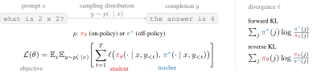
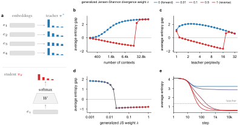
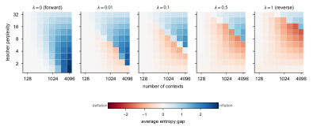
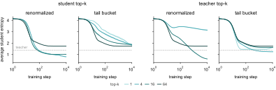
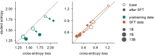
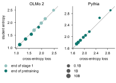
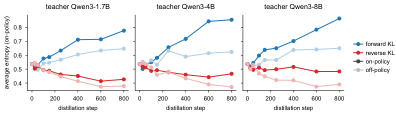
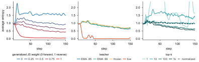
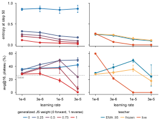
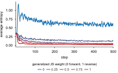

# 蒸馏的散度选择，其实是一个隐含的"熵旋钮"：Divergence Controls Entropy in Distillation 深度解读

蒸馏（Distillation）早已是大模型训练的核心组件，但"换一个散度到底改变了什么"这个问题，长期以来只有模糊的直觉。这篇来自 Stanford 的工作给出了一个干净的答案： **散度是学生模型熵的隐含调节器** 。作者证明 Forward KL 会把学生的熵抬高到教师之上，且抬升量恰好等于残差 KL 散度；由于交叉熵训练是 Forward KL 的特例，这意味着 **一个收敛的预训练模型，其平均熵可以直接从训练 loss 读出来** ——这个恒等式在 OLMo 2 和 Pythia 全系列模型上被定量验证。更反直觉的是，on-policy 蒸馏之所以熵更低，主因不是 on-policy 采样，而是与之绑定的 token 级 Reverse KL；而在自蒸馏中，最好的超参数恰恰是那些能抵消熵坍缩的配置。

## 一、解耦采样与散度：被序列级推导掩盖的两个自由度

蒸馏通常被推导为"最小化学生和教师在 **序列** 上的散度"。这篇文章的第一个贡献是指出：这个推导方式把两个本可独立选择的东西绑在了一起—— **数据从哪来（采样分布 $p$）** 和 **用什么散度（$\ell$）** 。

具体来说，从序列级目标出发：

- 序列级 Reverse KL 内部隐藏着对学生采样序列的期望， **强制 on-policy** ；
- 序列级 Forward KL 隐藏着对教师采样序列的期望， **强制 off-policy** 。

而如果一开始就把目标写在 token 级别，两者就彻底解耦了：

$$
\mathcal{L}(\theta) = \mathbb{E}_x \, \mathbb{E}_{y \sim p(\cdot \mid x)} \left[ \sum_{t=1}^{T} \ell \left( \pi_\theta(\cdot \mid x, y_{<t}), \, \pi^*(\cdot \mid x, y_{<t}) \right) \right]
$$

其中 $p$ 可以是学生自己（on-policy）也可以是教师（off-policy），$\ell$ 可以是 Forward KL、Reverse KL 或任何散度，两者自由组合。

> 图解：蒸馏的解耦视图。prompt $x$ 由采样分布 $p$ 补全为 $y$，然后在补全的每个 token 位置上，用散度 $\ell$ 比较学生 $\pi_\theta$ 和教师 $\pi^*$ 的下一 token 分布。把目标写在 token 级，$p$ 和 $\ell$ 就是两个独立的旋钮；写在序列级，它们就被锁死了。

顺带一提，实践中即使 on-policy 采样，梯度也不会穿过采样过程（stop-gradient），这与 RLVR 中的做法一致：忽略 score function 项会带来有偏但低方差的梯度。作者正是借此论证：后文的玩具模型可以安全地丢掉序列建模部分。

**博主点评** ：这个解耦看起来只是形式上的整理，但它是全文的地基——后面所有"散度效应 vs 采样效应"的对照实验，都依赖这个分解才做得出来。而且它有直接的实践含义：很多论文从序列级 Reverse KL 出发"论证"on-policy 蒸馏的合理性，结果被迫继承了 Reverse KL，而这篇文章会告诉你，这个继承来的选择可能正是熵坍缩的根源。

## 二、玩具模型：一个可严格分析的"语言模型缩影"

要分析散度对熵的影响，经典的例子是用单个高斯拟合混合高斯，但它既不是离散的、也没有神经网络的味道。作者提出了一个更贴切的玩具模型：给每个上下文 $i$ 一个固定的随机嵌入 $e_i$，学生就是一个线性 softmax 头：

$$
\pi_\theta(\cdot \mid i) = \mathrm{softmax}(W e_i)
$$

可以把它理解为"序列模型部分被冻结成随机特征的语言模型预测头"。默认配置：嵌入维度 128、词表 64、2048 个上下文、教师困惑度（perplexity，即 $\exp(H(\pi^*))$，教师概率质量覆盖的有效 token 数）在 $[1, 16]$ 内对数均匀采样。它有两个控制任务难度的旋钮：

- **上下文数量 $n$** ：共享权重 $W$ 容量有限，上下文越多，学生越不可能完美复现所有教师分布；
- **教师困惑度** ：教师越弥散（diffuse），越难拟合。

> 图解：玩具模型揭示的熵相变。(a) 线性 softmax 学生把固定嵌入映射到下一 token 分布，分别用 Forward KL、Reverse KL 或广义 Jensen–Shannon（JS）散度训练；(b) 收敛时熵差随上下文数量的变化——Forward KL（蓝）恒抬高熵，Reverse KL（红）在任务简单时压低熵、上下文过多时反而抬高；(c) 同样，教师太弥散时 Reverse KL 也转为抬高熵；(d) 收敛时熵随插值权重 $\lambda$ 突变式下降；(e) 训练早期熵随 $\lambda$ 平滑下降。

### 2.1 散度选择只在"学生配不上教师"时才重要

先说一个划定适用边界的结论：信息几何的经典结果告诉我们，所有 $f$-divergence 在 $\pi_\theta = \pi^*$ 附近的局部几何是等价的（共享 Fisher 度规）。因此对任意固定的采样分布 $p$，在一阶近似下：

$$
\nabla_\theta \, \mathbb{E}_i \left[ D_{\mathrm{KL}}(\pi^* \parallel \pi_\theta) \right] \approx \nabla_\theta \, \mathbb{E}_i \left[ D_{\mathrm{KL}}(\pi_\theta \parallel \pi^*) \right]
$$

也就是说， **如果学生有能力复现教师、且初始化就在附近，那么用 Forward 还是 Reverse KL，训练动力学（包括熵的轨迹）完全一样** 。图 2(b) 左端也印证了这点：上下文足够少时，各散度下收敛的学生熵几乎相同。

所以，散度选择带来的一切差异，都发生在学生和教师显著不同的 regime——要么学生容量不够，要么两者起点相距甚远。后文默认处于这个 regime。

### 2.2 Forward KL 必然抬高熵：一个精确恒等式

Forward KL 是 mode-covering 的：教师有质量的地方，学生绝不敢给零概率，否则损失爆炸。直觉上这会抬高学生的熵，而作者把这个直觉变成了 **定量等式** 。对任何带线性 softmax 头的模型（标准 LM 头和玩具模型都满足），在 Forward KL 目标的驻点 $\theta^*_{\mathrm{for}}$ 上：

$$
\bar{H}(\pi_{\theta^*_{\mathrm{for}}}) = \bar{H}(\pi^*) + \mathbb{E}_i \left[ D_{\mathrm{KL}} \left( \pi^*(\cdot \mid i) \parallel \pi_{\theta^*_{\mathrm{for}}}(\cdot \mid i) \right) \right]
$$

**学生的平均熵 = 教师的平均熵 + 残差 KL 散度** 。KL 非负，所以学生的熵必然高于教师，且高出多少是精确可算的。

证明的关键一步很巧妙：沿"温度方向"（把 logits 整体缩放 $(1+\varepsilon)$ 倍）扰动学生，驻点要求损失沿这个方向的一阶导数为零。这给出"学生和教师的平均 logit 之差在上下文上平均为零"的驻点条件，代回熵差分解即得恒等式。这本质上是信息几何中的经典事实：Forward KL 的驻点是指数族的矩匹配投影，而矩匹配投影的熵恰好超出目标一个散度的量。

更进一步，如果模型有逐上下文的温度自由度（例如足够强的主干网络能对单个上下文独立缩放 logits），恒等式还能升级为 **逐上下文成立** ：凡是学生没拟合好教师的地方，熵就被严格抬高，抬升量恰为该处的失配量。

把这个结果翻译到预训练场景，就得到一个相当漂亮的推论： **next-token 交叉熵训练 = 以数据分布为隐式教师的 off-policy Forward KL 蒸馏** 。展开 KL 后，上式右边变成"教师熵 + 交叉熵 − 教师熵"，即：

$$
\bar{H}(\pi_\theta) = \text{训练集上的平均交叉熵 loss}
$$

**模型的平均熵等于它的训练 loss** 。注意这不要求学生和教师接近，只需要 softmax 头和驻点条件。一个直接推论：训练到收敛的模型中，loss 越高熵越高——拟合不好的学生不是"过度自信"，而是把概率质量泄漏到数据分布的支撑集之外。

**博主点评** ：这是全文最"硬"的一个结果。一行恒等式，把"训练 loss"和"模型不确定性"这两个平时各说各话的量锁死在一起，而且后面在大模型上验证得出奇地准。

### 2.3 Reverse KL 压低熵，直到任务难到压不动

Reverse KL 是 mode-seeking 的，直觉上应该压低学生熵。实验上确实如此—— **但只要学生还能模仿教师** 。当上下文太多或教师太弥散时（图 2(b)(c) 右上区域），Reverse KL 反而转为抬高熵。

把 Reverse KL 拆开看就能理解这个转折：

$$
D_{\mathrm{KL}}(\pi_\theta \parallel \pi^*) = -\sum_j \pi_\theta(j \mid i) \log \pi^*(j \mid i) - H(\pi_\theta(\cdot \mid i))
$$

第一项是 mode-seeking 部分（教师概率趋于零的 token，学生必须压低），第二项是负熵，永远在 **推高** 学生熵。教师越弥散，第一项越平，mode-seeking 的约束力越弱，第二项就占了上风。

作者在附录中把这个直觉严格化：在"教师趋于均匀 + 高负载"的极限下（教师 logits 缩小 $\beta \to 0$ 倍），所有二阶可微的 $f$-divergence 都退化为同一个二次型目标——以 Fisher 度规加权的 logits 最小二乘投影。此时 Reverse KL 与 Forward KL 等价，学生的熵缺口可以显式算出：

$$
\bar{H}(\pi_\theta) - \bar{H}(\pi^*) = \left(1 - \frac{h}{n}\right) \left( \log d - \bar{H}(\pi^*) \right) + O(\beta^3)
$$

其中 $h$ 是嵌入维度、$n$ 是上下文数、$d$ 是词表大小。这个公式定量预测： **上下文越多，熵缺口越大；教师越弥散，缺口越小** ——与图 2(b)(c) 完全吻合。值得一提的是，同一段分析对 Forward KL 还给不出熵的精确结论（驻点论证在 Reverse KL 上只能给出 log 概率"平坦度"的不等式约束），这也从侧面说明 Reverse KL 的熵行为本质上是"任务与散度共同决定的属性"，而非散度单方面的承诺。

### 2.4 JS 插值族：训练早期平滑，收敛时突变

实践中常用的不是两个极端，而是广义 Jensen–Shannon（JS）散度插值族：

$$
\mathrm{JS}_\lambda(\pi^*, \pi_\theta) = \lambda \, D_{\mathrm{KL}}(\pi^* \parallel m_\lambda) + (1 - \lambda) \, D_{\mathrm{KL}}(\pi_\theta \parallel m_\lambda), \quad m_\lambda = \lambda \pi^* + (1-\lambda)\pi_\theta
$$

$\lambda \to 0$ 归一化后是 Forward KL，$\lambda \to 1$ 是 Reverse KL。一个自然的问题是：熵会随 $\lambda$ 平滑单调变化吗？答案是 **看训练阶段** ：

- **训练早期** （图 2e）：熵随 $\lambda$ 平滑下降，调 $\lambda$ 就像拧一个平滑的旋钮；
- **收敛时** （图 2d）：熵在某个临界 $\lambda$ 附近 **突然跳变** ，呈现相变行为。

不过附录的热力图（下图）显示，虽然单扫一个参数会出现锐利的相变，但相变 **边界** 本身随 $\lambda$ 平滑移动：$\lambda$ 越大，需要越难的任务才能触发熵抬升。

> 图解：收敛时"学生熵 − 教师熵"在（教师困惑度 × 上下文数）平面上的热力图，五个面板对应五个 JS 权重 $\lambda$（左为 Forward KL，右为 Reverse KL）。Forward KL 全平面抬高熵；随 $\lambda$ 增大，"抬升区"的对角边界平滑后移，右上角（最难任务）对所有散度都抬升。

**实践含义** ：选 JS 族的 $\lambda$，等于给学生选一个隐含的熵正则强度，而且这个正则"平时温柔、收敛时可能翻脸"。

### 2.5 Top-k 截断：怎么处理尾巴，直接改变熵

为省算力和带宽，实践中常把散度限制在 top-$k$ 个 token 上计算。这里有两个设计选择： **谁来选 top-$k$** （学生还是教师）、 **尾部概率质量怎么处理** ：

- **Renormalized（重归一化）** ：两个分布在 top-$k$ 集合上重新归一化，尾部完全丢弃——学生对"该在 top-$k$ 外放多少总质量"收不到任何梯度；
- **Tail bucket（尾部桶）** ：把所有尾部质量捏成一个额外桶，按 $k+1$ 类算散度——保留了总质量约束。

> 图解：top-$k$ 截断对熵的影响（Forward KL，512 个上下文，词表 64）。左列由学生选 top-$k$，右列由教师选；实线为 renormalized，虚线为 tail bucket。学生选 top-$k$ 时，重归一化让熵基本不随 $k$ 变化，而 tail bucket 在 $k$ 越小时熵越高；教师选 top-$k$ 时早期图景正好反转。

两个选择都会实质性地改变熵，而且规律基本与散度选择无关（附录中对五个 $\lambda$ 扫了一遍，结论稳健，仅有轻微交互）。这提醒我们：top-$k$ 不是一个"免费的近似"，它本身就是一个熵调节手段。

## 三、大规模实验：理论在真实 LLM 上逐条兑现

玩具模型的结论会不会只是玩具？作者用三组覆盖预训练、后训练蒸馏、自蒸馏的实验逐一验证。

### 3.1 预训练与 SFT：熵 = 交叉熵，精确成立

交叉熵训练是以数据为隐式教师的 Forward KL 蒸馏，因此 2.2 节的恒等式预测： **收敛后模型的平均熵 = 它在训练数据上的平均交叉熵 loss** 。问题是，compute-optimal 的预训练通常不跑到收敛，恒等式还成立吗？

作者用 OLMo 2 全家桶（1B 到 32B，含预训练和 SFT checkpoint，连训练数据都公开）实测，把每个模型的平均熵对其交叉熵 loss 作图：

> 图解：横轴为平均交叉熵 loss，纵轴为平均熵（都由学生单独算出），灰线是"熵 = 交叉熵"的对角线。左（绿）为预训练混合数据，右（橙）为 SFT 数据；空心点为预训练 checkpoint，实心点为 SFT 之后；点的大小对应模型尺寸。模型在 **最后训练过的数据** 上精确落在对角线上；SFT 会破坏其在预训练数据上的恒等关系（但反过来，预训练模型在 SFT 数据上仍碰巧成立）。

结果是恒等式 **出人意料地精确** 。附录进一步扩展到 Pythia（70M–12B，在 Pile 上单 epoch 训练，测量 token 就是训练 token）和 OLMo 2 预训练第一阶段末尾的 checkpoint，同样成立：

> 图解：不同模型家族、不同预训练阶段下的同一验证。左：OLMo 2 的 1B/7B/13B/32B，浅色为第一阶段末（在第一阶段混合数据上测），深色为最终预训练模型（在第二阶段高质量混合数据上测）；右：Pythia 八个尺寸在 Pile 上。全部贴合对角线。

两个值得品读的推论：

- **模型越大，loss 越低，熵越低** ——scale 同时压低两者；
- SFT 期间熵处处下降，尽管目标是"抬熵"的 Forward KL。这不矛盾：抬升是 **相对于教师** 的，而 SFT 数据（如对齐数据）本身熵极低，学生向低熵教师靠拢，整体熵自然下降。

**博主点评** ：这个结果简单到让人惊讶此前没人报告过。它还顺便回答了"预训练模型是怎么拟合不好数据分布的"——不是在高概率 token 上过度自信，而是向数据支撑集之外漏概率质量。

### 3.2 On-policy 蒸馏熵更低？锅在 Reverse KL，不在采样

On-policy 蒸馏在后训练推理能力时越来越流行，且通常与 Reverse KL 捆绑出现（两者出自同一个序列级推导）。那么它导致的多样性下降，到底该怪谁？作者做了一个 $2 \times 2$ 消融：散度（Forward / Reverse KL）× 采样（on-policy 学生 rollout / off-policy 缓存教师语料），把 Qwen3-1.7B/4B/8B（关闭 thinking）蒸进 Qwen3-0.6B-Base，任务为 DeepScaleR 数学题，共 12 组实验。

> 图解：Qwen3-0.6B-Base 学生在 MATH500 自己采样补全上的平均熵随训练步的变化，三列对应三个越来越大的教师；颜色区分散度（红 Reverse KL、蓝 Forward KL），深色为 on-policy、浅色为 off-policy。结论一目了然： **散度主导熵的方向** ——Forward KL 抬、Reverse KL 压，对所有教师和采样方式一致；on-policy 相比 off-policy 只是轻微抬高熵，效应只有散度的 1/2 到 1/3；教师尺寸几乎不影响。

三点结论：

- **散度是熵的一阶决定因素** ，采样分布只是二阶调制，且 on-policy 反而是 **抬高** 熵的方向；
- 所以 on-policy 蒸馏的低熵，本质是 **token 级 Reverse KL** 的功劳（或锅）；
- 教师尺寸几乎无所谓——三个教师在各自补全上的熵本就几乎相同（它们都由同一套流水线蒸出，在学生访问的上下文上诱导出几乎一致的下一 token 分布）。

附录的完整结果还显示：在冻结的教师补全上，off-policy Reverse KL 压熵最狠；精度上 Reverse KL 略优于 base 学生，on-policy Forward KL 在 temperature 1 的训练内评测中掉精度——但这很大程度是高熵在长链采样中更容易出错的副作用，降低采样温度后 12 组全部超过 base（43.00%–46.27% vs 42.87%），说明那部分精度差距更多是熵的表象而非学到的东西不同。

### 3.3 自蒸馏：熵有坍缩风险，散度必须"对冲"

自蒸馏（self-distillation）中，教师就是学生自己加上特权信息（例如同组一条成功 rollout 作为提示）。已有工作表明，以任务反馈为条件会 **降低教师的输出多样性** ；而自蒸馏的危险在于教师来自学生—— **学生丢掉的每一点熵，下一代教师也丢掉** ，正反馈下去就是熵坍缩（entropy collapse）。

作者复现 RLSD 的实验设置（SciKnowEval 化学子集，Olmo-3-7B-Instruct），扫三个实践中最关键的旋钮：JS 散度权重 $\lambda$、教师更新频率、散度计算的 token 数。

> 图解：化学数据集自蒸馏，学生熵随训练步变化。默认配置：$\lambda=0.5$、教师为学生的指数滑动平均（EMA，decay 0.95）、学生的 top-100 token + tail bucket。左：$\lambda$ 越大（越接近 Reverse KL）熵越低，纯 Reverse KL 直接坍缩；中：教师换成"实时学生"（live teacher）即坍缩，而哪怕 decay=0.95 的 EMA 也能像冻结教师一样稳住；右：tail bucket 下 $k$ 越小熵越高，重归一化则熵基本不随 $k$ 变——与玩具模型 2.5 节的早期预测完全一致。

核心发现： **默认超参数恰好是稳住熵的组合，偏离任何一个都可能坍缩** 。

- Reverse KL 的熵压缩与教师的多样性下降 **叠加** ，形成坍缩的正反馈；
- live teacher 同理坍缩，EMA 教师（哪怕跟得很紧）能打破反馈环；
- 从序列级 Reverse KL"推导"自蒸馏，会被迫继承 Reverse KL——这解释了为什么多篇自蒸馏论文实践中都不用 Reverse KL（有一篇论文写的是 reverse，代码里实际是 forward）。

GSM8K 上的补充实验（Qwen3-0.6B，可扫学习率并训 10 倍长）给出同样的定性结论，并补了两刀：

- **越压熵的配置，能容忍的学习率越小** （下图）：Reverse KL 在 $10^{-5}$ 就已输给 base 模型，而偏 Forward KL 的臂到 $3 \times 10^{-5}$ 仍在涨；慢教师能扛住 live 教师早已坍缩的学习率。

> 图解：GSM8K 上的学习率扫描。上排为第 50 步的熵，下排为末五次评测的平均精度，横轴为学习率；左列变 $\lambda$，右列变教师类型。压熵越狠的配置，可用学习率上限越低。

- 训到 500 步后熵全部收敛：$\lambda=0$（Forward KL）是唯一最终抬熵的配置，所有 $\lambda>0$ 都压在初始熵之下，且 $\lambda=0$ 与 $\lambda=0.25$ 之间的落差远大于其他间隔——与玩具模型预测的"收敛时相变发生在该区间内"一致（但 5 个采样点太稀，不足以坐实）。

> 图解：GSM8K 上 500 步长训的熵轨迹，每条线一个 $\lambda$。Forward KL 收敛在高熵平台，其余全部低于初始熵，排序与短程实验一致；$\lambda=0$ 到 $\lambda=0.25$ 的间隙最大，暗示相变落在该区间。

精度方面，只要熵不坍缩，各配置只差几个百分点（见附录的 accuracy-entropy 散点图 `self_distillation_chemistry_accuracy.pdf`）；一旦坍缩，精度随之崩坏。

## 四、附录中的关键推导（复现向）

long 模式下，把附录里几个最有价值的理论细节单拎出来。

### 4.1 Stop-gradient 到底丢了什么

实现中实际优化的是 surrogate 目标（对采样分布 $p$ 停梯度）。真实 token 级梯度与它的差是一个"visitation gradient"：

$$
\nabla_\theta \mathcal{L}_{\mathrm{tok}} = \nabla_\theta \mathcal{L}_{\mathrm{sur\text{-}tok}} + g_{\mathrm{seq}}, \quad g_{\mathrm{seq}} = \mathbb{E}_x \mathbb{E}_{y \sim p} \left[ \sum_{s=1}^{T} \nabla_\theta \log p(y_s \mid x, y_{<s}) \sum_{t=s}^{T} \ell_t(y, \theta) \right]
$$

$g_{\mathrm{seq}}$ 按 cost-to-go（每个 token 对未来损失的因果贡献）给 token 赋信用——保留它是 $\gamma=1$ 的全时域 policy gradient，丢掉它相当于 $\gamma=0$ 的近视算法。这正是 RL 中高方差 score-function 估计的老问题，也是 MiniLLM 纯优化序列级 Reverse KL 时 reward hacking 的来源之一。丢掉它之后，每步梯度就是"逐上下文散度梯度按 $p$ 加权平均"——玩具模型保留的正是这个结构。

### 4.2 Forward KL 恒等式的证明骨架

定义逐上下文的"平均 logit 失配" $g(i) = \mathbb{E}_{\pi_\theta}[z(i)] - \mathbb{E}_{\pi^*}[z(i)]$，它恰好是损失沿温度方向 $z \mapsto (1+\varepsilon)z$ 在 $\varepsilon=0$ 处的导数。驻点要求 $\mathbb{E}_i[g(i)] = 0$。另一方面熵差可分解为：

$$
H(\pi_\theta) - H(\pi^*) = D_{\mathrm{KL}}(\pi^* \parallel \pi_\theta) - g(i)
$$

两式合并即得平均熵恒等式；若模型有逐上下文温度自由度，则 $g(i)=0$ 逐点成立，恒等式升级为逐上下文版本。这呼应了校准（calibration）文献中"共享 rescaling 方向给平均保证、输入依赖的后处理给逐点保证"的结构。

### 4.3 Reverse KL 只有一个"平坦度"结论

同样的配方用在 Reverse KL 上，驻点条件变成：

$$
\mathbb{E}_i \left[ \mathrm{Var}_{\pi_\theta}(\log \pi_\theta) \right] = \mathbb{E}_i \left[ \mathrm{Cov}_{\pi_\theta}(\log \pi_\theta, \log \pi^*) \right]
$$

两次 Cauchy–Schwarz 后只得到 $\mathbb{E}_i[\mathrm{Var}_{\pi_\theta}(\log \pi_\theta)] \leq \mathbb{E}_i[\mathrm{Var}_{\pi_\theta}(\log \pi^*)]$——学生看自己样本的"惊讶度波动"不超过它看教师样本的波动。这是关于 log 概率平坦度的约束， **定不了熵差的符号** ，这也解释了为什么 Reverse KL 的熵行为必须结合任务难度来谈。逐上下文分解 $H(\pi_\theta) = H(\pi^*) + \Delta(i) - D_{\mathrm{KL}}(\pi_\theta \parallel \pi^*)$（$\Delta(i)$ 是学生样本相对教师样本的"超额惊讶度"）则给出了熵抬升的精确判据。

### 4.4 弥散高负载极限：所有散度殊途同归

在教师 logits 缩小 $\beta \to 0$（趋于均匀）时，利用 $f$-divergence 在重合点附近的 Fisher 展开：

$$
\mathbb{E}_i \left[ D_f(\pi_\theta \parallel \pi^*) \right] = \frac{f''(1)}{2nd} \left\| Z_\theta - \beta Z^* \right\|_F^2 + O(\beta^3)
$$

所有散度（含整个 JS 族）退化为同一个最小二乘投影，最优学生 logits 为 $Z_\theta^\star = \beta P_E Z^*$（$P_E$ 是嵌入矩阵列空间的投影算子）。学生的 logits 幅度比教师小 $\sqrt{h/n}$ 倍，因此更接近均匀分布——这就是 Reverse KL 在高负载下反转为抬熵的严格解释，也是热力图右上角对所有散度都长一样的原因。此时还有"残差散度 = 熵抬升量"的镜像恒等式，Forward KL 版本对任意任务成立，Reverse KL 版本在该极限下渐近成立。

## 五、总结与展望

- **解耦是第一性的** ：把蒸馏目标写在 token 级，采样分布 $p$ 和散度 $\ell$ 就是两个独立旋钮；序列级推导会把它们锁死，还可能让你被迫继承次优配置。
- **Forward KL 精确抬熵** ：学生平均熵 = 教师熵 + 残差 KL；交叉熵训练是其特例，所以 **收敛模型的平均熵 = 训练 loss** ，在 OLMo 2 / Pythia 全尺寸上定量成立——大模型 loss 低，熵也低。
- **Reverse KL 压熵是有条件的** ：学生还能模仿教师时压熵，任务太难（上下文过多或教师过弥散）时反转为抬熵；是否抬升是散度与任务共同的属性。
- **散度比采样更主导熵** ：on-policy 蒸馏的低熵主要来自 token 级 Reverse KL，on-policy 采样反而轻微抬熵，教师尺寸几乎无关。
- **自蒸馏是熵的放大器** ：特权信息条件压低教师多样性，教师又来自学生，容易正反馈成熵坍缩；最优超参数（偏 Forward 的散度、EMA 教师、tail bucket）都是"对冲熵下降"的配置，且越压熵的配置能容忍的学习率越小。

一句话展望：这篇文章把散度从"采样方式的附属品"正名为一个独立的 **熵旋钮** ——选散度应当像选温度一样，是一个有意识的正则化决策；作者也希望这个线性 softmax 玩具模型能取代从变分推断继承来的高斯混合，成为推理 LLM 蒸馏（乃至熵之外问题）的默认思维模型。

> 本文参考自 [Divergence controls entropy in distillation](http://arxiv.org/abs/2610.03529v1)