# DreamTrue：用"反事实后训练"治好机器人世界模型的"幻觉"，动作忠实度与物理合理性双登顶

机器人世界模型（World Model）要做的事很直白：给定当前画面和一段动作序列，预测未来会发生什么。但要让它真正当"虚拟仿真器"用，必须同时做到两点——**忠实执行给定动作**、**产生物理上合理的交互**。这篇文章指出，用现有机器人数据集训练世界模型有两大障碍：相机标定不准会让"动作条件"和"训练目标"错位；而数据集里几乎全是成功演示，模型会习惯性地"幻想成功"——明明没抓到，却把物体画成跟着夹爪飞起来。DreamTrue 的解法是不采任何一条新的真机数据，而是用 **离线几何标定** 修正现有数据 + **反事实后训练** 拓宽交互覆盖，再用一个人工标注训练的具身视频奖励模型做 RL 后训练。最硬的结果：在 AgiBot 上动作跟随指标 nDTW 达到 0.8772 的全场最高，人工评估的交互缺陷率从 48.12% 暴降到 **6.25%**，并拿下 AgiBot World Challenge 2026 世界模型赛道第一名。

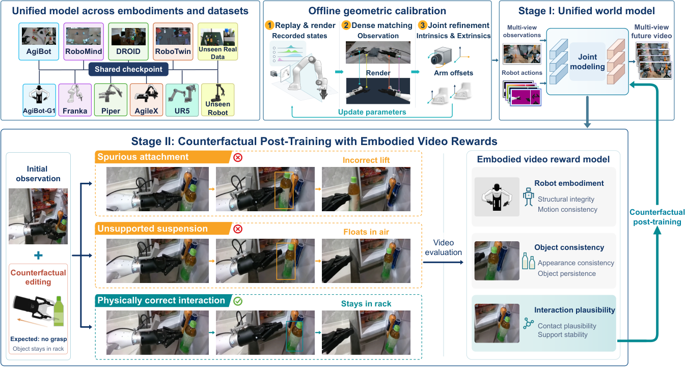

> 图解：DreamTrue 的整体框架。先通过相机标定让机器人渲染图与录制视频对齐；Stage I 学习跨本体的动作条件预测；Stage II 用视频奖励模型做反事实后训练，提升交互的物理合理性。

## 一、问题：为什么现有机器人世界模型"不听话"又"爱幻想"

世界模型的价值在于充当策略的虚拟训练场和评估器。但从公开的机器人数据集（DROID、AgiBot 等）直接训练，会遇到两个结构性问题。

**问题 1：动作条件与视频在空间上错位。** 一种主流做法是把动作轨迹通过机器人 URDF 模型渲染成图像空间的条件，直接告诉模型"机械臂应该出现在哪"。这个思路的前提是相机标定足够准——但很多数据集根本不是为视觉训练采集的，标定误差会让渲染出来的机器人和视频里的机器人对不上，监督信号本身就带噪。

**问题 2：成功偏差（success bias）。** 数据里几乎全是成功演示，模型没见过"抓空"、"滑落"这些失败情形，于是倾向于在任何动作下都预测成功结局。典型例子：夹爪明明没抓到，生成的视频里物体却跟着升起来了。这种"幻觉"会系统性高估策略成功率，让基于世界模型的策略评估变得过于乐观——这一点在后文的策略评估实验里会被量化验证。

重新采集一批标定精确、覆盖失败案例的真机数据当然能解决问题，但成本极高。DreamTrue 的核心立场是：**不采新数据，把旧数据修好、把旧动作改出新花样**。

## 二、方法总览：一个公式和三个组件

形式上，给定初始多视角观测 $x_0^{1:V}$、任务指令 $\ell$ 和动作序列 $a_{1:T}$，世界模型要建模未来视频的分布：

$$
\hat{x}_{1:T}^{1:V} \sim p_\theta\left(x_{1:T}^{1:V} \mid x_0^{1:V}, \ell, a_{1:T}\right)
$$

其中 $V$ 是相机视角数，$T$ 是预测时域。DreamTrue 由三个组件构成：

1. **离线几何标定**：从现有录制数据中精化相机参数（内参、外参、畸变）和机械臂安装偏移，无需专门的标定序列；
2. **Stage I 监督训练**：把动作轨迹渲染成图像空间条件，训练一个多视角、跨本体的视频生成器，解决"动作跟随"；
3. **Stage II 反事实后训练**：修改录制轨迹构造反事实动作，用人工标注训练的具身视频奖励模型给生成结果打分，以 RL 方式把模型推向"物理合理"。

下面按这个顺序逐一拆解。

## 三、离线几何标定：从录制数据里"榨"出相机参数

传统手眼标定要解 $AX=XB$，无标记方法要用可微渲染，两者都需要专门的标定采集流程；PointWorld 虽然能从现有录制精化相机位姿，但依赖双目深度。DreamTrue 的标定只用 RGB 演示视频本身，这让它能覆盖几乎所有开源操作数据集。

### 三类对应关系

关键洞察是：机器人的几何形状是已知的（URDF 模型），机器人在每一帧的状态也是录制好的，所以可以把机器人渲染进视频图像空间，建立像素级对应关系来反推相机参数。具体构造三类对应：

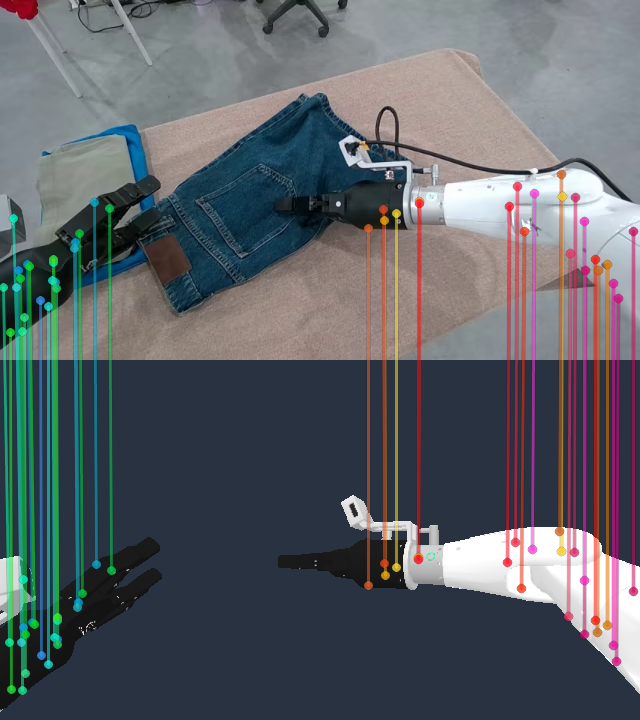

> 图解（$\mathcal{P}_{\mathrm{align}}$）：渲染机器人与观测机器人之间的像素对应，用 RoMaV2 提取匹配点，SAM3（在机器人分割数据上微调过）生成的 mask 把匹配限制在机械臂区域。

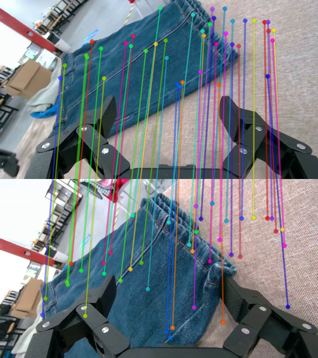

> 图解（$\mathcal{P}_{\mathrm{time}}$）：同一相机跨帧的静态背景对应，给标定增加时序约束。

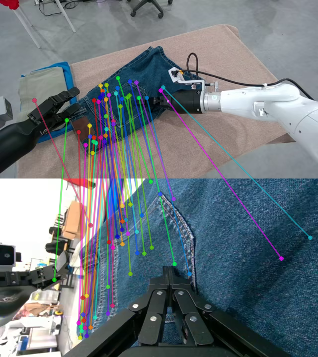

> 图解（$\mathcal{P}_{\mathrm{view}}$）：同步的多相机视角之间的对应，约束多视角几何一致性。

### 联合优化目标

用这三类对应关系，联合精化相机参数 $\Theta$（内参、外参、畸变）和机械臂安装偏移 $\xi$：

$$
(\Theta^*, \xi^*) = \arg\min_{\Theta,\xi}\; \lambda_a \left\langle \left\| u_i - \pi_i\left(X_i(s,\xi);\Theta,\xi\right) \right\|_2^2 \right\rangle_{\mathcal{P}_{\mathrm{align}}} + \lambda_e \left\langle \left| (r_a \times r_b)^\top (o_a - o_b) \right| \right\rangle_{\mathcal{P}_{\mathrm{view}} \cup \mathcal{P}_{\mathrm{time}}}
$$

第一项是渲染机器人表面点 $X_i$（由录制状态 $s$ 和安装偏移 $\xi$ 决定）投影后与匹配像素 $u_i$ 的重投影误差；第二项是射线共面约束——观察同一场景点的两条射线 $r_a, r_b$ 必须与两个相机中心 $o_a, o_b$ 的基线共面。

> 博主点评：这个设计的聪明之处在于"借力打力"——机器人本身就是场景里几何信息最精确的物体，它的 CAD 模型和关节状态都是已知的，相当于数据集里自带了一块"免标定的标定板"，之前一直被浪费掉了。

作者还释放了三个数据集共 **153,666 条 episode（超 1,660 小时）** 的精化标定结果，每条记录包含相机内参、外参和畸变参数。

## 四、Stage I：把异构动作统一渲染成"图像语言"

### 跨本体动作表征

不同机器人本体的动作定义完全不同（关节空间、末端位姿、坐标系各异），没法共用一个动作编码器。DreamTrue 的思路是：**不管什么本体，都把动作翻译成同一种"图像语言"**。用机器人 URDF 模型 $\rho$ 和标定好的参数 $(\Theta^*, \xi^*)$，按动作轨迹 $a_{1:T}$ 渲染每个时刻 $t$、每个视角 $v$ 下的：

- RGB 渲染图 $R_t^v$（夹爪开合度线性映射到背景 RGB 亮度 $[0,255]$，左/右夹爪分别占红/绿通道，得到 $\tilde{R}_t^v$）；
- 深度图 $D_t^v$；
- 无遮挡 mask $M_t^v$（amodal mask）；
- 相机光线的稠密 Plücker 编码图 $P_t^v$。

最终的动作表征为 $\mathcal{C}=\{(\tilde{R}_t^v, D_t^v, M_t^v, P_t^v)\}_{t=1:T,\,v=1:V}$。

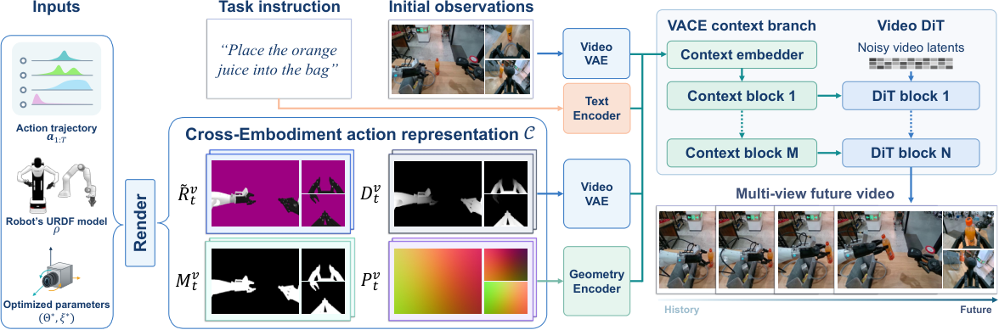

> 图解：模型架构。机器人渲染图、夹爪开合度和相机光线通过 VACE 条件分支注入视频 DiT，预测多视角未来视频。渲染 RGB 和归一化深度由预训练视频 VAE 分别编码，mask 和 Plücker 图由一个 3D 卷积几何编码器联合编码，拼接后形成 VACE 分支的输入上下文，产生的残差注入对应的 DiT 层。多视角的视频 latent 按固定顺序沿宽度方向平铺，动作特征按相同布局排列；初始多视角观测编码为参考 latent 帧。

### 监督训练目标

生成器基于 Wan2.1-VACE-14B 初始化，处理 101 帧、三视角同步、单视角 $240\times320$ 分辨率的片段。训练用 flow matching 目标：设 $z$ 为真实多视角视频 latent，$z_\tau$ 为其在时刻 $\tau$ 加噪后的版本，$u_\tau$ 为对应的 velocity 目标，条件 $c=(x_0^{1:V}, \ell, \mathcal{C})$，则：

$$
\mathcal{L}_{\mathrm{SFT}} = \mathbb{E}_{(z,c)\sim\mathcal{D},\,\tau,\,\epsilon} \left[ \left\| f_\theta(z_\tau, \tau; c) - u_\tau \right\|_2^2 \right]
$$

训练联合采样 AgiBotWorld-Beta、DROID、RoboMIND 2.0、RoboTwin 2.0 四个数据集，过滤后共 **2,232 小时** 多视角轨迹，覆盖 5 种机械臂的真机与仿真环境。统一的动作表征让它们可以共享一个模型，无需逐数据集微调。

## 五、Stage II：反事实动作 + 具身视频奖励

Stage I 解决了"听话"，但模型还是没见过失败。Stage II 要解决的核心矛盾是：**想给模型看更多交互情形，但这些情形没有配对的真实未来视频，怎么提供监督信号？**

### 反事实动作构造

做法非常简洁：对一条录制轨迹的末端执行器最终位姿施加一个 SE(3) 扰动，从固定的初始位姿向扰动后的终点插值，再用逆运动学（IK）解出修改后的关节序列。初始观测和任务指令保持不变——这样就从同一个场景出发，探索"如果当时机械臂走的是另一条轨迹，会发生什么"。只保留运动学可行的条件，并用修改后的序列重新计算机器人渲染和腕部相机几何。

### 具身视频奖励模型：缺陷不需要参考答案也能看出来

这一步的关键洞察是：虽然没有配对的真实未来，但 **很多物理错误是直接可观察的**。夹爪没抓到物体，物体却跟着飞起来——不需要参考视频也能判定这是错的。

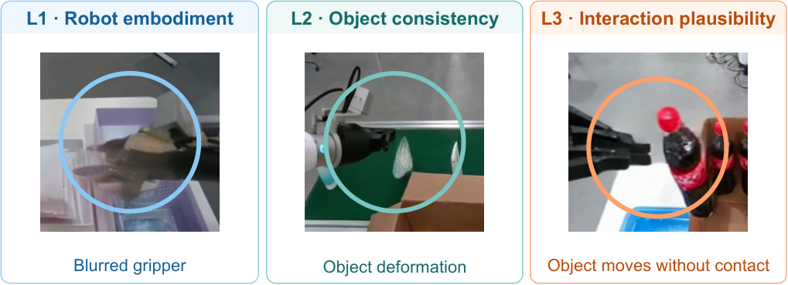

> 图解：三个互补的缺陷维度——L1 机器人本体缺陷（复制、消失、结构/材质异常）、L2 物体一致性缺陷（外观、消失、形变、材质纹理异常）、L3 交互合理性缺陷（接触-运动不匹配、物理上不合理的交互）。

作者构建了一个覆盖多个世界模型生成视频的人工标注缺陷数据集（共 44.9K 视频、30.4K 条缺陷标注），用它微调一个视觉-语言奖励模型 $q_\phi$（基于 Qwen3.5-9B 全参数微调），以交叉熵损失预测三个维度的缺陷。给定生成视频 $\hat{x}$，设 $p_\phi^k(\hat{x})$ 为维度 $k \in \{\mathrm{L1},\mathrm{L2},\mathrm{L3}\}$ 的预测缺陷概率，定义连续奖励：

$$
R^k(\hat{x}) = -p_\phi^k(\hat{x})
$$

缺陷概率越低，奖励越高——这样就把二值人工标注转换成了连续的 RL 反馈信号。打分时奖励模型只看被评估视频和固定的评估提示，不看参考视频或动作条件。

> 博主点评：这里绕开了一个视频生成 RL 的老大难——"没有 ground truth 怎么打分"。答案是把"对错"问题降级成"有没有可见缺陷"问题，而后者是人类（和 VLM）不依赖参考答案就能判断的。这是把 RLHF 思路落到物理世界的漂亮一步。

### 奖励引导的生成器后训练

从 Stage I 检查点出发，把录制轨迹与构造的反事实动作混合训练。对每个动作条件采样一组未来视频，用冻结的奖励模型打分：所有预测都获得 L1/L2/L3 三个缺陷奖励；录制动作下的预测额外获得一个对真实未来的 PSNR 奖励以保持保真度。按 GDPO 的做法，每个奖励在采样组内归一化，加权求和得到优势 $A_i$（三个缺陷通道权重各为 1，PSNR 通道权重为 0.5），再用 DiffusionNFT 优化生成器：

$$
\mathcal{L}_{\mathrm{NFT}} = \mathbb{E}_{i,\tau,\epsilon_i} \left[ r(A_i)\,\ell_i^+ + \left(1 - r(A_i)\right)\ell_i^- \right]
$$

其中 $\ell_i^+$ 和 $\ell_i^-$ 是正、负去噪目标，$r(\cdot)$ 是截断优势映射。Stage II 冻结基础生成器、几何编码器和奖励模型，只更新 DiT 和 VACE 的 LoRA 分支（rank 128，可训练参数约 0.7B，学习率 $5\times10^{-6}$）。

## 六、实验：从动作跟随到策略评估的全链路验证

### 实验设置

- **数据**：四数据集联合训练，过滤后 2,232 小时多视角轨迹；另外在 AgiBot 上扰动录制轨迹构造了覆盖 54 个任务的 **160 个反事实测试条件**。
- **基线**：DreamDojo、GE-Sim 2.0、Genie Envisioner、EnerVerse-AC，以及消融项 Ours (w/o RL)（仅 Stage I）。
- **指标**：动作跟随用 nDTW（来自 EWMBench）；保真度用 PSNR/SSIM/LPIPS；另报告聚合六个 WorldArena 质量维度的 EWMScore-P；物理合理性由三名独立标注员按多数票评估缺陷率（任意缺陷标签的 Fleiss' $\kappa = 0.7817$）。

### 主结果：动作跟随与交互合理性双优

| 模型 | EWMScore-P ↑ | PSNR ↑ | SSIM ↑ | LPIPS ↓ | nDTW ↑ | 本体缺陷 ↓ (%) | 物体缺陷 ↓ (%) | 交互缺陷 ↓ (%) | 反事实 nDTW ↑ |
|---|---|---|---|---|---|---|---|---|---|
| EnerVerse-AC | 68.61 | 19.17 | 0.863 | 0.158 | 0.8058 | 1.25 | 49.38 | 48.12 | 0.6828 |
| Genie Envisioner | 70.37 | 20.72 | 0.890 | 0.112 | 0.8124 | 0.00 | 43.75 | 54.38 | 0.7379 |
| DreamDojo | 70.01 | 19.27 | 0.812 | 0.163 | 0.6578 | 0.00 | 12.50 | 16.25 | 0.6407 |
| GE-Sim 2.0 | 72.36 | 19.91 | 0.874 | 0.130 | 0.8063 | 0.00 | **3.75** | **7.50** | 0.7817 |
| Ours (w/o RL) | **72.84** | 22.66 | 0.928 | 0.099 | 0.8711 | 0.00 | 31.88 | 48.12 | 0.8735 |
| Ours (full) | 72.51 | **23.06** | **0.936** | **0.094** | **0.8772** | 0.00 | **3.12** | **6.25** | **0.8831** |

> 表解：AgiBot 基准上录制动作（左半）与反事实动作（右半）的评测结果。录制动作下的缺陷率未列出，此处展示的是 160 个反事实条件上三名标注员多数票得出的缺陷率。加粗为全场最优或接近最优。

几个值得注意的读数：

- **奖励引导的后训练把物体缺陷率从 31.88% 压到 3.12%，交互缺陷率从 48.12% 压到 6.25%**，同时 nDTW 不降反升（0.8711 → 0.8772，反事实下 0.8735 → 0.8831）——交互质量提升没有牺牲动作跟随。
- 全模型在录制动作与反事实动作下都拿到最高 nDTW，且对真实视频的 PSNR/SSIM/LPIPS 全部最优。
- 在 AgiBot World Challenge 2026 世界模型赛道中，DreamTrue 以综合分 0.829、动作跟随 0.9651、视觉质量 0.6246 **排名第一**，超过 PAIWorld（0.8245）和 Loop（0.8241）。

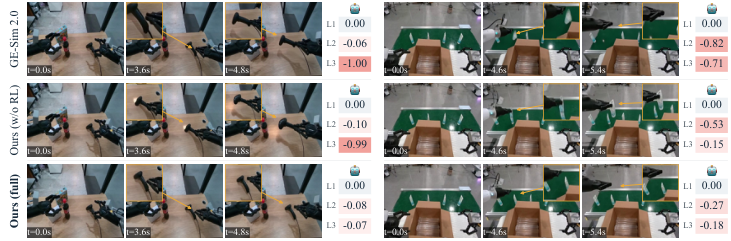

> 图解：与 GE-Sim 2.0 和未做 RL 的版本相比，完整模型避免了无支撑的扫描仪运动、物体消失或复制等问题。黄色标注框出关键区域，L1–L3 分数分别评估本体、物体和交互质量。被抓取的物体随夹爪移动，未抓取的物体留在桌上——包括只有单臂抓取成功的情形。

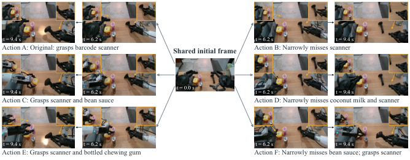

> 图解：固定初始场景、改变动作条件时的预测结果，覆盖不同抓取目标和单/双臂操作。这直接验证了世界模型最核心的能力：同一画面，不同动作，走向不同的合理结局。

### 跨本体与跨环境泛化

| 数据集 | 模型 | PSNR ↑ | SSIM ↑ | LPIPS ↓ |
|---|---|---|---|---|
| DROID | Ctrl-World | 22.00 | 0.772 | 0.162 |
| DROID | Ours (full) | **22.95** | **0.848** | **0.073** |
| RoboMIND 2.0 | Ours (full) | **23.84** | **0.826** | **0.126** |
| RoboTwin 2.0 | Ours (full) | **27.35** | **0.834** | **0.155** |

在 DROID 上，LPIPS 从 Ctrl-World 的 0.162 直接砍到 0.073，提升幅度非常可观。更难得的是零样本迁移：把训练中从未出现的 WidowX250 本体放进 RoboTwin 2.0，以及在未见过的真实场景中自采的 Piper 数据上，不做任何微调也能产生合理预测。

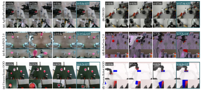

> 图解：共享检查点在 4 个训练数据集上的 rollout（a–d，覆盖真机与仿真操作），以及不加微调直接泛化到（e）未见过的真实场景和（f）未见过的机器人本体 WidowX250。

### 几何标定的作用有多大

标定质量用渲染机器人 mask 与 SAM3 mask 的面积加权 IoU 衡量。相对数据集自带标定，该方法在 130,182 条 AgiBot episode 上平均 IoU 提升 **0.228**（97.1% 的 episode 有改善），在 63,061 条 DROID episode 上提升 **0.212**（91.6% 有改善）。仅用 RGB 就在 DROID 上 75.5% 的 episode 优于依赖双目深度的 PointWorld。

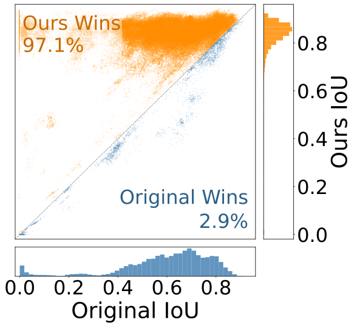

> 图解：AgiBot 头部视角上 Original（数据集标定）与本文方法的 IoU 散点对比，对角线以上的点表示本文方法更优。

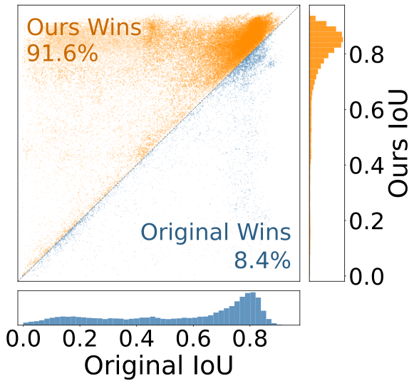

> 图解：DROID 两个外部视角平均 IoU 上 Original 与本文方法的对比。

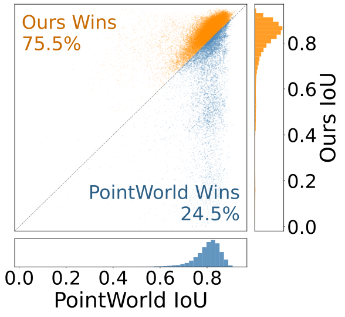

> 图解：DROID 上 PointWorld 与本文方法的 IoU 对比。

更重要的是标定对下游预测的传导效应：

| 数据集 | 训练标定 | 推理标定 | EWMScore-P ↑ | PSNR ↑ | SSIM ↑ | nDTW ↑ | 同步误差 (px) ↓ |
|---|---|---|---|---|---|---|---|
| AgiBot | 数据集自带 | 数据集自带 | 72.11 | 21.06 | 0.898 | 0.8159 | 7.73 |
| AgiBot | 数据集自带 | 精化 | 72.38 | 21.38 | 0.907 | 0.8243 | 5.77 |
| AgiBot | 精化 | 精化 | **72.84** | **22.66** | **0.928** | **0.8711** | **4.60** |
| DROID | 数据集自带 | 数据集自带 | 71.03 | 20.77 | 0.809 | 0.7718 | 11.78 |
| DROID | 数据集自带 | 精化 | 71.51 | 21.36 | 0.817 | 0.8569 | 10.21 |
| DROID | 精化 | 精化 | **72.29** | **22.66** | **0.841** | **0.8919** | **8.06** |

> 表解：同步误差指预测帧与真实帧中末端执行器位置的 2D 欧氏距离（像素）。只在推理时换用精化标定，不重训模型就全面涨点；训练阶段也用精化标定后进一步提升——AgiBot 和 DROID 的 PSNR 分别 +1.28 dB、+1.30 dB，同步位置误差一致下降。这说明空间对齐对"条件输入"和"监督信号"两端都重要。

### 奖励模型本身靠谱吗

在 4,893 条留出操作片段上验证奖励模型与人类判断的一致性：

| 维度 | 准确率 ↑ (%) | Macro-F1 ↑ (%) | MAE ↓ |
|---|---|---|---|
| L1 本体 | 96.69 | 69.37 | 0.041 |
| L2 物体 | 79.24 | 79.00 | 0.243 |
| L3 交互 | 83.08 | 74.27 | 0.198 |
| 平均 | **86.33** | **74.21** | **0.160** |

奖励模型训练语料混合了真实视频（作为无缺陷参照）与来自 8 个世界模型（本文模型 + DreamDojo、Ctrl-World、EnerVerse-AC、Genie Envisioner、GE-Sim 2.0、Cosmos Predict 2.5、IRASim）在录制/反事实动作下的标注预测，训练/验证各 31,600 / 4,893 条视频，按源 episode 划分。视频以 5 FPS 采样、高度缩放到 240 像素。

### 终极拷问：能用来评估策略吗

世界模型最有价值的下游用途是 **在真机执行前离线评估策略**。作者在 RoboTwin 2.0 的三个双臂任务（锤击积木、交接积木、放置双鞋）× 简单/困难两种设置下，用 4 个 VLA 策略（EventVLA、$\pi_{0.5}$、X-VLA、starVLA）各执行 60 个冻结场景，共 240 条动作轨迹，让世界模型预测结果，人工标注视频结局后与仿真 ground truth 对比。

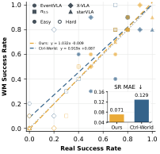

> 图解：24 个任务-策略-设置组合上，世界模型预测成功率与真实仿真成功率的散点及线性拟合。本文模型的拟合线几乎贴合理想对角线（$y = 1.032x - 0.009$），而基线明显上移（$y = 0.919x + 0.087$）——偏差集中在低成功率区间，基线把失败的抓取"幻觉"成了成功。内嵌小图显示成功率 MAE。

| 模型 | MAE (pp) ↓ | Bias (pp) | Acc. ↑ | F1 ↑ | Pearson r ↑ | Spearman ρ ↑ |
|---|---|---|---|---|---|---|
| Ctrl-World | 12.92 | +5.42 | 0.838 | 0.810 | 0.860 | 0.850 |
| Ours | **7.08** | **+0.42** | **0.904** | **0.881** | **0.964** | **0.937** |

数字背后的故事很清晰：Ctrl-World 产生了 26 个假阳性（实际失败却预测成功），正偏差 +5.42 个百分点——这就是"成功幻觉"的直接量化；DreamTrue 把假阳性压到 12 个，偏差接近零（+0.42 pp），240 条 episode 上的结局分类准确率达 90.42%（Precision 87.63%、Recall 88.54%），Spearman 排序相关 0.937。换言之，它不仅能说对"成没成"，还能给策略排队排名——这正是离线策略评估最需要的两个能力。

## 七、附录要点：数据流水线与标注可靠性

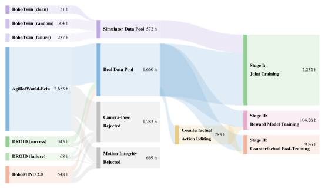

> 图解：从原始演示源出发，经过几何标定和运动过滤到两个训练阶段的数据流水线，数字为累计小时数。

几个值得记录的复现细节：

- **标定实现**：按采集者、相机、机器人 ID 分组，每组先标定随机选的一条 episode 再泛化验证，对对齐差的组渐进追加标定；AgiBot/RoboMIND 用固定初始化，DROID 因外参多变用 32 组初始化；评估 episode 的标定不使用预测区间内的真实帧（防泄漏）。
- **标注可靠性**：960 条反事实视频（6 模型 × 160 条件）全部获得三名标注员的完整三份标注，模型身份盲化、展示顺序各自随机。任意缺陷的观察一致率 89.72%，逐维度一致率 L1 99.65% / L2 89.31% / L3 87.15%。
- **WorldArena 六维质量**（录制动作下）：Ours (w/o RL) 以 EWMScore-P 72.84 居首，完整模型 72.51 次之；完整模型在 Control 维度拿到最高的 88.09，视觉分略降（69.30）是 RL 后训练权衡保真度与合理性的痕迹。
- **释放资产**：153,666 条 episode 的精化标定（1,660.31 小时：AgiBot 1,225.60h / DROID 239.73h / RoboMIND 194.98h）+ 44.9K 视频的缺陷标注语料（含 30.4K 条缺陷标签）。

## 八、总结与局限

- **核心问题**：机器人世界模型要当仿真器用，必须同时"听动作的话"和"讲物理的理"，而现有数据在标定精度和失败覆盖上双双欠账。
- **解法一（治标到治本）**：离线几何标定把机器人自身当"免费标定板"，纯 RGB 精化相机参数，仅推理端应用就涨点，训练端应用 PSNR 再 +1.3 dB 左右。
- **解法二（无中生有）**：SE(3) 扰动 + IK 构造反事实动作，把"失败情形"从已有数据里改出来，不采一条新真机数据。
- **解法三（无师自评）**：44.9K 视频人工缺陷标注训练 VLM 奖励模型，把"没抓到却飞起来"这类无需参考答案的可见缺陷变成连续 RL 奖励，交互缺陷率 48.12% → 6.25%，动作跟随不降反升。
- **下游价值**：策略结局评估的 Spearman ρ 达 0.937、偏差仅 +0.42 pp，让"先在世界里跑一遍再决定要不要在真机上跑"变得可信。

**局限与展望**：动作表征、生成器和 VLM 奖励模型都在图像空间工作，遇到遮挡或视角受限时，框架可能生成或奖励"视觉上合理但物理上错误"的交互。引入显式的 3D/物理状态估计，或让奖励模型具备更深的几何推理能力，是这条路线自然的下一步。

> 本文参考自 [DreamTrue: Action-Faithful Robot World Model with Counterfactual Post-Training](http://arxiv.org/abs/2610.12468v1)