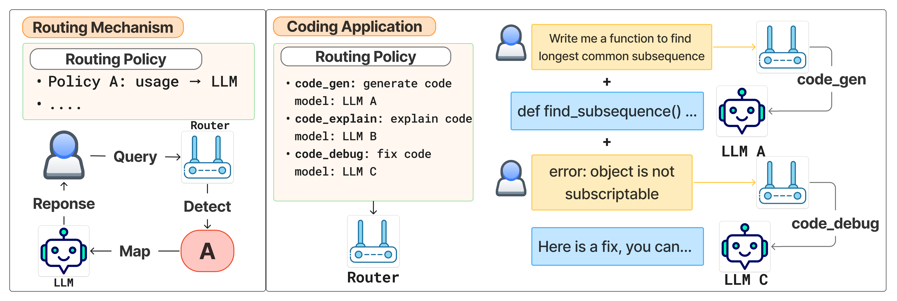
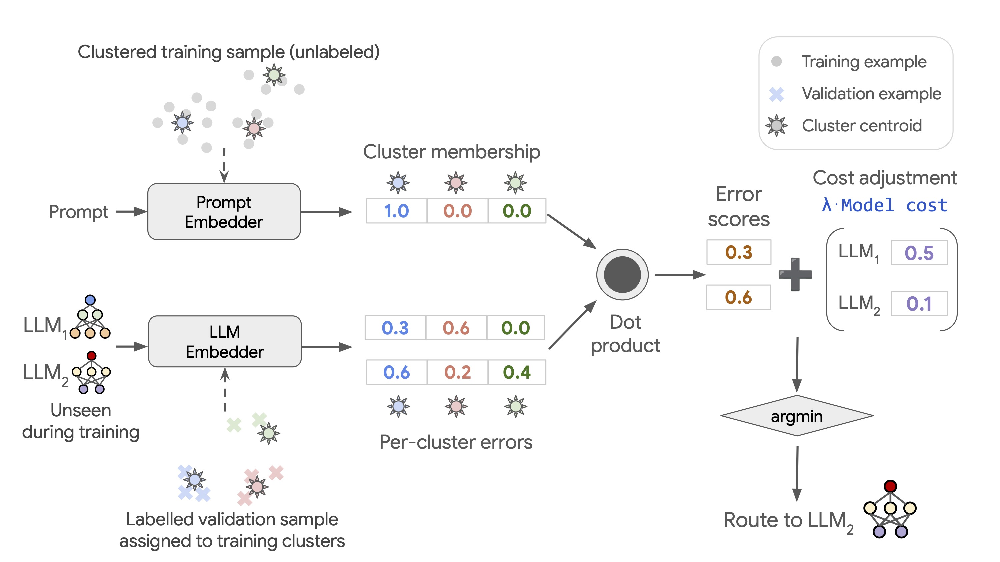
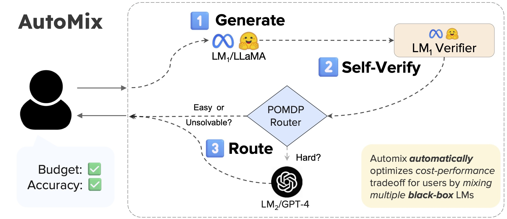

# Dynamic Model Routing 与 Cascading 全景解读：高效 LLM 推理的系统方法论

## 0. 这篇综述到底在回答什么问题？

如果你在线上部署过 LLM，大概率会遇到同一个矛盾：

- 小模型便宜、快，但复杂问题答不好；
- 大模型效果强，但每次调用都更贵、更慢。

这篇综述的核心观点非常直接： **不要让一个模型硬扛所有请求** ，而是做 **动态路由（Routing）** 和 **级联（Cascading）** ，让不同查询匹配不同模型，从而优化质量-成本比。

---

## 1. Routing vs Cascading：两个互补范式

### 1.1 Routing（单次决策）

对每个输入先判断，再一次性选择一个最合适的模型。

### 1.2 Cascading（多阶段决策）

先让小模型回答，再根据质量或置信度决定是否升级到更强模型。

我们可以把它抽象成一个目标函数：在预算约束下最大化整体质量。

$$
\max_{\pi} \mathbb{E}_{q \sim \mathcal{D}} \left[ \text{Quality}(q, \pi(q)) - \lambda \cdot \text{Cost}(q, \pi(q)) \right]
$$

其中 $\pi(q)$ 是路由策略，$\lambda$ 控制质量与成本之间的权衡。

---

## 2. 论文给出的统一分析框架（很实用）

作者提出了三个横切维度，比单纯按方法分类更贴近真实工程：

- **何时决策（When）** ：生成前（pre-generation）/ 生成后（post-generation）/ 多阶段；
- **用什么信号（What）** ：query 特征、模型元信息（价格/延迟）、输出置信度、在线反馈；
- **怎么计算（How）** ：规则阈值、监督分类器、在线强化学习策略。

> 图解：很多线上系统并不是“纯 Difficulty”或“纯 Uncertainty”，而是多范式叠加。例如先用 query 分类器预路由，再用输出置信度决定是否级联升级。

---

## 3. 六大路由范式逐一拆解

### 3.1 Difficulty-aware Routing（按难度分发）

代表方法：BEST-Route、Semantic Router、EmbedLLM、GraphRouter。  
核心逻辑：简单题给小模型，难题给大模型。

- BEST-Route：DeBERTa 路由器 + best-of-$n$ 采样，小模型先多采样提质，不够再升档；
- Semantic Router：先识别是否需要推理链（CoT），只在必要时启用高成本推理；
- EmbedLLM：通过矩阵分解学习 query-模型兼容性，不显式标注难度也能路由；
- GraphRouter：构建任务-查询-模型异构图，用 GNN 预测效果与成本，支持新模型泛化。

**关键洞察** ：难度估计不只是“问题有多难”，更接近“这个问题在当前模型池中由谁处理最合适”。

### 3.2 Human Preference-aligned Routing（偏好对齐路由）

代表方法：RouteLLM、Arch-Router、P2L、Eagle、Zooter。  
核心逻辑：路由目标不只追求“正确”，还应覆盖“用户更喜欢”。

- RouteLLM：用 Chatbot Arena 人类偏好 + LLM judge 数据训练 win-predictor；
- Arch-Router：把用户策略（如法律总结走模型 A、代码走模型 B）写入路由上下文，支持动态改策略；
- P2L：给定 prompt 预测 Bradley-Terry 系数，形成任务定制排行榜；
- Eagle：无需训练，基于 ELO 全局+局部评分；
- Zooter：先用 Reward Model 打标签，再蒸馏到轻量分类器。

> 图解：偏好路由把“最优模型”从单一准确率定义，扩展为“该用户场景下的主观最优”。

> 图解：这张图展示了 Arch-Router 的核心流程：输入不仅有用户 query，还有路由策略文本；路由器先选“策略”，再映射到具体 LLM。横向看是策略选择，纵向看是模型执行。

### 3.3 Clustering-based Routing（聚类路由）

代表方法：UniRoute、Avengers-Pro。  
核心逻辑：先把 query 按语义聚成簇，再学习每个簇内哪个模型性价比最高。

- UniRoute：$K$-means 得到簇中心；每个模型在每个簇上有误差画像；推理时按簇内成本校正误差选模型；
- 优势：可在不重训路由器的情况下接入新模型（只需评估新模型在各簇表现）；
- Avengers-Pro：强调 Pareto 前沿优化，目标是同质量更低成本或同成本更高质量。

> 图解：横轴可理解为不同 query cluster，纵轴是各模型在该簇的代价调整后误差。路由器本质上在做簇级别的模型检索。

### 3.4 RL Routing（强化学习路由）

分两类： **策略优化** 和 **Bandit 在线学习** 。

#### 3.4.1 策略优化

- Router-R1：动作空间是 think（内部推理）/ route（调用某模型），最多多轮迭代；
- R2-Reasoner：先拆子任务，再给子任务分配模型，训练使用 SFT + GRPO。

这类方法更适合 API 成本高、且可容忍一定延迟的场景。

#### 3.4.2 Bandit 在线学习

- MetaLLM：多臂老虎机，寻找最便宜且可能答对的模型；
- MixLLM：Contextual Bandit + policy gradient，用在线二值反馈持续更新策略；
- PILOT：把离线偏好先验与在线反馈结合进 LinUCB；
- Dueling Feedback：用成对偏好反馈训练上下文对决 bandit；
- TI-UCB：处理模型性能随时间提升后收敛的非平稳场景。

**工程价值** ：Bandit 方法天然适合线上持续优化，比一次性离线训练更能抵抗分布漂移。

### 3.5 Uncertainty-based Routing（不确定性路由）

核心问题：模型“自信”是否真的对应“答对”？

- 研究发现：probe/perplexity 类方法通常优于口头自报置信度（verbalization）；
- CP-Router：用 Conformal Prediction 在 LLM 与 LRM 之间切换，若候选答案集不确定（预测集大）则升级到更强推理模型；
- LLM-as-a-Judge 路线：用外部评审模型估计响应质量，而不是依赖内部 logits。

可用一个简化的置信度表达式：

$$
u = 1 - \max_{y} p(y \mid q)
$$

当 $u$ 超过阈值 $\tau$ 时触发升级（defer/escalate）。

### 3.6 Cascading（级联系统）

代表方法：FrugalGPT、AutoMix、Self-REF、LM-Blender。  
核心流程是：小模型先答 → 质量估计/自验证 → 决定停止或升级。

- FrugalGPT：路由器 + 质量估计器 + stop judge，形成三段式闭环；
- AutoMix：few-shot 自验证 + POMDP 决策，黑盒模型也可用；
- Self-REF：微调生成置信 token（如 `<CN>` / `<UN>`）做升级或拒答判定；
- LM-Blender：并行询问多个模型，再排序融合，走集成增强路线。

> 图解：这张图是典型两级 cascade：LM1 先生成并自检，若置信不足再调用 LM2。纵向是阶段推进，横向是质量与成本的动态平衡。

---

## 4. 多模态路由：刚起步但很关键

综述指出，多模态（图像/语音/视频）路由明显落后于文本路由。  
MMR-Bench 这类基准已开始覆盖 OCR、VQA、多模态数学推理，但仍有三大难点：

- 跨模态统一表示；
- 单个 query 同时需要多模态协同；
- 不同模态计算成本差异巨大，路由策略需感知 modality-specific cost。

---

## 5. 评测体系：怎么证明“路由真的值”？

### 5.1 Benchmark

- RouterBench：40 万+ 预计算记录，覆盖 11 个模型、7 类任务；
- RouterEval：2 亿+ 记录、8500+ 模型，支持不同规模候选池（3 到 1000）；
- MixInstruct：偏好监督友好，适合 routing/ensemble 评测。

### 5.2 Metrics

- **质量类** ：routing accuracy、任务准确率、win rate、AUC；
- **效率类** ：TTFT、TPOT、TPS/QPS、goodput；
- **成本类** ：API 成本、token 成本、Pareto frontier；
- **可持续性** ：能耗与碳排放。

> 图解：真正有说服力的结果，不是某个指标单点提升，而是在 Pareto 前沿上整体外移（同成本更高质量，或同质量更低成本）。

---

## 6. 这篇综述给出的结论与未来方向

作者最后给出三条主线挑战，非常贴近生产环境：

- **泛化能力** ：很多路由器绑定固定模型池，遇到新模型或新领域时性能下滑；
- **多阶段系统化** ：真实系统往往是组合式 pipeline，而非单步分类器；
- **多模态扩展** ：未来模型池必然跨文本、视觉、语音，路由复杂度会显著上升。

我的理解是：下一代高效推理系统，不会是一个最强模型，而是一个会调度模型群的智能控制器。

---

## 7. 方法全景速览（按范式）

| 范式 | 代表方法 | 典型机制 | 训练/反馈信号 |
| --- | --- | --- | --- |
| Difficulty | BEST-Route, Semantic Router, EmbedLLM, GraphRouter | 难度估计/兼容性预测/GNN | 问题-得分、历史性能成本 |
| Preference | RouteLLM, Arch-Router, P2L, Eagle, Zooter | 偏好学习/ELO/奖励蒸馏 | 人类偏好、LLM judge、RM 标签 |
| Clustering | UniRoute, Avengers-Pro | $K$-means + 簇级模型画像 | 无标注 query + 验证集表现 |
| RL Policy | Router-R1, R2-Reasoner | PPO/GRPO 多步决策 | 问题-模型质量反馈 |
| RL Bandit | MetaLLM, MixLLM, PILOT, TI-UCB | UCB/Thompson/Policy Gradient | 在线成功反馈/偏好比较 |
| Uncertainty & Cascade | CP-Router, AutoMix, Self-REF, FrugalGPT, LM-Blender | 置信度校准/自验证/升级停机判定 | 校准集、正确性标签、偏好数据 |

---

> 本文参考自 [Dynamic Model Routing and Cascading for Efficient LLM Inference: A Survey](https://arxiv.org/abs/2603.04445)