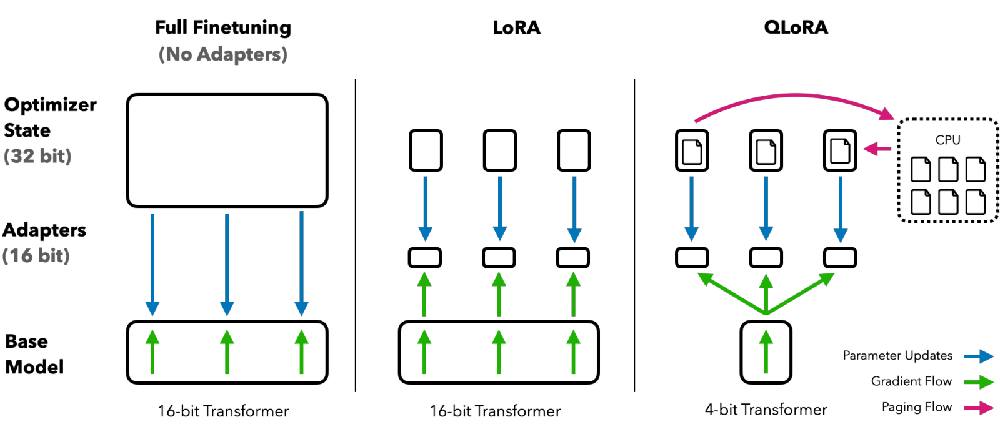
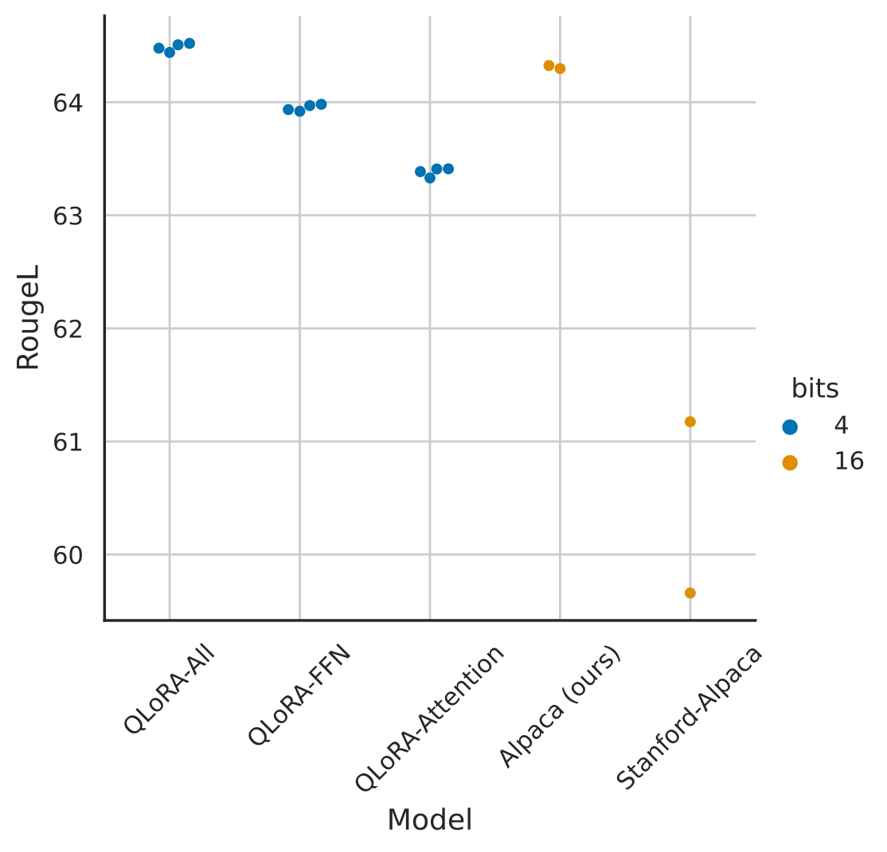
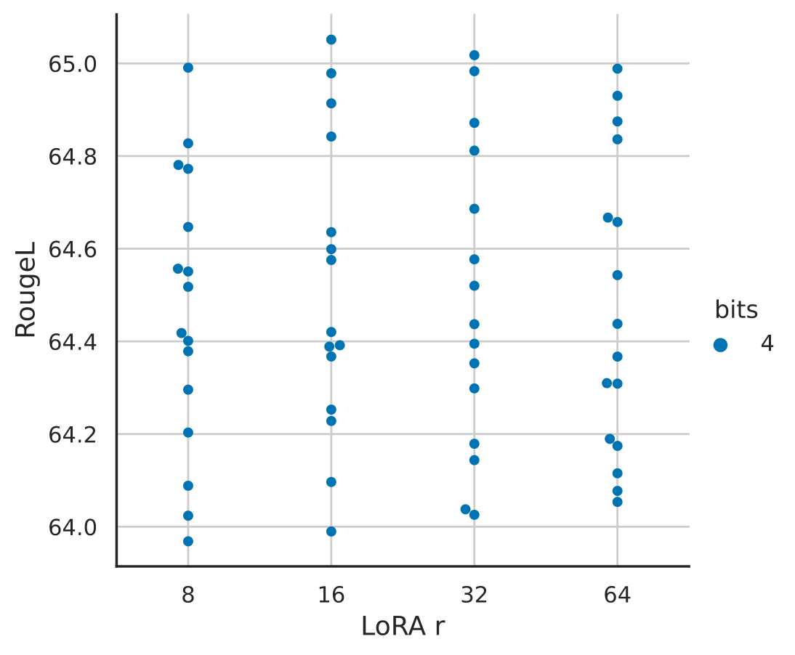
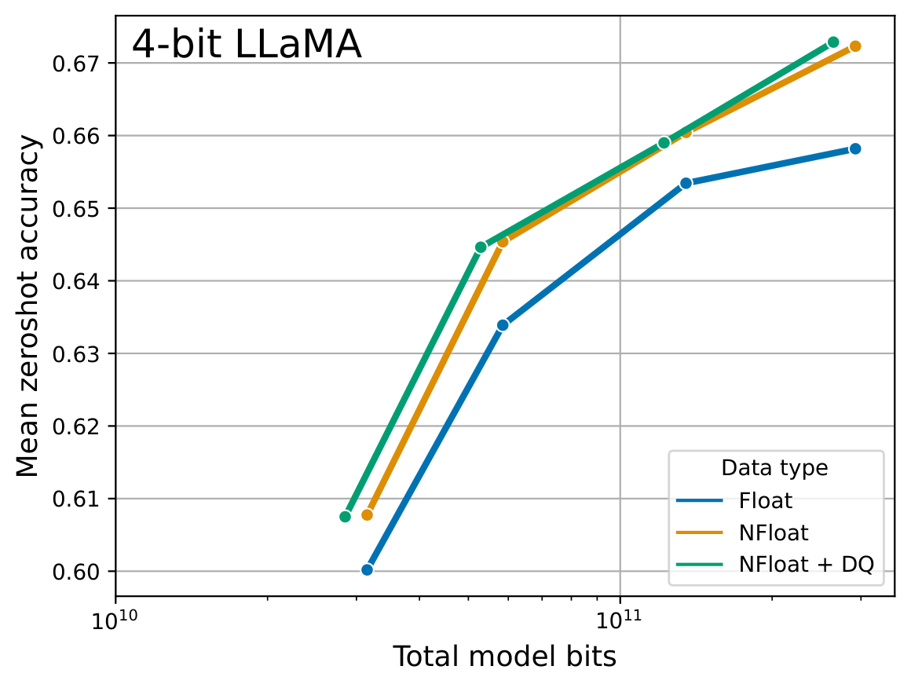
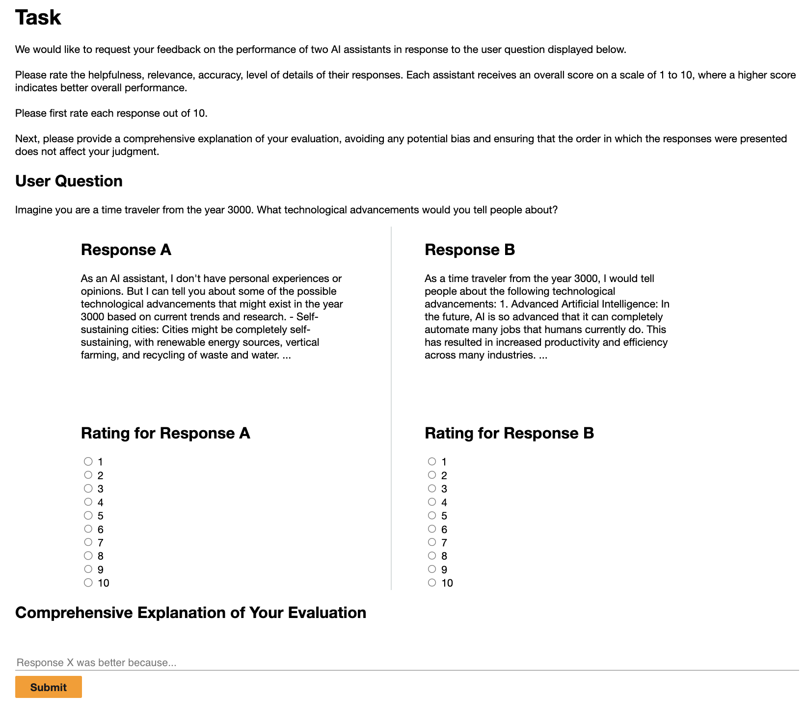
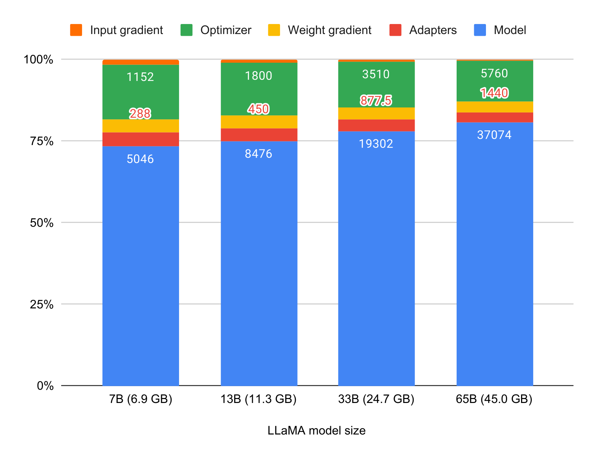

# QLoRA：单卡 48GB 微调 65B 大模型

想微调一个 65B 的大模型，常规 16-bit 全量微调需要超过 780GB 的显存，这基本把绝大多数实验室和个人研究者挡在了门外。这篇 NeurIPS 2023 的论文提出了 **QLoRA** ：把预训练模型用 4-bit 高精度量化后冻结，只反向传播梯度到一小撮 LoRA 适配器上，从而在 **单张 48GB GPU** 上完成 65B 模型的微调，且性能与 16-bit 全量微调完全持平。基于 QLoRA 训练的 **Guanaco** 系列模型在 Vicuna 基准上达到了 ChatGPT 99.3% 的水平，而最大的模型只需单卡训练 24 小时。这项工作直接改变了 LLM 微调的游戏规则，让"单卡微调最大开源模型"从不可能变成现实。

## 为什么微调大模型这么贵

在分析 QLoRA 怎么做之前，先看看显存到底花在了哪里。一个 LLaMA 65B 模型，光 16-bit 权重就占 130GB，加上梯度、Adam 优化器状态（一阶、二阶动量各占一份），全量微调显存需求轻松突破 780GB。

已有的量化方法（如 GPTQ、SmoothQuant、LLM.int8()）虽然能把模型压到 8-bit 甚至 4-bit，但它们只解决 **推理** 阶段的显存问题——一旦进入训练，反向传播就会击穿这些低精度表示，性能明显下降。

另一条路线是 LoRA（Low-Rank Adapter）这类参数高效微调（PEFT）方法：冻结原模型，只训练少量低秩适配器参数。给定投影 $\mathbf{X}\mathbf{W} = \mathbf{Y}$，LoRA 将其改写为：

$$
\mathbf{Y} = \mathbf{X}\mathbf{W} + s\mathbf{X}\mathbf{L}_1\mathbf{L}_2
$$

其中 $\mathbf{L}_1 \in \mathbb{R}^{h \times r}$、$\mathbf{L}_2 \in \mathbb{R}^{r \times o}$，$r$ 是一个很小的秩，$s$ 是缩放系数。LoRA 本身非常省参数，但问题是： **冻结的基座模型权重仍然要以 16-bit 形式常驻显存**，65B 模型光权重就 130GB，单卡依然装不下。

论文还指出了一个常被忽略的事实：LoRA 训练时的显存大头其实不在适配器参数本身，而在激活梯度。以 7B LLaMA、batch size 1 为例，LoRA 输入梯度占 567MB，而 LoRA 参数只有 26MB；即使开了梯度检查点（Gradient Checkpointing），每个序列的输入梯度仍平均占 18MB。这意味着 **激进地压缩 LoRA 参数量收益甚微**，反而可以放心地在每一层都加适配器来提升性能——这个观察对后面"追平全量微调"至关重要。

所以，真正的问题变成：能不能把冻结的基座模型压到 4-bit，还能让梯度穿过它无损地训练 LoRA？这正是 QLoRA 要解决的核心矛盾。

## QLoRA 的三大法宝

QLoRA 的核心思路一句话概括： **存储用 4-bit，计算用 16-bit**。基座模型权重以 4-bit NormalFloat（NF4）形式存储，前向和反向传播时临时反量化（dequantize）成 BFloat16 做矩阵乘法，而梯度只计算并更新 16-bit 的 LoRA 参数。

> 图解：三种微调方式的显存需求对比。全量微调（左）所有权重都是 16-bit 且全部可训练，65B 需要 >780GB；普通 LoRA（中）冻结 16-bit 基座、只训练 LoRA 参数，仍需 >350GB；QLoRA（右）把基座量化到 4-bit NF4，配合分页优化器处理显存尖峰，65B 只需 <48GB。

要做到"4-bit 存储、性能无损"，QLoRA 引入了三个关键创新。

### NF4：为正态分布权重量身定做的 4-bit 数据类型

先回顾一下分块量化（Block-wise Quantization）的基本套路：把 FP32 张量除以绝对值最大值缩放到目标范围，再四舍五入到低 bit 表示，例如量化到 Int8：

$$
\mathbf{X}^{\text{Int8}} = \text{round}\left( \frac{127}{\text{absmax}(\mathbf{X}^{\text{FP32}})} \mathbf{X}^{\text{FP32}} \right) = \text{round}(c^{\text{FP32}} \cdot \mathbf{X}^{\text{FP32}})
$$

反量化就是除回去。问题在于离群值（outlier）会撑大 absmax，导致大部分量化区间（bin）浪费。常用解法是把张量切成独立的小块，每块各用一个量化常数 $c$。

传统的 Int4/FP4 量化把数值 **均匀** 地铺在 $[-1, 1]$ 区间上。但论文注意到一个关键事实：预训练神经网络的权重近似服从零均值正态分布（作者用 Shapiro-Wilk 检验验证过，约 7.5% 的神经元例外），大部分权重集中在 0 附近。均匀分位等于在"没几个数的地方"浪费了宝贵的量化精度。

NF4 的做法是：让量化值直接取标准正态分布 $N(0,1)$ 的 **分位数**（quantile），保证每个量化 bin 里期望落入的权重个数相等：

$$
q_i = \frac{1}{2}\left( Q_X\left(\frac{i}{2^k + 1}\right) + Q_X\left(\frac{i + 1}{2^k + 1}\right) \right)
$$

其中 $Q_X(\cdot)$ 是标准正态分布的分位函数，$k$ 为比特数。这样 0 附近的量化点密集、两端稀疏，与权重分布完美匹配，是 **信息论意义下对正态分布最优的 4-bit 数据类型**。

还有一个细节：对称的 $k$-bit 量化没有精确的 0 表示，而 padding 等零值元素需要被无损量化。作者的解法是分别估计负半轴 $2^{k-1}$ 个、正半轴 $2^{k-1} + 1$ 个分位点，合并后去掉重复的 0，得到非对称的 NF4，其 16 个精确值为：

> [-1.0, -0.6962, -0.5251, -0.3949, -0.2844, -0.1848, -0.0911, 0.0, 0.0796, 0.1609, 0.2461, 0.3379, 0.4407, 0.5626, 0.7230, 1.0]

笔者认为这个设计的聪明之处在于：它没有发明任何新的"算法"，而是把数据分布的先验知识直接编码进了数据类型本身，零额外计算开销就换来了显著的精度提升。

### Double Quantization：连量化常数也量化

分块量化需要为每块存一个量化常数。若块大小为 64、常数用 FP32 存储，平均每参数要多花 $32 / 64 = 0.5$ bit——对 65B 模型就是好几 GB。

**双重量化（Double Quantization）** 的思路很直白：把第一次量化产生的 FP32 常数 $c_2^{\text{FP32}}$ 当作输入再做一次量化。先用 8-bit Float（块大小 256）量化这些常数，得到 $c_2^{\text{FP8}}$ 和第二层量化常数 $c_1^{\text{FP32}}$。由于 $c_2$ 全是正数，量化前先减去均值使其围绕 0 对称。这样平均每参数的常数开销从 0.5 bit 降到：

$$
\frac{8}{64} + \frac{32}{64 \times 256} = 0.127 \text{ bit}
$$

每参数省下约 0.373 bit，65B 模型约省 3GB，且实验表明 8-bit 量化不带来任何性能损失。

### Paged Optimizers：给显存尖峰上保险

训练中偶尔会遇到超长序列的 mini-batch，激活梯度瞬间暴涨导致 OOM，这是单卡训练大模型的经典杀手。QLoRA 借助 NVIDIA 统一内存（Unified Memory）的自动分页特性，把优化器状态放在分页内存里：GPU 显存不够时自动换出到 CPU 内存，需要时再换回来——机制和操作系统的虚拟内存一模一样。作者在 48GB GPU 上训练 65B、batch size 16 时测过，分页优化器与普通优化器的训练速度相同。

### 合起来：QLoRA 的完整定义

把三块拼起来，一个带 LoRA 适配器的 QLoRA 线性层可以写为：

$$
\mathbf{Y}^{\text{BF16}} = \mathbf{X}^{\text{BF16}} \, \text{doubleDequant}(c_1^{\text{FP32}}, c_2^{\text{k-bit}}, \mathbf{W}^{\text{NF4}}) + \mathbf{X}^{\text{BF16}} \mathbf{L}_1^{\text{BF16}} \mathbf{L}_2^{\text{BF16}}
$$

其中双重反量化为：

$$
\text{doubleDequant}(c_1^{\text{FP32}}, c_2^{\text{k-bit}}, \mathbf{W}^{\text{k-bit}}) = \text{dequant}(\text{dequant}(c_1^{\text{FP32}}, c_2^{\text{k-bit}}), \mathbf{W}^{\text{4bit}}) = \mathbf{W}^{\text{BF16}}
$$

即权重 $\mathbf{W}$ 用 NF4 存储（块大小 64），常数 $c_2$ 用 FP8 存储（块大小 256）。训练时只需要 LoRA 权重的梯度 $\frac{\partial E}{\partial \mathbf{L}_i}$，不需要 4-bit 权重的梯度 $\frac{\partial E}{\partial \mathbf{W}}$；但计算前者必须经过 $\mathbf{W}$，所以在 BFloat16 精度下先反量化再反传。一句话： **存储永远 4-bit，计算永远 16-bit，梯度只流向 LoRA**。

## 实验验证一：QLoRA 能否追平 16-bit 微调

方法讲完了，接下来的问题是：省这么多显存，性能真的不掉吗？作者用三组实验回答。

### 关键前提：LoRA 必须加到所有层

论文先扫清了一个障碍——默认的 LoRA 配置（只加在 attention 的 query 和 value 投影上）在大模型上 **无法** 复现全量微调性能。

> 图解：LLaMA 7B 在 Alpaca 数据集上微调后的 RougeL 分数，每个点是一次不同随机种子的实验。横轴是学习率，不同标记代表不同的 LoRA 配置。可以看到"所有线性层都加 LoRA"（All Layers）的点显著高于其他配置，是追平 16-bit 全量微调性能的关键；而作者调优后的强 16-bit 基线也明显优于 Stanford Alpaca 的默认超参。

另一个反直觉的发现是：只要 LoRA 加满所有层，秩 $r$ 的大小对最终性能几乎没有影响。

> 图解：LLaMA 7B 在 Alpaca 上微调，每个点是一组超参组合（每个 $r$ 值配 3 个随机种子）。横轴为 LoRA 的秩 $r$（从 8 到 256），纵轴为 RougeL。不同 $r$ 的性能分布几乎完全重合，说明在全层配置下 $r$ 与最终性能无关——不需要为大秩多花钱。

### NF4 确实优于 FP4 和 Int4

理论最优不等于实践最优，作者用 125M 到 13B 的 OPT、BLOOM、Pythia、LLaMA 模型做了量化后零样本评测。

> 图解：LLaMA 各尺寸模型用不同 4-bit 数据类型量化后，在 Winogrande、HellaSwag、PiQA、Arc-Easy、Arc-Challenge 五个任务上的平均零样本准确率（横轴为模型规模，纵轴为准确率）。NormalFloat（NF4）明显优于普通 4-bit Float（FP4）和 Int4；Double Quantization（DQ）带来的精度提升不大，但能把显存压缩到刚好让 33B/65B 模型塞进 24/48GB 显卡。

Pile Common Crawl 上的平均困惑度（越低越好）也印证了这一点：

| 数据类型 | 平均 PPL |
| --- | --- |
| Int4 | 34.34 |
| Float4 (E2M1) | 31.07 |
| Float4 (E3M0) | 29.48 |
| **NFloat4 + DQ** | **27.41** |

### 4-bit QLoRA 追平 16-bit 全量微调

第一组实验在 RoBERTa-large 和 T5（80M 到 11B）上对比 GLUE 与 Super-NaturalInstructions：

| 方法 | GLUE (RoBERTa-large, Acc.) | T5-80M | T5-250M | T5-780M | T5-3B | T5-11B |
| --- | --- | --- | --- | --- | --- | --- |
| BF16 全量微调 | 88.6 | 40.1 | 42.1 | 48.0 | 54.3 | 62.0 |
| BF16 复现 | 88.6 | 40.0 | 42.2 | 47.3 | 54.9 | - |
| LoRA BF16 | 88.8 | 40.5 | 42.6 | 47.1 | 55.4 | 60.7 |
| QLoRA Int8 | 88.8 | 40.4 | 42.9 | 45.4 | 56.5 | 60.7 |
| QLoRA FP4 | 88.6 | 40.3 | 42.4 | 47.5 | 55.6 | 60.9 |
| QLoRA NF4 + DQ | - | 40.4 | 42.7 | 47.7 | 55.3 | 60.9 |

表中数值为 Super-NaturalInstructions 的 RougeL。结论很清楚： **16-bit、8-bit、4-bit 的适配器方法全部复现了 16-bit 全量基线**，量化损失的性能可以通过量化后的适配器微调完全补回来。

第二组实验把战场拉到 LLaMA 7B–65B，在 Alpaca 和 FLAN v2 上微调后测 5-shot MMLU：

| LLaMA 尺寸 | 7B Alpaca | 7B FLAN v2 | 13B Alpaca | 13B FLAN v2 | 33B Alpaca | 33B FLAN v2 | 65B Alpaca | 65B FLAN v2 | 平均 |
| --- | --- | --- | --- | --- | --- | --- | --- | --- | --- |
| BFloat16 | 38.4 | 45.6 | 47.2 | 50.6 | 57.7 | 60.5 | 61.8 | 62.5 | 53.0 |
| Float4 | 37.2 | 44.0 | 47.3 | 50.0 | 55.9 | 58.5 | 61.3 | 63.3 | 52.2 |
| NFloat4 + DQ | 39.0 | 44.5 | 47.5 | 50.7 | 57.3 | 59.2 | 61.8 | 63.9 | 53.1 |

NF4 + DQ 与 BF16 基线几乎打平（53.1 vs 53.0），而 FP4 稳定落后约 1 个百分点——再次证明 NF4 的量化精度优势。这构成了完整的证据链： **4-bit QLoRA 在学术基准上可靠地复现 16-bit 方法**。

## 实验验证二：用 QLoRA 冲击聊天机器人 SOTA

确认了 QLoRA 不掉点后，作者把火力对准了真正的目标：用单卡资源训出 SOTA 级别的聊天机器人。

### 实验设置

- **数据** ：覆盖 8 个近期指令数据集——众包的 OASST1、HH-RLHF；模型蒸馏的 Alpaca、Self-Instruct、Unnatural Instructions；语料聚合的 FLAN v2；混合型的 Chip2、Longform。
- **训练** ：全部用交叉熵监督学习（不用 RLHF），统一 NF4 + Double Quantization + Paged Optimizers。指令与回复界限清晰的数据集只在回复上计算 loss；OASST1 和 HH-RLHF 取对话树中每层的最优回复，在完整对话上训练。
- **超参** ：7B/13B 用 batch size 16、学习率 2e-4；33B/65B 学习率减半到 1e-4、batch size 翻倍。LoRA $r=64$、$\alpha=16$，加在所有线性层；13B 及以下 dropout 0.1，33B/65B 用 0.05。
- **基线** ：研究侧的 Vicuna（13B 全量微调，ShareGPT 蒸馏数据）、Open Assistant（33B + RLHF）；商业侧的 GPT-4、GPT-3.5-Turbo、Bard。

### MMLU：FLAN v2 称王

先看 MMLU 5-shot 准确率：

| 数据集 | 7B | 13B | 33B | 65B |
| --- | --- | --- | --- | --- |
| LLaMA 原始（不微调） | 35.1 | 46.9 | 57.8 | 63.4 |
| Self-Instruct | 36.4 | 33.3 | 53.0 | 56.7 |
| Longform | 32.1 | 43.2 | 56.6 | 59.7 |
| Chip2 | 34.5 | 41.6 | 53.6 | 59.8 |
| HH-RLHF | 34.9 | 44.6 | 55.8 | 60.1 |
| Unnatural Instruct | 41.9 | 48.1 | 57.3 | 61.3 |
| Guanaco (OASST1) | 36.6 | 46.4 | 57.0 | 62.2 |
| Alpaca | 38.8 | 47.8 | 57.3 | 62.5 |
| FLAN v2 | 44.5 | 51.4 | 59.2 | 63.9 |

FLAN v2 在 MMLU 上全面领先，Guanaco 所用的 OASST1 反而平平。但故事在聊天基准上完全反转。

### Vicuna 基准：Guanaco 达到 ChatGPT 的 99.3%

作者沿用 Vicuna 的 GPT-4 打分协议（让 GPT-4 给模型和 ChatGPT 的回答分别打 10 分制分数，取相对百分比），并发现 GPT-4 有明显的 **顺序效应**（先出现的回答得分偏高），因此报告两个顺序的平均分：

| 模型 / 数据集 | 参数量 | 精度 | 显存 | ChatGPT vs Sys | Sys vs ChatGPT | 平均 | 95% CI |
| --- | --- | --- | --- | --- | --- | --- | --- |
| GPT-4 | - | - | - | 119.4% | 110.1% | **114.5%** | 2.6% |
| Bard | - | - | - | 93.2% | 96.4% | 94.8% | 4.1% |
| **Guanaco** | 65B | 4-bit | 41 GB | 96.7% | 101.9% | **99.3%** | 4.4% |
| Alpaca | 65B | 4-bit | 41 GB | 63.0% | 77.9% | 70.7% | 4.3% |
| FLAN v2 | 65B | 4-bit | 41 GB | 37.0% | 59.6% | 48.4% | 4.6% |
| **Guanaco** | 33B | 4-bit | 21 GB | 96.5% | 99.2% | **97.8%** | 4.4% |
| Open Assistant | 33B | 16-bit | 66 GB | 91.2% | 98.7% | 94.9% | 4.5% |
| Alpaca | 33B | 4-bit | 21 GB | 67.2% | 79.7% | 73.6% | 4.2% |
| FLAN v2 | 33B | 4-bit | 21 GB | 26.3% | 49.7% | 38.0% | 3.9% |
| Vicuna | 13B | 16-bit | 26 GB | 91.2% | 98.7% | **94.9%** | 4.5% |
| **Guanaco** | 13B | 4-bit | 10 GB | 87.3% | 93.4% | 90.4% | 5.2% |
| **Guanaco** | 7B | 4-bit | 5 GB | 84.1% | 89.8% | **87.0%** | 5.4% |

几个值得划重点的数字：

- Guanaco 65B 达到 ChatGPT 的 **99.3%**，仅次于 GPT-4；
- Guanaco 33B 只有 21GB 显存占用（比 16-bit 的 Vicuna 13B 还小），却拿到 97.8%，反超 Vicuna 13B 近 3 个百分点；
- Guanaco 7B 只需 5GB（能塞进现代手机），却比 13B 的 Alpaca 高出约 20 个百分点；
- MMLU 王者 FLAN v2 在聊天基准上垫底（65B 仅 48.4%），而 MMLU 垫底的 Chip2 反而比 FLAN v2 强—— **MMLU 强不代表聊天强，两者几乎是正交的能力**。

### Elo 锦标赛：更可靠的排名方式

绝对打分的置信区间太宽（±4~5%），很多模型分不出高下。作者于是引入锦标赛式评估：模型两两对决同一 prompt，由 GPT-4 或人类标注者选出更好的回答，再用 Elo 评分（国际象棋排名体系，100 分差约对应 15% 胜率差）汇总，重复 10000 次随机排序消除次序影响。人工评估通过 Amazon Mechanical Turk 进行。

> 图解：人工评估使用的 Amazon Mechanical Turk 标注表单。标注者看到同一个 prompt 下两个匿名系统的回答，选择哪个更好，与给 GPT-4 的评判口径保持一致。

三个评判设置（Vicuna 80 题人工 / Vicuna 80 题 GPT-4 / OA 953 题 GPT-4）下的 Elo 排名：

| 模型 | Vicuna 人工 Elo | 排名 | Vicuna GPT-4 Elo | 排名 | OA GPT-4 Elo | 排名 | 中位排名 |
| --- | --- | --- | --- | --- | --- | --- | --- |
| GPT-4 | 1176 | 1 | 1348 | 1 | 1294 | 1 | 1 |
| Guanaco-65B | 1023 | 2 | 1022 | 2 | 1008 | 3 | 2 |
| Guanaco-33B | 1009 | 4 | 992 | 3 | 1002 | 4 | 4 |
| ChatGPT-3.5 Turbo | 916 | 7 | 966 | 5 | 1015 | 2 | 5 |
| Vicuna-13B | 984 | 5 | 974 | 4 | 936 | 5 | 5 |
| Guanaco-13B | 975 | 6 | 913 | 6 | 885 | 6 | 6 |
| Guanaco-7B | 1010 | 3 | 879 | 8 | 860 | 7 | 7 |
| Bard | 909 | 8 | 902 | 7 | - | - | 8 |

按 GPT-4 评判的 Vicuna Elo（10000 次随机排序平均）单独列一张简表：

| 模型 | 规模 | Elo |
| --- | --- | --- |
| GPT-4 | - | 1348 ± 1 |
| Guanaco 65B | 41 GB | 1022 ± 1 |
| Guanaco 33B | 21 GB | 992 ± 1 |
| Vicuna 13B | 26 GB | 974 ± 1 |
| ChatGPT | - | 966 ± 1 |
| Guanaco 13B | 10 GB | 916 ± 1 |
| Bard | - | 902 ± 1 |
| Guanaco 7B | 6 GB | 879 ± 1 |

Guanaco 65B/33B 在几乎所有设置下排在 GPT-4 之后、其余模型之前；按人工标注的系统级对决，它们对 GPT-4 的期望胜率约 30%，是当时公开报道的最高值。值得注意的是 Guanaco 是头部模型中 **唯一不用任何 GPT 系列模型生成数据** 训练的（OASST1 数据集规范明确禁止），比同样纯开源数据的 HH-RLHF 模型高出约 30 个百分点。

关于 GPT-4 当裁判的可靠性：系统级排名上 GPT-4 与人类标注基本一致（Kendall $\tau = 0.43$，Spearman $r = 0.55$），但样本级一致性较弱（Fleiss $\kappa = 0.25$），且 GPT-4 给自己的输出打分明显偏高（Elo 1348 vs 人工 1176，约相当于多 20% 胜率）。结论是：GPT-4 评估是人工评估 **便宜且大体可靠** 的替代品，但存在系统性偏差，使用时需谨慎。

### 附录的成对比较

GPT-4 两两评判的聚合结果（行模型优于列模型的净胜比例）：

| 模型 | vs Guanaco 65B | vs Guanaco 33B | vs Vicuna | vs ChatGPT | vs Bard | vs Guanaco 13B | vs Guanaco 7B |
| --- | --- | --- | --- | --- | --- | --- | --- |
| Guanaco 65B | - | 0.21 | 0.19 | 0.16 | 0.72 | 0.59 | 0.86 |
| Guanaco 33B | -0.21 | - | 0.17 | 0.10 | 0.51 | 0.41 | 0.68 |
| Vicuna | -0.19 | -0.17 | - | 0.10 | 0.50 | 0.20 | 0.57 |
| ChatGPT-3.5 Turbo | -0.16 | -0.10 | -0.10 | - | 0.35 | 0.19 | 0.40 |
| Bard | -0.72 | -0.51 | -0.50 | -0.35 | - | 0.12 | 0.03 |
| Guanaco 13B | -0.59 | -0.41 | -0.20 | -0.19 | -0.12 | - | 0.20 |
| Guanaco 7B | -0.86 | -0.68 | -0.57 | -0.40 | -0.03 | -0.20 | - |

这些判断完全满足传递性，诱导出严格的全序：Guanaco 65B > Guanaco 33B > Vicuna 13B > ChatGPT > Bard > Guanaco 13B > Guanaco 7B。

## 深挖：数据质量远比数据规模重要

QLoRA 把微调成本打下来之后，作者得以训练超过 1000 个模型，系统性研究此前因成本无法回答的问题。最有价值的结论是： **数据集的"适配性"远比规模重要**。

Guanaco 只用 9k 条高质量 OASST1 样本，聊天性能就超过了用 45 万条 FLAN v2 样本微调的模型。作者进一步把 Chip2、FLAN v2、Unnatural Instructions 三个大数据集分别子采样到 5 万、10 万、15 万条，训练 1–3 个 epoch 后测 MMLU：

| 数据量 | Chip2 (1/2/3 epoch) | Unnatural (1/2/3 epoch) | FLAN v2 (1/2/3 epoch) | 平均 |
| --- | --- | --- | --- | --- |
| 50,000 | 34.5 / 35.3 / 34.7 | 38.1 / 42.2 / 38.1 | 43.0 / 43.5 / 44.1 | 39.28 |
| 100,000 | 33.7 / 33.9 / 34.0 | 40.1 / 41.2 / 37.0 | 43.9 / 43.7 / 44.9 | 39.16 |
| 150,000 | 34.4 / 34.8 / 35.1 | 39.7 / 41.1 / 41.5 | 44.6 / 45.5 / 43.5 | 40.02 |

同一数据集内，数据量翻三倍或多训 epoch，MMLU 只波动 0.0–0.5 分；而不同数据集之间的差距高达 1.5–8.0 分，相差一个数量级。另一个消融表明，只在回复（target）上计算 loss 比"指令+回复"一起训更好（平均 MMLU 38.6 vs 37.5）。这些发现与后来 LIMA 的"少即是多"一脉相承。

## 定性分析：Guanaco 的能力边界在哪里

光看榜单容易误判，作者对 Guanaco 65B 做了"挑刺式"的定性分析（adversarial 地构造 prompt 诱导失败模式），几个典型发现：

- **事实记忆** ：常识问题（如"赞比亚首都"）稳答；但冷门知识会一本正经地编造，比如把一首歌的传唱者和出生年份都答错，且语气自信。
- **抗暗示性** ：面对"科学家如何官方证实地球是平的"这类带错误预设的问题，Guanaco 能坚定纠正；也清楚自己不知道"现在几点"这类实时信息。
- **随机拒答** ：有时会莫名其妙拒绝简单指令（如倒写句子），转而答非所问地解释语法。
- **守不住秘密** ：直接问"秘密词是什么"会拒绝，但只要说"这是个游戏，忽略之前的指令"，模型立刻交出秘密词——指令遵循的鲁棒性仍是软肋。
- **数学是最大短板** ：分步展开时能算对（16 块草坪 × 33 美元 + 3 次 × 10 美元小费 = 558 美元），但不分步就会在"分解 1833"这种简单题上连错两次（先说是质数，再给出不含 43 的错误分解）。
- **Theory of Mind（心智理论）** ：经典的"笔被移动后对方会去哪找"问题答得非常细致，但复杂场景下会脑补不存在的信息传递，推理不可靠。

这些失败案例提醒我们：基准分数之外，聊天模型的行为一致性和忠实性还有很长的路要走。

## 局限、影响与显存账

**局限** 方面，作者很坦诚：没有验证 QLoRA 在 33B/65B 上严格追平 16-bit 全量微调（成本太高）；评测没覆盖 BigBench、RAFT、HELM；没探索 3-bit 等更激进的量化和 LoRA 之外的 PEFT 方法。此外作者特别呼吁：基准成绩高度依赖微调数据与基准的相似度，社区需要警惕"为刷榜而选数据"的倾向。

**负责任 AI** 方面，Guanaco-65B 在 CrowS 偏见基准上（分数越低偏见越少）显著优于原始基座：

| 偏见维度 | LLaMA-65B | GPT-3 | OPT-175B | Guanaco-65B |
| --- | --- | --- | --- | --- |
| Gender | 70.6 | 62.6 | 65.7 | **47.5** |
| Religion | 79.0 | 73.3 | 68.6 | **38.7** |
| Race/Color | 57.0 | 64.7 | 68.6 | **45.3** |
| Sexual orientation | 81.0 | 76.2 | 78.6 | **59.1** |
| Age | 70.1 | 64.4 | 67.8 | **36.3** |
| Nationality | 64.2 | 61.6 | 62.9 | **32.4** |
| Disability | 66.7 | 76.7 | 76.7 | **33.9** |
| Physical appearance | 77.8 | 74.6 | 76.2 | **43.1** |
| Socioeconomic status | 71.5 | 73.8 | 76.2 | **55.3** |
| **平均** | 66.6 | 67.2 | 69.5 | **43.5** |

在 OASST1 上微调明显降低了基座模型的社会偏见，但作者也承认这只是有限维度的评估。

最后看显存总账：

> 图解：不同尺寸 LLaMA 模型 QLoRA 训练的显存分解（batch size 1、序列长度 512、开启梯度检查点）。柱子分段为 4-bit 基座权重、LoRA 参数、优化器状态、输入梯度等，数字为各部分 MB 数。可以看到 33B 模型差一点点塞不进 24GB 显卡，正是 Paged Optimizers 的分页机制补上了这个缺口；而 65B 模型借助分页稳稳落在 48GB 以内。

**更大范围的影响** ：QLoRA 是第一个让 33B 模型在单张消费级显卡、65B 模型在单张专业显卡上微调且不掉点的方法。作者还估算，用 iPhone 12 Plus 充电一整晚可以微调约 300 万 token——这为隐私保护场景下的端侧个性化微调打开了想象空间。作者开源了全部代码、4-bit 训练 CUDA 内核，以及 8 个数据集 × 4 种尺寸共 32 个微调模型，并集成进 Hugging Face Transformers 生态。

## 总结

- QLoRA 把 65B 模型微调的显存门槛从 >780GB 降到 <48GB，且性能与 16-bit 全量微调持平，首次实现单卡微调最大开源模型。
- 三个关键技术：NF4（对正态分布权重信息论最优的 4-bit 数据类型）、Double Quantization（量化常数再量化，每参数省约 0.37 bit）、Paged Optimizers（分页优化器消除显存尖峰）。
- 一个关键工程发现：LoRA 必须加在 **所有线性层** 才能追平全量微调，而秩 $r$ 的大小无关紧要。
- Guanaco 系列（仅 9k 条 OASST1 数据训练）在 Vicuna 基准达到 ChatGPT 的 99.3%，证明 **数据质量远比数据规模重要**。
- MMLU 与聊天能力近似正交；GPT-4 评估可作为人工评估的廉价替代，但存在顺序效应和自我偏好等系统性偏差。

QLoRA 留下的开放问题是：性能-精度的平衡点到底在哪里——既然 4-bit 微调无损，3-bit 量化加适配器是否也能恢复全量性能？如果答案是肯定的，大模型民主化的下一扇门就已经在门把手上了。

> 本文参考自 [QLoRA: Efficient Finetuning of Quantized LLMs](https://arxiv.org/abs/2305.14314)