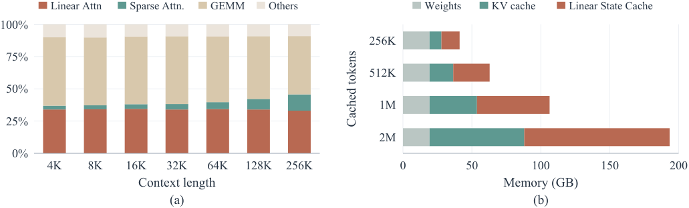
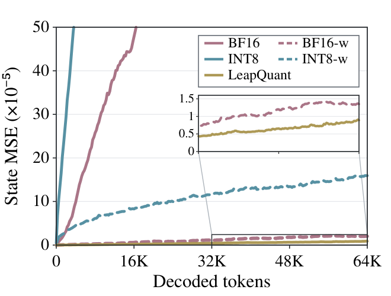
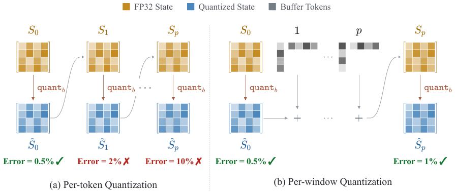
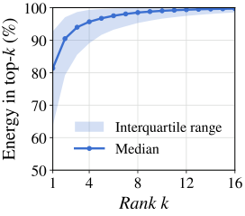
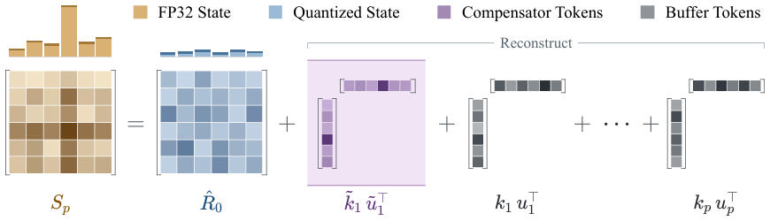
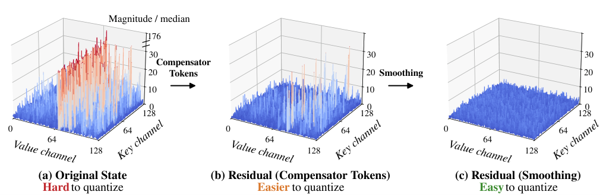
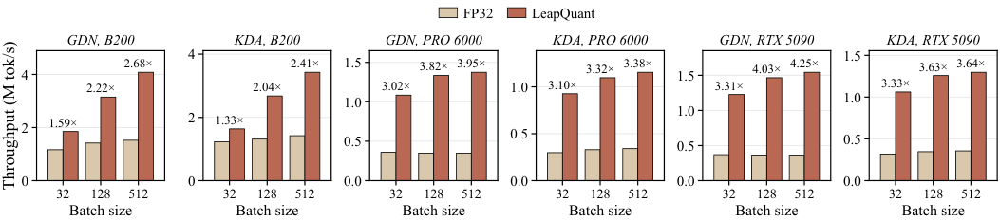
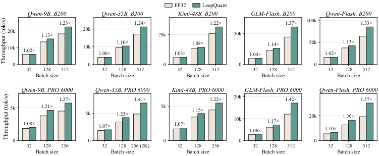
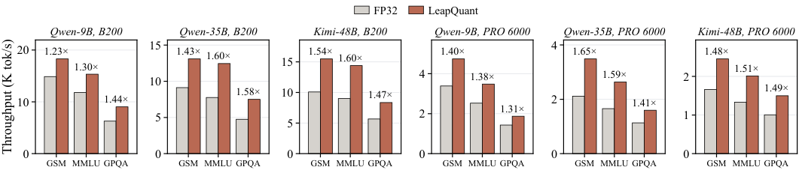

# LeapQuant：给线性注意力的"循环状态"做 8-bit 量化，精度几乎无损

线性注意力（Linear Attention）把整段上下文压缩成一个固定大小的循环状态矩阵，省去了随长度膨胀的 KV Cache，但每生成一个 token 都要把整个状态从显存读出、更新、再写回，推理吞吐被 HBM 带宽卡得死死的。来自 UC Berkeley、UW、MIT、Perplexity AI 和 NVIDIA 的团队提出了 **LeapQuant**：一种免训练、免校准数据的循环状态量化方法。它的核心思路一句话就能说清——不要每个 token 都量化一次状态，而是"跳跃"（leap）过一个 16-token 的窗口再量化，同时用少量高精度的"补偿 token"吸走状态里的 outlier。最硬的结果是：在 Qwen、Kimi、GLM 三个模型家族的 12 组模型-任务对上，8-bit 状态量化下精度与 FP32 基线完全持平（平均 75.5% vs 75.5%），状态显存流量降低 3.4 倍，kernel 级平均加速 2.05–3.70 倍，端到端推理加速 1.47 倍。

## 背景：线性注意力很快，但它的"状态"很贵

传统 softmax Attention 的 KV Cache 随上下文线性增长，而线性注意力（如 Gated DeltaNet、KDA、Mamba2）把全部历史压缩进一个固定大小的状态矩阵 $S_t \in \mathbb{R}^{d_k \times d_v}$。每步解码只做一次轻量的 rank-one 更新：

$$
S_t = \mathrm{Diag}(\alpha_t)\, S_{t-1} + k_t \bigl(v_t - S_{t-1}^{\top} \beta_t\bigr)^{\top}, \qquad o_t = S_t^{\top} q_t
$$

其中 $\mathrm{Diag}(\alpha_t)$ 是对角衰减门控，$k_t$ 是 key 向量，$\beta_t$ 是 delta rule 的读出向量（不带 delta rule 的模型里 $\beta_t = 0$）。最近 Qwen3-Next、Kimi-Linear、GLM 等混合架构把大部分层换成了这类线性注意力层，长上下文推理因此便宜了很多。

但问题也随之而来：这个状态矩阵 **每生成一个 token 都要完整地读一遍、写一遍**。更新本身的计算量相对传输的字节数微乎其微，按照 Roofline 模型，这是典型的带宽瓶颈（memory-bound）操作。层数一多、并发请求一多，状态读写就吃掉了解码时间的大头；开启 prefix caching 后，每个缓存前缀还要单独保存一份状态，显存占用同样可观。

> 图解：(a) 在 B200 上以 batch size 256 运行 GLM-5.3-Flash-NVFP4 的解码时间分解，线性注意力层的耗时占比在不同上下文长度下都相当可观；(b) Qwen3.5-9B 开启 prefix caching 后的显存占用分解，每 1024 个缓存 token 保存一份线性注意力状态，状态部分成为显存大头。这两个图说明：状态的 **带宽流量** 和 **容量占用** 都是实打实的瓶颈。

## 问题：状态量化为什么难得离谱？

要省带宽、省显存，最直接的思路就是把状态量化成低 bit。但作者发现，naive 的做法——每步解码后把整个状态重新量化一次——会让模型质量大幅崩塌，尤其在长思维链（long thinking）场景下。误差来自两个源头：

**误差源一：量化误差会循环累积。** 每一步的更新都从一个"已经被量化过"的状态出发，量化又引入新的舍入误差，误差随着递推被衰减门控和 delta rule 不断携带下去，状态逐渐偏离 FP32 轨迹。附录里给出了清晰的误差传播方程：设 $E_t$ 为量化状态与 FP32 状态的偏差，$\varepsilon_t$ 为第 $t$ 步新引入的量化误差，则

$$
E_t = \mathrm{Diag}(\alpha_t)\, E_{t-1} - k_t \bigl(E_{t-1}^{\top} \beta_t\bigr)^{\top} + \varepsilon_t
$$

关键在于，每步的更新量相对状态本身很小，per-step 量化每步都把更新的一部分舍掉，这些误差是 **相关的**，会相干地叠加——所以误差的积累远比"每 $p$ 步量化一次、误差少 $p$ 倍"这种直觉更严重。

**误差源二：状态里存在集中的 outlier。** 状态矩阵的少数几行、几列集中了大量幅值，这些 outlier 撑大了量化的动态范围（scale），迫使大多数小数值只能用很粗的量化步长表示，每一次量化的单次误差都被放大。

> 图解：在 PG-19 上用 Qwen3.5-9B 解码 64K token，跟踪量化状态相对 FP32 轨迹的 MSE。横轴是解码步数，纵轴是状态误差。per-step 量化（不带 -w 后缀的曲线）下误差随上下文稳定增长，连 BF16 都撑不住；随机舍入（stochastic rounding）只能把 BF16 的误差降 3 倍，还会让 INT8 发散。而每 16 个 token 才量化一次的 per-window 方案（-w 曲线）把 64K 处的误差分别降低了 100 倍（BF16）和 39 倍（INT8）；LeapQuant 完整方案误差始终最低——用一半的 bit 数，误差还低于 per-window BF16。

一个让人印象深刻的数字：Qwen3.5-9B 的 AIME 推理轨迹动辄几万 token，per-step FP8 量化下 AIME 得分从 87.9% 崩到 14.6%——这就是误差累积在长生成场景下的真实代价。

## 方法：LeapQuant 的三板斧

LeapQuant 的设计完全对准上面两个误差源： **少量化**（降低误差引入频率）、 **每次量化得更准**（降低单次误差）。整个方法免训练、免校准数据，是纯粹的推理时（inference-time）改造。

### 第一板斧：Per-window 量化——"跳"过窗口再量化

核心想法借鉴了线性注意力在训练/prefill 阶段的 chunkwise 形式。把每步更新写成衰减加 rank-one 修正的形式：

$$
u_i = v_i - S_{i-1}^{\top} \beta_i, \qquad S_i = \mathrm{Diag}(\alpha_i)\, S_{i-1} + k_i u_i^{\top}
$$

对一个长度为 $p$ 的 token 窗口，LeapQuant 做三件事：

1. 窗口起点处保存量化后的边界状态 $\hat{S}_0$， **固定不动**；
2. 窗口内的 $p$ 个更新 $(\alpha_i, k_i, u_i)$ 以高精度缓存在 buffer 里；
3. 窗口内每一步的输出，由固定状态和缓冲更新即时组合算出， **不重新量化完整状态**；只有到窗口末尾才重建出 $S_p$ 并量化一次，供下一个窗口使用。

记累积衰减 $\Gamma_{a:b} = \mathrm{Diag}(\alpha_b) \mathrm{Diag}(\alpha_{b-1}) \cdots \mathrm{Diag}(\alpha_a)$（$a > b$ 时为单位阵），把递推从 $\hat{S}_0$ 展开，窗口内任意一步 $\ell$ 的状态为：

$$
S_\ell = \Gamma_{1:\ell}\, \hat{S}_0 + \sum_{j=1}^{\ell} \Gamma_{j+1:\ell}\, k_j u_j^{\top}, \qquad \hat{S}_p = \mathrm{quant}_b(S_p)
$$

这样量化频率直接降为原来的 $1/p$。实际取 $p = 16$，64K 上下文的误差如前图所示降低两个数量级。

> 图解：per-token 量化（上）与 per-window 量化（下）的对比。per-token 每次更新后都把整个状态重新量化；per-window 则固定量化边界状态 $\hat{S}_0$，把窗口内 $p$ 个更新以高精度缓冲，窗口内从"固定状态 + 缓冲更新"重建中间状态，整个窗口只在末尾量化一次得到 $\hat{S}_p$。

这里有个工程上很妙的点：窗口内读取状态 $S_i^{\top} x$ 时并不需要真的物化 $d_k \times d_v$ 的中间矩阵。附录推导给出读出形式：

$$
S_i^{\top} x = \hat{S}_0^{\top} \Gamma_{1:i}\, x + \sum_{j=1}^{i} u_j \bigl(k_j^{\top} \Gamma_{j+1:i}\, x\bigr)
$$

第一项是 $O(d_k d_v)$，每条缓冲记录只花 $O(d_k + d_v)$（一次内积加一个缩放向量），对角累积衰减 $\Gamma$ 可以增量维护。也就是说，per-window 方案的开销主要是 buffer 读写，而不是状态重建。

顺带一提，这种"保存边界状态 + 重放近期更新"的结构与 ReplaySSM（为投机解码做状态回滚）在系统层面神似，但 LeapQuant 用它来提升量化精度——视角完全不同。

### 第二板斧：Compensator Tokens——用"虚拟 token"吸走 outlier

per-window 解决了量化频率问题，但单次量化的误差还没解决。作者观察到重建出的状态 $S_p$ 里，大幅值 outlier 集中在少数行列，且状态能量高度集中在少数几个奇异分量上。这些 outlier 撑大量化 scale，让小数值被迫用粗步长表示。

> 图解：Qwen3.5-9B 状态矩阵的奇异值能量分布。能量高度集中在前几个奇异值上——这正是"低秩结构主导状态"的证据，也说明只用极少数 rank-one 项就能抓住状态的主要能量。

LeapQuant 的对策非常优雅：在量化之前，先用幂迭代（power iteration）拟合一个 rank-one 矩阵 $\tilde{k}\tilde{u}^{\top}$ 去逼近 $S_p$ 的主导大幅值结构，把它从状态里减掉，只量化残差：

$$
(\tilde{k}, \tilde{u}) = \operatorname*{arg\,min}_{k, u} \bigl\lVert S_p - k u^{\top} \bigr\rVert_F, \qquad R_p = S_p - \tilde{k}\tilde{u}^{\top}, \qquad \tilde{S}_p = \mathrm{dequant}_b\bigl(\mathrm{quant}_b(R_p)\bigr) + \tilde{k}\tilde{u}^{\top}
$$

为什么叫 Compensator **Token**？因为 $(\tilde{k}, \tilde{u})$ 配上恒等衰减，形式上和真实 token 的 rank-one 更新一模一样（只是它不是模型产生的、也不产生输出）。这个设计的聪明之处在于：decode kernel 本来就是按 rank-one 更新逐条处理的，把补偿 token 排在下一窗口真实 token 更新之前喂进去， **不需要任何模型专属的 kernel 改动**，更新路径完全复用。

推广到 $r$ 个补偿 token：令 $\tilde{K} = [\tilde{k}_1, \ldots, \tilde{k}_r]$、$\tilde{U} = [\tilde{u}_1, \ldots, \tilde{u}_r]$，则残差 $R_p = S_p - \tilde{K}\tilde{U}^{\top}$，重建状态 $\tilde{S}_p = \mathrm{dequant}_b(\hat{R}_p) + \tilde{K}\tilde{U}^{\top}$。每个窗口边界丢弃旧的补偿 token、对重建出的 $S_p$ 重新拟合——由于 $r$ 很小（实际取 4），拟合和重建的计算完全被状态显存读取掩盖，$r \le 8$ 时暴露出来的 kernel 开销在所有设置下不超过 7%。

> 图解：带 Compensator Tokens 的 per-window 状态重建。FP32 状态被拆成三部分：低 bit 量化的残差、少数几个高精度 Compensator Tokens（捕捉主导的大幅值结构）、以及窗口内缓冲的真实 token 更新。补偿 token 吸走主导 outlier 后，残差各行的 $\ell_2$ 范数变得平坦，量化压力大幅下降。

### 第三板斧：Residual Smoothing——量化前先把残差"熨平"

补偿 token 拿走了主导低秩结构，但残差在不同 key 行之间的幅值仍然不均匀：少数大 key/value 通道依然会主导量化 scale。于是 LeapQuant 在量化前再做一步平滑：定义平滑向量 $c \in \mathbb{R}_{>0}^{d_k}$，每个元素是对应 key 行平均绝对值的平方根（带一个很小的正数下界防止除零），令 $C = \mathrm{Diag}(c)$，先左乘 $C^{-1}$ 平衡行幅值再量化：

$$
\hat{R}_0^C = \mathrm{quant}_b\bigl(C^{-1} R_0\bigr), \qquad S_p = \Gamma_{1:p} \Bigl[C\, \mathrm{dequant}_b\bigl(\hat{R}_0^C\bigr) + \tilde{K}\tilde{U}^{\top}\Bigr] + \sum_{j=1}^{p} \Gamma_{j+1:p}\, k_j u_j^{\top}
$$

这个变换本身可逆（反量化后乘回 $C$ 即恢复原坐标），唯一的近似来自中间的量化。平滑 scale 在窗口内固定，每个窗口边界根据新残差重新计算，且以 FP32 保存。这个思路和 SmoothQuant"把 outlier 迁移走"的精神一脉相承，但作用对象是循环状态的残差，且完全免校准。

三步走的效果可以从状态分布上直观看到：

> 图解：Qwen3.5-9B 第 13 层第 16 个头在 8K 上下文处的状态幅值分布（以中位数归一化）。(a) 原始状态中 outlier 高达中位数的 176 倍；(b) 经过 Compensator Tokens 后降到 47 倍；(c) 再经过 smoothing 后只剩 5.3 倍。动态范围被逐级压缩，低 bit 量化的压力随之骤降。

## 实验：精度持平 FP32，速度和显存双赢

**实验设置。** 评测覆盖三个模型家族的五个混合线性注意力 LLM：Qwen3.5-9B、Qwen3.5-35B-A3B、Qwen3.8-Flash（GDN 架构），以及 Kimi-Linear-48B-A3B-Instruct、GLM-5.3-Flash（KDA 架构）。任务包括 AIME 2026、GPQA-Diamond、MMLU-Pro、LiveCodeBench v6 和 GSM8K，下游精度取三个随机种子的平均。LeapQuant 实现在 vLLM 中，decode kernel 用 TileLang 编写；默认配置为窗口 $p = 16$、$r = 4$ 个 FP16 Compensator Tokens（4-bit 时 $r = 8$）、FP32 平滑 scale。硬件覆盖 NVIDIA B200、RTX PRO 6000 和 RTX 5090。基线包括 FP32/BF16 状态、vLLM/SGLang 的默认与可选格式、per-step 重量化的各 bit 格式（FP8、INT8、NVFP6、MXFP6、INT6、NVFP4、MXFP4、INT4），以及三个从 KV Cache/激活量化改造过来的方法：KVQuant、QuaRot、TurboQuant。

**下游精度。** 主表结果如下（%，越高越好，加粗为该 bit 组内最优）：

| 方法 | Qwen3.5-9B (AIME/GPQA/LCB/MMLU) | Qwen3.5-35B-A3B (AIME/GPQA/LCB/MMLU) | Kimi-Linear (AIME/GPQA/LCB/MMLU) | 平均 |
| --- | --- | --- | --- | --- |
| FP32 | 87.9 / 81.3 / 64.1 / 83.3 | 91.5 / 84.7 / 75.6 / 85.9 | 67.5 / 70.3 / 41.4 / 72.4 | 75.5 |
| BF16 (per-step) | 72.1 / 66.2 / 49.6 / 81.0 | 85.8 / 79.3 / 67.2 / 85.2 | 64.3 / 68.1 / 41.0 / 64.0 | 68.7 |
| **Ours (8-bit)** | **87.9 / 81.8 / 64.1 / 83.8** | **91.0 / 83.9 / 76.1 / 85.8** | **68.3 / 69.8** / 41.3 / 72.1 | **75.5** |
| FP8 (per-step) | 14.6 / 34.3 / 21.4 / 42.6 | 29.6 / 39.9 / 26.7 / 56.4 | 25.6 / 46.6 / 16.0 / 57.0 | 34.2 |
| INT8 (per-step) | 7.1 / 26.8 / 9.2 / 44.3 | 0.0 / 0.0 / 3.1 / 6.8 | 52.8 / 65.8 / 35.5 / 64.5 | 26.3 |
| KVQuant (8-bit) | 74.6 / 70.2 / 59.5 / 82.4 | 76.3 / 69.7 / 44.3 / 83.5 | 66.6 / 69.7 / **42.1** / 65.0 | 67.0 |
| QuaRot (8-bit) | 49.6 / 57.1 / 38.2 / 73.1 | 32.9 / 36.4 / 15.3 / 56.0 | 63.3 / 69.2 / 36.6 / **73.1** | 50.1 |
| TurboQuant (8-bit) | 70.8 / 61.1 / 45.0 / 80.5 | 10.4 / 22.7 / 15.3 / 52.7 | 57.5 / 69.2 / 41.2 / 69.0 | 49.6 |
| **Ours (6-bit)** | **85.8 / 79.8 / 59.5 / 81.7** | **88.8 / 83.8 / 68.7 / 79.5** | **66.1 / 66.2 / 35.9 / 73.4** | **72.4** |
| TurboQuant (6-bit) | 27.5 / 29.8 / 16.0 / 61.2 | 0.4 / 5.1 / 4.6 / 16.1 | 48.8 / 64.7 / 35.9 / 72.7 | 31.9 |
| NVFP6 (per-step) | 0.4 / 18.7 / 12.2 / 28.3 | 13.8 / 34.3 / 25.2 / 46.3 | 30.8 / 52.0 / 25.2 / 67.4 | 29.6 |
| **Ours (4-bit)** | **58.1 / 65.7 / 34.0 / 80.2** | **59.2 / 57.6 / 37.4 / 81.4** | **67.9 / 69.2 / 40.5 / 73.4** | **60.4** |
| TurboQuant (4-bit) | 3.3 / 26.8 / 13.0 / 47.4 | 0.0 / 0.0 / 0.0 / 0.3 | 24.2 / 63.1 / 26.7 / 69.5 | 22.9 |
| MXFP4 (per-step) | 0.0 / 5.1 / 0.0 / 7.4 | 0.0 / 4.5 / 0.8 / 5.5 | 4.2 / 26.9 / 8.7 / 53.1 | 9.7 |

几个值得强调的观察：

- **8-bit 下 LeapQuant 与 FP32 完全打平**（平均 75.5% vs 75.5%），而 per-step 量化连 16-bit 都守不住——BF16 直接把 Qwen3.5-9B 的 AIME 从 87.9% 打到 72.1%，LeapQuant 用一半的 bit 保住了 87.9%。
- bit 数越低，per-window 与 per-step 的差距越大：6-bit 时最强基线平均只有 29.6–31.9%，LeapQuant 还有 72.4%；4-bit 时基线几乎全军覆没（9.7–22.9%），LeapQuant 仍保持 60.4%，且在 Kimi-Linear-48B-A3B 的每个任务上都与 FP32 相差不超过 1.1%。
- 从 KV Cache 量化改造来的方法普遍水土不服——循环状态的误差累积机制与静态 KV Cache 完全不同。

**Kernel 加速。** 单层线性注意力（32 头，$d_k = d_v = 128$）对比 FLA 的 FP32 kernel：batch size 512 下，GDN 在 B200 / RTX PRO 6000 / RTX 5090 上分别加速 2.68 / 3.95 / 4.25 倍，KDA 加速 2.41 / 3.38 / 3.64 倍。消费级和 workstation 卡上收益更大，与"状态流量在这些 GPU 上是更强瓶颈"的判断一致。

> 图解：单个线性注意力层的 kernel 吞吐对比，横轴为 batch size，纵轴为吞吐。LeapQuant（INT8 状态）相对 FP32 kernel 在三款 GPU 上都取得显著加速，且加速比随 batch size 增大而扩大。

**解码与端到端加速。** 上下文 4K、batch size 512 时，B200 上五个模型的纯解码吞吐提升 1.22–1.37 倍；RTX PRO 6000 上最大可容纳 batch 下提升 1.22–1.57 倍。端到端离线推理（GSM8K、MMLU-Pro、GPQA）输出吞吐在 B200 上提升 1.23–1.60 倍，RTX PRO 6000 上提升 1.31–1.65 倍。

> 图解：vLLM 中上下文 4K 的解码步吞吐。RTX PRO 6000 上最大 batch 为 256（512 放不下），Qwen3.5-35B-A3B 在该 batch 下用 2K 上下文。加速比随 batch size 增大而提升，因为线性注意力在每步耗时中的占比随之上升。

> 图解：不同数据集上的端到端推理吞吐。更高的并发请求数（显存省了）加上更快的解码步（带宽省了），两个收益叠加出 1.23–1.65 倍的端到端提升。

**显存收益。** LeapQuant 每个状态元素的存储开销是 1.19 字节（INT8 残差 + 平滑 scale + 补偿 token），相对 FP32 的 4 字节降低 3.4 倍；窗口 buffer 每头每层仅需约 8 KiB，每个活跃请求只分配一次，开销可忽略。在 vLLM/SGLang 默认的 prefix caching 模式（每 1K 缓存 token 存一个 checkpoint）下，端到端显存分别降低 41%（Qwen3.5-9B）、51%（Qwen3.5-35B-A3B）、56%（Kimi-Linear-48B-A3B），单张 B200 服务 Qwen3.5-9B 时并发请求数最多提升 1.4 倍。

## 消融：每一板斧都在起作用

在 Qwen3.5-9B 上用最敏感的 AIME 2026 和 LiveCodeBench v6 做消融（kernel 加速相对 FP32、batch 256）：

| 方法 | AIME | LCB | Kernel 加速 |
| --- | --- | --- | --- |
| FP32 per-step | 87.9 | 64.1 | 1.00× |
| BF16 per-step | 72.1 | 49.6 | 1.64× |
| + Per-window | 87.8 | 62.9 | 1.71× |
| INT8 per-step | 7.1 | 9.2 | 2.43× |
| + Per-window | 82.4 | 60.6 | 2.64× |
| + Comp. Tokens | 86.6 | 61.5 | 2.56× |
| + Smoothing | 87.9 | 64.1 | 2.52× |

可以看到一条清晰的递进链：per-step INT8 直接把 AIME 打到 7.1%；per-window 一举拉回 82.4%；补偿 token 补到 86.6%；smoothing 补齐最后一口气到 87.9%，与 FP32 完全持平，同时保留 2.52 倍 kernel 加速。每个组件既涨精度、又不显著牺牲效率。

**窗口长度 $p$ 与补偿 token 数 $r$ 的选择也有讲究：**

- $p$：精度在 $p = 16$ 处饱和（$p = 32$ 不再涨），kernel 也在 $p = 16$ 最快——窗口太短重建太频繁，太长则每步 buffer 读取变大、挤占流水用的共享内存，$p = 32$ 时加速比从 2.52× 回落到 2.20×。
- $r$：精度在 $r = 4$ 饱和，与"能量集中在少数奇异值"的观察吻合。$r \le 4$ 时幂迭代和重建被显存读取完全掩盖，$r$ 再大计算就暴露出来，$r = 16$ 时甚至比 FP32 还慢（0.74×）。最终取 $r = 4$，以接近 $r = 2$ 的速度拿到 $r = 8$ 的精度。

**更长上下文的表现（附录）。** B200 上 1K–8K 上下文的解码测试显示，搭配 full attention 的模型随上下文增长收益略降（full attention 占比上升），但 8K 时 Kimi-Linear 仍有 1.18 倍加速；而搭配稀疏注意力的 GLM-5.3-Flash 和 Qwen3.8-Flash 在 128K / 96K 长上下文下仍保持 1.20 倍以上的加速——对越来越主流的"线性 + 稀疏注意力"混合架构来说，这是个好消息。

## 附录拾遗：方法的通用性

附录里有一张很有价值的对照表：正文的统一更新形式 $S_t = \mathrm{Diag}(\alpha_t) S_{t-1} + \tilde{k}_t (v_t - S_{t-1}^{\top} b_t)^{\top}$ 可以覆盖几乎所有主流线性注意力模型——Linear Attention、RetNet、Mamba2、GLA、RWKV6、HGRN2、DeltaNet、Gated DeltaNet、KDA、DeltaProduct 都是它的特例，区别只在衰减是单位阵/标量/向量、以及是否带 delta rule（$b_t = 0$ 与否）。像 RWKV7 这种 erase 方向与 write key 不一致的模型，也可以拆成两个子步各贡献一条 rank-one 记录来适配。这意味着 LeapQuant 不是某个架构的特调，而是一套对"对角衰减 + rank-one 更新"这一大类 recurrence 通用的量化框架。每个缓冲更新的记录大小仅 $d_k + d_v$ 到 $2d_k + d_v$ 量级，这也是窗口 buffer 如此便宜的原因。

## 总结

- **问题**：线性注意力的循环状态每步都要全量读写，带宽和显存开销大；但 naive 的 per-step 量化会因误差循环累积和 outlier 放大单次误差而严重掉点。
- **Per-window 量化**：16 个 token 才量化一次状态，窗口内用"固定低 bit 边界状态 + 高精度缓冲更新"计算输出，64K 上下文误差降低约两个数量级。
- **Compensator Tokens**：用幂迭代拟合的高精度 rank-one 项吸走状态主导 outlier，形式上与真实 token 更新一致，kernel 零改动直接复用更新路径。
- **Residual Smoothing**：按 key 行均值的平方根对残差做可逆缩放，把动态范围从 176× 中位数一路压到 5.3×。
- **结果**：8-bit 状态量化下 12 组模型-任务对精度与 FP32 持平，4-bit 下仍远超所有基线；kernel 加速最高 4.25 倍，端到端推理加速 1.47 倍，prefix caching 下显存最多省 56%。

一句话展望：作者认为随着混合模型把更多层交给线性注意力，低精度循环状态有望成为服务部署的默认选项；目前的局限是方法聚焦于"对角衰减 + rank-one"这一更新族，对更复杂状态转移（如多步 erase/write 分离程度更高的架构）的适配成本，以及量化状态与投机解码、prefix caching 等系统机制的深度协同，还有继续挖掘的空间。

> 本文参考自 [LeapQuant: Efficient Linear Attention with Accurate Recurrent State Quantization](http://arxiv.org/abs/2609.38166v1)