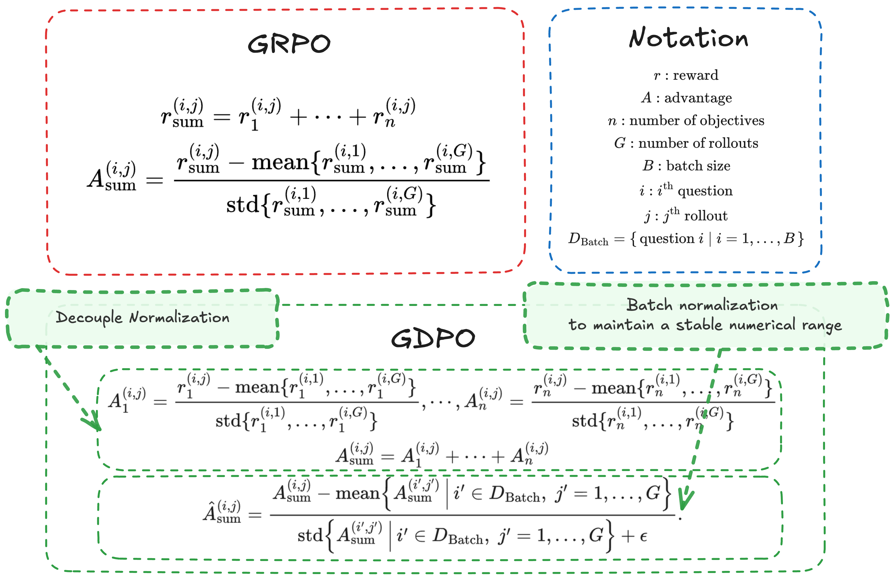
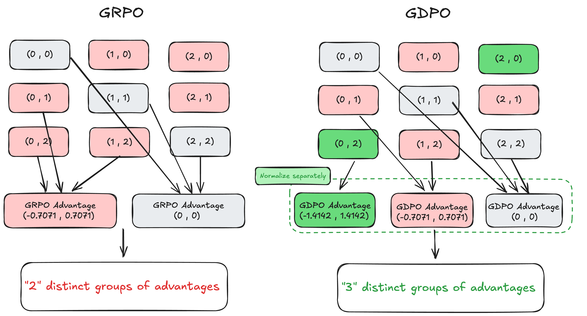
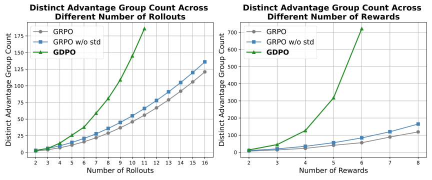

# GDPO：多奖励 RL 中更稳定、更精细的优势归一化方案

这篇论文要解决的是一个越来越常见的现实问题：当我们希望 LLM 同时满足 **准确性、格式规范、长度约束、Bug-free** 等多个偏好时，强化学习要如何稳定、精确地优化这些多维奖励？  
作者指出：大家默认把 GRPO 直接套在多奖励设置上，但这会让 **不同的奖励组合在优势函数里被“压扁成同一个信号”** ，导致训练信号分辨率下降，甚至训练崩溃。GDPO 就是为了解决这个问题。

---

## 1. 背景：为什么多奖励 RL 让 GRPO 失灵？

目前的主流做法是把多个奖励加总，然后再走 GRPO 的 group-wise normalization：

$$
r^{(i,j)}_{\text{sum}} = r_1^{(i,j)} + \cdots + r_n^{(i,j)}
$$

$$
A^{(i,j)}_{\text{sum}} =
\frac{
r_{\text{sum}}^{(i,j)} - \mathrm{mean}\{ r_{\text{sum}}^{(i,1)}, \ldots, r_{\text{sum}}^{(i,G)}\}
}{
\mathrm{std}\{ r_{\text{sum}}^{(i,1)}, \ldots, r_{\text{sum}}^{(i,G)} \}
}
$$

这在单奖励时很好用，但 **多奖励下会出现“优势塌缩”** ：  
不同 reward 组合（比如 $(0,1)$ 与 $(0,2)$）会被映射到相同的 advantage。  
结果就是模型看不出“更好”与“稍好”的差异，训练信号变粗糙，最终影响收敛。

---

## 2. GDPO：核心思想是“先分开归一化，再汇总”

GDPO 的关键就是 **把每个奖励单独做 group-wise normalization** ，再加总：

$$
A^{(i,j)}_k =
\frac{r_k^{(i,j)} - \mathrm{mean}\{r_k^{(i,1)},\ldots,r_k^{(i,G)}\}}
{\mathrm{std}\{r_k^{(i,1)},\ldots,r_k^{(i,G)}\}}
\quad \text{for } k=1..n
$$

$$
A_{\text{sum}}^{(i,j)} = \sum_{k=1}^n A^{(i,j)}_k
$$

然后再做一个 batch-wise 归一化，保证不同奖励数量下数值尺度稳定：

$$
\hat{A}^{(i,j)}_{\text{sum}} =
\frac{
A^{(i,j)}_{\text{sum}} - \mathrm{mean}\{A_{\text{sum}}\}
}{
\mathrm{std}\{A_{\text{sum}}\} + \epsilon
}
$$

这样做的效果是： **不同 reward 组合会保留不同的优势信号** ，训练信号更细腻、稳定性更强。

---

## 3. 直观图解：GDPO vs GRPO

  
> 图解：GDPO 的流程是“每个 reward 各自 group-normalize，再求和，再 batch-normalize”。这样优势尺度不会随着 reward 数增加而失控。

  
> 图解：两奖励、两 rollout 的 toy case 中，GRPO 把多个奖励组合压缩成 2 组优势，而 GDPO 保留 3 组，更细粒度。

  
> 图解：奖励数量或 rollout 数增长时，GDPO 的 distinct advantage groups 明显更多，信号更细腻。

---

## 4. 实验一：Tool Calling（格式 + 正确性）

  
> 图解：GDPO 在 tool-calling 任务中，格式 reward 和正确性 reward 都稳定提升，GRPO w/o std 则格式完全崩溃。

结论很明确：  
- GDPO 在 **格式 + 正确性** 上都更强  
- 去掉 std 的 GRPO 虽然提升了 advantage 细粒度，但训练稳定性差，格式奖励直接失败

---

## 5. 实验二：数学推理（正确性 + 长度约束）

  
> 图解：GRPO 先快速拉满长度 reward，但后期正确性下降；GDPO 先短期损失正确性，随后恢复并持续提升。

结论：GDPO 可以 **同时保证长度约束 + 准确率增长** ，而 GRPO 在训练后期会崩。

此外在更大模型上依旧稳定：

  
> 图解：7B 模型上 GDPO 仍能维持正确性提升，并更好控制长度。

  
> 图解：4B 模型趋势一致，GDPO 稳定性更强。

---

## 6. 实验三：编码任务（三奖励）

在 coding reasoning 任务里奖励包括：

- **Pass rate**  
- **Length constraint（条件化）**  
- **Bug-free reward**

GDPO 在两奖励和三奖励设置下都表现更好：  
- Pass rate 更高  
- Length exceed 更低  
- Bug ratio 更小  

说明 **GDPO 在多奖励数量增加时依旧可扩展** 。

---

## 7. 优先级偏好：权重不够，条件化更有效

论文还讨论了一个很现实的问题：  
当某个奖励更“容易”时（比如长度），模型会优先讨好它，即使你把它权重调低。

### 发现：
- 简单调权重，效果不稳定  
- 更有效的做法是 **条件化奖励** （只有 correctness 通过时才给长度 reward）

条件化形式：

$$
\tilde{R}_{\text{length}} =
\begin{cases}
1, & \text{if length} \le l \ \text{and}\ R_{\text{correct}}=1 \\
0, & \text{otherwise}
\end{cases}
$$

结论：  
- 条件化奖励能避免模型被“简单奖励”带偏  
- 在这种设计下，GDPO 的效果更明显、更稳定

---

## 8. 关键结论（博主视角总结）

- **GRPO 在多奖励下存在固有缺陷：信号塌缩 + 训练不稳定**  
- **GDPO 的改动非常简单，但收益巨大**  
  - 优势信号更细粒度  
  - 多奖励扩展更稳定  
  - 多任务表现更一致  
- **权重调优并不是万能钥匙** ，当奖励难度差异大时， **条件化奖励更靠谱**  
- GDPO 已经在 tool-calling、math reasoning、coding reasoning 三个任务上验证

---

## 9. 适用场景建议

如果你在做以下任务，GDPO 基本是 **“默认更稳的选择”** ：

- 多奖励 RLHF / RLAIF  
- 有格式/长度/安全等多维目标  
- 想让奖励之间“各管各的”，而不是互相抵消

---

## 10. 结语

总体来看，这篇 GDPO 的贡献不在于复杂技巧，而是 **把“多奖励归一化”这个默认细节补上了正确答案** 。  
对于多目标 RL 来说，这个修正的意义非常实际：更稳、更准、更可控。

本文参考自 [GDPO: Group reward-Decoupled Normalization Policy Optimization for Multi-reward RL Optimization](https://arxiv.org/abs/2601.05242)

---

如果你想进一步了解实现细节或复现实验，我也可以帮你继续整理 GDPO 在 HF-TRL / verl / NeMo-RL 的实现差异。