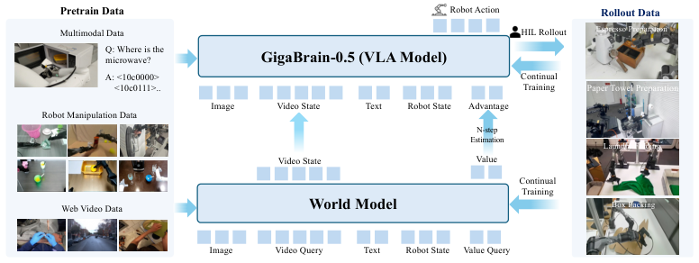
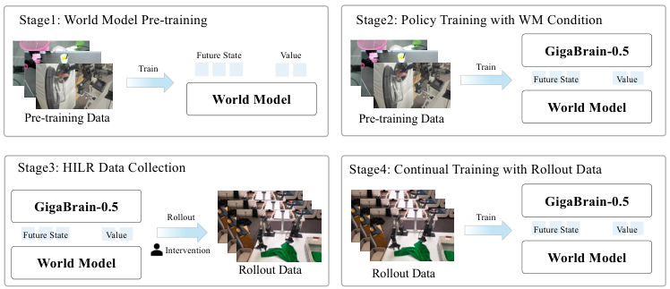
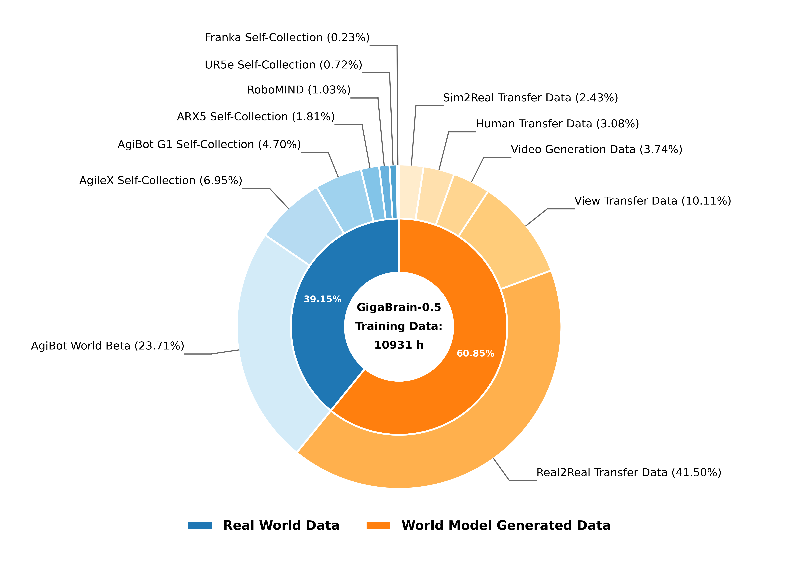
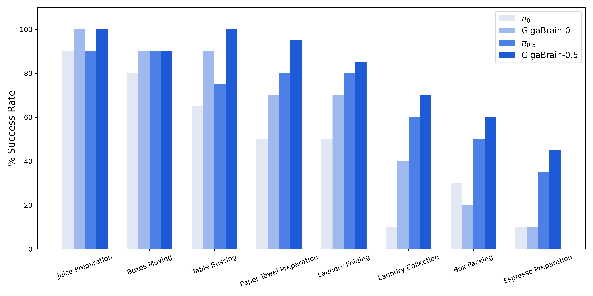
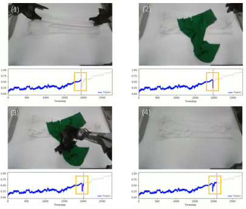
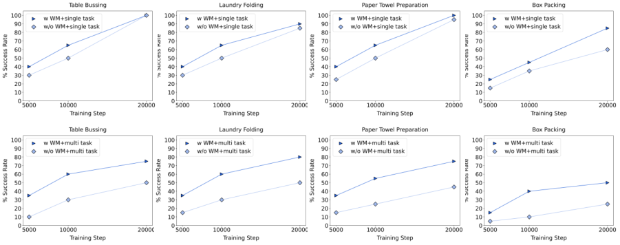
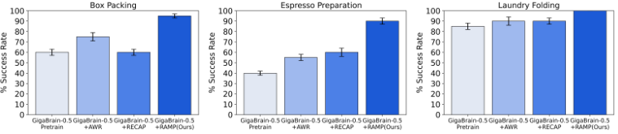

# GigaBrain-0.5M*: 用世界模型驱动的 VLA 强化学习，让机器人具备长时序规划

## 一句话抓重点
这篇工作把 **世界模型的未来预测能力** 引入 VLA（Vision-Language-Action）策略学习，提出 **RAMP** 训练范式，让机器人在长时序、多步骤任务中更稳、更会“看未来”。

## 背景与问题：VLA 为什么“看得见但想不远”
现有 VLA 通常根据 **当前观测** 直接预测动作序列，短期反应不错，但在 **长时序任务** 上容易“走一步看一步”，缺乏前瞻性。而大规模视频世界模型在 **时空推理** 和 **未来预测** 上很强，因此作者把世界模型作为“预测引擎”，为策略提供未来状态与价值信号。

## 方法总览：GigaBrain-0.5M* 与 RAMP
核心思想是：让策略 **条件化于世界模型的未来状态与价值**，形成更有前瞻性的动作生成。

> 图解：这张总览图展示了 GigaBrain-0.5M* 的整体定位——以世界模型为条件的 VLA，并通过人机协同 rollout 持续自我提升，形成闭环训练。

## 关键模型：GigaBrain-0.5 的基础能力
GigaBrain-0.5 继承 GigaBrain-0 的端到端 VLA 结构，核心是：
- 视觉语言编码器：PaliGemma-2
- 动作生成器：DiT + flow matching
- Embodied CoT：把子目标语言、离散动作 token、2D 轨迹一起纳入推理链

核心训练目标可以概括为三部分：
1. CoT 语言/离散动作的自回归预测
2. 动作 chunk 的 diffusion 目标
3. 2D 轨迹的回归约束

一个精简表达是：

$$
\mathcal{L} =
\mathbb{E}\Big[
-\sum_{j=1}^{n-1} M_{\text{CoT},j} \log p_{\theta}(x_{j+1}\mid x_{1:j})
+ \|\epsilon - a_{\text{chunk}} - f_{\theta}(a^{\tau,\epsilon}_{\text{chunk}})\|^2
+ \lambda \|\text{GRU}(\hat{\mathbf{t}}_{1:10}) - \mathbf{t}_{1:10}\|^2
\Big]
$$

## RAMP：世界模型条件化的强化学习
RAMP 的核心是把策略从“只看观测”变成“看观测 + 看未来状态 + 看价值”。

### 1. 训练目标：优势条件化 + 未来状态
在 KL 正则化 RL 框架下，最优策略形式为：

$$
\hat{\pi}(a|\mathbf{S}) \propto \pi_{\text{ref}}(a|\mathbf{S}) \exp\left( \frac{A^{\pi_{\text{ref}}}(\mathbf{S}, a)}{\beta} \right)
$$

为了避免直接估计指数优势，作者引入二值改进信号 $I$，最终得到监督式的 SFT 目标：

$$
\mathcal{L}(\theta)=
\mathbb{E}\left[
-\log \pi_\theta(a|\mathbf{o},\mathbf{z},l)
-\alpha \log \pi_\theta(a|I,\mathbf{o},\mathbf{z},l)
\right]
$$

这里 $\mathbf{z}$ 是世界模型预测的未来状态 latent。

### 2. RECAP 是 RAMP 的特例
作者给出公式：

$$
\pi_{\text{RECAP}}(a|\mathbf{o},I)=\int \pi_{\text{RAMP}}(a|\mathbf{o},\mathbf{z},I)\, p(\mathbf{z}|\mathbf{o},I)\, d\mathbf{z}
$$

直觉上：RECAP 相当于把所有未来状态“平均掉”，而 RAMP 明确指定了未来状态 $\mathbf{z}$，因此信息增益更高、策略更明确。

## RAMP 四阶段训练流程

> 图解：四阶段闭环训练流程：先训练世界模型，再用世界模型条件化策略，接着人机协同 rollout 收集数据，最后持续再训练形成自进化闭环。

1. **世界模型预训练**
  - 预测未来视觉状态 + 价值
  - 价值被嵌入到 latent 作为“额外通道”
  - 统一 latent 形式：

$$
\mathbf{s}_t = [\mathbf{z}_t;\Psi(v_t);\Psi(\mathbf{p}_t)]
$$

2. **策略条件化训练**
  - 策略接收未来 state token 与价值估计
  - 使用 $n$ 步 TD 估计优势：

$$
A(\mathbf{s}_t,a_t)=\sum_{k=0}^{n-1}\gamma^k r_{t+k}+\gamma^n v_{t+n}-v_t
$$

  - 将优势离散为 $I=\mathds{1}(A>\epsilon)$，进入条件化训练目标

3. **Human-in-the-Loop Rollout**
  - 自主执行 + 人工纠偏
  - 自动剔除人工插入导致的时序断裂

4. **持续训练**
  - 策略与世界模型共同更新
  - 避免优势塌缩
  - 维持训练/推理一致性（随机 mask 掉 world model token）

## 实验结果：三条主线结论

### 1. 预训练数据规模与分布

> 图解：预训练数据分布图说明了模型的规模化来源：真实机器人数据约 4K 小时，世界模型生成数据约 6K 小时，总计超过 10K 小时。

### 2. GigaBrain-0.5 内部任务表现

> 图解：内部 8 个任务的成功率对比图。GigaBrain-0.5 在所有任务上优于 GigaBrain-0 和 $\pi_{0.5}$，尤其在长时序任务上提升明显。

### 3. 价值预测对比

> 图解：价值预测可视化。橙框表示任务中出现异常遮挡时价值下降，说明世界模型能感知动态变化并反映在价值曲线上。

表格结论是：
- 仅预测 value 的世界模型速度最快，但精度差
- 联合预测 **未来状态 + value** 达到最高 Kendall 与最低 MAE

### 4. 多任务泛化提升

> 图解：单任务与多任务对比。世界模型条件化在多任务学习场景中优势更明显，成功率差距随训练步数扩大，最高可提升约 30%。

### 5. RL 基线对比

> 图解：RAMP 在 Laundry Folding、Box Packing、Espresso Preparation 上全线领先 RECAP 与 AWR，优势明显。

## 结论与展望
- GigaBrain-0.5M* 通过 **世界模型 + RL** 显著提升 VLA 的 **长时序执行可靠性**
- RAMP 训练范式提供了更高信息密度的条件输入，优于 RECAP 的稀疏优势信号
- 2026 年 2 月 9 日，GigaBrain-0.1 在 RoboChallenge 公开榜单上达到 51.67% 平均成功率，位列第一

> 本文参考自 [GigaBrain-0.5M*: a VLA That Learns From World Model-Based Reinforcement Learning](https://arxiv.org/abs/2602.12099)