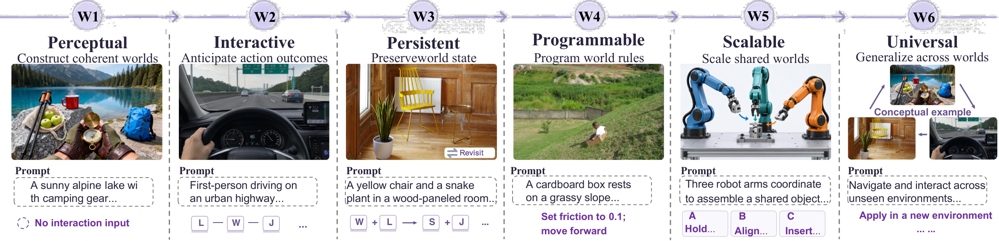
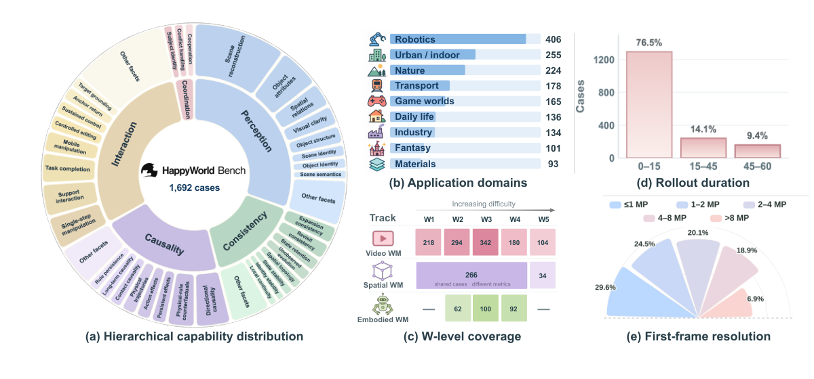
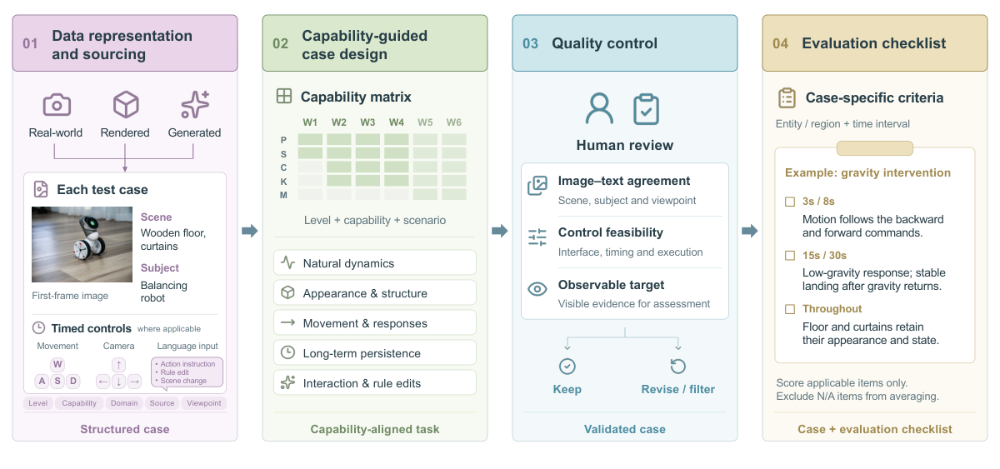
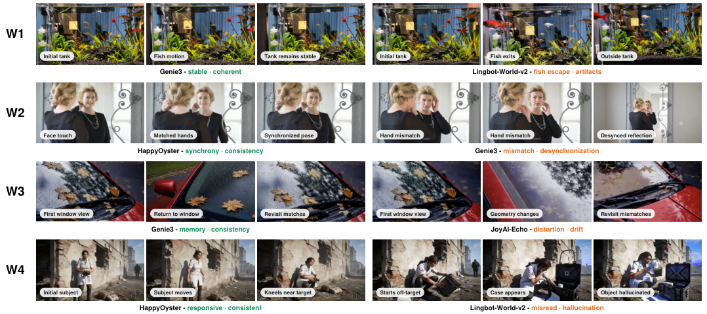
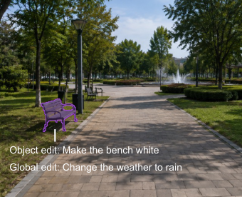
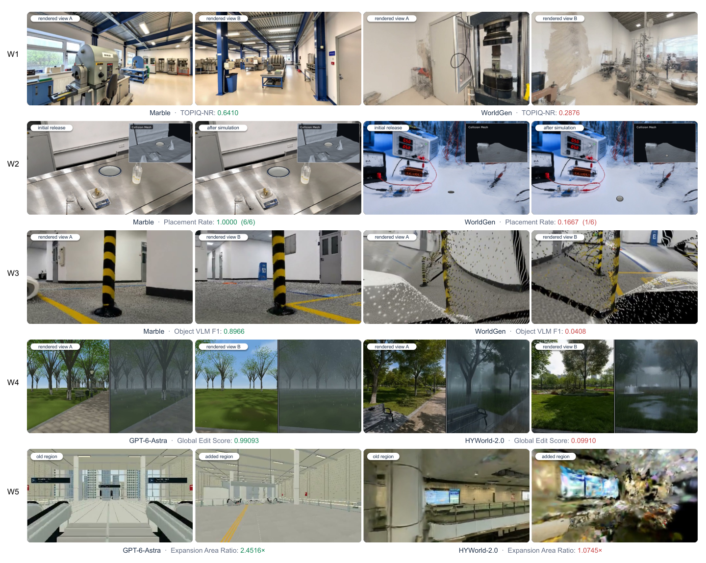
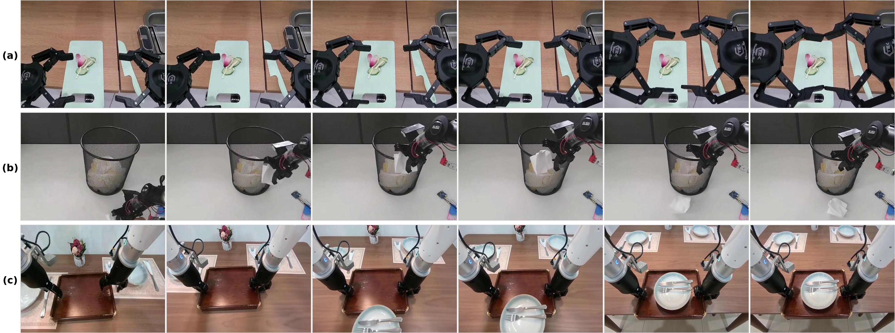
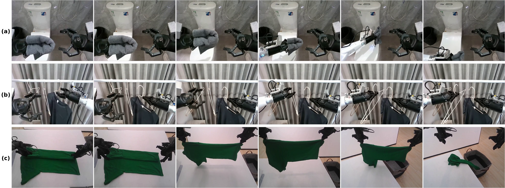
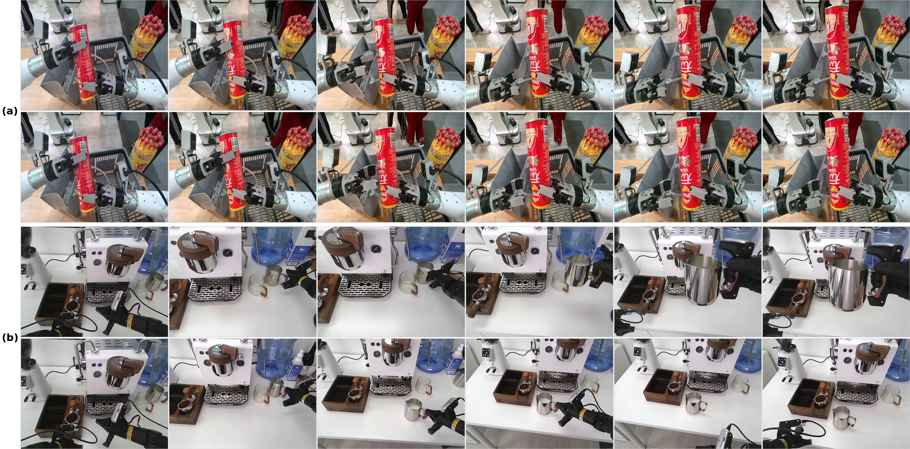

# HappyWorld-Bench：生成的世界经得起“折腾”吗？—— 一个覆盖视频、3D、具身三赛道的世界模型可靠性基准

这两年“世界模型（World Model）”火得一塌糊涂：Genie 3、Sora、各种可交互视频生成模型层出不穷，生成的画面一个比一个惊艳。但一个根本问题始终没有被系统回答： **生成的世界，在智能体真正进去“折腾”一番之后，还靠谱吗？** 相机走两步场景就崩了怎么办？离开再回来，桌子上的杯子还在原地吗？让它“把重力反过来”，它听得懂吗？

今天要解读的这篇 HappyWorld-Bench，就是冲着这个问题来的。它来自阿里巴巴 Token Hub、BIGAI（北京通用人工智能研究院）、清华、南大、北大等机构，核心主张非常直接： **评测世界模型，不能只看画面质量，更要看它在动作、记忆与干预之下的状态可靠性** 。为此作者们构建了一个统一的 W1–W6 能力层级框架，并在视频、空间（3D）、具身三条独立赛道上实例化，配合超过 10 万次人工 pairwise 对比的 Arena Elo 评级和一大批全新设计的自动化指标，对 14 个视频世界模型、9 个空间系统、8 个具身候选模型做了一次“大摸底”。

结论颇为“泼冷水”：目前没有任何系统建立起决定性优势——视频赛道前两名 Elo 只差 57 分（摘要口径下领先者间差异极小）；空间赛道最好的摆放成功率只有 70.14%，编辑成功率封顶 73.33%；具身赛道在多步动作状态保持、物理规则反事实干预上集体挣扎。 **几何完整性和视觉保真度，并不等于操作层面的可用性。**

## 一、为什么需要这个新 Benchmark？

世界模型的前提很朴素：如果智能体能在“脑内”模拟未来，就不用真的去现实里试错。但这个前提有个致命要求——模拟的世界必须 **可靠** 。一张以假乱真的单帧远远不够：相机移动时几何要一致、交互时物理要合理、长时程 rollout 和重访时状态要持续、接收到控制与干预指令时要正确响应。

问题在于，现有的评测体系是 **碎片化** 的：

- 视频生成 Benchmark（如 VBench 2.0、WorldScore）主要看视觉质量、可控性；
- 交互式世界模型 Benchmark（WorldMark、iWorld-Bench、WBench、MBench、WorldRoamBench、PlayWorld 等）各自考察控制、记忆、长时程一致性的一部分；
- 具身世界模型 Benchmark（EWMBench、MiraBench、WorldArena 等）接口和目标又与视频/空间赛道完全不同。

每个社区都发展出了精致的评测协议，但彼此 **无法在同一个能力框架下对话** 。后果很具体：一个视频模型画面炸裂却可能在长程交互中丢失物体身份；一个 3D 重建模型场景看着完整却可能根本没有可行走的几何；一个具身模型视频看着像那么回事，却可能根本没产生指令要求的动作后果。HappyWorld-Bench 就是要用 **一套统一的能力词汇表** ，把这三类模型拉到同一个擂台上。

## 二、核心设计：W1–W6 能力层级 + 三赛道 + Arena

### 2.1 W1–W6：一条从“看起来对”到“通用世界”的能力阶梯

> 图解：HappyWorld-Bench 的六级世界能力阶梯示意。从 W1 感知世界（把多模态输入组织成语义、空间正确的世界切片）起步，逐级叠加交互模拟（W2）、状态持久（W3）、可编程干预（W4）、可扩展共享世界（W5）的要求，最终通向统一世界模型（W6）。图中每一级都配有对应的典型任务案例，直观展示“每一级比上一级多要求了什么”。

六个级别的定义如下：

| 级别 | 名称 | 核心要求 |
| --- | --- | --- |
| W1 | Perceptual World（感知世界） | 从视觉/多模态条件构建连贯世界表征，语义、空间结构正确，短时程时序连续 |
| W2 | Interactive World（交互世界） | 模拟动作条件下的状态转移，保持局部几何、物理、因果一致 |
| W3 | Persistent World（持久世界） | 长时程交互、视角变化、遮挡与重访下，维持全局空间结构、物体身份与累积状态 |
| W4 | Programmable World（可编程世界） | 支持对物体、事件、行为或世界规则的显式干预，改动按因果传播且不影响无关内容 |
| W5 | Scalable World（可扩展世界） | 生成可无限扩展、多智能体共享的世界状态，支持通信、同步、协作与冲突处理 |
| W6 | Universal World（通用世界） | 把生成、模拟、状态建模、交互、规划整合进统一系统，跨环境、任务、模态、本体泛化 |

这个层级设计的妙处在于： **每一级都在“单帧看起来逼真”之上多加一条硬性要求** ，形成从静态重建到交互、持久、可编程、共享、统一的完整阶梯。它实际上给“什么叫可靠的世界模型”下了一个可操作的定义。

### 2.2 三条赛道：同一个框架，三种模型形态

框架落地的第二条原则是：不为不同模型家族各建一套孤立数据集，而是用 **三条互补赛道** 实例化同一套 W1–W6 词汇表：

- **Video World Model Track（视频赛道）** ：测试输入之外的观测是否在空间与时序上连贯——世界模型作为“渲染器”；
- **Spatial World Model Track（空间赛道）** ：测试导出的显式 3D 场景是否支持合法的物理操作——世界模型作为“模拟器”；
- **Embodied World Model Track（具身赛道）** ：测试从第一人称视角预测机器人、场景与被操作物体如何随动作演化——世界模型作为“规划器”。

第三条原则是 **人类评测 + 自动化指标双轨并行** ：作者搭建并运营了 **HappyWorld-Arena** ，在三条赛道上组织匿名 A/B 对比并估计模型级 Elo 等级分；同时每个赛道都配有一套全新设计的自动化指标，捕捉“行为正确性”——动作是否引起了正确的变化、状态是否跨遮挡保持、修改后的规则是否真正支配后续演化。

### 2.3 数据规模与统计

> 图解：HappyWorld-Bench 的数据统计。包含层级能力分布（内环为能力维度、外环为细粒度评测面）、应用领域分布、W 级别覆盖、rollout 时长分布与首帧分辨率分布。整个基准共 1,692 个赛道实例：1,138 个视频 prompt、300 个空间场景、254 个具身测试用例，覆盖机器人、城市、室内、自然、交通、游戏、日常生活、工业、奇幻、材料等九大应用领域；rollout 从短交互到 60 秒不等，首帧分辨率从 1MP 以下到 8MP 以上，视觉与时序条件高度异质。

## 三、Video World Model Track：交互视频世界模型大摸底

### 3.1 数据构造：能力导向的用例设计

> 图解：视频赛道的数据生产流水线。每个测试用例由首帧图像 + 场景/主体文本描述 + 带时间索引的控制序列组成，按“能力矩阵”分配目标 W 级别、评测维度、应用领域与视角；首帧来自真实影像与渲染环境（生成图像作补充），再经人工审核过滤掉评测目标模糊、控制不可行或证据不足的用例。W1 无需动作（考察自然演化）；W2/W3 指定方向与时间段而非目标位姿（因为同一控制输入在不同模型下产生的位移量不同）；W4 额外支持自然语言干预指令；W5/W6 可将控制分配给多个主体。

用例设计覆盖五类互补场景： **自然动态** （动物走动、车辆驶过、植被摆动）、 **外观与空间结构** （前后景分明、纹理丰富、深度关系清晰）、 **运动与环境响应** （定时移动 + 相机控制，含入水等环境反馈）、 **长时程持续性** （平移 + 旋转 + 重访路径）、 **交互与规则编辑** （主体动作、环境交互、规则修改）。最终视频池共 1,138 个独立用例，W1–W5 分别为 218、294、342、180、104 个，并定义了 74 个细粒度评测面，归入五大能力维度。

### 3.2 评测指标：四大维度

视频赛道沿四个维度设计自动化指标（分数均归一化到 $[0,1]$ 后以百分制报告，越高越好，不适用项直接剔除不计零）：

- **Perception and Representation（感知与表征）** ：VQ（MUSIQ 无参考画质）、HPS（HPSv3 人类偏好评分，先做 1%/99% 分位截断再时序平均）、IS（成像稳定性，亮度一致性 + 色温一致性 + 清晰度保持的均值）、Dyn（RAFT 光流量化的动态程度）、IF（指令遵循，原子化 checklist 打分）。
- **Consistency and State Retention（一致性与状态保持）** ：BC（掩掉运动主体后的 CLIP 背景相似度，兼顾相邻帧突变与首帧漂移）、GC（DA3 深度 + 位姿跨帧重投影的几何一致性）、TC（几何对齐后的光度/纹理一致性）、SC（物体状态与空间关系持续性的 1–5 分制评分）、SuC（SAM2.1 掩码 + DINOv2/CLIP 特征的主体身份保持）。
- **Causality and Causal Rollout（因果与因果展开）** ：PC（物理因果 checklist）、CC（内容因果：触发—后果链条是否成立）、IP（物体间穿插、悬空、非法接触检查）。
- **Controllable Interaction and Counterfactuals（可控交互与反事实）** ：W1–W3 用 TA（DA3 估计的相机位移与指令方向的段落级一致率）与 AE（动作在对应时间段内是否可见完成）；W4 改用 IV（干预过程是否物理/因果合法）与 SF（目标状态达成、持续、无关内容保持三子类均衡聚合）。

这里有两个设计细节值得一提。其一，IS 把三种“视觉不稳定”来源——曝光漂移、色温漂移、清晰度损失——合并为一个稳定性指标：

$$
S_{\mathrm{IS}} = \frac{S_{\mathrm{Bri}} + S_{\mathrm{CT}} + S_{\mathrm{SR}}}{3}
$$

其二，TA 只考察 **段落级平移方向一致性** （方向投影相似度 $\geq 0.5$ 记为通过），而刻意不考核精确位置、距离、速度——因为不同模型对同一按键输入的响应幅度本来就不同，这正是作者在数据设计上的深思熟虑之处。

### 3.3 实验结果：没有王者，只有“各有所长”

评测阵容为 14 个交互式世界模型（Genie 3、HappyOyster、JoyAI-Echo、Alaya-EVOKE、LingBot-World-v2、Cosmos3、Yume-1.5、Lyra 2.0、DreamX-World、Matrix-Game 3.0、SANA-WM、Matrix-Game 2.0、ABot-World、Open-Oasis），W1 另加 5 个视频生成基线（HappyHorse 1.1、Kling 3.0、MiniMax-H3、Seedance 2.5、Wan 3.0），W4 仅有 HappyOyster 与 LingBot-World-v2 支持干预设定。

| 模型 | Arena Elo ↑ | W1 ↑ | W2 ↑ | W3 ↑ | W4 ↑ |
| --- | --- | --- | --- | --- | --- |
| HappyOyster | 1263 | 82.4 | 78.0 | 76.8 | 66.7 |
| Genie 3 | 1206 | 82.8 | 74.0 | 75.0 | - |
| JoyAI-Echo | 1147 | 78.2 | 74.5 | 74.1 | - |
| Alaya-EVOKE | 1132 | 79.2 | 73.9 | 74.6 | - |
| Lingbot-World-v2 | 1115 | 81.9 | 72.6 | 71.0 | 59.3 |
| Cosmos3 | 1092 | 81.3 | 70.2 | 64.8 | - |
| Yume-1.5 | 1063 | 79.6 | 70.2 | 67.7 | - |
| Lyra 2.0 | 1059 | 81.0 | 73.5 | 71.6 | - |
| DreamX-World | 1041 | 80.3 | 72.7 | 72.4 | - |
| MatrixGame-3.0 | 943 | 78.8 | 64.6 | 66.1 | - |
| SANA-WM | 917 | 78.0 | 64.0 | 62.4 | - |
| MatrixGame-2.0 | 856 | 63.4 | 61.1 | 59.6 | - |
| ABot-World | 843 | 69.0 | 64.6 | 60.4 | - |
| Open-Oasis | 324 | 53.1 | 43.3 | 39.4 | - |

几个关键观察：

- **W1** ：感知质量与世界一致性明显“分家”。很多模型视觉质量和指令遵循很强，但时序/状态一致性弱得多——好看的画面不等于连贯的世界。
- **W2** ：TA/AE 高（会跟控制）不保证后续状态连贯；SC、CC 的分化说明“动作做对”与“世界演化做对”是两回事。
- **W3** ：长时程与重访是最难的部分。视觉合理的帧仍可能出现几何漂移、外观变化、状态篡改。注意 W2 与 W3 用例池不同，分差不能解读为纯时长效应。
- **W4** ：干预执行成功不等于编辑后行为稳定。一个有效的规则编辑（比如改重力）应当 **持续支配后续动力学** ，而非一次性的视觉变化——这正是 IV/SF 联合考察的动机。

> 图解：视频赛道 W1–W4 的定性案例。横向对比不同模型在同类任务下的生成结果：W1 看自然演化与外观保持，W2/W3 看动作响应与重访一致性，W4 看规则干预是否被正确执行并持续生效。可以直观看到头部模型与尾部模型在世界连贯性上的巨大差距。

附录中还详细记录了 14 个模型的推理协议适配，这部分对复现非常重要：Genie 3 通过 Project Genie 网页端用 Playwright 浏览器自动化评测（WASD 映射平移、方向键映射相机，wall-clock 调度控制）；LingBot-World-v2 把控制序列累积成相机位姿并构造 Plücker embedding；MatrixGame-2.0/3.0 分别用 4 维/6 维键盘向量加 pitch-yaw 向量；Cosmos3 改用自动驾驶（av）动作域，将指令编译为逐帧相对位姿并用 unicycle 模型积分；Open-Oasis 用 25 维动作向量、FP32、10 步 DDIM。值得注意的一个共性局限是： **多数模型的文本条件只在 rollout 开始时编码一次，自然语言事件干预无法做到时间对齐** ——这也是为什么 W4 目前只有两个模型可测。

## 四、Spatial World Model Track：3D 场景不仅要“能看”，还要“能用”

### 4.1 数据构造：任务导向的场景与标注

空间赛道评估从图像/场景描述构建的显式可渲染环境（Gaussian 场景、mesh 等）。由于现有方法尚无法实现时空联合建模，本赛道只选静态场景，并排除含人物或可见身体部位的首帧。数据集共 **300 个场景** ：266 个快照场景 + 34 个空间扩展用例；其中标注了 424 个轨道评测目标物体、72 个含支撑面的摆放场景、30 个编辑场景-指令对（18 个物体级 + 12 个全局）。

> 图解：空间赛道任务标注示例（编辑指令）。编辑集覆盖六类物体级操作（添加、删除、替换、颜色、状态、材质）与四类全局操作（天气、光照/时间、大气效果、地形）；此外还有轨道一致性目标物体、桌面支撑面摆放、以及适合空间扩展的场景（敞开的门廊、走廊、开阔地）等标注类型。每个任务按需求单独筛选场景。

### 4.2 指标体系：39 个量、W1–W5 全覆盖

空间赛道的指标设计是本论文最“硬核”的部分，附录给出了 39 个量的完整定义（主表保留 31 个），按 W1–W5 分组：W1 可观测质量 10 个、W2 物理可用性 2 个、W3 场景级一致性 6 个 + 物体级一致性 9 个、W4 受控编辑 7 个、W5 扩展与保持 5 个；W6 不计分。挑几个最有代表性的讲：

**W1 可观测质量** ：TOPIQ、LAION 美学、PI（感知指数，越低越好）、Q-Align、HPSv3、Qwen3-VL 三项判定（无 artifact、清晰度、布局合理性）、洞率（渲染不透明度 $<0.5$ 的像素占比）、CLIP-T/CLIP-I 对齐、命名物体覆盖率。

**W2 物理可用性** ，两个指标都非常“实”：

- **Navigable ratio** ：用 Habitat-Sim 构建 NavMesh（导航网格），取水平占据栅格最大四连通分量面积与足迹面积之比——衡量场景里有多大比例的空间可供连续探索：

$$
R_{\mathrm{nav}} = \frac{\max_k A(N_k)}{A(F)}
$$

- **Placement rate** ：在标注支撑面上选 6 个空间分散的放置点，在 PyBullet 中从 1cm 高度释放一个标准圆盘（直径 0.22m、密度 1800kg/m³），仿真 5 秒，初始穿透 >2mm、沉到支撑面下 10cm 或滑出边界即失败。这是一个真正的“物理考试”。

**W3 状态持久性** ：场景级包括越界率（六面探针洞率 + 深度净空判定）、亮度/色相一致性、Location HPS F1；物体级围绕每个标注物体的 24 视角固定轨道，用 SAM3 检出覆盖、掩码 HPSv3 离散度、TAPIP3D 点跟踪回程对应、VLM 完整性判定等组合出三个 F1。这里的 F1 并非分类意义，而是 **一致性—覆盖度的调和组合** ：

$$
H(p, r) = \frac{2pr}{p + r}
$$

其中 $p$ 是逆离散度（质量的稳定性），$r$ 是可用观测覆盖率。一个场景“只在少数位置看起来一致”会被覆盖率项惩罚——这个设计防止模型靠“偏科”刷分。

**W4 受控编辑** ：把编辑拆成“执行成功”与“非目标保持”两个独立要求。物体级编辑用允许变更掩码 $M$ 的背景补集 $B$ 上计算 RGB PSNR、空间 LPIPS、DINOv2 patch 距离；全局编辑用配对深度一致率。联合分数把二者相乘：

$$
S_{o,i} = E_i \left[ 1 - \tfrac{1}{3} \left( \mathrm{RMSE}_{B,i} + \mathrm{LPIPS}_{B,i} + D_{B,i} \right) \right]
$$

$E_i$ 是编辑成功的 0/1 指示（Qwen3-VL 判定任一后编辑视角满足指令）。执行失败直接清零—— **“改对了”和“没碰坏别的”是相乘关系，不是相加** 。

**W5 扩展与保持** ：用扩展前后足迹面积比衡量空间增长，用共享“交界处”相机的洞率差衡量覆盖增益，再用 HPSv3 分别衡量新区域质量、旧区域保持与连接路径保持（后两者是 before/after 配对差分，显示值 50 为中性，高于 50 表示改善）。

**归一化与 Elo 修正** 也值得复现者注意：所有原始指标先经固定规则（如 AES 映射 $C((x-1)/9)$、洞率取 $1-C(x)$）或冻结的参考分布仿射映射归一化到 $[0,1]$，常数冻结在 `wmbench-normalization-v1`，新增方法不重拟合；组内指标等权平均。Arena Elo 采用 Bradley–Terry 最大似然估计（均值归一到 1000），并且 **对不支持某项能力的模型补充确定性判负场次** ——这样“功能缺失”不会被投票数据掩盖。

### 4.3 实验结果：好看 ≠ 能走 ≠ 能改

| 模型 | Arena Elo ↑ | W1 ↑ | W2 ↑ | W3 ↑ | W4 ↑ | W5 ↑ |
| --- | --- | --- | --- | --- | --- | --- |
| Marble | 1308 | 79.10 | 64.99 | 59.89 | 53.51 | 45.44 |
| GPT-6-Astra | 1252 | 63.72 | 65.43 | 68.80 | 82.09 | 63.10 |
| HYWorld-2.0 | 1230 | 76.30 | 67.71 | 57.99 | 59.97 | 43.16 |
| HYWorld-1.0 | 1029 | 78.78 | 59.40 | 55.19 | 66.16 | - |
| Matrix-3D | 1019 | 46.35 | 56.35 | 52.73 | 49.76 | 35.15 |
| WorldGen | 962 | 69.17 | 60.11 | 54.16 | 57.56 | - |
| FlashWorld | 743 | 49.39 | 0.00 | 38.13 | - | - |
| Lyra 2.0 | 729 | 57.58 | 0.90 | 40.52 | - | - |
| Lyra 1.0 | 728 | 41.10 | 1.36 | 37.07 | - | - |

逐组来看：

- **W1** ：Marble（3DGS 表示）与 HYWorld-1.0（全景图提升为 mesh）领先；GPT-6-Astra 直接用 Blender 建 mesh，TOPIQ 最高但 PI、HPS 偏低——合成感太强，几何细节和材质真实感不足。
- **W2** ：FlashWorld 与 Lyra 系列能渲染出场景，却几乎没有可行走区域、摆放全败（W2 仅 0.00–1.36）——几何不完整、洞率高。WorldGen 可导航率接近最高但摆放率明显落后 HYWorld-2.0： **能走的地不等于能放东西的台面** 。最强系统摆放率也只有 70.14%。
- **W3** ：GPT-6-Astra 尽管 W1 视觉分最低，却横扫场景级指标与全部三个物体级 F1；Matrix-3D 则相反，场景级亮度色相稳定，Track F1 与 VLM F1 垫底—— **整体观感稳定，掩盖了物体对应关系与完整性的崩坏** 。
- **W4** ：HYWorld-2.0 编辑成功率最高（73.33%），但 GPT-6-Astra 在保持项与两个联合分数上全面领先——实现变更与限制副作用是两个独立要求，这也解释了为什么联合分数是相乘的。
- **W5** ：Matrix-3D 面积增长不小，但新区域质量与旧区域保持双垫底；GPT-6-Astra 在增长、交界改善、双保持上全面领先，Marble 则胜在新区域画面质量。 **扩得多，不如扩得好且守得住。**

> 图解：空间赛道定性案例对比。包含各系统生成场景的渲染视图、导航/摆放等物理操作结果以及编辑与扩展前后的对照。可以直观看到：有的场景照片级好看却走不进去，有的编辑“成功”了却把背景改得面目全非。

## 五、Embodied World Model Track：动作—接触—后果，一环都不能断

### 5.1 任务形式化与数据

具身赛道把每个用例形式化为图像条件、prompt 控制的视频生成问题：给定动作前的第一人称参考图像 $I_0$ 与完整描述动作条件（主体、目标、动作类型、方向、多步任务的有序阶段与时间区间）的 prompt $p$，模型生成 rollout：

$$
Y_{1:T} = G_{\theta}(I_0, p)
$$

接口保持 **纯生成式** ：不需要模拟器、动作解码器或真实机器人，任何能做动作条件视频生成的模型都能参测。评测沿两条正交轴展开：能力轴 W2–W4（W2 单原子动作即时响应，62 例、5 秒；W3 有序多步 rollout 的状态持久，100 例、12 秒；W4 共享初始状态下的成对干预，92 组：40 组动作条件对 + 52 组物理规则对），评分轴为感知、一致性、因果、可控性四个维度。动作词表覆盖抓、举、开、移、推、放、压、拉、折、插、擦、滑、转、搬、叠、切等 19 类技能，共 254 个任务实例、2,768 条 rollout 记录。

### 5.2 17 个指标与总分聚合

评分轴共 17 个指标：感知 4 个（SF 场景保真、SuF 主体保真、PQ 画质 MUSIQ-SPAQ、SR 清晰度保持）、一致性 5 个（SAC 主体外观一致性、GC 几何一致性、SSC 场景—状态一致性、TC 时序连贯、MS 运动平滑）、因果 3 个（PP 物理合理性、TCO 时序因果顺序、CTV 因果触发有效性）、可控性 5 个（GSA 目标状态达成、AAC 原子动作合规、FIS 功能交互成功、MAO 多动作排序、CBF 条件分支保真）。其中 SAC 的设计颇有代表性：SAM3 跟踪机器人主体掩码，提取 DINOv3 与 CLIP 特征与首个有效帧比对，再做 10% 双侧截尾平均，并乘以掩码覆盖率 $\rho_i$ 惩罚主体“跟丢”：

$$
\mathrm{SAC}_i = 100 \, \rho_i \left[ \tfrac{1}{2} \operatorname{TrimMean}_{0.1}(\{\tilde d_t\}) + \tfrac{1}{2} \operatorname{TrimMean}_{0.1}(\{\tilde c_t\}) \right]
$$

四维分数按固定权重聚合（因果与可控性权重更高，因为它们才是“世界模型”区别于“视频生成”的核心）：

$$
S_{\mathrm{overall}} = 0.20 S_{\mathrm{perc}} + 0.20 S_{\mathrm{cons}} + 0.30 S_{\mathrm{caus}} + 0.30 S_{\mathrm{ctrl}}
$$

### 5.3 实验结果：感知不是瓶颈，因果才是

8 个候选模型（MiniMax-H3、Cosmos 3、Seedance 2.5、Grok Imagine Video 1.5、HappyHorse 1.1、Kling 3、Sora 2、Wan 3.0）在统一 W2–W4 协议下评测，Arena Elo 由 62,592 张盲评 pairwise 投票估计。

| 模型 | Arena ELO ↑ | W2 ↑ | W3 ↑ | W4 ↑ |
| --- | --- | --- | --- | --- |
| MiniMax-H3 | 1060 | 93.60 | 91.42 | 88.62 |
| Grok Imagine Video 1.5 | 1051 | 93.02 | 88.51 | 83.48 |
| Wan 3.0 | 1051 | 90.53 | 87.96 | 84.53 |
| Seedance 2.5 | 1031 | 90.91 | 86.73 | 84.11 |
| HappyHorse 1.1 | 1026 | 91.59 | 88.82 | 84.60 |
| Kling 3 | 978 | 85.94 | 84.26 | 78.70 |
| Cosmos 3 | 931 | 69.16 | 74.47 | 68.33 |
| Sora 2 | 872 | 60.91 | 65.35 | 64.12 |

MiniMax-H3 在三个级别与 Arena 上全面第一；Arena 排序与自动评测大体一致，仅局部微调。更重要的是失败模式的层层递进：

**W2 的瓶颈不在感知，而在“动作—接触—后果—终态”链条的断裂** ，三类代表现象：夹爪在空气中反复做抓取动作却从未碰到目标；把动作施加到了错误的物体上；场景中无端冒出初始帧不存在的物体、或视角擅自离开固定机位。

> 图解：W2 代表性失败 rollout，每行为一个动作 prompt 对应的六个关键帧。(a) 指令要求双夹爪抓住砧板两侧垂直抬起，生成的视频中夹爪只在砧板旁空气中开合，砧板从未离开桌面；(b) 指令要求抓取网篮中的纸团，生成的视频却抓起了篮子旁边的纸巾，目标纸团纹丝不动；(c) 指令要求推托盘，生成的视频中空托盘凭空多出了盘子和餐具，视角也跳离了固定相机。

**W3 的失败集中在状态跨阶段传递** ：第一阶段没建立起前提状态，后续动作全部“错位的正确”；中间状态没有传递下去，序列形式连贯却没有累积效果；终态始终未达成——T 恤抓起、抖开，最后却被丢在篮子边缘。

> 图解：W3 代表性失败 rollout。(a) 指令为“开马桶盖→抓毛巾→擦拭→放一边”，生成的视频中盖子从未打开，后续擦拭动作在关闭的盖子上“空演”；(b) 指令为“取下带衬衫的衣架→平移到左侧空杆→重新挂上”，生成的视频中衬衫衣架被拿着不动，另一只夹爪却取下空衣架悬在半空，重新挂的动作从未发生；(c) 指令为“抖开绿 T 恤并放入条纹篮”，生成的视频最后把衣服丢在篮子边缘，rollout 结束时衣服团在桌上。

**W4 的主导失败是“对编辑无响应”** ：改了材质、重力、摩擦等物理规则后，生成的动力学里几乎找不到任何痕迹；动作条件的编辑只能被部分体现——方向对了，方式错了（该“推”的动作被做成了“抓起来拖”）。

> 图解：W4 共享初始状态的失败对，上下两行分别为同一初始帧在两个条件下的 rollout。(a) 两条 rollout 都抓举罐子，下方额外规定软橡胶材质，但两者形变完全一致——修改的材质规则没有留下任何可观测痕迹；(b) 上方按规定举起奶壶，下方应“接触并沿桌面向左推”，生成的视频里奶壶确实左移了，但是被夹爪抓住把手拖过去的——条件在方向上被尊重，在方式上被违背。

跨级别看，结论很清晰： **当前视频模型从真实第一人称观测生成机器人视角 rollout 的视觉保真度已经相当不错，但在动作落地（grounding）、状态持续演化、条件依赖的物理响应上仍然力不从心** ——而这恰恰是具身世界模型区别于普通视频生成的本质能力。

## 六、总结与启示

HappyWorld-Bench 的贡献可以浓缩为三点：

1. **一套通用的能力词汇表** （W1–W6），首次把视频生成、3D 重建、具身控制三个社区拉到同一个“可靠性”定义之下；
2. **一个大规模混合评测基准** ：1,138 视频 prompt + 300 空间场景 + 254 具身用例，HappyWorld-Arena 人工 Elo 与每赛道一套全新自动化指标互补；
3. **一份“泼冷水”的实证研究** ：14 + 9 + 8 个系统的横向对比表明，当前世界模型在交互模拟、状态持久、可编程动力学上都存在显著差距——视觉惊艳与可靠世界之间，还隔着一条明显的鸿沟。

对从业者的启示也很直接：如果你的模型只在“美图”指标上卷，那离真正的世界模型还很远。下一轮军备竞赛的关键指标，大概率是 **长时程重访一致性、物理可操作性、干预的因果持续性** 这些“用起来才知道”的能力。HappyWorld-Bench 已经把这些能力变成了可量化、可复现的评测目标，值得每个做世界模型的团队拿来当“试金石”。

> 本文参考自 [HappyWorld-Bench](https://arxiv.org/abs/2609.24308)