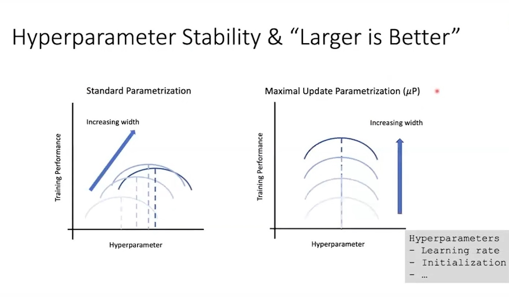
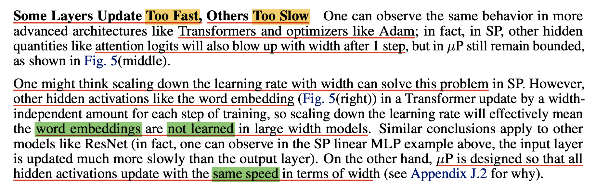
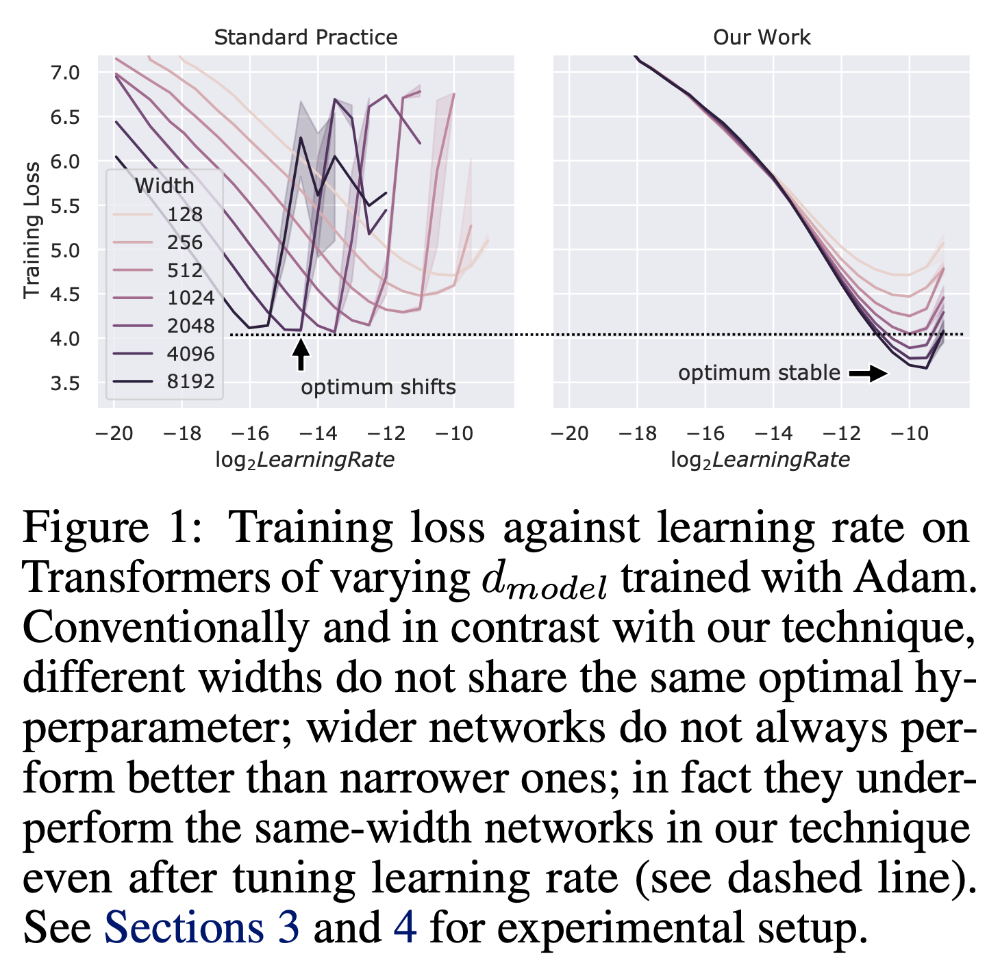
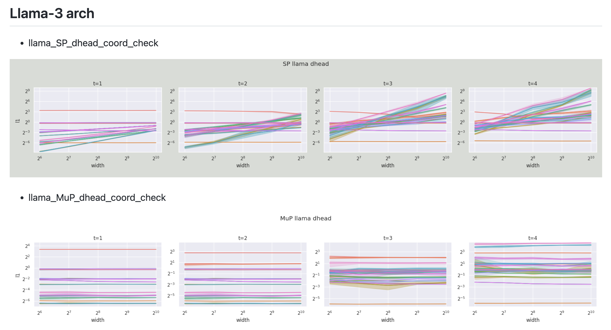
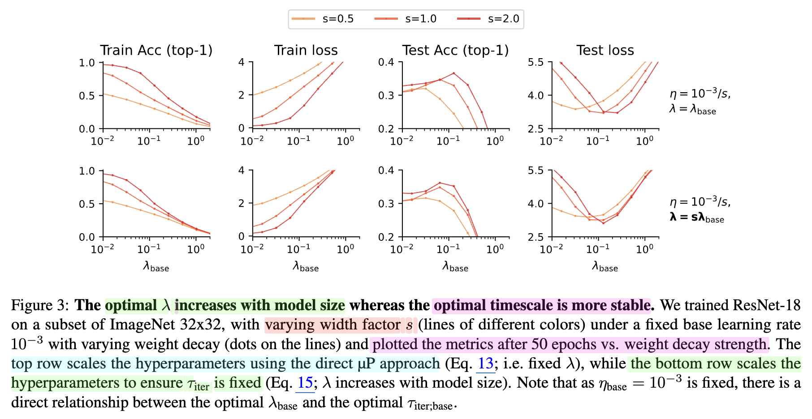
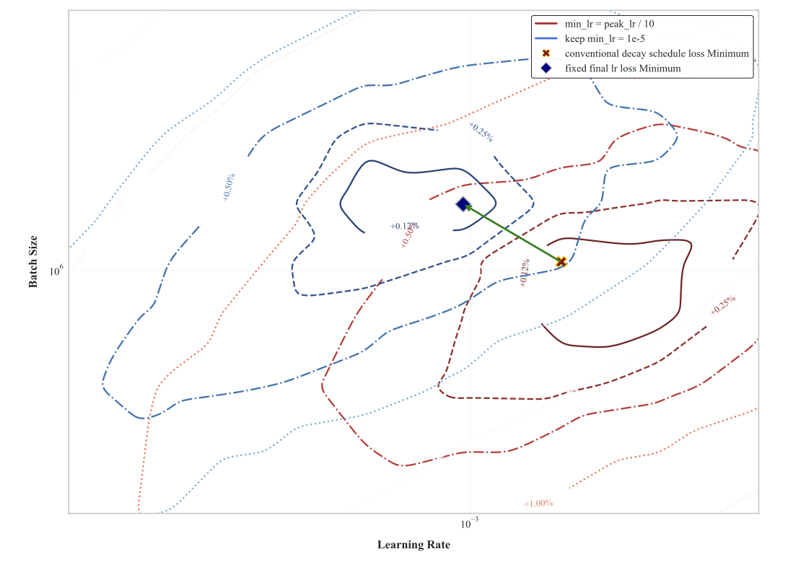

# How To Scale：从 muP 到训练超参缩放的完整路线图（长文精读）

## 一句话先讲清楚这篇文章在说什么
这篇长文围绕“ **如何在模型规模和数据规模不断变大时，正确设置初始化、学习率、批大小等超参** ”展开，核心抓手是 **Maximal Update Parameterization (muP)** ，同时讨论了 muP 的局限、与批大小/训练时长的耦合、以及更实用的经验型缩放法则。

---

## 1. 背景与动机：Scaling Law 告诉你“算力越大越好”，但没告诉你“怎么配超参”
传统 Scaling Law 只说 $C = 6ND$ 的算力变大，模型效果变好，但不会告诉你 **给定算力预算 $C$ 时，学习率和 batch size 应该怎么选** 。如果超参不对，甚至会得出“模型越大越差”的错误结论。

  
> 图解：Scaling Law 展示“性能随算力单调提升”的趋势，但这只在超参接近最优时成立。

核心问题被拆成三类：
- 如何随算力 $C$ 缩放学习率（lr）？
- 批大小（bsz）随算力怎么变？
- 或者拆成随模型大小 $N$ 和数据量 $D$ 的缩放？

---

## 2. 核心方法：muP 到底解决了什么？
muP 的核心不是“超参迁移”，而是 **保证每一层都能最大化地学特征** 。它提出每层单独控制：
- learning rate
- init std
- multiplier  

目标是三个“desiderata”：
1. **训练稳定性** ：激活不随宽度爆炸  
2. **特征学习** ：每层都真正在学  
3. **非平凡性** ：权重更新不应该被卡死  

  
> 图解：muP 不是仅为了 HP transfer，而是为了让每一层都能达到“最大特征学习”。

---

## 3. 从 SP 到 muP：为什么标准初始化不够？
SP（Standard Parameterization）只保证初始化时激活稳定，但不考虑训练过程里更新带来的放大。  
muP 的关键是： **训练过程中的点积会逐渐相关** ，因此需要区分 LLN 和 CLT 的增长率：

- 独立（CLT）：缩放 $\sqrt{n}$
- 相关（LLN）：缩放 $n$

这就是 muP 的直觉公式来源。

  
> 图解：点积是否相关，决定你该除以 $n$ 还是 $\sqrt{n}$。

---

## 4. muP 的推导核心（精炼版）
假设 $z = Wx$，$W \in \mathbb{R}^{n\times n}$。  
初始化时 $W_{ij} \sim \mathcal{N}(0, \sigma^2)$，SP 选择 $\sigma^2 = 1/n$ 确保前向输出 $\Theta(1)$。  

但一次更新后：
$$
W_{t+1} = W_t - \eta g_t
$$

如果 $x$ 与 $x'$ 相关，则 $\langle x, x' \rangle \propto n$，会导致激活爆炸。  
于是 **muP 的基本逻辑就是：点积尺度必须随 $n$ 抵消** 。

---

## 5. abc-parameterization：muP 的“标准形式”
muP 用三个指数参数化每层：

- $W^l = n^{-a_l} w^l$  
- $w^l \sim \mathcal{N}(0, n^{-2b_l})$  
- lr = $\eta n^{-c_l}$  

这些 a/b/c 的选择保证：
- forward 稳定  
- backward 稳定  
- 最大特征学习  

  
> 图解：muP 的核心表格，列出了不同层的 a/b/c 指数配置。

---

## 6. muP 的关键实践规则（最关键的三条）
1. **隐藏层 lr 要随宽度 $1/n$ 缩放（Adam 情况）**  
2. **读出层（lm head）梯度过大，要“打折”**  
3. **embedding 梯度太小，需要放大**

  
> 图解：lm head、embedding、hidden layer 的梯度规模不同，必须分层处理。

---

## 7. muP 不是银弹：批大小与训练时长会破坏 HP transfer
muP 只保证 **“宽度变化时 lr 迁移”** ，但 **bsz 和训练时长变化会导致最优 lr 左/右移** ：

- 更长训练 → lr 应该下降（左移）
- 更大 bsz → 训练步数减少 → lr 应该上升（右移）

  
> 图解：训练时长增加会导致最佳 lr 曲线整体左移。

---

## 8. 批大小、训练时长与权重衰减的联动
最新观点（Wang et al.）认为：  
**AdamW 更新可以视作 EMA，应该保持 epoch time scale 不变** 。

定义：
$$
\tau_{epoch} = \frac{1}{M \cdot \eta \cdot \lambda}
$$

如果数据集变大，$M$ 增加，应该降低 $\lambda$ 才能保持 $\tau_{epoch}$ 不变。  
如果模型变宽，muP 让 $\eta \propto 1/n$，因此 $\lambda$ 应该 $\propto n$。

  
> 图解：权重衰减是调整训练时长迁移性的关键旋钮。

---

## 9. HP Scaling Law：经验主义的“现实方案”
当理论推不动时，实战里会直接 **拟合 power law** ：

步骤：
1. 固定优化器其他超参  
2. 对多组 $N,D$ 做 grid search  
3. 拟合 lr 与 bsz 的 power law  

  
> 图解：DeepSeek 等工作通过拟合得到 lr / bsz 的经验缩放曲线。

---

## 10. Critical Batch Size (cbsz) 与“最优 batch size”
理论上， **只要不超过 cbsz，模型性能不应依赖 bsz** 。  
但现实里很多超参只调 lr，所以“最优 bsz”依旧成立。

  
> 图解：超过 cbsz 后，再加大 bsz 反而会增加计算成本。

---

## 11. 经验补充：QK LayerNorm 与 Put-Everywhere Norm
在大模型训练中，QK LayerNorm 能 **显著扩大 lr 可行区间** ，但也可能损害长上下文的注意力分布精度。

  
> 图解：QK-LN 把 logits 控制在稳定区间，扩大 lr basin。

---

## 12. Muon 与 muP：同一个目标的不同路径
Muon 优化器通过 **Spectral Normalization of Updates** 实现“最大更新”，本质上与 muP 的目标一致。

  
> 图解：Muon 通过近似 SVD 约束更新谱范数，实现最大更新。

---

## 13. 其他实战建议速记
- bf16 > fp16，减少 loss scaling  
- 关注 logits / 激活 norm，避免爆炸  
- 大规模训练尽量去 bias  
- RMSNorm 通常比 LayerNorm 更稳更快  
- MFU 低于 55% 时，说明系统瓶颈严重  

  
> 图解：训练效率（MFU）决定可规模化能力。

---

## 14. 一句话总结这篇文章
这篇文章的核心思想是：  
**Scaling 不是“模型变大”，而是“超参协同变化”** ，muP 是解决宽度迁移的关键方法，但批大小、训练时长、优化器超参仍然需要专门处理。

---

## 15. 参考与引用
本文参考自 How To Scale  
原文链接：https://howtoscalenn.github.io/