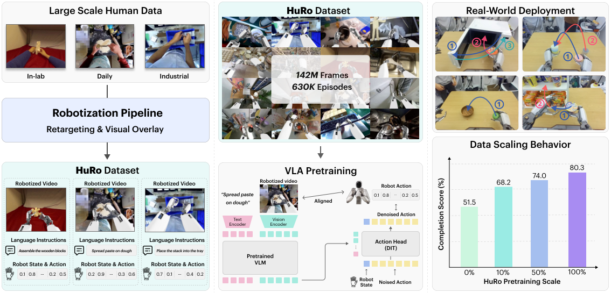
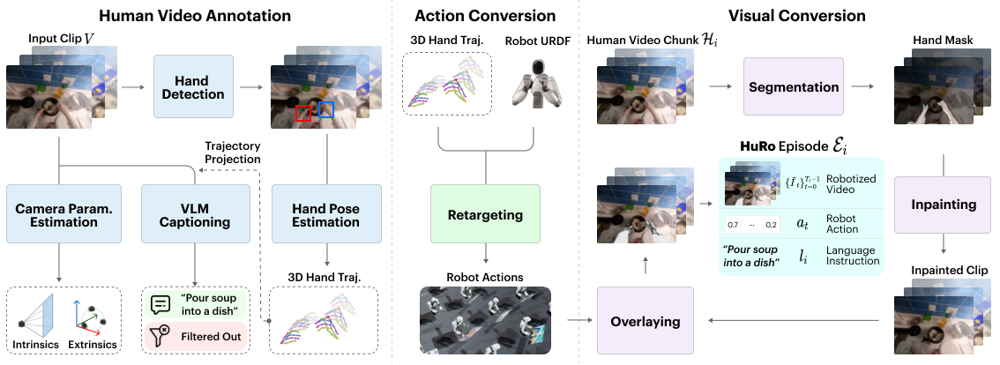
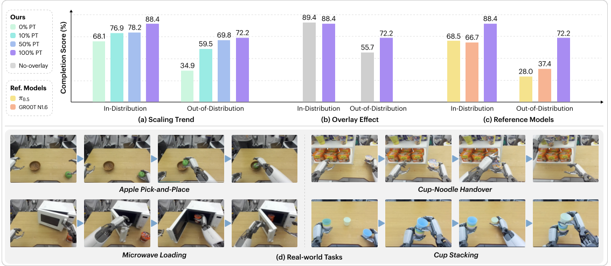
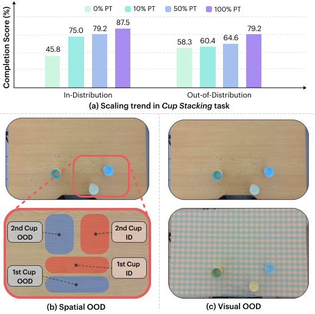
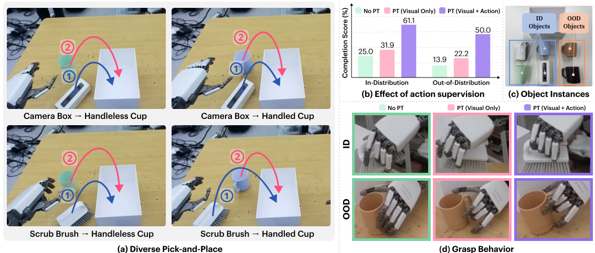
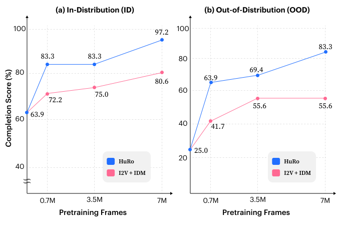
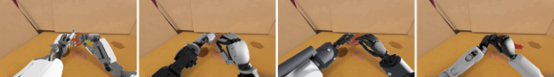
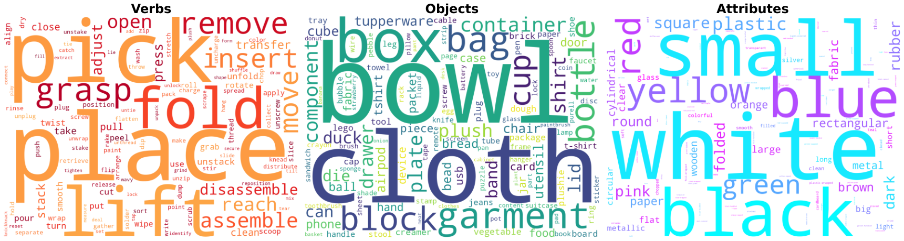
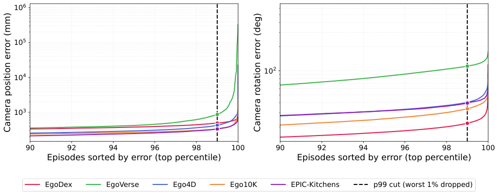
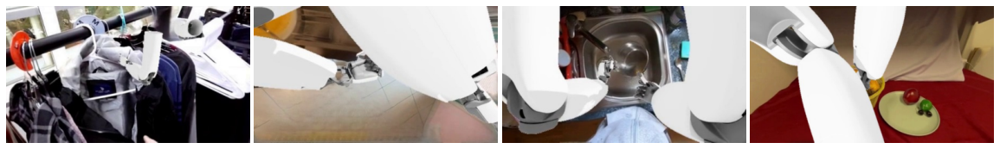

# HuRo：把人类视频"机器人化"，为 VLA 预训练提供可扩展的监督来源

> 论文链接：[HuRo: Robotizing Human Videos for Scalable VLA Pretraining](https://arxiv.org/abs/2609.10706)

**一句话总结** ：这篇文章提出了一个把第一视角（egocentric）人类视频自动"改造"成机器人观测-动作数据的流水线，构建了超过 63 万个 episode、1.42 亿帧的 HuRo 数据集。用它给 VLA 策略做预训练后，真机操作完成率从 51.5% 提升到 80.3%，OOD 泛化更是从 34.9% 翻倍到 72.2%。

## 背景：VLA 的"数据饥渴"与 embodiment gap

Vision-Language-Action（VLA）策略已经成为机器人操作的主流框架，OpenVLA、GR00T、π0 等一系列工作都证明： **预训练数据越多，策略越强** 。但问题来了——真机数据采集极其昂贵，一台机器人采一万条轨迹就要消耗大量人力物力。

相比之下，人类视频几乎是"免费的"：Ego4D、EPIC-Kitchens 这类第一视角数据集里包含了海量的物体、场景、视角和操作行为。很多人因此想到用人类视频来给机器人学习提供视觉和运动先验。

但直接用人类视频有一个核心障碍： **embodiment gap（本体差距）** 。人类的手和机器人的手臂在外观上完全不同（观测差距），运动学结构也完全不同（动作差距）。已有的工作大多只解决一半：

- 一类工作只做 **视觉机器人化** （visual robotization），把人的手换成渲染的机器人，用来预训练视觉编码器（如 H2R、Masquerade）；
- 另一类只做 **动作监督** （如 VITRA、EgoScale），把人的手部运动重定向成机器人动作，但观测仍然保留人类画面；
- 少数工作（Phantom、DexUMI、WARPED 等）同时做观测和动作的对齐，但基本都停留在 **task-matched** 场景——人类视频是为特定下游任务专门采集或转换的，谈不上"可扩展的数据源"。

这篇文章要回答的问题就是： **异构的、网上现成的人类视频，能不能成为大规模、观测-动作双双对齐的机器人预训练数据源？**

> 图解：HuRo 的整体思路。左侧是各种来源的人类活动视频（Ego4D、EPIC-Kitchens、EgoDex 等），中间通过视觉机器人叠加（robot overlay）和运动重定向（motion retargeting）两条路径，把视频转换成带有语言指令、机器人状态和动作的 robotized episode，右侧用于 VLA 预训练。底部曲线展示了核心结论：预训练用的 HuRo 数据越多，下游真机操作的成功率越高。

## 核心贡献一览

1. **一条通用的机器人化流水线** ：能把标注程度各异的异构人类视频（有的只有 RGB，有的带相机几何、有的带手部姿态）统一转换成机器人的观测-动作格式，缺失的中间信号全部由模型估计补齐。
2. **HuRo 数据集** ：来自 5 个人类视频源，超过 63 万个 robotized episode、1.42 亿帧（约 1317 小时 @30fps），比此前 robotized-video 预训练方法使用的数据大一个数量级以上。
3. **三个关键实验发现** ：
  - 下游真机性能随 robotized 数据量持续上升，ID 和 OOD 都涨；
  - 视觉机器人化对 OOD 鲁棒性至关重要（10% overlay 数据就能打过 100% 无 overlay 数据）；
  - 端到端带动作监督的预训练大幅优于只做视觉迁移。

## 方法：HuRo 构建流水线

> 图解：HuRo 的三阶段流水线。第一阶段"人类视频标注"估计相机几何、手部运动和语言指令；第二阶段"动作转换"把人的手部运动重定向成目标机器人的关节轨迹；第三阶段"视觉转换"把画面中的人类手臂抹除，再把重定向后的机器人渲染叠加回去，最终得到 robotized 观测。三个阶段串起来，原始 RGB 视频就变成了带 $(\tilde{I}, s, a, l)$ 的完整训练样本。

整个流水线分为三个阶段，下面逐一拆解，并解释"为什么这么做"。

### 阶段一：人类视频标注（Human Video Annotation）

输入是一段第一视角视频 $V=\{I_t\}_{t=0}^{T-1}$，这一阶段要估计出三类中间信号：

- **相机内参与畸变校正** ：用 droidcalib 从相机运动中自标定内参 $K$，近乎静止的片段退回用 AnyCalib。所有帧被校正为针孔透视图像，后续几何量都定义在校正后的源相机坐标系 $C_{\mathrm{src}}$ 下。
- **手部检测与 3D 手姿估计** ：先用 100DoH 逐帧检测手部包围框，再用 BOT-SORT 在时序上修正左右手归属（避免左右手跳变导致轨迹断裂），最后用 HAWOR 估计基于 MANO 的手部姿态 $P_t^h$。从 $P_t^h$ 里提取腕部轨迹、指尖位置和局部手部结构线索。
- **相机轨迹估计** ：用 masked DROID-SLAM 恢复 egocentric 相机轨迹——注意这里把可见的手部区域 mask 掉了，因为运动的前景像素会干扰 SLAM。单目 SLAM 没有绝对尺度，所以再用 MoGe-2 恢复米制尺度，用 GeoCalib 把世界坐标系对齐到重力方向，得到米制的相机到世界位姿 $T_t^{W\leftarrow C_{\mathrm{src}}}=(R_t,p_t)\in SE(3)$。

然后是 **分段与 VLM 打标** ：把有有效手部标注的帧聚成"操作片段"（manipulation segment），再切成有长度上限的 chunk。每个 chunk 把投影腕部轨迹叠加在采样帧上，喂给 Qwen3.5 生成一条语言指令 $l_i$，并加一个验证环节过滤掉图文不一致或没有实质手-物交互的 chunk。这一步的聪明之处在于： **给 VLM 看轨迹叠加图而不是纯 RGB，让它更容易理解手部在做什么动作** 。

每个标注好的 chunk 形式化为：

$$
\mathcal{H}_i = \left( \{I_\tau\}_{\tau=0}^{T_i-1},\; K,\; \{T_\tau^{W\leftarrow C_{\mathrm{src}}}\}_{\tau=0}^{T_i-1},\; \{P_\tau^{h}\}_{\tau=0,\ldots,T_i-1;\,h\in\{\mathsf{L},\mathsf{R}\}},\; l_i \right)
$$

其中 $\tau$ 是 chunk 内的局部时间索引。

### 阶段二：动作转换（Action Conversion）

这一阶段把人的手部运动重定向（retarget）成机器人的关节轨迹，是整个流水线的技术核心。

从每个手姿 $P_\tau^h$ 中提取 IK（逆运动学）目标： **指尖位置** 用于全局位置跟踪， **局部关键点对方向** 用于保持手部结构（比如捏合姿态）。这些目标先通过 $T_\tau^{W\leftarrow C_{\mathrm{src}}}$ 从相机坐标系变换到世界坐标系 $W$。

关键问题在于：人类视频的世界坐标系 $W$ 和机器人基座坐标系 $B$ 并不对齐。作者为每个 chunk 估计一个对齐变换 $T_{\xi_i}^{B\leftarrow W}$，由 3D 平移加 yaw 旋转参数化。这个变换同时承担两个角色：把手部 IK 目标映射进机器人基座系，也把源相机轨迹映射成机器人观测相机轨迹：

$$
T_\tau^{B\leftarrow C_{\mathrm{obs}}} = T_{\xi_i}^{B\leftarrow W}\, T_\tau^{W\leftarrow C_{\mathrm{src}}}
$$

这个设计很妙： **渲染机器人时用的虚拟相机轨迹就是经过同一变换后的人类相机轨迹** ，因此机器人化后的视频保持了原视频的 egocentric 运动，观测和动作天然在同一个坐标系里对齐。

重定向用 PyRoKi 分 **两个阶段** 求解：

1. **稀疏阶段** ：在少量采样时刻上联合优化对齐变换 $T_{\xi_i}^{B\leftarrow W}$ 和机器人关节角 $\{q_\tau\}$。目标函数包括指尖位置项、局部手部结构项、ego-view 一致性项（要求机器人头部相机链通过正运动学得到的位姿贴近 $T_\tau^{B\leftarrow C_{\mathrm{obs}}}$），外加关节限位和静止姿态正则。这一阶段只为手部运动找到一个"够得着"的基座摆放位置，稀疏关节角用完即弃。
2. **稠密阶段** ：固定对齐变换，在所有时刻上重新优化完整关节轨迹 $\{q_\tau\}_{\tau=0}^{T_i-1}$，额外加入时序平滑项，避免相邻帧关节跳变。

为什么分两步？因为如果一步到位联合优化，对齐变换和稠密轨迹耦合在一起很容易陷入局部最优；先用稀疏关键点把"机器人在哪里"定下来，再细化"机器人怎么动"，收敛更稳定。

最后，人类视频里没有现成的机器人动作标签，作者直接从重定向后的状态轨迹定义 **state-level 动作目标** ——下一步的状态就是当前的动作：

$$
a_{\tau} = \begin{cases} s_{\tau+1}, & 0 \le \tau < T_i - 1, \\ s_{T_i-1}, & \tau = T_i - 1. \end{cases}
$$

其中腕部目标转成相对当前腕部位姿的增量，手部关节目标保持绝对值。

### 阶段三：视觉转换（Visual Conversion）

这一阶段负责"画面改造"：把人抹掉，把机器人画上去。

- **人体移除** ：用 SAM2 分割可见的人类手臂（Detectron2 提供辅助的 person 区域 prompt），再用 ProPainter 做时序一致的 inpainting，得到干净背景帧 $\{\bar{I}_\tau\}$。
- **机器人叠加** ：用 Isaac Sim 渲染目标机器人。每个时刻渲染器使用观测相机 $T_\tau^{B\leftarrow C_{\mathrm{obs}}}$、内参 $K$ 和重定向关节角 $q_\tau$，把渲染结果合成到干净背景上，得到 robotized 观测 $\tilde{I}_\tau$。

最终一个 HuRo episode 就是：

$$
\mathcal{E}_i = \{(\tilde{I}_\tau,\,s_\tau,\,a_\tau,\,l_i)\}_{\tau=0}^{T_i-1}
$$

### HuRo 数据集规模

主流水线以 **ALLEX** 为目标本体——一台双臂灵巧机器人（两个 7-DoF 手臂、两个 15-DoF 灵巧手、2-DoF 颈部、2-DoF 腰部）。数据来自 5 个第一视角视频源，各源的标注完备程度不同，体现了流水线的"异构兼容"能力：

| 来源 | 帧数 | 时长（小时） | 帧占比 |
|---|---|---|---|
| EgoDex | 78.9M | 730.8 | 55.5% |
| EgoVerse | 37.7M | 348.7 | 26.5% |
| Ego4D | 14.8M | 136.6 | 10.4% |
| Ego10K | 8.5M | 78.4 | 6.0% |
| EPIC-Kitchens | 2.4M | 22.3 | 1.7% |
| **合计** | **142.2M** | **1316.8** | **100%** |

其中 EPIC-Kitchens 和 Ego4D 只有原始 RGB（所有中间信号都要估计），Ego10K 带相机内参，EgoVerse 和 EgoDex 自带相机几何和手部姿态标注。语言标注统一用流水线自带的 VLM captioning 重新生成或改写，保证指令格式一致。

## VLA 策略训练细节

策略基于 **GR00T-N1.6-3B** 架构，采用 end-effector（EEF）动作接口：

- **架构** ：VLM backbone 把 robotized RGB 图像 $\tilde{I}_t$ 和指令 $l_i$ 编码成视觉-语言 embedding $\phi_t$；动作头以 $\phi_t$ 和机器人状态 $s_t$ 为条件，预测 $H=40$ 步的动作 chunk。
- **动作表示** ：每步动作包含左右腕位姿和左右手关节目标。腕部目标是相对当前腕部位姿的增量（3D 平移 + 连续 6D 旋转表示），手部关节用绝对目标。
- **训练** ：VLM backbone 从官方 checkpoint 初始化，动作头从零开始；用 flow-matching 目标优化，视觉编码器联合微调。预训练 80k 步、全局 batch size 2048、AdamW（lr $1\times10^{-4}$，weight decay $1\times10^{-5}$）；下游微调 30k 步、batch size 128、cosine 衰减。

## 实验：三个核心发现

### 实验设置

真机评测在 ALLEX 上设计了 4 个任务，覆盖从短程单臂到长程双臂协调：

| 任务 | 演示数 | ID/OOD rollout | 技能考察 |
|---|---|---|---|
| Apple Pick-and-Place | 43 | 12 / 12 | 抓取放置 |
| Cup Stacking | 40 | 12 / 24 | 重复抓取、双臂叠杯 |
| Cup-Noodle Handover | 16 | 12 / 12 | 双臂交接、上架 |
| Microwave Loading | 20 | -- / 10 | 把手抓取、物体放入 |

ID 评测用微调分布内的留出条件；OOD 引入空间位移（物体位置变化）和视觉变化（格子桌布等）。为了研究数据规模效应，作者构造了 0% / 10% / 50% / 100% 四个 HuRo 子集（非零子集保持各源比例），并额外设一个 no-overlay 变体（保留人类画面、只用动作监督）来隔离视觉机器人化的作用。

### 发现一：数据规模持续带来收益

> 图解：(a) 预训练 HuRo 数据量从 0% 增加到 100%，ID 完成率从 68.1% 涨到 88.4%，OOD 从 34.9% 涨到 72.2%——OOD 的提升幅度远大于 ID，说明大数据主要在"泛化"上发力。(b) 视觉机器人化的消融对比。(c) 与 π0.5、GR00T N1.6 两个机器人基础模型的对比：100% PT 模型在两个基准模型之上（80.3% vs 48.2% / 52.0% overall）。(d) 四个任务的代表性 rollout 画面。

完整结果表（各任务 ID/OOD 完成率，%）：

| 模型 | Apple ID/OOD | Cup Stacking ID/OOD | Handover ID/OOD | Microwave OOD | 平均 ID/OOD | Overall |
|---|---|---|---|---|---|---|
| π0.5 | 91.7/41.7 | 91.7/47.9 | 22.2/22.2 | 0.0 | 68.5/28.0 | 48.2 |
| GR00T N1.6 | 83.3/33.3 | 50.0/64.6 | 66.7/41.7 | 10.0 | 66.7/37.4 | 52.0 |
| Ours (0% PT) | 83.3/25.0 | 45.8/58.3 | 75.0/36.1 | 20.0 | 68.1/34.9 | 51.5 |
| Ours (10% PT) | 75.0/41.7 | 75.0/60.4 | 80.6/69.4 | 66.7 | 76.9/59.5 | 68.2 |
| Ours (50% PT) | 83.3/50.0 | 79.2/64.6 | 72.2/94.4 | 70.0 | 78.2/69.8 | 74.0 |
| Ours (no-overlay) | 91.7/33.3 | 87.5/64.6 | 88.9/75.0 | 50.0 | 89.4/55.7 | 72.5 |
| Ours (100% PT) | 83.3/50.0 | 87.5/79.2 | 94.4/86.1 | 73.3 | 88.4/72.2 | **80.3** |

以 Cup Stacking 为例做案例分析：

> 图解：(a) Cup Stacking 在不同 HuRo 数据量下的 ID/OOD 完成率——OOD 从 10% PT 的 60.4% 一路涨到 100% PT 的 79.2%；(b-c) OOD 设置：杯子位置偏移 + 格子桌布的视觉干扰。定性观察发现，小数据预训练的模型抓取不稳、接近目标杯时轨迹不精确，在 OOD 条件下出现偏心接触、滑脱、叠杯失败；数据量上来后，接近和抓取都明显更稳。

### 发现二：视觉机器人化是 OOD 鲁棒性的关键

no-overlay 变体用同样的数据、同样的动作监督，只是画面里保留人类手臂。结果很有意思：ID 性能和完整 HuRo 相当（89.4% vs 88.4%），但 OOD 大幅落后（55.7% vs 72.2%）。更扎心的是， **用了 100% 数据的 no-overlay，OOD 表现还不如只用 10% 数据的完整 HuRo** （55.7% vs 59.5%）。

这说明视觉机器人化的价值不只是"锦上添花"：预训练时看到的观测分布和下游真机观测分布一致（都是机器人画面），策略才不容易被背景变化带偏。

### 发现三：重定向动作监督远超纯视觉迁移

此前用 robotized 视频的工作（H2R、Masquerade）主要拿它做视觉表征学习或辅助预测任务。作者专门设计了 Diverse Pick-and-Place 任务来验证动作监督的增量价值：机器人要依次抓取两种抓法不同的物体放进篮子，比较三种设置——No PT（不预训练）、PT (Visual Only)（只迁移视觉通路，动作头重新初始化）、PT (Visual + Action)（端到端完整预训练）。

> 图解：(a) 任务布置；(b) ID/OOD 完成率对比——Visual Only 相比 No PT 只有小幅提升，而 Visual + Action 达到 61.1% (ID) / 50.0% (OOD)，优势明显且在所有物体组合上一致；(c) ID 和 OOD 用的物体实例；(d) 抓取行为对比：No PT 和 Visual Only 经常从上方抓刷子而不是抓把手，面对没见过的杯子也无法把手指穿过杯柄；Visual + Action 则能复现演示中的标准抓法。

### 加餐：与视频生成数据的 scaling 对比

作者还对比了另一条热门路线—— **视频生成造数据** （I2V + IDM，参照 DreamGen：用图生视频模型生成机器人操作视频，再用逆动力学模型预测伪动作）。在 0.7M / 3.5M / 7.0M 三档匹配的预训练帧预算下对比：

> 图解：横轴是预训练帧数，纵轴是 Diverse Pick-and-Place 完成率，(a) ID、(b) OOD。HuRo 在每一档预算下都优于 I2V + IDM，而且 **HuRo 用 0.7M 帧就超过了 I2V + IDM 用 7.0M 帧** 。更关键的是趋势：I2V + IDM 的 OOD 收益在 3.5M 之后饱和，而 HuRo 在最大规模上仍在提升。人类视频里的真实交互多样性，似乎是生成数据难以替代的。

## 附录深挖

### 与 Masquerade 式机器人化的受控对比

Masquerade 是最接近的相关工作（恢复 3D 手部轨迹 + robotized 视频预训练）。作者在相同的 2.4M 帧 EPIC-Kitchens 子集、相同策略架构下做了三个变体的公平对比：

| 方法 | ID | OOD |
|---|---|---|
| No PT | 63.9 | 25.0 |
| Fixed-EEF（Masquerade 式，固定相机-机器人外参） | 75.0 | 50.0 |
| Fixed-EEF + Hand（加手部目标） | 80.6 | 61.1 |
| HuRo-EEF + Hand（相机运动感知的机器人化） | **86.1** | **63.9** |

结论分两层：加手部目标本身就有收益（指尖级监督提供了末端执行器之外的互补信息）；而在目标接口相同时，HuRo 的 **camera-motion-aware** 机器人化（动作转换和视觉叠加都考虑恢复出的相机轨迹）依然更好。

### 与人类域数据预训练的对比

作者还构造了两个保留人类画面的基线：Human-HRDT（9D 腕部动作 + 5 个指尖位置，每手 24 维）和 Human-VITRA（15 个 MANO 指关节的父相对旋转，每手 54 维），用同样的视频片段和数据规模预训练。在未见背景的新环境里评测：

| 方法 | Cup Stacking | Cup-Noodle Handover |
|---|---|---|
| No PT | 31.9 | 16.7 |
| Human-HRDT | 5.6 | 37.5 |
| Human-VITRA | 0.0 | 9.7 |
| Ours (100% PT) | **70.8** | **66.7** |

人类域监督偶尔有用（HRDT 在交接任务上超过 No PT），但整体远不如 robotized 数据。失败模式集中在需要精细对齐的环节：叠杯时对不准已有杯堆，交接时两手相对姿态不兼容——这正是"观测和动作没有统一到机器人本体"的直接后果。

### 跨本体迁移：OpenArm 与多本体预训练

HuRo 的标注（相机几何、手部运动、语言指令）与目标机器人本体无关，手臂 mask 和 inpaint 背景也能复用——给同一个视频换一个机器人，只需重算重定向和渲染叠加，这部分只占整条流水线 10.6%（EPIC-Kitchens）/ 5.5%（Ego4D）的算力。

> 图解：同一段源人类视频分别机器人化到四种形态各异的本体：(a) ALLEX、(b) 配 XHand1 灵巧手的 OpenArm、(c) 配 Wuji2 手的 RBY1、(d) GR1。同一套重定向和叠加流程、同一套超参数，只是换了各本体专属的 URDF/USD 资产。

在 OpenArm 水果抓取任务上，用 ALLEX 定向的 HuRo 数据预训练再做微调（动作头中接口兼容的参数复用，维度不符的新初始化）：

| 变体 | ID Avg. | OOD Avg. | Overall |
|---|---|---|---|
| No PT | 54.2 | 43.8 | 49.0 |
| Human-HRDT | **75.0** | 56.3 | 65.6 |
| Human-VITRA | 33.3 | 12.5 | 22.9 |
| Ours (visual-only) | 62.5 | 25.0 | 43.8 |
| Ours (no-overlay) | 62.5 | 62.5 | 62.5 |
| Ours (HuRo PT) | 70.8 | **75.0** | **72.9** |

HuRo PT 在 OOD 和 Overall 上最好，且消融趋势与 ALLEX 上一致（动作监督 > 纯视觉迁移；overlay > no-overlay）。更进一步，ALLEX+OpenArm 双本体联合预训练（数据量约翻倍）比 ALLEX-only 预训练取得了更高的 ID/OOD（91.7%/77.8% vs 86.1%/63.9%），说明 **本体多样性本身也是一种数据增益** 。

### 数据集覆盖度分析

作者用 DINOv3 特征对 2 万张 OpenImages 参考图计算视觉覆盖率：

$$
\mathrm{Cov}_{\mathrm{OI}}(D) = \frac{1}{|Q_{\mathrm{OI}}|} \sum_{q\in Q_{\mathrm{OI}}} \max_{x\in D}\cos(f(q), f(x))
$$

即每张参考图在 HuRo 采样帧集合中最近邻的相似度均值，再统计指令中的独特动词、物体和动词-物体对：

| 子集 | DINO 采样 | OI 覆盖率 | 独特动词 | 独特物体 | 独特 V-O 对 |
|---|---|---|---|---|---|
| Mixed 10% | 100K | 0.664 | 521 | 1,300 | 11,787 |
| Mixed 50% | 500K | 0.678 | 778 | 1,980 | 25,656 |
| Mixed 100% | 1M | 0.687 | 959 | 2,344 | 35,358 |
| 仅 EgoDex | 500K | 0.616 | 136 | 268 | 938 |

最扎眼的对比是 Mixed 50% vs 仅 EgoDex：同样的采样帧数，混合源的动词数量是单源的 5.7 倍，V-O 对是 27 倍。下游结果也印证了这一点：Mixed 50%（71.1M 帧）比完整的 EgoDex-only 子集（78.9M 帧）帧数更少，却在四任务基准上明显更优（78.2%/69.8% vs 63.9%/54.2%）。 **多源异构不是负担，而是覆盖度的来源。**

> 图解：完整混合源 HuRo 指令集中高频动词、物体和属性的词云，直观展示指令分布的多样性。

### 流水线效率与质量诊断

**处理成本** （单张 RTX 5090，15 分钟片段）：整条流水线耗时约为源视频时长的 8~10 倍（EPIC-Kitchens 143.1 分钟，Ego4D 120.1 分钟），其中人类视频标注占大头（约 63%），动作转换很便宜（6.0/3.6 分钟），视觉转换居中。

**数据留存率** ：EPIC-Kitchens 和 Ego4D 这种纯 RGB 源，操作片段筛选分别留下 17.3% 和 6.9% 的帧（Ego4D 更低是因为野外 footage 里持续手-物交互占比小），但入选片段经过动作和视觉转换后的留存率高达 98.1%/97.0%——瓶颈在"找操作片段"，不在转换环节。

**质量诊断** ：

| 组件 | 诊断项 | 结果 |
|---|---|---|
| 相机轨迹 | 逐帧旋转误差（vs EgoDex 标注） | 中位 0.218° |
| 相机轨迹 | SE(3) 对齐位置 ATE | 中位 4.47 mm |
| 手部姿态 | 根相对 21 关键点误差 | 中位 20.4 mm |
| 重定向 | IK 后指尖残差 | 中位 21.2 mm |
| 关节限位 | 无 >1° 违规的轨迹占比 | 62.5% |
| 自碰撞 | 无非抓取自接触的轨迹占比 | 55.2% |
| Inpainting | 臂形 mask 下重建质量 | 中位 24.8 dB |
| 人体移除 | 检测到的 person 像素减少 | 93.3% |

> 图解：上图是 episode 级平均相机位置/旋转残差的 top-decile 尾部，虚线标出 p99 阈值——大部分 episode 的相机-机器人对齐误差很小，误差集中在少数高残差尾部。

> 图解：代表性的高误差 episode，主要表现为大视角变化或机器人摆放不一致的情形，这类样本是流水线的主要失败模式。

注意这些数字要辩证看待：62.5% 的轨迹完全没有关节限位违规、55.2% 没有非抓取自接触，说明 HuRo 数据是 **预训练监督信号，而不是可直接执行的机器人演示** ——作者自己也很坦诚地指出了这一点。

## 局限性

1. **视觉保真度上限** ：机器人叠加没有显式建模渲染机器人与场景几何之间的遮挡，inpainting 和渲染残留伪影可能引入视觉不一致；不同保真度对下游学习的影响尚未系统研究。
2. **缺力/触觉信号** ：HuRo 只提供视觉和运动学监督，接触丰富的操作（contact-rich manipulation）需要的力和触觉信号完全缺失。
3. **运动学重定向不建模碰撞** ：如上面的诊断所示，相当比例的轨迹存在自接触或限位问题，数据定位是"预训练监督"而非"可执行演示"。

## 总结与展望

HuRo 的核心贡献不在于某个单点模块的创新——SLAM、手姿估计、重定向、inpainting、渲染，每一块都有成熟工具——而在于 **把这些模块串成一条对异构数据源鲁棒的工业化流水线，并用扎实的实验回答了"人类视频能不能规模化地变成机器人监督"这个问题** 。答案是肯定的，而且三个发现都很有指导性：数据量有效、视觉对齐重要（尤其对 OOD）、动作监督不可或缺。

对从业者来说，这篇文章的启示是：与其花大力气采真机数据或生成合成视频，不如先把海量现成的人类视频"机器人化"——在同等帧预算下，这条路的数据效率和 scaling 趋势都更好。未来值得关注的方向包括：机器人化保真度与下游性能的定量关系、接触/力信号的推断增强、以及多本体机器人化数据的最优配比。

> 本文参考自 [HuRo: Robotizing Human Videos for Scalable VLA Pretraining](https://arxiv.org/abs/2609.10706)