# HybridFlow 深度解读：把 RLHF 从“能跑”推进到“可编排、可扩展、可高效”

## 一句话先说结论

这篇论文解决的核心问题是： **现有 RLHF 系统要么灵活但慢（单控制器），要么快但僵硬（多控制器）** 。HybridFlow 通过“层次化混合编程模型 + 3D-HybridEngine + 自动映射算法”三件套，把 RLHF 的开发灵活性和执行效率同时拉升，在 PPO、ReMax、Safe-RLHF 上实现了 **1.53× 到 20.57×** 的吞吐提升。

## 1. 先看问题：RLHF 为什么这么难系统化

RLHF 在工程上不是单模型训练，而是一个多模型数据流（dataflow）：

- Actor：生成回复 + 训练更新
- Critic：价值评估 + 训练更新（某些算法可无）
- Reference Policy：KL 约束对照
- Reward（以及可能的 Cost）模型：奖励/安全评分

典型一轮包含 3 个阶段：

1. Generation：Actor 自回归生成
2. Preparation：Critic/Ref/Reward 前向打分
3. Training：Actor/Critic 反向更新

难点在于这三个阶段的计算属性并不一致：

- 训练多为 compute-bound
- 生成多为 memory-bound（KV Cache 主导）
- 不同模型规模、并行策略、放置策略差异巨大

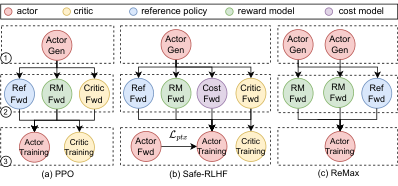

> 图解：这张图展示了 PPO、Safe-RLHF、ReMax 的数据流差异。核心不是“节点数量”，而是“节点依赖关系”不同：比如 ReMax 去掉 Critic，但增加额外生成路径；Safe-RLHF 增加 cost 分支。系统如果把通信和计算逻辑写死，就很难快速适配这些变体。

## 2. 现有方案的两难：灵活性 vs 执行效率

论文把范式冲突讲得很清楚：

- **单控制器（single-controller）** ：全局视角强、编排灵活，但大规模分布式下控制分发开销大
- **多控制器（multi-controller）** ：每卡本地控制，算子下发高效，但跨模型依赖耦合严重，代码容易“缠绕”

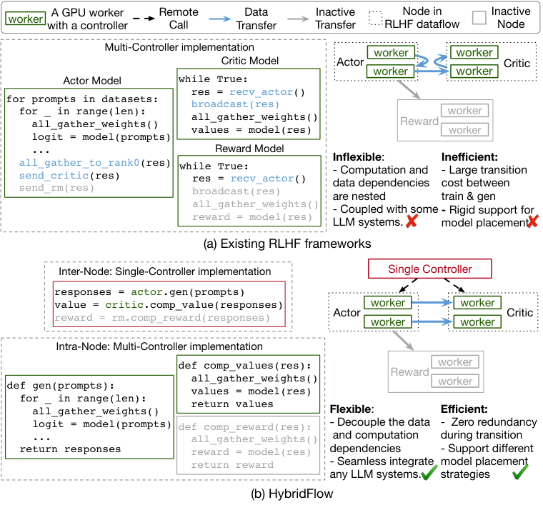

> 图解：左图是现有多控制器实现，模型间 send/recv、collective、计算逻辑互相嵌套；右图是 HybridFlow，把“模型内部并行计算”与“模型间数据重分片”拆开。灰色节点代表当前阶段未执行操作，体现了流程可编排性。

作者进一步指出旧系统的典型瓶颈：

- DeepSpeed-Chat：训练/生成并行策略切换引发重分片开销
- OpenRLHF：训练和生成两份 Actor 权重，带来内存冗余与同步成本
- NeMo-Aligner：训练和生成使用同一 3D 并行配置，导致生成阶段利用率较差

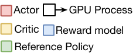

> 图解：表格对比强调了 HybridFlow 的差异点：并行策略支持更全（3D/ZeRO/FSDP 混合）、模型放置更自由、执行模式可变，而不是绑定某一种固定拓扑。

## 3. HybridFlow 总体架构：三层能力闭环

HybridFlow 的架构由三部分组成：

1. **Hybrid Programming Model** ：负责编程抽象和执行编排
2. **3D-HybridEngine** ：专门优化 Actor 训练-生成切换
3. **Auto-Mapping Algorithm** ：自动搜索最优 GPU 分配和模型放置

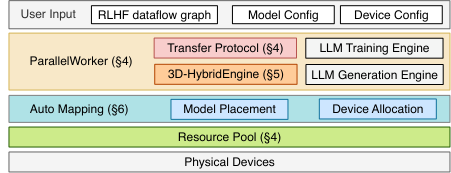

> 图解：架构图从上到下是“用户输入配置 → 控制器编排 → 模型并行执行”。单控制器掌握全局数据流和调度，模型内部继续用多控制器高效执行分布式训练/推理/生成。

### 3.1 关键思想：层次化混合编程模型

- **跨节点（模型与模型之间）** ：单控制器统一编排依赖、时序、数据重分片
- **节点内（单模型分布式执行）** ：多控制器沿用 Megatron、DeepSpeed、FSDP、vLLM 等成熟栈

这本质上是在系统边界上做“解耦”：

- 算法开发者只写 RLHF 数据流逻辑
- 分布式细节封装在模型 Worker 与 Transfer Protocol 内
- 换算法时只需改少量代码，不必重写整套分布式控制流程

## 4. API 设计：把 RLHF 写成“可拼接原语”

论文提供了两类关键抽象：

### 4.1 模型原语 API（Primitive APIs）

例如：

- Actor：`generate_sequence`、`update_actor`、`compute_log_prob`
- Critic：`compute_values`、`update_critic`
- Reference：`compute_ref_log_prob`
- Reward：`compute_reward`
- 公共数值计算：`compute_advantage`

这些 API 的价值是： **把“算法逻辑”和“并行执行实现”分离** 。

### 4.2 传输协议（Transfer Protocols）

通过 collect/distribute 组合实现多对多数据重分片，内置 `3D_PROTO`、`DP_PROTO`、`ONE_TO_ALL` 等协议，覆盖常见场景。

这部分在附录给得很工程化：用户也可自定义协议函数，扩展新数据流。

## 5. 3D-HybridEngine：论文最核心的性能点

Actor 在 RLHF 中既要训练又要生成，但两者最优并行配置通常不同。HybridFlow 的核心优化是：

- 在同一批 GPU 上顺序执行训练与生成（避免双份模型）
- 允许训练与生成使用不同 3D 并行组
- 用新分组方式降低重分片通信和峰值显存

### 5.1 并行组关系

设训练并行为 $p$-$t$-$d$，生成并行为 $p_g$-$t_g$-$d_g$-$d$，有：

$$
N_a = ptd = p_g t_g d_g d
$$

$$
d_g = \frac{pt}{p_g t_g}
$$

其中 $d_g$ 是生成阶段相对训练阶段的微型数据并行扩张比例。

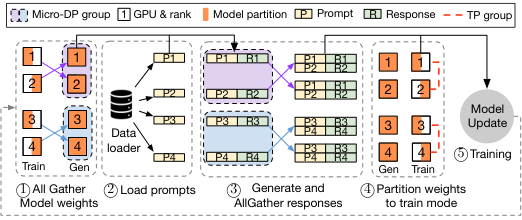

> 图解：图中 ①②③④⑤ 对应一轮中的参数聚合、prompt 分发、生成结果聚合、参数重分片、训练更新。关键在于训练→生成和生成→训练的切换被做成“组内高效通信”，而不是全局粗粒度 all-gather。

### 5.2 零冗余重分片（Zero Redundancy）

作者对比了三种方案（DS-Chat、HybridFlow-V、HybridFlow）在切换阶段的开销，给出通信量与内存峰值分析。记 Actor 参数规模为 $M$：

- DS-Chat 通信量：$\frac{tpd-1}{tpd}M$
- HybridFlow-V 通信量：$\frac{tp-1}{tp}M$
- HybridFlow 通信量：$\frac{tp-t_g p_g}{t_g p_g tp}M$

峰值参数显存：

- DS-Chat：$M$
- HybridFlow-V：$M$
- HybridFlow：$\frac{1}{t_g p_g}M$

冗余显存：

- DS-Chat：$\frac{1}{tpd}M$
- HybridFlow-V：$\frac{1}{tp}M$
- HybridFlow：$0$

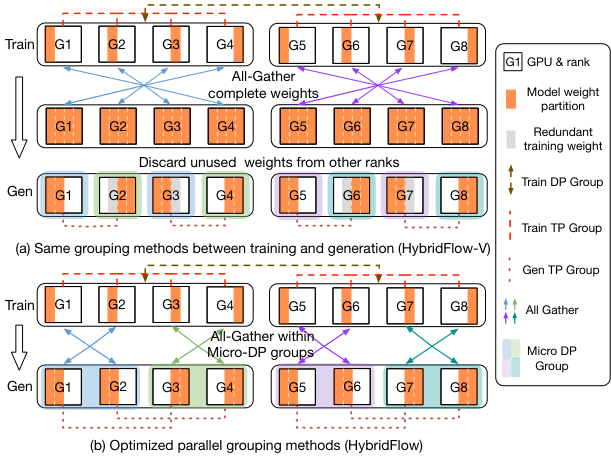

> 图解：上图对比“常规分组”与“新分组”的参数块重叠关系。HybridFlow 通过重新组织生成阶段 TP/PP/micro-DP 分组，让每个 GPU 上训练权重与生成权重尽可能重叠，从而消除额外副本。

## 6. Auto-Mapping：把“放哪、怎么并”变成可搜索问题

论文把设备映射拆成两个维度联合优化：

- 模型放置（哪些模型共置，哪些分置）
- 每个模型在每阶段的并行策略（PP/TP/DP）

目标是最小化单轮 RLHF 端到端时延。

### 6.1 代价模型直觉

- 同一 colocated set 内，同阶段模型串行，时延相加
- 不同 set 可并行，同阶段取最大时延
- 各阶段时延再求和，得到总时延

### 6.2 算法性质

- 枚举 placement（PPO 四模型对应 15 种划分）
- 在给定分配下运行 `auto_parallel` + `simu`，估计最优并行配置
- 选取总代价最低的映射
- 通过缓存并行搜索结果降低重复计算

复杂度上界写为：

$$
O\left(\frac{(N-1)!}{(k-1)!(N-k)!}\right)
$$

其中 $N$ 是 GPU 数，$k$ 是模型数。实际通过缓存和解析模型仿真，运行时间可控在训练前离线阶段。

## 7. 实验结果：不仅快，而且“在各种设定下都快”

### 7.1 端到端吞吐（PPO / ReMax / Safe-RLHF）

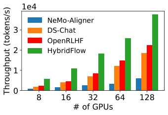

> 图解：7B PPO 结果显示 HybridFlow 在不同 GPU 规模下均领先。横轴是 GPU 规模，纵轴是吞吐（tokens/sec）。随着规模扩大，优势通常继续保持。

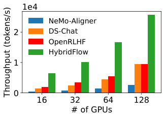

> 图解：13B 下优势进一步扩大，说明模型越大、通信与并行越复杂时，系统层优化收益越明显。

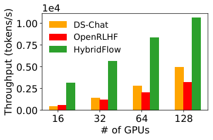

> 图解：在 ReMax 这种数据流变体上依然有稳定收益，说明提升不依赖单一算法结构，而是来自通用执行框架能力。

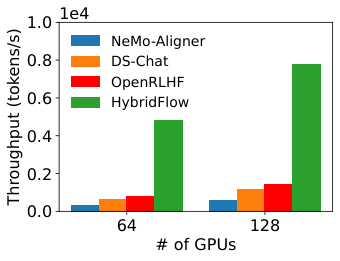

> 图解：Safe-RLHF 引入额外 cost 分支后，HybridFlow 仍显著领先，证明其跨模型依赖编排和放置优化具有普适性。

论文汇总结论：

- 总体加速范围： **1.53× ～ 20.57×**
- 大模型（如 70B）收益更高
- 在 128 GPU 这类强扩展场景仍保持显著优势

### 7.2 切换开销与生成并行配置

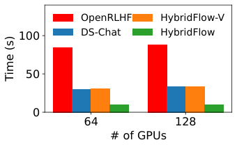

> 图解：训练-生成切换时间在 70B 场景下降幅尤其明显。HybridFlow 把原本很重的权重重分片阶段压缩到更低比例，避免“切换吃掉一轮训练时间”。

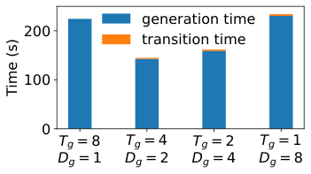

> 图解：生成 TP 不是越大越好。图中展示不同 $t_g$ 对“切换时间 + 生成时间”的联合影响，存在最优点。用训练同款 TP（如 NeMo 做法）会导致生成阶段利用率不佳。

### 7.3 放置策略不是固定答案，而是“随规模变化”

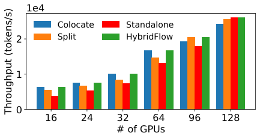

> 图解：13B 场景下，最优放置会随 GPU 数变化：小规模时全共置更好，大规模时分置更好。原因是通信占比与并行重叠收益在不同规模下的权衡发生变化。

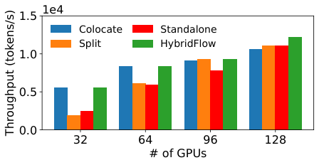

> 图解：当 Critic/Reward 比 Actor 更大（13B vs 70B）时，最优放置进一步偏向“异构负载感知”的分配，而不是平均切分。

### 7.4 自动映射算法运行时间

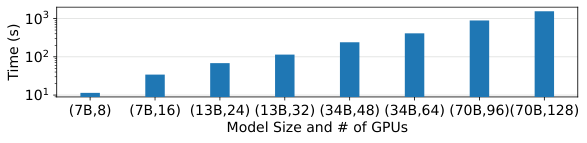

> 图解：自动映射的预处理时间随模型与集群规模近线性增长，远小于 RLHF 训练总时长，工程上可接受。

## 8. 论文给出的三条放置经验（可直接落地）

作者在讨论部分提炼了三条经验，具有很强的工程实用性：

1. 给 Actor 更多 GPU，优先优化不可并行化的生成阶段
2. 小集群下若各模型都能吃满卡，共置往往最优
3. 大集群强扩展时，把 Actor 和 Critic 分置并行执行更容易获得高吞吐

## 9. 技术点评：HybridFlow 的真正价值在哪

从系统研究视角看，这篇工作的贡献不止是“快了几倍”，而是做了三件可长期复用的事：

- **抽象层面** ：把 RLHF 从“脚本工程”抬升到“数据流编排工程”
- **执行层面** ：针对 Actor 训练/生成切换这一核心瓶颈给出结构性优化
- **优化层面** ：把 placement + parallelism 联合搜索流程化、自动化

也就是说，它把 RLHF 系统优化从“经验调参”推进到“可表达、可推理、可迁移”的工程范式。

## 10. 总结

HybridFlow 的核心主张可以概括为一句话： **在跨模型层面要中心化编排，在模型内部要去中心化高效执行** 。这个“混合控制”设计看起来简单，但它恰好命中了 RLHF 系统里最难同时满足的两个目标： **灵活性** 与 **吞吐效率** 。

如果你在做大规模 RLHF 基础设施，这篇论文最值得吸收的不是某个具体 API，而是它背后的系统分层思想：先把数据流和并行计算解耦，再用自动映射把“模型放置 + 并行策略”联动优化，最后在瓶颈阶段（Actor 切换）做定向通信与显存优化。

> 本文参考自 [HybridFlow: A Flexible and Efficient RLHF Framework](https://arxiv.org/abs/2409.19256v2)