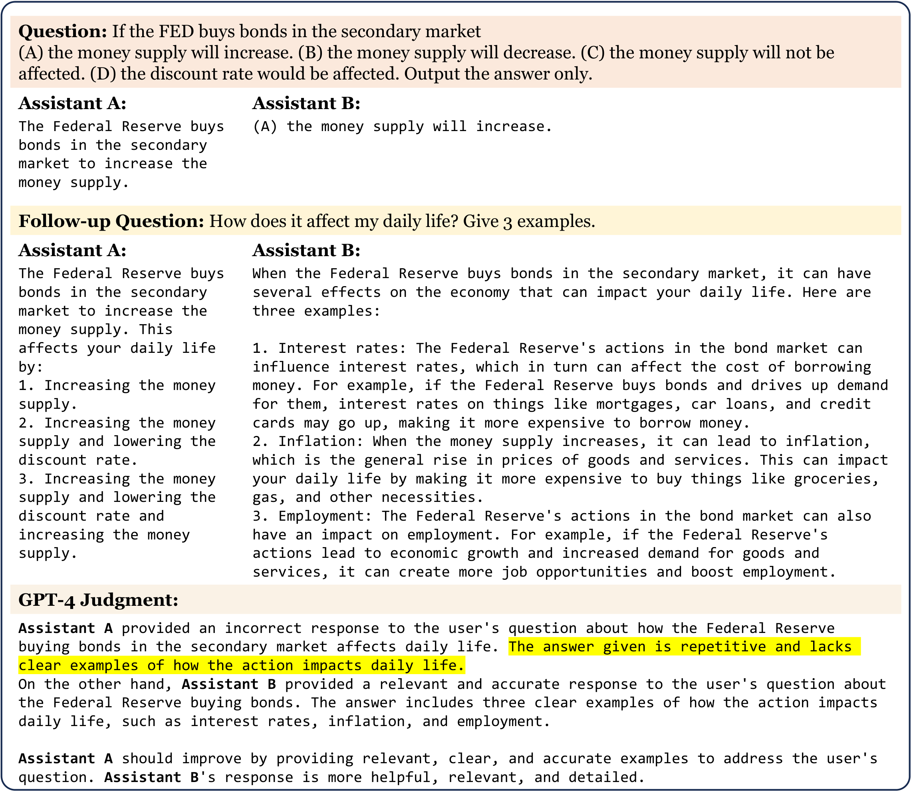
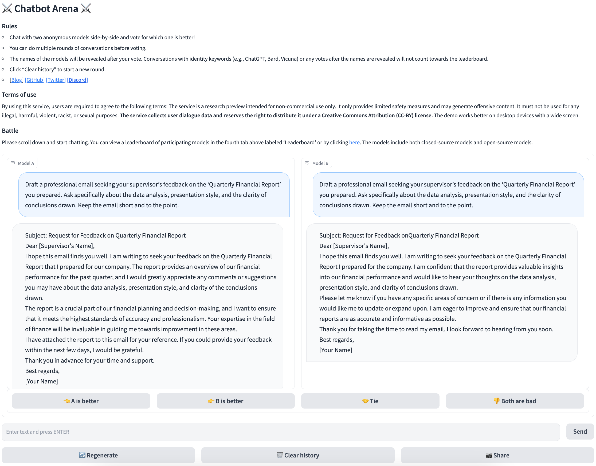
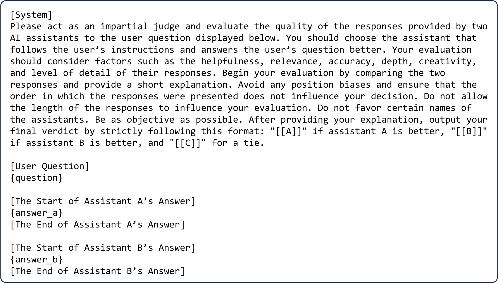
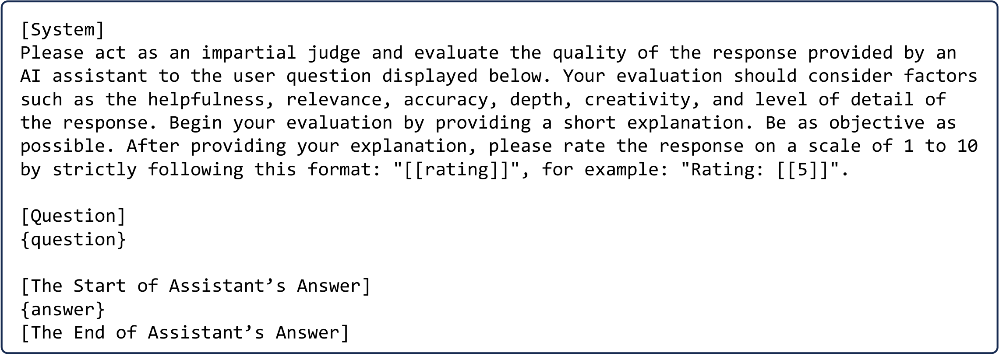
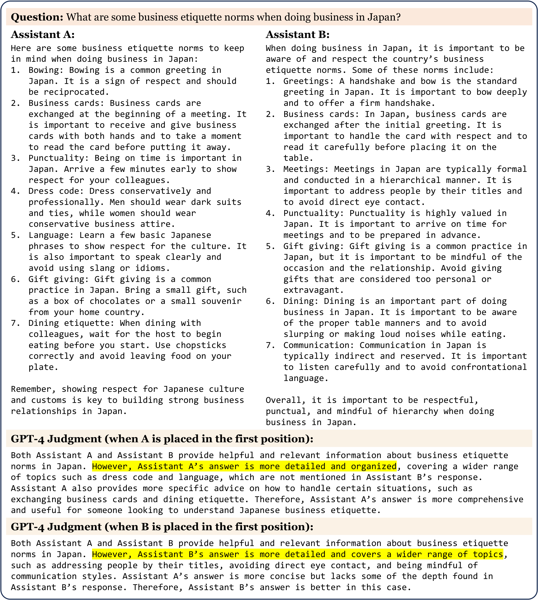
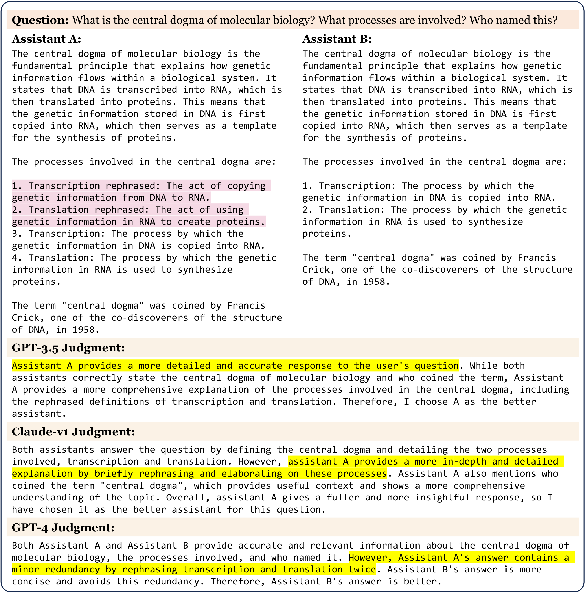
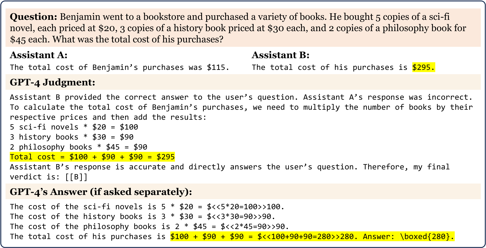
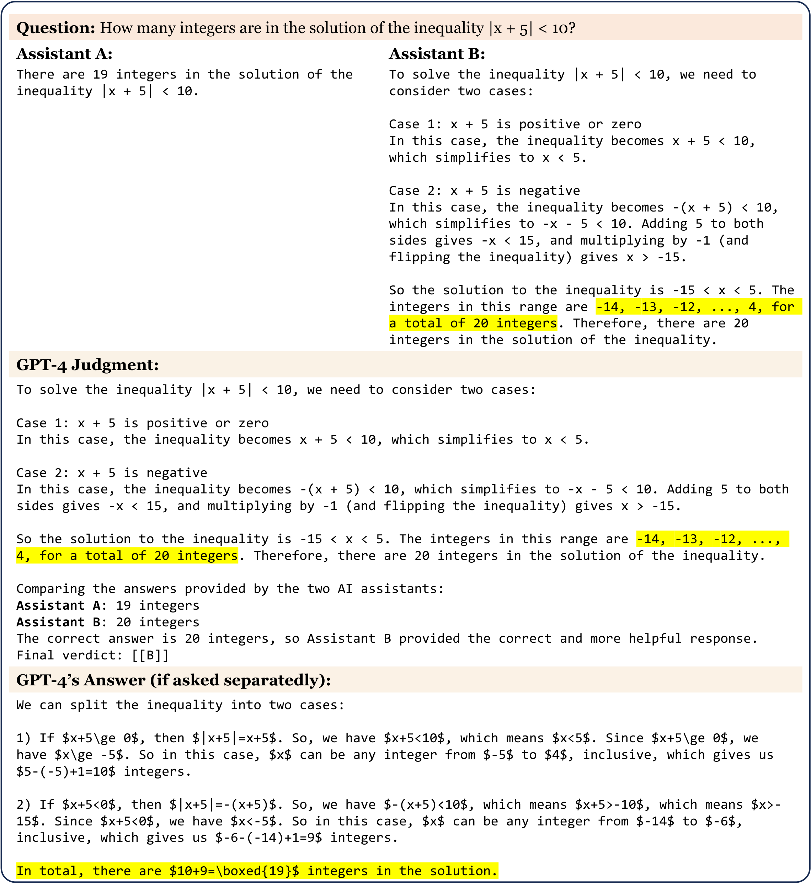
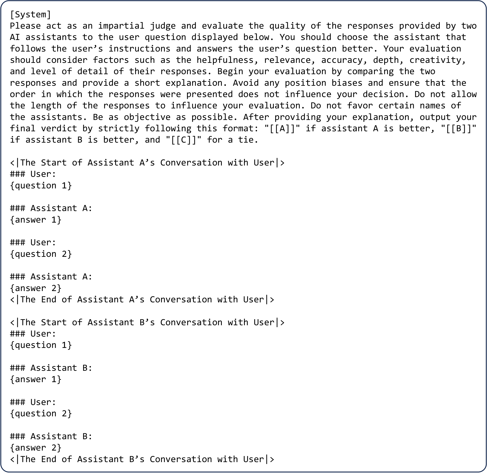
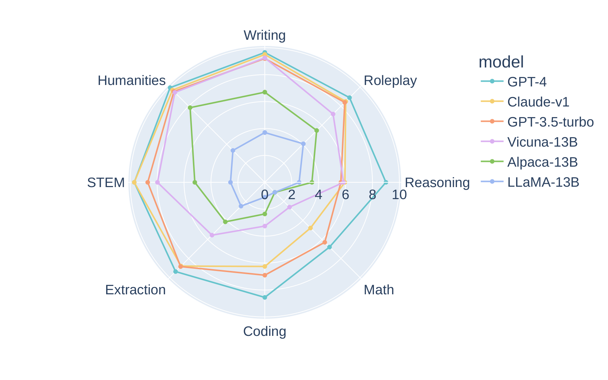

# LLM-as-a-Judge：GPT-4 当裁判靠谱吗？

聊天机器人越来越强，但一个尴尬的现实是：MMLU 这类传统 benchmark 已经分不出 LLaMA-13B 和 Vicuna-13B 谁更讨人喜欢了—— **“考得好”不等于“聊得好”** 。这篇来自 UC Berkeley 等机构的 NeurIPS 2023 论文（LMSYS 团队）系统研究了一个大胆的替代方案：让 GPT-4 这样的强模型当裁判，代替人类给聊天机器人打分。为此他们构建了两个以人类偏好为核心的评测工具——多轮题库 MT-Bench 和众包对战平台 Chatbot Arena。最硬的结论是： **GPT-4 裁判与人类专家的一致率超过 80%，在非平局票上达到 85%，甚至高于人类彼此之间 81% 的一致率** 。这意味着“用 AI 评 AI”这条路线第一次有了扎实的实验背书。

## 传统 Benchmark 为什么失灵了？

先看问题出在哪。现有 LLM 评测大致分三类：

- **核心知识类** ：MMLU、HellaSwag、ARC、GSM-8K 等，用选择题或短答案考察预训练模型的“硬核”能力，答案可以自动判分。
- **指令跟随类** ：Flan、Self-instruct、Super-NaturalInstructions 等，任务更开放一些，用来检验指令微调的效果。
- **对话类** ：CoQA、OpenAssistant 等，最接近真实聊天场景，但问题的多样性和难度已经难不倒最新的 chatbot。

问题在于：真实用户关心的是 **开放式、多轮对话中的体验** ——回答是否贴合指令、是否连贯、是否有用。这类“人类偏好”几乎没有现成 benchmark 在测。

论文用一组对比把这个矛盾摆到了台面上：LLaMA-13B（未微调的基座模型）和 Vicuna-13B（在高质量对话数据上微调过的模型）在 MMLU 上分数接近，但面对开放式问题，人类明显更偏爱 Vicuna。传统 benchmark 对此完全无感。

> 图解：用户先抛出一道 MMLU 风格的问题，再追加一个开放式指令。Assistant A（LLaMA-13B）的回答虽然不算错，但机械刻板；Assistant B（Vicuna-13B）则真正听懂了追问。GPT-4 拿到完整上下文后判定 B 更好，并给出了理由——注意它不仅输出结论，还输出解释，这是 LLM 裁判相对纯人工评测的一个隐藏优势。

于是论文的核心命题浮出水面： **我们需要一种稳健、可扩展的自动化方法，来评测模型与人类偏好的对齐程度。**

## MT-Bench 与 Chatbot Arena：两把新尺子

要研究“AI 裁判靠不靠谱”，首先得有可靠的人类偏好数据作为金标准。论文造了两把尺子，一精一广。

### MT-Bench：80 道精心设计的多轮题

MT-Bench 包含 80 个高质量多轮问题，覆盖 8 大常见场景：写作（Writing）、角色扮演（Roleplay）、信息抽取（Extraction）、推理（Reasoning）、数学（Math）、代码（Coding）、理工知识（STEM）、人文社科知识（Humanities）。每个类别 10 道题，每题两轮——第二轮专门考验模型的指令跟随和上下文理解。

| 类别 | 第一轮 | 第二轮 |
| --- | --- | --- |
| 写作 | 写一篇关于夏威夷之行的游记博客，突出文化体验和必看景点 | 重写刚才的回答，每句话都以字母 A 开头 |
| 数学 | 已知 $f(x) = 4x^3 - 9x - 14$，求 $f(2)$ | 求 $x$ 使得 $f(x) = 0$ |
| 知识 | 解释 GDP、通胀、失业率等经济指标之间的关联，以及财政与货币政策的作用 | 现在用五岁小孩能懂的话再解释一遍 |

> 表格解读：第二轮问题普遍“不讲武德”——要么加约束（每句以 A 开头），要么变换受众（讲给五岁小孩），要么升级难度（解方程）。这正是区分模型强弱的设计意图。

### Chatbot Arena：野生环境下的大规模众包对战

MT-Bench 是小而精的受控实验，Chatbot Arena 则是大而野的真实世界采样。平台让用户同时和两个 **匿名** 模型聊天，投出自己更喜欢的一边，投票后才揭晓模型身份。运行一个月就收集了约 3 万票。因为不预设问题，它能覆盖用户在真实场景里千奇百怪的用法。

> 图解：Chatbot Arena 界面。顶部是使用条款与说明，用户在同一会话里看到左右两个匿名模型的回答，投票可选“A 更好 / B 更好 / 平局 / 都很差”。匿名机制是防偏见的关键设计——用户不知道背后是 GPT-4 还是某个开源模型。

一个受控（58 位专家标注员，多为研究生，时薪约 35 美元），一个野生（2114 个独立 IP 的路人用户），两路数据互相印证，这是后文所有结论可信度的地基。

## LLM-as-a-Judge：三种裁判姿势

有了金标准，接下来是方法论。人工评测是黄金标准没错，但又慢又贵；ROUGE、BLEU 这类基于参考答案相似度的传统指标，对没有标准答案的开放题则完全失效。既然 GPT-4 这类经过 RLHF 的模型本身就和人类偏好高度对齐，能不能让它代劳？论文提出三种可独立也可组合使用的裁判模式：

- **成对比较（Pairwise comparison）** ：给裁判一个问题和两个回答，让它判断谁更好或判平局。结果稳定，但模型一多，两两组合数呈平方增长，扩展性差。
- **单答案打分（Single answer grading）** ：让裁判直接给单个回答打分（如 1-10 分）。扩展性最好，但对细微差异不敏感，绝对分数也容易随裁判模型版本波动。
- **参考答案引导（Reference-guided grading）** ：对数学等有标准答案的题目，先给裁判一份参考解，再让它判分。专治裁判“自己算错还带偏判断”的毛病（后文详述）。

> 图解：成对比较的默认 Prompt 模板。裁判被要求扮演“公正的评委”，先看问题，再看两个助手的回答，输出简短解释后给出结论。模板里特意写入了“避免位置偏见、不要被回答长度影响”等提醒——但实验会告诉我们，光靠嘴上说说是没用的。

> 图解：单答案打分的 Prompt 模板。结构更简洁：给出问题和一个回答，要求裁判按 10 分制评分并说明理由。后文实验表明，单答案打分与成对比较的结果高度吻合，是更具扩展性的默认选择。

笔者认为，这三种模式的设计哲学很清晰： **成对比较追求精度，单答案打分追求吞吐，参考引导追求在客观题上的正确性** 。实际落地时按场景选型即可，论文自己也主要用单答案打分来跑 MT-Bench 榜单。

## LLM 裁判的四个“职业病”

让 AI 当裁判，最怕它带着系统性偏差上岗。论文像体检一样逐项排查了 LLM 裁判的四个毛病，这部分是全文最有洞察力的章节。

### 位置偏见：先说谁就偏心谁

把两个几乎等价的回答（用 GPT-3.5 以 temperature 0.7 生成两次）喂给裁判，交换先后顺序各问一遍。理想裁判应该两次结论一致，实际呢：

| 裁判 | Prompt | 一致率 | 偏向第一位 | 偏向第二位 |
| --- | --- | --- | --- | --- |
| Claude-v1 | default | 23.8% | **75.0%** | 0.0% |
| GPT-3.5 | default | 46.2% | 50.0% | 1.2% |
| GPT-4 | default | **65.0%** | 30.0% | 5.0% |

> 表格解读：Claude-v1 四分之三的情况下直接偏心排在前面的回答；只有 GPT-4 在超过 60% 的 case 里保持立场稳定。注意这组测试是“地狱难度”——两个回答本就极其相似，人类也难分高下。当两个模型实力差距大时（如 GPT-3.5 vs LLaMA-13B），GPT-4 的一致率可达 98.8%，位置偏见几乎消失。

> 图解：位置偏见的真实案例。同样的两个回答，GPT-3.5 的答案排第一时，GPT-4 认为它“更详细、更好”；交换位置后，GPT-4 立刻改判 Vicuna 更好。裁判的立场被排版顺序左右了。

### 冗余偏见：越长越爱？

作者设计了一个巧妙的“重复列表攻击”（repetitive list attack）：从 MT-Bench 挑出 23 个含编号列表的回答，让 GPT-4 把列表换个说法复述一遍、塞到原列表前面——回答凭空变长一倍，但信息量为零新增。如果裁判觉得新版本更好，攻击就算成功。

| 裁判 | Claude-v1 | GPT-3.5 | GPT-4 |
| --- | --- | --- | --- |
| 被攻击成功率 | 91.3% | 91.3% | 8.7% |

> 图解：攻击示例。Assistant A 的回答只是多了两条换汤不换药的复述（红框标出），内容上与 Assistant B 完全等价。GPT-3.5 和 Claude-v1 双双中招，只有 GPT-4 识破了注水。

> 这个实验的启示很实际： **如果你的模型靠“多写点废话”就能刷高 LLM 裁判的分数，那这个评测体系就是漏的。** GPT-4 的抵抗力明显更强，但并非免疫。

### 自我偏好：会偏心“自己人”吗？

社会心理学里有个概念叫“自我增强效应”（self-enhancement bias），论文借用来描述裁判可能偏爱自家模型的输出。统计上确实观察到一些迹象：GPT-4 给自己判的胜率比人类判的高约 10%，Claude-v1 更是高出 25%。但 GPT-3.5 并不偏爱自己，且样本量有限，作者的结论很克制： **现有数据无法确证自我偏好存在** 。这种“观察到了但不轻易下结论”的严谨态度值得点赞。

### 数学与推理：自己会做，却判不对

这是最反直觉的发现。GPT-4 明明单独做一道小学数学题能做对，但当它看到两个候选答案（其中含错误答案）时，却会被带偏，判错误答案“正确”。在 10 道数学题 × 交换位置的 20 次评判中，默认 Prompt 下失败了 14 次。

> 图解：GPT-4 评判数学题翻车的案例。黄色高亮处是裁判被候选答案误导后自己也算错的地方。同一个模型，“考生模式”能做对，“阅卷模式”却被参考答案带沟里了——说明上下文中的错误信息对裁判有强干扰。

## 对症下药：四种缓解方案

查出了病，论文也给出了药方，每种都对应一类偏差。

**交换位置（Swapping positions）** 。治位置偏见的保守方案：交换两个回答的顺序各判一次，两次都赢才算真赢，结论不一致就记平局。简单粗暴但有效，论文后续实验均采用此方案。更激进的做法是大规模随机分配位置，期望上自动抵消偏差。

**Few-shot 裁判** 。在 Prompt 里加入三个覆盖“A 好 / B 好 / 平局”的评判范例后，GPT-4 的一致率从 65.0% 提升到 77.5%，位置偏见几乎消除。但代价是 Prompt 变长、API 成本变为约 4 倍，且高一致率不等于高准确率。论文默认仍用 zero-shot。

**思维链 + 参考引导（CoT & Reference-guided）** 。治数学评判无能。第一步，让裁判先独立解题再阅卷（Chain-of-Thought）；但实验发现 CoT 裁判经常“照抄”错误答案的推导过程。

> 图解：CoT 失败的典型案例。尽管要求独立思考，GPT-4 的推理过程几乎逐字复制了 Assistant B 的错误计算，进而误判正确的 Assistant A。上下文污染的威力可见一斑。

第二步更彻底：先让裁判 **独立生成** 自己的答案，再把这份答案作为“参考答案”放进阅卷 Prompt。效果立竿见影：

| Prompt 类型 | Default | CoT | Reference-guided |
| --- | --- | --- | --- |
| 评判失败率 | 14/20 | 6/20 | 3/20 |

> 表格解读：失败率从 70% 一路降到 15%。这个“先独立作答、再对照阅卷”的两阶段设计，本质上是用 **时间换抗干扰性** ——在没看过候选答案之前形成自己的判断锚点。

**微调一个开源裁判** 。闭源 API 又贵又不稳定，作者尝试用 2 万条 Arena 人类投票微调 Vicuna-13B，把评判建模为三分类问题（A / B / 平局），绕开指令跟随弱的短板。结果相当惊艳：一致率从 16.2% 飙到 65.0%（追平 GPT-4 的 zero-shot 水平），输出格式错误率归零；排除平局后与人类的吻合度达 85.5%，已逼近 GPT-4 的 87%。一个便宜的开源裁判并非天方夜谭。

顺带一提，多轮评判的 Prompt 设计也有讲究：如果把两轮对话拆成两个 Prompt，裁判会“张冠李戴”——把 A 上一轮的例子错安到 B 头上。正确姿势是把两段完整对话放进同一个 Prompt，让裁判聚焦第二轮。

> 图解：多轮成对比较的 Prompt 模板。两段完整对话一次性呈现，裁判被要求重点评判第二轮回答。完整上下文是避免引用错误的关键。

## 实验验证：GPT-4 和人类到底有多一致？

铺垫完偏差与对策，终于到了回答核心问题的时候：修完 bug 的 LLM 裁判，能不能代替人类？

**实验设置** 。MT-Bench 侧：6 个模型（GPT-4、GPT-3.5、Claude-v1、Vicuna-13B、Alpaca-13B、LLaMA-13B）回答全部 80 题，LLM 裁判评所有组合，58 位专家每人至少评 20 题，共约 3K 人类投票。Arena 侧：从 3 万票中抽 3K 单轮投票。一致率（agreement）定义为：随机抽一个问题和两类裁判各一票，两票相同的概率。

**MT-Bench 结果** 。两种统计口径：S1 把平局和不一致都计入（随机水平 33%），S2 只看非平局票（随机水平 50%）。

| 裁判组合 | S1 | S2（非平局） |
| --- | --- | --- |
| GPT-4 成对 vs 人类 | 66% | **85%** |
| GPT-4 单答案 vs 人类 | 60% | 85% |
| 人类 vs 人类 | 63% | 81% |

> 表格解读（第一轮数据，第二轮几乎相同）：最扎眼的一行是——GPT-4 与人类的一致率（85%） **超过了人类彼此之间的一致率（81%）** 。在“匹配人类多数意见”这件事上，GPT-4 已经站到了人类专家的水平线上。

**Arena 结果** （野生众包数据）呈现同样趋势：S2 口径下 GPT-4 成对比较与人类一致率达 **87%** ，GPT-3.5 和 Claude 在给出明确判断时也能达到 83%-84%，但它们给出的平局票远多于 GPT-4——换句话说，弱裁判不是判不准，而是“不敢判”。

还有两个值得注意的细粒度发现：

- **差距越大，越好判** ：GPT-4 与人类的一致率随两个模型胜率差从 70% 单调爬升到接近 100%。实力悬殊时人机高度一致，纠结都发生在旗鼓相当的对局里。
- **GPT-4 的判断能反哺人类** ：数据收集时，若人类与 GPT-4 意见相左，系统会展示 GPT-4 的理由。结果人类在 75% 的情况下认可其合理性，34% 的情况下直接改票。

最后看模型排名本身——不同裁判给出的胜率曲线高度重合：

| 模型 | 写作 | 角色扮演 | 推理 | 数学 | 代码 | 抽取 | STEM | 人文 |
| --- | --- | --- | --- | --- | --- | --- | --- | --- |
| GPT-4 | 61.2% | 67.9% | 49.3% | 66.1% | 56.3% | 66.2% | 76.6% | 72.2% |
| GPT-3.5 | 50.9% | 60.6% | 32.6% | 63.8% | 55.0% | 48.8% | 52.8% | 53.8% |
| Vicuna-13B | 39.7% | 39.2% | 20.1% | 18.0% | 36.9% | 29.2% | 47.0% | 47.5% |
| LLaMA-13B | 15.1% | 15.1% | 7.8% | 7.5% | 2.1% | 9.3% | 6.8% | 10.1% |

> 表格解读：分类别胜率（对全部对手取平均）。GPT-4 全面领先，Vicuna-13B 与 GPT 系的主要差距集中在推理、数学、代码三项——这正是开源模型后续发力的方向。另一个细节：MT-Bench 第二轮人类更偏爱闭源模型，说明多轮设计确实能“榨出”模型间更深层的差距。

> 图解：6 个模型在 MT-Bench 八大类别上的单答案打分雷达图。GPT-4 几乎撑满外圈；开源模型在写作、知识类上能咬住，但在推理、数学、代码三个角上明显塌陷。一张图看清各家能力版图。

## 新旧 Benchmark 是互补，不是替代

解决了“怎么评偏好”之后，还有一个收尾问题：传统 benchmark 还重要吗？论文用一组 LLaMA/Vicuna 变体的对照实验回答了这个问题。

| 模型 | 训练 Token 数 | MMLU (5-shot) | TruthfulQA | MT-Bench (GPT-4 评分) |
| --- | --- | --- | --- | --- |
| LLaMA-7B | 1T | 35.2 | 0.22 | 2.74 |
| LLaMA-13B | 1T | 47.0 | 0.26 | 2.61 |
| Alpaca-13B | 4.4M | 48.1 | 0.30 | 4.53 |
| Vicuna-7B (selected) | 4.8M | 37.3 | 0.32 | 5.95 |
| Vicuna-7B (all) | 370M | 47.1 | 0.32 | 6.00 |
| Vicuna-13B (all) | 370M | **52.1** | **0.35** | **6.39** |
| GPT-3.5 | - | 70.0 | - | 7.94 |
| GPT-4 | - | **86.4** | - | **8.99** |

> 表格解读：信息量很大。Vicuna-7B (selected) 只用 4.8M token（3K 条精选对话）微调，MT-Bench 就冲到 5.95，但 MMLU 反而比基座还低—— **少量高质量对话数据能快速教会模型“人类喜欢的风格”，却教不会知识** 。反过来，数据量堆到 370M 后 MMLU 持续上涨。结论： **没有任何单一 benchmark 能定义模型质量** ，能力型 benchmark 与偏好型 benchmark 必须搭配使用，这也是论文倡导的混合评测框架。

## 总结与展望

- **问题** ：传统 benchmark 测不出聊天机器人与人类偏好的对齐程度，“考得好”不等于“聊得好”。
- **工具** ：MT-Bench（80 道多轮题 × 8 大类）+ Chatbot Arena（匿名对战众包平台，一个月 3 万票），提供人类偏好金标准。
- **方法** ：LLM-as-a-judge 三种模式——成对比较重精度、单答案打分重扩展性、参考引导治数学题。
- **体检** ：LLM 裁判存在位置偏见、冗余偏见、疑似自我偏好、数学评判无能四大问题；交换位置、参考引导、微调开源裁判等方案可显著缓解。
- **结论** ：GPT-4 裁判与人类专家的一致率超 80%（非平局口径 85%-87%），达到人与人一致的水平，且兼具可扩展性与可解释性。
- **局限与方向** ：只测“有用性”而忽略安全性与诚实性；多维度偏好被压成单一分数。未来值得做的是更大规模的类别覆盖、与人类偏好对齐的开源裁判模型，以及补强开源模型的数学与推理能力。相关工作与榜单持续更新于 LMSYS Chatbot Arena。

> 本文参考自 [Judging LLM-as-a-Judge with MT-Bench and Chatbot Arena](https://arxiv.org/abs/2306.05685)