# KernelEvolve：在异构 AI 加速器上规模化自动生成与优化 Kernel 的实践解读

## 一句话先把结论说清楚
这篇论文讲的不是“又一个写 Kernel 的工具”，而是 **一个可持续运行的生产级 Agent 系统** ：用图搜索 + 检索增强 + 自动评测，把「成千上万个算子 × 多代 GPU/ASIC」的组合空间，压缩成可在几小时内完成的自动优化流程，并在 Meta 的生产广告推荐系统里跑出 1.25–17× 的加速。

---

## 1. 为什么 Kernel 优化变成系统级硬需求
广告推荐模型的现实是： **超低延迟 + 超多模型 + 超多硬件** 。三个维度叠加后，手工调优已经不可扩展。

- **模型多样性** ：召回、粗排、精排三个阶段的模型结构完全不同，复杂度跨度从 0.01 GFLOPS 到 80 GFLOPS。
- **算子多样性** ：推荐系统里大量非 GEMM 的预处理算子（bucketize、hash、jagged tensor），缺一个就会迫使系统拆成多层部署。
- **硬件多样性** ：NVIDIA/AMD/MTIA 之间架构差异巨大，内存层级、编程模型、执行模型都不兼容。

这三维组合导致 **O(operators × platforms)** 的实现矩阵爆炸，这就是 KernelEvolve 想解决的问题。

---

## 2. 异构硬件的“不可移植”现实

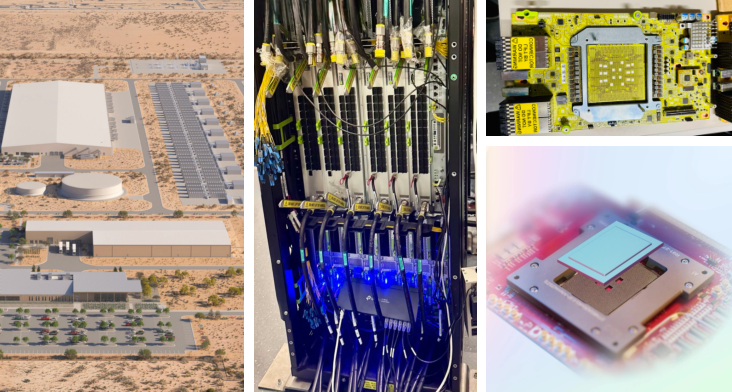
> 图解：MTIA 作为定制 AI 芯片，从数据中心部署、机柜集成到芯片电路细节的多视角展示，强调了其与通用 GPU 的体系结构差异。

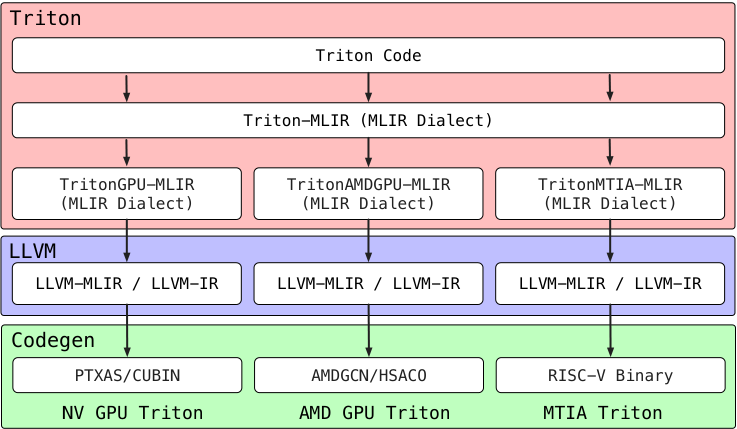
> 图解：Triton 通过多级 MLIR 降级，分别生成 NVIDIA / AMD / MTIA 的目标代码，但最终仍需硬件专属优化策略。

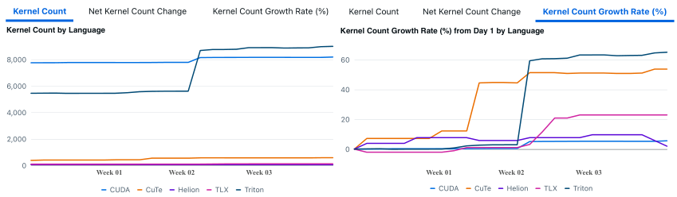
> 图解：Meta 内部 Triton 内核数量持续增长并超过 CUDA，意味着新硬件支持必须跨 DSL 生态实现，碎片化成为必然。

核心痛点： **同一个算子在不同硬件上不是“改语法”，而是“重写算法”。**

---

## 3. KernelEvolve 的整体思路：把优化当成图搜索

KernelEvolve 把 Kernel 优化建模为图搜索：

- 节点：一个 kernel 实现
- 边：一次变换（修复、加速、重构）
- 评分：速度提升（不正确直接判 0）

核心公式：

$$
\mathcal{F}(v) = \frac{t_{\text{pytorch}}}{t_{\text{triton}}}
$$

如果出错或精度不对，则 $\mathcal{F}(v) = 0$。

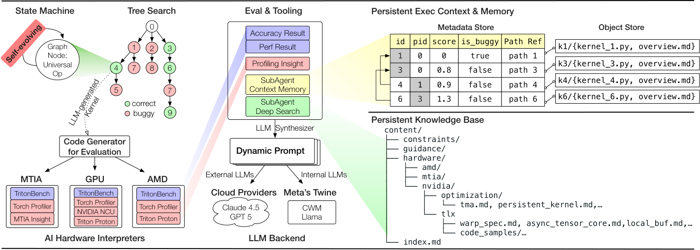
> 图解：系统由状态机驱动搜索流程，包含性能评测、正确性验证、硬件解释器和知识库检索。

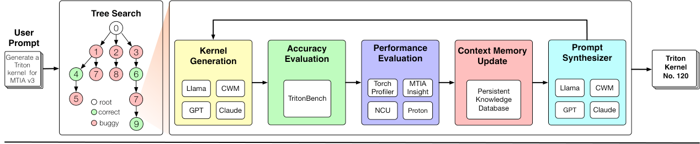
> 图解：从动态提示生成、候选 kernel 产生、自动评测、回写知识库形成闭环。

---

## 4. “单一通用算子”是关键创新
传统做法是分成 Debug / Improve / Refactor 等固定 prompt。KernelEvolve 反其道而行，采用 **单一通用算子** ：

- Prompt 在运行时生成
- 动态注入 profiling / 错误日志 / 硬件知识
- 每一步都能同时兼顾 correctness 与 performance

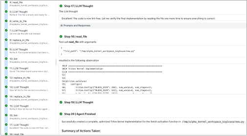
> 图解：模型像工程师一样“读-改-测”，20 步内完成 kernel 的增量优化闭环。

---

## 5. 知识库 + 检索增强：让 LLM 理解“非公开硬件”
MTIA 这种专有芯片没有公开训练语料，LLM 本来完全不懂。KernelEvolve 的方法是：

- 建立持久知识库（硬件约束、优化模式、代码样例）
- 运行时按需检索
- 让 LLM 在 prompt 中“临时学习”硬件细节

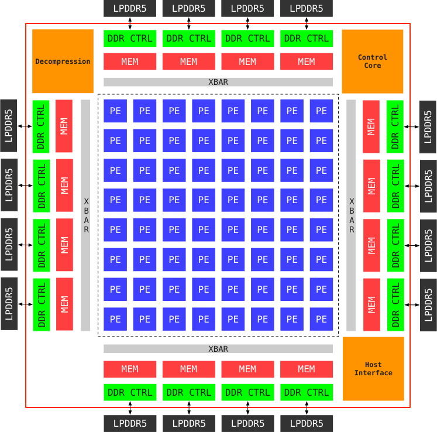
> 图解：MTIA v2i 采用 8×8 PE 阵列，内含多种固定功能单元，硬件特性决定 kernel 优化策略。

---

## 6. 自动评测是生产可用性的底座

KernelEvolve 不仅生成代码，还自动生成评测脚本：

- TritonBench 验证正确性与速度
- Torch Profiler 抓系统级瓶颈
- NCU / Proton / MTIA Insight 提供指令级诊断
- MPP 统一多层 profiling 信号

> 图解：kernel 生成后自动转为评测脚本，跑完直接回传 profiling 指标。

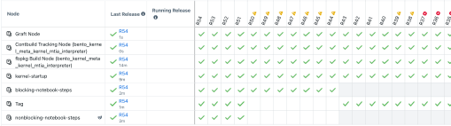
> 图解：评测环境通过持续部署自动更新，保证 kernel 始终在最新工具链中验证。

---

## 7. 公开算子验证：正确性先过关
结果很“硬”：

- 160 个 PyTorch ATen 算子 × 3 平台
- **480 个配置全部 100% 正确**
- KernelBench 250 个任务也是 100% 通过

这说明 KernelEvolve 不是“实验室 demo”，而是可以稳定生成可运行 kernel 的系统。

---

## 8. 核心实验：多场景生产级性能提升

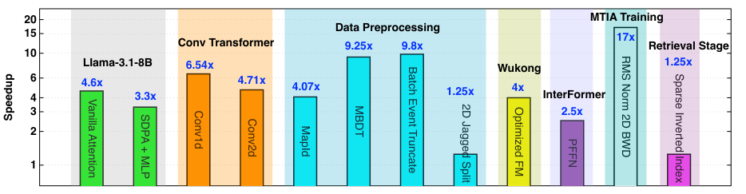
> 图解：从 LLM 推理到推荐系统预处理算子，KernelEvolve 在多平台上实现 1.25× 到 17× 加速。

### 8.1 Conv1d 在 H100：融合带来突破
关键点是 **把 5 个 kernel 融成 2 个** ，消灭 layout 转换。

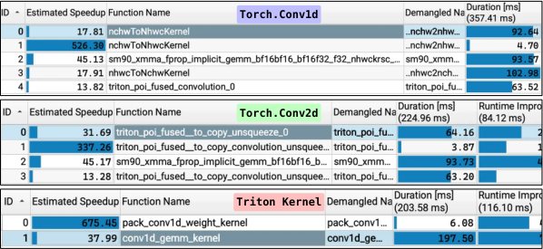
> 图解：PyTorch conv1d 需要 5 个 kernel，KernelEvolve 仅 2 个。

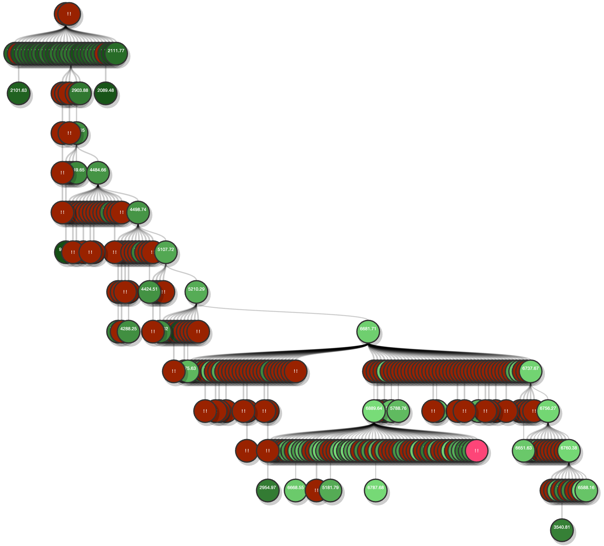
> 图解：图搜索迭代 300 步后，性能逐步提升，失败节点也会被保留用于避坑。

### 8.2 异构平台上 Conv1d
在 MI300 / MI350 / A100 / H100 / MTIA 上都能生成有效 kernel：

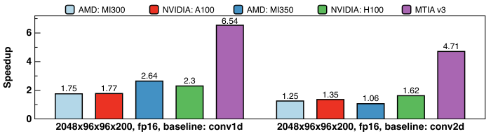
> 图解：不同硬件上，KernelEvolve 都能超过 PyTorch 基线，MTIA 上优势最大。

### 8.3 WuKong Optimized FM：关键公式
核心变换是：

$$
\text{out} = X \cdot (X^\top Y)
$$

通过融合避免中间结果落回 HBM。

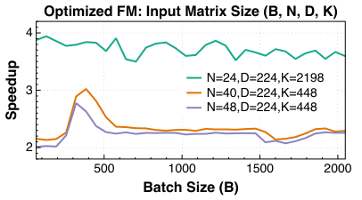
> 图解：小 $N$ 情况下速度提升可达 3.9×。

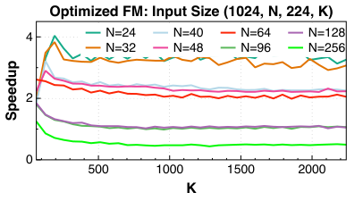
> 图解：$N$ 增大后收益下降，体现了 SRAM 容量与 tile 规模的权衡。

### 8.4 InterFormer PFFN：多算子单核融合
把 BMM + GELU + RMSNorm 统一成单核，减少三次内存往返。

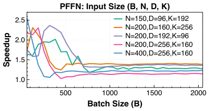
> 图解：小 batch 时 2.0–2.6×，大 batch 稳定在 1.2–1.4×。

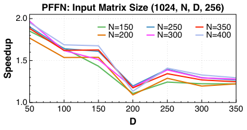
> 图解：随着 $D$ 变化，tile 进入/退出 SRAM 的临界点形成非单调曲线。

### 8.5 MTIA 上预处理算子：从“不可运行”到“可部署”
MapId 与 MBDT 在 v2i 上原本缺算子，KernelEvolve 生成 Triton kernel 直接替代 CPU fallback。

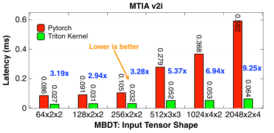
> 图解：MTIA v2i 上达到 2.94–9.25× 加速，输入越大收益越明显。

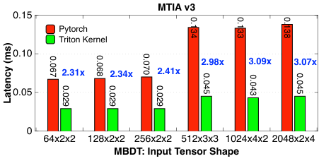
> 图解：MTIA v3 上提升稳定在 2.31–3.09×，基线更强但仍有明显收益。

---

## 9. Batch Event Truncate：复杂序列操作的自动化
这个算子本来没有批处理版本，KernelEvolve 生成单核并行实现，实测在多特征场景可达 **9.8×** 的提升。这类“非标准算子”才是推荐系统的真实痛点。

---

## 10. 关键机制总结（为什么它能工作）
- **图搜索驱动** ：不是一次生成，而是可持续迭代。
- **通用算子** ：避免静态 prompt 限制。
- **检索增强** ：让 LLM 学会专有硬件。
- **自动评测** ： correctness + performance 强约束。
- **持久化知识库** ：跨任务复用优化经验。

---

## 11. 附录级核心推导与接口说明（浓缩版）

### 11.1 Fitness 定义
$$
\mathcal{F}(v) = \frac{t_{\text{pytorch}}}{t_{\text{triton}}}
$$
正确性不满足时直接置 0，这是让系统稳定产出可用 kernel 的关键。

### 11.2 Optimized FM 复杂度降低
原始 $XX^\top$ 复杂度是 $O(N^2D)$，改写为：

$$
\text{out} = X \cdot (X^\top Y)
$$

复杂度降为 $O(NKD)$，并且适合融合。

### 11.3 Kernel 输出接口（核心约定）
- 一个 PyTorch baseline
- 一个 Triton 优化实现
- 一个输入生成器

这样才能自动接入 TritonBench 与系统级 profiler。

---

## 12. 未来方向（论文给出的路线图）
- **模型级优化** ：从算子级走向全图融合
- **更低层 IR / PTX 级别生成**
- **大规模并行搜索**
- **硬件适配自动化 + RL 反馈**
- **可持续与能耗优化**

---

## 13. 最终结论
KernelEvolve 真正解决的是 **“异构硬件与软件生态不同步”** 这个结构性矛盾。它让 kernel 生成从人力密集型手工优化，转向可规模化、可复用、可自动评测的工程系统。

> 本文参考自 [KernelEvolve: Scaling Agentic Kernel Coding for Heterogeneous AI Accelerators at Meta](https://arxiv.org/abs/2512.23236v1)