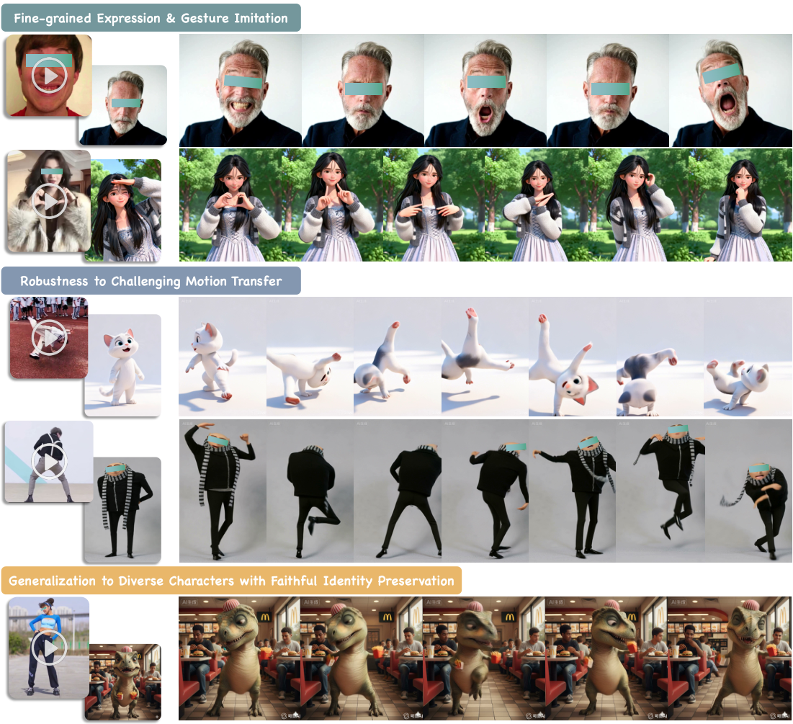
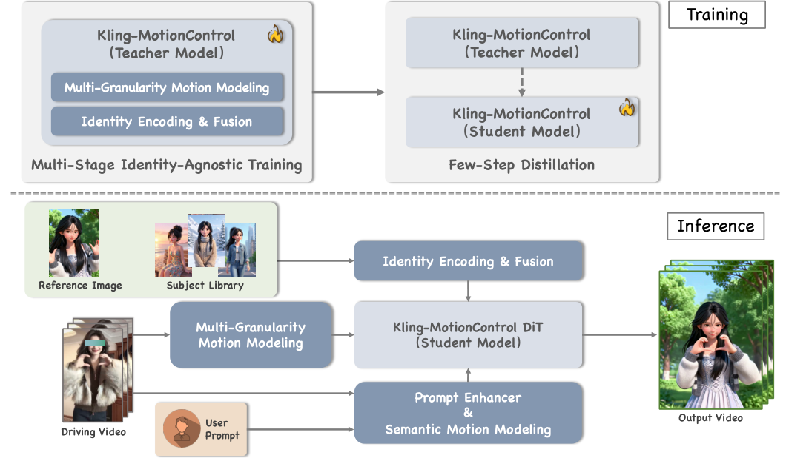
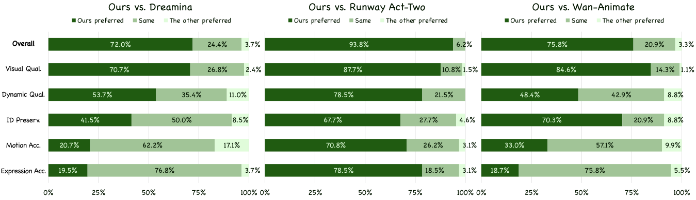
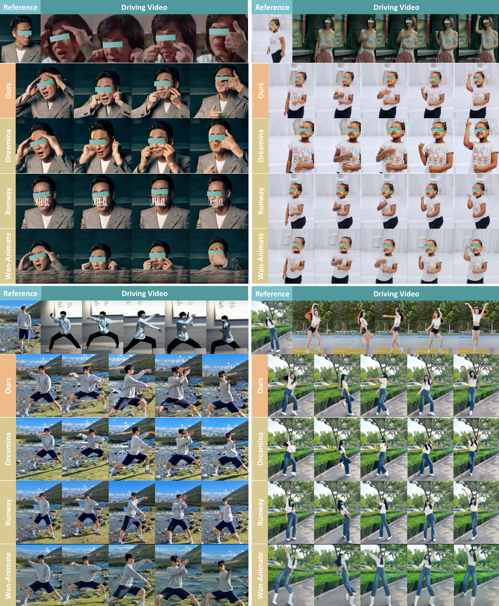

# Kling-MotionControl 技术解读：用统一 DiT 框架实现全身角色动画的高保真与高可控

这篇技术报告要解决的核心问题很直接：给定一张参考人物图和一段驱动视频，如何稳定生成“像这个人、做那个动作”的高质量动画。与此同时，动作需要覆盖全身、表情和手部细节，还要支持跨身份迁移（真人到卡通、成人到儿童等）并保持一致性。

作者给出的答案是 Kling-MotionControl：一个面向全身角色动画的统一 DiT（Diffusion Transformer）框架。它的关键不在于“再堆一个大模型”，而在于将不同粒度的运动控制拆分建模，再在统一系统中协同优化。

## 一、这篇工作到底难在哪

角色动画真正的难点不只是“能动”，而是要同时满足以下目标：

- 大幅度身体动作稳定，不崩骨架、不穿帮。
- 面部微表情和手指细节精细，不能糊成一团。
- 跨身份迁移自然，避免身份漂移（ID drift）。
- 背景、镜头与文本编辑能力不因强调动作而失控。
- 推理成本足够低，能够进入真实生产流程。

作者认为现有方法（包括商业系统与开源 SOTA）常常在这些目标之间“顾此失彼”：要么动作准确但画质和身份保持较弱，要么画质好但控制能力不足，要么仅适合人像场景而难以支撑全身复杂动作。

## 二、方法总览：统一框架 + 分而治之

> 图解：这张总览图展示了任务输入与输出关系。输入是参考图（决定“谁”）和驱动视频（决定“怎么动”），输出是目标角色的完整动画。重点在于同一系统同时覆盖身体动作、表情和手势三个层级。

> 图解：pipeline 图对应训练与推理主干。可理解为“多路运动表征提取 + 身份注入融合 + DiT 生成 + 控制增强 + 加速采样”的串并联系统。横向是模块分工，纵向是从训练到推理的落地路径。

### 2.1 异构运动编排：身体、面部、手部分开建模，再统一协同

作者的第一性原则是：不同身体区域的运动统计特性差异显著，不能依赖单一控制信号去硬控全局。

- 身体动作：强调大结构稳定与时序连贯。
- 面部动作：强调微表情与口型细节。
- 手部动作：强调高自由度关节与复杂遮挡。

因此，方法采用异构运动表征（heterogeneous motion representations），并通过渐进式多阶段训练，让三类控制在统一模型中协调，实现“宏观稳定 + 微观精细”的平衡。

### 2.2 自适应跨身份迁移：去身份化运动学习 + 语义运动理解

跨身份迁移常见失败原因在于把“谁在动”和“怎么动”混在一起学习。作者的策略是：

- 在几何层面进行 identity-agnostic motion learning：将驱动者的体型与身份属性从运动模式中剥离。
- 在语义层面增加 semantic motion modeling：让系统理解动作意图（如 facepalm、clapping），不仅拟合姿态，还进行语义对齐。

这样可以在形态差异较大的主体间迁移动作，并减少人工校准成本。

### 2.3 身份保真：身份编码融合 + Subject Library

为避免“动作对了但人变了”，作者设计了专门的身份注入与融合机制，确保参考角色外观被稳定保留。进一步地，系统支持 subject library：

- 不只接收一张参考图。
- 可额外输入多视角图或参考视频。
- 使用更丰富的上下文构建更稳健的身份表示。

这一设计在极端姿态和长视频场景下尤为关键。

### 2.4 3D 感知与自由视角镜头控制

作者在运动表征中引入多视角监督，让系统具备 3D awareness，价值体现在两点：

- 角色朝向与姿态对齐更准确，不局限于 2D 投影匹配。
- 镜头可通过文本控制（平移、推拉、变焦等），并维持几何一致性。

### 2.5 文本可控：Prompt Enhancer（PE）

PE 模块用于桥接“动作约束”和“文本编辑”之间的冲突。换言之，模型既能严格跟随动作，又能响应文本改动（服装、背景、环境、镜头语义等），从而提高创作自由度。

### 2.6 推理加速：双分支采样 + 多阶段蒸馏，端到端超 10× 提速

视频扩散模型在部署时常被 NFE（采样步数）拖慢。作者提出的加速组合包括：

- Teacher 端双分支采样，降低多条件 CFG 的分支负担。
- 多阶段蒸馏，将高步数模型压缩为少步数 Student。
- 将条件梯度并入 Student，规避推理阶段 CFG 的额外开销。

最终，报告称端到端加速超过 10 倍，同时保持性能。

### 2.7 数据体系：大规模采集 + 多维过滤 + 细粒度标注

作者强调模型能力离不开数据工程，其数据框架包含：

- 覆盖多角色类型与多动作动态的大规模数据。
- 基于质量、动作幅度、流畅度、主体一致性的过滤流程。
- 使用高速相机与高质量渲染数据补充复杂快动作样本。
- 包含动作、微表情、人物交互、镜头运动等细粒度标注。

## 三、评测协议：主观偏好 GSB，覆盖 5 个关键维度

论文使用 150 组高质量测试对（参考图 + 异身份驱动视频），采用双盲 pairwise 的 Good / Same / Bad（GSB）投票，并定义指标：

$$
\text{GSB score} = \frac{G + S}{B + S}
$$

分数越高，表示“更好或不差于”对手的比例越高。评价维度包括：

- Visual Quality（单帧画质）
- Dynamic Quality（时序一致性）
- Identity Preservation（身份保真）
- Motion Accuracy（身体动作准确性）
- Expression Accuracy（表情准确性）

## 四、量化结果：对商业与开源基线均全面领先

对比对象为 Dreamina、Runway Act-Two 和 Wan-Animate，统一 1080P 与时长配置。论文表格结果如下：

| GSB 对比 | Overall | Visual Qual. | Dynamic Qual. | ID Preserv. | Motion Acc. | Expression Acc. |
|---|---:|---:|---:|---:|---:|---:|
| Ours vs. Dreamina | 3.44 | 3.33 | 1.92 | 1.56 | 1.05 | 1.20 |
| Ours vs. Runway Act-Two | 16.25 | 8.00 | 4.64 | 2.95 | 3.32 | 4.50 |
| Ours vs. Wan-Animate | 4.00 | 6.43 | 1.77 | 3.07 | 1.34 | 1.16 |

> 图解：该图为各维度偏好分布可视化。横轴是评价维度，纵轴是偏好占比。可以直观看到 Kling-MotionControl 在 Overall 与 Visual Quality 上优势更显著，在 Motion / Expression 等精细控制维度也保持领先。

## 五、定性结果：细节表达与极端动作鲁棒性是主要优势

> 图解：对比图上半部分聚焦面部与手势细节，下半部分聚焦高速、大幅度动作。竞品常见问题包括手部畸形、表情失真、身份漂移和结构崩坏；本文方法在复杂动作下仍保持较好的结构完整性与身份一致性。

> 图解：多场景案例展示了方法在不同角色风格和镜头尺度下的泛化能力。左列通常为参考身份，其他列为驱动结果；可观察到从近景表情到全身动作都保持了较高一致性与文本可控性。

## 六、和相关工作的关系：这篇报告的定位

从 Related Work 的脉络看，这篇工作定位清晰：

- 在 backbone 上，承接了视频生成从 U-Net 到 DiT 的范式迁移。
- 在任务上，补齐“只做身体”或“只做人脸”方法的短板，强调全身统一控制。
- 在能力上，不仅追求画质，也将身份保持、跨域泛化、文本控制与部署效率纳入同一系统目标。

换句话说，它更像是“面向生产的系统工程整合”，而不是单点算法技巧。

## 七、我的技术结论：为什么它更接近可用产品

从工程落地角度看，这篇报告最有价值的是四件事能够同时成立：

- 多粒度控制不再互相冲突。
- 跨身份迁移与身份保真被同时优化。
- 文本可控与动作可控被统一在同一个交互闭环中。
- 推理效率通过蒸馏与采样设计进入可部署区间。

当然，论文也明确目前主评估仍以主观指标为主，后续可补充更多客观指标。对实际产业应用而言，仍需进一步强化安全机制（如水印、内容过滤）与合规治理，这一点在 Impact Statement 中也有正面讨论。

## 八、总结

Kling-MotionControl 的核心贡献不只是“把动画做出来”，而是将全身动画中的长期冲突目标（精度、保真、泛化、可控、效率）纳入同一套 DiT 系统，并给出较完整的工程方案。  
在当前角色动画赛道中，这类“统一架构 + 多条件协同 + 高效部署”的路线，基本代表了下一阶段的主流方向。

> 本文参考自 [Kling-MotionControl Technical Report](https://arxiv.org/abs/2603.03160)