# Learning beyond Teacher: Generalized On-Policy Distillation with Reward Extrapolation 解读

## 一句话总结
这篇论文把 On-Policy Distillation (OPD) 重新解释成一种 **密集 KL 约束的 RL** 特例，并提出 **Generalized OPD (G-OPD)**：通过引入参考模型 $\pi_{\mathrm{ref}}$ 和奖励缩放系数 $\lambda$，实现 **奖励插值/外推**，在多教师合并与强到弱蒸馏中显著超越标准 OPD。

## 背景：为什么要重新理解 OPD
传统知识蒸馏多为 **Off-Policy**：学生拟合教师生成的轨迹。优点是稳定，缺点是训练与推理分布不一致。  
OPD 改成 **On-Policy**：学生先自己生成，再对齐教师在这些 token 上的 logits，这让学习更贴近真实推理行为，并提供 **token 级密集信用分配**。

核心问题是：  
OPD 表现很好，但理论上它到底是什么？它是否还有可控的自由度？

## 关键观察：OPD 是一种“固定权重”的 KL 约束 RL
OPD 的目标：

$$
\mathcal{J}_{\text{OPD}}(\boldsymbol{\theta}) =
\min_{\boldsymbol{\theta}}
\mathbb{E}_{\boldsymbol{x} \sim D, \boldsymbol{y} \sim \pi_{\boldsymbol{\theta}}}
\Big[
\mathcal{D}_{\mathrm{KL}}(\pi_{\boldsymbol{\theta}}(\boldsymbol{y}|\boldsymbol{x}) \,\|\, \pi^*(\boldsymbol{y}|\boldsymbol{x}))
\Big]
$$

论文将它重写为：

$$
\mathcal{J}_{\text{OPD}}(\boldsymbol{\theta}) =
\max_{\boldsymbol{\theta}}
\mathbb{E}_{\boldsymbol{x},\boldsymbol{y}\sim \pi_{\boldsymbol{\theta}}}
\Big[
\log \frac{\pi^*(\boldsymbol{y}|\boldsymbol{x})}{\pi_{\mathrm{ref}}(\boldsymbol{y}|\boldsymbol{x})}
-
\mathcal{D}_{\mathrm{KL}}(\pi_{\boldsymbol{\theta}}(\boldsymbol{y}|\boldsymbol{x}) \,\|\, \pi_{\mathrm{ref}}(\boldsymbol{y}|\boldsymbol{x}))
\Big]
$$

这意味着 OPD 其实就是 **密集奖励 + KL 约束 RL**，其中 **奖励与 KL 权重固定为 1:1**。

## G-OPD：引入可控的奖励缩放
论文提出更一般的目标：

$$
\mathcal{J}_{\text{G-OPD}}(\boldsymbol{\theta}) =
\max_{\boldsymbol{\theta}}
\mathbb{E}_{\boldsymbol{x},\boldsymbol{y}\sim \pi_{\boldsymbol{\theta}}}
\Big[
\lambda \log \frac{\pi^*(\boldsymbol{y}|\boldsymbol{x})}{\pi_{\mathrm{ref}}(\boldsymbol{y}|\boldsymbol{x})}
-
\mathcal{D}_{\mathrm{KL}}(\pi_{\boldsymbol{\theta}}(\boldsymbol{y}|\boldsymbol{x}) \,\|\, \pi_{\mathrm{ref}}(\boldsymbol{y}|\boldsymbol{x}))
\Big]
$$

两个关键旋钮：

- **$\lambda$**：奖励缩放因子  
- **$\pi_{\mathrm{ref}}$**：参考模型，可以是学生基座，也可以是教师基座

### 奖励插值 vs 奖励外推
最优解满足：

$$
\log \pi_{\boldsymbol{\theta}}(\boldsymbol{y}|\boldsymbol{x})
=
\lambda \log \pi^*(\boldsymbol{y}|\boldsymbol{x})
+
(1-\lambda)\log \pi_{\mathrm{ref}}(\boldsymbol{y}|\boldsymbol{x})
$$

所以：

- 当 $0<\lambda<1$：**奖励插值**，学生行为介于参考模型与教师之间  
- 当 $\lambda>1$：**奖励外推**，学生被推动“超越教师”，论文称为 **ExOPD**

这不是简单的“加大蒸馏强度”，而是理论上把 **隐式奖励** 做了放大外推。

## 核心机制：密集奖励长什么样
OPD 的 token 级奖励：

$$
r_t^{OPD} =
\log \frac{\pi^*(y_t|\boldsymbol{x},\boldsymbol{y}_{<t})}
{\pi_{\mathrm{ref}}(y_t|\boldsymbol{x},\boldsymbol{y}_{<t})}
$$

它与 DPO 中的 implicit reward 形式一致，但这里 **不要求教师由参考模型 RL 得到**。  
换句话说，只要有教师和参考模型，OPD 就能构造密集 reward。

这也解释了它为什么能比稀疏 RL 更稳定、更高效。

## 实验与图解（重点图表）

### 1. 多教师蒸馏：ExOPD 才能统一超越
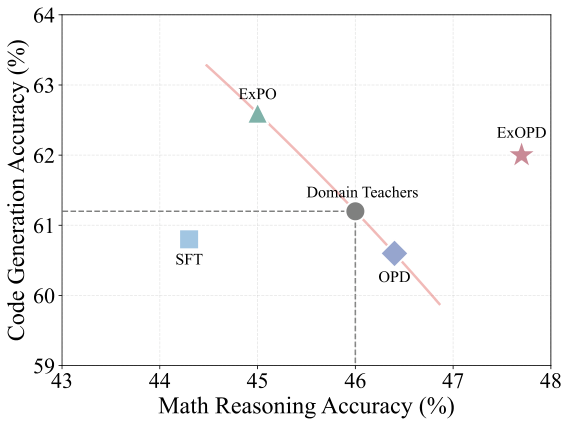

> 图解：横轴与纵轴分别是数学与代码任务的平均指标，散点对应不同蒸馏方法。只有 ExOPD 的点落在 **两个教师都被超越** 的右上区域，说明它能同时整合多个领域专家能力。

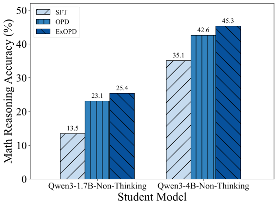

> 图解：强到弱蒸馏的对比图，ExOPD 相比 OPD 和 SFT 在多个数学基准上持续提升，奖励外推的收益具有跨规模稳定性。

### 2. 奖励缩放因子的趋势
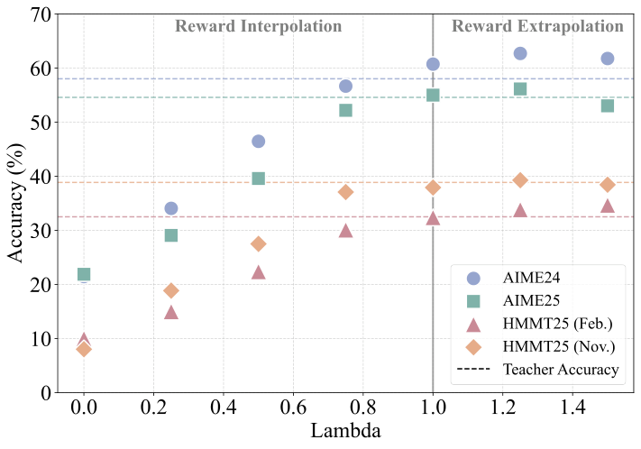

> 图解：不同 $\lambda$ 下的数学准确率曲线。性能随 $\lambda$ 增大而上升，$\lambda=1.25$ 最优，$\lambda=1.5$ 开始不稳定。

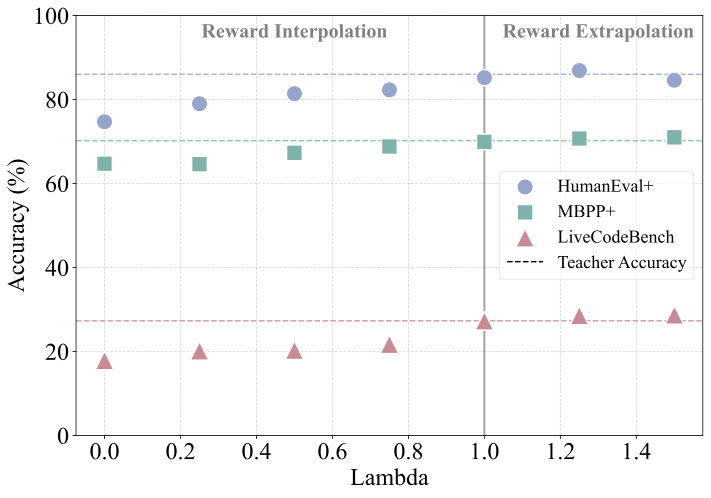

> 图解：代码任务同样呈现 **奖励外推优于标准 OPD** 的趋势。

### 3. 性能与输出长度的关系
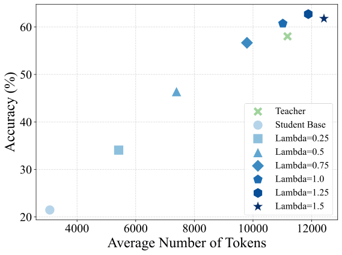

> 图解：AIME24 上准确率与平均输出长度的关系。外推后的模型往往生成更长的推理，带来性能提升。

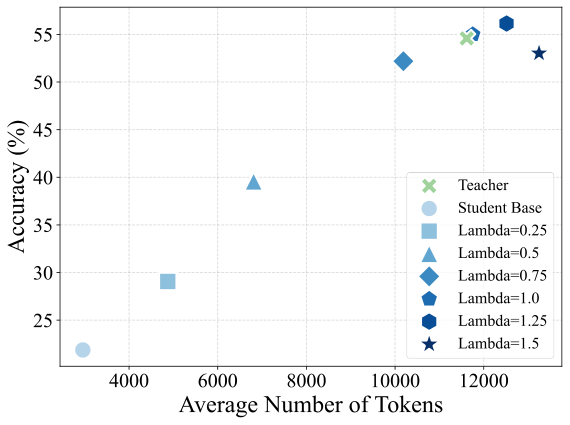

> 图解：AIME25 也体现“更长响应 + 更高准确率”的趋势。

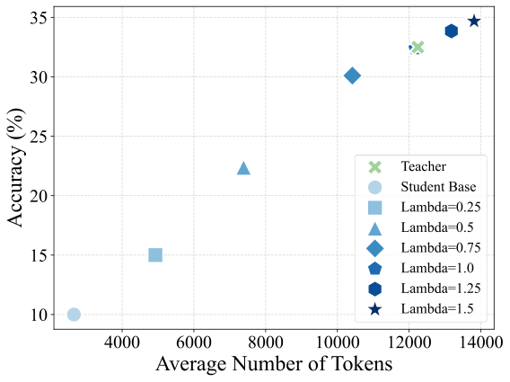

> 图解：HMMT25 (Feb.) 上，奖励外推带来长度上升与准确率提升的同步变化。

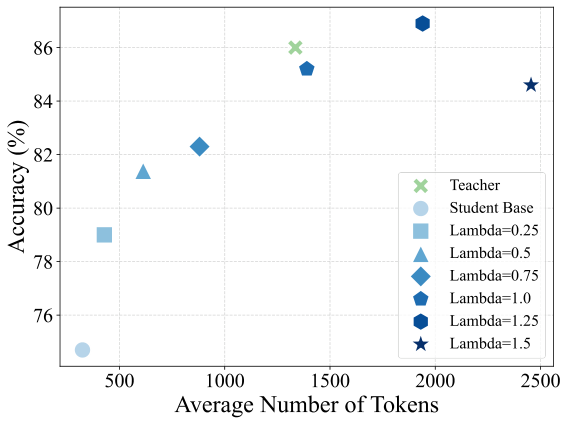

> 图解：代码任务上，输出更长往往伴随更好的通过率。

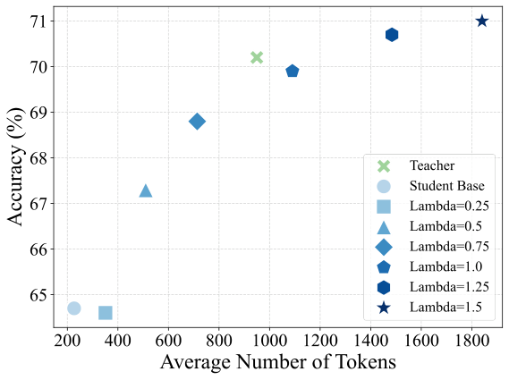

> 图解：MBPP+ 也呈现类似的 length-acc 正相关。

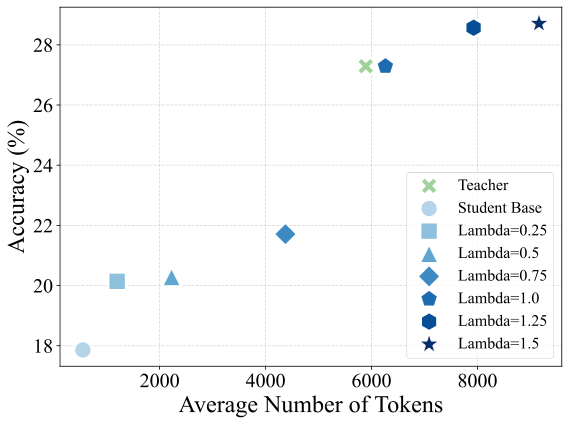

> 图解：LiveCodeBench 上奖励外推表现优于标准 OPD。

### 4. 训练动态分析

> 图解：图例说明不同方法的标记方式。

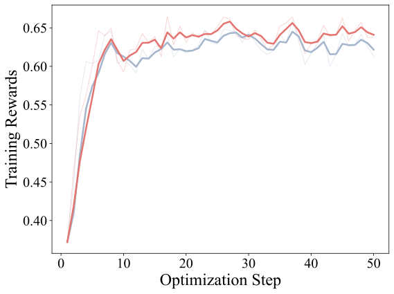

> 图解：ExOPD 训练奖励更高，说明隐式奖励被更强地优化。

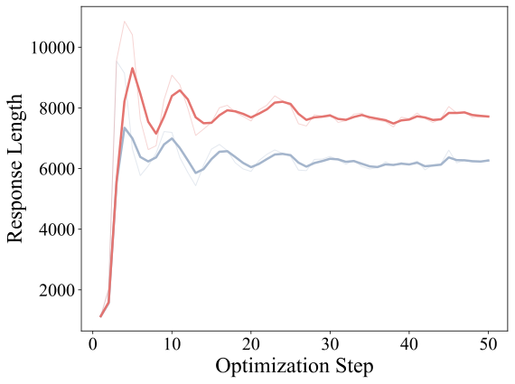

> 图解：ExOPD 训练中输出长度明显上升，与评测趋势一致。

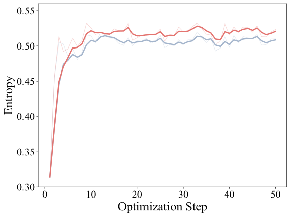

> 图解：ExOPD 提高了输出熵，说明生成分布更发散，探索性更强。

### 5. 强到弱蒸馏中的奖励修正
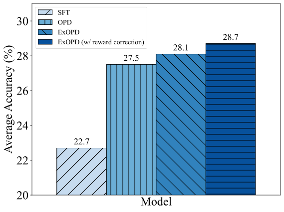

> 图解：当参考模型改为教师的 pre-RL 基座后，ExOPD 的性能继续提升，奖励信号更准确。

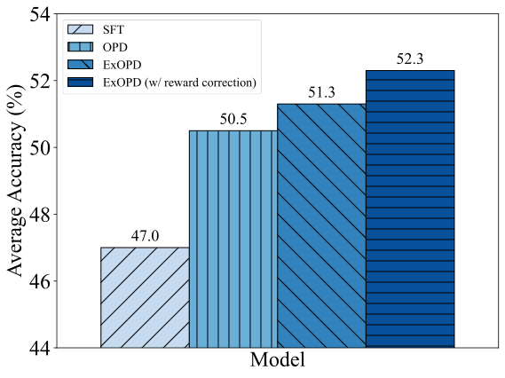

> 图解：代码领域同样验证奖励修正的有效性。

## 实验结论要点
- **$\lambda>1$ 的奖励外推几乎总是优于标准 OPD**，最佳值在实验中稳定为 $\lambda=1.25$  
- 在 **多教师合并** 场景，ExOPD 是唯一能统一超越所有专家的方案  
- 在 **强到弱蒸馏** 中，即便奖励含噪，外推仍能拉升性能  
- 如果能拿到教师的 pre-RL 基座，用作 $\pi_{\mathrm{ref}}$ 会进一步提升，但代价是额外计算

## 重要公式小结
### G-OPD 目标

$$
\mathcal{J}_{\text{G-OPD}}(\boldsymbol{\theta}) =
\max_{\boldsymbol{\theta}}
\mathbb{E}_{\boldsymbol{x},\boldsymbol{y}\sim \pi_{\boldsymbol{\theta}}}
\Big[
\lambda \log \frac{\pi^*(\boldsymbol{y}|\boldsymbol{x})}{\pi_{\mathrm{ref}}(\boldsymbol{y}|\boldsymbol{x})}
-
\mathcal{D}_{\mathrm{KL}}(\pi_{\boldsymbol{\theta}}(\boldsymbol{y}|\boldsymbol{x}) \,\|\, \pi_{\mathrm{ref}}(\boldsymbol{y}|\boldsymbol{x}))
\Big]
$$

### G-OPD 最优解的插值/外推形式

$$
\log \pi_{\boldsymbol{\theta}} =
\lambda \log \pi^* + (1-\lambda)\log \pi_{\mathrm{ref}}
$$

### G-OPD 的近似梯度

$$
\nabla_{\boldsymbol{\theta}} \mathcal{J}_{\text{G-OPD}}(\boldsymbol{\theta}) =
\mathbb{E}_{\boldsymbol{x},\boldsymbol{y}}
\Big[
\sum_{t=1}^{T} A_t^{\text{G-OPD}} \nabla_{\boldsymbol{\theta}} \log \pi_{\boldsymbol{\theta}}(y_t|\boldsymbol{x},\boldsymbol{y}_{<t})
\Big]
$$

其中：

$$
A_{t}^{\text{G-OPD}} =
\big(\log \pi_{\boldsymbol{\theta}} - \log \pi^{*}\big)
+
(\lambda - 1)\big(\log \pi_{\text{ref}} - \log \pi^{*}\big)
$$

## 讨论：ExOPD 为什么能超过教师
直觉上，OPD 只是让学生拟合教师，但 ExOPD 做的是 **奖励外推**：  
它把隐式奖励放大，迫使模型在 teacher-Ref 的 log-ratio 方向继续前进。  
在多教师合并场景，这等价于 **强化各领域提升方向**，所以学生能超过任一单独教师。

当然也有风险：  
$\lambda$ 太大可能让模型“hack reward”，导致性能不稳、输出过长。

## 结论与可扩展方向
- OPD 本质上是 **密集 KL-RL 特例**  
- G-OPD 提供了可控的奖励缩放和参考模型选择  
- ExOPD 在多教师合并与强到弱蒸馏中优势明显  
- 奖励修正是强到弱场景的关键增强，但依赖教师 pre-RL 模型

> 本文参考自 Learning beyond Teacher: Generalized On-Policy Distillation with Reward Extrapolation