# LongCat-Next 深度解读：把视觉和语音都“词元化”，统一到一个自回归大模型里

这篇论文要解决的核心问题很直接：为什么多模态模型总是采用 **“语言主干 + 外挂模块”**，而不是像语言一样被原生建模？  
LongCat-Next 给出的答案是：把视觉、语音都离散化成 token，并和文本一起放进同一个 Next-Token Prediction（NTP）框架统一训练。

---

## 1. 先说结论：这篇论文做成了什么

- 提出统一范式 **DiNA（Discrete Native Autoregression）**：文本、图像、语音全部映射到共享离散 token 空间。
- 提出视觉 tokenizer **dNaViT**：支持任意分辨率图像的 tokenization 与 de-tokenization。
- 通过 RVQ（Residual Vector Quantization）缓解离散化信息损失，兼顾理解与生成。
- 在单一模型中实现 seeing / painting / speaking，且在多个 benchmark 上达到强竞争力。
- 论文强调一点：离散视觉建模不一定有“天然上限”，关键在 tokenizer 设计和数据规模。

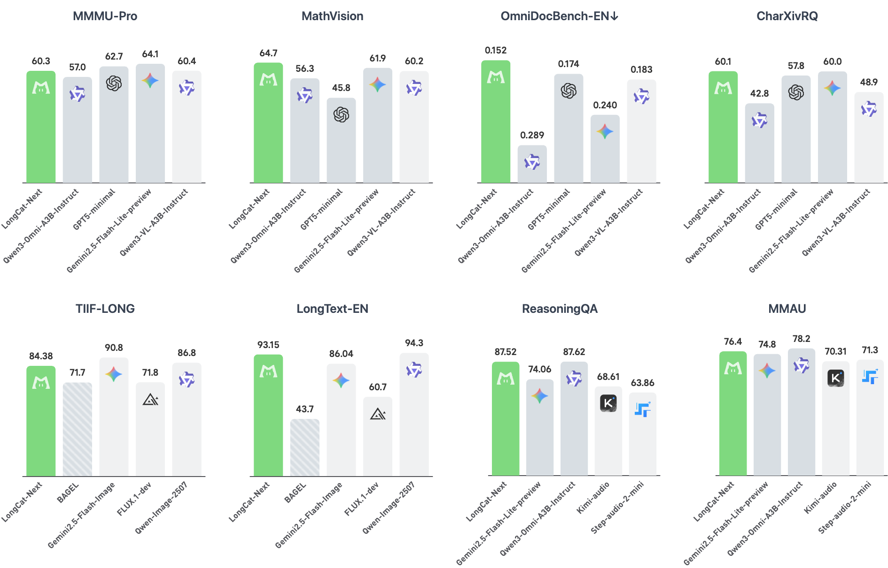
> 图解：这是 LongCat-Next 的总体基准表现图。横向可理解为不同任务类别（视觉理解、图像生成、语音任务等），纵向是性能指标分数；核心信息是它在统一模型设定下保持了较高上限，而不是靠“每个任务单独训练一个模型”来取分。

---

## 2. 问题定义：多模态为什么一直“拼接感”很重

传统多模态系统的常见路径是：
- 文本 token 进入 LLM；
- 图像/语音特征先走独立 encoder，再投影到语言空间；
- 推理和训练目标往往分裂（理解一套、生成一套）。

论文认为这会导致三个问题：
1. 架构碎片化，工程复杂；
2. 理解与生成目标冲突；
3. 难以复用成熟的 LLM 训练基础设施。

LongCat-Next 的主张是：把模态当作“语言扩展”，统一成离散序列，直接优化同一个自回归目标。

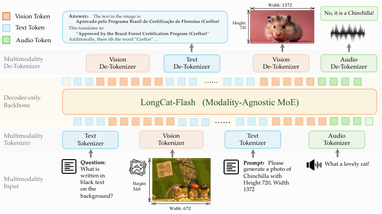
> 图解：这张总览图展示了 tokenizer/detokenizer + 统一 MoE backbone 的组合。输入侧把图文音都变成离散 token，输出侧按任务再解码回图像或语音。流程上没有“外挂式专用主干”，而是一个共享预测管线。

---

## 3. DiNA：统一范式到底统一了什么

DiNA 的关键是把“多模态建模”重写成“离散序列建模”：

- 统一输入接口：所有模态都变成 token IDs。
- 统一训练目标：全部是 next-token prediction。
- 统一主干网络：decoder-only + modality-agnostic MoE。
- 模态差异主要下沉到 tokenizer/detokenizer，而不是主干结构分叉。

这使其具备明显工程收益：已有 LLM 训练/部署体系可以最大化复用。

---

## 4. dNaViT：视觉离散化的核心创新

### 4.1 语义完备性（Semantic Completeness）

论文给出一个关键约束：离散视觉 token 不能只“可重建”，还要“可回答问题”。

行内可写为：$P(A \mid z,\mathcal{Q}) \approx P(A \mid I,\mathcal{Q})$。  
其中，$I$ 是原图，$z$ 是离散 token 序列，$\mathcal{Q}$ 是图像相关查询。

对应两条要求：
- **判别不变性**：理解任务性能不因离散化而明显下降；
- **生成充分性**：token 能支持较高保真重建/生成。

### 4.2 SAE + RVQ 的组合

论文选择 Semantic-and-Aligned Encoder（如 QwenViT 一类）先得到语义对齐特征，再进行 RVQ 分层量化：

$$
r_0=f_{\text{proj}}(z),\quad
\hat q_l=\mathrm{VQ}(r_{l-1}),\quad
r_l=r_{l-1}-\hat q_l,\quad
\hat z=\sum_{l=1}^{L}\hat q_l
$$

直观理解：不是一次性粗暴量化，而是“分层逼近残差”，逐层补足细节。

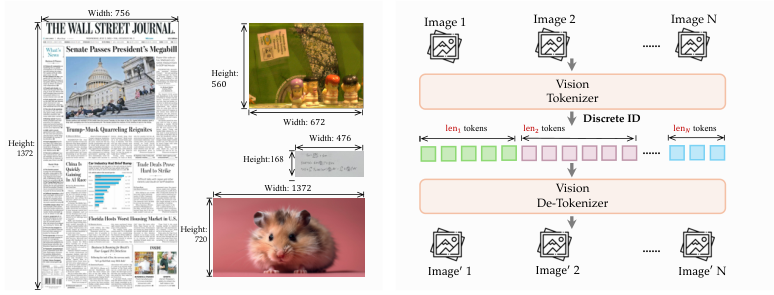
> 图解：该图展示 dNaViT 的设计动机与模块拆解。上游 encoder 提供语义特征，RVQ 做多层离散化；这些层级 token 共同表达一张图，从而兼顾语义与细节。

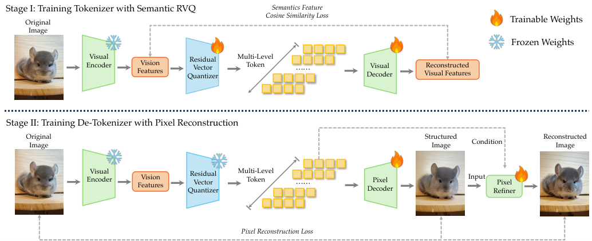
> 图解：这是 tokenizer 与 de-tokenizer 的训练闭环。横向是从图像到离散 token，再从 token 回图像；纵向体现多层 RVQ 的层级结构。核心看点是任意分辨率输入下仍保持统一流程。

---

## 5. 音频 tokenizer：语义与声学并保

音频侧流程：
- Whisper encoder 提取特征；
- 下采样后进入 8 层 RVQ，得到离散音频 token；
- 一路对齐 LLM 语义空间，一路做声码重建（含 flow matching 精修）。

训练损失写成：

$$
\mathcal{L}_{\text{audio}}=\lambda_1\mathcal{L}_{\text{recon}}+\lambda_2\mathcal{L}_{\text{commit}}+\lambda_3\mathcal{L}_{\text{llm}}
$$

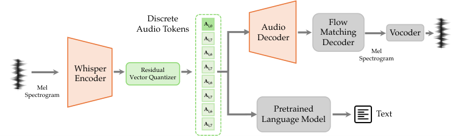
> 图解：图中左侧是语音到离散 token 的编码路径，右侧是重建路径。上分支强化语义可理解性，下分支保证听感与细节保真。

---

## 6. 一个很实用的点：语音生成里的“内部语言引导”

论文把语音生成拆成两种策略：
- 并行生成：文本 token 与音频 token 同步生成（低延迟）；
- 串行生成：先文本后语音（语义更稳）。

并通过随机 delay 统一训练，让模型学会不同时延下的 text-audio 对齐。

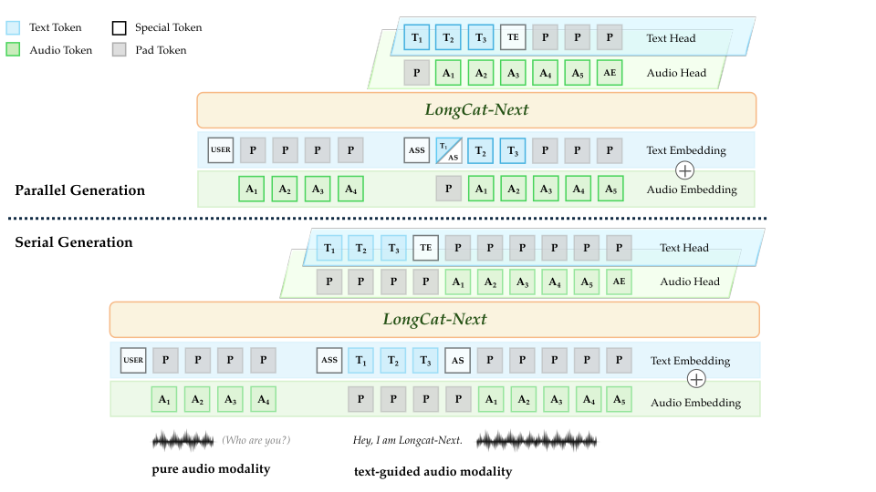
> 图解：图里 AS/AE/TE 是分段边界 token。横轴可理解为生成时间步，不同策略本质是文本与音频 token 的相对对齐偏移。

---

## 7. 训练配方：先训 tokenizer，再训统一模型

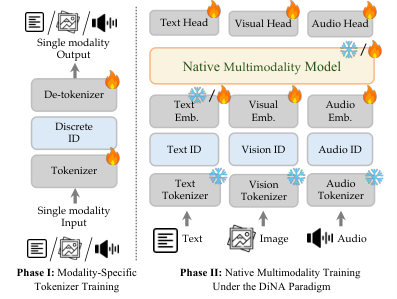
> 图解：训练分为 tokenizer 训练、pre-align、全模态预训练、mid-training、SFT。纵向看是模块逐步解冻，横向看是数据与序列长度逐级加大。

视觉数据强调 OCR、图表、GUI、STEM；  
生成数据强调长尾语义覆盖与文本渲染；  
音频数据覆盖 web-audio、合成配对、任务专项数据。  
这套 recipe 的目标很明确：保证统一模型不在任一模态“短板化”。

---

## 8. 结果怎么读：统一模型不再只靠“折中”

### 8.1 视觉理解与生成

论文报告 LongCat-Next 在多类视觉理解 benchmark 与统一生成 benchmark 上都保持强竞争力，尤其在 OCR/图表理解、长文本渲染方面表现突出。

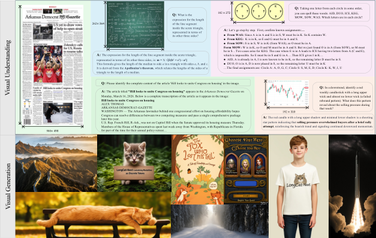
> 图解：这类案例图通常左侧是理解任务（问答/OCR/推理），右侧是生成任务（文本到图像）。它想说明同一离散接口既能“读图”也能“画图”。

### 8.2 音频能力

覆盖 ASR/TTS/音频理解/语音问答。论文给出的结论是：统一模型在多项任务上接近或超过同规模对比系统，说明“离散语音 token + 统一 NTP”是一条可行路线。

---

## 9. 关键实验分析：论文最有启发的几处

### 9.1 离散 vs 连续：差距能否补齐？

论文通过 pre-align 与扩展数据实验表明：离散表示早期更难训练，但随着数据规模增加，理解任务性能可逼近连续方案。

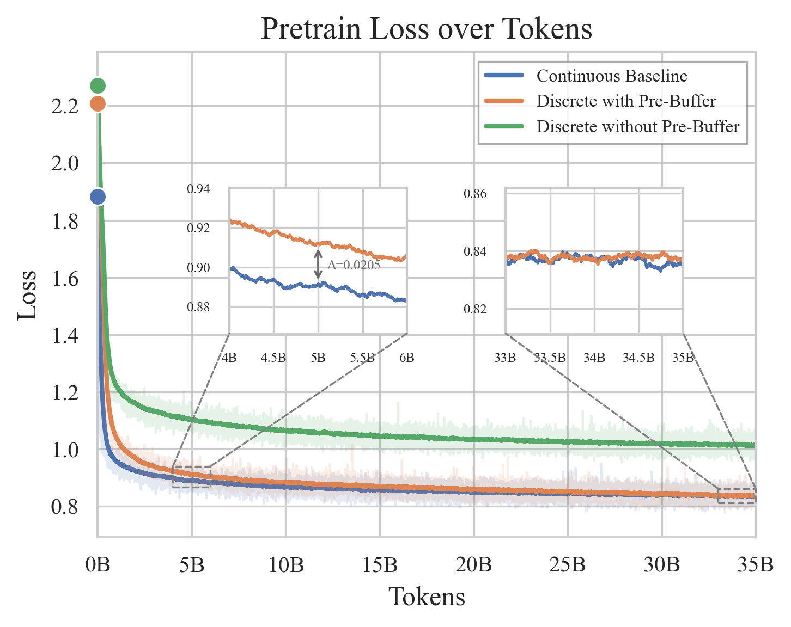
> 图解：这图通常横轴是训练步数，纵轴是 loss 或关键指标。离散曲线起步更高，但后期逐步贴近连续曲线，说明“不是能力天花板，而是优化与数据问题”。

### 9.2 理解与生成是否冲突？

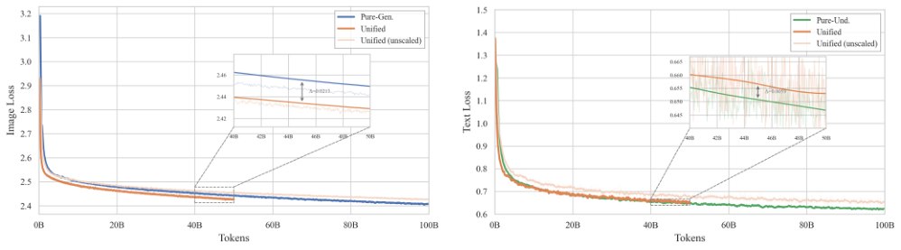
> 图解：图中对比 Pure-Und、Pure-Gen、Unified 的训练动态。结论是统一训练并未显著伤害理解，且理解信号反过来帮助生成收敛。

### 9.3 MoE 是否真的“模态无关”？

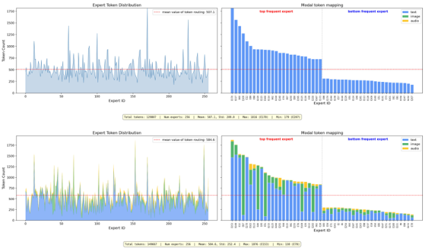
> 图解：虽然路由器不显式按模态写规则，但训练后专家会出现功能分化。横轴可看作专家编号，纵轴是 token 分配量，不同模态分布逐渐呈现偏好结构。

### 9.4 跨模态表征是否真的融合？

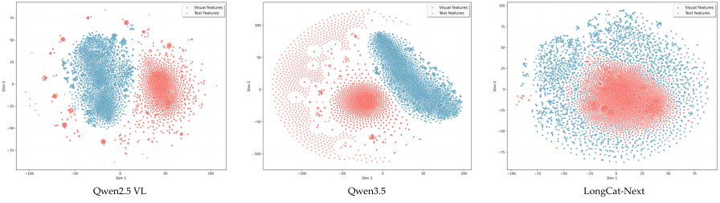
> 图解：t-SNE 可视化中，如果视觉与文本点云高度交织，说明共享语义空间融合更充分；如果明显分簇，则仍是“拼接式多模态”。

---

## 10. 工程侧价值：基础设施友好

论文还给出了系统层优化（V-Half pipeline 并行、异构负载平衡、减少跨 stage 通信），强调统一架构并不只是“概念美观”，而是能在工业训练里跑得动、跑得稳。

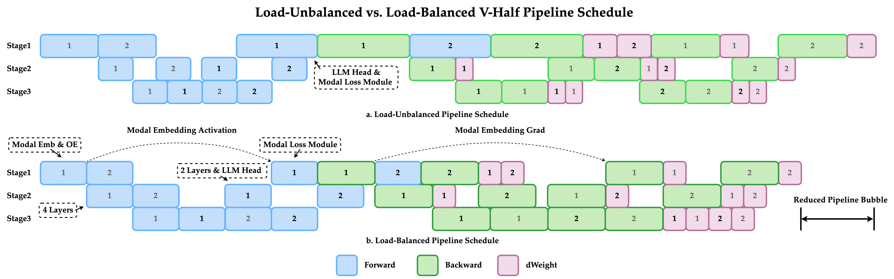
> 图解：图中展示了 V-shaped pipeline 的分配逻辑。把 embedding 与模态损失等异构模块做同设备协同，减少流水线气泡和通信开销。

---

## 11. 这篇工作的边界与后续方向

论文也很坦诚：
- 当前 dNaViT 版本仍有进一步优化空间（尤其是更强的像素细节恢复）。
- 未来目标是 any-to-any 与交错多模态长上下文，而不仅是 image-to-text / text-to-image。
- RL 在离散空间有优势，但也出现了训练-推理偏差导致的熵爆问题；论文提出了序列级过滤方案以稳定训练。

---

## 12. 总结：为什么 LongCat-Next 值得关注

LongCat-Next 的价值不只是一组分数，而是给出了一条清晰路线：  
把多模态问题“语言化”到离散 token 世界中，用统一自回归目标解决理解与生成的结构冲突。  
它证明了统一模型可以不是妥协，而是可扩展、可工程化、可继续放大的基础范式。

> 本文参考自 [LongCat-Next: Lexicalizing Modalities as Discrete Tokens](https://arxiv.org/abs/2603.27538)