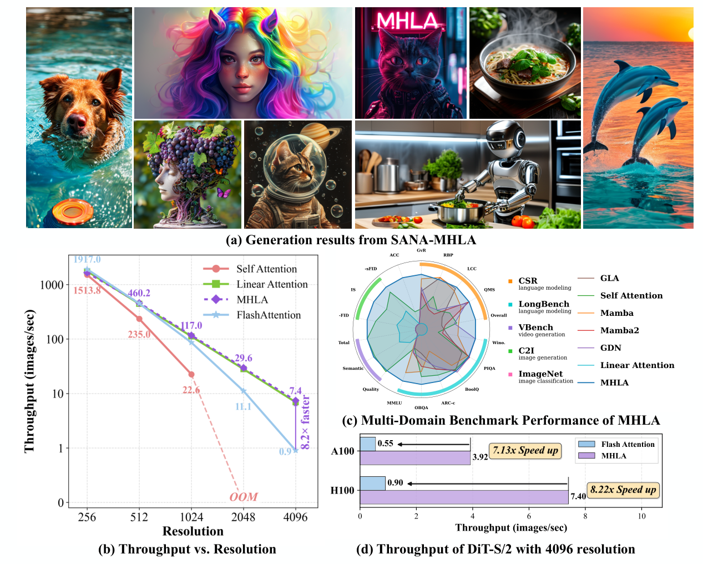
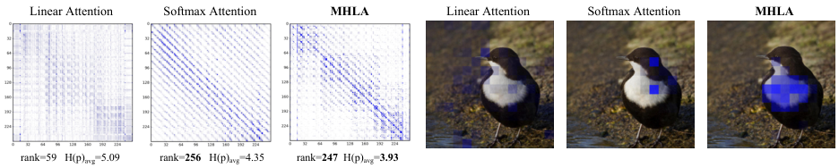
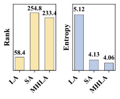
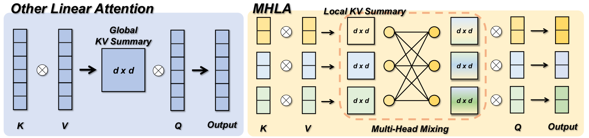
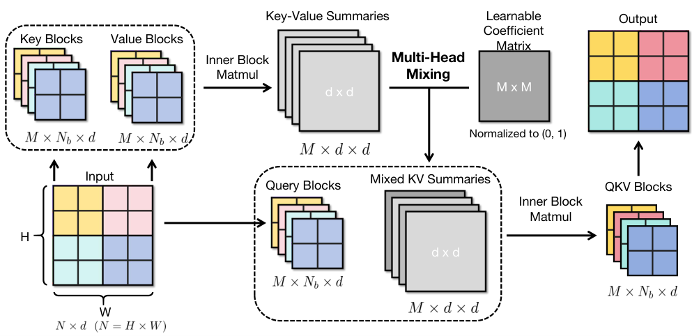
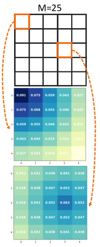
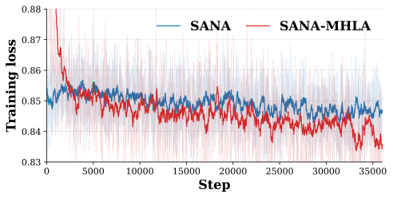
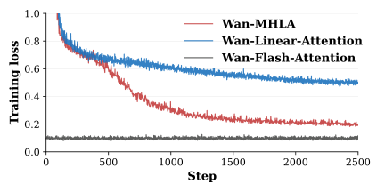

# MHLA：用 Token 级多头恢复线性注意力的表达力

## 一句话先讲清
这篇论文的核心发现是：**线性注意力性能下滑的根因在于“全局上下文塌缩（global context collapse）”**，所有 token 被压成一个全局 KV summary，导致注意力矩阵 **低秩且趋于均匀**。MHLA 通过 **按 token 维度分块 + 多头混合**，在保持 $O(N)$ 复杂度的同时恢复了 **query-conditioned 的选择性**。

> 图解：左侧展示引入 MHLA 后的图像生成效果；右侧表格对比不同注意力机制的 FID，MHLA 在多个模型规模下优于线性注意力与自注意力，同时吞吐保持接近线性注意力。

---

## 背景：线性注意力为什么“越长越差”
传统 Self-Attention 的计算是：

$$
Y_i = \frac{\sum_{j=1}^{N} \exp(Q_i K_j^\top/\sqrt{d}) V_j}{\sum_{m=1}^{N} \exp(Q_i K_m^\top/\sqrt{d})}
$$

复杂度 $O(N^2)$，高分辨率或长序列时不可用。

线性注意力把 softmax 换成特征映射：

$$
\mathrm{Sim}(Q_i,K_j)\approx\phi(Q_i)\phi(K_j)^\top
$$

得到：

$$
Y_i = \frac{\phi(Q_i)\left(\sum_{j=1}^{N}\phi(K_j)^\top V_j\right)}
{\phi(Q_i)\left(\sum_{m=1}^{N}\phi(K_m)^\top\right)}
$$

问题在于：所有 token 被压成一个 **全局 $d \times d$ summary**，它在序列长度 $N$ 增大时 **容量不变**，导致：

- **Rank 上限被 $d$ 限死**
- **注意力权重趋于均匀，缺乏选择性**

> 图解：左图展示不同注意力机制的注意力热力图，线性注意力明显更“平均”，MHLA 更集中。

> 图解：右图展示 Rank 与熵的对比，MHLA 的 rank 更高、熵更低，代表更丰富且更稀疏的注意力分布。

---

## 关键问题：Global Context Collapse
论文给了一个非常直观的诊断：

> 全局 summary 是固定尺寸的 $d \times d$ 矩阵，序列越长，信息越多，但 summary 的容量不变，最终导致模型表达力饱和。

这就是 **global context collapse**，它同时带来：

- **Rank 限制**：$ \operatorname{rank}(A_{lin}) \le d$
- **稀疏性丧失**：注意力权重趋于均匀

---

## MHLA：Token 级多头的线性注意力
MHLA 的核心是：**沿 token 维度分块 + 多头混合**。

步骤如下：

1. 把序列拆成 $M$ 个 block
2. 每个 block 计算局部 KV summary
3. 每个 query block 学习一个 **混合权重向量** $m_i$
4. 通过 $m_i$ 混合所有 block summary

公式简化为：

$$
S_b = \sum_{j \in b} \widetilde K_j V_j^\top,\quad
\widetilde S_i = \sum_{b=1}^M m_{i,b} S_b
$$

最终输出：

$$
o = \frac{\widetilde q^\top \widetilde S_i}{\widetilde q^\top \widetilde z_i}
$$

---

> 图解：对比传统线性注意力（全局 summary）与 MHLA（block summary + mixing），MHLA 在保持线性复杂度的同时恢复 query-conditioned 的选择性。

> 图解：MHLA 总体流程图。输入被拆为多个 block，每个 block 计算局部 KV summary，再通过混合系数构建 query-specific summary。

> 图解：混合系数矩阵初始化可视化，权重更倾向于局部邻域，训练更稳定。

---

## 为什么 MHLA 能恢复表达力？
MHLA 的注意力矩阵 rank 上限变成：

$$
\operatorname{rank}(A_{MHLA}) \le \min\left(n,\sum_{b=1}^{M}\min(n_b,d)\right)
$$

相比传统线性注意力的 $d$ 上限，MHLA 的 rank 近似随 $M$ 累积增长。直观理解：

- 线性注意力 = 全局单 summary
- MHLA = 多个局部 summary + 学习混合
- 表达力大幅提升，仍保持 $O(N)$ 复杂度

---

## 实验结果总览（跨四大任务）

### 1. 图像分类（ImageNet）
MHLA 在 DeiT、VLT 上均优于 Self-Attn 和其他线性注意力方法。

> 图解：MHLA 在多个模型规模上 Top-1 准确率均最佳，同时参数量保持与线性注意力一致。

---

### 2. 图像生成（DiT / DiG / SANA）
核心结论：**MHLA 在 256 和 512 分辨率下都优于 Self-Attn，吞吐仍接近线性注意力。**

> 图解：FID 对比中，MHLA 在 DiT-S/2 和 DiT-XL/2 上均显著优于线性注意力，甚至超过自注意力。

> 图解：SANA 微调中，MHLA 训练损失更快下降且收敛更低，体现更强适配能力。

> 图解：SANA-MHLA 的生成样例，视觉质量明显提升。

---

### 3. 视频生成（超长序列）
设置：81 帧、480×800 分辨率、31,500 tokens  
结论：**MHLA 以线性复杂度获得接近 FlashAttention 的质量，并实现 2.1× 加速**。

> 图解：MHLA 在 Wan2.1-1.3B 上可正常收敛，线性注意力几乎无法训练。

---

### 4. NLP（语言建模 + LongBench）
在 0.3B 模型、10B tokens 训练下，MHLA：

- MMLU 最优
- LongBench 平均分最高
- 长上下文任务显著领先

---

## Ablation：哪些因素最关键？
- **Multi-Head Mixing 可学习 + 局部偏置初始化** → 最佳
- Head number $M$ 过大没有收益，推荐 $M^2 \le N$

---

## 方法对比总结
MHLA 在复杂度上仍是 $O(N d^2)$，但显著恢复 query-conditioned 的选择性和 rank。

| 方法 | 时间复杂度 | Rank 上限 | Query-conditioned |
| --- | --- | --- | --- |
| Self-Attn | $O(N^2 d)$ | $N$ | ✅ |
| Linear Attn | $O(N d^2)$ | $d$ | ❌ |
| **MHLA** | $O(N d^2 + M^2 d^2)$ | $\sum \min(n_b,d)$ | ✅ |

---

## 总结
MHLA 最大的价值不在于某个 trick，而是 **找到线性注意力退化的本质原因，并给出结构性修复方案**。它的优点集中在：

- **保留线性复杂度**
- **恢复 query-conditioned selectivity**
- **跨图像 / 视频 / NLP 均有效**
- **无需额外卷积或自注意力模块**

---

> 本文参考自 [MHLA: Restoring Expressivity of Linear Attention via Token-Level Multi-Head](https://arxiv.org/abs/2601.07832v1)