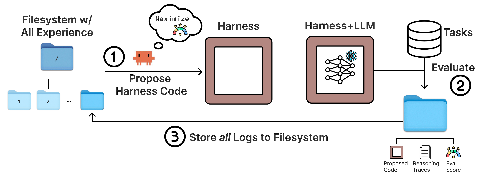
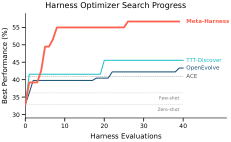
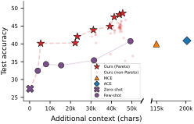
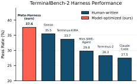
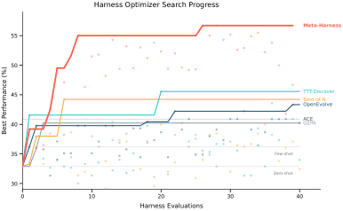
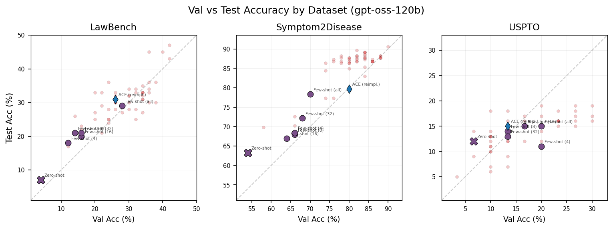

# Meta-Harness：把“调 Prompt”升级为“自动进化整套 Harness”的端到端方法解读

## 一句话先看懂
这篇工作要解决的问题很直接：在 LLM 系统里，真正决定效果的往往不只是模型权重，还包括外围的 **harness**（记什么、检什么、怎么喂给模型的代码）。作者提出的 Meta-Harness，不再依赖手工改规则，而是让 coding agent 在完整历史日志上自动搜索更优的 harness 实现，最终在文本分类、数学推理、Agent 编程三个场景都取得了显著收益。

---

## 1. 论文在解决什么核心痛点？

过去大家做 harness engineering，常见流程是：

1. 人工查看失败样例  
2. 判断可能的改动点  
3. 小幅修改 prompt / memory / retrieval 逻辑  
4. 重新运行评测  

问题在于，这种流程既慢又依赖经验，而且失败原因通常跨多个步骤才显现，单看最终分数很难定位问题。

作者指出，现有 text optimizer（如 OPRO、TextGrad、GEPA、OpenEvolve、TTT-Discover）在这个场景下经常不够用，关键原因是反馈被压缩得过于严重：  
- 只看标量分数  
- 只看短摘要  
- 只看当前候选，不看全历史  

而 harness 是一个长链条行为系统，诊断必须结合 **代码 + 执行轨迹 + 历史候选关系** 才能有效完成。

## 2. 方法核心：Meta-Harness 到底怎么工作？

### 2.1 目标形式化
作者把 harness 优化写成：

$$
H^* = \argmax_{H} \mathbb{E}_{x \sim \mathcal{X}, \tau \sim p_M(H, x)} \; r(\tau, x)
$$

其中：  
- $M$：固定不变的 base model  
- $H$：待优化 harness（代码实现）  
- $x$：任务样本  
- $\tau$：rollout 轨迹  
- $r(\tau, x)$：任务奖励（准确率、通过率等）  

核心是：在固定模型下，直接寻找系统表现最好的 harness 程序。

### 2.2 外循环（outer loop）
Meta-Harness 的循环非常“朴素但关键”：

1. proposer（coding agent）读取历史文件系统  
2. 提出新的 harness 代码  
3. 运行评测并记录代码、分数、执行轨迹  
4. 持续迭代，最终在 Pareto frontier 上选解  

它的关键设计不是复杂的进化算子，而是 **全历史可检索文件系统**。proposer 可以用 `grep/cat` 等操作按需取证，而不是把所有历史一次性塞进 prompt。

### 2.3 为什么这比“摘要反馈”更强？
作者给出一个有说服力的量级对比：  
- 先前方法每步反馈通常在 100～30,000 tokens 级别  
- 本文某些评测单次可产生约 10,000,000 tokens 的诊断信息  

这意味着 Meta-Harness 把优化对象从“短文本提示”升级成了“可执行系统 + 可追溯历史”。

## 3. 方法图解（论文关键图）

> 图解：这张图展示了 Meta-Harness 的三步闭环：左侧是 proposer 在文件系统中读取历史候选的代码、分数与 traces；中间是生成新 harness 并执行评测；右侧把新一轮 artifacts 写回文件系统。横向是迭代时间，纵向可理解为“经验累积深度”。核心不是一次性大上下文，而是可反复检索的外部记忆。

## 4. 实验结果：三个场景都赢了什么？

### 4.1 在线文本分类：更准且更省上下文
- 相比 ACE，Meta-Harness 测试准确率提升 **+7.7** points（48.6% vs 40.9%）  
- 上下文成本显著下降（11.4K vs 50.8K tokens）  
- 与 OpenEvolve / TTT-Discover 相比，约在 **1/10 评测量** 就达到对方最终水平，并最终再高 10+ points  

> 图解：左图是学习曲线。横轴是评测次数（evaluation count），纵轴是准确率。Meta-Harness 曲线前期爬升更快，约 4 次评测就接近对比方法后期水平，说明它不是“多试出来”，而是“每次提案质量更高”。

> 图解：这张 Pareto 图横轴是上下文 token 成本（越左越省），纵轴是准确率（越高越好）。Meta-Harness 前沿整体位于其他方法“左上方”，表示同等成本下更准，或同等准确率下更省。

### 4.2 IMO 级数学推理（检索增强）：跨模型迁移有效
单次搜索得到的 retrieval harness，在 5 个 hold-out 模型上相对“无检索”平均提升 **+4.7** points。  
它甚至整体优于固定 BM25 基线（平均再高 1.3 points），并避免了 dense retrieval 在部分模型上的退化。

### 4.3 TerminalBench-2（Agent 编程）：自动超过强手工基线
- Opus 4.6：76.4%，超过 Terminus-KIRA（74.7%）  
- Haiku 4.5：37.6%，超过已报道的 next-best（35.5%）  

> 图解：右图是 TerminalBench-2 排行。纵轴可理解为 pass rate，横向是不同 agent/harness。Meta-Harness 在 Haiku 4.5 组达到榜首，在 Opus 4.6 组也进入最前列，说明自动搜索已经具备“挑战顶级手工工程”的能力。

## 5. 最有价值的消融结论

作者做了一个非常关键的 interface ablation（在线文本分类）：

- Scores Only：中位 34.6，最好 41.3  
- Scores + Summary：中位 34.9，最好 38.7  
- Full Meta-Harness（含原始 traces）：中位 50.0，最好 56.7  

结论很明确： **execution traces 是决定性信息源**。只给分数或摘要，会丢失“为什么失败”的因果线索。

## 6. 附录中的行为证据：它真的在做因果诊断

论文在 TerminalBench-2 的搜索轨迹里展示了 proposer 的行为演化：

1. 早期把“结构修复 + prompt 改写”同时改动，结果连续退化  
2. 第 3 轮明确识别混杂因素：真正有害的是 prompt cleanup 改写  
3. 随后通过隔离变量进行验证  
4. 最终转向“更安全的增量改动”（环境快照注入），拿到最好结果  

这说明 Meta-Harness 不是随机 mutation，而是在历史证据上进行“可解释的错误归因 + 策略转向”。

> 图解：这张完整学习曲线横轴仍是评测次数，纵轴是搜索集准确率，并按数据集显示 best-so-far 轨迹。Meta-Harness 早期就跨过基线区间，后续持续抬升而非震荡，体现了“利用历史经验进行稳定改进”的特征。

## 7. 三个已发现的 harness 模板

### 7.1 文本分类 harness
- Draft Verification：先给草稿标签，再检索支持/反例做二次验证（低成本）  
- Label-Primed Query：先显式暴露标签空间，再构造覆盖样本 + 对比样本（高精度）  

### 7.2 数学检索 harness
按题型路由到 combinatorics / geometry / number theory / default 四条检索策略，不同路由采用不同 rerank 与去重策略，而不是“一套检索打天下”。

### 7.3 TerminalBench harness
最有效改动之一是“环境快照 bootstrap”：在第一轮推理前就告知 agent 可用语言、包管理器、目录结构、内存等，减少前几轮盲探测。

> 图解：这张图横轴是 search-set 表现，纵轴是 test-set 表现，虚线为 $y = x$。散点整体贴近对角线，表示搜索指标与最终泛化高度一致，说明发现的策略不是单纯“刷搜索集”。

## 8. 结论与方法论判断

- 这篇论文真正的创新点不是“又一个优化器”，而是把优化接口升级为 **可检索的全历史经验库**。  
- 它把“调 Prompt”问题提升为“调程序策略”问题，更符合 Agent 系统的真实工程形态。  
- 在当前阶段，这类方法对 proposer 能力依赖较强（文中主要使用强 coding agent），但随着 coding agent 能力提升，收益很可能继续放大。  
- 从实践角度，作者给出的建议非常实用：先写好 skill、构建困难 search set、日志结构化、先做轻量验证再跑重评测。  

---

> 本文参考自 [Meta-Harness: End-to-End Optimization of Model Harnesses](https://arxiv.org/abs/2603.28052)