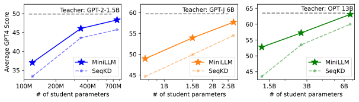
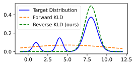
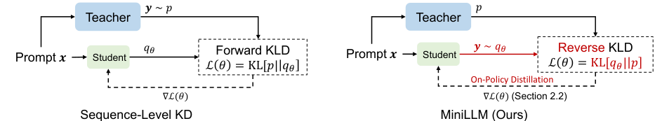
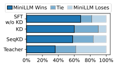
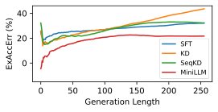
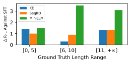
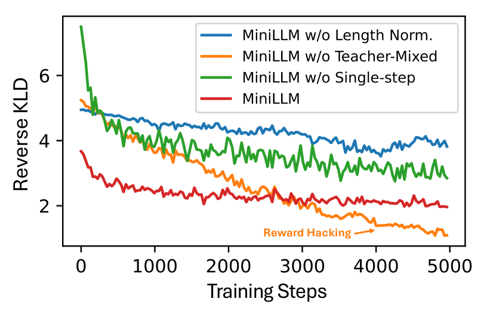
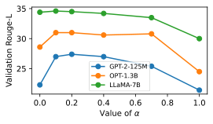
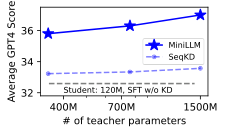
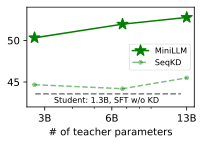

# MiniLLM：用 Reverse KL 把大模型“蒸馏”成小模型的关键一步

## 一句话总结
这篇工作解决的是 **白盒 LLM 蒸馏** 的核心难题：传统 Forward KL 会让学生模型“学到低概率噪声”。作者把目标换成 Reverse KL，并用 on-policy 训练，把学生模型变成更精准、更稳定的小模型。

## 背景与问题动机
大模型好用但成本高，知识蒸馏是常规解法。问题在于：
- 现有 LLM 蒸馏多是 **黑盒** （只拿到老师生成文本）。
- **白盒蒸馏** （可访问老师分布）在 LLM 场景仍欠缺体系化方法。
- 经典 KD 目标是 Forward KL，这在生成任务中会让学生模型“覆盖所有模式”，导致生成质量下降。

直观地说：老师分布很复杂，学生容量有限，Forward KL 会逼学生去“照顾所有小概率区域”，结果就是 **更不靠谱的输出** 。

## 核心思路：用 Reverse KL 让学生“抓住主干”
论文提出 **MiniLLM** ：用 Reverse KL 作为目标函数，鼓励学生模型去拟合老师分布的主要模式，避免给低概率区域过高权重。

目标函数为：

$$
\theta = \arg \min_\theta \mathbb{E}_{x \sim p_x, y \sim q_\theta} \left[-\log \frac{p(y|x)}{q_\theta(y|x)}\right]
$$

这意味着：只关注学生自己会生成的样本，再让老师“打分”反馈，属于 **on-policy 蒸馏** 。

## 方法细节：从 RL 视角做蒸馏
作者把生成过程视作策略优化，并用 Policy Gradient 推导梯度。核心梯度形式：

$$
\nabla \mathcal{L}(\theta) = -\mathbb{E}_{x, y \sim q_\theta} \sum_{t=1}^T (R_t - 1) \nabla \log q_\theta(y_t | y_{<t}, x)
$$

其中奖励为：

$$
R_t = \sum_{t'=t}^T \log \frac{p(y_{t'}|y_{<t'},x)}{q_\theta(y_{t'}|y_{<t'},x)}
$$

**问题** ：策略梯度高方差、容易 reward hacking、倾向生成短文本。  
作者给了三个关键稳定策略：

### 1) Single-Step Decomposition
把长期奖励拆成单步奖励，降低方差、加速收敛。  
它让 $r_t=\log \frac{p}{q}$ 直接计算，而不完全依赖采样。

### 2) Teacher-Mixed Sampling
采样分布混合老师与学生：

$$
\widetilde{p} = \alpha p + (1-\alpha) q_\theta
$$

这样能避免学生在 early stage 走向坏模式（重复、空回复）。

### 3) Length Normalization
用长度归一化解决“越短越高分”的偏差：

$$
R^{\text{Norm}}_{t+1} = \frac{1}{T-t-1}\sum_{t'=t+1}^T \log \frac{p}{q}
$$

## 训练算法全流程
流程类似 RLHF：
- Phase 1：先做常规 SFT，选最低验证损失的 checkpoint。
- Phase 2：进行 on-policy 蒸馏，优化 Reverse KL + 预训练损失。

最终更新：

$$
\theta \leftarrow \theta - \eta \left[(\nabla \mathcal{L})_{\text{Single}} + (\nabla \mathcal{L})_{\text{Long}}^{\text{Norm}} + \nabla \mathcal{L}_{\text{PT}}\right]
$$

## 实验设置与评测
任务是 **instruction-following** ，数据来自 Dolly-15K。  
评测集包含 DollyEval, SelfInst, VicunaEval, S-NI, UnNI。

对比基线：
- **SFT w/o KD**
- **Word-level KD**
- **SeqKD**

评估指标：
- Rouge-L
- GPT-4 反馈分
- 人类偏好

## 结果：MiniLLM 全面优于传统 KD
核心结论：
- 几乎所有模型规模上，MiniLLM 全面优于 KD 和 SeqKD。
- 部分情况下学生模型甚至超越老师（降低 exposure bias）。
- 在长文本生成上优势更明显。

> 图解：横轴为学生模型大小，纵轴为 GPT-4 评分；MiniLLM 在三种模型家族里都显著优于 SeqKD，且规模越大收益越明显。

## 关键分析

### 1) Reverse KL 的直观好处
Forward KL 会“覆盖所有模式”，Reverse KL 强调主模式。

> 图解：高斯混合的拟合实验，Reverse KL 会收敛到主峰，Forward KL 会试图覆盖所有峰而导致分布变宽。

### 2) 训练目标的行为差异
SeqKD 是“老师给样本，学生背答案”，而 MiniLLM 是“学生生成，老师打分”。

> 图解：左侧 SeqKD 强行记忆老师样本，右侧 MiniLLM 通过老师反馈优化学生的自生成质量。

### 3) 人类偏好更好
MiniLLM 在人工对比中胜率更高。

> 图解：横轴为模型对比，纵轴为人类偏好；MiniLLM 明显优于 KD 和 SeqKD。

### 4) Exposure Bias 更低
生成越长，错误累积越少。

> 图解：横轴为生成长度，纵轴为 ExAccErr；MiniLLM 曲线显著更低，说明训练-推理不一致问题更小。

### 5) Calibration 更好
KD/SeqKD 会明显恶化 ECE，而 MiniLLM 缓解了校准崩坏。

### 6) 长文本优势更明显
对长回答，MiniLLM 的 Rouge-L 提升最明显。

> 图解：横轴为答案长度区间，纵轴为 Rouge-L；长文本区间 MiniLLM 提升显著。

### 7) 生成多样性不明显下降
Reverse KL 不一定牺牲多样性，作者用 Dist-4 和 Loss 证明仍能保持覆盖度。

### 8) 优化策略的必要性
去掉 Teacher-mixed 或 Length Norm 会严重退化。

> 图解：训练过程 Reverse KL 曲线；缺失策略会导致训练波动大或陷入坏模式。

## 关键消融：老师混合比例的影响
不同模型对 $\alpha$ 的敏感度不同，但 $\alpha=0.2$ 在多模型上稳定。

> 图解：横轴为 $\alpha$，纵轴为验证 Rouge-L；中等混合比例普遍最稳定。

## 尺度规律与可扩展性
更大的老师通常带来更强的学生提升，并且 MiniLLM 的提升 **单调稳定** 。

> 图解：横轴为老师规模，纵轴为学生分数；MiniLLM 始终高于 SeqKD。

> 图解：OPT 系列下的尺度规律，与 GPT-2 一致。

## 结论与启示
MiniLLM 证明了：  
在白盒场景下，用 **Reverse KL + on-policy 训练** 才是更合理的蒸馏路径。  
核心收益是：  
- 更高精度  
- 更低 exposure bias  
- 更好校准  
- 长文本表现更强  

这使得小模型更适合实际部署，而不是仅仅“模仿老师的样子”。

> 本文参考自 [MiniLLM: Knowledge Distillation of Large Language Models](https://arxiv.org/pdf/2306.08543)